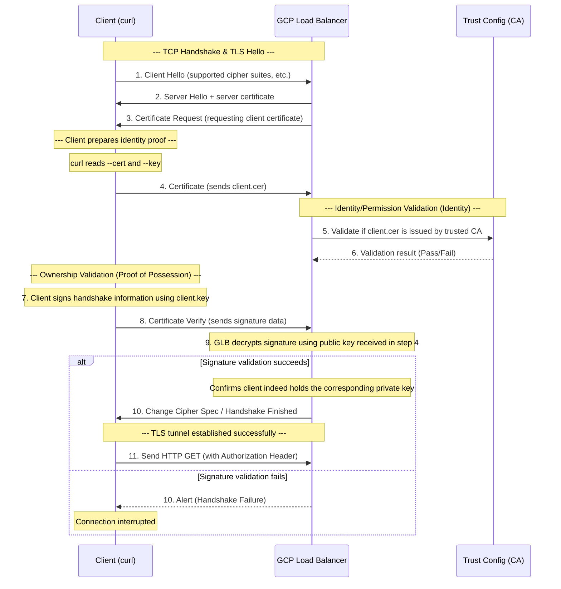

# Detailed Explanation of mTLS Verification and Private Key Validation (mtls-key.md)

This document aims to explain how certificates and private keys collaborate during the validation process when using `curl` to initiate mTLS requests, as well as the specific timing and principles of private key validation.

## 1. Problem Analysis: curl Command Breakdown

When we run the following command:
```bash
curl --key client.key --cert ./client.cer \
     --request GET \
     --url https://fqdn \
     --header 'Authorization: Basic'
```

- `--cert ./client.cer`: Provides the client's **public key certificate**, used to declare identity to the server.
- `--key client.key`: Provides the client's **private key**, used to prove that you indeed possess the certificate (proof of ownership).

## 2. Complete mTLS Validation Flow (TLS Handshake)

During the TLS handshake process, the core validation of mTLS is divided into two dimensions: **Identity Verification** and **Ownership Verification (Proof of Possession)**.

### Phase Flow Diagram

```infographic
infographic list-row-simple-horizontal-arrow
data
  title mTLS Handshake and Validation Core Flow
  items
    - label 1. Negotiation
      desc Client Hello / Server Hello (Establish base connection)
    - label 2. Identity Request
      desc GLB issues Certificate Request (Ask for client cert)
    - label 3. Identity Submission
      desc Client sends client.cer (Declare identity)
    - label 4. CA Validation
      desc GLB verifies cert via Trust Config (Identity)
    - label 5. Key Proof
      desc Client sends Certificate Verify (Prove private key ownership)
    - label 6. Completion
      desc Secure tunnel established, start business requests
```



## 3. At which specific step is the private key validated?

Private key validation occurs during the **Certificate Verify** step.

### Core Mechanism: Proof of Possession
1. **Client Operation**: After sending the `Certificate` (public key certificate), the client collects the digest (Hash) of all handshake messages up to this point, and digitally signs this digest using the **private key** corresponding to `--key`.
2. **Message Sending**: This signature is packaged in the `Certificate Verify` message and sent to the server.
3. **Server Validation**: After receiving the message, the server (such as GCP GLB) takes the **public key** obtained from the `Certificate` message previously, and verifies the signature by decryption.

> [!IMPORTANT]
> **The private key is never transmitted over the network to the server.**
> The essence of validation is: the server infers that you indeed possess the private key through the fact that "you can generate the correct signature using the private key."

## 4. Key Validation Point Comparison

| Validation Dimension | Validation Target | Validation Timing | Validation Logic |
| :--- | :--- | :--- | :--- |
| **Identity/Compliance** | `client.cer` | `Certificate` message phase | Check if certificate chain is complete, if issuing CA is in `Trust Config`, if expired. |
| **Ownership/Proof** | `client.key` | `Certificate Verify` phase | Validate if client can provide **valid digital signature** matching the certificate. |

## 5. When is validation completed?

The entire mTLS validation is completed **before the TLS handshake finishes (Finished)**.

1. **Certificate validation ends**: At step 6, when GLB confirms CA trust relationship.
2. **Private key validation ends**: At step 9, when GLB validates `Certificate Verify` signature successfully.
3. **Final confirmation**: Once the handshake is complete, encrypted channel established, subsequent HTTP headers like `Authorization: Basic` will be decrypted and subjected to business logic authorization checks by backend applications or load balancers.

## 6. Precautions and Best Practices

- **Permission Checks**: Ensure the `curl` process has permission to read `client.key`.
- **Matching**: `--key` must strictly pair with the public key in `--cert`, otherwise step 7 will generate an error during signature generation or cause step 9 validation to fail.
- **Troubleshooting**: If you see `alert handshake failure`, it usually means the certificate chain is incomplete or Trust Config does not include the corresponding Root CA; if prompted about key mismatch, it's a file reference error.