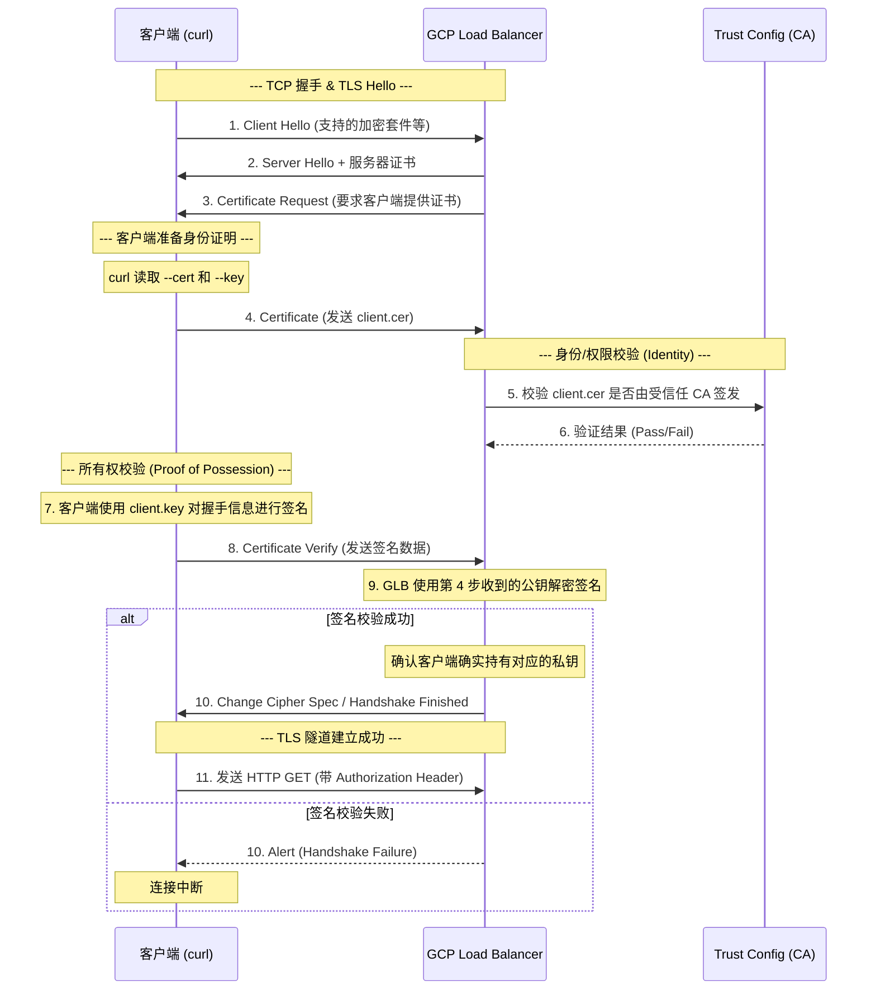
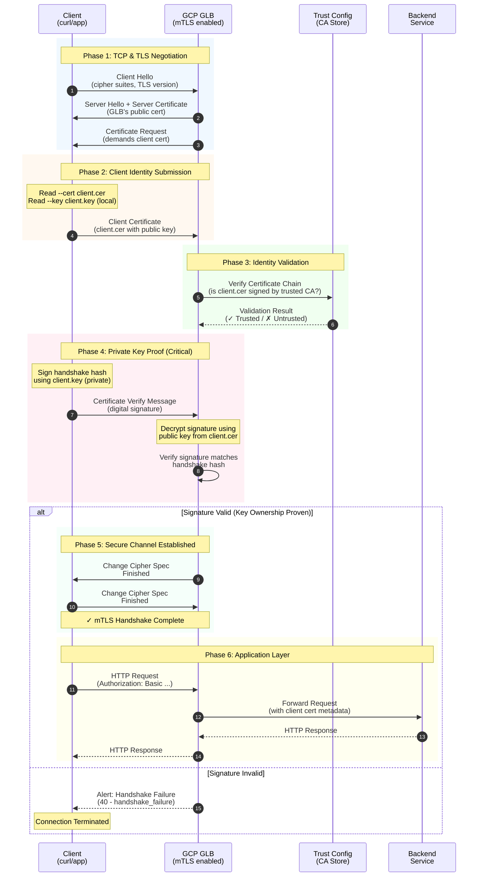
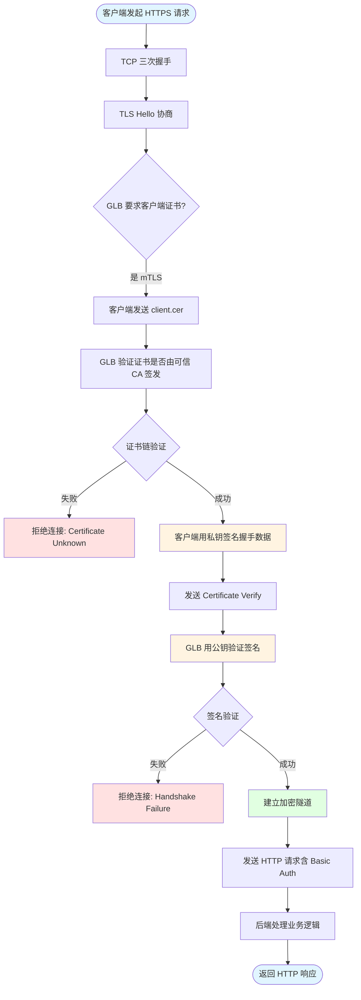
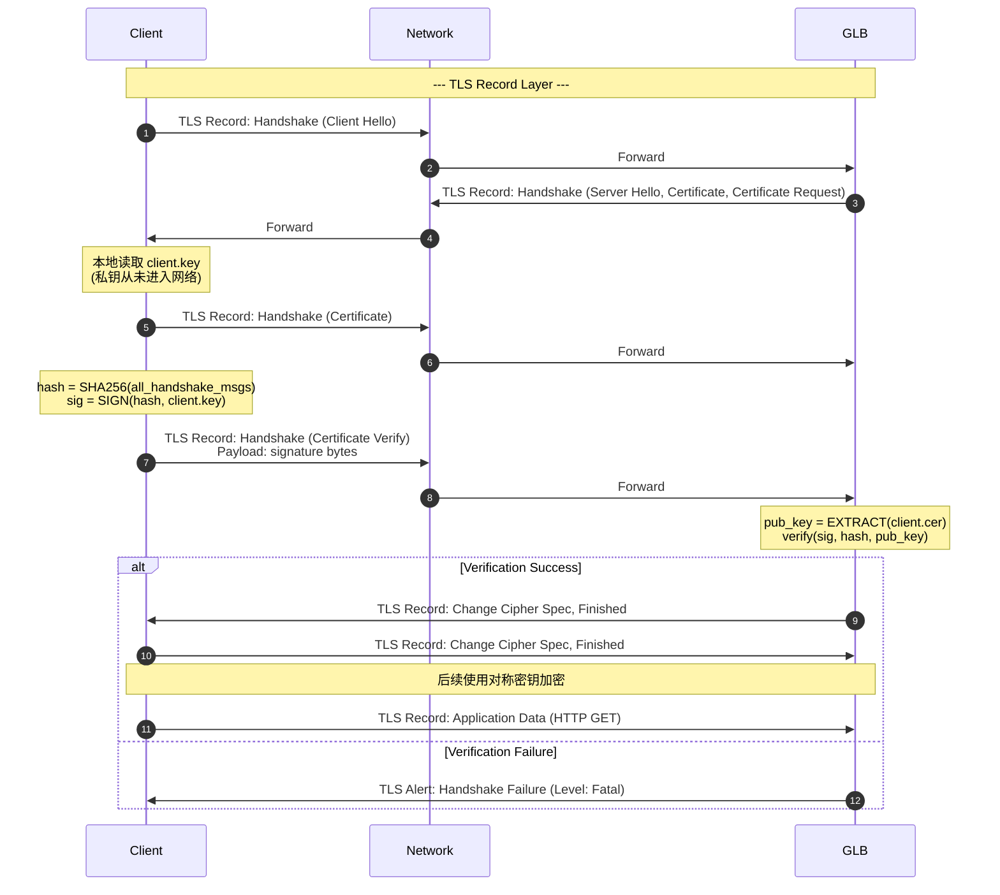

# mTLS 验证与私钥校验详解 (mtls-key.md)

本文档旨在解释在使用 `curl` 发起 mTLS 请求时，证书（Certificate）与私钥（Private Key）在整个验证过程中是如何协作的，以及私钥校验的具体时机和原理。

## 1. 问题分析：curl 命令分解

当我们运行以下命令时：
```bash
curl --key client.key --cert ./client.cer \
     --request GET \
     --url https://fqdn \
     --header 'Authorization: Basic'
```

- `--cert ./client.cer`: 提供客户端的**公钥证书**，用于向服务器声明身份。
- `--key client.key`: 提供客户端的**私钥**，用于证明你确实拥有该证书（所有权证明）。

## 2. mTLS 验证全流程 (TLS Handshake)

在 TLS 握手过程中，mTLS 的核心校验分为两个维度：**身份校验（Identity）**和**所有权校验（Ownership/Proof of Possession）**。

### 阶段流转图

```infographic
infographic list-row-simple-horizontal-arrow
data
  title mTLS 握手与校验核心流程
  items
    - label 1. 协商
      desc Client Hello / Server Hello (建立连接基础)
    - label 2. 身份请求
      desc GLB 发起 Certificate Request (要求客户端证书)
    - label 3. 身份提交
      desc 客户端发送 client.cer (声明身份)
    - label 4. CA 校验
      desc GLB 结合 Trust Config 验证证书合法性 (Identity)
    - label 5. 私钥证明
      desc 客户端发送 Certificate Verify (证明持有私钥)
    - label 6. 握手完成
      desc 建立加密隧道，开始发送业务请求
```



## 3. 私钥 (Key) 具体在哪个过程中做校验？

私钥的校验发生在 **Certificate Verify** 这一步骤中。

### 核心机制：所有权证明 (Proof of Possession)
1. **客户端操作**：在发送完 `Certificate` (公钥证书) 后，客户端会收集目前为止所有握手消息的摘要（Hash），并使用 `--key` 对应的**私钥**对该摘要进行数字签名。
2. **消息发送**：这个签名封装在 `Certificate Verify` 消息中发送给服务器。
3. **服务端校验**：服务器（如 GCP GLB）收到消息后，取出之前在 `Certificate` 消息中得到的**公钥**，对签名进行解密验证。

> [!IMPORTANT]
> **私钥永远不会通过网络发送给服务器。**
> 校验的本质是：服务器通过“你能用私钥生成正确的签名”这一事实，反推你确实拥有该私钥。

## 4. 关键验证点对比

| 验证维度 | 校验对象 | 校验时机 | 校验逻辑 |
| :--- | :--- | :--- | :--- |
| **身份/合规性** | `client.cer` | `Certificate` 消息阶段 | 检查证书链是否完整、签发 CA 是否在 `Trust Config` 中、是否过期。 |
| **所有权/证明** | `client.key` | `Certificate Verify` 阶段 | 校验客户端是否能提供与证书配套的**有效数字签名**。 |

## 5. 什么时候完成校验？

整个 mTLS 的校验在 **TLS 握手完成（Finished）之前**就已经全部结束。

1. **证书校验结束**：在第 6 步，GLB 确认 CA 信任关系时。
2. **私钥校验结束**：在第 9 步，GLB 验证 `Certificate Verify` 签名通过时。
3. **最终确认**：一旦握手完成，加密通道建立，后续的 `Authorization: Basic` 等 HTTP Header 才会被解密并由后端应用或负载均衡器进行业务逻辑上的授权校验。

## 6. 注意事项与最佳实践

- **权限检查**：确保 `curl` 进程有权限读取 `client.key`。
- **匹配性**：`--key` 必须与 `--cert` 中的公钥严格配对，否则在第 7 步生成签名时就会报错或导致第 9 步校验失败。
- **错误排查**：如果看到 `alert handshake failure`，通常意味着证书链不完整或 Trust Config 未包含对应的 Root CA；如果提示密钥不匹配，则是文件引用错误。


# mTLS GLB 工作流程详解

## 问题分析

您想了解在 Google Cloud 环境中使用 mTLS GLB (Global Load Balancer) 的完整工作流程,特别关注:
1. 客户端私钥的使用时机和交互过程
2. 验证流程的准确性
3. 优化流程图的可读性

## 流程图验证结果

**您提供的流程图是正确的**,核心要点都已涵盖:
- ✅ TLS 握手协商阶段
- ✅ 证书请求与提交
- ✅ CA 验证身份
- ✅ 私钥所有权证明 (Certificate Verify)
- ✅ 安全隧道建立

## 优化后的完整流程图



## 关键时间点说明

### 私钥使用时机详解

| 阶段 | 私钥状态 | 说明 |
|------|---------|------|
| **Step 1-3** | 未使用 | TLS 协商,私钥仍在客户端本地 |
| **Step 4** | 未使用 | 仅发送公钥证书 (client.cer) |
| **Step 5-6** | 未使用 | GLB 验证证书链,私钥未参与 |
| **Step 7-8** | **关键使用** | 客户端用私钥签名握手数据 |
| **Step 9** | 未传输 | GLB 用公钥验证签名,私钥从未离开客户端 |
| **Step 10+** | 不再使用 | 后续使用会话密钥加密通信 |

### Certificate Verify 核心机制

```text
客户端操作:
1. 收集所有握手消息 (Client Hello → Certificate)
2. 计算握手消息的哈希值: hash = SHA256(handshake_messages)
3. 使用私钥签名: signature = RSA_Sign(hash, client.key)
4. 发送签名到 GLB

GLB 验证:
1. 使用相同方法计算握手消息哈希
2. 从 client.cer 提取公钥
3. 解密签名: decrypted_hash = RSA_Verify(signature, public_key)
4. 对比: decrypted_hash == hash → 验证通过
```

## 简化概念流程图



## 数据包层面的流程



## 注意事项

### 安全要点
1. **私钥保护**: 
   - 私钥 (`client.key`) 全程保留在客户端,从未在网络传输
   - 只传输签名结果,GLB 无法反推私钥

2. **双向验证**:
   - GLB → Client: Server Certificate 证明 GLB 身份
   - Client → GLB: Client Certificate + Signature 证明客户端身份

3. **信任链**:
   ```bash
   Root CA (Trust Config)
     └── Intermediate CA (可选)
           └── client.cer (客户端证书)
   ```

### GCP 特定配置

```bash
# 创建 Trust Config
gcloud certificate-manager trust-configs create my-trust-config \
    --trust-store=trust-anchor=ca-pool-id

# 配置 GLB 使用 mTLS
gcloud compute target-https-proxies update my-proxy \
    --certificate-map=my-cert-map \
    --server-tls-policy=my-tls-policy \
    --client-certificate-mode=REQUIRE
```

### 客户端测试命令

```bash
# 正确的 mTLS 请求
curl -v https://example.com \
    --cert client.cer \
    --key client.key \
    --cacert server-ca.pem

# 错误示例 1: 缺少客户端证书
curl https://example.com
# 结果: TLS alert (certificate required)

# 错误示例 2: 证书与私钥不匹配
curl https://example.com \
    --cert wrong.cer \
    --key client.key
# 结果: Certificate Verify 失败
```

## 最佳实践

1. **证书管理**:
   - 使用短期证书 (90 天有效期)
   - 实施自动轮换机制
   - 私钥权限设置为 `600` (仅所有者可读写)

2. **Trust Config 配置**:
   - 定期更新 CA 证书池
   - 启用 CRL (Certificate Revocation List) 检查
   - 配置 OCSP Stapling 提升性能

3. **监控告警**:
   ```bash
   # 监控 mTLS 握手失败
   gcloud logging read "resource.type=http_load_balancer AND \
       jsonPayload.statusDetails=~'certificate.*'" \
       --limit 50 --format json
   ```

---

**总结**: mTLS 的核心安全机制在于 **Certificate Verify 阶段**,通过数字签名证明客户端拥有与证书配对的私钥,而私钥本身从未离开客户端,这是零信任架构的基础。
