# GCP Trust Config 证书验证流程详解

## 概述

本文档详细说明 GCP Certificate Manager Trust Config 在 GLB mTLS 认证中的作用，以及当用户更新客户端证书时，Trust Config 需要如何调整。

## 核心概念

### Trust Config 的作用

Trust Config 是 GCP Certificate Manager 中用于定义**受信任的 CA (Certificate Authority)** 的配置资源。在 mTLS 场景下，GLB 使用 Trust Config 来验证客户端证书的有效性。

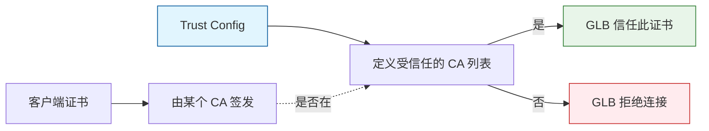

### Trust Config 组成部分

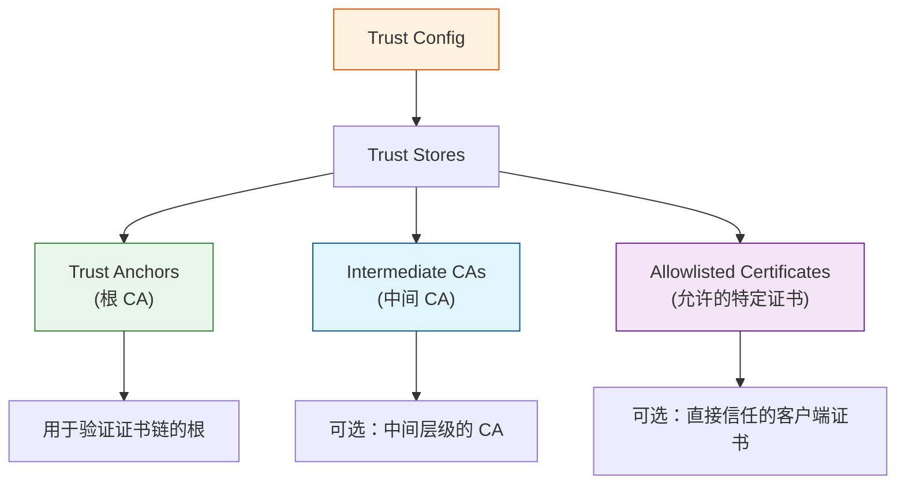

## 完整 mTLS 验证流程

### 流程图

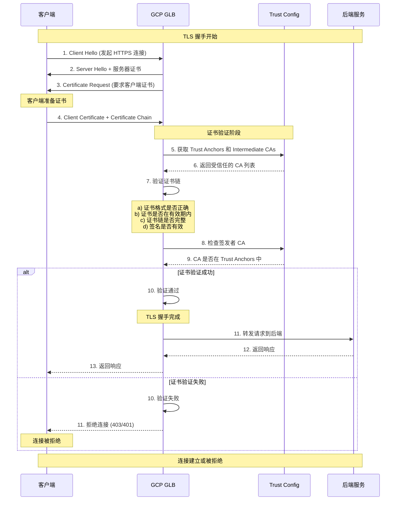

### 详细验证步骤

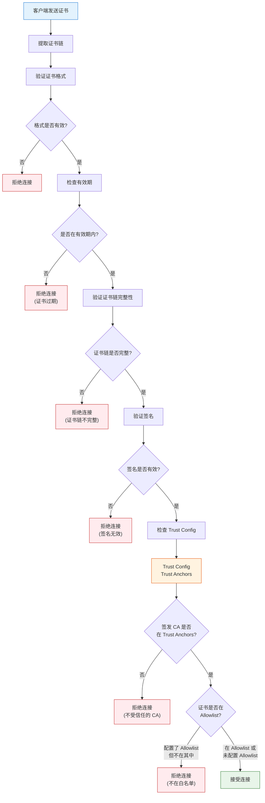

## 证书更新场景

### 场景 1: 客户端证书续期（CA 不变）

当客户端证书到期需要续期，但仍由**相同的 CA** 签发新证书时：

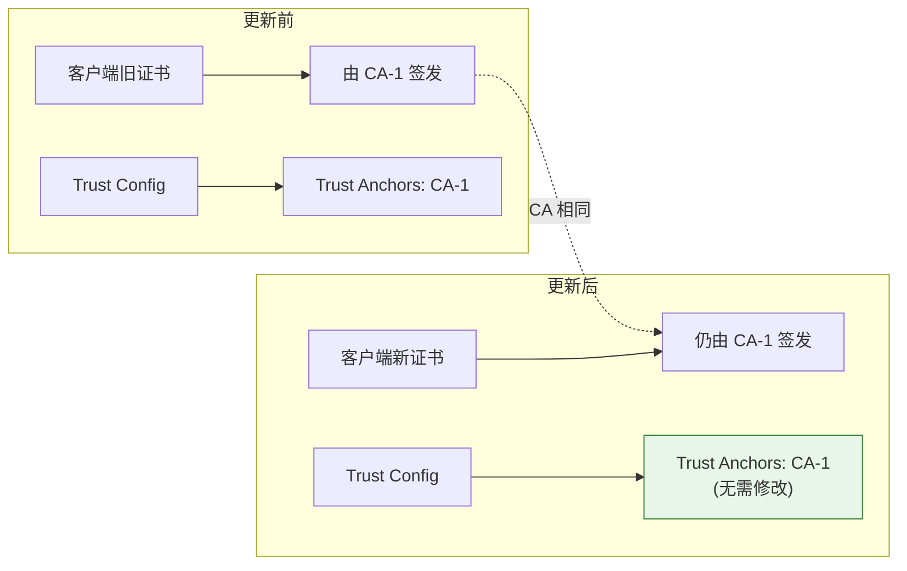

> [!NOTE]
> **结论**: Trust Config **无需修改**，只需客户端更新证书即可。

### 场景 2: 客户端证书迁移到新 CA

当客户端证书需要由**新的 CA** 签发时：

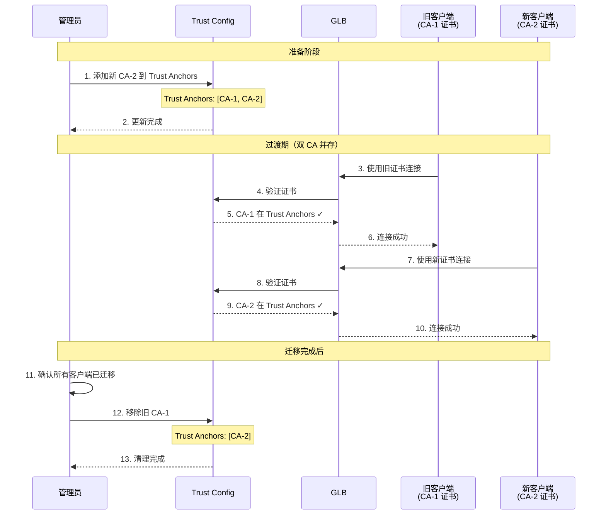

#### 详细步骤

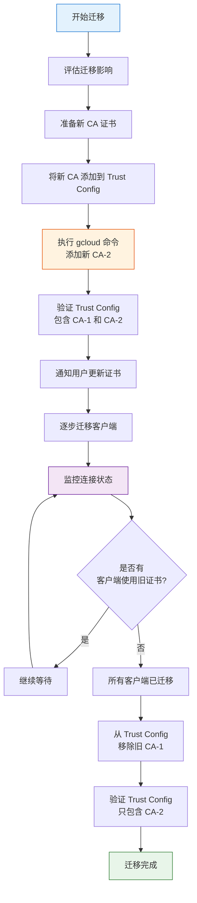

### 场景 3: CA 证书本身过期或更新

当 CA 根证书需要更新时：

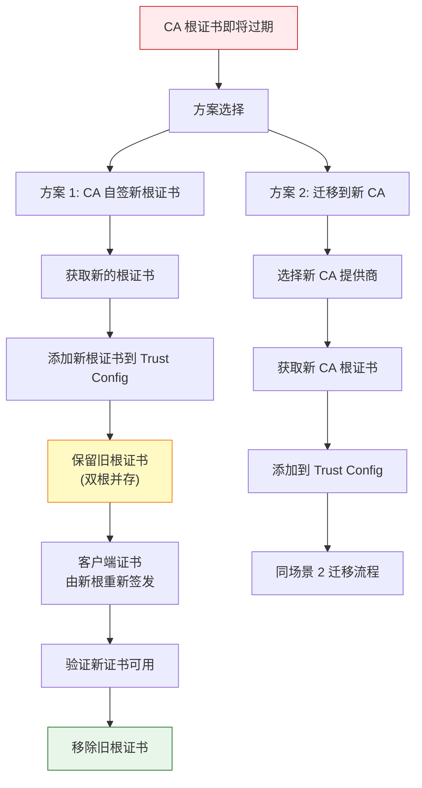

## Trust Config 操作指南

### 查看当前 Trust Config

```bash
# 列出所有 Trust Configs
gcloud certificate-manager trust-configs list \
    --location=global

# 查看详细信息
gcloud certificate-manager trust-configs describe TRUST_CONFIG_NAME \
    --location=global \
    --format=yaml

# 使用验证脚本
./verify-trust-configs.sh
```

### 添加新的 CA 证书

```bash
# 方法 1: 创建新的 Trust Config（首次创建）
gcloud certificate-manager trust-configs import my-trust-config \
    --location=global \
    --trust-anchor=file=root-ca.pem,pem-certificate \
    --description="Trust config for client authentication"

# 方法 2: 更新现有 Trust Config（添加新 CA）
# 注意: import 命令会覆盖现有配置，需要包含所有 CA
gcloud certificate-manager trust-configs import my-trust-config \
    --location=global \
    --trust-anchor=file=old-ca.pem,pem-certificate \
    --trust-anchor=file=new-ca.pem,pem-certificate \
    --description="Updated trust config with new CA"
```

> [!WARNING]
> `gcloud certificate-manager trust-configs import` 命令会**完全替换**现有配置。
> 
> 更新时必须包含所有需要保留的旧 CA 证书！

### 添加中间 CA

```bash
gcloud certificate-manager trust-configs import my-trust-config \
    --location=global \
    --trust-anchor=file=root-ca.pem,pem-certificate \
    --intermediate-ca=file=intermediate-ca.pem,pem-certificate \
    --description="Trust config with intermediate CA"
```

### 完整更新流程示例

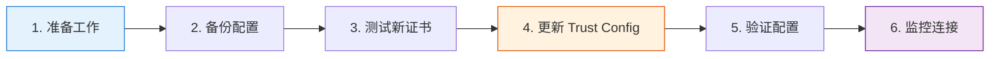

#### 步骤 1: 准备工作

```bash
# 检查当前配置
./verify-trust-configs.sh > current-config-backup.txt

# 确认当前包含哪些 CA
gcloud certificate-manager trust-configs describe my-trust-config \
    --location=global \
    --format=yaml > trust-config-backup.yaml
```

#### 步骤 2: 准备 CA 证书文件

```bash
# 假设你有以下文件
ls -la *.pem

# 输出示例:
# old-root-ca.pem          (现有的 CA)
# new-root-ca.pem          (新添加的 CA)
# intermediate-ca.pem      (可选的中间 CA)
```

#### 步骤 3: 验证证书文件

```bash
# 验证证书格式
openssl x509 -in old-root-ca.pem -text -noout
openssl x509 -in new-root-ca.pem -text -noout

# 检查证书有效期
openssl x509 -in new-root-ca.pem -noout -dates

# 输出示例:
# notBefore=Jan  1 00:00:00 2024 GMT
# notAfter=Dec 31 23:59:59 2034 GMT
```

#### 步骤 4: 更新 Trust Config

```bash
# 更新配置（包含新旧 CA）
gcloud certificate-manager trust-configs import my-trust-config \
    --location=global \
    --trust-anchor=file=old-root-ca.pem,pem-certificate \
    --trust-anchor=file=new-root-ca.pem,pem-certificate \
    --description="Updated: Added new CA for migration"

# 等待配置生效（通常几秒钟）
sleep 5
```

#### 步骤 5: 验证更新

```bash
# 重新运行验证脚本
./verify-trust-configs.sh

# 确认输出中包含两个 Trust Anchors
# Trust Anchor #1: old-root-ca
# Trust Anchor #2: new-root-ca
```

#### 步骤 6: 测试连接

```bash
# 使用旧证书测试（应该成功）
curl -v --cert old-client.crt --key old-client.key https://your-api.example.com

# 使用新证书测试（应该成功）
curl -v --cert new-client.crt --key new-client.key https://your-api.example.com
```

## 证书更新决策树

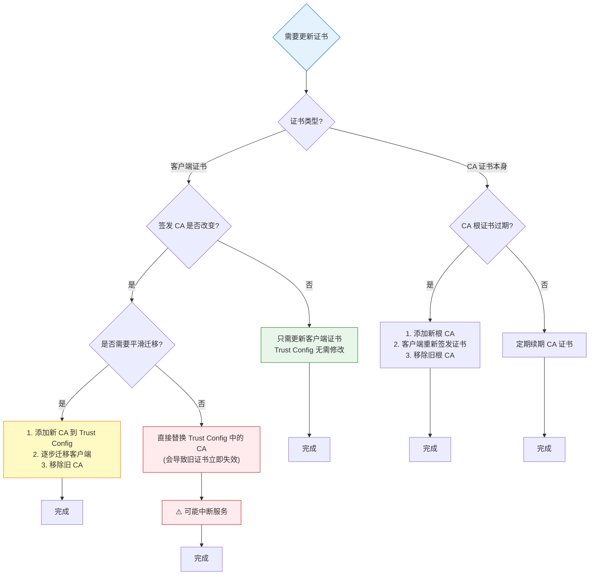

## 常见问题与排查

### 问题 1: 客户端连接被拒绝

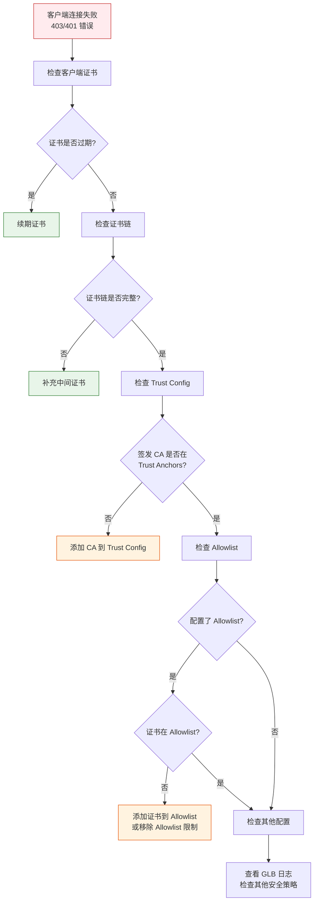

### 排查步骤

```bash
# 1. 验证客户端证书
openssl x509 -in client.crt -text -noout | grep -E "(Issuer|Not Before|Not After)"

# 2. 验证证书链
openssl verify -CAfile root-ca.pem -untrusted intermediate-ca.pem client.crt

# 3. 检查 Trust Config
./verify-trust-configs.sh

# 4. 提取证书签发者信息
openssl x509 -in client.crt -noout -issuer

# 5. 对比 Trust Config 中的 CA
# 查看验证脚本输出的 Trust Anchors，确认 Issuer 是否匹配
```

### 问题 2: 更新 Trust Config 后旧证书无法连接

**原因**: 使用 `import` 命令替换配置时，遗漏了旧的 CA。

**解决方案**:

```bash
# 1. 从备份中恢复旧 CA 信息
cat trust-config-backup.yaml

# 2. 重新导入，包含所有 CA
gcloud certificate-manager trust-configs import my-trust-config \
    --location=global \
    --trust-anchor=file=old-ca.pem,pem-certificate \
    --trust-anchor=file=new-ca.pem,pem-certificate

# 3. 验证
./verify-trust-configs.sh
```

### 问题 3: 如何知道证书何时过期？

```bash
# 使用验证脚本
./verify-trust-configs.sh

# 输出会显示:
# Days Remaining: 285 (OK)           - 正常
# Days Remaining: 45 (WARNING)       - 需要关注 (< 90天)
# Days Remaining: 15 (EXPIRING SOON!) - 紧急 (< 30天)
# Days Remaining: -5 (EXPIRED!)      - 已过期
```

## 最佳实践

### 1. 证书生命周期管理

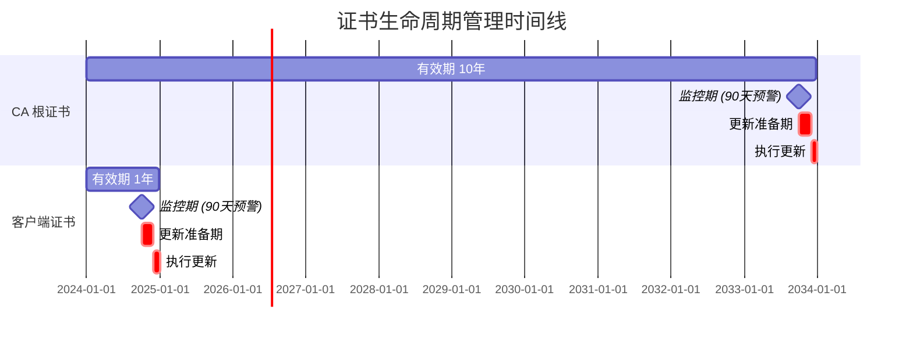

### 2. 定期监控

```bash
# 设置 cron 定期检查（每周一次）
0 9 * * 1 /path/to/verify-trust-configs.sh > /var/log/trust-config-weekly.log 2>&1

# 设置告警脚本
#!/bin/bash
OUTPUT=$(./verify-trust-configs.sh 2>&1)

if echo "$OUTPUT" | grep -E "(EXPIRING SOON|EXPIRED)"; then
    # 发送告警邮件或通知
    echo "$OUTPUT" | mail -s "Trust Config Certificate Alert" admin@example.com
fi
```

### 3. 版本控制

```bash
# 定期导出并提交到版本控制
./verify-trust-configs.sh
git add trust-configs-export/*.yaml
git commit -m "Trust config snapshot - $(date +%Y-%m-%d)"
git push
```

### 4. 文档记录

维护一个变更日志：

```markdown
## Trust Config 变更记录

### 2026-01-23
- **操作**: 添加新 CA (CA-2) 到 Trust Config
- **原因**: 为证书迁移做准备
- **影响**: 无，双 CA 并存
- **执行人**: Admin
- **验证**: ✓ 通过

### 2026-02-15
- **操作**: 移除旧 CA (CA-1)
- **原因**: 所有客户端已迁移完成
- **影响**: 使用旧 CA-1 证书的客户端将无法连接
- **执行人**: Admin
- **验证**: ✓ 通过
```

### 5. 测试环境先行

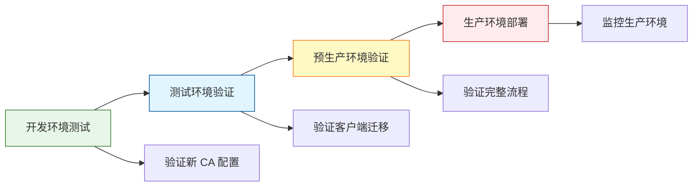

## 总结

### Trust Config 更新场景对照表

| 场景 | Trust Config 是否需要更新 | 更新内容 | 影响 |
|------|-------------------------|---------|------|
| 客户端证书续期（同一 CA） | ❌ 否 | - | 无影响 |
| 客户端证书迁移到新 CA | ✅ 是 | 添加新 CA | 需平滑迁移 |
| CA 根证书更新 | ✅ 是 | 添加新根证书，后移除旧根证书 | 需重新签发客户端证书 |
| 添加新客户端（同一 CA） | ❌ 否 | - | 无影响 |
| 添加新客户端（新 CA） | ✅ 是 | 添加新 CA | 可能需要审批 |

### 关键要点

> [!IMPORTANT]
> 1. **Trust Config 定义了 GLB 信任的 CA 列表**，不是客户端证书本身
> 2. **客户端证书续期（CA 不变）不需要更新 Trust Config**
> 3. **更新 Trust Config 时要包含所有需要保留的 CA**（`import` 是覆盖操作）
> 4. **平滑迁移策略**：先添加新 CA，客户端逐步迁移，确认后移除旧 CA
> 5. **定期监控证书过期时间**，建议提前 90 天开始准备

### 快速参考命令

```bash
# 查看 Trust Config
gcloud certificate-manager trust-configs list --location=global

# 详细信息
gcloud certificate-manager trust-configs describe CONFIG_NAME --location=global

# 验证证书和过期时间
./verify-trust-configs.sh

# 添加新 CA（保留旧 CA）
gcloud certificate-manager trust-configs import CONFIG_NAME \
    --location=global \
    --trust-anchor=file=old-ca.pem,pem-certificate \
    --trust-anchor=file=new-ca.pem,pem-certificate

# 验证证书链
openssl verify -CAfile root-ca.pem client.crt
```

## 相关资源

- [GCP Certificate Manager 官方文档](https://cloud.google.com/certificate-manager/docs)
- [Trust Configs 配置指南](https://cloud.google.com/certificate-manager/docs/trust-configs)
- [GLB mTLS 配置](https://cloud.google.com/load-balancing/docs/mtls)
- [验证脚本使用指南](verify-trust-configs-guide.md)


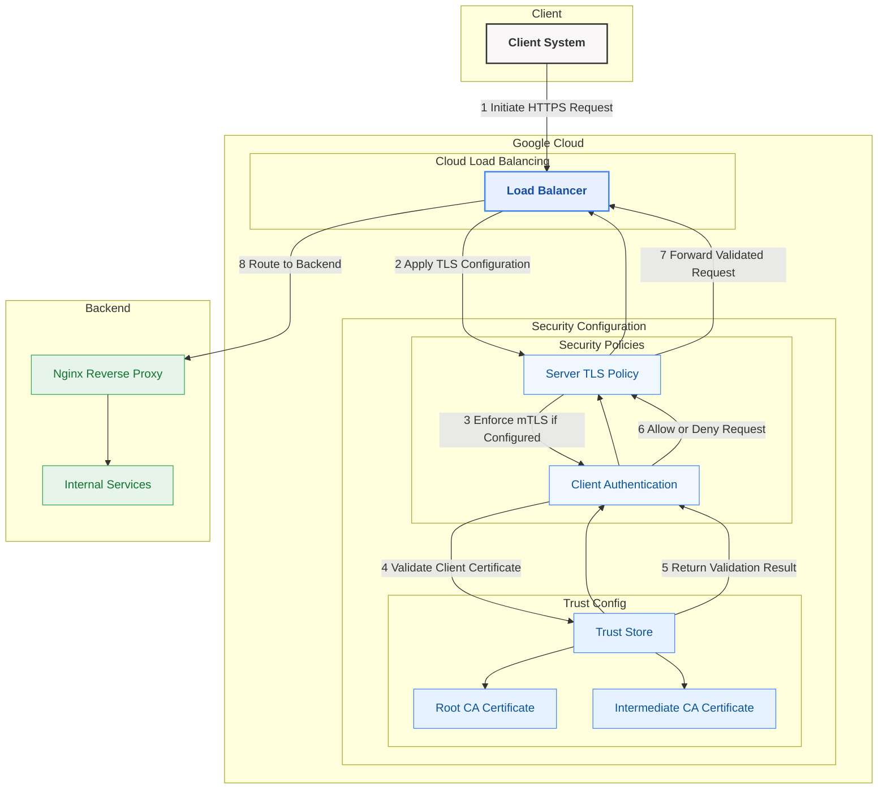
