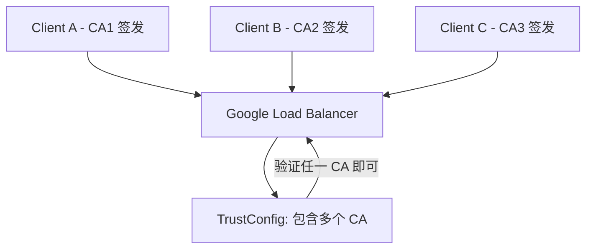

- [trust config Version Control](#trust-config-version-control)
- [Google Cloud Certificate Manager TrustConfig 管理机制](#google-cloud-certificate-manager-trustconfig-管理机制)
  - [一、TrustConfig 支持多个 CA 吗？](#一trustconfig-支持多个-ca-吗)
  - [二、是否支持多个 TrustConfig？](#二是否支持多个-trustconfig)
  - [三、如何添加更多 CA 到现有 TrustConfig？](#三如何添加更多-ca-到现有-trustconfig)
  - [四、示意图说明（Markdown Mermaid）](#四示意图说明markdown-mermaid)
  - [五、总结表格](#五总结表格)

# trust config Version Control


非常棒的问题，尤其在生产环境中，这种“变更可控”是核心要求。我们来详细看看 Google Cloud 的 mTLS 与 Global Load Balancer（GLB） 中的 Trust Config 是否支持版本控制，以及如何实现变通的回滚、备份策略。

⸻

✅ Google Cloud Trust Config 本身是否支持版本控制？

结论：官方的 Trust Config（如 Server TLS Policy / Client TLS Policy / Trust Store）本身 👉 不支持内建的版本控制或回滚机制。

也就是说：
	•	gcloud network-security client-tls-policy update 是覆盖式操作；
	•	一旦执行更新，之前的配置就无法通过命令自动回退；
	•	没有内建的版本记录、历史变更查询等。

⸻

✅ 推荐的版本控制与备份方案（Best Practice）

你可以借助以下手段实现 “逻辑版本控制”：

⸻

1. YAML + Git 管理配置（强烈推荐）
	•	把每个 Trust Config 写成 YAML 文件（包含你自己定义的结构或靠近 API 格式）；
	•	所有变更都通过 PR 提交；
	•	不同分支或文件夹管理 dev/staging/prod；
	•	用 CI/CD 自动部署到 GCP。

📦 示例结构：
```bash
trust-configs/
├── dev/
│   └── trust_config.yaml
├── prd/
│   └── trust_config.yaml
└── backups/
    ├── 2024-04-12-prd.yaml
    └── 2024-04-10-prd.yaml
```


⸻

2. 自动化部署 & 回滚脚本支持

你可以加一个脚本管理：
	•	deploy_trust_config.sh: 读取 YAML，使用 gcloud 部署；
	•	rollback_trust_config.sh <date>：从 backups/ 中读取并恢复；
	•	每次部署前自动备份现有 config，写入 backups/YYYY-MM-DD-ENV.yaml。

⸻

3. GCS 中的版本控制（如果你把 YAML 存在 GCS 中）

GCS 支持开启 Object Versioning：

`gsutil versioning set on gs://your-trust-config-bucket`

之后你可以：
	•	查看旧版本：

`gsutil ls -a gs://your-trust-config-bucket/trust_config.yaml`


	•	恢复旧版本：

`gsutil cp gs://your-trust-config-bucket/trust_config.yaml#123 gs://your-trust-config-bucket/trust_config.yaml`


这样你的 trust_config.yaml 在 GCS 中也能有「历史快照」了 ✅

⸻

4. 用 Terraform 管理 TLS Policies（进阶方案）

如果你已经基础设施即代码（IaC）了，那直接：
	•	用 Terraform 管理 ClientTlsPolicy 和 ServerTlsPolicy
	•	每次改动都审阅、记录
	•	自带版本回滚能力

✅ Terraform 支持：google_network_security_client_tls_policy

⸻

🧠 总结一下

| 功能 | 是否原生支持？ | 推荐实现方式 |
|------|--------------|------------|
| 版本控制 | ❌ | Git + YAML、GCS versioning |
| 回滚旧版本 | ❌ | 手动 or 脚本从备份恢复 |
| 自动备份 | ❌ | 脚本实现，或 GCS versioning |
| 环境隔离（dev/prod） | ✅ 自行区分资源名 | 按 Bucket / 项目 / Resource 名隔离 |
| 审计变更历史 | ❌ | Git 历史 + 手动记录变更日志 |


⸻

如果你想，我可以帮你写一个完整的：
	•	多环境 Trust Config YAML 管理结构
	•	自动部署 / 检查 / 回滚的 shell 工具包
你只需要提供你希望的部署方式（CI？手动？Terraform？）和环境结构。你看如何？


# Google Cloud Certificate Manager TrustConfig 管理机制

这是一个非常关键的问题，涉及到 Google Cloud Certificate Manager 中的 TrustConfig 管理机制，用于在 GLB（Google Load Balancer）层进行 mTLS 客户端证书验证。

## 一、TrustConfig 支持多个 CA 吗？

是的，TrustConfig 完全支持配置多个 CA（或完整证书链），但有如下限制与实现方式：

**支持方式：**

你可以将多个 CA（Root CA 或 Intermediate CA）以 PEM 格式放在一个 TrustConfig 的 `trust_anchors` 列表中：

```yaml
trustConfig:
  name: my-mtls-trustconfig
  description: Trust multiple client CAs
  trustStores:
    default:
      trustAnchors:
        - pemCertificate: |
            -----BEGIN CERTIFICATE-----
            <ClientCA1 Cert>
            -----END CERTIFICATE-----
        - pemCertificate: |
            -----BEGIN CERTIFICATE-----
            <ClientCA2 Cert>
            -----END CERTIFICATE-----
```

这样配置后，GLB 会信任多个 CA 签发的客户端证书，并在 TLS 握手阶段验证它们的合法性。

## 二、是否支持多个 TrustConfig？

目前（截至 2024-06 的官方文档），每个 ServerTlsPolicy 只能引用一个 TrustConfig，但你可以在 TrustConfig 中配置多个 TrustAnchor 来达到支持多个 CA 的目的。

| 项目                       | 是否支持                 | 实现方式                               |
| -------------------------- | ------------------------ | -------------------------------------- |
| 一个 TrustConfig 配置多个 CA | 支持                     | trustAnchors 中配置多个 CA 证书         |
| 一个 ServerTlsPolicy 引用多个 TrustConfig | 不支持                   | 用多个 TLS Policy 分发流量              |
| 多个 ServerTlsPolicy 绑定不同后端服务 | 支持                     |                                         |

## 三、如何添加更多 CA 到现有 TrustConfig？

你可以通过以下方式更新现有 TrustConfig：

**CLI 示例（gcloud）：**

```bash
gcloud certificate-manager trust-configs update my-mtls-trustconfig \
  --update-trust-anchor \
    pem-certificate="path/to/client-ca3.pem"
```

或者你可以直接导出现有配置、追加 CA 后再导入更新：

**步骤：**

1.  查看当前配置：

```bash
gcloud certificate-manager trust-configs describe my-mtls-trustconfig
```

2.  在本地编辑 PEM 文件（包含多个 CA）：

```bash
cat client-ca1.pem > all-cas.pem
cat client-ca2.pem >> all-cas.pem
cat client-ca3.pem >> all-cas.pem
```

3.  替换更新：

```bash
gcloud certificate-manager trust-configs update my-mtls-trustconfig \
  --trust-anchor "pem-certificate-file=all-cas.pem"
```

⚠️ **注意：** 更新 TrustConfig 是替换式操作，之前的 `trustAnchors` 会被替换成新的。

## 四、示意图说明（Markdown Mermaid）



## 五、总结表格

| 需求项                       | 是否支持                 | 实现方式                               |
| -------------------------- | ------------------------ | -------------------------------------- |
| 单一 TrustConfig 支持多个 CA | 支持                     | trustAnchors 中配置多个 CA 证书         |
| 一个 ServerTlsPolicy 多 TrustConfig | 不支持                   | 用多个 TLS Policy 分发流量              |
| 动态更新 CA                 | 支持                     | 使用 gcloud 或 Terraform 更新            |
| 每个 CA 分别认证不同客户端 | 支持                     | 统一验证，多 CA 授权                   |

