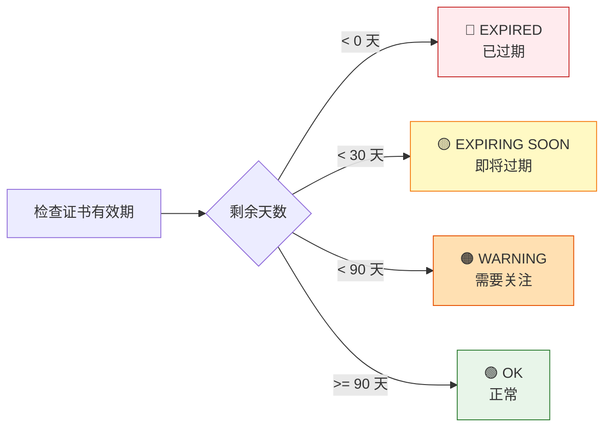
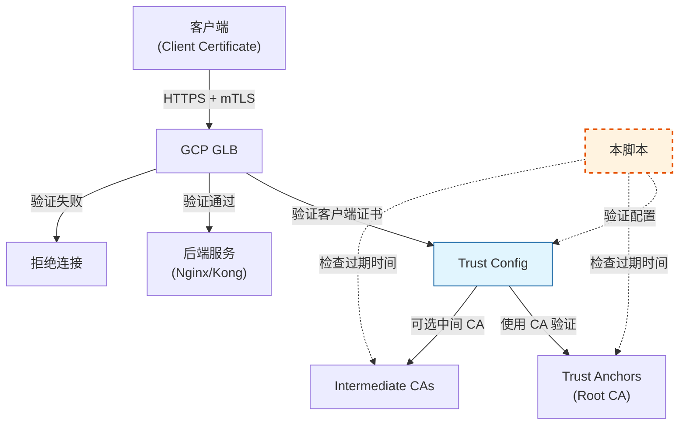
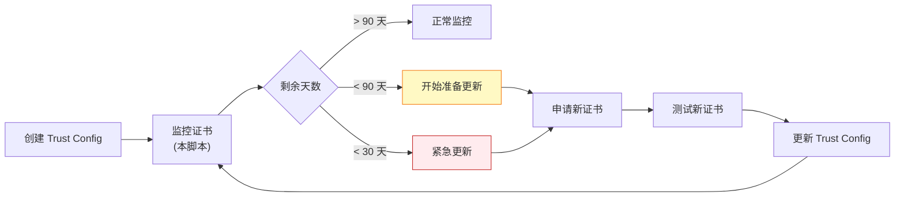

# Trust Config 验证脚本使用指南

## 概述

`verify-trust-configs.sh` 是一个用于验证和分析 GCP Certificate Manager Trust Configs 的自动化脚本。它可以帮助你：

- 列出项目中所有的 Trust Configs
- 提取证书的详细信息（包括过期时间）
- 验证证书链的有效性
- 自动导出配置备份

## 功能特性

### ✅ 核心功能

1. **自动发现** - 列出指定 location 下的所有 trust configs
2. **证书解析** - 提取并解析证书的详细信息：
   - Subject (主题)
   - Issuer (颁发者)
   - Serial Number (序列号)
   - 有效期 (Valid From/Until)
   - 剩余天数 (Days Remaining)
   - SHA256/SHA1 Fingerprint
   - Public Key Algorithm
   - Subject Alternative Names (SAN)
3. **过期预警** - 自动检测证书过期状态：
   - 🔴 已过期 (EXPIRED)
   - 🟡 30天内过期 (EXPIRING SOON)
   - 🟠 90天内过期 (WARNING)
   - 🟢 正常 (OK)
4. **自动导出** - 将配置导出为 YAML 文件备份
5. **汇总报告** - 生成项目级别的 Trust Config 汇总

## 前置要求

### 依赖工具

```bash
# 检查是否安装必需工具
which gcloud jq openssl
```

如果缺少工具，请安装：

```bash
# macOS
brew install jq

# gcloud 安装
# https://cloud.google.com/sdk/docs/install

# openssl (macOS 自带，Linux 需要安装)
# Linux: apt-get install openssl 或 yum install openssl
```

### GCP 权限

需要以下 IAM 权限：

- `certificatemanager.trustConfigs.list`
- `certificatemanager.trustConfigs.get`

建议角色：

- `roles/certificatemanager.viewer` (查看权限)
- `roles/certificatemanager.admin` (完整权限)

### 认证配置

```bash
# 登录 GCP
gcloud auth login

# 设置默认项目
gcloud config set project YOUR_PROJECT_ID

# 验证当前配置
gcloud config list
```

## 使用方法

### 基本用法

```bash
# 1. 使用默认项目和 global location
./verify-trust-configs.sh

# 2. 指定项目
./verify-trust-configs.sh --project my-project-id

# 3. 指定 location
./verify-trust-configs.sh --location global

# 4. 同时指定项目和 location
./verify-trust-configs.sh --project my-project-id --location global

# 5. 查看帮助
./verify-trust-configs.sh --help
```

### 参数说明

| 参数 | 说明 | 必需 | 默认值 |
|------|------|------|--------|
| `--project` | GCP 项目 ID | ❌ | gcloud 默认项目 |
| `--location` | Trust Config 位置 | ❌ | `global` |
| `-h, --help` | 显示帮助信息 | ❌ | - |

## 输出示例

### 1. Trust Config 列表

```
================================
Listing Trust Configs in global
================================

my-client-trust-config
production-mtls-config
dev-mtls-config
```

### 2. 证书详细信息

```
================================
Trust Config: my-client-trust-config
================================

name: projects/my-project/locations/global/trustConfigs/my-client-trust-config
createTime: '2024-01-15T10:30:00.123456Z'
updateTime: '2024-03-20T14:45:00.654321Z'
description: Trust config for client certificate validation

Trust Anchors (Root CAs):

  Certificate: Trust Anchor #1
  -------------------------------------------
  Subject: C=US, O=Example Corp, CN=Example Root CA
  Issuer: C=US, O=Example Corp, CN=Example Root CA
  Serial: 1234567890ABCDEF
  Valid From: Jan 1 00:00:00 2024 GMT
  Valid Until: Dec 31 23:59:59 2034 GMT
  Days Remaining: 3285 (OK)
  SHA256 Fingerprint: AB:CD:EF:12:34:56:78:90:AB:CD:EF:12:34:56:78:90:...
  SHA1 Fingerprint: 12:34:56:78:90:AB:CD:EF:12:34:56:78:90:AB:CD:EF:...
  Public Key Algorithm: rsaEncryption
  -------------------------------------------

Intermediate CAs:

  Certificate: Intermediate CA #1
  -------------------------------------------
  Subject: C=US, O=Example Corp, OU=IT, CN=Example Intermediate CA
  Issuer: C=US, O=Example Corp, CN=Example Root CA
  Serial: FEDCBA0987654321
  Valid From: Jan 1 00:00:00 2024 GMT
  Valid Until: Dec 31 23:59:59 2026 GMT
  Days Remaining: 285 (OK)
  SHA256 Fingerprint: 12:34:56:78:90:AB:CD:EF:12:34:56:78:90:AB:CD:EF:...
  SHA1 Fingerprint: AB:CD:EF:12:34:56:78:90:AB:CD:EF:12:34:56:78:90:...
  Public Key Algorithm: rsaEncryption
  -------------------------------------------

Allowlisted Certificates:
  No allowlisted certificates configured

[SUCCESS] Exported to: ./trust-configs-export/my-client-trust-config-20260123-181500.yaml
```

### 3. 汇总报告

```
================================
Summary Report
================================

Project: my-project-id
Location: global
Total Trust Configs: 3

[INFO] Trust Config Names:
  - my-client-trust-config
  - production-mtls-config
  - dev-mtls-config

[SUCCESS] Verification completed!
```

## 证书过期状态说明

脚本会自动计算证书的剩余有效天数，并根据不同阈值显示不同颜色：



## 导出文件说明

### 导出目录结构

```
./trust-configs-export/
├── my-client-trust-config-20260123-181500.yaml
├── production-mtls-config-20260123-181501.yaml
└── dev-mtls-config-20260123-181502.yaml
```

### 导出文件用途

1. **备份** - 作为配置的历史备份
2. **版本对比** - 对比不同时间点的配置变化
3. **迁移** - 用于跨项目或跨环境迁移配置
4. **审计** - 满足合规性审计要求

## 使用场景

### 场景 1: 定期证书审计

```bash
# 每月运行一次，检查证书状态
./verify-trust-configs.sh

# 配合 cron 定期执行
0 9 1 * * /path/to/verify-trust-configs.sh --project prod-project > /var/log/trust-config-audit.log 2>&1
```

### 场景 2: 证书更新后验证

当用户更新了 Trust Config 后，验证新证书是否正确配置：

```bash
# 1. 用户更新证书
gcloud certificate-manager trust-configs import my-client-trust-config \
    --location=global \
    --trust-anchor=file=new-root-ca.pem,pem-certificate

# 2. 验证更新结果
./verify-trust-configs.sh

# 3. 检查输出中的证书信息是否与预期一致
```

### 场景 3: 多项目批量检查

```bash
#!/bin/bash
# check-all-projects.sh

PROJECTS=("project-1" "project-2" "project-3")

for project in "${PROJECTS[@]}"; do
    echo "Checking project: $project"
    ./verify-trust-configs.sh --project "$project" > "reports/${project}-report.txt"
done
```

### 场景 4: 过期证书告警

```bash
#!/bin/bash
# alert-expiring-certs.sh

# 运行验证脚本并保存输出
OUTPUT=$(./verify-trust-configs.sh 2>&1)

# 检查是否有 EXPIRING SOON 或 EXPIRED
if echo "$OUTPUT" | grep -E "(EXPIRING SOON|EXPIRED)"; then
    echo "⚠️  发现即将过期或已过期的证书！"
    echo "$OUTPUT"
    # 发送告警（例如通过邮件或 Slack）
    # send_alert "$OUTPUT"
fi
```

## 与 GLB mTLS 配置的关系

### 架构流程



### GLB 使用 Trust Config 的验证流程

1. **客户端发起 TLS 连接** - 携带客户端证书
2. **GLB 接收证书** - 开始 mTLS 握手
3. **GLB 查找 Trust Config** - 从关联的 Server TLS Policy 中获取
4. **证书链验证**:
   - 使用 Trust Anchors (根 CA) 验证证书链
   - 如果配置了 Intermediate CAs，验证中间 CA
   - 检查证书是否在 Allowlisted Certificates 中
5. **验证结果**:
   - ✅ 验证成功 → 允许连接
   - ❌ 验证失败 → 拒绝连接 (403/401)

### 如何验证配置已支持用户证书

使用本脚本后，你可以：

1. **查看 Trust Anchors** - 确认根 CA 与用户证书颁发者匹配
2. **检查过期时间** - 确保 CA 证书未过期
3. **验证指纹** - 对比 CA 指纹是否正确
4. **测试证书链** - 使用 openssl 验证用户证书是否被信任

#### 手动测试证书链

```bash
# 1. 导出 root CA（从脚本输出或导出文件中获取）
cat > root-ca.pem << 'EOF'
-----BEGIN CERTIFICATE-----
...
-----END CERTIFICATE-----
EOF

# 2. 验证用户证书
openssl verify -CAfile root-ca.pem user-client-cert.pem

# 期望输出：
# user-client-cert.pem: OK
```

## 故障排查

### 问题 1: 权限不足

```
ERROR: (gcloud.certificate-manager.trust-configs.list) Permission denied
```

**解决方案**:

```bash
# 检查当前用户权限
gcloud projects get-iam-policy PROJECT_ID \
    --flatten="bindings[].members" \
    --filter="bindings.members:user:$(gcloud config get-value account)"

# 添加权限（需要 Owner 或 Admin）
gcloud projects add-iam-policy-binding PROJECT_ID \
    --member="user:your-email@example.com" \
    --role="roles/certificatemanager.viewer"
```

### 问题 2: 未找到 Trust Config

```
WARNING: No trust configs found in location: global
```

**检查步骤**:

```bash
# 1. 确认 location 正确
gcloud certificate-manager trust-configs list --location=global

# 2. 列出所有 locations
gcloud certificate-manager locations list

# 3. 尝试其他 location
./verify-trust-configs.sh --location=us-central1
```

### 问题 3: jq 解析失败

```
parse error: Invalid numeric literal at line 1, column 10
```

**解决方案**:

```bash
# 更新 jq 到最新版本
brew upgrade jq  # macOS
# 或
sudo apt-get update && sudo apt-get install jq  # Linux
```

### 问题 4: OpenSSL 日期解析错误

```
date: illegal time format
```

**说明**: macOS 和 Linux 的 `date` 命令语法不同。脚本使用了 macOS 格式的 `date -j`。

**Linux 修改**:

编辑脚本，将：

```bash
local expiry_epoch=$(date -j -f "%b %d %T %Y %Z" "$not_after" "+%s" 2>/dev/null || echo "0")
```

修改为:

```bash
local expiry_epoch=$(date -d "$not_after" "+%s" 2>/dev/null || echo "0")
```

## 最佳实践

### 1. 定期运行验证

建议配置自动化任务定期运行：

```bash
# 添加到 crontab
# 每周一上午 9:00 运行
0 9 * * 1 /path/to/verify-trust-configs.sh --project YOUR_PROJECT > /var/log/trust-config-weekly.log 2>&1
```

### 2. 证书生命周期管理



### 3. 多环境管理

为不同环境使用不同的 Trust Config：

```bash
# 开发环境
./verify-trust-configs.sh --project dev-project

# 测试环境
./verify-trust-configs.sh --project test-project

# 生产环境
./verify-trust-configs.sh --project prod-project
```

### 4. 版本控制导出文件

```bash
# 将导出文件纳入版本控制
git add trust-configs-export/*.yaml
git commit -m "Backup trust configs - $(date +%Y-%m-%d)"
git push
```

### 5. 告警集成

结合监控系统（如 Cloud Monitoring）：

```bash
#!/bin/bash
# monitor-trust-configs.sh

OUTPUT=$(./verify-trust-configs.sh 2>&1)

# 检查过期证书
EXPIRING_COUNT=$(echo "$OUTPUT" | grep -c "EXPIRING SOON")
EXPIRED_COUNT=$(echo "$OUTPUT" | grep -c "EXPIRED")

# 发送指标到 Cloud Monitoring
gcloud monitoring time-series create \
    --project=YOUR_PROJECT \
    --metric-kind=GAUGE \
    --metric-type=custom.googleapis.com/trust_config/expiring_certs \
    --value-int64=$EXPIRING_COUNT

gcloud monitoring time-series create \
    --project=YOUR_PROJECT \
    --metric-kind=GAUGE \
    --metric-type=custom.googleapis.com/trust_config/expired_certs \
    --value-int64=$EXPIRED_COUNT
```

## 相关资源

### GCP 官方文档

- [Certificate Manager Trust Configs](https://cloud.google.com/certificate-manager/docs/trust-configs)
- [Server TLS Policies](https://cloud.google.com/load-balancing/docs/mtls)
- [mTLS Authentication](https://cloud.google.com/load-balancing/docs/https/setting-up-mtls)

### 相关命令

```bash
# 列出 Trust Configs
gcloud certificate-manager trust-configs list --location=global

# 查看详情
gcloud certificate-manager trust-configs describe CONFIG_NAME --location=global

# 创建 Trust Config
gcloud certificate-manager trust-configs import CONFIG_NAME \
    --location=global \
    --trust-anchor=file=root-ca.pem,pem-certificate

# 更新 Trust Config
gcloud certificate-manager trust-configs import CONFIG_NAME \
    --location=global \
    --trust-anchor=file=new-root-ca.pem,pem-certificate

# 删除 Trust Config
gcloud certificate-manager trust-configs delete CONFIG_NAME --location=global
```

## 总结

本脚本提供了一个全面的 Trust Config 验证解决方案，帮助你：

✅ 快速了解所有 Trust Configs 的配置状态  
✅ 及时发现即将过期或已过期的证书  
✅ 验证用户更新的证书是否正确配置  
✅ 维护配置历史备份  
✅ 支持自动化和监控集成  

通过定期运行此脚本，你可以确保 GLB mTLS 配置始终处于最佳状态，避免因证书过期导致的服务中断。
