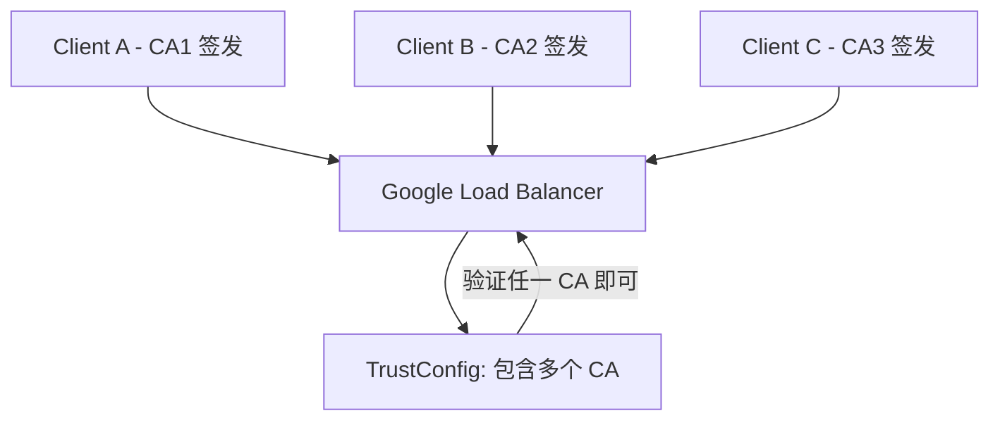

# Google Cloud Certificate Manager TrustConfig 管理机制

这是一个非常关键的问题，涉及到 Google Cloud Certificate Manager 中的 TrustConfig 管理机制，用于在 GLB（Google Load Balancer）层进行 mTLS 客户端证书验证。

## 一、TrustConfig 支持多个 CA 吗？

是的，TrustConfig 完全支持配置多个 CA（或完整证书链），但有如下限制与实现方式：

**支持方式：**

你可以将多个 CA（Root CA 或 Intermediate CA）以 PEM 格式放在一个 TrustConfig 的 `trust_anchors` 列表中：

```yaml
trustConfig:
  name: my-mtls-trustconfig
  description: Trust multiple client CAs
  trustStores:
    default:
      trustAnchors:
        - pemCertificate: |
            -----BEGIN CERTIFICATE-----
            <ClientCA1 Cert>
            -----END CERTIFICATE-----
        - pemCertificate: |
            -----BEGIN CERTIFICATE-----
            <ClientCA2 Cert>
            -----END CERTIFICATE-----
```

这样配置后，GLB 会信任多个 CA 签发的客户端证书，并在 TLS 握手阶段验证它们的合法性。

## 二、是否支持多个 TrustConfig？

目前（截至 2024-06 的官方文档），每个 ServerTlsPolicy 只能引用一个 TrustConfig，但你可以在 TrustConfig 中配置多个 TrustAnchor 来达到支持多个 CA 的目的。

| 项目                       | 是否支持                 | 实现方式                               |
| -------------------------- | ------------------------ | -------------------------------------- |
| 一个 TrustConfig 配置多个 CA | 支持                     | trustAnchors 中配置多个 CA 证书         |
| 一个 ServerTlsPolicy 引用多个 TrustConfig | 不支持                   | 用多个 TLS Policy 分发流量              |
| 多个 ServerTlsPolicy 绑定不同后端服务 | 支持                     |                                         |

## 三、如何添加更多 CA 到现有 TrustConfig？

你可以通过以下方式更新现有 TrustConfig：

**CLI 示例（gcloud）：**

```bash
gcloud certificate-manager trust-configs update my-mtls-trustconfig \
  --update-trust-anchor \
    pem-certificate="path/to/client-ca3.pem"
```

或者你可以直接导出现有配置、追加 CA 后再导入更新：

**步骤：**

1.  查看当前配置：

```bash
gcloud certificate-manager trust-configs describe my-mtls-trustconfig
```

2.  在本地编辑 PEM 文件（包含多个 CA）：

```bash
cat client-ca1.pem > all-cas.pem
cat client-ca2.pem >> all-cas.pem
cat client-ca3.pem >> all-cas.pem
```

3.  替换更新：

```bash
gcloud certificate-manager trust-configs update my-mtls-trustconfig \
  --trust-anchor "pem-certificate-file=all-cas.pem"
```

⚠️ **注意：** 更新 TrustConfig 是替换式操作，之前的 `trustAnchors` 会被替换成新的。

## 四、示意图说明（Markdown Mermaid）



## 五、总结表格

| 需求项                       | 是否支持                 | 实现方式                               |
| -------------------------- | ------------------------ | -------------------------------------- |
| 单一 TrustConfig 支持多个 CA | 支持                     | trustAnchors 中配置多个 CA 证书         |
| 一个 ServerTlsPolicy 多 TrustConfig | 不支持                   | 用多个 TLS Policy 分发流量              |
| 动态更新 CA                 | 支持                     | 使用 gcloud 或 Terraform 更新            |
| 每个 CA 分别认证不同客户端 | 支持                     | 统一验证，多 CA 授权                   |

