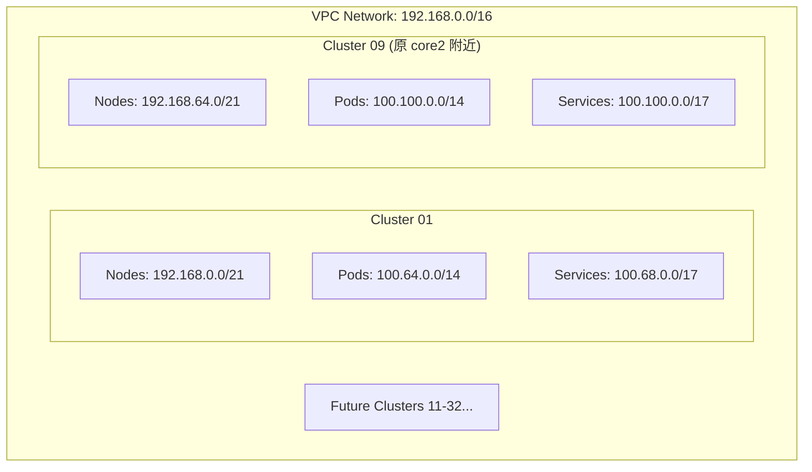

```json
{
  "core2": {
    "network": "projectID-dev-cinternal-vpc1",
    "region": "europe-west2",
    "description": "api platform core2 in uk",
    "ip_cidr_range": "192.168.0.0/18",
    "private_ip_google_access": true,
    "secondary_ip_ranges": 0,
    "network_users": [
      "group:gcp.projectID-dev.devops-team-priv@aibang.com"
    ],
    "gke-core2-big": {
      "network": "projectID-dev-cinternal-vpc1",
      "region": "europe-west2",
      "description": "GKE2 nodes on core vpc europe-west2",
      "ip_cidr_range": "192.168.64.0/19",
      "private_ip_google_access": true,
      "secondary_ip_ranges": {
        "gkepodsbig-europe-west2": "100.64.0.0/14",
        "gkeservicesbig-europe-west2": "100.68.0.0/17"
      },
      "network_users": [
        "serviceAccount:gce-images@projectID-dev.iam.gserviceaccount.com"
      ]
    }
  }
}
```
你的目标其实很明确：

新环境继续使用同样的结构，但把 Node Subnet 从 /19 扩展为 /18，并重新规划 Pod / Service 的 Secondary Range。

所以核心是 GKE VPC IP Planning。
我基于你当前旧配置的逻辑，给你做一个 等比例 + 更安全的规划。

⸻

1 旧环境配置分析

你当前配置：

类型	Range	大小	说明
VPC	192.168.0.0/18	16K IP	core network
Node Subnet	192.168.64.0/19	8192 IP	GKE Node
Pods	100.64.0.0/14	262K IP	Pod CIDR
Services	100.68.0.0/17	32K IP	Service CIDR

结构：

VPC
192.168.0.0/18
    │
    └── Subnet
        192.168.64.0/19
            │
            ├── Pods
            │     100.64.0.0/14
            │
            └── Services
                  100.68.0.0/17


⸻  or we can keep the pod and svc range 
192.168.0.0/18
    │
    └── Subnet
        192.168.64.0/18
            │
            ├── Pods
            │     100.64.0.0/13
            │
            └── Services
                  100.72.0.0/16

```bash
 ✗ ipcalc 100.64.0.0/13
Address:   100.64.0.0           01100100.01000 000.00000000.00000000
Netmask:   255.248.0.0 = 13     11111111.11111 000.00000000.00000000
Wildcard:  0.7.255.255          00000000.00000 111.11111111.11111111
=>
Network:   100.64.0.0/13        01100100.01000 000.00000000.00000000
HostMin:   100.64.0.1           01100100.01000 000.00000000.00000001
HostMax:   100.71.255.254       01100100.01000 111.11111111.11111110
Broadcast: 100.71.255.255       01100100.01000 111.11111111.11111111
Hosts/Net: 524286                Class A

✗ ipcalc 100.72.0.0/16
Address:   100.72.0.0           01100100.01001000. 00000000.00000000
Netmask:   255.255.0.0 = 16     11111111.11111111. 00000000.00000000
Wildcard:  0.0.255.255          00000000.00000000. 11111111.11111111
=>
Network:   100.72.0.0/16        01100100.01001000. 00000000.00000000
HostMin:   100.72.0.1           01100100.01001000. 00000000.00000001
HostMax:   100.72.255.254       01100100.01001000. 11111111.11111110
Broadcast: 100.72.255.255       01100100.01001000. 11111111.11111111
Hosts/Net: 65534                 Class A
```
---

# **2 多集群扩展规划 (基于 192.168.x.x)**

针对您未来可能在同一个 VPC 或互联网络中拥有 **10 个集群** 的需求，我们保持 `192.168.x.x` 的节点网段风格，并进行水平扩展。

### **2.1 集群规划逻辑**
为了保持您偏好的 `/18` 范围对齐（每个集群预留 16K Node IP），我们建议将网络空间按 `/18` 边界进行切片。

| Cluster ID     | 节点网段 (Node Subnet) | Pod 网段 (Secondary) | Service 网段 (Secondary) |
| :------------- | :--------------------- | :------------------- | :----------------------- |
| **Cluster 01** | `192.168.0.0/18`       | `100.64.0.0/14`      | `100.68.0.0/17`          |
| **Cluster 02** | `192.168.64.0/18`      | `100.72.0.0/14`      | `100.72.0.0/17`          |
| **Cluster 03** | `192.168.128.0/18`     | `100.76.0.0/14`      | `100.76.0.0/17`          |
| **Cluster 04** | `192.168.192.0/18`     | `100.80.0.0/14`      | `100.80.0.0/17`          |
| **Cluster 05** | `172.16.0.0/18`        | `100.84.0.0/14`      | `100.84.0.0/17`          |
| **Cluster 06** | `172.16.64.0/18`       | `100.88.0.0/14`      | `100.88.0.0/17`          |
| **Cluster 07** | `172.16.128.0/18`      | `100.92.0.0/14`      | `100.92.0.0/17`          |
| **Cluster 08** | `172.16.192.0/18`      | `100.96.0.0/14`      | `100.96.0.0/17`          |
| **Cluster 09** | `172.17.0.0/18`        | `100.100.0.0/14`     | `100.100.0.0/17`         |
| **Cluster 10** | `172.17.64.0/18`       | `100.104.0.0/14`     | `100.104.0.0/17`         |

### **2.2 容量说明**
*   **Node (/18)**: 每个集群支持 **16,382** 个节点。这属于超大规模规划，能够完美对齐您提到的 `192.168.64.0/18` 风格。
*   **Pod (/14)**: 保持 `100.64.x.x` 系列的 CGNAT 空间，每个集群支持 **26 万** 个 Pod IP。
*   **Service (/17)**: 每个集群支持 **3.2 万** 个 Service IP。

### **2.3 架构示意图**



### **3 实施注意事项**

1.  **VPC 范围限制**: 如果您的 VPC 强制限制在 `192.168.0.0/18`（如 JSON 中所示），那么只能容纳约 8 个 `/21` 的子网。若要支持 10 个以上集群，建议将管理层级的 VPC 范围放宽到 `192.168.0.0/16`。
2.  **不重叠原则**: 在规划时，Node 网段一定不能与 Pod/Service 网段重叠。我们推荐 Pod/Service 使用 CGNAT 范围 (`100.64.0.0/10`)，因为它们不需要在 VPC Peering 网络中全量路由。
3.  **Master 预留**: 每个 GKE 私有集群都需要一个 `/28` 的私有网段用于 Control Plane，请在规划 10 个集群时，单独预留出一块小的 IP 池（如 `192.168.200.0/24`）分拆给 Master 使用。

---

# **4 未来架构设计 (GKE Platform 2.0)**

这是为您未来 API 核心平台设计的**标准生产级规划**。该设计以 `172.16.0.0/12` (RFC1918) 为基准，采用您偏好的 `/18` 节点网段对齐方式，支持 10 个以上超大规模集群的线性扩展。

### **4.1 10 集群基准规划表 (Standard /18 Alignment)**

| Cluster ID     | 环境/用途        | 节点网段 (Node /18) | Pod 网段 (Secondary /14) | Service 网段 (Secondary /17) |
| :------------- | :--------------- | :------------------ | :----------------------- | :--------------------------- |
| **Cluster 01** | `core-prod-01`   | `172.16.0.0/18`     | `100.64.0.0/14`          | `100.120.0.0/17`             |
| **Cluster 02** | `core-prod-02`   | `172.16.64.0/18`    | `100.68.0.0/14`          | `100.120.128.0/17`           |
| **Cluster 03** | `shared-svc-01`  | `172.16.128.0/18`   | `100.72.0.0/14`          | `100.121.0.0/17`             |
| **Cluster 04** | `shared-svc-02`  | `172.16.192.0/18`   | `100.76.0.0/14`          | `100.121.128.0/17`           |
| **Cluster 05** | `tenant-01`      | `172.17.0.0/18`     | `100.80.0.0/14`          | `100.122.0.0/17`             |
| **Cluster 06** | `tenant-02`      | `172.17.64.0/18`    | `100.84.0.0/14`          | `100.122.128.0/17`           |
| **Cluster 07** | `staging-01`     | `172.17.128.0/18`   | `100.88.0.0/14`          | `100.123.0.0/17`             |
| **Cluster 08** | `staging-02`     | `172.17.192.0/18`   | `100.92.0.0/14`          | `100.123.128.0/17`           |
| **Cluster 09** | `dev-sandbox-01` | `172.18.0.0/18`     | `100.96.0.0/14`          | `100.124.0.0/17`             |
| **Cluster 10** | `dev-sandbox-02` | `172.18.64.0/18`    | `100.100.0.0/14`         | `100.124.128.0/17`           |

### **4.2 设计亮点**

1.  **极简对齐**：Node Subnet 严格按照 `0.0`, `64.0`, `128.0`, `192.0` 的步进对齐，极大降低了运维和路由排查的复杂度。
2.  **容量保证**：
    *   **Nodes**: 每个集群拥有 16K IP，支持海量节点扩展。
    *   **Pods**: 使用 CGNAT 范围，每个集群分配 `/14` (26万 IP)，确保 Pod 调度不会因为 IP 碎片化而受限。
    *   **Services**: 每个集群分配 `/17` (3.2万 IP)，足以支撑数千个微服务的负载均衡。
3.  **多项目兼容性**：该方案可以直接应用于 Shared VPC 环境。如果后续需要跨项目部署 Tenant 集群，只需从该池中分配对应的子网即可。
4.  **路由隔离**：Pod 和 Service 强制放在 `100.64.0.0/10` 范围内。在 VPC Peering 或企业路由器（Cloud Router）上，您可以选择仅宣告 `172.16.0.0/12` 段，从而精简路由表条目，提高转发效率。

---
> [!TIP]
> **落地建议**：如果您使用 Terraform 设计，可以将此表格定义为 `locals` 映射。在创建子网时，通过变量动态计算 `ip_cidr_range` 和 `secondary_ip_range`，从而实现“规划即代码 (Planning as Code)”。

---

# **5 生产级多集群 IP 规划 (基于 192.168.64.0/20 架构)**

该规划基于您当前推荐的 **192.168.64.0/20** 做节点起始段，专为 10 个以上集群的并行部署设计，满足 Master 管理 IP 连续性及网段对齐要求。

### **5.1 10 集群详细规划表 (Standard /20 Node Alignment)**

| Cluster ID     | 环境名称     | Node Subnet (/20)  | Pod Subnet (/18)  | Service Subnet (/18) | Master Management (/27) |
| :------------- | :----------- | :----------------- | :---------------- | :------------------- | :---------------------- |
| **Cluster 01** | `core-01`    | `192.168.64.0/20`  | `100.64.0.0/18`   | `100.68.0.0/18`      | `192.168.224.0/27`      |
| **Cluster 02** | `core-02`    | `192.168.80.0/20`  | `100.64.64.0/18`  | `100.68.64.0/18`     | `192.168.224.32/27`     |
| **Cluster 03** | `core-03`    | `192.168.96.0/20`  | `100.64.128.0/18` | `100.68.128.0/18`    | `192.168.224.64/27`     |
| **Cluster 04** | `core-04`    | `192.168.112.0/20` | `100.64.192.0/18` | `100.68.192.0/18`    | `192.168.224.96/27`     |
| **Cluster 05** | `tenant-01`  | `192.168.128.0/20` | `100.65.0.0/18`   | `100.69.0.0/18`      | `192.168.224.128/27`    |
| **Cluster 06** | `tenant-02`  | `192.168.144.0/20` | `100.65.64.0/18`  | `100.69.64.0/18`     | `192.168.224.160/27`    |
| **Cluster 07** | `staging-01` | `192.168.160.0/20` | `100.65.128.0/18` | `100.69.128.0/18`    | `192.168.224.192/27`    |
| **Cluster 08** | `staging-02` | `192.168.176.0/20` | `100.65.192.0/18` | `100.69.192.0/18`    | `192.168.224.224/27`    |
| **Cluster 09** | `mgmt-01`    | `192.168.192.0/20` | `100.66.0.0/18`   | `100.70.0.0/18`      | `192.168.225.0/27`      |
| **Cluster 10** | `mgmt-02`    | `192.168.208.0/20` | `100.66.64.0/18`  | `100.70.64.0/18`     | `192.168.225.32/27`     |

### **5.2 规划详解**

1.  **节点对齐 (Nodes)**：
    *   以 `/20` 为基准步进，每个集群支持 **4,096** 个节点。
    *   10 个集群刚好用完 `192.168.64.0` 到 `192.168.223.255` 的空间，非常紧凑规整。
2.  **管理段衔接 (Master IPs)**：
    *   Master 管理段紧随其后，从 `192.168.224.0` 开始，完美避开了节点占用的所有 CIDR。
    *   每个 Master 分配 `/27` (32 IP)，满足私有集群控制平面与 Google 管理项目的通信需求。
3.  **Pod 与 Service 隔离**：
    *   **Pod**: 采用 `/18` (16,384 IP)，足以支撑中大型 API 平台的 Pod 密度。
    *   **Service**: 采用 `/18` (16,384 IP)，确保 ClusterIP 资源充足。
    *   Pod 段和 Service 段各自分配了独立的 Class B 级空间 (`100.64.*` vs `100.68.*`)，有效防止了多集群互联时的路由冲突。

---

# **6 PRIVATE_SERVICE_CONNECT 定义与规划（单区域 10 集群 / 高访问量版）**

这部分基于上面 **生产级多集群 IP 规划 (基于 `192.168.64.0/20` 架构)**，专门为 **Master Project 中创建 PSC Service Attachment** 重新设计。

这里采用你的真实前提：

- **10 个 Cluster 都在同一个 Region**
- 假设当前主区域统一为 `europe-west2`
- 每个 Cluster 的 Node Subnet 都是 `/20`
- Master Project 需要承载多个 PSC published service / service attachment
- 平台访问量较大，不能只按“能不能用”做最小规划，必须考虑后续连接规模和扩容路径

## **6.1 先说结论**

更合理的做法是：

- 将 **`192.168.240.0/20`** 定义为 **Master Project 的 PSC 专用保留池**
```bash
ipcalc 192.168.240.0/20
Address:   192.168.240.0        11000000.10101000.1111 0000.00000000
Netmask:   255.255.240.0 = 20   11111111.11111111.1111 0000.00000000
Wildcard:  0.0.15.255           00000000.00000000.0000 1111.11111111
=>
Network:   192.168.240.0/20     11000000.10101000.1111 0000.00000000
HostMin:   192.168.240.1        11000000.10101000.1111 0000.00000001
HostMax:   192.168.255.254      11000000.10101000.1111 1111.11111110
Broadcast: 192.168.255.255      11000000.10101000.1111 1111.11111111
Hosts/Net: 4094                  Class C, Private Internet
```
- 在这个 `/20` 内，不按 Region 切，而是按 **Cluster / Shared Service Domain / Overflow** 切
- 每个 Cluster 先预留一个 **独立 `/24` PSC Pool**
- 每个 `Service Attachment` 从所属 Cluster 的 `/24` 池中分配一个独立 PSC NAT subnet

### **为什么从 `/21` 提升到 `/20`**

你现在的场景不是“多区域少量 attachment”，而是：

- 单区域
- 10 个 Cluster
- 高访问量
- 未来可能每个 Cluster 不止一个对外发布服务

所以 `/21` 虽然能用，但偏紧。

`/20` 更合适的原因：

- 有 **16 个 `/24`**
- 可以给 10 个 Cluster 各保留 1 个 `/24`
- 还剩 6 个 `/24` 作为共享服务、超大流量 attachment、溢出池、迁移池
- 后续不需要很快返工

## **6.2 PSC 设计约束**

基于 Google Cloud 官方行为，PSC producer 侧需要注意：

1. `Service Attachment` 是 **regional resource**
2. 一个 `Service Attachment` 可以关联 **多个 PSC NAT subnets**
3. 但 **一个 PSC NAT subnet 不能被多个 Service Attachment 复用**
4. PSC NAT subnet 只能用于 `purpose=PRIVATE_SERVICE_CONNECT`
5. **子网大小决定的是“可接入消费者/endpoint/backends 的容量”**
   - 不是简单等价于带宽或 QPS

关键官方点：

- `2026-03-27` 看到的 Google Cloud 文档说明：
  - NAT subnet 大小决定多少消费者能连进来
  - 每个连接到 service attachment 的 endpoint 或 backend 会消耗一个 NAT IP
  - `/24` 有 252 个可用地址，因为有 4 个不可用地址
  - 连接数、客户端数、consumer VPC 内部实例数，不会直接改变 NAT IP 的消耗方式  
  来源：
  - [About published services](https://cloud.google.com/vpc/docs/about-vpc-hosted-services)
  - [Publish services by using Private Service Connect](https://cloud.google.com/vpc/docs/configure-private-service-connect-producer)

## **6.3 关于“性能”的正确理解**

### **重要澄清**

我前一版里说：

- `/26` 有 64 个地址
- 足够覆盖一批消费者连接的 SNAT 需求

这句话方向没错，但还不够准确。

更准确的说法应该是：

- PSC NAT subnet 的大小主要影响的是：
  - **service attachment 可以承接多少 PSC endpoints / PSC backends / propagated connections**
- 它 **不是直接的 QPS 指标**
- 也 **不是单纯的后端吞吐指标**

### **PSC NAT 容量主要受什么影响**

1. **消费者 endpoint / backend 数量**
   - 每个 consumer endpoint 或 backend 会占用一个 NAT IP
2. **是否使用 propagated connections**
   - 如果用了 propagated connections，会额外消耗 NAT IP
3. **租户模型**
   - 如果是多租户平台，consumer project / endpoint 数量通常增长很快
4. **attachment 颗粒度**
   - attachment 拆得越细，消耗的 PSC subnet 数量越多

### **高访问量场景下怎么理解**

如果你的平台“访问量很大”，要先区分两种压力：

#### 类型 A：高 QPS，但消费者数量不多

例如：

- 只有少量 consumer project
- 但每个 consumer 的请求量很高

这种情况下，PSC NAT subnet 不一定先成为瓶颈。
真正更可能先成为瓶颈的是：

- 内部 LB
- backend 服务
- 连接保持/超时
- 单 consumer 的连接行为

#### 类型 B：消费者很多，而且 endpoint 很多

例如：

- 多 tenant
- 多 consumer project
- 每个 consumer 都创建自己的 PSC endpoint

这种情况下，PSC NAT subnet 容量会很快成为约束。

### **结论**

对你们这种平台型架构，我建议 **不要把 `/26` 当默认值**。

更稳妥的默认做法应该是：

- **普通 attachment：`/25` 起步**
- **高流量/高租户共享 attachment：`/24` 起步**
- **超大 attachment：允许绑定多个 `/24` PSC subnets**

## **6.4 推荐地址总池**

### **PSC Supernet**

建议正式定义：

- **`192.168.240.0/20` = Master Project PSC Dedicated Pool**

范围覆盖：

- `192.168.240.0` - `192.168.255.255`

这样做的好处：

1. 与现有多集群 Node 规划完全分离
2. 语义清晰，`24x~25x` 一眼就是 PSC
3. 16 个 `/24` 足以支撑：
   - 10 个 Cluster 各自 1 个 PSC Pool
   - 外加 6 个共享 / overflow 池

## **6.5 推荐切分策略：按 Cluster 分配 `/24`**

既然 10 个 Cluster 都在同一区域，那么 PSC 地址规划更应该按 **Cluster 维度** 来切，而不是按 Region 切。

### **Cluster PSC Pool 规划表**

| Cluster ID     | 环境名称     | Cluster Node Subnet | PSC Pool (/24)     |
| :------------- | :----------- | :------------------ | :----------------- |
| **Cluster 01** | `core-01`    | `192.168.64.0/20`   | `192.168.240.0/24` |
| **Cluster 02** | `core-02`    | `192.168.80.0/20`   | `192.168.241.0/24` |
| **Cluster 03** | `core-03`    | `192.168.96.0/20`   | `192.168.242.0/24` |
| **Cluster 04** | `core-04`    | `192.168.112.0/20`  | `192.168.243.0/24` |
| **Cluster 05** | `tenant-01`  | `192.168.128.0/20`  | `192.168.244.0/24` |
| **Cluster 06** | `tenant-02`  | `192.168.144.0/20`  | `192.168.245.0/24` |
| **Cluster 07** | `staging-01` | `192.168.160.0/20`  | `192.168.246.0/24` |
| **Cluster 08** | `staging-02` | `192.168.176.0/20`  | `192.168.247.0/24` |
| **Cluster 09** | `mgmt-01`    | `192.168.192.0/20`  | `192.168.248.0/24` |
| **Cluster 10** | `mgmt-02`    | `192.168.208.0/20`  | `192.168.249.0/24` |

### **共享与扩容池**

| 用途                       | PSC Pool (/24)     |
| :------------------------- | :----------------- |
| `shared-services-01`       | `192.168.250.0/24` |
| `shared-services-02`       | `192.168.251.0/24` |
| `high-traffic-overflow-01` | `192.168.252.0/24` |
| `high-traffic-overflow-02` | `192.168.253.0/24` |
| `migration-buffer-01`      | `192.168.254.0/24` |
| `dr-reserved-01`           | `192.168.255.0/24` |

## **6.6 每个 Cluster 的 attachment 切分建议**

### **推荐不是预先固定切满**

不要一开始就把每个 Cluster 的 `/24` 机械切成 4 个 `/26`。

更好的方式是：

- 先给每个 Cluster 一个 `/24` Pool
- 再按 attachment 类型，从该 `/24` 里动态切分

### **推荐 attachment profile**

| Attachment 类型 | 建议起始网段 | 可用地址数 | 适用场景                              |
| :-------------- | :----------- | :--------- | :------------------------------------ |
| `Small`         | `/26`        | 60         | 小规模、内部测试、低租户 attachment   |
| `Medium`        | `/25`        | 124        | 普通生产 attachment                   |
| `Large`         | `/24`        | 252        | 高流量 / 高租户 / 平台共享 attachment |

> 备注：Google Cloud 文档说明 NAT subnet 有 4 个不可用地址，因此 `/26` 不是 64 可用，而是 **60 可用**；`/25` 是 **124 可用**；`/24` 是 **252 可用**。

### **生产推荐默认值**

对于你们这种“大访问量平台”，我建议默认值如下：

- **Cluster 私有服务 attachment 默认：`/25`**
- **共享入口 / 平台级 attachment 默认：`/24`**
- **低优先级或临时 attachment 才使用 `/26`**

## **6.7 例子：Cluster 02（你原本考虑的 `192.168.241.0/24`）**

如果把 `192.168.241.0/24` 定义为 `core-02` 的 PSC Pool，那么推荐不是默认拆成四个 `/26`，而是这样使用：

### **方案 A：偏稳健的生产起步**

| Attachment               | CIDR                 | 说明              |
| :----------------------- | :------------------- | :---------------- |
| `psc-core02-api-01`      | `192.168.241.0/25`   | 主生产 attachment |
| `psc-core02-api-02`      | `192.168.241.128/26` | 次级 attachment   |
| `psc-core02-reserved-01` | `192.168.241.192/26` | 扩容保留          |

### **方案 B：如果某个服务就是平台共享入口**

| Attachment                  | CIDR               | 说明                     |
| :-------------------------- | :----------------- | :----------------------- |
| `psc-core02-shared-ingress` | `192.168.241.0/24` | 直接给高流量共享服务使用 |

然后如果后续还要新增同 Cluster 的第二个高流量 attachment：

- 不要硬挤在同一个 `/24`
- 直接从共享溢出池申请：
  - `192.168.252.0/24`
  - 或 `192.168.253.0/24`

## **6.8 如何做性能与容量评估**

### **不要只问 QPS，要问 4 个问题**

在 PSC NAT 规划里，建议你对每个 service attachment 收集下面 4 个输入：

1. **预计会有多少 consumer endpoints / backends**
2. **是否会使用 propagated connections**
3. **是否是共享平台服务**
4. **是否需要单 consumer connection limits**

### **容量评估公式（producer 侧）**

可以先用下面这个简单模型做初始容量估算：

```text
Required NAT IPs
= 预计 PSC endpoints 数量
+ 预计 PSC backends 数量
+ propagated connections 带来的附加消耗
+ 20%~30% buffer
```

然后对照子网可用地址：

- `/26` -> 60 usable
- `/25` -> 124 usable
- `/24` -> 252 usable

### **并发 TCP 连接估算公式**

除了“需要多少 NAT IP”之外，还要补一个更接近连接容量的估算：

对于 NAT 子网中的每一个 IP，它理论上能支持的并发 TCP 连接数，受限于源端口可用范围。

可以采用下面这个近似公式：

$$Concurrent\_Connections \approx \text{NAT\_IP\_Count} \times 63,488$$

### **按子网规模换算**

基于上面的 usable IP 数量，可以得到一个非常实用的粗略并发上限：

| NAT Subnet | Usable NAT IPs | 理论并发 TCP 连接上限（近似） |
| :--------- | :------------- | :---------------------------- |
| `/26`      | `60`           | `60 × 63,488 ≈ 3.81M`         |
| `/25`      | `124`          | `124 × 63,488 ≈ 7.87M`        |
| `/24`      | `252`          | `252 × 63,488 ≈ 15.99M`       |

### **这个公式怎么用**

这个公式的意义不是说：

- `/24` 就一定能稳定承载 1600 万 QPS

而是说：

- 如果你的访问模型包含大量并发 TCP 会话
- 并且这些会话需要通过 PSC producer 侧 NAT IP 做端口映射
- 那么 NAT subnet 的规模会决定“连接容量墙”

### **对高访问量平台的实际解读**

对于你们的平台，应该把容量评估拆成两层：

#### **层 1：NAT IP / Endpoint 容量**

看的是：

- 有多少 consumer endpoints / backends / propagated connections
- 当前 NAT subnet 还剩多少可用地址

#### **层 2：并发 TCP Session 容量**

看的是：

- 客户端是不是短连接为主
- 后端是不是大量新建连接
- 单个 NAT IP 的端口空间会不会被快速耗尽

这也是为什么：

- **高 QPS 不一定马上打满 PSC NAT subnet**
- 但 **海量短连接**、**高并发新建连接**、**多 consumer endpoint** 的组合，可能会很快把 PSC NAT 容量推满

### **因此对你们的规划建议进一步收紧**

在你这个“10 个 Cluster，同一 Region，大访问量”的场景里：

- `/26` 只适合：
  - 测试
  - 低租户
  - 明确知道是低并发连接模型的 attachment
- `/25` 才适合作为普通生产 attachment 的默认起点
- `/24` 更适合作为：
  - 平台共享 attachment
  - 大型 consumer 基数入口
  - 高并发短连接模型服务

### **监控指标**

Google Cloud 官方建议重点盯 producer 侧这个指标：

- `private_service_connect/producer/used_nat_ip_addresses`

同时还要看：

- service attachment connection status
- 是否出现 `Needs attention`
- 每个 consumer 的 connection limit 是否需要单独限制

### **什么时候应该扩容**

建议把下面作为告警阈值：

- `used_nat_ip_addresses >= 60%`：开始评估扩容
- `used_nat_ip_addresses >= 75%`：准备追加 NAT subnet
- `used_nat_ip_addresses >= 85%`：禁止继续手工接入新 consumer，优先扩容

### **扩容方式**

PSC 的一个优点是：

- 一个 service attachment 可以关联多个 NAT subnets
- 可以在线追加，不需要中断流量

所以高流量 attachment 的扩容动作应该是：

1. 不去改已有 subnet
2. 直接追加新的 PSC subnet
3. 保持命名和归属关系清晰

例如：

```text
psc-core02-api-01
  -> 192.168.241.0/25
  -> 192.168.252.0/25   # later expansion
```

## **6.9 最终推荐表**

### **Master Project PSC 总体保留**

| 用途                     | CIDR               | 说明                          |
| :----------------------- | :----------------- | :---------------------------- |
| `PSC Dedicated Supernet` | `192.168.240.0/20` | Master Project PSC 专用保留池 |

### **10 Cluster 对应 PSC Pool**

| Cluster      | PSC Pool           | 默认策略       |
| :----------- | :----------------- | :------------- |
| `core-01`    | `192.168.240.0/24` | `/25` 起步     |
| `core-02`    | `192.168.241.0/24` | `/25` 起步     |
| `core-03`    | `192.168.242.0/24` | `/25` 起步     |
| `core-04`    | `192.168.243.0/24` | `/25` 起步     |
| `tenant-01`  | `192.168.244.0/24` | `/25` 起步     |
| `tenant-02`  | `192.168.245.0/24` | `/25` 起步     |
| `staging-01` | `192.168.246.0/24` | `/26` 或 `/25` |
| `staging-02` | `192.168.247.0/24` | `/26` 或 `/25` |
| `mgmt-01`    | `192.168.248.0/24` | `/25` 起步     |
| `mgmt-02`    | `192.168.249.0/24` | `/25` 起步     |

### **共享与高流量扩容池**

| Pool                       | CIDR               | 用途                   |
| :------------------------- | :----------------- | :--------------------- |
| `shared-services-01`       | `192.168.250.0/24` | 平台共享 attachment    |
| `shared-services-02`       | `192.168.251.0/24` | 第二共享 attachment    |
| `high-traffic-overflow-01` | `192.168.252.0/24` | 高流量 attachment 扩容 |
| `high-traffic-overflow-02` | `192.168.253.0/24` | 第二高流量扩容池       |
| `migration-buffer-01`      | `192.168.254.0/24` | 迁移/重建 buffer       |
| `dr-reserved-01`           | `192.168.255.0/24` | DR / emergency reserve |

## **6.10 结论**

### **最终建议**

在你这个“10 个 Cluster，同一 Region，大访问量”的场景下，推荐正式定义为：

- **`192.168.240.0/20` = Master Project PSC Dedicated Pool**
- 每个 Cluster 固定占用 **1 个 `/24` PSC Pool**
- 普通生产 attachment 默认 **`/25` 起步**
- 高流量 / 高租户 / 平台共享 attachment 默认 **`/24` 起步**
- 不把 `/26` 当生产默认，只把它当小型 attachment 的节省型选项
- 所有超大 attachment 都预期支持 **追加第二个 PSC subnet** 来扩容

这样做的优点：

- 和现有 `192.168.64.0/20` 多集群规划完全兼容
- 保留了你已有的 `192.168.241.0/24` 思路
- 单区域 10 Cluster 的 mapping 非常清晰
- 高流量情况下不会因为一开始把 PSC 子网切得太碎而很快返工

---

> [!TIP]
> **Terraform 落地建议**
>
> 建议把 PSC 规划定义成 3 层 `locals`：
>
> 1. `psc_supernet`
> 2. `psc_cluster_pools`
> 3. `psc_attachment_profiles`
>
> 然后创建子网时统一设置：
>
> - `purpose = "PRIVATE_SERVICE_CONNECT"`
> - `region = "europe-west2"`
> - `ip_cidr_range = <allocated /25 or /24>`
>
> 这样你们后续新增 attachment 的逻辑就会非常统一：
>
> - 普通服务：从 cluster pool 切 `/25`
> - 共享服务：直接申请 `/24`
> - 高流量扩容：从 overflow pool 再追加一个 `/24` 或 `/25`
