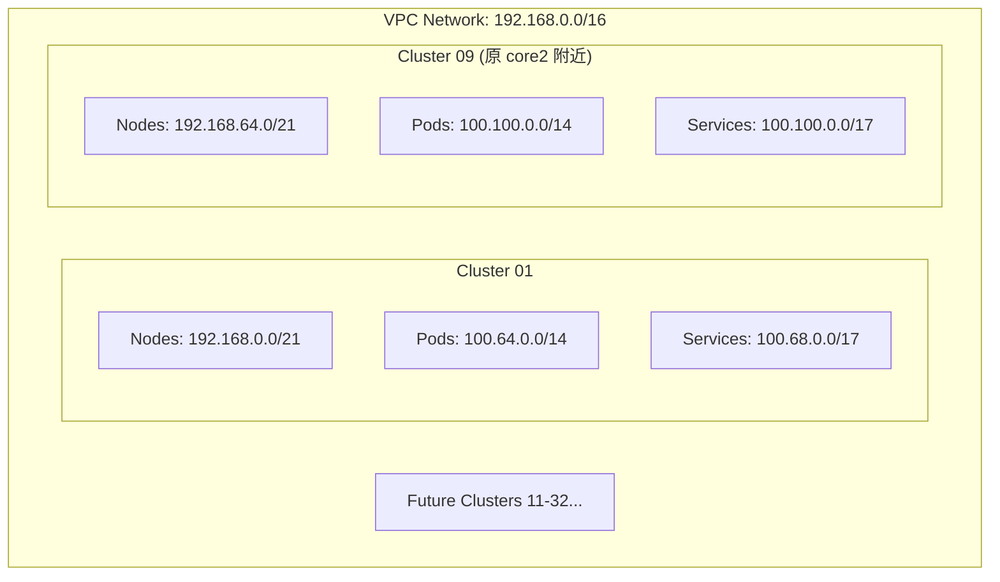

{
  "core2": {
    "network": "projectID-dev-cinternal-vpc1",
    "region": "europe-west2",
    "description": "api platform core2 in uk",
    "ip_cidr_range": "192.168.0.0/18",
    "private_ip_google_access": true,
    "secondary_ip_ranges": 0,
    "network_users": [
      "group:gcp.projectID-dev.devops-team-priv@aibang.com"
    ],
    "gke-core2-big": {
      "network": "projectID-dev-cinternal-vpc1",
      "region": "europe-west2",
      "description": "GKE2 nodes on core vpc europe-west2",
      "ip_cidr_range": "192.168.64.0/19",
      "private_ip_google_access": true,
      "secondary_ip_ranges": {
        "gkepodsbig-europe-west2": "100.64.0.0/14",
        "gkeservicesbig-europe-west2": "100.68.0.0/17"
      },
      "network_users": [
        "serviceAccount:gce-images@projectID-dev.iam.gserviceaccount.com"
      ]
    }
  }
}

你的目标其实很明确：

新环境继续使用同样的结构，但把 Node Subnet 从 /19 扩展为 /18，并重新规划 Pod / Service 的 Secondary Range。

所以核心是 GKE VPC IP Planning。
我基于你当前旧配置的逻辑，给你做一个 等比例 + 更安全的规划。

⸻

1 旧环境配置分析

你当前配置：

类型	Range	大小	说明
VPC	192.168.0.0/18	16K IP	core network
Node Subnet	192.168.64.0/19	8192 IP	GKE Node
Pods	100.64.0.0/14	262K IP	Pod CIDR
Services	100.68.0.0/17	32K IP	Service CIDR

结构：

VPC
192.168.0.0/18
    │
    └── Subnet
        192.168.64.0/19
            │
            ├── Pods
            │     100.64.0.0/14
            │
            └── Services
                  100.68.0.0/17


⸻  or we can keep the pod and svc range 
192.168.0.0/18
    │
    └── Subnet
        192.168.64.0/18
            │
            ├── Pods
            │     100.64.0.0/13
            │
            └── Services
                  100.72.0.0/16

```bash
 ✗ ipcalc 100.64.0.0/13
Address:   100.64.0.0           01100100.01000 000.00000000.00000000
Netmask:   255.248.0.0 = 13     11111111.11111 000.00000000.00000000
Wildcard:  0.7.255.255          00000000.00000 111.11111111.11111111
=>
Network:   100.64.0.0/13        01100100.01000 000.00000000.00000000
HostMin:   100.64.0.1           01100100.01000 000.00000000.00000001
HostMax:   100.71.255.254       01100100.01000 111.11111111.11111110
Broadcast: 100.71.255.255       01100100.01000 111.11111111.11111111
Hosts/Net: 524286                Class A

✗ ipcalc 100.72.0.0/16
Address:   100.72.0.0           01100100.01001000. 00000000.00000000
Netmask:   255.255.0.0 = 16     11111111.11111111. 00000000.00000000
Wildcard:  0.0.255.255          00000000.00000000. 11111111.11111111
=>
Network:   100.72.0.0/16        01100100.01001000. 00000000.00000000
HostMin:   100.72.0.1           01100100.01001000. 00000000.00000001
HostMax:   100.72.255.254       01100100.01001000. 11111111.11111110
Broadcast: 100.72.255.255       01100100.01001000. 11111111.11111111
Hosts/Net: 65534                 Class A
```
---

# **2 多集群扩展规划 (基于 192.168.x.x)**

针对您未来可能在同一个 VPC 或互联网络中拥有 **10 个集群** 的需求，我们保持 `192.168.x.x` 的节点网段风格，并进行水平扩展。

### **2.1 集群规划逻辑**
为了保持您偏好的 `/18` 范围对齐（每个集群预留 16K Node IP），我们建议将网络空间按 `/18` 边界进行切片。

| Cluster ID     | 节点网段 (Node Subnet) | Pod 网段 (Secondary) | Service 网段 (Secondary) |
| :------------- | :--------------------- | :------------------- | :----------------------- |
| **Cluster 01** | `192.168.0.0/18`       | `100.64.0.0/14`      | `100.68.0.0/17`          |
| **Cluster 02** | `192.168.64.0/18`      | `100.72.0.0/14`      | `100.72.0.0/17`          |
| **Cluster 03** | `192.168.128.0/18`     | `100.76.0.0/14`      | `100.76.0.0/17`          |
| **Cluster 04** | `192.168.192.0/18`     | `100.80.0.0/14`      | `100.80.0.0/17`          |
| **Cluster 05** | `172.16.0.0/18`        | `100.84.0.0/14`      | `100.84.0.0/17`          |
| **Cluster 06** | `172.16.64.0/18`       | `100.88.0.0/14`      | `100.88.0.0/17`          |
| **Cluster 07** | `172.16.128.0/18`      | `100.92.0.0/14`      | `100.92.0.0/17`          |
| **Cluster 08** | `172.16.192.0/18`      | `100.96.0.0/14`      | `100.96.0.0/17`          |
| **Cluster 09** | `172.17.0.0/18`        | `100.100.0.0/14`     | `100.100.0.0/17`         |
| **Cluster 10** | `172.17.64.0/18`       | `100.104.0.0/14`     | `100.104.0.0/17`         |

### **2.2 容量说明**
*   **Node (/18)**: 每个集群支持 **16,382** 个节点。这属于超大规模规划，能够完美对齐您提到的 `192.168.64.0/18` 风格。
*   **Pod (/14)**: 保持 `100.64.x.x` 系列的 CGNAT 空间，每个集群支持 **26 万** 个 Pod IP。
*   **Service (/17)**: 每个集群支持 **3.2 万** 个 Service IP。

### **2.3 架构示意图**



### **3 实施注意事项**

1.  **VPC 范围限制**: 如果您的 VPC 强制限制在 `192.168.0.0/18`（如 JSON 中所示），那么只能容纳约 8 个 `/21` 的子网。若要支持 10 个以上集群，建议将管理层级的 VPC 范围放宽到 `192.168.0.0/16`。
2.  **不重叠原则**: 在规划时，Node 网段一定不能与 Pod/Service 网段重叠。我们推荐 Pod/Service 使用 CGNAT 范围 (`100.64.0.0/10`)，因为它们不需要在 VPC Peering 网络中全量路由。
3.  **Master 预留**: 每个 GKE 私有集群都需要一个 `/28` 的私有网段用于 Control Plane，请在规划 10 个集群时，单独预留出一块小的 IP 池（如 `192.168.200.0/24`）分拆给 Master 使用。

---

# **4 未来架构设计 (GKE Platform 2.0)**

这是为您未来 API 核心平台设计的**标准生产级规划**。该设计以 `172.16.0.0/12` (RFC1918) 为基准，采用您偏好的 `/18` 节点网段对齐方式，支持 10 个以上超大规模集群的线性扩展。

### **4.1 10 集群基准规划表 (Standard /18 Alignment)**

| Cluster ID | 环境/用途 | 节点网段 (Node /18) | Pod 网段 (Secondary /14) | Service 网段 (Secondary /17) |
| :--- | :--- | :--- | :--- | :--- |
| **Cluster 01** | `core-prod-01` | `172.16.0.0/18` | `100.64.0.0/14` | `100.120.0.0/17` |
| **Cluster 02** | `core-prod-02` | `172.16.64.0/18` | `100.68.0.0/14` | `100.120.128.0/17` |
| **Cluster 03** | `shared-svc-01` | `172.16.128.0/18` | `100.72.0.0/14` | `100.121.0.0/17` |
| **Cluster 04** | `shared-svc-02` | `172.16.192.0/18` | `100.76.0.0/14` | `100.121.128.0/17` |
| **Cluster 05** | `tenant-01` | `172.17.0.0/18` | `100.80.0.0/14` | `100.122.0.0/17` |
| **Cluster 06** | `tenant-02` | `172.17.64.0/18` | `100.84.0.0/14` | `100.122.128.0/17` |
| **Cluster 07** | `staging-01` | `172.17.128.0/18` | `100.88.0.0/14` | `100.123.0.0/17` |
| **Cluster 08** | `staging-02` | `172.17.192.0/18` | `100.92.0.0/14` | `100.123.128.0/17` |
| **Cluster 09** | `dev-sandbox-01` | `172.18.0.0/18` | `100.96.0.0/14` | `100.124.0.0/17` |
| **Cluster 10** | `dev-sandbox-02` | `172.18.64.0/18` | `100.100.0.0/14` | `100.124.128.0/17` |

### **4.2 设计亮点**

1.  **极简对齐**：Node Subnet 严格按照 `0.0`, `64.0`, `128.0`, `192.0` 的步进对齐，极大降低了运维和路由排查的复杂度。
2.  **容量保证**：
    *   **Nodes**: 每个集群拥有 16K IP，支持海量节点扩展。
    *   **Pods**: 使用 CGNAT 范围，每个集群分配 `/14` (26万 IP)，确保 Pod 调度不会因为 IP 碎片化而受限。
    *   **Services**: 每个集群分配 `/17` (3.2万 IP)，足以支撑数千个微服务的负载均衡。
3.  **多项目兼容性**：该方案可以直接应用于 Shared VPC 环境。如果后续需要跨项目部署 Tenant 集群，只需从该池中分配对应的子网即可。
4.  **路由隔离**：Pod 和 Service 强制放在 `100.64.0.0/10` 范围内。在 VPC Peering 或企业路由器（Cloud Router）上，您可以选择仅宣告 `172.16.0.0/12` 段，从而精简路由表条目，提高转发效率。

---
> [!TIP]
> **落地建议**：如果您使用 Terraform 设计，可以将此表格定义为 `locals` 映射。在创建子网时，通过变量动态计算 `ip_cidr_range` 和 `secondary_ip_range`，从而实现“规划即代码 (Planning as Code)”。