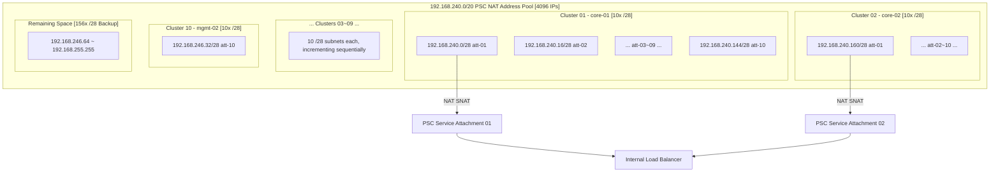
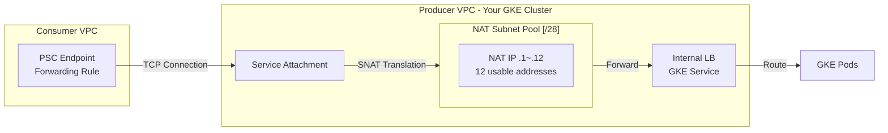
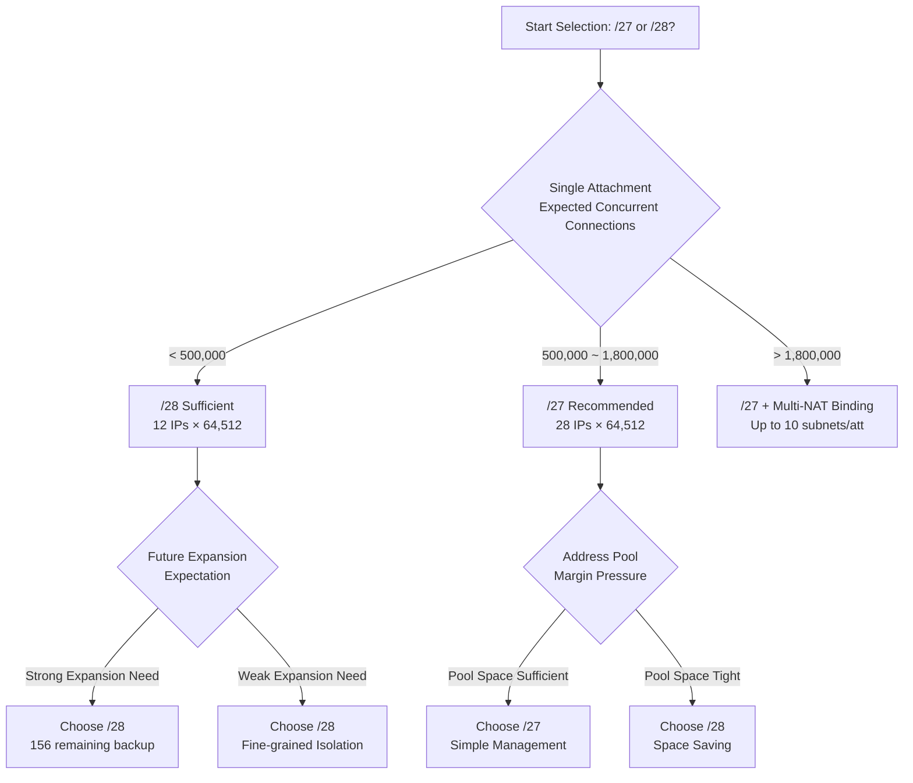
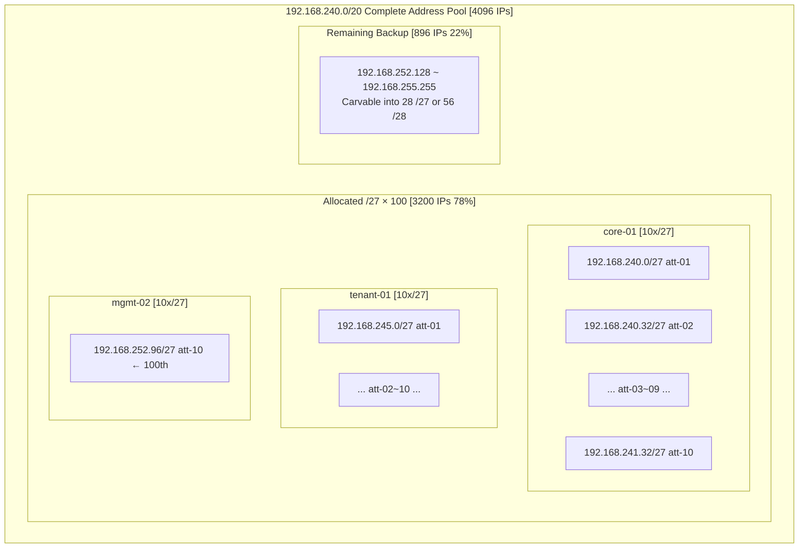
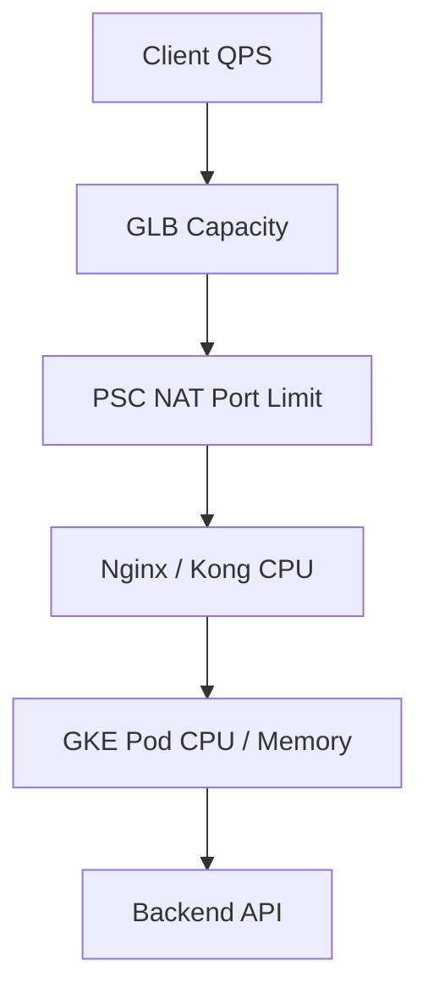

- [background](#background)
- [**5 Production-Grade Multi-Cluster IP Planning (Based on 192.168.64.0/20 Architecture)**](#5-production-grade-multi-cluster-ip-planning-based-on-19216864020-architecture)
    - [**5.1 10-Cluster Detailed Planning Table (Standard /20 Node Alignment)**](#51-10-cluster-detailed-planning-table-standard-20-node-alignment)
  - [🔍 Problem Analysis](#-problem-analysis)
  - [🛠 I. Address Pool Basic Calculation](#-i-address-pool-basic-calculation)
    - [1.1 Fixed Pool Capacity](#11-fixed-pool-abjacity)
    - [1.2 Subnet Splitting Options Comparison](#12-subnet-splitting-options-comparison)
  - [🛠 II. Strict /28 Calculation (Minimum Subnet Option)](#-ii-strict-28-calculation-minimum-subnet-option)
    - [2.1 /28 Capacity Calculation](#21-28-abjacity-calculation)
    - [2.2 PSC NAT Subnet Actual Usage for /28](#22-psc-nat-subnet-actual-usage-for-28)
    - [2.3 100 /28 Subnet Address Allocation Table (10 Clusters × 10 Attachments)](#23-100-28-subnet-address-allocation-table-10-clusters--10-attachments)
  - [🛠 III. Complete /28 Subnet Precise Calculation Table](#-iii-complete-28-subnet-precise-calculation-table)
  - [🛠 IV. PSC NAT Quota / Capacity Detailed Explanation](#-iv-psc-nat-quota--abjacity-detailed-explanation)
    - [4.1 PSC NAT Core Mechanism](#41-psc-nat-core-mechanism)
    - [4.2 Key Quota Dimensions](#42-key-quota-dimensions)
    - [4.3 NAT IP Capacity Calculation Formula](#43-nat-ip-abjacity-calculation-formula)
    - [4.4 High Traffic Scenario NAT Subnet Expansion Strategy](#44-high-traffic-scenario-nat-subnet-expansion-strategy)
  - [📊 V. Architecture Flow Diagram](#-v-architecture-flow-diagram)
  - [🛠 VI. Integration with Existing Planning](#-vi-integration-with-existing-planning)
  - [⚠️ VII. Considerations and Best Practices](#️-vii-considerations-and-best-practices)
    - [7.1 Subnet Selection Recommendations](#71-subnet-selection-recommendations)
    - [7.2 NAT Subnet Creation Standards](#72-nat-subnet-creation-standards)
    - [7.3 Service Attachment Binding](#73-service-attachment-binding)
    - [7.4 Quota Application Recommendations](#74-quota-application-recommendations)
    - [7.5 Naming Convention Recommendations](#75-naming-convention-recommendations)
  - [Summary](#summary)
- [/27](#27)
  - [🔍 Problem Analysis](#-problem-analysis-1)
  - [🛠 I. /27 Basic Capacity Calculation](#-i-27-basic-abjacity-calculation)
    - [1.1 /27 Single Subnet IP Structure](#11-27-single-subnet-ip-structure)
  - [🛠 II. /27 Complete Subnet Allocation Table (100 subnets, 10 Clusters × 10 Attachments)](#-ii-27-complete-subnet-allocation-table-100-subnets-10-clusters--10-attachments)
    - [2.1 Address Increment Pattern](#21-address-increment-pattern)
    - [2.2 Per-Cluster Detailed Allocation](#22-per-cluster-detailed-allocation)
  - [🛠 III. /27 vs /28 In-Depth Comparison Analysis](#-iii-27-vs-28-in-depth-comparison-analysis)
    - [3.1 Core Metrics Comparison](#31-core-metrics-comparison)
    - [3.2 Scenario Selection Decision Tree](#32-scenario-selection-decision-tree)
    - [3.3 Attachment Tiering Recommendations by Business Type](#33-attachment-tiering-recommendations-by-business-type)
    - [3.4 Hybrid Strategy (Best Practice)](#34-hybrid-strategy-best-practice)
  - [📊 IV. Address Space Distribution Visualization](#-iv-address-space-distribution-visualization)
  - [⚠️ V. /27 Option Key Considerations](#️-v-27-option-key-considerations)
    - [5.1 Margin Warning](#51-margin-warning)
    - [5.2 Terraform Batch Creation Example (/27)](#52-terraform-batch-creation-example-27)
    - [5.3 Verification Script](#53-verification-script)
  - [Summary Comparison](#summary-comparison)
- [quota](#quota)
- [PSC NAT IP Capacity Assessment & Network Performance Modeling](#psc-nat-ip-abjacity-assessment--network-performance-modeling)
  - [1. Problem Analysis](#1-problem-analysis)
  - [2. Basic Calculation (Your Question)](#2-basic-calculation-your-question)
    - [Concurrent Connection Capacity](#concurrent-connection-abjacity)

# background

Based on the information I've provided below, I hope you can help me explore:

PRIVATE_SERVICE_CONNECT Definition and Planning (Single Region 10 Clusters / Multiple Attachments per Cluster / High Traffic Version)

Strictly calculate based on 192.168.240.0/20: 10 Clusters × 10 Attachments
* Fixed total pool: 192.168.240.0/20
* Fixed number of clusters: 10
* Fixed number of attachments per cluster: 10. Of course, the 10 attachments here may vary based on application business type. For example, there might be 6 or 8, meaning up to 10 maximum.
* I need a rough abjacity estimation, such as the abjacity estimation for the minimum /28 subnet
* PSC NAT Quota / Capacity detailed explanation
* Goal: Strictly guarantee the ability to carve out 100 independent PSC NAT subnets

Below is the background information.

# **5 Production-Grade Multi-Cluster IP Planning (Based on 192.168.64.0/20 Architecture)**

This planning is based on your currently recommended **192.168.64.0/20** as the node starting segment, specifically designed for parallel deployment of 10+ clusters, meeting Master management IP continuity and network segment alignment requirements.

GCE has already allocated 192.168.0.0/18.

### **5.1 10-Cluster Detailed Planning Table (Standard /20 Node Alignment)**

| Cluster ID     | Environment Name | Node Subnet (/20)  | Pod Subnet (/18)  | Service Subnet (/18) | Master Management (/27) |
| :------------- | :--------------- | :----------------- | :---------------- | :------------------- | :---------------------- |
| **Cluster 01** | `core-01`        | `192.168.64.0/20`  | `100.64.0.0/18`   | `100.68.0.0/18`      | `192.168.224.0/27`      |
| **Cluster 02** | `core-02`        | `192.168.80.0/20`  | `100.64.64.0/18`  | `100.68.64.0/18`     | `192.168.224.32/27`     |
| **Cluster 03** | `core-03`        | `192.168.96.0/20`  | `100.64.128.0/18` | `100.68.128.0/18`    | `192.168.224.64/27`     |
| **Cluster 04** | `core-04`        | `192.168.112.0/20` | `100.64.192.0/18` | `100.68.192.0/18`    | `192.168.224.96/27`     |
| **Cluster 05** | `tenant-01`      | `192.168.128.0/20` | `100.65.0.0/18`   | `100.69.0.0/18`      | `192.168.224.128/27`    |
| **Cluster 06** | `tenant-02`      | `192.168.144.0/20` | `100.65.64.0/18`  | `100.69.64.0/18`     | `192.168.224.160/27`    |
| **Cluster 07** | `staging-01`     | `192.168.160.0/20` | `100.65.128.0/18` | `100.69.128.0/18`    | `192.168.224.192/27`    |
| **Cluster 08** | `staging-02`     | `192.168.176.0/20` | `100.65.192.0/18` | `100.69.192.0/18`    | `192.168.224.224/27`    |
| **Cluster 09** | `mgmt-01`        | `192.168.192.0/20` | `100.66.0.0/18`   | `100.70.0.0/18`      | `192.168.225.0/27`      |
| **Cluster 10** | `mgmt-02`        | `192.168.208.0/20` | `100.66.64.0/18`  | `100.70.64.0/18`     | `192.168.225.32/27`     |


## 🔍 Problem Analysis

Core task: Within the fixed address pool `192.168.240.0/20`, strictly carve out **100 independent PSC NAT Subnets** (10 clusters × 10 Attachments), and complete abjacity estimation, NAT Quota analysis, and planning verification.

---

## 🛠 I. Address Pool Basic Calculation

### 1.1 Fixed Pool Capacity

```
192.168.240.0/20
├── Start Address: 192.168.240.0
├── End Address: 192.168.255.255
├── Total IPs: 2^12 = 4096 addresses
└── Usable Range: 192.168.240.0 ~ 192.168.255.255
```

### 1.2 Subnet Splitting Options Comparison

| Subnet Size | IPs per Subnet |的可切数量 | Meets 100 Requirement | Remaining Subnets | Recommendation |
| -------- | ------------- | -------- | ------------- | --------- | ------ |
| `/28`    | 16            | 256      | ✅ More than enough    | 156 remaining | ⭐⭐⭐    |
| `/27`    | 32            | 128      | ✅ With margin      | 28 remaining  | ⭐⭐⭐⭐   |
| `/26`    | 64            | 64       | ❌ Insufficient for 100     | —         | ❌      |

> **Conclusion: `/28` is the minimum usable unit, `/27` is the recommended optimal solution (balancing margin and management complexity).**

---

## 🛠 II. Strict /28 Calculation (Minimum Subnet Option)

### 2.1 /28 Capacity Calculation

```
/20 Pool = 4096 IPs
/28 subnet = 16 IPs
Carvable quantity = 4096 ÷ 16 = 256 /28 subnets

Requirement: 100
Remaining: 156 (available for future expansion or backup)
```

### 2.2 PSC NAT Subnet Actual Usage for /28

**⚠️ Key Understanding: PSC NAT Subnet IP Consumption Model**

```
Each /28 subnet = 16 IPs
├── Network Address:   1 (unusable)
├── Broadcast Address: 1 (unusable)
├── GCP Reserved:      2 (typically .1 gateway + .2)
└── Usable NAT IPs:    12 (actually available for SNAT mapping)

Each NAT IP supports approximately 64,512 concurrent connections (port mapping)
12 IPs × 64,512 = approximately 774,144 concurrent connections/attachment
```

### 2.3 100 /28 Subnet Address Allocation Table (10 Clusters × 10 Attachments)

```
192.168.240.0/20 carved into 100 /28 subnets

Cluster 01 (core-01):     192.168.240.0/28  ~ 192.168.240.144/28  [10 subnets]
Cluster 02 (core-02):     192.168.240.160/28 ~ 192.168.241.48/28  [10 subnets]
Cluster 03 (core-03):     192.168.241.64/28  ~ 192.168.241.208/28 [10 subnets]
Cluster 04 (core-04):     192.168.241.224/28 ~ 192.168.242.112/28 [10 subnets]
Cluster 05 (tenant-01):   192.168.242.128/28 ~ 192.168.243.16/28  [10 subnets]
Cluster 06 (tenant-02):   192.168.243.32/28  ~ 192.168.243.176/28 [10 subnets]
Cluster 07 (staging-01):  192.168.243.192/28 ~ 192.168.244.80/28  [10 subnets]
Cluster 08 (staging-02):  192.168.244.96/28  ~ 192.168.244.240/28 [10 subnets]
Cluster 09 (mgmt-01):     192.168.245.0/28   ~ 192.168.245.144/28 [10 subnets]
Cluster 10 (mgmt-02):     192.168.245.160/28 ~ 192.168.246.48/28  [10 subnets]

Used Space: 100 × 16 = 1600 IPs (192.168.240.0 ~ 192.168.246.63)
Remaining Space: 192.168.246.64 ~ 192.168.255.255 = 2496 IPs (156 /28 subnets available)
```

---

## 🛠 III. Complete /28 Subnet Precise Calculation Table

| Cluster | Attachment | PSC NAT Subnet       | Usable IP Range | Usable NAT IPs |
| ------- | ---------- | -------------------- | --------------- | -------------- |
| core-01 | att-01     | `192.168.240.0/28`   | .1~.14          | 12             |
| core-01 | att-02     | `192.168.240.16/28`  | .17~.30         | 12             |
| core-01 | att-03     | `192.168.240.32/28`  | .33~.46         | 12             |
| core-01 | att-04     | `192.168.240.48/28`  | .49~.62         | 12             |
| core-01 | att-05     | `192.168.240.64/28`  | .65~.78         | 12             |
| core-01 | att-06     | `192.168.240.80/28`  | .81~.94         | 12             |
| core-01 | att-07     | `192.168.240.96/28`  | .97~.110        | 12             |
| core-01 | att-08     | `192.168.240.112/28` | .113~.126       | 12             |
| core-01 | att-09     | `192.168.240.128/28` | .129~.142       | 12             |
| core-01 | att-10     | `192.168.240.144/28` | .145~.158       | 12             |
| core-02 | att-01     | `192.168.240.160/28` | .161~.174       | 12             |
| ...     | ...        | *(and so on)*        | ...             | ...            |
| mgmt-02 | att-10     | `192.168.246.32/28`  | .33~.46         | 12             |

---

## 🛠 IV. PSC NAT Quota / Capacity Detailed Explanation

### 4.1 PSC NAT Core Mechanism

```
PSC Producer Side (Your Server End):
┌─────────────────────────────────────────────┐
│  Consumer VPC  →  PSC Endpoint (Forwarding  │
│                   Rule)  →  NAT Subnet  →   │
│                   Producer Internal LB       │
└─────────────────────────────────────────────┘

NAT Subnet Purpose:
- Provide independent SNAT IP pool for each Consumer's connections
- Isolate traffic from different Consumers (non-overlapping IPs)
- Each Attachment corresponds to one or more NAT Subnets
```

### 4.2 Key Quota Dimensions

| Quota Name                                       | Default Limit | Scope              | Description                                           |
| ------------------------------------------------ | ------------- | ------------------ | ----------------------------------------------------- |
| `psc_forwarding_rules_per_producer_service`      | 10            | Per Service        | Number of Consumer connections each Producer Service can accept |
| `psc_nat_subnets_per_service_attachment`         | 10            | Per Attachment     | **Each Attachment can bind up to 10 NAT Subnets**     |
| `psc_service_attachments_per_producer_network`   | 100           | Per Network        | Entire VPC maximum 100 Attachments                    |
| `subnets_per_network`                            | 300           | Per Network/Region | Number of subnets per VPC per region                  |

### 4.3 NAT IP Capacity Calculation Formula

```
Single NAT IP concurrent connection upper limit:
  = 65535 - 1023 (reserved ports) = 64,512 ports

Single /28 NAT Subnet concurrent connection upper limit:
  = 12 usable IPs × 64,512 = 774,144 concurrent connections

Single Attachment (bound to 1 /28) throughput estimation (assuming average connection duration 30s):
  = 774,144 ÷ 30s ≈ 25,800 new connections/second
```

### 4.4 High Traffic Scenario NAT Subnet Expansion Strategy

```
Each Attachment can bind up to 10 NAT Subnets:

Scenario: High-traffic Attachment uses 3 /28 NAT Subnets
  = 3 × 12 IPs × 64,512 = 2,322,432 concurrent connections

Strategy Recommendations:
├── Normal Business Attachment: 1 /28 (12 NAT IPs)
├── Medium Traffic Attachment: 2 /28 (24 NAT IPs)
└── High-Traffic Core Attachment: 3~5 /28 (36~60 NAT IPs)
```

---

## 📊 V. Architecture Flow Diagram





---

## 🛠 VI. Integration with Existing Planning

```
Overall 192.168.0.0/18 Space Usage Overview:

192.168.0.0/18 (GCE Allocated)
├── 192.168.0.0/20   - [Planned or Reserved]
├── 192.168.16.0/20  - [Planned or Reserved]
├── ...
├── 192.168.64.0/20  - Cluster 01 Node Subnet
├── 192.168.80.0/20  - Cluster 02 Node Subnet
├── 192.168.96.0/20  - Cluster 03 Node Subnet
├── 192.168.112.0/20 - Cluster 04 Node Subnet
├── 192.168.128.0/20 - Cluster 05 Node Subnet
├── 192.168.144.0/20 - Cluster 06 Node Subnet
├── 192.168.160.0/20 - Cluster 07 Node Subnet
├── 192.168.176.0/20 - Cluster 08 Node Subnet
├── 192.168.192.0/20 - Cluster 09 Node Subnet
├── 192.168.208.0/20 - Cluster 10 Node Subnet
├── 192.168.224.0/20 - Master Management (/27 × 10)
└── 192.168.240.0/20 - ★ PSC NAT Subnet Pool (This Planning)
```

> **Perfect Alignment**: `192.168.240.0/20` is exactly the last `/20` block of `192.168.0.0/18`, adjacent to the Master Management segment `192.168.224.0/20`. The overall planning has no overlap and no gaps.

---

## ⚠️ VII. Considerations and Best Practices

### 7.1 Subnet Selection Recommendations

```
Reasons to recommend /28 (rather than larger):
✅ Fine-grained Isolation: Each Attachment corresponds to an independent /28, minimizing impact scope when issues occur
✅ Sufficient Margin: 256 carveable, 156 remaining as backup after using 100
✅ Meets PSC Requirements: GCP PSC NAT Subnet minimum support is /28
⚠️  Note: /29 (8 IPs) may be insufficient for high concurrency, /28 is the recommended lower bound
```

### 7.2 NAT Subnet Creation Standards

```bash
# Create PSC NAT Subnet Example (core-01 att-01)
gcloud compute networks subnets create psc-nat-core01-att01 \
  --network=YOUR_VPC_NAME \
  --region=asia-northeast1 \
  --range=192.168.240.0/28 \
  --purpose=PRIVATE_SERVICE_CONNECT \
  --role=ACTIVE

# Note: purpose must be PRIVATE_SERVICE_CONNECT
# Such subnets cannot be used for regular VMs, dedicated for PSC NAT
```

### 7.3 Service Attachment Binding

```yaml
# Terraform Example: Service Attachment Binding NAT Subnet
resource "google_compute_service_attachment" "core01_att01" {
  name        = "core01-attachment-01"
  region      = "asia-northeast1"

  nat_subnets = [
    google_compute_subnetwork.psc_nat_core01_att01.self_link
    # Can bind multiple NAT subnets for high traffic, up to 10
  ]

  target_service = google_compute_forwarding_rule.ilb.self_link
  connection_preference = "ACCEPT_AUTOMATIC"
}
```

### 7.4 Quota Application Recommendations

```
Production Environment: Apply for the following Quota increases in advance:
1. psc_service_attachments_per_producer_network: 100 → 200 (reserve expansion space)
2. subnets_per_network: Confirm current used quantity + 100 (PSC NAT) < limit
3. forwarding_rules_per_network: Confirm sufficient to cover all Attachments

Check Command:
gcloud compute project-info describe --project=YOUR_PROJECT \
  | grep -A2 "SUBNETS\|PSC\|FORWARDING"
```

### 7.5 Naming Convention Recommendations

```
Format: psc-nat-{cluster-name}-{att-id}
Examples:
  psc-nat-core01-att01   → 192.168.240.0/28
  psc-nat-core01-att02   → 192.168.240.16/28
  psc-nat-tenant01-att06 → 192.168.242.208/28

Benefits:
  - gcloud filter queries
  - Monitoring and alerting differentiation
  - Quick problem Attachment localization
```

---

## Summary

| Metric                  | Value                                                                     |
| ----------------------- | ------------------------------------------------------------------------- |
| Total Address Pool      | `192.168.240.0/20` = 4096 IPs                                             |
| Carving Unit            | `/28` = 16 IPs/subnet                                                     |
| Required Quantity       | 100 (10 Clusters × 10 Attachments)                                        |
| Consumed                | 1600 IPs (192.168.240.0 ~ 192.168.246.63)                                 |
| Remaining Backup        | 156 /28 subnets (supports future expansion or multi-NAT binding)          |
| Single Attachment Concurrency | 774,144 (12 IPs × 64,512 ports)                                     |
| Planning Conclusion     | ✅ Strictly meets 100 independent PSC NAT Subnet requirements, with **zero conflict** with existing Node/Master planning |


# /27

## 🔍 Problem Analysis

Based on the fixed pool `192.168.240.0/20`, using `/27` as the carving unit, perform an equally deep comparison analysis as `/28`.

---

## 🛠 I. /27 Basic Capacity Calculation

```
/20 Pool = 4096 IPs
/27 subnet = 32 IPs
Carvable quantity = 4096 ÷ 32 = 128 /27 subnets

Requirement: 100
Remaining: 28 (approximately 22% margin)

IP Utilization Comparison:
  /28 Option: 1600 IPs used for 100 subnets, 2496 IPs remaining (61% idle)
  /27 Option: 3200 IPs used for 100 subnets, 896 IPs remaining (22% idle)
```

### 1.1 /27 Single Subnet IP Structure

```
Each /27 subnet = 32 IPs
├── Network Address:   1 (.0)
├── Broadcast Address: 1 (.31)
├── GCP Reserved:      2 (.1 gateway + .2 reserved)
└── Usable NAT IPs:    28 (actually allocatable for SNAT use)

Concurrent Connection Capacity:
  28 IPs × 64,512 ports = 1,806,336 concurrent connections/attachment
  Compared to /28: 774,144 → 2.33x improvement
```

---

## 🛠 II. /27 Complete Subnet Allocation Table (100 subnets, 10 Clusters × 10 Attachments)

### 2.1 Address Increment Pattern

```
/27 Step = 32
Start:   192.168.240.0
2nd:     192.168.240.32
3rd:     192.168.240.64
...
8th:     192.168.240.224
9th:     192.168.241.0   ← Crossing .240 segment
...
128th:   192.168.247.224  ← Last carveable /27

ipcalc 192.168.240.0/24
Address:   192.168.240.0        11000000.10101000.11110000. 00000000
Netmask:   255.255.255.0 = 24   11111111.11111111.11111111. 00000000
Wildcard:  0.0.0.255            00000000.00000000.00000000. 11111111
=>
Network:   192.168.240.0/24     11000000.10101000.11110000. 00000000
HostMin:   192.168.240.1        11000000.10101000.11110000. 00000001
HostMax:   192.168.240.254      11000000.10101000.11110000. 11111110
Broadcast: 192.168.240.255      11000000.10101000.11110000. 11111111
Hosts/Net: 254                   Class C, Private Internet
```

### 2.2 Per-Cluster Detailed Allocation

| Cluster        | Att ID | PSC NAT Subnet `/27` | Usable NAT IP Range | Usable IPs | Concurrent Connection Upper Limit |
| -------------- | ------ | -------------------- | ------------------- | ---------- | --------------------------------- |
| **core-01**    | att-01 | `192.168.240.0/27`   | .2 ~ .30            | 28         | 1,806,336                         |
| **core-01**    | att-02 | `192.168.240.32/27`  | .34 ~ .62           | 28         | 1,806,336                         |
| **core-01**    | att-03 | `192.168.240.64/27`  | .66 ~ .94           | 28         | 1,806,336                         |
| **core-01**    | att-04 | `192.168.240.96/27`  | .98 ~ .126          | 28         | 1,806,336                         |
| **core-01**    | att-05 | `192.168.240.128/27` | .130 ~ .158         | 28         | 1,806,336                         |
| **core-01**    | att-06 | `192.168.240.160/27` | .162 ~ .190         | 28         | 1,806,336                         |
| **core-01**    | att-07 | `192.168.240.192/27` | .194 ~ .222         | 28         | 1,806,336                         |
| **core-01**    | att-08 | `192.168.240.224/27` | .226 ~ .254         | 28         | 1,806,336                         |
| **core-01**    | att-09 | `192.168.241.0/27`   | .2 ~ .30            | 28         | 1,806,336                         |
| **core-01**    | att-10 | `192.168.241.32/27`  | .34 ~ .62           | 28         | 1,806,336                         |
| **core-02**    | att-01 | `192.168.241.64/27`  | .66 ~ .94           | 28         | 1,806,336                         |
| **core-02**    | att-02 | `192.168.241.96/27`  | .98 ~ .126          | 28         | 1,806,336                         |
| **core-02**    | att-03 | `192.168.241.128/27` | .130 ~ .158         | 28         | 1,806,336                         |
| **core-02**    | att-04 | `192.168.241.160/27` | .162 ~ .190         | 28         | 1,806,336                         |
| **core-02**    | att-05 | `192.168.241.192/27` | .194 ~ .222         | 28         | 1,806,336                         |
| **core-02**    | att-06 | `192.168.241.224/27` | .226 ~ .254         | 28         | 1,806,336                         |
| **core-02**    | att-07 | `192.168.242.0/27`   | .2 ~ .30            | 28         | 1,806,336                         |
| **core-02**    | att-08 | `192.168.242.32/27`  | .34 ~ .62           | 28         | 1,806,336                         |
| **core-02**    | att-09 | `192.168.242.64/27`  | .66 ~ .94           | 28         | 1,806,336                         |
| **core-02**    | att-10 | `192.168.242.96/27`  | .98 ~ .126          | 28         | 1,806,336                         |
| **core-03**    | att-01 | `192.168.242.128/27` | .130 ~ .158         | 28         | 1,806,336                         |
| **core-03**    | att-02 | `192.168.242.160/27` | .162 ~ .190         | 28         | 1,806,336                         |
| **core-03**    | att-03 | `192.168.242.192/27` | .194 ~ .222         | 28         | 1,806,336                         |
| **core-03**    | att-04 | `192.168.242.224/27` | .226 ~ .254         | 28         | 1,806,336                         |
| **core-03**    | att-05 | `192.168.243.0/27`   | .2 ~ .30            | 28         | 1,806,336                         |
| **core-03**    | att-06 | `192.168.243.32/27`  | .34 ~ .62           | 28         | 1,806,336                         |
| **core-03**    | att-07 | `192.168.243.64/27`  | .66 ~ .94           | 28         | 1,806,336                         |
| **core-03**    | att-08 | `192.168.243.96/27`  | .98 ~ .126          | 28         | 1,806,336                         |
| **core-03**    | att-09 | `192.168.243.128/27` | .130 ~ .158         | 28         | 1,806,336                         |
| **core-03**    | att-10 | `192.168.243.160/27` | .162 ~ .190         | 28         | 1,806,336                         |
| **core-04**    | att-01 | `192.168.243.192/27` | .194 ~ .222         | 28         | 1,806,336                         |
| **core-04**    | att-02 | `192.168.243.224/27` | .226 ~ .254         | 28         | 1,806,336                         |
| **core-04**    | att-03 | `192.168.244.0/27`   | .2 ~ .30            | 28         | 1,806,336                         |
| **core-04**    | att-04 | `192.168.244.32/27`  | .34 ~ .62           | 28         | 1,806,336                         |
| **core-04**    | att-05 | `192.168.244.64/27`  | .66 ~ .94           | 28         | 1,806,336                         |
| **core-04**    | att-06 | `192.168.244.96/27`  | .98 ~ .126          | 28         | 1,806,336                         |
| **core-04**    | att-07 | `192.168.244.128/27` | .130 ~ .158         | 28         | 1,806,336                         |
| **core-04**    | att-08 | `192.168.244.160/27` | .162 ~ .190         | 28         | 1,806,336                         |
| **core-04**    | att-09 | `192.168.244.192/27` | .194 ~ .222         | 28         | 1,806,336                         |
| **core-04**    | att-10 | `192.168.244.224/27` | .226 ~ .254         | 28         | 1,806,336                         |
| **tenant-01**  | att-01 | `192.168.245.0/27`   | .2 ~ .30            | 28         | 1,806,336                         |
| **tenant-01**  | att-02 | `192.168.245.32/27`  | .34 ~ .62           | 28         | 1,806,336                         |
| **tenant-01**  | att-03 | `192.168.245.64/27`  | .66 ~ .94           | 28         | 1,806,336                         |
| **tenant-01**  | att-04 | `192.168.245.96/27`  | .98 ~ .126          | 28         | 1,806,336                         |
| **tenant-01**  | att-05 | `192.168.245.128/27` | .130 ~ .158         | 28         | 1,806,336                         |
| **tenant-01**  | att-06 | `192.168.245.160/27` | .162 ~ .190         | 28         | 1,806,336                         |
| **tenant-01**  | att-07 | `192.168.245.192/27` | .194 ~ .222         | 28         | 1,806,336                         |
| **tenant-01**  | att-08 | `192.168.245.224/27` | .226 ~ .254         | 28         | 1,806,336                         |
| **tenant-01**  | att-09 | `192.168.246.0/27`   | .2 ~ .30            | 28         | 1,806,336                         |
| **tenant-01**  | att-10 | `192.168.246.32/27`  | .34 ~ .62           | 28         | 1,806,336                         |
| **tenant-02**  | att-01 | `192.168.246.64/27`  | .66 ~ .94           | 28         | 1,806,336                         |
| **tenant-02**  | att-02 | `192.168.246.96/27`  | .98 ~ .126          | 28         | 1,806,336                         |
| **tenant-02**  | att-03 | `192.168.246.128/27` | .130 ~ .158         | 28         | 1,806,336                         |
| **tenant-02**  | att-04 | `192.168.246.160/27` | .162 ~ .190         | 28         | 1,806,336                         |
| **tenant-02**  | att-05 | `192.168.246.192/27` | .194 ~ .222         | 28         | 1,806,336                         |
| **tenant-02**  | att-06 | `192.168.246.224/27` | .226 ~ .254         | 28         | 1,806,336                         |
| **tenant-02**  | att-07 | `192.168.247.0/27`   | .2 ~ .30            | 28         | 1,806,336                         |
| **tenant-02**  | att-08 | `192.168.247.32/27`  | .34 ~ .62           | 28         | 1,806,336                         |
| **tenant-02**  | att-09 | `192.168.247.64/27`  | .66 ~ .94           | 28         | 1,806,336                         |
| **tenant-02**  | att-10 | `192.168.247.96/27`  | .98 ~ .126          | 28         | 1,806,336                         |
| **staging-01** | att-01 | `192.168.247.128/27` | .130 ~ .158         | 28         | 1,806,336                         |
| **staging-01** | att-02 | `192.168.247.160/27` | .162 ~ .190         | 28         | 1,806,336                         |
| **staging-01** | att-03 | `192.168.247.192/27` | .194 ~ .222         | 28         | 1,806,336                         |
| **staging-01** | att-04 | `192.168.247.224/27` | .226 ~ .254         | 28         | 1,806,336                         |
| **staging-01** | att-05 | `192.168.248.0/27`   | .2 ~ .30            | 28         | 1,806,336                         |
| **staging-01** | att-06 | `192.168.248.32/27`  | .34 ~ .62           | 28         | 1,806,336                         |
| **staging-01** | att-07 | `192.168.248.64/27`  | .66 ~ .94           | 28         | 1,806,336                         |
| **staging-01** | att-08 | `192.168.248.96/27`  | .98 ~ .126          | 28         | 1,806,336                         |
| **staging-01** | att-09 | `192.168.248.128/27` | .130 ~ .158         | 28         | 1,806,336                         |
| **staging-01** | att-10 | `192.168.248.160/27` | .162 ~ .190         | 28         | 1,806,336                         |
| **staging-02** | att-01 | `192.168.248.192/27` | .194 ~ .222         | 28         | 1,806,336                         |
| **staging-02** | att-02 | `192.168.248.224/27` | .226 ~ .254         | 28         | 1,806,336                         |
| **staging-02** | att-03 | `192.168.249.0/27`   | .2 ~ .30            | 28         | 1,806,336                         |
| **staging-02** | att-04 | `192.168.249.32/27`  | .34 ~ .62           | 28         | 1,806,336                         |
| **staging-02** | att-05 | `192.168.249.64/27`  | .66 ~ .94           | 28         | 1,806,336                         |
| **staging-02** | att-06 | `192.168.249.96/27`  | .98 ~ .126          | 28         | 1,806,336                         |
| **staging-02** | att-07 | `192.168.249.128/27` | .130 ~ .158         | 28         | 1,806,336                         |
| **staging-02** | att-08 | `192.168.249.160/27` | .162 ~ .190         | 28         | 1,806,336                         |
| **staging-02** | att-09 | `192.168.249.192/27` | .194 ~ .222         | 28         | 1,806,336                         |
| **staging-02** | att-10 | `192.168.249.224/27` | .226 ~ .254         | 28         | 1,806,336                         |
| **mgmt-01**    | att-01 | `192.168.250.0/27`   | .2 ~ .30            | 28         | 1,806,336                         |
| **mgmt-01**    | att-02 | `192.168.250.32/27`  | .34 ~ .62           | 28         | 1,806,336                         |
| **mgmt-01**    | att-03 | `192.168.250.64/27`  | .66 ~ .94           | 28         | 1,806,336                         |
| **mgmt-01**    | att-04 | `192.168.250.96/27`  | .98 ~ .126          | 28         | 1,806,336                         |
| **mgmt-01**    | att-05 | `192.168.250.128/27` | .130 ~ .158         | 28         | 1,806,336                         |
| **mgmt-01**    | att-06 | `192.168.250.160/27` | .162 ~ .190         | 28         | 1,806,336                         |
| **mgmt-01**    | att-07 | `192.168.250.192/27` | .194 ~ .222         | 28         | 1,806,336                         |
| **mgmt-01**    | att-08 | `192.168.250.224/27` | .226 ~ .254         | 28         | 1,806,336                         |
| **mgmt-01**    | att-09 | `192.168.251.0/27`   | .2 ~ .30            | 28         | 1,806,336                         |
| **mgmt-01**    | att-10 | `192.168.251.32/27`  | .34 ~ .62           | 28         | 1,806,336                         |
| **mgmt-02**    | att-01 | `192.168.251.64/27`  | .66 ~ .94           | 28         | 1,806,336                         |
| **mgmt-02**    | att-02 | `192.168.251.96/27`  | .98 ~ .126          | 28         | 1,806,336                         |
| **mgmt-02**    | att-03 | `192.168.251.128/27` | .130 ~ .158         | 28         | 1,806,336                         |
| **mgmt-02**    | att-04 | `192.168.251.160/27` | .162 ~ .190         | 28         | 1,806,336                         |
| **mgmt-02**    | att-05 | `192.168.251.192/27` | .194 ~ .222         | 28         | 1,806,336                         |
| **mgmt-02**    | att-06 | `192.168.251.224/27` | .226 ~ .254         | 28         | 1,806,336                         |
| **mgmt-02**    | att-07 | `192.168.252.0/27`   | .2 ~ .30            | 28         | 1,806,336                         |
| **mgmt-02**    | att-08 | `192.168.252.32/27`  | .34 ~ .62           | 28         | 1,806,336                         |
| **mgmt-02**    | att-09 | `192.168.252.64/27`  | .66 ~ .94           | 28         | 1,806,336                         |
| **mgmt-02**    | att-10 | `192.168.252.96/27`  | .98 ~ .126          | 28         | 1,806,336                         |

```
Used Boundary: 192.168.240.0 ~ 192.168.252.127 (100th /27 ends)
Remaining Backup: 192.168.252.128 ~ 192.168.255.255 = 896 IPs = 28 /27 subnets
```

---

## 🛠 III. /27 vs /28 In-Depth Comparison Analysis

### 3.1 Core Metrics Comparison

| Metric                   | `/28` Option      | `/27` Option       | Difference                    |
| ------------------------ | ----------------- | ------------------ | ----------------------------- |
| Subnet Size              | 16 IPs            | 32 IPs             | /27 is 2x /28                 |
| Usable NAT IPs/subnet    | 12                | 28                 | /27 has 16 more (+133%)       |
| Concurrent Connections/attachment | 774,144  | 1,806,336          | /27 is 2.33x higher           |
| 100 subnets consumption  | 1600 IPs          | 3200 IPs           | /27 consumption doubled       |
| Total carveable in pool  | 256               | 128                | /28 abjacity doubled          |
| Remaining after 100 subnets | 156 /28         | 28 /27             | /28 has much larger margin    |
| Used pool space          | 39%               | 78%                | /27 is much more compact      |
| Address span range       | .240.0~.246.63    | .240.0~.252.127    | /27 spans wider               |

### 3.2 Scenario Selection Decision Tree



### 3.3 Attachment Tiering Recommendations by Business Type

```
Combining your mentioned "6 or 8 attachments, up to 10" business variation scenario:

Core Clusters (core-01~04) → High Traffic → Recommend /27
  Each att: 1,806,336 concurrent connections, suitable for API Gateway, Core Services

Tenant Clusters (tenant-01~02) → Medium Traffic → /27 or /28 both acceptable
  Decide based on actual business volume, can start with /28, expand on demand

Staging Clusters (staging-01~02) → Low Traffic → Recommend /28
  Save addresses, 28 IPs with millions of concurrent connections is overkill for test environments

Mgmt Clusters (mgmt-01~02) → Very Low Traffic → Recommend /28
  Management traffic is minimal, /28's 12 IPs is absolutely sufficient
```

### 3.4 Hybrid Strategy (Best Practice)

```
Hybrid Option: core uses /27, others use /28

core-01~04 (4 clusters × 10 att × /27):
  40 × 32 = 1280 IPs
  Range: 192.168.240.0 ~ 192.168.244.255

tenant/staging/mgmt (6 clusters × 10 att × /28):
  60 × 16 = 960 IPs
  Range: 192.168.245.0 ~ 192.168.248.191

Total Consumption: 2240 IPs
Remaining: 4096 - 2240 = 1856 IPs (45% idle)
```

---

## 📊 IV. Address Space Distribution Visualization



---

## ⚠️ V. /27 Option Key Considerations

### 5.1 Margin Warning

```
⚠️ Important Note: /27 option margin is only 22% (28 subnets)

If in the future:
  - Increase to 15 clusters → Need additional 50 subnets → Pool insufficient!
  - Some att binds multiple NAT → Consumption accelerates

Recommendation: If using pure /27 option, plan expansion pool in advance
      Or adopt hybrid option (core /27, non-core /28) to preserve margin
```

### 5.2 Terraform Batch Creation Example (/27)

```hcl
# variables.tf
locals {
  psc_nat_subnets = {
    "core01-att01" = { cidr = "192.168.240.0/27",   cluster = "core-01", att = "att-01" }
    "core01-att02" = { cidr = "192.168.240.32/27",  cluster = "core-01", att = "att-02" }
    "core01-att03" = { cidr = "192.168.240.64/27",  cluster = "core-01", att = "att-03" }
    # ... total 100 entries
    "mgmt02-att10" = { cidr = "192.168.252.96/27",  cluster = "mgmt-02", att = "att-10" }
  }
}

resource "google_compute_subnetwork" "psc_nat" {
  for_each = local.psc_nat_subnets

  name    = "psc-nat-${each.key}"
  network = var.vpc_name
  region  = var.region
  ip_cidr_range = each.value.cidr
  purpose = "PRIVATE_SERVICE_CONNECT"

  lifecycle {
    prevent_destroy = true  # Production environment anti-accidental-deletion
  }
}
```

### 5.3 Verification Script

```bash
# Verify all /27 PSC NAT subnets created
gcloud compute networks subnets list \
  --filter="purpose=PRIVATE_SERVICE_CONNECT AND ipCidrRange~'^192\.168\.24'" \
  --format="table(name,ipCidrRange,region,purpose)" \
  | sort -t'.' -k4 -n

# Count quantity (should be 100)
gcloud compute networks subnets list \
  --filter="purpose=PRIVATE_SERVICE_CONNECT" \
  --format="value(name)" | wc -l
```

---

## Summary Comparison

| Dimension        | `/28`                 | `/27`                | Recommended Scenario      |
| ---------------- | --------------------- | -------------------- | ------------------------- |
| Address Utilization | Low (61% idle)     | Medium (22% idle)    | Choose /28 if address tight |
| Concurrent Capacity | 774K/att           | 1.8M/att             | Choose /27 for high traffic |
| Expansion Margin | 156 backup ✅         | 28 backup ⚠️         | Choose /28 if expansion needed |
| Management Granularity | Fine            | Moderate             | Choose /28 for fine isolation |
| **Final Recommendation** | **staging/mgmt** | **core/tenant** | **Hybrid is optimal** |

# quota

# PSC NAT IP Capacity Assessment & Network Performance Modeling

## 1. Problem Analysis

Your current calculation is based on the **PSC Service Attachment NAT IP → SNAT Port Capacity Model**:

- Each NAT IP ≈ **64,512 usable ports**
- Each connection occupies one `(src_ip, src_port)` mapping

👉 Essence: **This is a connection count upper limit (Connection Concurrency Ceiling), not throughput/QPS abjability**

Your core question now is:

> How to derive from "connection count":
- QPS / TPS
- Throughput (Bandwidth)
- GCP Quota limits
- Where the actual bottleneck lies

---

## 2. Basic Calculation (Your Question)

### Concurrent Connection Capacity

| NAT IP Count | Theoretical Max Concurrent Connections |
| ------------ | -------------------------------------- |
| 12           | ~774,144                               |
| 28           | ~1,806,336                             |

👉 Calculation:

```text
28 × 64,512 ≈ 1,806,336
```

---

## 3. Key Understanding (Very Important)

❗ Concurrent Connections ≠ QPS

You must introduce a key variable:

```text
QPS = Concurrent Connections / Average Connection Duration
```

---

## 4. QPS Derivation Model

### Scenario 1: Short Connections (HTTP/1.1 without keepalive)

| Average Request Duration | Theoretical QPS |
| ------------------------ | --------------- |
| 1s                       | ~1.8M QPS       |
| 100ms                    | ~18M QPS        |
| 10ms                     | ~180M QPS       |

👉 Reality Conclusion:
Cannot achieve → CPU / LB / Backend will fail first

---

### Scenario 2: Long Connections (KeepAlive / HTTP2 / gRPC)

Assumption:
- 100 QPS per connection (multiplexed)
- 1.8M connections

Theoretical QPS = 1.8M × 100 = 180M QPS

👉 ❗ Completely unrealistic (backend fails early)

---

### ✅ Actual Experience Values (Production)

| Architecture Type         | QPS/IP Experience Value |
| ------------------------- | ----------------------- |
| Normal API                | 5k ~ 20k                |
| High-Performance API      | 20k ~ 50k               |
|极限 Optimization (C++/Envoy) | 100k+                   |

👉 28 NAT IPs:

Conservative: 28 × 10k = 280k QPS
Advanced: 28 × 30k = 840k QPS

---

## 5. Throughput (Bandwidth) Estimation

Calculation Formula:

```text
Throughput = QPS × Average Request Size
```

Example:

| QPS   | Single Request Size | Throughput         |
| ----- | ------------------- | ------------------ |
| 300k  | 2KB                 | ~600 MB/s (~4.8 Gbps)  |
| 800k  | 2KB                 | ~1.6 GB/s (~12.8 Gbps) |

---

## ⚠️ GCP Limits (Critical)

### External Load Balancer

| Metric          | Limit                               |
| --------------- | ----------------------------------- |
| Bandwidth       | Tens of Gbps (auto-scaling)         |
| QPS             | No hard limit (but backend-limited) |

---

### PSC Limits (Core)

| Dimension       | Description                                                                 |
| --------------- | --------------------------------------------------------------------------- |
| NAT IP Count    | Determines concurrent connections                                           |
| Bandwidth per Connection | Not guaranteed                                                |
| Total Throughput | Limited by backend VM / NEG                                                |

---

## 6. Where is the Real Bottleneck?

👉 Your Architecture (based on your history):

```text
Client
  ↓
GLB
  ↓
Nginx L7
  ↓
Nginx L4
  ↓
Kong DP
  ↓
GKE RT
```

---

### Bottleneck Ranking (Actual Production)



---

### Real Situation:

| Layer       | Bottleneck? |
| ----------- | ----------- |
| PSC NAT     | ❌ (Rarely hits first) |
| GLB         | ❌                       |
| Nginx       | ⚠️                       |
| Kong        | ⚠️⚠️                     |
| GKE Pod     | 🔥                       |
| Backend     | 🔥🔥🔥                   |

---

## 7. Important Metrics You're Missing (Recommend Adding)

### ① Connection Layer

| Metric                  | Description                          |
| ----------------------- | ------------------------------------ |
| Concurrent Connections  | Current concurrency                  |
| Connection Rate         | New connection speed                 |
| TIME_WAIT Count         | Port exhaustion risk                 |

---

### ② Network Layer

| Metric                  | Description                          |
| ----------------------- | ------------------------------------ |
| PPS (Packets per second) | LB/NIC limit                        |
| Bandwidth               | Gbps                                 |
| SYN Rate                | Anti-pressure abjability             |

---

### ③ Application Layer

| Metric           | Description           |
| ---------------- | --------------------- |
| QPS / TPS        | Core metrics          |
| P99 latency      | Latency               |
| Error Rate       | Stability             |

---

### ④ GCP Quota (Must Monitor)

#### PSC / Networking

| Quota                  | Default |
| ---------------------- | ------- |
| Forwarding rules       | 150     |
| Backend services       | 100     |
| NEG Count              | 50-200  |
| PSC endpoints          | Limited |

---

#### GCE / GKE

| Metric          | Description                          |
| --------------- | ------------------------------------ |
| CPU Cores       | Determines QPS                       |
| NIC Bandwidth   | e2 / c2 makes huge difference        |
| Pod Count       | IP limit                             |

---

## 8. Conclusion (Core Answer)

Your question: What scale can 28 NAT IPs support?

👉 Look at it in three layers:

---

### ① Connection Capability (Definite)

```text
≈ 1.8M concurrent connections
```

---

### ② Actual QPS (Key)

```text
≈ 300k ~ 800k QPS (realistic range)
```

---

### ③ Throughput Capability

```text
≈ 5 Gbps ~ 15 Gbps (depending on payload)
```

---

## 9. Architecture Recommendations (Based on Your Platform)

### ✅ Do NOT use NAT IP as core scaling method

👉 Correct approach:

```text
QPS Bottleneck ≠ NAT
QPS Bottleneck = Kong / GKE
```

---

### ✅ Recommended Optimization Directions

#### 1. Connection Multiplexing (Most Critical)

```nginx
keepalive_timeout 60;
keepalive_requests 10000;
```

---

#### 2. Kong Optimization
- `worker_processes auto`
- `reuseport`
- Upstream keepalive

---

#### 3. GKE
- HPA (CPU + QPS)
- Pod anti-affinity
- PDB

---

#### 4. Load Testing Verification (Must Do)

```bash
wrk -t8 -c1000 -d60s https://your-api
```

---

## 10. One-Sentence Summary

PSC NAT IPs determine "how many connections you can accept at most", but how much traffic you can actually process depends on Kong + GKE behind it.

---

## 11. Smooth Switch / Downtime: Will PSC NAT Subnet Expansion Cause Interruption?

This section specifically addresses your concern:

If an attachment is currently using:

```text
192.168.240.0/27
```

And it's already in production, allocated NAT IPs, carrying real traffic, and later you want to scale abjacity to:

```text
192.168.240.0/25
```

Then:

1. Can it be expanded?
2. Will it affect existing services?
3. Which method is smoothest?

### 11.1 Direct Conclusion

From GCP official abjabilities, this is feasible, with two paths:

1. Expand the existing subnet's primary IPv4 range
2. Create a new larger PSC subnet and append it to the same service attachment

The second option is more suitable for production.

The reason is simple:

- Google officially states: Adding additional NAT subnets to a service attachment can be completed **without service interruption**
- Google's VPC subnet documentation also clearly states: When expanding a subnet's primary IPv4 range, **traffic within the subnet is not interrupted**

So for your `/27 -> /25` question, engineering-wise it can be understood as:

- **Expansion is supported**
- **Goal is no business interruption**
- **Production recommended path is "add new pool for smooth transition" rather than treating in-place expansion as the only means**

---

## 11.2 Two Feasible Options

### Option A: In-Place Expansion

Example:

```text
192.168.240.0/27 -> 192.168.240.0/25
```

Advantages of this approach: contiguous addresses, clean planning, no need to create a second subnet.

But its engineering characteristics are:

-属于 directly modifying live network resources
- Although general VPC documentation gives "traffic not interrupted" guarantee, PSC documentation doesn't separately explain "how existing NAT sessions redistribute"
- Cannot naturally gray-release and rollback like dual-pool option
- If firewall, audit, allowlists, observation rules only covered old range, must同步 correct

Therefore it's an **available option**, but should not be the default first choice for high-value attachments.

### Option B: Add Larger Subnet, Attach to Same Attachment

Example:

```text
Old: 192.168.240.0/27
New: 192.168.241.0/25
```

Then attach both to the same service attachment.

This approach is more like a true `smooth switch`:

- Keep old pool continuing to carry traffic
- Attach new pool to attachment
- Observe whether new NAT IP allocation starts landing in new pool
- After old pool water level drops, then consider whether to remove old pool

Its advantages are:

- More controllable change
- Simpler rollback
- Clearer monitoring
- More aligned with production change gray-release thinking

This is also what I recommend more.

---

## 11.3 Will There Be Downtime?

### For Existing Connections

In your current question, the safest understanding is:

- Established connections are not expected to be actively interrupted due to your abjacity increase
- New connections will gradually begin using the new address space after expansion completes

In other words, the expansion action essentially increases the allocatable NAT address pool, rather than "migrating" old connections to new addresses.

So:

- **Not connection migration**
- **More like subsequent new connections having a larger allocatable pool**

### For Business Requests

If your platform is an API scenario, with Kong / Gateway in front and GKE/ILB behind, this type of expansion typically does not directly cause business downtime.

What's more likely to cause problems is often not the expansion action itself, but unsynchronized supporting configurations:

1. New CIDR not added to firewall
2. Backend source validation only allows old NAT range
3. Monitoring doesn't cover new subnet
4. Expansion done too late, attachment already near exhaustion before change

So your risk focus should be on:

- Pre-change verification
- Synchronized rule updates
- Metric observation

Rather than understanding the expansion itself as a necessarily interrupting operation.

---

## 11.4 In This Specific `/27 -> /25` Scenario, How Much Capacity Improvement?

If using the approximate formula from earlier documentation:

```text
Concurrent_Connections ≈ NAT_IP_Count × 63,488
```

Then:

### `/27`

- Total addresses: 32
- Reserved unusable addresses: 4
- Usable NAT IPs: 28

Corresponding theoretical concurrent connection abjacity:

```text
28 × 63,488 ≈ 1,777,664
```

Approximately **1.77 million theoretical concurrent TCP connections**.

### `/25`

- Total addresses: 128
- Reserved unusable addresses: 4
- Usable NAT IPs: 124

Corresponding theoretical concurrent connection abjacity:

```text
124 × 63,488 ≈ 7,872,512
```

Approximately **7.87 million theoretical concurrent TCP connections**.

So the significance of `/27 -> /25` is not a "small optimization", but:

- NAT IP count grows from `28` to `124`
- Theoretical connection abjacity improves approximately **4.4x**

If the attachment behind your platform is a high-value API entry point, this increase is very meaningful.

---

## 11.5 Recommended Production Approach

If your goal is:

- Conservative reservation early on
- Smooth expansion based on business growth later
- Minimize impact on live network attachments

Then recommend adopting the following default rules:

### Rule 1: Starting Small Attachments at `/27` is Reasonable

Suitable for:

- New business
- Internal services
- Unstable traffic volume
- Small number of consumers

### Rule 2: Prefer "Add New Pool" for First Expansion

Recommended path:

```text
/27 + /25
/27 + /26
/28 + /25
/28 + /26
```

Rather than first thought directly enlarging the old pool in-place.

### Rule 3: Reserve In-Place Expansion as Secondary Means

Suitable for:

- Addresses must be contiguous
- You're confident about live network firewall / policy / monitoring updates
- You can accept "available but weaker rollback" change model

### Rule 4: Check NAT Water Level Before Expansion, Not Just TPS

Focus on:

- `private_service_connect/producer/used_nat_ip_addresses`
- Consumer endpoint count
- Propagated connection count
- Backend connection count

Because NAT expansion solves "address pool and connection pool abjacity", not directly solving backend application TPS.

---

## 11.6 Recommended Smooth Expansion Steps

If scaling an attachment from `/27` level to `/25` level, recommended order:

1. Create a new larger PSC subnet
2. Confirm backend firewall / source restrictions allow new subnet
3. Append new subnet to existing service attachment
4. Observe NAT address usage and attachment connection status
5. After new connections stably enter new pool, then decide whether to keep old subnet
6. If simplifying planning is needed, then schedule subsequent maintenance window for convergence

Key points of this process:

- Attachment itself doesn't change
- Consumer endpoint doesn't change
- Traffic path doesn't change
- You're just adding address pool on producer side

Therefore it's closest to the `smooth switch` you want.

---

## 11.7 One-Sentence Summary

If a PSC attachment is already using `192.168.240.0/27` and later wants to expand to `/25`, from GCP abjability perspective this is feasible, and the goal is no interruption.

But from production controllability, rollback abjability, observation clarity perspective, **the most recommended approach is not directly modifying the CIDR in-place, but creating a new larger PSC subnet, attaching it to the same service attachment, doing dual-pool smooth expansion**.

---

## 11.8 References

- [Google Cloud: About published services](https://cloud.google.com/vpc/docs/about-vpc-hosted-services)
- [Google Cloud: Manage published services](https://cloud.google.com/vpc/docs/manage-private-service-connect-services)
- [Google Cloud: Create and manage VPC networks](https://cloud.google.com/vpc/docs/create-modify-vpc-networks)
