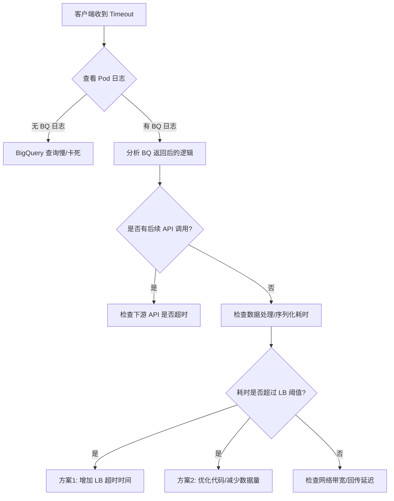

# API Timeout Analysis Summary: Success in Logs but Timeout in Client

## 1. 问题背景 (Problem Context)

**场景描述**：
- 客户端（本地）向 GKE 中的 Pod 发送 POST 请求。
- 请求路径：`Client -> Ingress/Load Balancer -> Pod -> BigQuery`。
- **关键现象**：客户端收到 `"message": "The upstream server is timing out"` 错误，但检查 Pod 日志发现 **BigQuery 查询已经成功执行并打印了结果**。

## 2. 核心原因分析 (Root Cause Analysis)

即使后端逻辑（如 BigQuery 查询）已完成，客户端仍可能收到超时错误。这通常是因为整个请求链路中的某个环节耗时超过了网关或负载均衡器的设定阈值。

### 2.1 网关/负载均衡器超时 (Ingress/LB Timeout)
这是最常见的原因。
- **机制**：GKE Ingress、Google Cloud Load Balancer (GCLB) 或 API Gateway 通常有默认的超时设置（例如 60秒或 5分钟）。
- **现象**：如果 Pod 处理请求的总时长（BigQuery 查询时间 + 数据处理时间 + 序列化时间）超过了这个阈值，LB 会主动断开连接并向客户端返回 504 Gateway Timeout 或类似的超时消息，即使 Pod 内部仍在正常运行或刚刚完成。

### 2.2 后续处理耗时 (Post-Processing Latency)
- **机制**：Pod 在收到 BigQuery 数据后，可能进行了复杂的后续操作。
- **可能性**：
  - **数据转换**：对大量数据进行格式化、JSON 序列化可能非常耗时。
  - **依赖调用**：代码可能在查询完 BigQuery 后，又同步调用了**另一个外部 API**。如果这个后续 API 响应慢或超时，会导致整体响应时间过长。
  - **资源竞争**：Pod CPU/内存不足导致数据处理变慢。

### 2.3 网络传输延迟 (Network Transfer)
- **机制**：如果 BigQuery 返回的数据量巨大（虽然有 `limit`，但如果单行数据很大），Pod 将数据回传给 LB，再由 LB 回传给客户端的过程可能消耗大量时间，导致在传输中途触发超时。

## 3. 排查与解决方案 (Troubleshooting & Solutions)

### 3.1 验证与定位
1. **检查时间戳**：
   - 对比 Pod 日志中 "BigQuery 查询完成" 的时间点与 "请求开始" 的时间点。
   - 检查从 "BigQuery 查询完成" 到 "准备发送响应" 之间的时间差。
2. **全链路日志**：
   - 确认是否有后续 API 调用。
   - 建议在关键步骤（查询前、查询后、处理后、响应前）打印带时间戳的日志。

### 3.2 配置调整
1. **增加超时时间**：
   - 修改 Ingress 或 Load Balancer 的 `timeout` 配置（例如 `BackendConfig` 中的 `timeoutSec`）。
2. **优化应用逻辑**：
   - **异步处理**：如果任务耗时极长，改为异步任务（返回 Task ID，客户端轮询）。
   - **分页与裁剪**：减少单次返回的数据量，减轻序列化和网络传输压力。

## 4. 调试流程图 (Debug Workflow)



## 5. 最佳实践：日志记录 (Java 示例)

为了精准定位是在哪一步超时，建议使用如下结构的日志记录：

```java
public void handleRequest() {
    logger.info("Step 1: Request received");
    
    // BigQuery 查询
    Data data = queryBigQuery(); 
    logger.info("Step 2: BigQuery finished. Rows: {}", data.size());
    
    // 后续处理（可能的耗时点）
    processData(data);
    logger.info("Step 3: Data processing finished");
    
    // 后续 API 调用（可能的耗时点）
    callExternalApi();
    logger.info("Step 4: External API call finished");
    
    sendResponse();
    logger.info("Step 5: Response sent");
}
```
