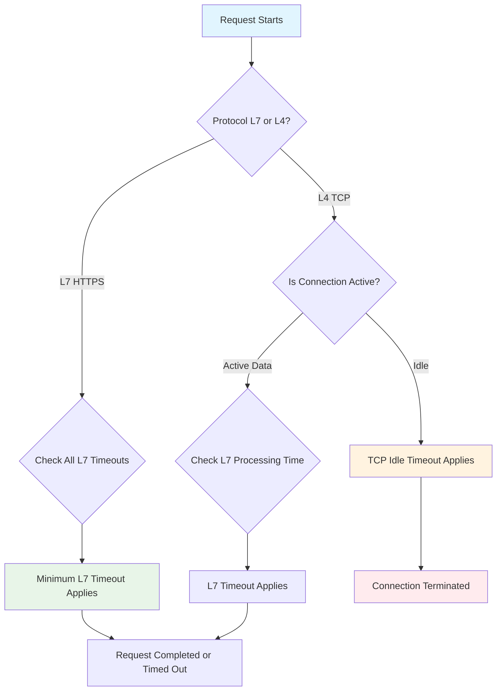

# Summary: TCP vs HTTP Timeout in GCP Load Balancers

Based on analysis of the original question and three AI responses, here is the corrected understanding of timeout mechanisms in GCP load balancers.

## Original Scenarios Analysis

### Scenario 1: Public TLS (HTTPS L7)
**Architecture:** Client → Google GLB HTTPS → Nginx L7 → Squid → Kong

**Configuration:**
- GCP GLB timeout: 300s
- Instance Nginx L7 setting: 301s  
- Kong timeout: 302s

**Original Conclusion:** Correct - The entire flow follows the 300s timeout (the shortest in the chain)

**Verification:** ✅ CORRECT
- GCP HTTPS GLB backend timeout acts as the hard upper limit
- Follows the "shortest timeout wins" principle across L7 components
- Actual timeout = min(300s, 301s, 302s) = 300s

### Scenario 2: Internal TCP (L4 + L7 Hybrid)
**Architecture:** Client → Internal TCP GLB → Nginx L4 → Nginx L7 → Kong

**Configuration:**
- Internal TCP GLB timeout: 30s
- Instance Nginx L7 setting: 300s
- Nginx L4 TCP: 29s
- Kong: 301s

**Original Conclusion:** ❌ INCORRECT - Claimed TCP timeout doesn't matter and service follows 300s timeout

## Corrected Understanding

### Key Misconceptions to Address

1. **"TCP timeout is unimportant/infinitely long"** - WRONG
2. **"TCP doesn't block, so follows L7 timeout"** - WRONG
3. **"Only L7 timeouts determine request duration"** - PARTIALLY TRUE

### The Real Timeout Mechanisms

#### L7 (HTTP/HTTPS) Timeout Behavior
- **Purpose:** Controls complete request/response lifecycle
- **Mechanism:** Request timeout - limits total time for HTTP transaction
- **Effect:** Hard termination when exceeded, returns 5xx error

#### L4 (TCP) Timeout Behavior  
- **Purpose:** Controls connection idle time
- **Mechanism:** Idle timeout - disconnects connections with no data flow
- **Effect:** Connection termination (RST/FIN packets), not request-aware

### Critical Distinction: Idle vs Request Timeout

| Component | Type | Purpose | What Happens When Exceeded |
|-----------|------|---------|-----------------------------|
| GCP HTTPS GLB | Request Timeout | Complete HTTP transaction | Returns 504 Gateway Timeout |
| GCP TCP GLB | Idle Timeout | Connection inactivity | Connection closed, no error sent |
| Nginx L4 (stream) | Proxy Timeout | Connection idle time | Connection closed |
| Nginx L7 (http) | Proxy Read Timeout | HTTP response wait time | Returns 5xx error |

### Corrected Scenario 2 Analysis

The actual timeout depends on **traffic pattern**:

#### Case A: Continuous Data Flow
- Long-running streaming responses
- Constant data transmission between components
- **Result:** TCP idle timeouts don't trigger → L7 timeout (300s) determines outcome

#### Case B: Idle Connection (No Data Flow)
- Long processing time with no intermediate responses
- Connection sits idle waiting for backend response
- **Result:** TCP idle timeout triggers first (30s) → Connection severed before L7 timeout

## Updated Conclusions

### For HTTPS/L7 Traffic
✅ **Original conclusion remains correct:**
- Effective timeout = minimum of all L7 component timeouts
- GCP HTTPS GLB backend timeout often serves as the upper bound

### For TCP/L4 Traffic  
❌ **Original conclusion is incorrect:**
- TCP idle timeouts are **very important**
- They can terminate connections before L7 timeouts are reached
- Effective timeout depends on traffic pattern (idle vs active data flow)

## Best Practices

### Configuration Strategy
```
Backend App Timeout < Kong Timeout < Nginx L7 Timeout < GCP HTTPS GLB Timeout
```

For TCP scenarios:
```
Expected Max Processing Time < L7 Component Timeout < TCP Idle Timeout
```

### Monitoring Points
1. Track both connection drops and request timeouts separately
2. Monitor for TCP RST/FIN packets indicating idle timeout terminations
3. Log L7 timeout errors (5xx responses) separately from connection drops

## Decision Matrix



## Final Takeaway

In GCP architectures, both TCP and HTTP timeouts matter. For L7 traffic, request timeouts determine outcomes. For L4 traffic, the effective timeout depends on whether connections remain active with data flow or become idle during processing.