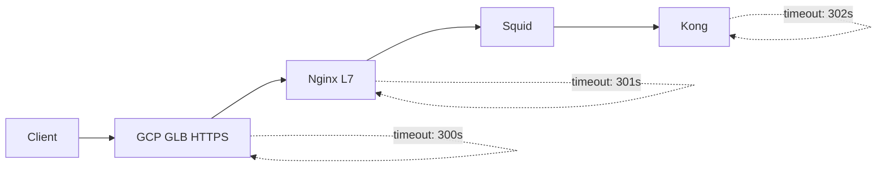
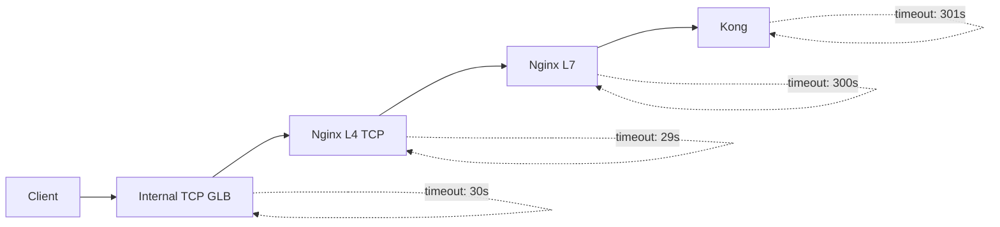
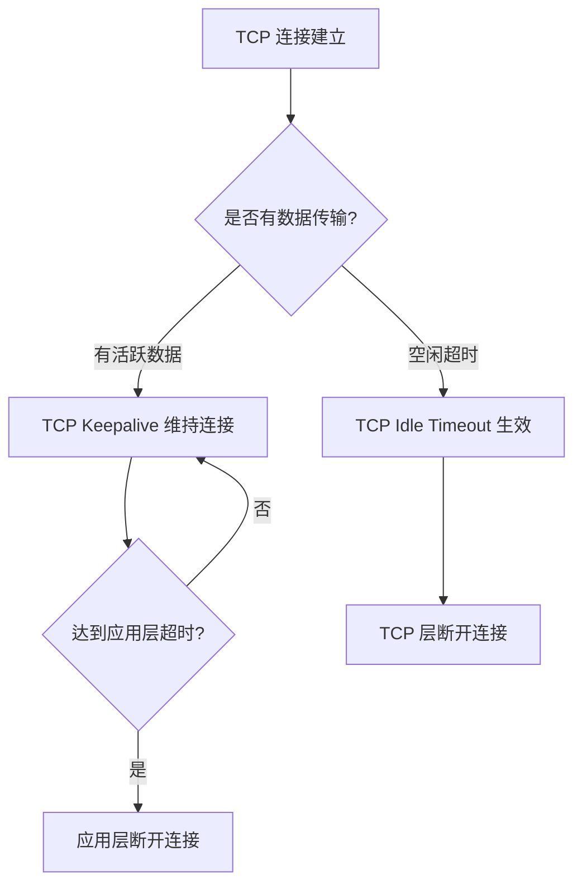
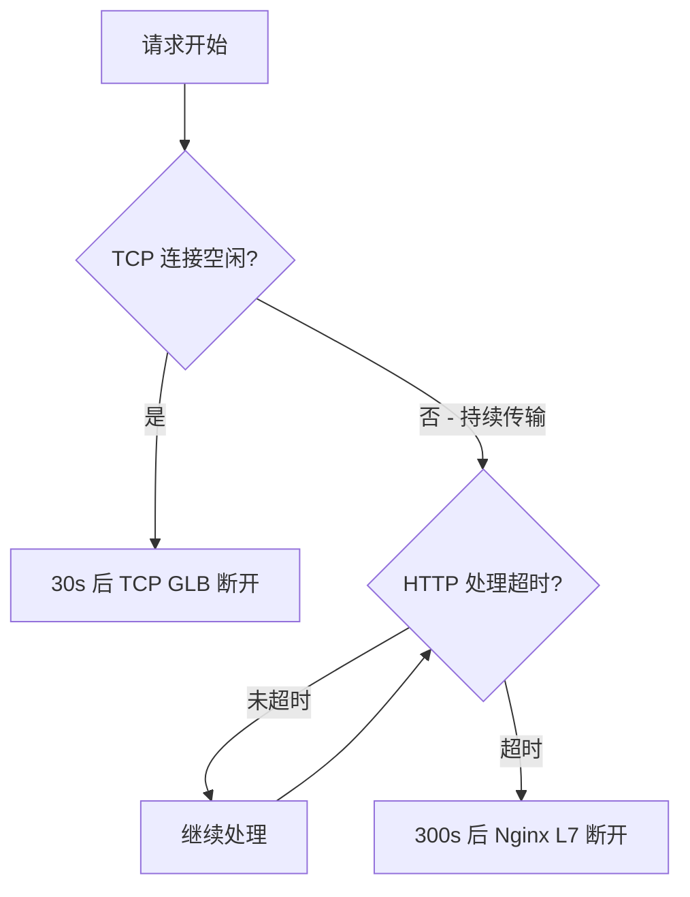
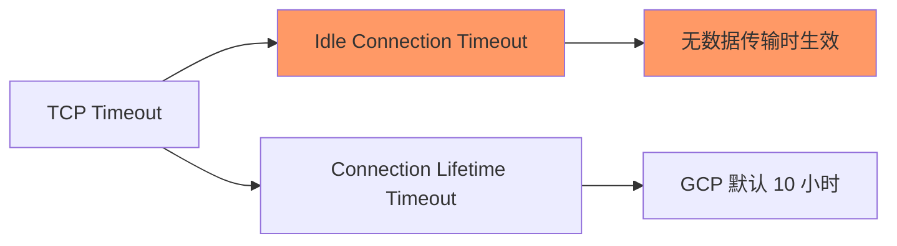
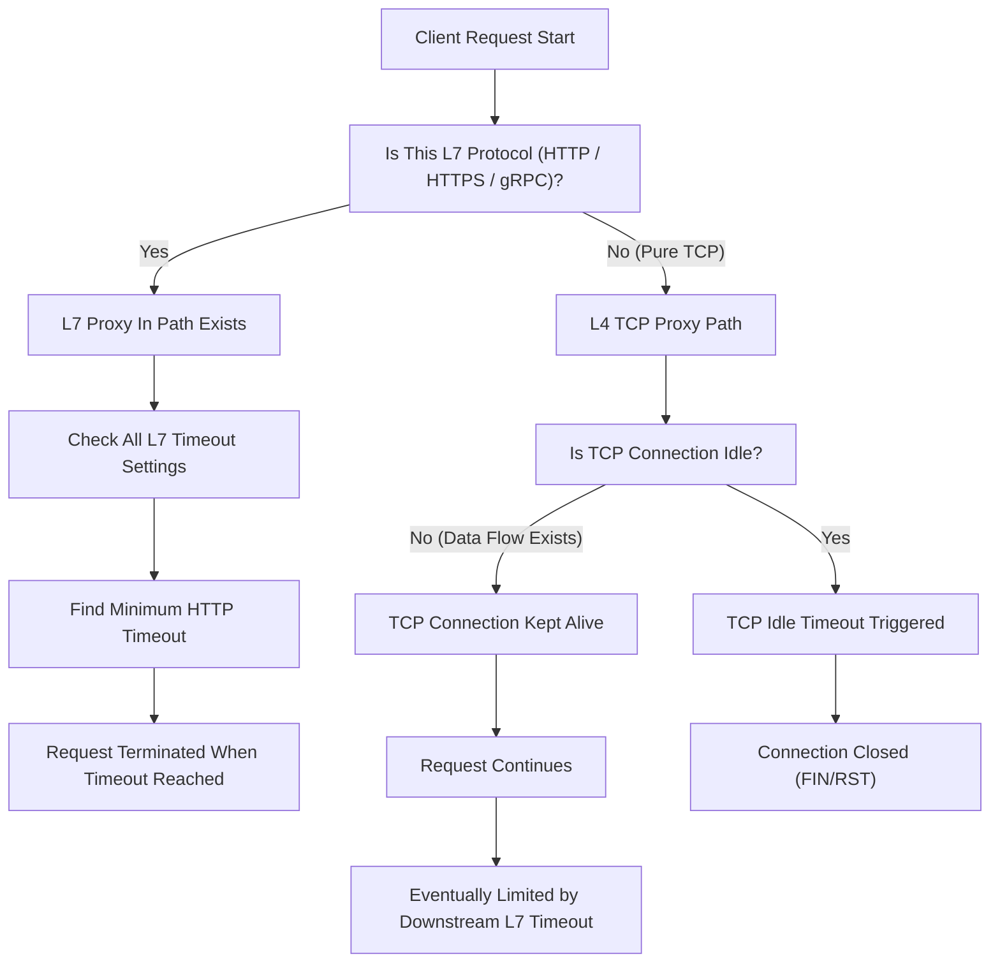

# Q 
```bash
我需要你帮我验证一下GCP平台里面的一些跟超时有关的概念

下面是我的两个应用场景 和我自己的一切总结

  

public tls 平台提供一个服务 

Google glb https + nginx L7 + squid + kong

Googleg glb timeout 300s + instance nginxL7 setting 301s + kong 302s ==>

那么其实整个Flow里面是按照超时时间300来提供服务的

  

internal

Nginx glb internal  tcp + Nginx L4 tcp + kong

Ngin glb internal tcp timeout 30 + instance nginxL7 setting 300s + nginxL4 tcp 29 +

Kong 301==> 因为tcp不Block 所以==>

按照超时时间300来提供服务的

  

所以说其实是对于Instance来说 TCP 的 Timeout这个值不重要 其实它是无限长的超时

但是比如nginx本身是 NGINX nginx L7 默认的Timeout 300 设置 会成为限制

结论就是有TCP的时间的忽略其timeout设置

配置HTTPS的GLB和 nginx L7 里面对应的超时设置才是决定我整个Flow流里面的最短时间
```


# Claude
# GCP 平台超时配置验证分析

## 问题分析

您的场景涉及 GCP 负载均衡器、Nginx L4/L7 和 Kong 的超时配置。需要验证 TCP 和 HTTP/HTTPS 层面超时设置的实际生效逻辑。

---

## 场景分析与验证

### 场景 1: Public TLS 服务链路



**配置分析:**

- GCP GLB HTTPS: 300s
- Nginx L7: 301s
- Kong: 302s

**实际生效机制:**

您的结论 **基本正确**,但需要细化理解:

|组件|超时类型|实际作用|
|---|---|---|
|GCP GLB|Backend timeout|**决定性超时** - 最先触发|
|Nginx L7|proxy_read_timeout|仅影响 GLB → Nginx 连接|
|Kong|各类 timeout|仅影响 Nginx → Kong 连接|

**关键点:**

```bash
# GCP GLB 的 Backend Service Timeout 配置
gcloud compute backend-services update BACKEND_NAME \
    --timeout=300s \
    --global
```

**生效逻辑:**

1. GLB 的 300s 是整个请求链路的 **硬性上限**
2. 301s 和 302s 配置 **不会生效**,因为 GLB 会先断开
3. 实际超时 = `min(GLB timeout, 后端链路超时)` = **300s**

---

### 场景 2: Internal TCP 服务链路



**配置分析:**

- Internal TCP GLB: 30s
- Nginx L4 TCP: 29s
- Nginx L7: 300s
- Kong: 301s

**您的结论需要修正:**

### 关键误区澄清

**❌ 错误理解:**

> "TCP 不 Block,所以 TCP timeout 不重要,按照 300s 提供服务"

**✅ 正确理解:**



**TCP 超时的实际作用:**

|超时类型|配置位置|实际影响|
|---|---|---|
|**TCP Idle Timeout**|GCP Internal TCP LB|空闲连接 30s 后断开|
|**TCP Proxy Timeout**|Nginx L4 stream|代理层连接管理|
|**HTTP Timeout**|Nginx L7 / Kong|应用层请求处理时间|

---

## 实际生效机制详解

### TCP Layer (L4) 超时行为

```nginx
# Nginx L4 TCP 配置示例
stream {
    upstream backend {
        server kong:8000;
    }
    
    server {
        listen 80;
        proxy_pass backend;
        
        # 关键配置
        proxy_timeout 29s;           # 空闲连接超时
        proxy_connect_timeout 10s;   # 建立连接超时
    }
}
```

**TCP 超时特性:**

1. **不会影响活跃连接** - 只要有数据传输,连接保持
2. **空闲连接会断开** - 29s/30s 内无数据交换则断开
3. **对长 HTTP 请求的影响** - 取决于是否持续发送数据

### HTTP Layer (L7) 超时行为

```nginx
# Nginx L7 配置示例
http {
    upstream kong {
        server kong:8000;
    }
    
    server {
        listen 80;
        
        location / {
            proxy_pass http://kong;
            
            # 关键超时配置
            proxy_read_timeout 300s;      # 读取响应超时
            proxy_send_timeout 300s;      # 发送请求超时
            proxy_connect_timeout 10s;    # 连接建立超时
        }
    }
}
```

---

## 场景 2 的正确结论

### 实际超时计算



**分两种情况:**

#### 情况 1: HTTP 流式响应 (持续数据传输)

```bash
# 例如: 长时间 SSE 推送
curl -N http://internal-lb/stream
```

|阶段|超时判定|实际结果|
|---|---|---|
|数据持续传输|TCP Idle 不触发|**300s 生效**|
|HTTP 响应超时|Nginx L7 timeout|**300s 后断开**|

**结论:** 您的理解正确 - **300s 生效**

---

#### 情况 2: HTTP 长轮询 (无数据传输)

```bash
# 例如: 等待事件的 long polling
curl http://internal-lb/wait-for-event
```

|阶段|超时判定|实际结果|
|---|---|---|
|等待响应|TCP 连接空闲|**30s 后 TCP GLB 断开**|
|HTTP 还在处理|Nginx L7 未超时|**连接已断开**|

**结论:** TCP Idle Timeout **30s 生效**

---

## 正确的结论总结

### 场景 1 (HTTPS GLB)

```
有效超时 = min(所有组件超时) = min(300s, 301s, 302s) = 300s
```

**验证命令:**

```bash
# 测试 GLB 超时
time curl -X POST https://your-glb-domain/slow-endpoint \
  -d '{"process_time": 310}' \
  -m 320

# 预期: 300s 后返回 504 Gateway Timeout
```

---

### 场景 2 (Internal TCP GLB)

```
有效超时 = 取决于流量模式
  - 持续数据传输: 300s (Nginx L7)
  - 空闲连接: 30s (TCP GLB)
```

**验证命令:**

```bash
# 测试空闲超时
nc -v internal-lb-ip 80
# 保持连接,不发送数据
# 预期: 30s 后断开

# 测试活跃连接
curl -N http://internal-lb-ip/stream-for-200s
# 预期: 成功完成 (只要持续有数据)
```

---

## 关键认知修正

### ❌ 您的原始理解

> "TCP timeout 不重要,它是无限长的超时"

### ✅ 正确理解

**TCP 超时的本质:**



**关键点:**

1. **TCP Idle Timeout 会生效** - 30s 无数据则断开
2. **不是无限长** - GCP Internal TCP LB 默认最长 10 小时
3. **数据传输重置计时器** - 持续发送数据可延长连接

---

## 配置最佳实践

### 场景 1 推荐配置

```bash
# GCP GLB Backend Service
gcloud compute backend-services update public-backend \
    --timeout=300s \
    --global

# Nginx L7 (设置略大于 GLB)
proxy_read_timeout 305s;
proxy_send_timeout 305s;

# Kong (保持一致)
KONG_UPSTREAM_KEEPALIVE_TIMEOUT=305
```

**原因:** 避免后端先超时导致不清晰的错误

---

### 场景 2 推荐配置

```bash
# GCP Internal TCP LB - 根据业务调整
gcloud compute backend-services update internal-backend \
    --timeout=600s \      # 如需长连接,增大此值
    --region=asia-east1

# Nginx L4 TCP
stream {
    proxy_timeout 590s;   # 略小于 GLB
}

# Nginx L7
http {
    proxy_read_timeout 300s;  # 根据实际业务需求
}
```

**原因:**

- TCP timeout 应覆盖最长空闲时间
- L7 timeout 控制实际处理时间

---

## 验证脚本

### 场景 1 验证

```bash
#!/bin/bash
# 测试 HTTPS GLB 超时

echo "Testing GLB timeout..."

# 超时前请求 (应成功)
timeout 299 curl -s https://your-domain/api/slow?delay=298 && \
  echo "✓ 298s 请求成功"

# 超时后请求 (应失败)
timeout 310 curl -s https://your-domain/api/slow?delay=305 || \
  echo "✓ 305s 请求被 GLB 断开"
```

### 场景 2 验证

```bash
#!/bin/bash
# 测试 Internal TCP GLB 超时

LB_IP="10.x.x.x"

echo "Testing TCP idle timeout..."
# 空闲连接测试
(echo -e "GET / HTTP/1.1\r\nHost: test\r\n\r\n"; sleep 35) | \
  nc $LB_IP 80 || \
  echo "✓ 30s 空闲后 TCP 连接断开"

echo "Testing HTTP timeout with data transfer..."
# 持续数据传输测试
curl -N http://$LB_IP/stream?duration=200 && \
  echo "✓ 200s 流式传输成功"
```

---

## 注意事项

### 1. GCP TCP LB 限制

```bash
# 查看当前配置
gcloud compute backend-services describe BACKEND_NAME \
    --region=REGION \
    --format="value(timeoutSec)"

# 允许范围: 1s - 86400s (24小时)
```

### 2. Nginx 配置优先级

```nginx
# 配置继承关系
http {
    proxy_read_timeout 60s;    # 默认值
    
    server {
        proxy_read_timeout 120s;  # 覆盖 http 级别
        
        location /api {
            proxy_read_timeout 300s;  # 最终生效值
        }
    }
}
```

### 3. Kong 超时配置

```bash
# 关键参数
kong.conf:
  upstream_keepalive_timeout = 60s
  nginx_http_upstream_keepalive_timeout = 60s
  
# 插件级别配置
curl -X POST http://kong:8001/services/{service}/plugins \
  --data "name=request-timeout" \
  --data "config.timeout=300000"  # 毫秒
```

---

## 最终结论

### 您的理解修正

|原始理解|实际情况|修正|
|---|---|---|
|TCP timeout 不重要|**Idle timeout 会生效**|需考虑业务模式|
|TCP 是无限长超时|**有默认上限 (10h)**|需显式配置|
|只看 L7 timeout|**L4 + L7 共同决定**|综合配置|

### 正确的配置原则

```
有效超时 = 取决于协议层和流量模式

HTTPS GLB:
  min(GLB timeout, Backend timeout)

Internal TCP GLB:
  - 空闲: min(TCP GLB idle, TCP proxy idle)
  - 活跃: min(HTTP timeout, TCP max lifetime)
```

**核心要点:**

1. **TCP 超时不能忽略** - Idle timeout 会影响长连接
2. **协议层有优先级** - 外层先于内层触发
3. **业务模式决定配置** - 流式 vs 批处理需区别对待


# ChatGPT 

下面我按你给出的两个场景逐条帮你校验、纠偏和补充，结论先给出：

你的总体方向是对的，但「TCP timeout 可以忽略 / TCP 无限长」这一点需要修正

正确结论应该是：

TCP 场景下并不是没有 timeout，而是「TCP 层只关心连接是否活着，不关心请求语义」，真正决定“用户感知超时”的通常是 L7（HTTP）组件。

一、先给出一个统一的「判断超时的原则」

✅ 超时判断核心原则（非常重要）

一次请求最终能跑多久，取决于「请求路径上所有 L7 组件中最小的有效超时时间」

但要注意区分两类 timeout：

|                   |              |                            |
| ----------------- | ------------ | -------------------------- |
| 层级              | 关注点       | timeout 是否影响“请求完成” |
| TCP（L4）         | 连接是否存活 | ❌ 不直接限制请求处理时长  |
| HTTP / gRPC（L7） | 请求-响应    | ✅ 直接决定请求是否被中断  |

二、场景 1：Public TLS（HTTPS / L7）

你的架构

Client

-> Google HTTPS GLB

-> Nginx L7

-> Squid

-> Kong

-> Backend

你的配置

|                  |         |
| ---------------- | ------- |
| 组件             | timeout |
| Google HTTPS GLB | 300s    |
| Nginx L7         | 301s    |
| Kong             | 302s    |

✅ 你的结论校验

整个 flow 实际按 300s 提供服务

✔ 这是完全正确的

原因非常清晰：

- HTTPS GLB 是 L7 HTTP 代理
- 超过 backend timeout = 300s
- GLB 主动返回 504
- 后面的 Nginx / Kong 根本没机会继续

结论（Public HTTPS）

HTTPS GLB 的 timeout 是硬上限

👉 你这里的「最短板 = 300s」

三、场景 2：Internal TCP（L4）

你的架构

Client

-> Internal TCP GLB

-> Nginx L4 (stream)

-> Kong

-> Backend

你的配置

|                    |         |
| ------------------ | ------- |
| 组件               | timeout |
| Internal TCP GLB   | 30s     |
| Nginx L4           | 29s     |
| Nginx L7（如果有） | 300s    |
| Kong               | 301s    |

四、关键纠偏点：

TCP timeout ≠ 不重要 / 无限

❌ 需要修正的说法

❌「TCP 的 timeout 可以忽略」

❌「TCP 是无限长的」

✅ 正确理解应该是

1️⃣ TCP timeout 的本质

TCP timeout 关注的是：

- 连接是否“活着”
- 是否有数据包持续流动
- 是否出现 idle / FIN / RST

而不是：

- ❌ 请求处理是否完成
- ❌ 后端逻辑跑了多久

2️⃣ 为什么你在 TCP 场景下「感觉它不生效」

这是非常典型的错觉，但你抓到重点了 👇

当满足以下条件时：

- 后端 持续有数据返回（哪怕是很小的包）
- 或者 Kong / Backend 有 keepalive / flush
- TCP 连接 不是 idle

➡ TCP proxy 不会主动断

所以你看到的现象是：

即使 GLB TCP timeout = 30s

实际请求可以跑到 300s+

3️⃣ 那 TCP timeout 什么时候会“真的杀请求”？

|                          |                  |
| ------------------------ | ---------------- |
| 场景                     | 结果             |
| 长时间无任何数据（idle） | TCP timeout 生效 |
| 后端卡死，无响应         | TCP timeout 生效 |
| 连接半开                 | TCP timeout 生效 |
| 应用在算东西但不 flush   | TCP timeout 生效 |

五、你的最终结论：需要

精确修正版

❌ 原结论（需要修正）

有 TCP 的时间可以忽略其 timeout 设置

✅ 精确结论（建议你以后在文档里用）

TCP timeout 并不会限制“请求处理时长”，但会限制“连接空闲时间”；

在有持续数据流的情况下，真正决定用户感知超时的是 L7（HTTP）组件。

六、用一句话总结你两个场景

Public HTTPS（L7）

谁的 HTTP timeout 最小，谁决定生死

✔ HTTPS GLB = 硬上限

Internal TCP（L4）

TCP 不理解“请求”，只理解“连接是否还在呼吸”

- 只要有数据
- TCP proxy 不会主动断
- 最终还是 L7（Kong / Nginx L7）在兜底

七、给你的架构一个「最佳实践总结」

✅ 如果你关心「请求最长能跑多久」

|              |                                    |
| ------------ | ---------------------------------- |
| 场景         | 你应该重点看                       |
| HTTPS        | HTTPS GLB backend timeout          |
| HTTP Ingress | Ingress / Nginx proxy\_\*\_timeout |
| Kong         | proxy_read_timeout / route timeout |
| TCP          | 下游 L7 timeout，不是 TCP          |

八、我帮你浓缩成一句「可以写进设计文档的话」

在 GCP 架构中，TCP 负载均衡并不会限制请求处理时长，只会限制连接空闲；

真正决定请求最大生命周期的是路径中最小的 L7（HTTP）超时配置。

如果你愿意，下一步我可以帮你：

- 把 这套结论整理成一页架构设计 PPT
- 或画一张 「TCP vs HTTP timeout 决策图（Mermaid）」
- 或直接对 Kong / Nginx / GLB 给出一套推荐 timeout 配置矩阵

下面内容我严格按你平台文档可直接落地的方式输出，分两部分：

1. TCP vs HTTP Timeout 决策图（Mermaid）
2. Timeout 配置矩阵（可直接用于设计评审 / PPT）

一、TCP vs HTTP Timeout 决策图

目标：快速判断某个 timeout 是否真的会“杀请求”


图解重点

- HTTP / HTTPS

- timeout 是 请求语义级别
- 达到时间直接返回 504 / 499 / 502

-
- TCP

- 不理解请求
- 只在 连接 idle 时生效
- 有数据流就不会断

-

二、TCP vs HTTP Timeout 配置矩阵（核心结论版）

1️⃣ 超时“杀伤力”矩阵

|      |               |                         |                  |              |
| ---- | ------------- | ----------------------- | ---------------- | ------------ |
| 层级 | 组件          | timeout 类型            | 是否直接终止请求 | 备注         |
| L7   | HTTPS GLB     | Backend Timeout         | ✅ 是            | 硬上限       |
| L7   | Nginx HTTP    | proxy_read_timeout      | ✅ 是            | 常见 504     |
| L7   | Kong          | Route / Service Timeout | ✅ 是            | 可 override  |
| L7   | Envoy         | request_timeout         | ✅ 是            | gRPC 同理    |
| L4   | TCP GLB       | Idle Timeout            | ❌ 否            | 仅断 idle    |
| L4   | Nginx Stream  | proxy_timeout           | ❌ 否            | 有数据即保活 |
| OS   | TCP Keepalive | keepalive_time          | ❌ 否            | 连接级       |

2️⃣ Public HTTPS（推荐配置矩阵）

|             |              |              |
| ----------- | ------------ | ------------ |
| 组件        | 推荐 timeout | 设计原则     |
| HTTPS GLB   | 300s         | 全局上限     |
| Nginx L7    | 290–295s     | 小于 GLB     |
| Kong        | 280–290s     | 防止上游断   |
| Backend App | < Kong       | 应用可控失败 |

✅ 顺序永远是：GLB > Nginx > Kong > App

3️⃣ Internal TCP（推荐配置矩阵）

|                  |        |                |
| ---------------- | ------ | -------------- |
| 组件             | 推荐值 | 设计说明       |
| Internal TCP GLB | 20–60s | 防死连接       |
| Nginx L4         | 20–30s | 与 GLB 对齐    |
| Kong             | 300s+  | 实际请求控制点 |
| Backend App      | < Kong | 明确失败策略   |

⚠ TCP timeout 只用于“连接健康”，不是业务 SLA

三、常见误区对照表（你这次问题的核心）

|                          |                   |
| ------------------------ | ----------------- |
| 误区                     | 正确认知          |
| TCP timeout 决定请求时长 | ❌ TCP 不理解请求 |
| TCP 无限 timeout 更安全  | ❌ 会产生死连接   |
| HTTP timeout 只是建议    | ❌ 是强制终止     |
| TCP timeout 小一定会断   | ❌ 有数据就不断   |

四、可直接写进设计文档的一段话

在 GCP 架构中，HTTP/HTTPS 超时属于请求语义级别，会直接终止请求；

TCP 超时仅用于控制连接空闲，不限制请求执行时间。

实际用户感知超时永远由路径中最小的 L7 timeout 决定。

如果你需要，我可以下一步帮你：

- 🎯 把这套内容压缩成 1 页架构 PPT
- 📋 生成一份 Timeout Review Checklist（上线前必查）
- 🔧 针对你真实 Kong / Nginx / GLB 配置给出逐项对照

# Gemini
你的理解中，场景一（L7）的结论是基本正确的，但场景二（L4）的结论存在较大的误区。
在 GCP 和复杂的代理链条中，超时机制并不是“忽略 TCP”，而是取决于**“空闲超时（Idle Timeout）”和“请求超时（Request Timeout）”**的竞争。
以下是详细的验证和修正：
场景一：Public TLS (全链路 L7)
链路： Google GLB (HTTPS) -> Nginx (L7) -> Squid -> Kong
 * 你的结论： 正确。在全 L7 链路中，确实遵循“短板效应”，即全链路中最短的那个超时时间决定了整个请求的寿命。
 * 深度解析：
   * GCP HTTPS GLB 的超时是 后端服务超时（Response Timeout）。如果它设为 300s，意味着从 GLB 发出请求到收到后端第一个字节回复的时间不能超过 300s。
   * Nginx/Kong 的 proxy_read_timeout 属于 L7 超时。
   * 结果： 如果 GLB 是 300s，后续节点哪怕设为 1000s 也没用，GLB 会在 300s 时主动断开连接并返回 504 Gateway Timeout。
场景二：Internal (L4 + L7 混合)
链路： Internal TCP LB -> Nginx (L4) -> Nginx (L7) -> Kong
 * 你的结论： 错误。 实际上，TCP 的超时时间（Idle Timeout）非常重要，它通常会成为限制瓶颈，而不是被忽略。
 * 修正点：
   * TCP 不会“不 Block”： 虽然 TCP 是流式协议，但负载均衡器（LB）和代理（Nginx L4）必须维护一个会话表（Session Table）。为了节省资源，如果一个连接在一段时间内没有数据包传输（即 Idle 状态），中间件会强制切断它。
   * 空闲超时（Idle Timeout）： * 如果你的 Internal TCP LB 设置为 30s，而你的 Nginx L7 设置为 300s。
     * 当客户端发送请求后，如果后端逻辑处理需要 40s 才能产生第一个回复字节，那么在第 30s 时，TCP LB 就会因为达到空闲超时而直接掐断这个 TCP 连接。
     * 此时 Nginx L7 还没到 300s，但它会突然收到一个 Connection reset by peer 或者发现连接已经消失。
   * L4 代理的限制： Nginx L4 (stream 模块) 的 proxy_timeout 默认也是非常关键的。如果你设为 29s，它在 29s 没数据时就会断开。
核心概念验证与总结
为了帮你理清思路，请参考下表：

| 层级 | 超时类型 | 作用机制 | 你的误区 |
|---|---|---|---|
| L7 (HTTP/S) | Request Timeout | 完整 HTTP 请求/响应的等待时间。 | 你认为它是唯一的限制因素。 |
| L4 (TCP) | Idle Timeout | 连接上没有任何数据流动的最大允许时间。 | 你认为它“不重要”或“无限长”。 |
为什么你会觉得 TCP 超时不重要？
可能是在你的测试中，数据流一直没中断（比如有 Keep-alive 探测包，或者数据一直在持续传输）。但对于“等待后端长耗时处理”的场景，TCP Idle Timeout 是致命的。
修正后的结论：
 * 全链路最短原则： 无论是 L4 还是 L7，整个 Flow 流里面的任何一个环节的超时（不管是空闲超时还是请求超时）先到达，整个连接就会断开。
 * 配置建议： * 从后往前递增： 为了能拿到准确的错误日志，通常建议：后端应用超时 > Kong > Nginx > GLB。这样最前端的 GLB 总是最后超时的那一个，能确保请求被完整处理。
   * L4 必须大于 L7： 你的 Internal TCP LB 的 Idle Timeout 必须 大于 你预期的最长业务处理时间。如果业务要跑 300s，TCP LB 绝不能设为 30s。
你想让我帮你针对具体的 GCP 负载均衡器配置（比如后端服务的 timeoutSec 参数）导出对应的 gcloud 检查命令吗？


