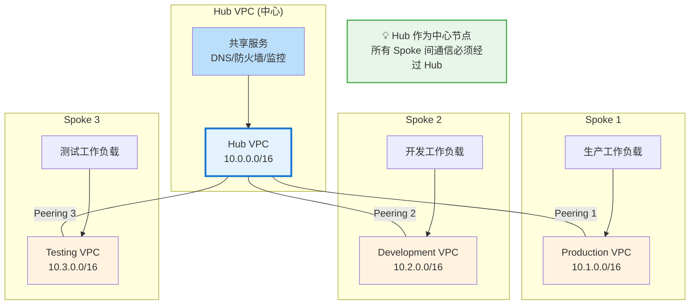
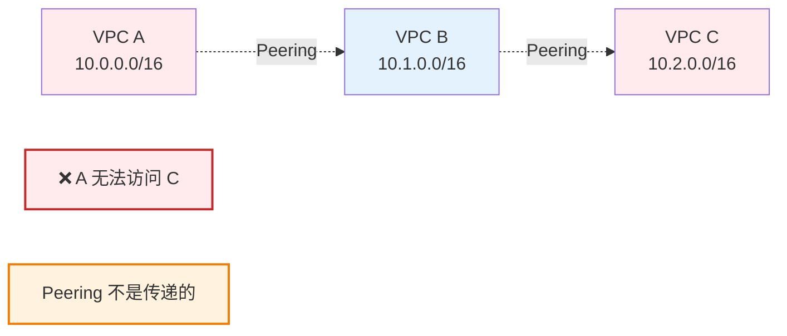
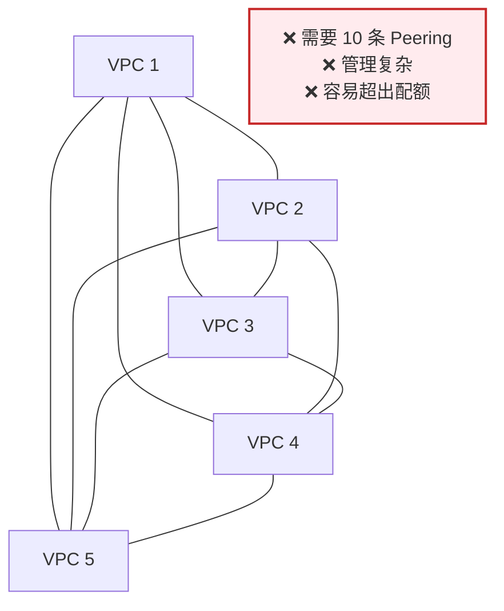
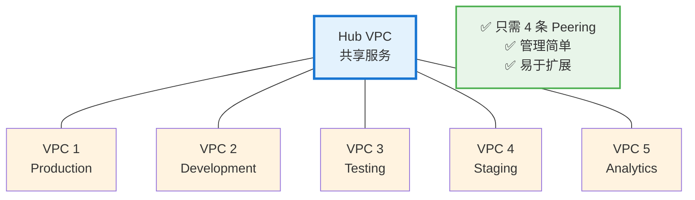
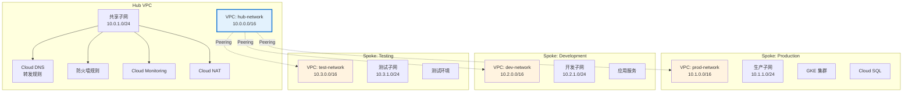
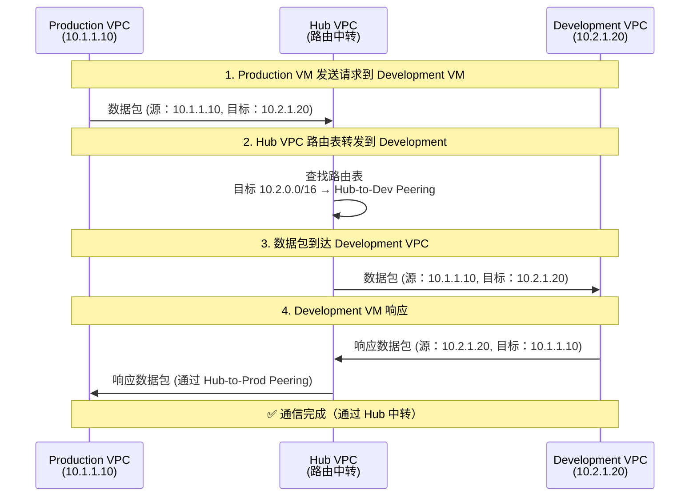
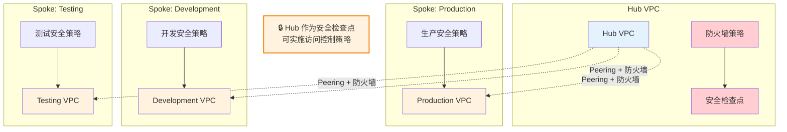
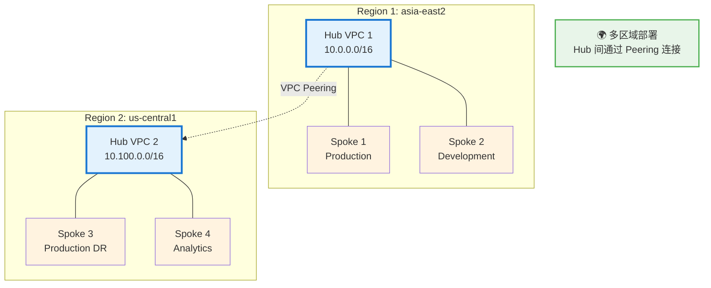
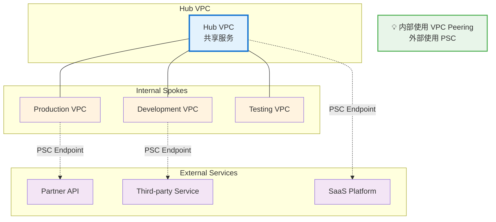

# Hub-Spoke 网络架构指南

## 概述

**Hub-Spoke（中心 - 辐射）架构** 是一种经典的网络拓扑设计模式，在 Google Cloud 中广泛应用于多项目、多 VPC 的网络互联场景。本指南将帮助您全面理解 Hub-Spoke 架构的概念、优势、实施方法和最佳实践。

---

## 一、什么是 Hub-Spoke 架构？

### 1.1 核心概念

**Hub-Spoke 架构** 由两个主要部分组成：

| 组件 | 名称 | 说明 | 示例 |
|------|------|------|------|
| **Hub（中心）** | Central VPC | 作为网络的中心枢纽，集中管理共享服务和网络路由 | 共享服务 VPC |
| **Spoke（辐射）** | Peripheral VPC | 连接到 Hub 的外围网络，通常是独立的工作负载环境 | 生产、测试、开发 VPC |

### 1.2 基本拓扑图



### 1.3 关键特性

| 特性 | 说明 |
|------|------|
| **星型拓扑** | 所有 Spoke 只连接到 Hub，不直接互连 |
| **集中管理** | 共享服务、安全策略、路由规则集中在 Hub 管理 |
| **隔离性** | 每个 Spoke 保持独立，故障不会相互影响 |
| **可扩展性** | 添加新 Spoke 只需连接到 Hub，不影响现有架构 |

---

## 二、为什么需要 Hub-Spoke 架构？

### 2.1 VPC Peering 的非传递性问题

**核心问题：VPC Peering 不是传递的**



**问题说明：**
- VPC A ↔ VPC B：可以通信
- VPC B ↔ VPC C：可以通信
- **VPC A ↔ VPC C：无法直接通信**（Peering 不是传递的）

### 2.2 网状架构的问题（不使用 Hub-Spoke）

如果需要 5 个 VPC 完全互连，需要多少条 Peering 连接？

```
N 个 VPC 完全互连需要的 Peering 数量 = N × (N-1) / 2

5 个 VPC = 5 × 4 / 2 = 10 条 Peering 连接
10 个 VPC = 10 × 9 / 2 = 45 条 Peering 连接
```

**网状架构拓扑（5 个 VPC）：**



### 2.3 Hub-Spoke 架构的优势

使用 Hub-Spoke 架构，同样的 5 个 VPC 只需要：

```
N 个 VPC 的 Hub-Spoke 架构需要的 Peering 数量 = N - 1

5 个 VPC = 4 条 Peering 连接
10 个 VPC = 9 条 Peering 连接
```

**Hub-Spoke 架构拓扑（5 个 VPC）：**



---

## 三、Hub-Spoke 架构的优势

### 3.1 技术优势

| 优势 | 说明 | 具体表现 |
|------|------|----------|
| **简化网络拓扑** | 减少 Peering 连接数量 | N 个 VPC 只需 N-1 条连接 |
| **集中路由管理** | 所有路由规则在 Hub 配置 | 便于故障排除和审计 |
| **解决非传递性** | Spoke 间可通过 Hub 通信 | 实现间接互通 |
| **故障隔离** | 单个 Spoke 故障不影响其他 | 提高整体可用性 |
| **安全边界清晰** | Hub 作为安全检查点 | 便于实施安全策略 |

### 3.2 管理优势

| 优势 | 说明 |
|------|------|
| **集中化运维** | 共享服务（DNS、防火墙、监控）集中在 Hub |
| **策略一致性** | 安全策略、网络规则在 Hub 统一配置 |
| **成本优化** | 减少 Peering 数量，降低管理成本 |
| **易于扩展** | 添加新 Spoke 只需一条新 Peering |
| **配额优化** | 避免单个 VPC 的 Peering 配额限制 |

### 3.3 成本优势

| 场景 | 网状架构 | Hub-Spoke | 节省 |
|------|---------|-----------|------|
| 5 个 VPC | 10 条 Peering | 4 条 Peering | 60% |
| 10 个 VPC | 45 条 Peering | 9 条 Peering | 80% |
| 20 个 VPC | 190 条 Peering | 19 条 Peering | 90% |

---

## 四、Hub-Spoke 架构实施

### 4.1 架构组件



### 4.2 IP 地址规划

**推荐方案：**

| VPC 类型 | VPC 名称 | CIDR 范围 | 用途 |
|---------|---------|----------|------|
| **Hub** | hub-vpc | 10.0.0.0/16 | 共享服务、网络管理 |
| **Spoke 1** | prod-vpc | 10.1.0.0/16 | 生产环境 |
| **Spoke 2** | dev-vpc | 10.2.0.0/16 | 开发环境 |
| **Spoke 3** | test-vpc | 10.3.0.0/16 | 测试环境 |
| **Spoke 4** | staging-vpc | 10.4.0.0/16 | 预发布环境 |
| **Spoke 5** | analytics-vpc | 10.5.0.0/16 | 数据分析 |

**子网划分示例（Hub VPC）：**

| 子网名称 | CIDR 范围 | 区域 | 用途 |
|---------|----------|------|------|
| hub-subnet-asia-east2 | 10.0.1.0/24 | asia-east2 | Hub 资源 |
| hub-dns-subnet | 10.0.2.0/24 | asia-east2 | DNS 转发器 |
| hub-nat-subnet | 10.0.3.0/24 | asia-east2 | NAT 网关 |

---

### 4.3 实施步骤

#### 步骤 1：创建 Hub VPC

```bash
# 设置环境变量
export HUB_PROJECT_ID="your-hub-project"
export HUB_VPC_NAME="hub-vpc"
export REGION="asia-east2"

# 创建 Hub VPC
gcloud compute networks create ${HUB_VPC_NAME} \
    --project=${HUB_PROJECT_ID} \
    --subnet-mode=custom

# 创建 Hub 子网
gcloud compute networks subnets create hub-subnet-${REGION} \
    --project=${HUB_PROJECT_ID} \
    --network=${HUB_VPC_NAME} \
    --range=10.0.1.0/24 \
    --region=${REGION}

# 创建 DNS 子网（用于 DNS 转发器）
gcloud compute networks subnets create hub-dns-subnet \
    --project=${HUB_PROJECT_ID} \
    --network=${HUB_VPC_NAME} \
    --range=10.0.2.0/24 \
    --region=${REGION}
```

#### 步骤 2：创建 Spoke VPC

```bash
# 创建 Production Spoke VPC
export PROD_PROJECT_ID="your-prod-project"
export PROD_VPC_NAME="prod-vpc"

gcloud compute networks create ${PROD_VPC_NAME} \
    --project=${PROD_PROJECT_ID} \
    --subnet-mode=custom

gcloud compute networks subnets create prod-subnet-${REGION} \
    --project=${PROD_PROJECT_ID} \
    --network=${PROD_VPC_NAME} \
    --range=10.1.1.0/24 \
    --region=${REGION}

# 创建 Development Spoke VPC
export DEV_PROJECT_ID="your-dev-project"
export DEV_VPC_NAME="dev-vpc"

gcloud compute networks create ${DEV_VPC_NAME} \
    --project=${DEV_PROJECT_ID} \
    --subnet-mode=custom

gcloud compute networks subnets create dev-subnet-${REGION} \
    --project=${DEV_PROJECT_ID} \
    --network=${DEV_VPC_NAME} \
    --range=10.2.1.0/24 \
    --region=${REGION}
```

#### 步骤 3：配置 VPC Peering

**Hub 端配置：**

```bash
# Hub → Production Peering
gcloud compute networks peerings create hub-to-prod \
    --project=${HUB_PROJECT_ID} \
    --network=${HUB_VPC_NAME} \
    --peer-network=${PROD_VPC_NAME} \
    --peer-project=${PROD_PROJECT_ID} \
    --auto-create-routes

# Hub → Development Peering
gcloud compute networks peerings create hub-to-dev \
    --project=${HUB_PROJECT_ID} \
    --network=${HUB_VPC_NAME} \
    --peer-network=${DEV_VPC_NAME} \
    --peer-project=${DEV_PROJECT_ID} \
    --auto-create-routes
```

**Spoke 端配置：**

```bash
# Production → Hub Peering
gcloud compute networks peerings create prod-to-hub \
    --project=${PROD_PROJECT_ID} \
    --network=${PROD_VPC_NAME} \
    --peer-network=${HUB_VPC_NAME} \
    --peer-project=${HUB_PROJECT_ID} \
    --auto-create-routes

# Development → Hub Peering
gcloud compute networks peerings create dev-to-hub \
    --project=${DEV_PROJECT_ID} \
    --network=${DEV_VPC_NAME} \
    --peer-network=${HUB_VPC_NAME} \
    --peer-project=${HUB_PROJECT_ID} \
    --auto-create-routes
```

#### 步骤 4：配置防火墙规则

**Hub VPC 防火墙规则：**

```bash
# 允许来自所有 Spoke 的流量
gcloud compute firewall-rules create hub-allow-from-spokes \
    --project=${HUB_PROJECT_ID} \
    --network=${HUB_VPC_NAME} \
    --source-ranges=10.1.0.0/16,10.2.0.0/16,10.3.0.0/16 \
    --action=ALLOW \
    --rules=tcp,udp,icmp

# 允许健康检查
gcloud compute firewall-rules create hub-allow-health-checks \
    --project=${HUB_PROJECT_ID} \
    --network=${HUB_VPC_NAME} \
    --source-ranges=35.191.0.0/16,130.211.0.0/22 \
    --action=ALLOW \
    --rules=tcp,udp,icmp
```

**Spoke VPC 防火墙规则：**

```bash
# Production: 允许来自 Hub 的流量
gcloud compute firewall-rules create prod-allow-from-hub \
    --project=${PROD_PROJECT_ID} \
    --network=${PROD_VPC_NAME} \
    --source-ranges=10.0.0.0/16 \
    --action=ALLOW \
    --rules=tcp,udp,icmp

# Development: 允许来自 Hub 的流量
gcloud compute firewall-rules create dev-allow-from-hub \
    --project=${DEV_PROJECT_ID} \
    --network=${DEV_VPC_NAME} \
    --source-ranges=10.0.0.0/16 \
    --action=ALLOW \
    --rules=tcp,udp,icmp
```

#### 步骤 5：配置 DNS 转发器（可选）

```bash
# 在 Hub VPC 中创建 DNS 转发器
gcloud dns managed-zones create hub-private-zone \
    --project=${HUB_PROJECT_ID} \
    --dns-name=internal.example.com. \
    --visibility=private \
    --networks=${HUB_VPC_NAME}

# 创建 DNS 入站转发器
gcloud dns inbound-forwarders create hub-inbound-fwd \
    --project=${HUB_PROJECT_ID} \
    --network=${HUB_VPC_NAME} \
    --region=${REGION} \
    --ipv4-address=10.0.2.10

# 创建 DNS 出站转发器
gcloud dns outbound-forwarders create hub-outbound-fwd \
    --project=${HUB_PROJECT_ID} \
    --network=${HUB_VPC_NAME} \
    --region=${REGION} \
    --ipv4-address=10.0.2.11
```

---

## 五、Spoke 间通信流程

### 5.1 通信路径



### 5.2 路由表示例

**Production VPC 路由表：**

| 目标网络 | 下一跳 | 类型 |
|---------|--------|------|
| 10.1.0.0/16 | local | 本地子网 |
| 10.0.0.0/16 | prod-to-hub | Peering (Hub) |
| 10.2.0.0/16 | prod-to-hub | Peering (通过 Hub 到 Dev) |
| 10.3.0.0/16 | prod-to-hub | Peering (通过 Hub 到 Test) |

**Hub VPC 路由表：**

| 目标网络 | 下一跳 | 类型 |
|---------|--------|------|
| 10.0.0.0/16 | local | 本地子网 |
| 10.1.0.0/16 | hub-to-prod | Peering (Production) |
| 10.2.0.0/16 | hub-to-dev | Peering (Development) |
| 10.3.0.0/16 | hub-to-test | Peering (Testing) |

---

## 六、Hub 中的共享服务

### 6.1 常见共享服务

| 服务类型 | 说明 | 部署位置 |
|---------|------|---------|
| **DNS 转发器** | 集中管理内部域名解析 | Hub VPC |
| **防火墙/NAT** | 统一的出口和安全管理 | Hub VPC |
| **监控日志** | 集中收集所有 Spoke 的日志 | Hub VPC |
| **跳板机** | 统一的运维访问入口 | Hub VPC |
| **CI/CD** | 集中部署流水线服务 | Hub VPC |
| **密钥管理** | 统一的密钥和证书管理 | Hub VPC |

### 6.2 Cloud NAT 配置（Hub 端）

```bash
# 创建 Cloud Router
gcloud compute routers create hub-nat-router \
    --project=${HUB_PROJECT_ID} \
    --network=${HUB_VPC_NAME} \
    --region=${REGION}

# 创建 Cloud NAT
gcloud compute routers nats create hub-nat-gateway \
    --project=${HUB_PROJECT_ID} \
    --router=hub-nat-router \
    --region=${REGION} \
    --nat-all-subnet-ip-ranges \
    --auto-allocate-nat-external-ips
```

### 6.3 集中监控配置

```bash
# 在 Hub 中创建日志存储桶
gcloud logging buckets create hub-logging-bucket \
    --project=${HUB_PROJECT_ID} \
    --location=global \
    --retention=365d

# 创建日志视图（包含所有 Spoke 的日志）
gcloud logging views create hub-all-spokes-view \
    --project=${HUB_PROJECT_ID} \
    --location=global \
    --filter="resource.type=(gce_instance OR k8s_container) AND \
              (logName:projects/${PROD_PROJECT_ID} OR \
               logName:projects/${DEV_PROJECT_ID} OR \
               logName:projects/${HUB_PROJECT_ID})"
```

---

## 七、安全考虑

### 7.1 安全隔离策略



### 7.2 防火墙规则最佳实践

| 原则 | 说明 |
|------|------|
| **最小权限** | 只开放必要的端口和协议 |
| **分层防御** | Hub 和 Spoke 都配置防火墙规则 |
| **网络标签** | 使用标签精细化控制访问 |
| **日志审计** | 启用防火墙日志进行审计 |

**示例：限制 Spoke 间访问**

```bash
# Hub VPC: 只允许 Production 访问 Development 的特定端口
gcloud compute firewall-rules create hub-prod-to-dev-https \
    --project=${HUB_PROJECT_ID} \
    --network=${HUB_VPC_NAME} \
    --source-ranges=10.1.0.0/16 \
    --destination-ranges=10.2.0.0/16 \
    --action=ALLOW \
    --rules=tcp:443

# Hub VPC: 禁止 Development 访问 Production
gcloud compute firewall-rules create hub-deny-dev-to-prod \
    --project=${HUB_PROJECT_ID} \
    --network=${HUB_VPC_NAME} \
    --source-ranges=10.2.0.0/16 \
    --destination-ranges=10.1.0.0/16 \
    --action=DENY \
    --rules=all
```

---

## 八、Hub-Spoke 的变体架构

### 8.1 多 Hub 架构（跨区域）



**使用场景：**
- 跨区域灾难恢复
- 数据本地化要求
- 降低跨区域延迟

### 8.2 Hub-Spoke + PSC 混合架构



**优势：**
- 内部通信使用 VPC Peering（低成本）
- 外部服务使用 PSC（高安全性）
- 优化整体成本和安全性

---

## 九、最佳实践

### 9.1 设计原则

| 原则 | 说明 |
|------|------|
| **单一 Hub** | 同区域内使用单一 Hub，简化管理 |
| **IP 规划先行** | 提前规划所有 VPC 的 CIDR，避免重叠 |
| **自动化部署** | 使用 Terraform 或 Deployment Manager |
| **文档化** | 记录网络拓扑和路由规则 |
| **监控告警** | 配置 Peering 状态和流量监控 |

### 9.2 IP 地址规划模板

```
Hub VPC:        10.0.0.0/16
├── Subnet 1:   10.0.1.0/24 (Hub 资源)
├── Subnet 2:   10.0.2.0/24 (DNS)
└── Subnet 3:   10.0.3.0/24 (NAT)

Spoke VPCs:
├── Production: 10.1.0.0/16
├── Development: 10.2.0.0/16
├── Testing:    10.3.0.0/16
├── Staging:    10.4.0.0/16
└── Analytics:  10.5.0.0/16
```

### 9.3 配额管理

| 配额项 | Hub VPC | Spoke VPC | 备注 |
|--------|---------|-----------|------|
| **Peerings per VPC** | 高（连接所有 Spoke） | 低（只连接 Hub） | 确保 Hub 配额充足 |
| **Routes per VPC** | 高（所有 Spoke 路由） | 中（Hub + 其他 Spoke） | 监控路由表大小 |
| **Firewall Rules** | 高（集中管理） | 中（本地规则） | 使用标签简化 |

### 9.4 运维检查清单

**日常检查：**

```bash
# 检查所有 Peering 状态
gcloud compute networks peerings list \
    --project=${HUB_PROJECT_ID} \
    --network=${HUB_VPC_NAME} \
    --format="table(name,peerNetwork,state,stateDetails)"

# 检查路由表
gcloud compute routes list \
    --project=${HUB_PROJECT_ID} \
    --filter="network:${HUB_VPC_NAME}" \
    --format="table(name,destRange,nextHopNetwork)"

# 检查防火墙规则
gcloud compute firewall-rules list \
    --project=${HUB_PROJECT_ID} \
    --filter="network:${HUB_VPC_NAME}" \
    --format="table(name,direction,sourceRanges,allowed)"
```

**定期审计：**

- [ ] 审查 Peering 连接是否仍然需要
- [ ] 检查防火墙规则是否过于宽松
- [ ] 验证路由表是否有冗余条目
- [ ] 审查日志和监控告警
- [ ] 更新网络拓扑文档

---

## 十、常见问题

### 10.1 Spoke 间无法通信

**问题：** Production VPC 无法访问 Development VPC

**排查步骤：**

```bash
# 1. 检查 Peering 状态
gcloud compute networks peerings list --project=${HUB_PROJECT_ID}

# 2. 检查 Hub 路由表
gcloud compute routes list --project=${HUB_PROJECT_ID} \
    --filter="network:hub-vpc"

# 3. 检查防火墙规则
gcloud compute firewall-rules list --project=${HUB_PROJECT_ID} \
    --filter="network:hub-vpc AND direction:INGRESS"

# 4. 测试连通性
gcloud compute ssh prod-vm --project=${PROD_PROJECT_ID} --zone=${ZONE} -- \
    "ping -c 4 10.2.1.20"
```

**常见原因：**
- Peering 状态不是 ACTIVE
- Hub 路由表缺少到目标 Spoke 的路由
- 防火墙规则阻止了流量
- Spoke 端防火墙规则配置错误

### 10.2 超出 Peering 配额

**问题：** 无法创建新的 Peering 连接

**解决方案：**

```bash
# 查看当前配额使用情况
gcloud compute project-info describe --project=${HUB_PROJECT_ID} \
    | grep -A 5 "PEERINGS_PER_NETWORK"

# 申请增加配额
# 1. 访问 Google Cloud Console
# 2. IAM & Admin → Quotas
# 3. 筛选 "Peerings per VPC network"
# 4. 点击 "Edit quotas" 申请增加
```

**替代方案：**
- 使用多个 Hub VPC 分散负载
- 考虑使用 PSC 替代部分 Peering 连接
- 合并相似的 Spoke VPC

### 10.3 DNS 解析问题

**问题：** Spoke VPC 无法解析 Hub 中的内部域名

**解决方案：**

```bash
# 1. 检查 DNS 转发器配置
gcloud dns inbound-forwarders describe hub-inbound-fwd \
    --project=${HUB_PROJECT_ID} \
    --region=${REGION}

# 2. 在 Spoke VPC 中配置 DNS 策略
gcloud compute networks update ${PROD_VPC_NAME} \
    --project=${PROD_PROJECT_ID} \
    --dns-servers=10.0.2.10,10.0.2.11

# 3. 验证 DNS 解析
gcloud compute ssh prod-vm --project=${PROD_PROJECT_ID} --zone=${ZONE} -- \
    "nslookup service.internal.example.com"
```

---

## 十一、总结

### 11.1 核心要点

| 要点 | 说明 |
|------|------|
| **什么是 Hub-Spoke** | 中心 - 辐射型网络拓扑，Hub 作为中心节点连接所有 Spoke |
| **为什么需要** | 解决 VPC Peering 非传递性，简化网络管理 |
| **核心优势** | 减少 Peering 数量、集中管理、易于扩展、故障隔离 |
| **实施关键** | IP 规划、Peering 配置、防火墙规则、路由管理 |
| **适用场景** | 多项目、多环境、需要共享服务的企业架构 |

### 11.2 与其他架构对比

| 架构类型 | Peering 数量 (N=5) | 管理复杂度 | 成本 | 适用场景 |
|---------|-------------------|-----------|------|---------|
| **网状架构** | 10 条 | 高 | 高 | 小型简单架构 |
| **Hub-Spoke** | 4 条 | 低 | 低 | 中大型企业架构 |
| **多 Hub** | 2×(N/2) + 1 | 中 | 中 | 跨区域架构 |

### 11.3 决策建议

**选择 Hub-Spoke 如果：**
- ✅ 有 3 个以上 VPC 需要互连
- ✅ 需要共享服务（DNS、防火墙、监控）
- ✅ 需要集中管理和安全控制
- ✅ 预计未来会扩展更多 VPC
- ✅ 需要解决 VPC Peering 非传递性问题

**考虑其他方案如果：**
- ⚠️ 只有 2 个 VPC（直接 Peering 更简单）
- ⚠️ 需要超低延迟（避免 Hub 中转）
- ⚠️ 预算极其有限（但 Hub-Spoke 通常更省钱）

### 11.4 下一步行动

1. **评估当前架构**：统计 VPC 数量和互连需求
2. **规划 IP 地址**：设计 Hub 和 Spoke 的 CIDR 方案
3. **设计共享服务**：确定哪些服务需要集中在 Hub
4. **制定实施计划**：分阶段迁移现有 VPC 到 Hub-Spoke
5. **配置监控告警**：建立网络健康监控体系

---

## 附录：Terraform 示例

### Hub VPC Terraform 配置

```hcl
# Hub VPC
resource "google_compute_network" "hub_vpc" {
  name                    = "hub-vpc"
  project                 = var.hub_project_id
  auto_create_subnetworks = false
}

# Hub Subnet
resource "google_compute_subnetwork" "hub_subnet" {
  name          = "hub-subnet-${var.region}"
  project       = var.hub_project_id
  network       = google_compute_network.hub_vpc.id
  ip_cidr_range = "10.0.1.0/24"
  region        = var.region
}

# VPC Peering with Production
resource "google_compute_network_peering" "hub_to_prod" {
  name         = "hub-to-prod"
  network      = google_compute_network.hub_vpc.id
  peer_network = "projects/${var.prod_project_id}/global/networks/prod-vpc"
}

# VPC Peering with Development
resource "google_compute_network_peering" "hub_to_dev" {
  name         = "hub-to-dev"
  network      = google_compute_network.hub_vpc.id
  peer_network = "projects/${var.dev_project_id}/global/networks/dev-vpc"
}

# Firewall Rule: Allow from Spokes
resource "google_compute_firewall" "hub_allow_from_spokes" {
  name    = "hub-allow-from-spokes"
  project = var.hub_project_id
  network = google_compute_network.hub_vpc.name

  source_ranges = ["10.1.0.0/16", "10.2.0.0/16", "10.3.0.0/16"]
  allow {
    protocol = "tcp"
  }
  allow {
    protocol = "udp"
  }
  allow {
    protocol = "icmp"
  }
}
```

### Spoke VPC Terraform 配置

```hcl
# Production VPC
resource "google_compute_network" "prod_vpc" {
  name                    = "prod-vpc"
  project                 = var.prod_project_id
  auto_create_subnetworks = false
}

# Production Subnet
resource "google_compute_subnetwork" "prod_subnet" {
  name          = "prod-subnet-${var.region}"
  project       = var.prod_project_id
  network       = google_compute_network.prod_vpc.id
  ip_cidr_range = "10.1.1.0/24"
  region        = var.region
}

# VPC Peering with Hub
resource "google_compute_network_peering" "prod_to_hub" {
  name         = "prod-to-hub"
  network      = google_compute_network.prod_vpc.id
  peer_network = "projects/${var.hub_project_id}/global/networks/hub-vpc"
}

# Firewall Rule: Allow from Hub
resource "google_compute_firewall" "prod_allow_from_hub" {
  name    = "prod-allow-from-hub"
  project = var.prod_project_id
  network = google_compute_network.prod_vpc.name

  source_ranges = ["10.0.0.0/16"]
  allow {
    protocol = "tcp"
  }
  allow {
    protocol = "udp"
  }
  allow {
    protocol = "icmp"
  }
}
```
