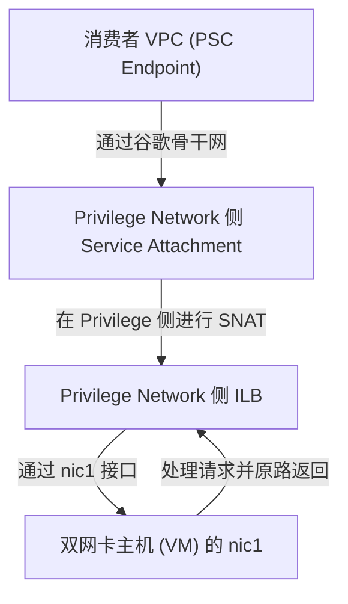

# 双网卡主机跨 VPC 暴露：基于私有/特权网络 (Privilege Network) 创建 PSC Service Attachment

在 GCP 混合网络与多租户架构中，经常会遇到多网卡 VM（Multi-NIC VM）的场景。本篇文档将针对以下特定场景进行可行性分析与实操方案设计：
- **主机现状**：一台 VM 拥有两块网卡：
  - `nic0` 绑定在 **Shared VPC (共享 VPC)**，已在其上配置了内部负载均衡器（ILB），但由于没有 Host Project 管理权限，无法在 Shared VPC 内创建 PSC NAT 子网或 Service Attachment。
  - `nic1` 绑定在 **Privilege Network (私有/特权网络)**，您拥有该网络的完整管理权限。
- **目标**：基于该主机，通过 **Privilege Network** 侧创建 PSC Service Attachment，将服务安全地暴露给外部消费者。

---

## 一、 可行性分析

### 结论：完全可行，但不能复用已有的 Shared VPC 负载均衡器。

#### 核心技术约束：
1. **网络作用域绑定（Network Scoping）**：PSC Service Attachment 必须指向同一 VPC 网络下的内部负载均衡器（ILB）前端转发规则（Forwarding Rule）。
2. **NAT 子网对齐**：Service Attachment 强依赖的 PSC NAT 子网也必须位于该 ILB 所在的同一个 VPC 网络中。

因此，因为您无法管理 Shared VPC（无法在其内创建 `purpose=PRIVATE_SERVICE_CONNECT` 的子网），您**绝对无法**直接基于 Shared VPC 侧 of 已有 ILB 创建 Service Attachment。

#### 解决方案：
您必须在您拥有管理权限的 **Privilege Network (nic1 所在 VPC)** 侧，为该主机重新构建一套“健康检查 -> 后端服务 -> 内部负载均衡器 (ILB) -> Service Attachment”的完整链路。流量路径如下：



---

## 二、 核心难点：多网卡非对称路由（Asymmetric Routing）

在双网卡 VM 中，GCP 默认的操作系统路由表通常只配置了一个默认网关（指向 `nic0`）。
- 当来自 PSC 的流量从 `nic1` 接口进入 VM 时，VM 默认会尝试通过 `nic0` (Shared VPC) 将响应报文发送出去。
- 这会导致**非对称路由**，由于 Shared VPC 无法识别该连接会话，响应报文会被直接丢弃，导致连接超时或握手失败。

### 解决方案：策略路由（Policy-Based Routing, PBR）
您必须在 VM 的操作系统内配置策略路由，确保：**凡是从 `nic1` 接收到的流量，其响应报文必须强制通过 `nic1` 的网关原路返回。**

---

## 三、 具体操作步骤

### 第一阶段：Privilege Network 基础设施准备（您的私有网络侧）

#### 1. 创建 PSC NAT 子网
在 Privilege Network 中划分一个专用于 PSC 转换的子网（建议掩码 `/28`，提供 14 个可用 IP，与 Attachment 保持 1:1 独占绑定）。
```bash
gcloud compute networks subnets create privilege-psc-nat-subnet \
  --project=YOUR_PROJECT_ID \
  --network=privilege-vpc \
  --region=europe-west2 \
  --range=10.200.0.0/28 \
  --purpose=PRIVATE_SERVICE_CONNECT
```

#### 2. 创建用于负载均衡的代理只读子网（Proxy-only Subnet，若使用 L7 ILB）
如果您使用 L7 内部应用负载均衡器（Internal Application Load Balancer），需要创建一个代理只读子网。如果使用 L4 内部直通负载均衡器（L4 NetLB），可跳过此步。
```bash
gcloud compute networks subnets create privilege-proxy-only-subnet \
  --project=YOUR_PROJECT_ID \
  --network=privilege-vpc \
  --region=europe-west2 \
  --range=10.210.0.0/24 \
  --purpose=REGIONAL_MANAGED_PROXY \
  --role=ACTIVE
```

---

### 第二阶段：在 Privilege Network 侧创建负载均衡与 Service Attachment

#### 1. 创建健康检查 (Health Check)
```bash
gcloud compute health-checks create tcp privilege-ilb-hc \
  --project=YOUR_PROJECT_ID \
  --region=europe-west2 \
  --port=80
```

#### 2. 创建后端服务 (Backend Service)
指定 `--load-balancing-scheme=INTERNAL`（此处以 L4 内部负载均衡器为例）。
```bash
gcloud compute backend-services create privilege-ilb-backend \
  --project=YOUR_PROJECT_ID \
  --region=europe-west2 \
  --load-balancing-scheme=INTERNAL \
  --protocol=TCP \
  --health-checks=privilege-ilb-hc
```

#### 3. 将双网卡主机作为后端加入后端服务
由于实例是多网卡的，在加入后端服务时，请确保使用实例组（Instance Group）或者网络端点组（NEG）。
*如果是未受管实例组（UMIG），请确保其实例在 Privilege Network 中有对应的 IP 绑定。*
```bash
# 创建未受管实例组（在 privilege-vpc 关联的 zone）
gcloud compute instance-groups unmanaged create privilege-umig \
  --project=YOUR_PROJECT_ID \
  --zone=europe-west2-a

# 将双网卡 VM 加入该实例组
gcloud compute instance-groups unmanaged add-instances privilege-umig \
  --project=YOUR_PROJECT_ID \
  --zone=europe-west2-a \
  --instances=YOUR_VM_NAME
  
# 将实例组关联到后端服务
gcloud compute backend-services add-backend privilege-ilb-backend \
  --project=YOUR_PROJECT_ID \
  --region=europe-west2 \
  --instance-group=privilege-umig \
  --instance-group-zone=europe-west2-a
```

#### 4. 创建内部负载均衡器的前端转发规则 (Forwarding Rule)
必须指定使用 `privilege-vpc` 中的普通业务子网（而非 PSC NAT 子网）。
```bash
gcloud compute forwarding-rules create privilege-ilb-forwarding-rule \
  --project=YOUR_PROJECT_ID \
  --region=europe-west2 \
  --load-balancing-scheme=INTERNAL \
  --network=privilege-vpc \
  --subnet=privilege-business-subnet \
  --ports=80 \
  --backend-service=privilege-ilb-backend
```

#### 5. 创建 Service Attachment
创建服务附加组件，将流量指向新创建的 `privilege-ilb-forwarding-rule`，并绑定之前创建的 `privilege-psc-nat-subnet`。
```bash
gcloud compute service-attachments create privilege-service-attachment \
  --project=YOUR_PROJECT_ID \
  --region=europe-west2 \
  --producer-forwarding-rule=privilege-ilb-forwarding-rule \
  --nat-subnets=privilege-psc-nat-subnet \
  --connection-preference=ACCEPT_AUTOMATIC
```

---

### 第三阶段：配置防火墙规则 (Firewall Rules)

您需要在 `privilege-vpc` 侧配置防火墙，放行以下两路流量到您的多网卡 VM（目标为 `nic1`）：
1. **健康检查流量**：放行 Google 官方健康检查探测 IP 段（`35.191.0.0/16` 和 `130.211.0.0/22`）。
2. **PSC 客户端流量**：放行之前创建的 **PSC NAT 子网段**（如 `10.200.0.0/28`）。

```bash
# 允许健康检查访问 VM
gcloud compute firewall-rules create allow-privilege-hc \
  --project=YOUR_PROJECT_ID \
  --network=privilege-vpc \
  --allow=tcp:80 \
  --source-ranges=35.191.0.0/16,130.211.0.0/22 \
  --target-tags=privilege-backend-vm

# 允许 PSC NAT 段访问 VM
gcloud compute firewall-rules create allow-privilege-psc-nat \
  --project=YOUR_PROJECT_ID \
  --network=privilege-vpc \
  --allow=tcp:80 \
  --source-ranges=10.200.0.0/28 \
  --target-tags=privilege-backend-vm
```
*(注：请在 VM 上打上 `privilege-backend-vm` 网络标签，或使用服务账号进行目标锁定)*

---

### 第四阶段：在多网卡主机内配置策略路由（VM 内部 OS 配置）

以 Linux (Ubuntu/Debian 示例) 系统为例，配置步骤如下：

#### 1. 临时配置验证（重启失效）
假设 `nic1` 在 OS 内的网卡接口名为 `eth1`，其分配的私有 IP 为 `10.150.0.4`，网关为 `10.150.0.1`：

```bash
# 1. 创建一个新的路由表，命名为 table 100
sudo ip route add 10.150.0.0/24 dev eth1 src 10.150.0.4 table 100
sudo ip route add default via 10.150.0.1 dev eth1 table 100

# 2. 设定路由规则：凡是源地址为 10.150.0.4 (nic1) 的响应报文，强制走 table 100
sudo ip rule add from 10.150.0.4 table 100

# 3. 清理路由缓存
sudo ip route flush cache
```

#### 2. 永久配置（避免重启 VM 后失效）
修改 `/etc/netplan/` 下的网卡配置文件（如 `50-cloud-init.yaml`），在 `eth1` 下加入路由和路由规则：

```yaml
network:
    version: 2
    ethernets:
        eth1:
            addresses:
                - 10.150.0.4/24
            routes:
                - to: 0.0.0.0/0
                  via: 10.150.0.1
                  table: 100
            routing-policy:
                - from: 10.150.0.4
                  table: 100
```
配置完成后执行 `sudo netplan apply` 生效。

---

## 五、 架构运作逻辑与优势

1. **管理权隔离**：
   通过在 `privilege-vpc` 上全新构建 ILB，您完全避开了无法修改 Shared VPC 的权限痛点。所有的 PSC 配套网络资产（NAT Subnet、Firewall Rules、Service Attachment）均驻留在您可控 Graves `privilege-vpc` 内。
2. **网络路由闭环**：
   客户端流量通过 PSC Endpoint 跨 VPC 接入时，由于开启了策略路由，VM 响应流量将完美地通过 `nic1` 沿原路（经由 Privilege 侧的 PSC NAT 和 ILB）送回消费者，完美规避了 Shared VPC 侧的非对称路由干扰。
