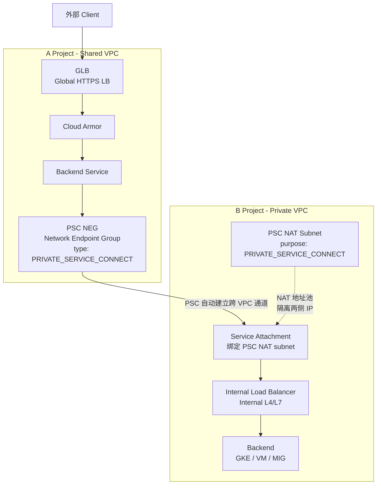
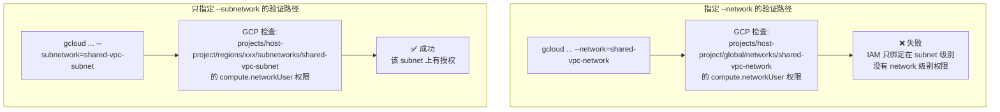
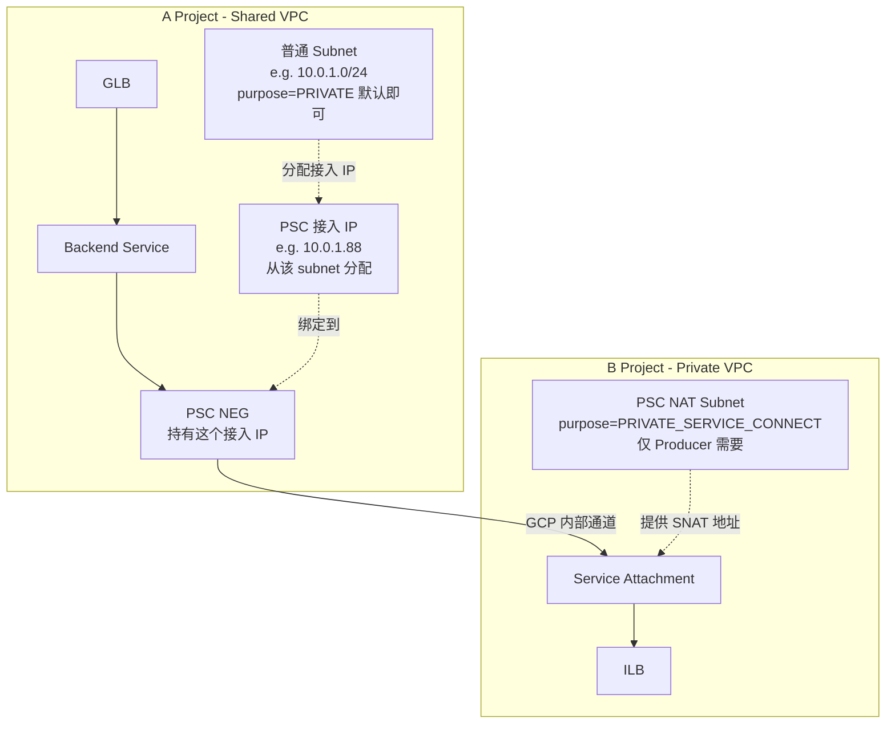
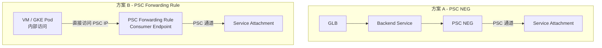

# 跨项目 PSC NEG 实现方案

## 问题描述

### 总体目标

希望实现一个跨 Project 的 API 访问架构：

```
A Project (入口层)
  ↓
Global Load Balancer
  ↓
PSC NEG (Consumer)
  ↓
B Project Service Attachment (Producer)
  ↓
Internal Load Balancer
  ↓
Backend Service (GKE / VM / MIG)
```

**核心目标**：让 A Project 的 GLB 通过 PSC 访问 B Project 的私有服务。

---

### 当前网络环境

网络结构包含两个 Project 和两种网络类型。

**A Project**
- 部署 Global Load Balancer
- 使用 Shared VPC
- 作为 PSC Consumer

```
A Project Shared VPC
└── GLB
    └── PSC NEG
```

**B Project**
- 有自己的 Private VPC
- 部署业务服务
- 作为 PSC Producer

```
B Project Private VPC
└── Service Attachment
    └── Internal Load Balancer
        └── Backend (GKE / VM)
```

---

### 想解决的问题

希望替换当前的跨 Project 访问方式。

**当前方案**（已实现）：

```
GLB
  ↓
NON_GCP_PRIVATE_IP_PORT NEG
  ↓
ILB IP
  ↓
Backend
```

特点：
- 直接访问 IP + Port
- Producer IP 暴露
- Producer 无法控制 consumer

**目标方案**：

```
GLB
  ↓
PSC NEG
  ↓
Service Attachment
  ↓
ILB
  ↓
Backend
```

特点：
- 访问 Service
- 不暴露 backend IP
- Producer 可以控制访问权限

---

### 核心问题

在实现这个架构时，主要在确认 PSC 的依赖关系和创建条件。

1. **PSC NEG 创建条件**
   - 是否需要 network
   - 是否需要 subnet
   - 是否必须在 Shared VPC

2. **Producer Service Attachment 条件**
   - 是否必须在 Shared VPC
   - 是否可以在 Private VPC
   - 是否必须有 PSC NAT subnet

3. **跨 Project 访问机制**

```
GLB (Shared VPC)
  ↓
PSC NEG
  ↓
B Project Private VPC Service Attachment
```

是否官方支持并可行。

4. **PSC 与当前方案对比**

NON_GCP_PRIVATE_IP_PORT NEG 和 PSC NEG 之间的区别：
- 网络依赖
- 安全性
- 架构设计

---

### 最终目标架构

```
GLB (A Project Shared VPC)
  ↓
Cloud Armor
  ↓
Backend Service
  ↓
PSC NEG
  ↓
Service Attachment (B Project)
  ↓
Internal Load Balancer
  ↓
Backend Service
```

| 能力                   | 目标 |
| ---------------------- | ---- |
| 跨 Project 访问        | ✔    |
| 不暴露 backend IP      | ✔    |
| Producer 控制 consumer | ✔    |
| 服务级别隔离           | ✔    |

---

### 需求总结

在 A Project 的 Shared VPC 中部署 GLB，并通过 PSC NEG 作为 Consumer，访问 B Project Private VPC 中通过 Service Attachment 发布的内部服务。

---

### PSC 核心机制

1. **网络归属机制**：PSC NEG 不需要 network / subnet
2. **Producer 网络要求**：Service Attachment 必须绑定 ILB + PSC subnet
3. **跨 VPC 通信机制**：Consumer VPC ≠ Producer VPC，PSC 会自动建立连接

---

## 问题分析

你的方案本质是：**用 PSC（Private Service Connect）替换裸 IP NEG，实现跨 Project 的服务级访问隔离**。核心涉及三个层面：PSC NEG 创建条件、Producer Service Attachment 要求、以及跨 VPC 通信机制。

---

## 架构全景图



---

## 实现步骤

### Step 1：B Project - 准备 PSC Producer

#### 1.1 创建 PSC NAT Subnet（必须）

```bash
gcloud compute networks subnets create psc-nat-subnet \
  --project=b-project \
  --network=private-vpc \
  --region=asia-east1 \
  --range=10.100.0.0/28 \
  --purpose=PRIVATE_SERVICE_CONNECT
```

> 注意：`purpose=PRIVATE_SERVICE_CONNECT` 是 Producer 侧的硬性要求，该 subnet 专用于 PSC NAT 地址转换，不能复用普通 subnet。

#### 1.2 确认 ILB 已存在

```bash
# 确认 B Project 的 ILB forwarding rule 名称
gcloud compute forwarding-rules list \
  --project=b-project \
  --filter="loadBalancingScheme=INTERNAL"
```

#### 1.3 创建 Service Attachment

```bash
gcloud compute service-attachments create my-service-attachment \
  --project=b-project \
  --region=asia-east1 \
  --producer-forwarding-rule=my-ilb-forwarding-rule \
  --connection-preference=ACCEPT_MANUAL \
  --consumer-accept-list=a-project-id=100 \
  --nat-subnets=psc-nat-subnet
```

| 参数                    | 说明                                                             |
| ----------------------- | ---------------------------------------------------------------- |
| `connection-preference` | `ACCEPT_MANUAL`：Producer 手动审批；`ACCEPT_AUTOMATIC`：自动接受 |
| `consumer-accept-list`  | 指定允许的 Consumer Project ID，实现访问控制                     |
| `nat-subnets`           | 绑定上一步创建的 PSC NAT subnet                                  |

---

### Step 2：A Project - 创建 PSC NEG（Consumer）

#### 2.1 创建 PSC NEG

```bash
gcloud compute network-endpoint-groups create psc-neg \
  --project=a-project \
  --region=asia-east1 \
  --network-endpoint-type=PRIVATE_SERVICE_CONNECT \
  --psc-target-service=projects/b-project/regions/asia-east1/serviceAttachments/my-service-attachment \
  --network=shared-vpc-network \
  --subnetwork=shared-vpc-subnet
```

> 注意：PSC NEG 需要指定 `network` 和 `subnetwork`，用于分配 Consumer 侧的 PSC 接入 IP（该 IP 仅在 Consumer VPC 内可路由）。

## 🔍 问题分析

你发现了一个很有意思的现象：**删掉 `--network` 后反而创建成功了**。这背后的原因确实和 Shared VPC 的 IAM 授权粒度有关。

---

## ✅ 核心原因

Shared VPC 的 IAM 授权有两种粒度：

| 授权粒度             | 命令                | 效果                                      |
| -------------------- | ------------------- | ----------------------------------------- |
| **整个网络级别**     | 绑定到 Host Project | Service Project 可用所有 subnet           |
| **单独 Subnet 级别** | 绑定到具体 subnet   | Service Project **只能用被授权的 subnet** |

你的环境是 **subnet 级别授权**，所以：

```
--network=shared-vpc-network   ← GCP 尝试验证整个 network 的访问权限 → 权限不足 → 失败
--subnetwork=shared-vpc-subnet ← GCP 只验证该 subnet 的访问权限     → 有权限   → 成功
```

---

## 📊 权限验证路径差异



---

## 🔑 Shared VPC IAM 授权粒度原理

```bash
# 网络级别授权（你的环境没有这个）
gcloud projects add-iam-policy-binding host-project \
  --member=serviceAccount:a-project@... \
  --role=roles/compute.networkUser
# 效果：A Project 可以使用 Host Project 所有 subnet

# Subnet 级别授权（你的环境是这个）
gcloud compute networks subnets add-iam-policy-binding shared-vpc-subnet \
  --project=host-project \
  --region=asia-east1 \
  --member=serviceAccount:a-project@... \
  --role=roles/compute.networkUser
# 效果：A Project 只能使用这一个 subnet
```

当你指定 `--network` 时，GCP 在 API 层面会做 **network 级别的权限校验**，你没有这个级别的授权，所以失败。只指定 `--subnetwork` 时，GCP **只校验该 subnet 的权限**，授权存在，所以成功。

---

## 一句话总结

> 你的 Shared VPC IAM 是 **subnet 级别精细授权**，不是 network 级别授权。指定 `--network` 触发了 network 级别的权限检查，而你只有 subnet 级别的权限，所以只写 `--subnetwork` 才能绕过 network 级别检查直接通过。这是 Shared VPC **最小权限原则**的典型配置。

#### 2.2 将 PSC NEG 加入 Backend Service

```bash
# 创建 Backend Service（如不存在）
gcloud compute backend-services create psc-backend-service \
  --project=a-project \
  --global \
  --protocol=HTTPS

# 添加 PSC NEG 作为 Backend
gcloud compute backend-services add-backend psc-backend-service \
  --project=a-project \
  --global \
  --network-endpoint-group=psc-neg \
  --network-endpoint-group-region=asia-east1
```

#### 2.3 绑定 Cloud Armor（可选但推荐）

```bash
gcloud compute backend-services update psc-backend-service \
  --project=a-project \
  --global \
  --security-policy=my-cloud-armor-policy
```

---

### Step 3：GLB 串联

```bash
# URL Map 指向 Backend Service
gcloud compute url-maps create psc-url-map \
  --project=a-project \
  --default-service=psc-backend-service

# HTTPS Proxy
gcloud compute target-https-proxies create psc-https-proxy \
  --project=a-project \
  --url-map=psc-url-map \
  --ssl-certificates=my-ssl-cert

# Forwarding Rule（GLB 入口）
gcloud compute forwarding-rules create psc-glb-rule \
  --project=a-project \
  --global \
  --target-https-proxy=psc-https-proxy \
  --ports=443
```

---

## PSC NEG vs NON_GCP_PRIVATE_IP_PORT NEG 对比

| 维度                       | `NON_GCP_PRIVATE_IP_PORT` NEG | PSC NEG                 |
| -------------------------- | ----------------------------- | ----------------------- |
| 访问目标                   | 裸 IP + Port                  | Service Attachment URI  |
| Backend IP 是否暴露        | 是                            | 否                      |
| Producer 访问控制          | 无                            | 支持 allowlist/手动审批 |
| 网络依赖                   | 需要 VPC Peering 或共享路由   | PSC 自动建立隔离通道    |
| 跨 Project 支持            | 需要额外网络打通              | 原生支持                |
| 服务级别隔离               | 否                            | 是                      |
| Consumer 侧需要 subnet     | 否                            | 是，分配接入 IP 用      |
| Producer 侧需要 PSC subnet | -                             | 必须                    |

---

## 三大核心机制澄清

### 1. PSC NEG 的网络归属

PSC NEG 创建时**需要指定 network + subnetwork**，原因是 GCP 需要在 Consumer VPC 内分配一个私有 IP 作为 PSC 接入点（Forwarding Rule IP）。这个 IP 仅用于 Consumer 内部路由，**不是** Backend 的真实 IP。

### 2. Producer 必须有 PSC NAT Subnet

Service Attachment 强制绑定 `purpose=PRIVATE_SERVICE_CONNECT` 的 subnet，这个 subnet 的 IP 用于做 **SNAT**，使 Consumer 的流量进入 Producer VPC 时源 IP 被替换，实现双向隔离。

### 3. 跨 VPC 通信机制

```
Consumer VPC (A Project Shared VPC)
    └── PSC NEG IP (e.g. 10.0.1.5)  ← Consumer 侧可见
            ↓ [GCP PSC 内部隧道，无需 VPC Peering]
Producer VPC (B Project Private VPC)
    └── PSC NAT IP (e.g. 10.100.0.3) ← SNAT 后进入 Producer
            ↓
    ILB → Backend
```

两个 VPC **完全不需要 Peering**，PSC 通过 Google 内部网络建立单向连接通道，IP 空间可以重叠。

---

## 注意事项

1. **区域一致性**：PSC NEG、Service Attachment、ILB 必须在**同一 Region**
2. **GLB 是全球资源，但 PSC NEG 是区域资源**，Backend Service 绑定时注意 `--region` vs `--global` 区别
3. **`ACCEPT_MANUAL` 模式下**，Producer 需要在 Service Attachment 上手动 approve Consumer 的连接请求：

    ```bash
    gcloud compute service-attachments describe my-service-attachment \  --project=b-project --region=asia-east1# 查看 connectedEndpoints 状态，手动 approve
    ```

4. **健康检查**：GLB 的 Health Check 流量也会经过 PSC 通道，需确保 B Project ILB 的健康检查端口对外可达
5. **Shared VPC 权限**：A Project 若使用 Shared VPC，PSC NEG 的 subnet 需要在 Host Project 的网络中，确认 Service Project 有 `compute.networkUser` 角色

---

## 为什么需要 Subnet

## 问题分析

你有两个疑问：

1. PSC NEG 为什么必须指定 Shared VPC 的 network/subnet？
2. Consumer 侧的 subnet 是否也需要 `purpose=PRIVATE_SERVICE_CONNECT`？

---

## PSC 连接建立机制



---

## 回答问题 1：为什么 PSC NEG 要指定 network/subnet？

**本质原因：GCP 需要在 Consumer VPC 内分配一个真实的私有 IP，作为 PSC 的本地接入端点。**

创建 PSC NEG 时，GCP 背后做了这件事：

```
你指定的 subnet (10.0.1.0/24)
        ↓
GCP 自动从中分配一个 IP，例如 10.0.1.88
        ↓
这个 IP 成为 PSC Forwarding Rule 的地址
        ↓
GLB → Backend Service → 流量发往 10.0.1.88
        ↓
GCP 识别这是 PSC 端点，转发到 B Project Service Attachment
```

**你必须给 GCP 指定从哪个 subnet 里分配这个 IP**，所以 network + subnet 是必填的。

---

## 回答问题 2：Consumer 的 subnet 需要 `PRIVATE_SERVICE_CONNECT` purpose 吗？

**不需要。Consumer 侧用普通 subnet 即可。**

| 侧                        | Subnet Purpose 要求            | 原因                             |
| ------------------------- | ------------------------------ | -------------------------------- |
| **Producer**（B Project） | 必须 `PRIVATE_SERVICE_CONNECT` | 用于 SNAT，隔离 Consumer 真实 IP |
| **Consumer**（A Project） | 普通 subnet 即可               | 仅用于分配 PSC 接入 IP           |

```bash
# Consumer 侧 subnet 就是普通 subnet，无需特殊 purpose
gcloud compute networks subnets create consumer-subnet \
  --project=a-project \
  --network=shared-vpc-network \
  --region=asia-east1 \
  --range=10.0.1.0/24
# purpose 默认就是 PRIVATE，不需要加任何额外参数
```

```bash
# PSC NEG 直接用这个普通 subnet 即可
gcloud compute network-endpoint-groups create psc-neg \
  --project=a-project \
  --region=asia-east1 \
  --network-endpoint-type=PRIVATE_SERVICE_CONNECT \
  --psc-target-service=projects/b-project/regions/asia-east1/serviceAttachments/my-service-attachment \
  --network=shared-vpc-network \
  --subnetwork=consumer-subnet   # 普通 subnet 即可
```

---

## 关于 Shared VPC 的补充说明

你说"不理解为什么一定要在 Shared VPC 里创建"——其实**不是强制必须在 Shared VPC**，而是因为你的 A Project 本身就使用 Shared VPC，所以 PSC NEG 只能用 A Project 能访问到的网络，即 Shared VPC 的 subnet。

```
如果 A Project 用的是独立 VPC  → 指定自己的 VPC subnet
如果 A Project 用的是 Shared VPC → 指定 Host Project 的 subnet
```

> 注意：**Shared VPC 下的权限注意**：PSC NEG 创建在 Service Project（A Project），但 subnet 属于 Host Project，需要确认 A Project 的 Service Account 有 Host Project 网络的 `compute.networkUser` 角色，否则创建会报权限错误。

---

## 总结

| 问题                                             | 结论                                                |
| ------------------------------------------------ | --------------------------------------------------- |
| 为什么要指定 subnet？                            | GCP 需要从该 subnet 分配一个本地 IP 作为 PSC 接入点 |
| Consumer subnet 需要特殊 purpose 吗？            | **不需要**，普通 subnet 即可                        |
| `PRIVATE_SERVICE_CONNECT` purpose 只在哪侧需要？ | **仅 Producer 侧**的 NAT subnet 需要                |

---

## 如何切换到其他方式

## 问题分析

你说的完全正确。PSC Consumer 侧有 **两种接入方式**，PSC NEG 只是其中一种。另一种就是直接创建 **PSC Forwarding Rule**（也叫 Consumer Endpoint）。

---

## 两种方案对比



---

## 两种方式核心区别

| 维度           | PSC NEG                     | PSC Forwarding Rule     |
| -------------- | --------------------------- | ----------------------- |
| 适用场景       | **GLB 作为入口**            | **内部服务直接访问**    |
| 能否挂载到 GLB | 可以                        | **不能**                |
| 访问方式       | GLB → Backend Service → NEG | 直接访问分配的私有 IP   |
| 创建复杂度     | 稍高                        | 简单                    |
| DNS 集成       | 通过 GLB 域名               | 可配合 Cloud DNS 私有域 |

---

## PSC Forwarding Rule 创建方式

```bash
# 第一步：在 Consumer subnet 预留一个静态内部 IP
gcloud compute addresses create psc-consumer-ip \
  --project=a-project \
  --region=asia-east1 \
  --subnet=consumer-subnet \
  --address-type=INTERNAL

# 第二步：创建 PSC Forwarding Rule 指向 Service Attachment
gcloud compute forwarding-rules create psc-consumer-endpoint \
  --project=a-project \
  --region=asia-east1 \
  --network=shared-vpc-network \
  --address=psc-consumer-ip \
  --target-service-attachment=projects/b-project/regions/asia-east1/serviceAttachments/my-service-attachment
```

创建成功后，A Project 内的任何资源（VM、GKE Pod）都可以直接通过 `psc-consumer-ip` 访问 B Project 的服务。

---

## 关键限制

**PSC Forwarding Rule 无法作为 GLB 的 Backend。**

所以如果你的目标架构是：

```
外部流量 → GLB → PSC → B Project
```

PSC Forwarding Rule **不满足需求**，必须用 PSC NEG。

PSC Forwarding Rule 适合的场景是：

```
A Project 内部服务（Kong DP / VM / GKE）→ PSC IP → B Project
```

---

## 结论

你的目标架构（GLB 作入口）只有 PSC NEG 这一条路。如果 PSC NEG 创建失败，需要先排查失败原因：

```bash
# 确认 subnet 存在且可用
gcloud compute networks subnets describe consumer-subnet \
  --project=a-project \
  --region=asia-east1

# 确认 Service Attachment 状态
gcloud compute service-attachments describe my-service-attachment \
  --project=b-project \
  --region=asia-east1
```

常见失败原因：

1. **Service Attachment 未 approve** Consumer Project
2. **subnet 不在同一 region**
3. **Shared VPC 权限不足**（`compute.networkUser` 缺失）

---

# Cross-Project Success Three - PSC NEG 实现方案

## 问题分析

你当前已通过 **NON_GCP_PRIVATE_IP_PORT ZONAL NEG** 方式实现了 Tenant ILB → Master Tier-2 ILB 的跨项目流量转发。现在评估 **Private Service Connect (PSC) NEG** 方案作为替代或补充，核心诉求是：

- 更清晰的跨项目边界隔离
- 更安全的 IAM 控制粒度
- 更清晰的计费归属（Cloud Armor 归 Tenant）

---