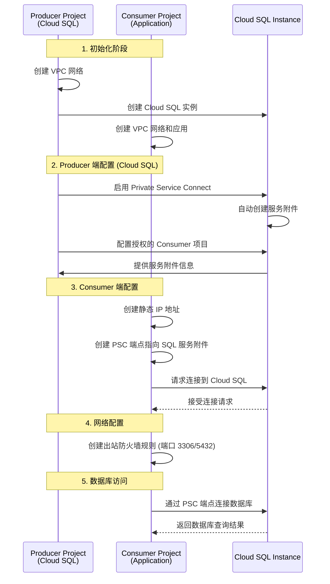

# Google Cloud Private Service Connect (PSC) 实施指南 - Cloud SQL 场景

## 概述

Private Service Connect (PSC) 是 Google Cloud 的一项网络功能，允许消费者在其 VPC 网络内部私密地访问托管服务。在您的场景中，Producer 项目托管 Cloud SQL 实例，Consumer 项目通过 PSC 私密访问这个数据库，流量完全保留在 Google Cloud 内部。

## 典型使用场景

**Producer 项目（数据库提供者）：**

- 托管 Cloud SQL 实例（MySQL、PostgreSQL 或 SQL Server）
- 通过 PSC 向其他项目提供数据库访问
- 控制哪些项目可以连接到数据库

**Consumer 项目（应用项目）：**

- 运行需要访问数据库的应用程序
- 通过 PSC 端点连接到 Producer 项目的 Cloud SQL
- 使用内部 IP 地址访问数据库，无需公网连接

## 核心概念

### Producer (数据库提供者)

- 托管 Cloud SQL 实例的项目
- 为 Cloud SQL 配置 Private Service Connect
- 控制哪些 Consumer 项目可以访问数据库
- Cloud SQL 自动提供 PSC 服务附件

### Consumer (应用项目)

- 运行应用程序的项目
- 创建 PSC 端点连接到 Cloud SQL
- 通过内部 IP 地址连接数据库
- 配置防火墙规则允许数据库连接

## 架构流程图



## 快速开始 - Cloud SQL PSC 连接

### 简化步骤概览

1. **Producer 项目**：创建 Cloud SQL 实例并启用 PSC
2. **Consumer 项目**：创建 PSC 端点连接到 Cloud SQL
3. **应用程序**：使用 PSC 端点 IP 连接数据库

### 核心命令速览

```bash
# Producer: 创建 Cloud SQL 并启用 PSC
gcloud sql instances create my-sql-instance \
    --database-version=MYSQL_8_0 \
    --tier=db-n1-standard-2 \
    --region=asia-east2 \
    --network=producer-vpc \
    --no-assign-ip

gcloud sql instances patch my-sql-instance \
    --enable-private-service-connect \
    --allowed-psc-projects=consumer-project-id

# Consumer: 创建 PSC 端点
gcloud compute addresses create sql-psc-ip \
    --region=asia-east2 \
    --subnet=consumer-subnet

gcloud compute forwarding-rules create sql-psc-endpoint \
    --region=asia-east2 \
    --network=consumer-vpc \
    --address=sql-psc-ip \
    --target-service-attachment=<SQL_SERVICE_ATTACHMENT_LINK>

# 应用程序使用 PSC 端点 IP 连接数据库
mysql -h <PSC_ENDPOINT_IP> -u root -p
```

## 详细实施步骤

### 前置条件

1. 启用必要的 API

```bash
# Producer 项目
gcloud services enable compute.googleapis.com --project=${PRODUCER_PROJECT_ID}
gcloud services enable container.googleapis.com --project=${PRODUCER_PROJECT_ID}

# Consumer 项目
gcloud services enable compute.googleapis.com --project=${CONSUMER_PROJECT_ID}
gcloud services enable privateconnect.googleapis.com --project=${CONSUMER_PROJECT_ID}
```

2. 设置环境变量

```bash
# 通用变量
export REGION=asia-east2
export ZONE=asia-east2-a

# Producer 项目变量（Cloud SQL）
export PRODUCER_PROJECT_ID=your-producer-project
export PRODUCER_VPC=producer-vpc
export SQL_INSTANCE_NAME=my-sql-instance
export SQL_DATABASE_VERSION=MYSQL_8_0
export SQL_TIER=db-n1-standard-2
export SQL_ROOT_PASSWORD=your-secure-password

# Consumer 项目变量
export CONSUMER_PROJECT_ID=your-consumer-project
export CONSUMER_VPC=consumer-vpc
export CONSUMER_SUBNET=consumer-subnet
export PSC_ENDPOINT_NAME=sql-psc-endpoint
export STATIC_IP_NAME=sql-psc-ip
export DB_PORT=3306  # MySQL=3306, PostgreSQL=5432, SQL Server=1433
```

### 第一阶段：Producer 项目配置（Cloud SQL）

#### 1. 创建 VPC 网络

```bash
# 创建 Producer VPC（如果还没有）
gcloud compute networks create ${PRODUCER_VPC} \
    --project=${PRODUCER_PROJECT_ID} \
    --subnet-mode=custom

# 为 Cloud SQL 创建私有 IP 范围（如果使用私有 IP）
gcloud compute addresses create google-managed-services-${PRODUCER_VPC} \
    --project=${PRODUCER_PROJECT_ID} \
    --global \
    --purpose=VPC_PEERING \
    --prefix-length=16 \
    --network=${PRODUCER_VPC}

# 创建私有连接
gcloud services vpc-peerings connect \
    --project=${PRODUCER_PROJECT_ID} \
    --service=servicenetworking.googleapis.com \
    --ranges=google-managed-services-${PRODUCER_VPC} \
    --network=${PRODUCER_VPC}
```

#### 2. 创建 Cloud SQL 实例

```bash
# 设置 Cloud SQL 相关变量
export SQL_INSTANCE_NAME=my-sql-instance
export SQL_DATABASE_VERSION=MYSQL_8_0  # 或 POSTGRES_13, SQLSERVER_2019_STANDARD
export SQL_TIER=db-n1-standard-2
export SQL_ROOT_PASSWORD=your-secure-password

# 创建 Cloud SQL 实例（使用私有 IP）
gcloud sql instances create ${SQL_INSTANCE_NAME} \
    --project=${PRODUCER_PROJECT_ID} \
    --database-version=${SQL_DATABASE_VERSION} \
    --tier=${SQL_TIER} \
    --region=${REGION} \
    --network=${PRODUCER_VPC} \
    --no-assign-ip \
    --root-password=${SQL_ROOT_PASSWORD}

# 等待实例创建完成
gcloud sql instances describe ${SQL_INSTANCE_NAME} \
    --project=${PRODUCER_PROJECT_ID}
```

#### 3. 启用 Cloud SQL 的 Private Service Connect

```bash
# 为 Cloud SQL 实例启用 PSC
gcloud sql instances patch ${SQL_INSTANCE_NAME} \
    --project=${PRODUCER_PROJECT_ID} \
    --enable-private-service-connect \
    --allowed-psc-projects=${CONSUMER_PROJECT_ID}

# 获取 Cloud SQL 的服务附件信息
gcloud sql instances describe ${SQL_INSTANCE_NAME} \
    --project=${PRODUCER_PROJECT_ID} \
    --format="value(pscServiceAttachmentLink)"

# 将服务附件链接保存到变量中
export SQL_SERVICE_ATTACHMENT=$(gcloud sql instances describe ${SQL_INSTANCE_NAME} \
    --project=${PRODUCER_PROJECT_ID} \
    --format="value(pscServiceAttachmentLink)")

echo "Cloud SQL Service Attachment: ${SQL_SERVICE_ATTACHMENT}"
```

#### 4. 验证 Cloud SQL PSC 配置

```bash
# 检查 Cloud SQL 实例的 PSC 状态
gcloud sql instances describe ${SQL_INSTANCE_NAME} \
    --project=${PRODUCER_PROJECT_ID} \
    --format="table(
        name,
        state,
        ipAddresses[].ipAddress:label=PRIVATE_IP,
        pscServiceAttachmentLink:label=PSC_SERVICE_ATTACHMENT
    )"

# 验证授权的项目列表
gcloud sql instances describe ${SQL_INSTANCE_NAME} \
    --project=${PRODUCER_PROJECT_ID} \
    --format="value(settings.pscConfig.allowedConsumerProjects[])"
```

### 第二阶段：Consumer 项目配置

#### 1. 创建 VPC 网络和子网

```bash
# 创建 Consumer VPC
gcloud compute networks create ${CONSUMER_VPC} \
    --project=${CONSUMER_PROJECT_ID} \
    --subnet-mode=custom

# 创建应用子网
gcloud compute networks subnets create ${CONSUMER_SUBNET} \
    --project=${CONSUMER_PROJECT_ID} \
    --network=${CONSUMER_VPC} \
    --range=10.1.1.0/24 \
    --region=${REGION}
```

#### 2. 创建静态 IP 地址

```bash
# 创建静态内部 IP 地址
gcloud compute addresses create ${STATIC_IP_NAME} \
    --project=${CONSUMER_PROJECT_ID} \
    --region=${REGION} \
    --subnet=${CONSUMER_SUBNET}

# 获取分配的 IP 地址
export PSC_ENDPOINT_IP=$(gcloud compute addresses describe ${STATIC_IP_NAME} \
    --project=${CONSUMER_PROJECT_ID} \
    --region=${REGION} \
    --format="value(address)")

echo "PSC Endpoint IP: ${PSC_ENDPOINT_IP}"
```

#### 3. 创建 PSC 端点连接到 Cloud SQL

```bash
# 使用从 Producer 项目获取的服务附件链接
export TARGET_SERVICE_ATTACHMENT=${SQL_SERVICE_ATTACHMENT}

# 创建 PSC 端点连接到 Cloud SQL
gcloud compute forwarding-rules create ${PSC_ENDPOINT_NAME} \
    --project=${CONSUMER_PROJECT_ID} \
    --region=${REGION} \
    --network=${CONSUMER_VPC} \
    --address=${STATIC_IP_NAME} \
    --target-service-attachment=${TARGET_SERVICE_ATTACHMENT} \
    --allow-psc-global-access

# 验证端点创建
gcloud compute forwarding-rules describe ${PSC_ENDPOINT_NAME} \
    --project=${CONSUMER_PROJECT_ID} \
    --region=${REGION}

# 获取 PSC 端点的 IP 地址（用于数据库连接）
export SQL_PSC_IP=$(gcloud compute forwarding-rules describe ${PSC_ENDPOINT_NAME} \
    --project=${CONSUMER_PROJECT_ID} \
    --region=${REGION} \
    --format="value(IPAddress)")

echo "Cloud SQL PSC Endpoint IP: ${SQL_PSC_IP}"
```

#### 4. 创建数据库访问防火墙规则

```bash
# 创建允许访问 Cloud SQL 的出站规则
# MySQL 使用端口 3306，PostgreSQL 使用端口 5432，SQL Server 使用端口 1433
export DB_PORT=3306  # 根据数据库类型调整：MySQL=3306, PostgreSQL=5432, SQL Server=1433

gcloud compute firewall-rules create allow-sql-psc-egress \
    --project=${CONSUMER_PROJECT_ID} \
    --network=${CONSUMER_VPC} \
    --direction=EGRESS \
    --destination-ranges=${SQL_PSC_IP}/32 \
    --action=ALLOW \
    --rules=tcp:${DB_PORT}

# 创建允许内部通信的规则
gcloud compute firewall-rules create allow-internal \
    --project=${CONSUMER_PROJECT_ID} \
    --network=${CONSUMER_VPC} \
    --direction=INGRESS \
    --source-ranges=10.1.1.0/24 \
    --action=ALLOW \
    --rules=tcp,udp,icmp
```

## 验证和测试

### 1. 创建测试虚拟机

```bash
# 在 Consumer 项目中创建测试 VM
gcloud compute instances create test-vm \
    --project=${CONSUMER_PROJECT_ID} \
    --zone=${ZONE} \
    --machine-type=e2-micro \
    --subnet=${CONSUMER_SUBNET} \
    --no-address \
    --image-family=ubuntu-2004-lts \
    --image-project=ubuntu-os-cloud
```

### 2. Cloud SQL 连接测试

```bash
# SSH 到测试 VM
gcloud compute ssh test-vm \
    --project=${CONSUMER_PROJECT_ID} \
    --zone=${ZONE}

# 在 VM 内执行测试
# 测试网络连通性
ping -c 4 ${SQL_PSC_IP}

# 测试数据库端口连接
nc -zv ${SQL_PSC_IP} ${DB_PORT}

# 安装数据库客户端（根据数据库类型选择）
# For MySQL:
sudo apt-get update && sudo apt-get install -y mysql-client

# For PostgreSQL:
# sudo apt-get update && sudo apt-get install -y postgresql-client

# 测试数据库连接
# MySQL 连接测试:
mysql -h ${SQL_PSC_IP} -u root -p${SQL_ROOT_PASSWORD} -e "SELECT 1;"

# PostgreSQL 连接测试:
# PGPASSWORD=${SQL_ROOT_PASSWORD} psql -h ${SQL_PSC_IP} -U postgres -c "SELECT 1;"

# 创建测试数据库和表
mysql -h ${SQL_PSC_IP} -u root -p${SQL_ROOT_PASSWORD} -e "
CREATE DATABASE IF NOT EXISTS testdb;
USE testdb;
CREATE TABLE IF NOT EXISTS test_table (id INT PRIMARY KEY, name VARCHAR(50));
INSERT INTO test_table VALUES (1, 'PSC Test');
SELECT * FROM test_table;
"
```

### 3. 应用程序连接示例

#### Python 应用连接示例

```python
import mysql.connector
from mysql.connector import Error

def connect_to_sql():
    try:
        # 使用 PSC 端点 IP 连接数据库
        connection = mysql.connector.connect(
            host='${SQL_PSC_IP}',  # PSC 端点 IP
            database='testdb',
            user='root',
            password='${SQL_ROOT_PASSWORD}'
        )

        if connection.is_connected():
            cursor = connection.cursor()
            cursor.execute("SELECT DATABASE();")
            record = cursor.fetchone()
            print(f"Connected to database: {record}")

            # 执行查询
            cursor.execute("SELECT * FROM test_table;")
            records = cursor.fetchall()
            for row in records:
                print(f"ID: {row[0]}, Name: {row[1]}")

    except Error as e:
        print(f"Error connecting to MySQL: {e}")
    finally:
        if connection.is_connected():
            cursor.close()
            connection.close()

if __name__ == "__main__":
    connect_to_sql()
```

#### Java 应用连接示例

```java
import java.sql.*;

public class CloudSQLConnection {
    private static final String DB_URL = "jdbc:mysql://${SQL_PSC_IP}:3306/testdb";
    private static final String USER = "root";
    private static final String PASS = "${SQL_ROOT_PASSWORD}";

    public static void main(String[] args) {
        try {
            Connection conn = DriverManager.getConnection(DB_URL, USER, PASS);
            System.out.println("Connected to Cloud SQL via PSC!");

            Statement stmt = conn.createStatement();
            ResultSet rs = stmt.executeQuery("SELECT * FROM test_table");

            while (rs.next()) {
                System.out.println("ID: " + rs.getInt("id") +
                                 ", Name: " + rs.getString("name"));
            }

            conn.close();
        } catch (SQLException e) {
            e.printStackTrace();
        }
    }
}
```

#### Node.js 应用连接示例

```javascript
const mysql = require("mysql2");

const connection = mysql.createConnection({
  host: "${SQL_PSC_IP}", // PSC 端点 IP
  user: "root",
  password: "${SQL_ROOT_PASSWORD}",
  database: "testdb",
});

connection.connect((err) => {
  if (err) {
    console.error("Error connecting to Cloud SQL: " + err.stack);
    return;
  }
  console.log("Connected to Cloud SQL via PSC as id " + connection.threadId);
});

connection.query("SELECT * FROM test_table", (error, results, fields) => {
  if (error) throw error;
  console.log("Query results:", results);
});

connection.end();
```

### 3. 验证检查列表

#### Producer 端验证

- [ ] 服务附件创建成功
- [ ] Consumer 项目已添加到接受列表
- [ ] 连接偏好设置为手动接受
- [ ] 内部负载均衡器正常运行
- [ ] PSC 子网配置正确
- [ ] 防火墙规则允许 PSC 流量

#### Consumer 端验证

- [ ] 静态 IP 地址创建成功
- [ ] PSC 端点创建成功
- [ ] 出站防火墙规则创建成功
- [ ] 能够解析 PSC 端点的 IP 地址
- [ ] 网络路由配置正确

#### 连接测试

- [ ] 从 Consumer VM ping PSC 端点 IP
- [ ] 使用 telnet/nc 测试端口连接
- [ ] HTTP/HTTPS 连接测试通过
- [ ] Producer 端看到连接日志

## 监控和故障排除

### 1. 查看连接状态

```bash
# 查看服务附件连接状态
gcloud compute service-attachments describe ${SERVICE_ATTACHMENT_NAME} \
    --project=${PRODUCER_PROJECT_ID} \
    --region=${REGION}

# 查看 PSC 端点状态
gcloud compute forwarding-rules describe ${PSC_ENDPOINT_NAME} \
    --project=${CONSUMER_PROJECT_ID} \
    --region=${REGION}
```

### 2. 查看日志

```bash
# 查看 VPC 流日志 (需要预先启用)
gcloud logging read "resource.type=gce_subnetwork" \
    --project=${CONSUMER_PROJECT_ID} \
    --limit=50

# 查看负载均衡器日志
gcloud logging read "resource.type=http_load_balancer" \
    --project=${PRODUCER_PROJECT_ID} \
    --limit=50
```

### 3. 常见问题排查

#### 连接被拒绝

- 检查 Consumer 项目是否在 Producer 的接受列表中
- 验证服务附件的连接偏好设置
- 确认防火墙规则配置正确

#### 无法解析 IP

- 检查静态 IP 地址是否正确分配
- 验证 PSC 端点配置
- 确认子网配置正确

#### 服务不可达

- 检查 Producer 端的内部负载均衡器状态
- 验证后端服务健康状态
- 确认应用程序正常运行

## 最佳实践

### 1. 安全性

- 使用最小权限原则配置 IAM 角色
- 定期审查消费者接受列表
- 实施网络分段和防火墙规则
- 启用 VPC 流日志进行监控

### 2. 可靠性

- 配置多区域部署提高可用性
- 实施健康检查和自动故障转移
- 设置监控和告警
- 定期测试连接和故障恢复

### 3. 性能

- 选择合适的机器类型和网络配置
- 优化负载均衡器配置
- 监控网络延迟和吞吐量
- 根据需要调整实例数量

### 4. 成本优化

- 使用合适的机器类型
- 实施自动扩缩容
- 监控网络使用量
- 定期审查资源使用情况

## 清理资源

当不再需要 PSC 连接时，按以下顺序清理资源：

### Consumer 端清理

```bash
# 删除测试 VM
gcloud compute instances delete test-vm \
    --project=${CONSUMER_PROJECT_ID} \
    --zone=${ZONE} \
    --quiet

# 删除防火墙规则
gcloud compute firewall-rules delete allow-psc-egress allow-internal \
    --project=${CONSUMER_PROJECT_ID} \
    --quiet

# 删除 PSC 端点
gcloud compute forwarding-rules delete ${PSC_ENDPOINT_NAME} \
    --project=${CONSUMER_PROJECT_ID} \
    --region=${REGION} \
    --quiet

# 删除静态 IP
gcloud compute addresses delete ${STATIC_IP_NAME} \
    --project=${CONSUMER_PROJECT_ID} \
    --region=${REGION} \
    --quiet

# 删除子网和 VPC
gcloud compute networks subnets delete ${CONSUMER_SUBNET} \
    --project=${CONSUMER_PROJECT_ID} \
    --region=${REGION} \
    --quiet

gcloud compute networks delete ${CONSUMER_VPC} \
    --project=${CONSUMER_PROJECT_ID} \
    --quiet
```

### Producer 端清理

```bash
# 删除服务附件
gcloud compute service-attachments delete ${SERVICE_ATTACHMENT_NAME} \
    --project=${PRODUCER_PROJECT_ID} \
    --region=${REGION} \
    --quiet

# 删除负载均衡器组件
gcloud compute forwarding-rules delete ${FWD_RULE} \
    --project=${PRODUCER_PROJECT_ID} \
    --region=${REGION} \
    --quiet

gcloud compute backend-services delete app-backend-service \
    --project=${PRODUCER_PROJECT_ID} \
    --region=${REGION} \
    --quiet

gcloud compute health-checks delete app-health-check \
    --project=${PRODUCER_PROJECT_ID} \
    --quiet

# 删除实例组和模板
gcloud compute instance-groups managed delete app-mig \
    --project=${PRODUCER_PROJECT_ID} \
    --zone=${ZONE} \
    --quiet

gcloud compute instance-templates delete app-template \
    --project=${PRODUCER_PROJECT_ID} \
    --quiet

# 删除防火墙规则
gcloud compute firewall-rules delete allow-psc-ingress allow-health-check \
    --project=${PRODUCER_PROJECT_ID} \
    --quiet

# 删除子网和 VPC
gcloud compute networks subnets delete ${PRODUCER_SUBNET} psc-${REGION} \
    --project=${PRODUCER_PROJECT_ID} \
    --region=${REGION} \
    --quiet

gcloud compute networks delete ${PRODUCER_VPC} \
    --project=${PRODUCER_PROJECT_ID} \
    --quiet
```

## 总结

Private Service Connect 提供了一种安全、高效的方式来连接不同项目和 VPC 中的服务。通过遵循本指南中的步骤和最佳实践，您可以成功实施 PSC 连接，实现跨项目的私有服务访问。

关键要点：

- Producer 控制服务访问权限
- Consumer 通过内部 IP 访问服务
- 流量完全保留在 Google Cloud 内部
- 需要正确配置防火墙和网络规则
- 定期监控和维护连接状态
