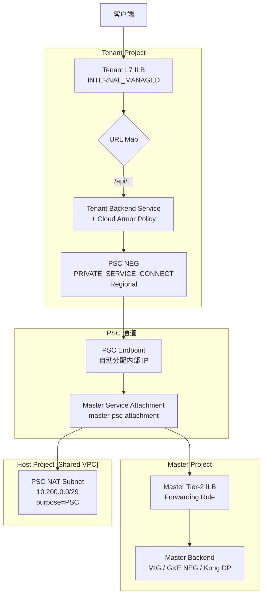
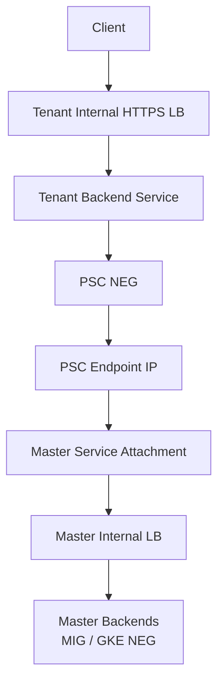
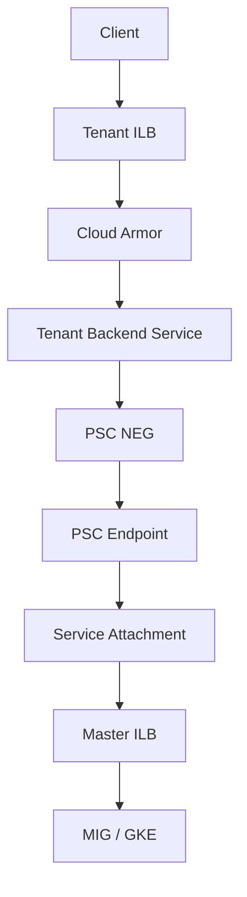

# Cross-Project Success Three - PSC NEG Implementation

## 🔍 问题分析

你当前已通过 **NON_GCP_PRIVATE_IP_PORT ZONAL NEG** 方式实现了 Tenant ILB → Master Tier-2 ILB 的跨项目流量转发。现在评估 **Private Service Connect (PSC) NEG** 方案作为替代或补充，核心诉求是：

- 更清晰的跨项目边界隔离
- 更安全的 IAM 控制粒度
- 更清晰的计费归属（Cloud Armor 归 Tenant）

---

## 🛠 PSC NEG 方案核心原理

PSC 方案将 Master 的服务封装成一个 **Private Service Connect Service Attachment**，Tenant 通过创建 **PSC NEG** 连接该 Attachment，流量走 GCP 内部私有通道，无需暴露真实 VIP。

```
Tenant ILB → Tenant Backend Service → PSC NEG → PSC Endpoint → Master Service Attachment → Master ILB/后端
```

---

## 🛠 详细实施步骤

### Step 1：Master 项目 — 创建内部负载均衡器（Tier-2 ILB）

> 假设 Master 已有 ILB，跳过此步；若无则参考下方。

```bash
# Master 项目变量
MASTER_PROJECT="master-project"
REGION="europe-west2"
NETWORK="projects/shared-host-project/global/networks/shared-vpc"
SUBNET="projects/shared-host-project/regions/europe-west2/subnetworks/master-subnet"

# 创建健康检查
gcloud compute health-checks create https master-tier2-hc \
  --project=${MASTER_PROJECT} \
  --region=${REGION} \
  --port=443
```

---

### Step 2：Master 项目 — 创建 PSC 专用子网（Nat subnet）

PSC Service Attachment 需要一个独立的 **purpose=PRIVATE_SERVICE_CONNECT** 子网，用于 SNAT。

```bash
# 在 Host Project 中创建（Shared VPC 场景下 subnet 属于 Host Project）
HOST_PROJECT="shared-host-project"

gcloud compute networks subnets create psc-nat-subnet-master \
  --project=${HOST_PROJECT} \
  --region=${REGION} \
  --network=shared-vpc \
  --range=10.200.0.0/29 \
  --purpose=PRIVATE_SERVICE_CONNECT
```

> ⚠️ 此子网 **只能用于 PSC NAT**，不可部署 VM。

---

### Step 3：Master 项目 — 创建 Service Attachment

将 Master Tier-2 ILB 的 Forwarding Rule 封装为 PSC Service Attachment。

```bash
# Master Tier-2 ILB 的 Forwarding Rule 名称
MASTER_FR_NAME="master-tier2-forwarding-rule"

gcloud compute service-attachments create master-psc-attachment \
  --project=${MASTER_PROJECT} \
  --region=${REGION} \
  --producer-forwarding-rule=${MASTER_FR_NAME} \
  --connection-preference=ACCEPT_AUTOMATIC \
  --nat-subnets=psc-nat-subnet-master \
  --enable-proxy-protocol
```

**connection-preference 对比：**

| 模式 | 说明 | 适用场景 |
|------|------|----------|
| `ACCEPT_AUTOMATIC` | 自动接受所有 Consumer 连接 | 内部可信 Tenant，快速接入 |
| `ACCEPT_MANUAL` | 需 Master 手动 accept | 严格管控，逐 Tenant 审批 |

---

### Step 4：获取 Service Attachment URI

```bash
gcloud compute service-attachments describe master-psc-attachment \
  --project=${MASTER_PROJECT} \
  --region=${REGION} \
  --format="value(selfLink)"

# 输出示例：
# projects/master-project/regions/europe-west2/serviceAttachments/master-psc-attachment
```

---

### Step 5：Tenant 项目 — 创建 PSC NEG

```bash
TENANT_PROJECT="tenant-project"
PSC_ATTACHMENT_URI="projects/master-project/regions/europe-west2/serviceAttachments/master-psc-attachment"

gcloud compute network-endpoint-groups create tenant-psc-neg \
  --project=${TENANT_PROJECT} \
  --region=${REGION} \
  --network-endpoint-type=PRIVATE_SERVICE_CONNECT \
  --psc-target-service=${PSC_ATTACHMENT_URI} \
  --network=projects/shared-host-project/global/networks/shared-vpc \
  --subnet=projects/shared-host-project/regions/europe-west2/subnetworks/tenant-subnet
```

> ⚠️ PSC NEG 是 **Regional** 级别，不是 Zonal，这与 NON_GCP_PRIVATE_IP_PORT NEG 不同。

---

### Step 6：Tenant 项目 — 创建/更新 Backend Service 指向 PSC NEG

```bash
# 创建新的 Backend Service（或更新已有的）
gcloud compute backend-services create tenant-psc-backend \
  --project=${TENANT_PROJECT} \
  --region=${REGION} \
  --load-balancing-scheme=INTERNAL_MANAGED \
  --protocol=HTTPS \
  --health-checks=projects/${TENANT_PROJECT}/regions/${REGION}/healthChecks/tenant-hc \
  --health-checks-region=${REGION}

# 将 PSC NEG 加入 Backend Service
gcloud compute backend-services add-backend tenant-psc-backend \
  --project=${TENANT_PROJECT} \
  --region=${REGION} \
  --network-endpoint-group=tenant-psc-neg \
  --network-endpoint-group-region=${REGION}
```

---

### Step 7：Tenant 项目 — 绑定 Cloud Armor

```bash
gcloud compute backend-services update tenant-psc-backend \
  --project=${TENANT_PROJECT} \
  --region=${REGION} \
  --security-policy=projects/${TENANT_PROJECT}/regions/${REGION}/securityPolicies/tenant-armor-policy
```

---

### Step 8：健康检查配置

PSC NEG 的健康检查由 **Tenant 侧**发起，探测目标为 PSC Endpoint（GCP 自动分配的内部 IP）。

```bash
# 创建 Tenant 侧健康检查
gcloud compute health-checks create https tenant-hc \
  --project=${TENANT_PROJECT} \
  --region=${REGION} \
  --port=443 \
  --request-path=/healthz
```

> ⚠️ Master 侧需放行健康检查源 IP（GCP 健康检查探针范围：`35.191.0.0/16`, `130.211.0.0/22`）。

---

### Step 9：防火墙规则（Master 侧）

```bash
# Master 项目放行来自 PSC NAT subnet 的流量
gcloud compute firewall-rules create allow-psc-from-nat \
  --project=${MASTER_PROJECT} \
  --network=shared-vpc \
  --allow=tcp:443 \
  --source-ranges=10.200.0.0/29 \
  --target-tags=master-backend-tag
```

---

## 📊 PSC NEG 完整架构流程



---

## 🔄 PSC NEG vs NON_GCP_PRIVATE_IP_PORT NEG 对比

| 维度 | NON_GCP_PRIVATE_IP_PORT NEG（当前） | PSC NEG（新方案） |
|------|-------------------------------------|-------------------|
| **后端标识** | 直接暴露 Master Tier-2 VIP | 封装为 Service Attachment，不暴露 VIP |
| **跨项目隔离** | 依赖 Shared VPC 网络层 | PSC 提供额外的服务边界隔离 |
| **IAM 控制** | Shared VPC 级别 | Service Attachment 级别，更精细 |
| **HA 配置** | 需手动创建多个 Zonal NEG | Regional NEG，GCP 自动处理 |
| **健康检查** | 探测 Tier-2 VIP | 探测 PSC Endpoint |
| **Cloud Armor** | 绑定在 Tenant BS，✅ 计费归 Tenant | 绑定在 Tenant BS，✅ 计费归 Tenant |
| **连接审批** | 无需，直接网络可达即可 | 支持 ACCEPT_MANUAL 逐 Tenant 审批 |
| **源 IP 保留** | 需 X-Forwarded-For | 支持 Proxy Protocol 传递 |
| **复杂度** | 低，需维护多 Zone NEG | 中，需维护 Service Attachment |

---

## ⚠️ 注意事项

### 1. ACCEPT_MANUAL 生产建议

```bash
# Master 手动接受特定 Tenant 的 PSC 连接
gcloud compute service-attachments update master-psc-attachment \
  --project=${MASTER_PROJECT} \
  --region=${REGION} \
  --consumer-accept-list=tenant-project=10
```

> `10` = 该 Tenant 最大连接数限制

### 2. 每个 Tenant 独立 PSC NEG

- 每个 Tenant 创建独立的 PSC NEG → 独立 Endpoint → 独立 Service Attachment Consumer 记录
- Master 侧可以通过 `--consumer-accept-list` 精确控制哪个 Tenant 可接入

### 3. 计费归属

- PSC NEG 的 Cloud Armor 费用仍归 **Tenant 项目**（因为 Security Policy 绑在 Tenant Backend Service）
- PSC 数据处理费用（约 $0.01/GB）由 **Consumer（Tenant）项目**承担

### 4. Proxy Protocol 与真实源 IP

```bash
# Service Attachment 创建时启用
--enable-proxy-protocol

# Master 后端（Nginx/Kong）需开启 proxy_protocol 解析
```

### 5. 跨 Region 限制

- PSC Service Attachment 和 Consumer NEG **必须在同一 Region**，无法跨 Region。

---

## 评估

### ❗ 问题 3：NAT Subnet /29 可能不够

你写：

```bash
--range=10.200.0.0/29
```

/29 = 8 IP，实际可用 5 个

100 Tenant 场景 → 至少 /24

多租户生产环境这个建议是合理的

**生产建议：**

至少 /24

特别是在多 Tenant 场景。

### 4️⃣ 计费维度是否更清晰？

是的。

**Cloud Armor**

仍然绑定在：

- Tenant Backend Service

费用：

- ✔ 归 Tenant

**PSC 流量费用**

PSC 是：

- Consumer 项目计费

所以：

- ✔ 可以实现真正 per-tenant 流量成本归属

这比当前 NEG 直连更清晰。

### 5️⃣ 安全性是否更强？

是的。

**当前模式：**

只要网络可达即可访问

**PSC 模式：**

必须被 Service Attachment allow

你可以：

```bash
--consumer-accept-list=tenant-project=10
```

甚至限制连接数。

这对多租户平台非常有价值。

### 6️⃣ 你方案的真正风险点

现在讲平台级视角。

#### ⚠️ 风险 1：增加一跳 LB

**原来：**

```
Tenant ILB → Master ILB
```

**现在：**

```
Tenant ILB → PSC Endpoint → Master ILB
```

虽然仍然 Google backbone 内部，但：

- 增加一次 proxy hop
- 增加连接状态管理

**延迟：**

通常 < 1ms

但极高 QPS 下需要压测。

#### ⚠️ 风险 2：连接上限问题

PSC 每个 Consumer 有 connection limit。

如果你：

- 多 tenant
- 大量短连接

必须验证：

- max connections per consumer

#### ⚠️ 风险 3：调试复杂度上升

**当前：**

```bash
curl VIP
```

**PSC：**

需要看：

- PSC connection state
- attachment status
- nat subnet
- firewall

运维复杂度上升。

### 7️⃣ 是否值得替换当前架构？

从平台演进角度：

| 阶段 | 建议 |
|------|------|
| 小规模 | 继续用当前 NEG |
| 多租户严格隔离 | PSC 更合适 |
| 需要审计接入 | PSC 更合适 |
| 强调安全边界 | PSC 更合适 |
| 追求简单 | 继续现有 |

### 8️⃣ 我给你的真实建议

结合你之前的所有架构：

- 多 Tenant
- Shared VPC
- 平台方 Master
- 希望 Tenant 独立安全策略
- 不希望 Master 承担 Cloud Armor 费用

👉 从长期平台化角度

**PSC 是更干净的设计**

但：

⚠️ 前提是你确认：

1. Master Tier-2 是否可用 L4 ILB（否则需改造）
2. NAT subnet 规模提前规划
3. 不依赖传统 HealthCheck 模型

### 9️⃣ 你现在的决策关键点

你需要回答一个问题：

> 你是更在意"架构纯粹性"，还是"工程复杂度最小化"？

**如果目标是：**

构建一个可扩展的多租户平台

PSC 是更正确的抽象。

**如果目标是：**

当前够用 + 成本最低 + 简单维护

现有 NEG 方式已经足够。

---

# Shared VPC 下 Tenant → Master 通过 PSC NEG 绑定 Internal HTTPS LB 的完整实现方案

---

## 1️⃣ 问题分析

你已确认：

- ✅ Backend Service 在 **Tenant 项目**
- ✅ Tenant 拥有：
    - Internal HTTPS LB
    - URL Map
    - Cloud Armor
    - TLS 证书
- ✅ Master 拥有：
    - GKE / MIG
    - 核心计算资源
- ✅ 同一个 Shared VPC（同 Host Project）
- ✅ 多 Tenant → 单 Master

你希望：

> 使用 PSC 替代 NON_GCP_PRIVATE_IP_PORT NEG
> 
> 实现更标准的跨项目内部服务暴露方式
> 
> 保持 Tenant 控制入口与安全策略

---

## 2️⃣ PSC 架构模型（目标形态）



---

## 3️⃣ 设计原则

| 维度 | 归属 |
|------|------|
| 入口控制 | Tenant |
| WAF (Cloud Armor) | Tenant |
| TLS 终止 | Tenant |
| 核心计算 | Master |
| 跨项目连接 | PSC |
| 计费 | 各自承担 |

---

## 4️⃣ 实施步骤（完整落地流程）

---

### 阶段一：Master 项目暴露服务

#### Step 1：Master 创建 Internal HTTPS LB（Tier-2）

如果已有可跳过。

必须是：

```
Load Balancer type: INTERNAL_MANAGED
```

#### Step 2：创建 Service Attachment

这是 PSC 的核心。

```bash
MASTER_PROJECT_ID="master-project"
REGION="europe-west2"
SERVICE_ATTACHMENT_NAME="master-tier2-psc"
FORWARDING_RULE="master-ilb-forwarding-rule"
NAT_SUBNET="psc-nat-subnet"

gcloud compute service-attachments create ${SERVICE_ATTACHMENT_NAME} \
  --project=${MASTER_PROJECT_ID} \
  --region=${REGION} \
  --producer-forwarding-rule=${FORWARDING_RULE} \
  --connection-preference=ACCEPT_MANUAL \
  --nat-subnets=${NAT_SUBNET}
```

**关键说明：**

| 参数 | 作用 |
|------|------|
| producer-forwarding-rule | 指向 Master Internal LB |
| ACCEPT_MANUAL | 手动批准 Tenant |
| nat-subnets | PSC 使用的 NAT 子网 |

#### Step 3：允许 Tenant 项目连接

```bash
gcloud compute service-attachments add-iam-policy-binding ${SERVICE_ATTACHMENT_NAME} \
  --project=${MASTER_PROJECT_ID} \
  --region=${REGION} \
  --member="serviceAccount:tenant-project-number@cloudservices.gserviceaccount.com" \
  --role="roles/compute.networkUser"
```

或者：

```
--consumer-accept-list=tenant-project-id=100
```

---

### 阶段二：Tenant 创建 PSC NEG

#### Step 4：Tenant 创建 PSC NEG

**为什么创建 Shared VPC NEG：**

- PSC NEG 必须绑定到某个 VPC + Subnet
- Internal HTTPS LB 和 PSC NEG 必须在同一个 VPC 中
- 你的 **Internal HTTPS Load Balancer 使用的是 Shared VPC**
- Tenant 是 **Service Project（挂载到 Shared VPC）**
- ILB 的 forwarding rule 在 Shared VPC 子网里
- PSC NEG 必须使用 Shared VPC 的 subnet（例如 10.72.x.x）
- ❌ 不能使用 Tenant 自己 192.168.x.x 的 VPC

**关于 PRIVATE_SERVICE_CONNECT：**

这个类型我们现在不允许创建？

```bash
TENANT_PROJECT_ID="tenant-project"
REGION="europe-west2"
PSC_NEG_NAME="tenant-to-master-psc-neg"
NETWORK="projects/host-project/global/networks/shared-vpc"
SUBNET="projects/host-project/regions/europe-west2/subnetworks/shared-subnet"
SERVICE_ATTACHMENT="projects/master-project/regions/europe-west2/serviceAttachments/master-tier2-psc"

gcloud compute network-endpoint-groups create ${PSC_NEG_NAME} \
  --project=${TENANT_PROJECT_ID} \
  --region=${REGION} \
  --network=${NETWORK} \
  --subnet=${SUBNET} \
  --network-endpoint-type=PRIVATE_SERVICE_CONNECT \
  --psc-target-service=${SERVICE_ATTACHMENT}
```

---

#### Step 5：创建 Backend Service 并绑定 PSC NEG

```bash
BACKEND_SERVICE_NAME="tenant-backend-to-master"

gcloud compute backend-services create ${BACKEND_SERVICE_NAME} \
  --project=${TENANT_PROJECT_ID} \
  --region=${REGION} \
  --load-balancing-scheme=INTERNAL_MANAGED \
  --protocol=HTTPS \
  --health-checks=tenant-hc

gcloud compute backend-services add-backend ${BACKEND_SERVICE_NAME} \
  --project=${TENANT_PROJECT_ID} \
  --region=${REGION} \
  --network-endpoint-group=${PSC_NEG_NAME} \
  --network-endpoint-group-region=${REGION}
```

---

#### Step 6：绑定 Cloud Armor

```bash
gcloud compute backend-services update ${BACKEND_SERVICE_NAME} \
  --project=${TENANT_PROJECT_ID} \
  --region=${REGION} \
  --security-policy=tenant-cloud-armor-policy
```

---

### 阶段三：Master 批准连接

当 Tenant 创建 PSC NEG 后：

```bash
gcloud compute service-attachments describe master-tier2-psc \
  --project=${MASTER_PROJECT_ID} \
  --region=${REGION}
```

找到 pending connection：

```bash
gcloud compute service-attachments update master-tier2-psc \
  --project=${MASTER_PROJECT_ID} \
  --region=${REGION} \
  --consumer-accept-list=tenant-project-id=10
```

---

## 5️⃣ 流量完整路径



---

## 6️⃣ 和你当前方案对比

| 维度 | 当前 VIP NEG | PSC |
|------|--------------|-----|
| 跨项目官方支持 | ⚠️ 变通方式 | ✅ 官方 |
| 安全隔离 | 一般 | 强 |
| IAM 控制 | 复杂 | 清晰 |
| HealthCheck 复杂度 | 高 | 简化 |
| VIP 暴露 | 是 | 否 |
| 可扩展性 | 中 | 高 |

---

## 7️⃣ 权限模型

PSC 模式下：

**Tenant 不需要：**

- Compute Instance Admin
- 修改 Master 资源权限

**只需要：**

```
roles/compute.networkUser
```

**Master 控制：**

- 谁可以接入
- 最大连接数
- Service Attachment 生命周期

---

## 8️⃣ 计费边界

| 费用类型 | 归属 |
|----------|------|
| Tenant ILB | Tenant |
| Tenant Cloud Armor | Tenant |
| PSC Data Processing | Tenant |
| Master ILB | Master |
| Master Compute | Master |

这比你现在所有 Armor 费用都在 Master 更合理。

---

## 9️⃣ 复杂度评估

| 维度 | 等级 |
|------|------|
| 技术复杂度 | Moderate |
| 企业架构成熟度 | 高 |
| 多租户支持 | 强 |
| 推荐指数 | ⭐⭐⭐⭐ |

---

## 🔟 建议

如果你：

- 计划 50+ Tenant
- 需要明确安全边界
- 需要清晰计费拆分
- 需要企业级标准模型

👉 建议迁移 PSC。

---

## 下一步建议

如果你愿意，我可以继续：

1. 给你画一个"最终企业级标准多租户架构图"
2. 帮你设计 IAM 最小权限矩阵
3. 帮你设计 Master-Tenant 成本拆分模型
4. 分析 PSC 在高并发下的性能特性
