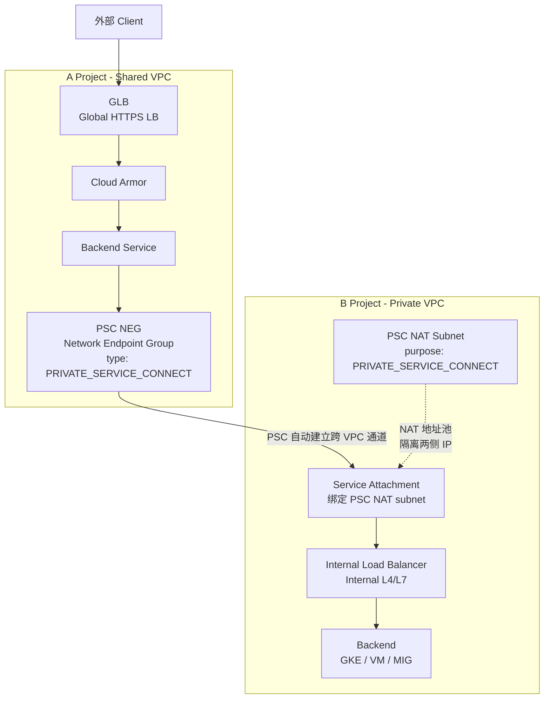
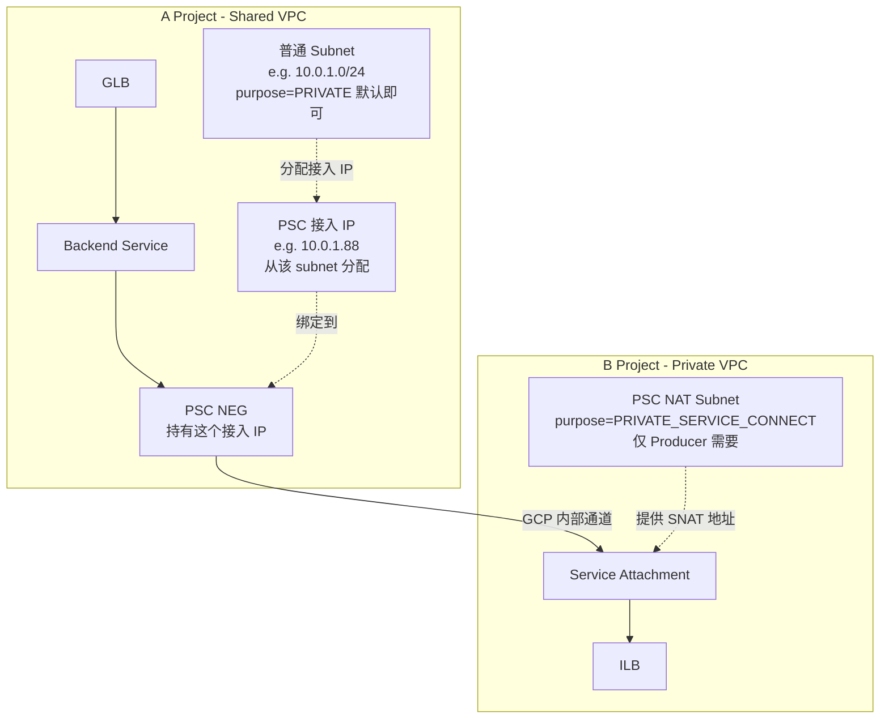
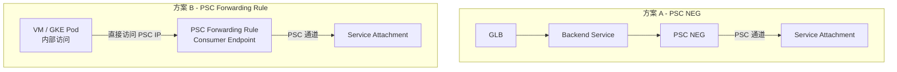
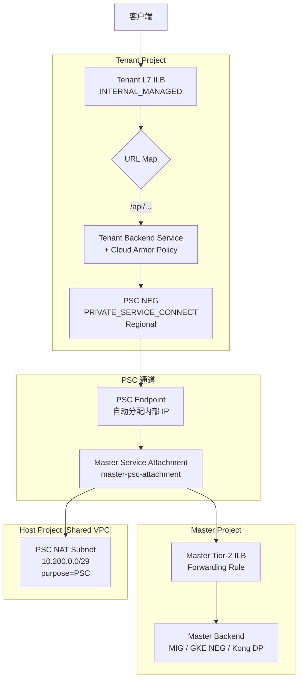
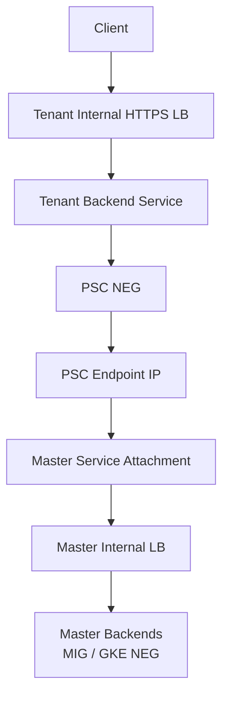
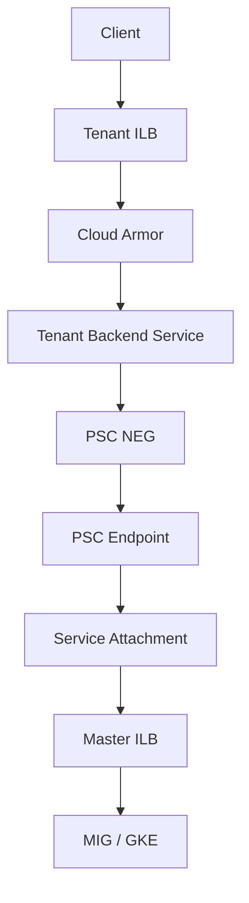

# 跨项目 PSC NEG 实现方案

## 问题描述

### 总体目标

希望实现一个跨 Project 的 API 访问架构：

```
A Project (入口层)
  ↓
Global Load Balancer
  ↓
PSC NEG (Consumer)
  ↓
B Project Service Attachment (Producer)
  ↓
Internal Load Balancer
  ↓
Backend Service (GKE / VM / MIG)
```

**核心目标**：让 A Project 的 GLB 通过 PSC 访问 B Project 的私有服务。

---

### 当前网络环境

网络结构包含两个 Project 和两种网络类型。

**A Project**
- 部署 Global Load Balancer
- 使用 Shared VPC
- 作为 PSC Consumer

```
A Project Shared VPC
└── GLB
    └── PSC NEG
```

**B Project**
- 有自己的 Private VPC
- 部署业务服务
- 作为 PSC Producer

```
B Project Private VPC
└── Service Attachment
    └── Internal Load Balancer
        └── Backend (GKE / VM)
```

---

### 想解决的问题

希望替换当前的跨 Project 访问方式。

**当前方案**（已实现）：

```
GLB
  ↓
NON_GCP_PRIVATE_IP_PORT NEG
  ↓
ILB IP
  ↓
Backend
```

特点：
- 直接访问 IP + Port
- Producer IP 暴露
- Producer 无法控制 consumer

**目标方案**：

```
GLB
  ↓
PSC NEG
  ↓
Service Attachment
  ↓
ILB
  ↓
Backend
```

特点：
- 访问 Service
- 不暴露 backend IP
- Producer 可以控制访问权限

---

### 核心问题

在实现这个架构时，主要在确认 PSC 的依赖关系和创建条件。

1. **PSC NEG 创建条件**
   - 是否需要 network
   - 是否需要 subnet
   - 是否必须在 Shared VPC

2. **Producer Service Attachment 条件**
   - 是否必须在 Shared VPC
   - 是否可以在 Private VPC
   - 是否必须有 PSC NAT subnet

3. **跨 Project 访问机制**

```
GLB (Shared VPC)
  ↓
PSC NEG
  ↓
B Project Private VPC Service Attachment
```

是否官方支持并可行。

4. **PSC 与当前方案对比**

NON_GCP_PRIVATE_IP_PORT NEG 和 PSC NEG 之间的区别：
- 网络依赖
- 安全性
- 架构设计

---

### 最终目标架构

```
GLB (A Project Shared VPC)
  ↓
Cloud Armor
  ↓
Backend Service
  ↓
PSC NEG
  ↓
Service Attachment (B Project)
  ↓
Internal Load Balancer
  ↓
Backend Service
```

| 能力 | 目标 |
|------|------|
| 跨 Project 访问 | ✔ |
| 不暴露 backend IP | ✔ |
| Producer 控制 consumer | ✔ |
| 服务级别隔离 | ✔ |

---

### 需求总结

在 A Project 的 Shared VPC 中部署 GLB，并通过 PSC NEG 作为 Consumer，访问 B Project Private VPC 中通过 Service Attachment 发布的内部服务。

---

### PSC 核心机制

1. **网络归属机制**：PSC NEG 不需要 network / subnet
2. **Producer 网络要求**：Service Attachment 必须绑定 ILB + PSC subnet
3. **跨 VPC 通信机制**：Consumer VPC ≠ Producer VPC，PSC 会自动建立连接

---

## 问题分析

你的方案本质是：**用 PSC（Private Service Connect）替换裸 IP NEG，实现跨 Project 的服务级访问隔离**。核心涉及三个层面：PSC NEG 创建条件、Producer Service Attachment 要求、以及跨 VPC 通信机制。

---

## 架构全景图



---

## 实现步骤

### Step 1：B Project - 准备 PSC Producer

#### 1.1 创建 PSC NAT Subnet（必须）

```bash
gcloud compute networks subnets create psc-nat-subnet \
  --project=b-project \
  --network=private-vpc \
  --region=asia-east1 \
  --range=10.100.0.0/28 \
  --purpose=PRIVATE_SERVICE_CONNECT
```

> 注意：`purpose=PRIVATE_SERVICE_CONNECT` 是 Producer 侧的硬性要求，该 subnet 专用于 PSC NAT 地址转换，不能复用普通 subnet。

#### 1.2 确认 ILB 已存在

```bash
# 确认 B Project 的 ILB forwarding rule 名称
gcloud compute forwarding-rules list \
  --project=b-project \
  --filter="loadBalancingScheme=INTERNAL"
```

#### 1.3 创建 Service Attachment

```bash
gcloud compute service-attachments create my-service-attachment \
  --project=b-project \
  --region=asia-east1 \
  --producer-forwarding-rule=my-ilb-forwarding-rule \
  --connection-preference=ACCEPT_MANUAL \
  --consumer-accept-list=a-project-id=100 \
  --nat-subnets=psc-nat-subnet
```

| 参数                    | 说明                                                             |
| ----------------------- | ---------------------------------------------------------------- |
| `connection-preference` | `ACCEPT_MANUAL`：Producer 手动审批；`ACCEPT_AUTOMATIC`：自动接受 |
| `consumer-accept-list`  | 指定允许的 Consumer Project ID，实现访问控制                     |
| `nat-subnets`           | 绑定上一步创建的 PSC NAT subnet                                  |

---

### Step 2：A Project - 创建 PSC NEG（Consumer）

#### 2.1 创建 PSC NEG

```bash
gcloud compute network-endpoint-groups create psc-neg \
  --project=a-project \
  --region=asia-east1 \
  --network-endpoint-type=PRIVATE_SERVICE_CONNECT \
  --psc-target-service=projects/b-project/regions/asia-east1/serviceAttachments/my-service-attachment \
  --network=shared-vpc-network \
  --subnetwork=shared-vpc-subnet
```

> 注意：PSC NEG 需要指定 `network` 和 `subnetwork`，用于分配 Consumer 侧的 PSC 接入 IP（该 IP 仅在 Consumer VPC 内可路由）。

#### 2.2 将 PSC NEG 加入 Backend Service

```bash
# 创建 Backend Service（如不存在）
gcloud compute backend-services create psc-backend-service \
  --project=a-project \
  --global \
  --protocol=HTTPS

# 添加 PSC NEG 作为 Backend
gcloud compute backend-services add-backend psc-backend-service \
  --project=a-project \
  --global \
  --network-endpoint-group=psc-neg \
  --network-endpoint-group-region=asia-east1
```

#### 2.3 绑定 Cloud Armor（可选但推荐）

```bash
gcloud compute backend-services update psc-backend-service \
  --project=a-project \
  --global \
  --security-policy=my-cloud-armor-policy
```

---

### Step 3：GLB 串联

```bash
# URL Map 指向 Backend Service
gcloud compute url-maps create psc-url-map \
  --project=a-project \
  --default-service=psc-backend-service

# HTTPS Proxy
gcloud compute target-https-proxies create psc-https-proxy \
  --project=a-project \
  --url-map=psc-url-map \
  --ssl-certificates=my-ssl-cert

# Forwarding Rule（GLB 入口）
gcloud compute forwarding-rules create psc-glb-rule \
  --project=a-project \
  --global \
  --target-https-proxy=psc-https-proxy \
  --ports=443
```

---

## PSC NEG vs NON_GCP_PRIVATE_IP_PORT NEG 对比

| 维度 | `NON_GCP_PRIVATE_IP_PORT` NEG | PSC NEG |
|------|-------------------------------|---------|
| 访问目标 | 裸 IP + Port | Service Attachment URI |
| Backend IP 是否暴露 | 是 | 否 |
| Producer 访问控制 | 无 | 支持 allowlist/手动审批 |
| 网络依赖 | 需要 VPC Peering 或共享路由 | PSC 自动建立隔离通道 |
| 跨 Project 支持 | 需要额外网络打通 | 原生支持 |
| 服务级别隔离 | 否 | 是 |
| Consumer 侧需要 subnet | 否 | 是，分配接入 IP 用 |
| Producer 侧需要 PSC subnet | - | 必须 |

---

## 三大核心机制澄清

### 1. PSC NEG 的网络归属

PSC NEG 创建时**需要指定 network + subnetwork**，原因是 GCP 需要在 Consumer VPC 内分配一个私有 IP 作为 PSC 接入点（Forwarding Rule IP）。这个 IP 仅用于 Consumer 内部路由，**不是** Backend 的真实 IP。

### 2. Producer 必须有 PSC NAT Subnet

Service Attachment 强制绑定 `purpose=PRIVATE_SERVICE_CONNECT` 的 subnet，这个 subnet 的 IP 用于做 **SNAT**，使 Consumer 的流量进入 Producer VPC 时源 IP 被替换，实现双向隔离。

### 3. 跨 VPC 通信机制

```
Consumer VPC (A Project Shared VPC)
    └── PSC NEG IP (e.g. 10.0.1.5)  ← Consumer 侧可见
            ↓ [GCP PSC 内部隧道，无需 VPC Peering]
Producer VPC (B Project Private VPC)
    └── PSC NAT IP (e.g. 10.100.0.3) ← SNAT 后进入 Producer
            ↓
    ILB → Backend
```

两个 VPC **完全不需要 Peering**，PSC 通过 Google 内部网络建立单向连接通道，IP 空间可以重叠。

---

## 注意事项

1. **区域一致性**：PSC NEG、Service Attachment、ILB 必须在**同一 Region**
2. **GLB 是全球资源，但 PSC NEG 是区域资源**，Backend Service 绑定时注意 `--region` vs `--global` 区别
3. **`ACCEPT_MANUAL` 模式下**，Producer 需要在 Service Attachment 上手动 approve Consumer 的连接请求：

    ```bash
    gcloud compute service-attachments describe my-service-attachment \  --project=b-project --region=asia-east1# 查看 connectedEndpoints 状态，手动 approve
    ```

4. **健康检查**：GLB 的 Health Check 流量也会经过 PSC 通道，需确保 B Project ILB 的健康检查端口对外可达
5. **Shared VPC 权限**：A Project 若使用 Shared VPC，PSC NEG 的 subnet 需要在 Host Project 的网络中，确认 Service Project 有 `compute.networkUser` 角色

---

## 为什么需要 Subnet

## 问题分析

你有两个疑问：

1. PSC NEG 为什么必须指定 Shared VPC 的 network/subnet？
2. Consumer 侧的 subnet 是否也需要 `purpose=PRIVATE_SERVICE_CONNECT`？

---

## PSC 连接建立机制



---

## 回答问题 1：为什么 PSC NEG 要指定 network/subnet？

**本质原因：GCP 需要在 Consumer VPC 内分配一个真实的私有 IP，作为 PSC 的本地接入端点。**

创建 PSC NEG 时，GCP 背后做了这件事：

```
你指定的 subnet (10.0.1.0/24)
        ↓
GCP 自动从中分配一个 IP，例如 10.0.1.88
        ↓
这个 IP 成为 PSC Forwarding Rule 的地址
        ↓
GLB → Backend Service → 流量发往 10.0.1.88
        ↓
GCP 识别这是 PSC 端点，转发到 B Project Service Attachment
```

**你必须给 GCP 指定从哪个 subnet 里分配这个 IP**，所以 network + subnet 是必填的。

---

## 回答问题 2：Consumer 的 subnet 需要 `PRIVATE_SERVICE_CONNECT` purpose 吗？

**不需要。Consumer 侧用普通 subnet 即可。**

| 侧 | Subnet Purpose 要求 | 原因 |
|----|---------------------|------|
| **Producer**（B Project） | 必须 `PRIVATE_SERVICE_CONNECT` | 用于 SNAT，隔离 Consumer 真实 IP |
| **Consumer**（A Project） | 普通 subnet 即可 | 仅用于分配 PSC 接入 IP |

```bash
# Consumer 侧 subnet 就是普通 subnet，无需特殊 purpose
gcloud compute networks subnets create consumer-subnet \
  --project=a-project \
  --network=shared-vpc-network \
  --region=asia-east1 \
  --range=10.0.1.0/24
# purpose 默认就是 PRIVATE，不需要加任何额外参数
```

```bash
# PSC NEG 直接用这个普通 subnet 即可
gcloud compute network-endpoint-groups create psc-neg \
  --project=a-project \
  --region=asia-east1 \
  --network-endpoint-type=PRIVATE_SERVICE_CONNECT \
  --psc-target-service=projects/b-project/regions/asia-east1/serviceAttachments/my-service-attachment \
  --network=shared-vpc-network \
  --subnetwork=consumer-subnet   # 普通 subnet 即可
```

---

## 关于 Shared VPC 的补充说明

你说"不理解为什么一定要在 Shared VPC 里创建"——其实**不是强制必须在 Shared VPC**，而是因为你的 A Project 本身就使用 Shared VPC，所以 PSC NEG 只能用 A Project 能访问到的网络，即 Shared VPC 的 subnet。

```
如果 A Project 用的是独立 VPC  → 指定自己的 VPC subnet
如果 A Project 用的是 Shared VPC → 指定 Host Project 的 subnet
```

> 注意：**Shared VPC 下的权限注意**：PSC NEG 创建在 Service Project（A Project），但 subnet 属于 Host Project，需要确认 A Project 的 Service Account 有 Host Project 网络的 `compute.networkUser` 角色，否则创建会报权限错误。

---

## 总结

| 问题 | 结论 |
|------|------|
| 为什么要指定 subnet？ | GCP 需要从该 subnet 分配一个本地 IP 作为 PSC 接入点 |
| Consumer subnet 需要特殊 purpose 吗？ | **不需要**，普通 subnet 即可 |
| `PRIVATE_SERVICE_CONNECT` purpose 只在哪侧需要？ | **仅 Producer 侧**的 NAT subnet 需要 |

---

## 如何切换到其他方式

## 问题分析

你说的完全正确。PSC Consumer 侧有 **两种接入方式**，PSC NEG 只是其中一种。另一种就是直接创建 **PSC Forwarding Rule**（也叫 Consumer Endpoint）。

---

## 两种方案对比



---

## 两种方式核心区别

| 维度 | PSC NEG | PSC Forwarding Rule |
|------|---------|---------------------|
| 适用场景 | **GLB 作为入口** | **内部服务直接访问** |
| 能否挂载到 GLB | 可以 | **不能** |
| 访问方式 | GLB → Backend Service → NEG | 直接访问分配的私有 IP |
| 创建复杂度 | 稍高 | 简单 |
| DNS 集成 | 通过 GLB 域名 | 可配合 Cloud DNS 私有域 |

---

## PSC Forwarding Rule 创建方式

```bash
# 第一步：在 Consumer subnet 预留一个静态内部 IP
gcloud compute addresses create psc-consumer-ip \
  --project=a-project \
  --region=asia-east1 \
  --subnet=consumer-subnet \
  --address-type=INTERNAL

# 第二步：创建 PSC Forwarding Rule 指向 Service Attachment
gcloud compute forwarding-rules create psc-consumer-endpoint \
  --project=a-project \
  --region=asia-east1 \
  --network=shared-vpc-network \
  --address=psc-consumer-ip \
  --target-service-attachment=projects/b-project/regions/asia-east1/serviceAttachments/my-service-attachment
```

创建成功后，A Project 内的任何资源（VM、GKE Pod）都可以直接通过 `psc-consumer-ip` 访问 B Project 的服务。

---

## 关键限制

**PSC Forwarding Rule 无法作为 GLB 的 Backend。**

所以如果你的目标架构是：

```
外部流量 → GLB → PSC → B Project
```

PSC Forwarding Rule **不满足需求**，必须用 PSC NEG。

PSC Forwarding Rule 适合的场景是：

```
A Project 内部服务（Kong DP / VM / GKE）→ PSC IP → B Project
```

---

## 结论

你的目标架构（GLB 作入口）只有 PSC NEG 这一条路。如果 PSC NEG 创建失败，需要先排查失败原因：

```bash
# 确认 subnet 存在且可用
gcloud compute networks subnets describe consumer-subnet \
  --project=a-project \
  --region=asia-east1

# 确认 Service Attachment 状态
gcloud compute service-attachments describe my-service-attachment \
  --project=b-project \
  --region=asia-east1
```

常见失败原因：

1. **Service Attachment 未 approve** Consumer Project
2. **subnet 不在同一 region**
3. **Shared VPC 权限不足**（`compute.networkUser` 缺失）

---

# Cross-Project Success Three - PSC NEG 实现方案

## 问题分析

你当前已通过 **NON_GCP_PRIVATE_IP_PORT ZONAL NEG** 方式实现了 Tenant ILB → Master Tier-2 ILB 的跨项目流量转发。现在评估 **Private Service Connect (PSC) NEG** 方案作为替代或补充，核心诉求是：

- 更清晰的跨项目边界隔离
- 更安全的 IAM 控制粒度
- 更清晰的计费归属（Cloud Armor 归 Tenant）

---

## PSC NEG 方案核心原理

PSC 方案将 Master 的服务封装成一个 **Private Service Connect Service Attachment**，Tenant 通过创建 **PSC NEG** 连接该 Attachment，流量走 GCP 内部私有通道，无需暴露真实 VIP。

```
Tenant ILB → Tenant Backend Service → PSC NEG → PSC Endpoint → Master Service Attachment → Master ILB/后端
```

---

## 详细实施步骤

### Step 1：Master 项目 — 创建内部负载均衡器（Tier-2 ILB）

> 假设 Master 已有 ILB，跳过此步；若无则参考下方。

```bash
# Master 项目变量
MASTER_PROJECT="master-project"
REGION="europe-west2"
NETWORK="projects/shared-host-project/global/networks/shared-vpc"
SUBNET="projects/shared-host-project/regions/europe-west2/subnetworks/master-subnet"

# 创建健康检查
gcloud compute health-checks create https master-tier2-hc \
  --project=${MASTER_PROJECT} \
  --region=${REGION} \
  --port=443
```

---

### Step 2：Master 项目 — 创建 PSC 专用子网（Nat subnet）

PSC Service Attachment 需要一个独立的 **purpose=PRIVATE_SERVICE_CONNECT** 子网，用于 SNAT。

```bash
# 在 Host Project 中创建（Shared VPC 场景下 subnet 属于 Host Project）
HOST_PROJECT="shared-host-project"

gcloud compute networks subnets create psc-nat-subnet-master \
  --project=${HOST_PROJECT} \
  --region=${REGION} \
  --network=shared-vpc \
  --range=10.200.0.0/29 \
  --purpose=PRIVATE_SERVICE_CONNECT
```

> 注意：此子网 **只能用于 PSC NAT**，不可部署 VM。

---

### Step 3：Master 项目 — 创建 Service Attachment

将 Master Tier-2 ILB 的 Forwarding Rule 封装为 PSC Service Attachment。

```bash
# Master Tier-2 ILB 的 Forwarding Rule 名称
MASTER_FR_NAME="master-tier2-forwarding-rule"

gcloud compute service-attachments create master-psc-attachment \
  --project=${MASTER_PROJECT} \
  --region=${REGION} \
  --producer-forwarding-rule=${MASTER_FR_NAME} \
  --connection-preference=ACCEPT_AUTOMATIC \
  --nat-subnets=psc-nat-subnet-master \
  --enable-proxy-protocol
```

**connection-preference 对比：**

| 模式 | 说明 | 适用场景 |
|------|------|----------|
| `ACCEPT_AUTOMATIC` | 自动接受所有 Consumer 连接 | 内部可信 Tenant，快速接入 |
| `ACCEPT_MANUAL` | 需 Master 手动 accept | 严格管控，逐 Tenant 审批 |

---

### Step 4：获取 Service Attachment URI

```bash
gcloud compute service-attachments describe master-psc-attachment \
  --project=${MASTER_PROJECT} \
  --region=${REGION} \
  --format="value(selfLink)"

# 输出示例：
# projects/master-project/regions/europe-west2/serviceAttachments/master-psc-attachment
```

---

### Step 5：Tenant 项目 — 创建 PSC NEG

```bash
TENANT_PROJECT="tenant-project"
PSC_ATTACHMENT_URI="projects/master-project/regions/europe-west2/serviceAttachments/master-psc-attachment"

gcloud compute network-endpoint-groups create tenant-psc-neg \
  --project=${TENANT_PROJECT} \
  --region=${REGION} \
  --network-endpoint-type=PRIVATE_SERVICE_CONNECT \
  --psc-target-service=${PSC_ATTACHMENT_URI} \
  --network=projects/shared-host-project/global/networks/shared-vpc \
  --subnet=projects/shared-host-project/regions/europe-west2/subnetworks/tenant-subnet
```

> 注意：PSC NEG 是 **Regional** 级别，不是 Zonal，这与 NON_GCP_PRIVATE_IP_PORT NEG 不同。

---

### Step 6：Tenant 项目 — 创建/更新 Backend Service 指向 PSC NEG

```bash
# 创建新的 Backend Service（或更新已有的）
gcloud compute backend-services create tenant-psc-backend \
  --project=${TENANT_PROJECT} \
  --region=${REGION} \
  --load-balancing-scheme=INTERNAL_MANAGED \
  --protocol=HTTPS \
  --health-checks=projects/${TENANT_PROJECT}/regions/${REGION}/healthChecks/tenant-hc \
  --health-checks-region=${REGION}

# 将 PSC NEG 加入 Backend Service
gcloud compute backend-services add-backend tenant-psc-backend \
  --project=${TENANT_PROJECT} \
  --region=${REGION} \
  --network-endpoint-group=tenant-psc-neg \
  --network-endpoint-group-region=${REGION}
```

---

### Step 7：Tenant 项目 — 绑定 Cloud Armor

```bash
gcloud compute backend-services update tenant-psc-backend \
  --project=${TENANT_PROJECT} \
  --region=${REGION} \
  --security-policy=projects/${TENANT_PROJECT}/regions/${REGION}/securityPolicies/tenant-armor-policy
```

---

### Step 8：健康检查配置

PSC NEG 的健康检查由 **Tenant 侧**发起，探测目标为 PSC Endpoint（GCP 自动分配的内部 IP）。

```bash
# 创建 Tenant 侧健康检查
gcloud compute health-checks create https tenant-hc \
  --project=${TENANT_PROJECT} \
  --region=${REGION} \
  --port=443 \
  --request-path=/healthz
```

> 注意：Master 侧需放行健康检查源 IP（GCP 健康检查探针范围：`35.191.0.0/16`, `130.211.0.0/22`）。

---

### Step 9：防火墙规则（Master 侧）

```bash
# Master 项目放行来自 PSC NAT subnet 的流量
gcloud compute firewall-rules create allow-psc-from-nat \
  --project=${MASTER_PROJECT} \
  --network=shared-vpc \
  --allow=tcp:443 \
  --source-ranges=10.200.0.0/29 \
  --target-tags=master-backend-tag
```

---

## PSC NEG 完整架构流程



---

## PSC NEG vs NON_GCP_PRIVATE_IP_PORT NEG 对比

| 维度 | NON_GCP_PRIVATE_IP_PORT NEG（当前） | PSC NEG（新方案） |
|------|-------------------------------------|-------------------|
| **后端标识** | 直接暴露 Master Tier-2 VIP | 封装为 Service Attachment，不暴露 VIP |
| **跨项目隔离** | 依赖 Shared VPC 网络层 | PSC 提供额外的服务边界隔离 |
| **IAM 控制** | Shared VPC 级别 | Service Attachment 级别，更精细 |
| **HA 配置** | 需手动创建多个 Zonal NEG | Regional NEG，GCP 自动处理 |
| **健康检查** | 探测 Tier-2 VIP | 探测 PSC Endpoint |
| **Cloud Armor** | 绑定在 Tenant BS，计费归 Tenant | 绑定在 Tenant BS，计费归 Tenant |
| **连接审批** | 无需，直接网络可达即可 | 支持 ACCEPT_MANUAL 逐 Tenant 审批 |
| **源 IP 保留** | 需 X-Forwarded-For | 支持 Proxy Protocol 传递 |
| **复杂度** | 低，需维护多 Zone NEG | 中，需维护 Service Attachment |

---

## 注意事项

### 1. ACCEPT_MANUAL 生产建议

```bash
# Master 手动接受特定 Tenant 的 PSC 连接
gcloud compute service-attachments update master-psc-attachment \
  --project=${MASTER_PROJECT} \
  --region=${REGION} \
  --consumer-accept-list=tenant-project=10
```

> `10` = 该 Tenant 最大连接数限制

### 2. 每个 Tenant 独立 PSC NEG

- 每个 Tenant 创建独立的 PSC NEG → 独立 Endpoint → 独立 Service Attachment Consumer 记录
- Master 侧可以通过 `--consumer-accept-list` 精确控制哪个 Tenant 可接入

### 3. 计费归属

- PSC NEG 的 Cloud Armor 费用仍归 **Tenant 项目**（因为 Security Policy 绑在 Tenant Backend Service）
- PSC 数据处理费用（约 $0.01/GB）由 **Consumer（Tenant）项目**承担

### 4. Proxy Protocol 与真实源 IP

```bash
# Service Attachment 创建时启用
--enable-proxy-protocol

# Master 后端（Nginx/Kong）需开启 proxy_protocol 解析
```

### 5. 跨 Region 限制

- PSC Service Attachment 和 Consumer NEG **必须在同一 Region**，无法跨 Region。

---

## 评估

### 问题 3：NAT Subnet /29 可能不够

你写：

```bash
--range=10.200.0.0/29
```

/29 = 8 IP，实际可用 5 个

100 Tenant 场景 → 至少 /24

多租户生产环境这个建议是合理的

**生产建议：**

至少 /24

特别是在多 Tenant 场景。

### 计费维度是否更清晰？

是的。

**Cloud Armor**

仍然绑定在：

- Tenant Backend Service

费用：

- 归 Tenant

**PSC 流量费用**

PSC 是：

- Consumer 项目计费

所以：

- 可以实现真正 per-tenant 流量成本归属

这比当前 NEG 直连更清晰。

### 安全性是否更强？

是的。

**当前模式：**

只要网络可达即可访问

**PSC 模式：**

必须被 Service Attachment allow

你可以：

```bash
--consumer-accept-list=tenant-project=10
```

甚至限制连接数。

这对多租户平台非常有价值。

### 你方案的真正风险点

现在讲平台级视角。

#### 风险 1：增加一跳 LB

**原来：**

```
Tenant ILB → Master ILB
```

**现在：**

```
Tenant ILB → PSC Endpoint → Master ILB
```

虽然仍然 Google backbone 内部，但：

- 增加一次 proxy hop
- 增加连接状态管理

**延迟：**

通常 < 1ms

但极高 QPS 下需要压测。

#### 风险 2：连接上限问题

PSC 每个 Consumer 有 connection limit。

如果你：

- 多 tenant
- 大量短连接

必须验证：

- max connections per consumer

#### 风险 3：调试复杂度上升

**当前：**

```bash
curl VIP
```

**PSC：**

需要看：

- PSC connection state
- attachment status
- nat subnet
- firewall

运维复杂度上升。

### 是否值得替换当前架构？

从平台演进角度：

| 阶段 | 建议 |
|------|------|
| 小规模 | 继续用当前 NEG |
| 多租户严格隔离 | PSC 更合适 |
| 需要审计接入 | PSC 更合适 |
| 强调安全边界 | PSC 更合适 |
| 追求简单 | 继续现有 |

### 我给你的真实建议

结合你之前的所有架构：

- 多 Tenant
- Shared VPC
- 平台方 Master
- 希望 Tenant 独立安全策略
- 不希望 Master 承担 Cloud Armor 费用

从长期平台化角度

**PSC 是更干净的设计**

但：

前提是你确认：

1. Master Tier-2 是否可用 L4 ILB（否则需改造）
2. NAT subnet 规模提前规划
3. 不依赖传统 HealthCheck 模型

### 你现在的决策关键点

你需要回答一个问题：

> 你是更在意"架构纯粹性"，还是"工程复杂度最小化"？

**如果目标是：**

构建一个可扩展的多租户平台

PSC 是更正确的抽象。

**如果目标是：**

当前够用 + 成本最低 + 简单维护

现有 NEG 方式已经足够。

---

# Shared VPC 下 Tenant → Master 通过 PSC NEG 绑定 Internal HTTPS LB 的完整实现方案

---

## 问题分析

你已确认：

- Backend Service 在 **Tenant 项目**
- Tenant 拥有：
    - Internal HTTPS LB
    - URL Map
    - Cloud Armor
    - TLS 证书
- Master 拥有：
    - GKE / MIG
    - 核心计算资源
- 同一个 Shared VPC（同 Host Project）
- 多 Tenant → 单 Master

你希望：

> 使用 PSC 替代 NON_GCP_PRIVATE_IP_PORT NEG
>
> 实现更标准的跨项目内部服务暴露方式
>
> 保持 Tenant 控制入口与安全策略

---

## PSC 架构模型（目标形态）



---

## 设计原则

| 维度 | 归属 |
|------|------|
| 入口控制 | Tenant |
| WAF (Cloud Armor) | Tenant |
| TLS 终止 | Tenant |
| 核心计算 | Master |
| 跨项目连接 | PSC |
| 计费 | 各自承担 |

---

## 实施步骤（完整落地流程）

---

### 阶段一：Master 项目暴露服务

#### Step 1：Master 创建 Internal HTTPS LB（Tier-2）

如果已有可跳过。

必须是：

```
Load Balancer type: INTERNAL_MANAGED
```

#### Step 2：创建 Service Attachment

这是 PSC 的核心。

```bash
MASTER_PROJECT_ID="master-project"
REGION="europe-west2"
SERVICE_ATTACHMENT_NAME="master-tier2-psc"
FORWARDING_RULE="master-ilb-forwarding-rule"
NAT_SUBNET="psc-nat-subnet"

gcloud compute service-attachments create ${SERVICE_ATTACHMENT_NAME} \
  --project=${MASTER_PROJECT_ID} \
  --region=${REGION} \
  --producer-forwarding-rule=${FORWARDING_RULE} \
  --connection-preference=ACCEPT_MANUAL \
  --nat-subnets=${NAT_SUBNET}
```

**关键说明：**

| 参数 | 作用 |
|------|------|
| producer-forwarding-rule | 指向 Master Internal LB |
| ACCEPT_MANUAL | 手动批准 Tenant |
| nat-subnets | PSC 使用的 NAT 子网 |

#### Step 3：允许 Tenant 项目连接

```bash
gcloud compute service-attachments add-iam-policy-binding ${SERVICE_ATTACHMENT_NAME} \
  --project=${MASTER_PROJECT_ID} \
  --region=${REGION} \
  --member="serviceAccount:tenant-project-number@cloudservices.gserviceaccount.com" \
  --role="roles/compute.networkUser"
```

或者：

```
--consumer-accept-list=tenant-project-id=100
```

---

### 阶段二：Tenant 创建 PSC NEG

#### Step 4：Tenant 创建 PSC NEG

**为什么创建 Shared VPC NEG：**

- PSC NEG 必须绑定到某个 VPC + Subnet
- Internal HTTPS LB 和 PSC NEG 必须在同一个 VPC 中
- 你的 **Internal HTTPS Load Balancer 使用的是 Shared VPC**
- Tenant 是 **Service Project（挂载到 Shared VPC）**
- ILB 的 forwarding rule 在 Shared VPC 子网里
- PSC NEG 必须使用 Shared VPC 的 subnet（例如 10.72.x.x）
- 不能使用 Tenant 自己 192.168.x.x 的 VPC

**关于 PRIVATE_SERVICE_CONNECT：**

这个类型我们现在不允许创建？

```bash
TENANT_PROJECT_ID="tenant-project"
REGION="europe-west2"
PSC_NEG_NAME="tenant-to-master-psc-neg"
NETWORK="projects/host-project/global/networks/shared-vpc"
SUBNET="projects/host-project/regions/europe-west2/subnetworks/shared-subnet"
SERVICE_ATTACHMENT="projects/master-project/regions/europe-west2/serviceAttachments/master-tier2-psc"

gcloud compute network-endpoint-groups create ${PSC_NEG_NAME} \
  --project=${TENANT_PROJECT_ID} \
  --region=${REGION} \
  --network=${NETWORK} \
  --subnet=${SUBNET} \
  --network-endpoint-type=PRIVATE_SERVICE_CONNECT \
  --psc-target-service=${SERVICE_ATTACHMENT}
```

---

#### Step 5：创建 Backend Service 并绑定 PSC NEG

```bash
BACKEND_SERVICE_NAME="tenant-backend-to-master"

gcloud compute backend-services create ${BACKEND_SERVICE_NAME} \
  --project=${TENANT_PROJECT_ID} \
  --region=${REGION} \
  --load-balancing-scheme=INTERNAL_MANAGED \
  --protocol=HTTPS \
  --health-checks=tenant-hc

gcloud compute backend-services add-backend ${BACKEND_SERVICE_NAME} \
  --project=${TENANT_PROJECT_ID} \
  --region=${REGION} \
  --network-endpoint-group=${PSC_NEG_NAME} \
  --network-endpoint-group-region=${REGION}
```

---

#### Step 6：绑定 Cloud Armor

```bash
gcloud compute backend-services update ${BACKEND_SERVICE_NAME} \
  --project=${TENANT_PROJECT_ID} \
  --region=${REGION} \
  --security-policy=tenant-cloud-armor-policy
```

---

### 阶段三：Master 批准连接

当 Tenant 创建 PSC NEG 后：

```bash
gcloud compute service-attachments describe master-tier2-psc \
  --project=${MASTER_PROJECT_ID} \
  --region=${REGION}
```

找到 pending connection：

```bash
gcloud compute service-attachments update master-tier2-psc \
  --project=${MASTER_PROJECT_ID} \
  --region=${REGION} \
  --consumer-accept-list=tenant-project-id=10
```

---

## 流量完整路径



---

## 和当前方案对比

| 维度 | 当前 VIP NEG | PSC |
|------|--------------|-----|
| 跨项目官方支持 | 变通方式 | 官方 |
| 安全隔离 | 一般 | 强 |
| IAM 控制 | 复杂 | 清晰 |
| HealthCheck 复杂度 | 高 | 简化 |
| VIP 暴露 | 是 | 否 |
| 可扩展性 | 中 | 高 |

---

## 权限模型

PSC 模式下：

**Tenant 不需要：**

- Compute Instance Admin
- 修改 Master 资源权限

**只需要：**

```
roles/compute.networkUser
```

**Master 控制：**

- 谁可以接入
- 最大连接数
- Service Attachment 生命周期

---

## 计费边界

| 费用类型 | 归属 |
|----------|------|
| Tenant ILB | Tenant |
| Tenant Cloud Armor | Tenant |
| PSC Data Processing | Tenant |
| Master ILB | Master |
| Master Compute | Master |

这比你现在所有 Armor 费用都在 Master 更合理。

---

## 复杂度评估

| 维度 | 等级 |
|------|------|
| 技术复杂度 | Moderate |
| 企业架构成熟度 | 高 |
| 多租户支持 | 强 |
| 推荐指数 | ★★★★ |

---

## 建议

如果你：

- 计划 50+ Tenant
- 需要明确安全边界
- 需要清晰计费拆分
- 需要企业级标准模型

建议迁移 PSC。

---

## 下一步建议

如果你愿意，我可以继续：

1. 给你画一个"最终企业级标准多租户架构图"
2. 帮你设计 IAM 最小权限矩阵
3. 帮你设计 Master-Tenant 成本拆分模型
4. 分析 PSC 在高并发下的性能特性
