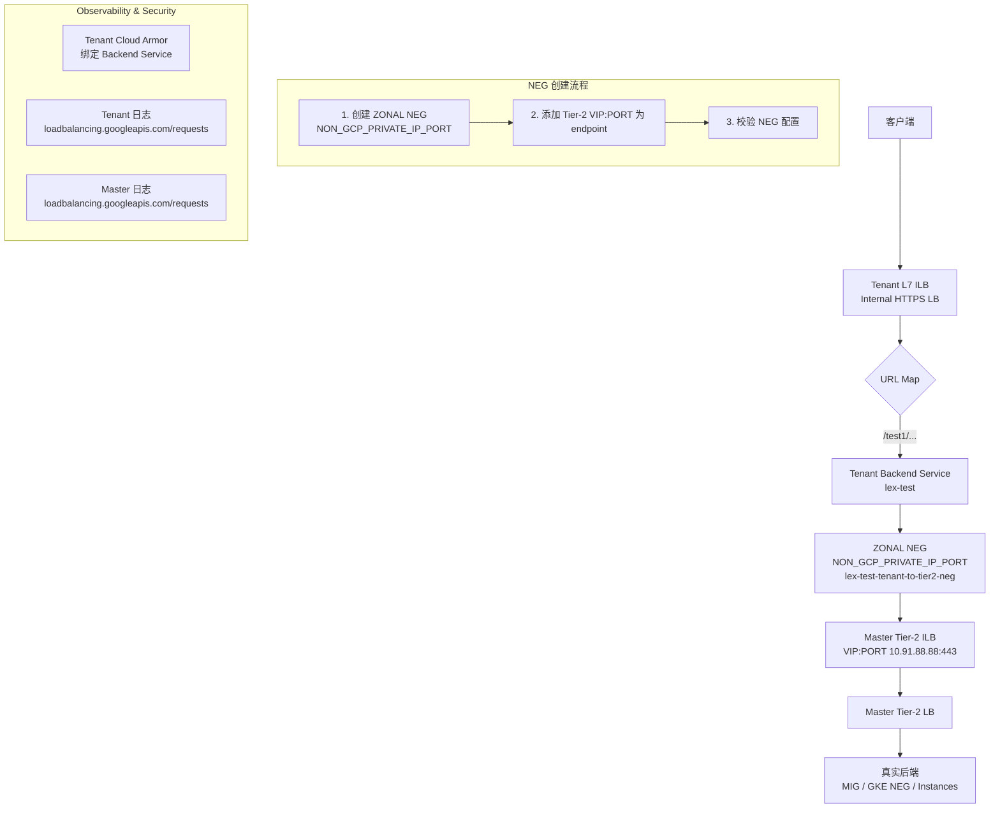

• 1 客户端 → Tenant（第一级）Internal HTTPS LB (L7 ILB，持有 VIP / 证书 / URL Map / Cloud Armor)，由 URL Map 把 /test1/ 等路径指向 Tenant Backend Service (例：lex-test)。
 Backend type
1 Zonal netwrork endpoint group ==> GCE && GKE backends
2  Internet network endpoint groupd ==> external backends
3 Private Service Connect network endpoint group 
4 Serverless netwrok endpoint group ==> Cloud Run
5 Hybird connectivity network endpoint group(Zonal) ==> Backends that are on-premise or on-other clouds via private connectivity 
• 2 Tenant Backend Service 的后端是 ZONAL NEG (类型为 NON_GCP_PRIVATE_IP_PORT，例如 lex-test-tenant-to-tier2-neg，由 create-neg.sh 创建)，NEG 中的 endpoint 为 Master 的 Tier-2 ILB VIP:PORT (例如 10.91.88.88:443)。

• 3 Tenant 的 HealthCheck 会探测 NEG 指向的 Tier-2 VIP，Tenant 将 Cloud Armor 策略绑定到 Tenant Backend Service (WAF 评估与日志归 Tenant)。

• 4 Tier-2 (Master，第三级) 接收流量并转发到真实后端 (MIG / GKE NEG / Instances)；Master 保有后端编排与（可选）Cloud Armor / 日志。

• 5 Observability：Tenant 与 Master 各自产生日志 (loadbalancing.googleapis.com/requests)，Cloud Armor 执行记录显示为 Tenant 侧被评估的 policy。
关键注意项 (PoC/生产)

• HealthCheck 与防火墙：Tenant HC 源必须能到达 Tier-2 VIP:PORT；Master 必须放行 HC 源。

• HA 建议：为每个 zone 创建 zonal NEG 并把所有 zonal NEGs 加到 Tenant 的 regional Backend Service，避免单区 NEG 单点故障。

• TLS 与源 IP：明确 Tier-1 是否终止 TLS (并对 Tier-2 选择 re-encrypt 或明文)，若依赖客户端真实 IP，需通过 X-Forwarded-For 传递。

• 权限与 Shared VPC：确保 Tenant 对 Shared VPC/subnet/NEG 的使用权限 (IAM) 到位。




```bash
#!/bin/bash
TENANT_PROJECT_ID="tennat-project"
ZONE="europe-west2-a"                  # 改为具体 zone
REGION="europe-west2"                   # 若后续需要 region 保留
NEG_NAME="lex-test-tenant-to-tier2-neg"
NETWORK="projects/project-shared-dev/global/networks/project-shared-dev-cinternal-vpc1"
SUBNET="projects/project-shared-dev/regions/europe-west2/subnetworks/cinternal-vpc1-europe-west2"
MASTER_TIER2_VIP="10.91.88.88"
MASTER_TIER2_PORT="443"

# 切换项目（可选）
gcloud config set project ${TENANT_PROJECT_ID}

# 1) 创建 NON_GCP_PRIVATE_IP_PORT 类型的 ZONAL NEG
gcloud compute network-endpoint-groups create ${NEG_NAME} \
  --project=${TENANT_PROJECT_ID} \
  --zone=${ZONE} \
  --network=${NETWORK} \
  --network-endpoint-type=NON_GCP_PRIVATE_IP_PORT

# 2) 将 Tier-2 的 VIP:port 加为 endpoint（使用 --zone）
gcloud compute network-endpoint-groups update ${NEG_NAME} \
  --project=${TENANT_PROJECT_ID} \
  --zone=${ZONE} \
  --add-endpoint="ip=${MASTER_TIER2_VIP},port=${MASTER_TIER2_PORT}"

# 3) 校验
gcloud compute network-endpoint-groups describe ${NEG_NAME} \
  --project=${TENANT_PROJECT_ID} --zone=${ZONE}
```


很好 👍
你现在这个架构已经不是“PSC 标准模式”，而是：

Tier-1 (Tenant ILB) → ZONAL NEG (NON_GCP_PRIVATE_IP_PORT) → Tier-2 ILB (Master)
也就是 LB-to-LB 私网级联模型

这是一种可行但“边界较多”的架构。
我帮你做一个概念级总结 + 风险评估。

⸻

一、你现在的架构本质

flowchart TD
    A["Client"] --> B["Tenant L7 ILB"]
    B --> C["Tenant Backend Service"]
    C --> D["ZONAL NEG (NON_GCP_PRIVATE_IP_PORT)"]
    D --> E["Master Tier-2 ILB VIP"]
    E --> F["Master Backend (GKE/MIG)"]

这不是 PSC Endpoint 模型。

而是：

用 NEG 把一个 Internal LB VIP 当作“外部私网服务”来接入。

等价理解：

Tenant LB 把 Master ILB 当作一个私有IP后端


⸻

二、这个模型和 PSC 的差异

维度	你当前 NEG 模型	PSC 模型
官方定位	可用但非推荐多租户模式	官方推荐 Producer/Consumer
安全隔离	网络级	服务级
IAM	无需跨项目 use 权限	无需跨项目 use 权限
扩展规模	受 NEG/HC 限制	受 PSC endpoint quota 限制
源 IP	会被 ILB 替换	统一由 PSC endpoint 控制
推荐度	⭐⭐⭐	⭐⭐⭐⭐⭐


⸻

三、域名问题在你当前架构里的定位

你现在：
	•	Tier-1 终止 TLS
	•	Tier-1 控制 URL Map
	•	Tier-2 只接收 HTTPS

因此：

Master 不需要公网域名

但：

⚠️ Master 仍然是 L7 ILB
⚠️ Host header 会被保留

所以：

Master 仍然可以基于 host/path 分流。

⸻

四、你当前架构的关键风险点

⸻

1️⃣ Health Check 风险

你现在：

Tenant HealthCheck → Master Tier-2 VIP

问题：
	•	如果 Master Tier-2 挂
	•	Tenant HC 会直接失败
	•	所有流量中断

而且：

每个 Tenant 都会独立发 HC。

100 Tenant = 100 组 HC。

⸻

2️⃣ 双层 ILB 放大延迟

你现在是：

Client → L7 ILB → L7 ILB → Backend

每层都会：
	•	TLS 处理
	•	Header 处理
	•	Proxy hop

延迟 ≈ +3~5ms

在高 QPS 情况下会放大。

⸻

3️⃣ NEG 类型 NON_GCP_PRIVATE_IP_PORT 的限制

这种 NEG：
	•	不感知 GKE
	•	不感知 MIG
	•	只是静态 IP:PORT

如果 Tier-2 VIP 变更：

需要重新 update NEG。

PSC 不会有这个问题。

⸻

4️⃣ 源 IP 问题

Tier-2 看到的 source IP：

不是客户端 IP。

而是：

Tier-1 ILB proxy IP。

如果你：
	•	未来做租户级限流
	•	或做审计

需要依赖：

X-Forwarded-For


⸻

五、规模分析（100+ Tenant）

⸻

当前 NEG 模型规模评估

假设：
	•	100 Tenant
	•	每个 3 个 zone
	•	每个 zone 1 个 NEG

= 300 NEG

默认 quota：

Zonal NEGs per project per region ≈ 50-100

可能需要提升。

⸻

Health Check 数量

每个 Backend Service 一个 HC。

100 Tenant = 100 HC。

默认 quota 也是有限的。

⸻

六、和 PSC 的规模对比

PSC：
	•	每个 Tenant 一个 Endpoint
	•	不需要 HC（Producer LB 自己负责）
	•	不需要 NEG per zone

架构更干净。

⸻

七、重要判断

你现在这个模型：

更像是“过渡架构”

而不是最终多租户架构。

⸻

八、概念级总结（关于域名）

在你当前架构里：

层	是否需要域名
Client → Tenant	必须
Tenant → Master	不需要公网域名
Master → Backend	Kubernetes service 名

域名完全属于 Tenant。

Master 只做流量接收。

⸻

九、如果改成 PSC 架构

结构会变成：

flowchart TD
    A["Client"] --> B["Tenant L7 ILB"]
    B --> C["PSC Endpoint"]
    C --> D["Service Attachment"]
    D --> E["Master Internal LB"]
    E --> F["Backend"]

好处：
	•	不需要 NEG
	•	不需要 Tenant HC
	•	不需要放开 HC FW
	•	Master 更干净
	•	隔离更强

⸻

十、关键回答你

你现在这个实现：

✅ 官方支持
✅ 可生产
⚠️ 不适合 500+ tenant 长期规模

PSC：

✅ 更适合平台级
✅ 更清晰
✅ 更标准

⸻

十一、你现在要做的决策

你要判断：
	1.	这是长期架构吗？
	2.	未来是否会 > 200 Tenant？
	3.	是否 multi-region？
	4.	是否未来要支持 mTLS？

如果答案是“是”：

建议迁移 PSC。

⸻

十二、最终一句话总结

你当前 NEG + ILB 级联模型：

是技术上可行的“LB-to-LB 代理模式”

PSC：

是 Google 官方设计的“私有服务消费模式”

对于多租户平台：

PSC 更合理。

⸻

如果你愿意，我可以下一步帮你：
	•	画一张 NEG vs PSC 的架构演进路线图
	•	或帮你推导 3 年容量规划
	•	或帮你算 100 / 300 / 1000 tenant 的 quota 规模模型