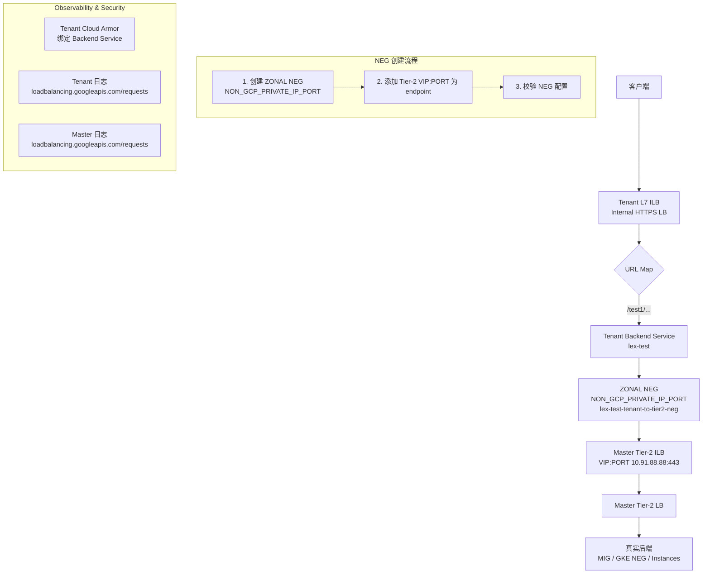

• 1 客户端 → Tenant（第一级）Internal HTTPS LB (L7 ILB，持有 VIP / 证书 / URL Map / Cloud Armor)，由 URL Map 把 /test1/ 等路径指向 Tenant Backend Service (例：lex-test)。

• 2 Tenant Backend Service 的后端是 ZONAL NEG (类型为 NON_GCP_PRIVATE_IP_PORT，例如 lex-test-tenant-to-tier2-neg，由 create-neg.sh 创建)，NEG 中的 endpoint 为 Master 的 Tier-2 ILB VIP:PORT (例如 10.98.47.253:443)。

• 3 Tenant 的 HealthCheck 会探测 NEG 指向的 Tier-2 VIP，Tenant 将 Cloud Armor 策略绑定到 Tenant Backend Service (WAF 评估与日志归 Tenant)。

• 4 Tier-2 (Master，第三级) 接收流量并转发到真实后端 (MIG / GKE NEG / Instances)；Master 保有后端编排与（可选）Cloud Armor / 日志。

• 5 Observability：Tenant 与 Master 各自产生日志 (loadbalancing.googleapis.com/requests)，Cloud Armor 执行记录显示为 Tenant 侧被评估的 policy。
关键注意项 (PoC/生产)

• HealthCheck 与防火墙：Tenant HC 源必须能到达 Tier-2 VIP:PORT；Master 必须放行 HC 源。

• HA 建议：为每个 zone 创建 zonal NEG 并把所有 zonal NEGs 加到 Tenant 的 regional Backend Service，避免单区 NEG 单点故障。

• TLS 与源 IP：明确 Tier-1 是否终止 TLS (并对 Tier-2 选择 re-encrypt 或明文)，若依赖客户端真实 IP，需通过 X-Forwarded-For 传递。

• 权限与 Shared VPC：确保 Tenant 对 Shared VPC/subnet/NEG 的使用权限 (IAM) 到位。




```bash
#!/bin/bash
TENANT_PROJECT_ID="tennat-project"
ZONE="europe-west2-a"                  # 改为具体 zone
REGION="europe-west2"                   # 若后续需要 region 保留
NEG_NAME="lex-test-tenant-to-tier2-neg"
NETWORK="projects/project-shared-dev/global/networks/project-shared-dev-cinternal-vpc1"
SUBNET="projects/project-shared-dev/regions/europe-west2/subnetworks/cinternal-vpc1-europe-west2"
MASTER_TIER2_VIP="10.91.88.88"
MASTER_TIER2_PORT="443"

# 切换项目（可选）
gcloud config set project ${TENANT_PROJECT_ID}

# 1) 创建 NON_GCP_PRIVATE_IP_PORT 类型的 ZONAL NEG
gcloud compute network-endpoint-groups create ${NEG_NAME} \
  --project=${TENANT_PROJECT_ID} \
  --zone=${ZONE} \
  --network=${NETWORK} \
  --network-endpoint-type=NON_GCP_PRIVATE_IP_PORT

# 2) 将 Tier-2 的 VIP:port 加为 endpoint（使用 --zone）
gcloud compute network-endpoint-groups update ${NEG_NAME} \
  --project=${TENANT_PROJECT_ID} \
  --zone=${ZONE} \
  --add-endpoint="ip=${MASTER_TIER2_VIP},port=${MASTER_TIER2_PORT}"

# 3) 校验
gcloud compute network-endpoint-groups describe ${NEG_NAME} \
  --project=${TENANT_PROJECT_ID} --zone=${ZONE}
```