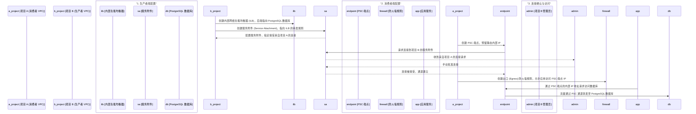

# 使用 Private Service Connect (PSC) 连接跨项目 VPC

本文档旨在详细阐述如何通过 Google Cloud 的 Private Service Connect (PSC) 功能，安全地将一个项目（消费者）内的服务连接到另一个项目（生产者）中托管的服务（例如 PostgreSQL 数据库）。我们将以项目 A 作为消费者，项目 B 作为生产者为例进行说明。

## 核心概念

在深入操作之前，我们首先需要理清生产者和消费者的关系：

1.  **生产者 (Producer):**
    *   在此场景中，即为您的 **项目 B**。
    *   这个项目托管了后端服务（例如 PostgreSQL 数据库）。
    *   生产者负责创建一个**服务附件 (Service Attachment)**，这是一个接入点，允许被授权的消费者项目访问其服务。

2.  **消费者 (Consumer):**
    *   在此场景中，即为您的 **项目 A**。
    *   这个项目希望访问生产者提供的服务。
    *   消费者通过创建一个指向生产者服务附件的 **PSC 端点 (Endpoint)**，将服务“引入”到自己的 VPC 网络中。这个端点在消费者 VPC 中会有一个内部 IP 地址。

## 架构与流程

整个设置过程可以通过下面的流程图来清晰地展示：



## 操作步骤详解

### 第 1 步：在生产者项目 (Project B) 中发布服务

首先，您需要在项目 B 中将您的 PostgreSQL 数据库通过内部负载均衡器暴露，并创建服务附件。

1.  **准备工作：创建内部网络负载均衡器 (ILB)**
    *   您的 PostgreSQL 数据库实例需要一个后端服务。通常，您可以将其放在一个实例组 (MIG) 中。
    *   创建一个内部网络负载均衡器，其转发规则指向该后端服务。记下这个**转发规则的名称**，后续步骤会用到。

2.  **创建服务附件 (Service Attachment)**
    *   服务附件将您的 ILB 发布出去，以便消费者可以连接。

    ```bash
    # 设置环境变量
    export PRODUCER_PROJECT_ID="<你的项目B_ID>"
    export REGION="<你的区域, e.g., asia-east1>"
    export SERVICE_ATTACHMENT_NAME="<服务附件名称, e.g., pg-prod-attachment>"
    export FWD_RULE_NAME="<ILB转发规则名称>"
    export NAT_SUBNET="<PSC专用NAT子网名称>"
    export CONSUMER_PROJECT_ID="<你的项目A_ID>"

    # 创建服务附件
    gcloud compute service-attachments create ${SERVICE_ATTACHMENT_NAME} \
        --project=${PRODUCER_PROJECT_ID} \
        --region=${REGION} \
        --producer-forwarding-rule=${FWD_RULE_NAME} \
        --connection-preference=ACCEPT_MANUAL \
        --nat-subnets=${NAT_SUBNET} \
        --consumer-accept-list="${CONSUMER_PROJECT_ID}=10"
    ```

    **参数解释:**
    *   `--connection-preference=ACCEPT_MANUAL`: 强制要求手动批准每一个来自消费者的连接请求，增强安全性。
    *   `--consumer-accept-list`: 定义了哪些项目 ID 被允许连接，以及每个项目的连接数限制。
    *   `--nat-subnets`: 指定一个专用于 PSC NAT 的子网。

### 第 2 步：在消费者项目 (Project A) 中创建端点

现在，切换到项目 A，创建一个 PSC 端点来连接项目 B 中发布的服务。

1.  **为端点预留静态 IP 地址**
    *   这个 IP 地址将成为您在项目 A 的 VPC 中访问 PostgreSQL 服务的入口。

    ```bash
    # 设置环境变量
    export CONSUMER_PROJECT_ID="<你的项目A_ID>"
    export REGION="<你的区域, e.g., asia-east1>"
    export ADDR_NAME="<端点IP地址名称, e.g., pg-endpoint-ip>"
    export SUBNET="<项目A中的子网>"

    # 创建静态IP地址
    gcloud compute addresses create ${ADDR_NAME} \
        --project=${CONSUMER_PROJECT_ID} \
        --region=${REGION} \
        --subnet=${SUBNET}
    ```

2.  **创建 PSC 端点 (转发规则)**
    *   这个端点会指向项目 B 的服务附件。

    ```bash
    # 设置环境变量
    export FWD_RULE_NAME="<端点转发规则名称, e.g., pg-psc-endpoint>"
    export SERVICE_ATTACHMENT_URI="<项目B服务附件的URI>" 
    # URI 格式: projects/PRODUCER_PROJECT_ID/regions/REGION/serviceAttachments/SERVICE_ATTACHMENT_NAME

    # 创建端点
    gcloud compute forwarding-rules create ${FWD_RULE_NAME} \
        --project=${CONSUMER_PROJECT_ID} \
        --region=${REGION} \
        --network=<项目A的VPC网络名称> \
        --address=${ADDR_NAME} \
        --target-service-attachment=${SERVICE_ATTACHMENT_URI}
    ```

### 第 3 步：批准连接并配置防火墙

1.  **批准连接 (在项目 B 中操作)**
    *   进入 Google Cloud Console，导航到 "网络服务" -> "Private Service Connect" -> "已发布的服务"。
    *   选择您创建的服务附件，您会看到一个来自项目 A 的待处理连接请求。
    *   点击并**接受**该连接。

2.  **创建出口防火墙规则 (在项目 A 中操作)**
    *   为了允许项目 A 中的应用（如 GKE Pod 或 VM）能够访问 PSC 端点，您需要创建一条出口防火墙规则。

    ```bash
    # 设置环境变量
    export FIREWALL_RULE_NAME="<防火墙规则名称, e.g., allow-egress-to-pg-psc>"
    export PSC_ENDPOINT_IP=$(gcloud compute addresses describe ${ADDR_NAME} --project=${CONSUMER_PROJECT_ID} --region=${REGION} --format="value(address)")
    export POSTGRES_PORT="5432" # PostgreSQL 默认端口

    # 创建防火墙规则
    gcloud compute firewall-rules create ${FIREWALL_RULE_NAME} \
        --project=${CONSUMER_PROJECT_ID} \
        --network=<项目A的VPC网络名称> \
        --direction=EGRESS \
        --destination-ranges=${PSC_ENDPOINT_IP}/32 \
        --action=ALLOW \
        --rules=tcp:${POSTGRES_PORT}
    ```

## 服务请求与连接

完成以上所有步骤后，您在项目 A 中的任何应用服务，都可以通过刚刚创建的 PSC 端点 IP (`${PSC_ENDPOINT_IP}`) 和 PostgreSQL 端口 (`5432`) 来连接位于项目 B 中的数据库。

例如，数据库连接字符串中的 `HOST` 或 `SERVER` 地址应填写为 `${PSC_ENDPOINT_IP}`。所有网络流量都将通过 Google Cloud 的骨干网络在两个 VPC 之间私密、安全地传输，完全不暴露于公网。

## 验证与检查

为了确保整个链路正常工作，您可以执行以下检查：

| 验证项                     | 操作位置 | 检查内容                                                                                             |
| -------------------------- | -------- | ---------------------------------------------------------------------------------------------------- |
| **服务附件状态**           | 项目 B   | 在 PSC 控制台检查服务附件状态，确保它已连接到来自项目 A 的端点。                                     |
| **端点状态**               | 项目 A   | 在 PSC 控制台检查端点状态，确保其连接状态为 `ACCEPTED`。                                             |
| **网络连通性**             | 项目 A   | 从项目 A 的一台虚拟机中，使用 `nc` 或 `telnet` 命令测试到 PSC 端点 IP 和端口的连通性。 `nc -vz ${PSC_ENDPOINT_IP} 5432` |
| **数据库连接**             | 项目 A   | 使用数据库客户端（如 `psql`）尝试直接通过 PSC 端点 IP 连接数据库。                                     |
| **防火墙日志**             | 项目 A   | 如果连接失败，检查防火墙日志，确认出口规则是否正确匹配和放行了流量。
