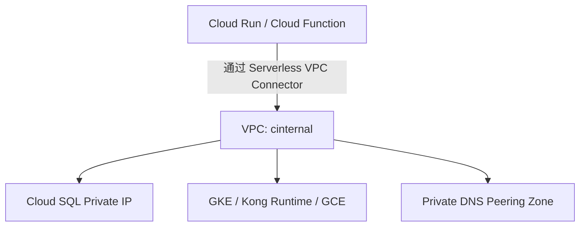

这段 Terraform 配置展示了你在 **GCP 网络层面**所做的一项重要调整。下面我将帮你逐项分析这段配置到底在做什么，以及它对你的 **API 平台架构** 可能带来的影响。

---

## **🧩 一、配置整体含义**

  

这段配置定义了一个 **内部安全区（security zone: cinternal）** 的 **VPC 网络**，用于支撑 “API Platform Core Part”。

它包含了以下几个核心网络特性：

|**配置项**|**含义**|**作用说明**|
|---|---|---|
|security_zone = "cinternal"|表示这是内部核心区域（Core Internal Zone）|一般用于部署内部服务（如 Kong Runtime、数据库、Pub/Sub 消费者等）|
|description = "VPC for api platform core part"|网络描述|帮助区分不同业务域的 VPC|
|cloudsql_private_service_access = true|启用 **Private Service Access (PSA)**|允许 VPC 与 Google 托管服务（如 Cloud SQL、AI、BigQuery）通过内部 IP 通信|
|psa_export_custom_routes = true|将自定义路由导出到 PSA 网络|使 Cloud SQL 等服务可以访问该 VPC 内的自定义子网或对等网络|
|psa_dns_peering = true|启用 DNS 对等解析|让 PSA 服务（如 Cloud SQL 内部域名）在该 VPC 内可直接解析，无需外部 DNS|
|serverless_vpc_access_connector|定义了一个 **Serverless VPC Access Connector**|用于让 Cloud Run、Cloud Functions、Cloud Composer 等 Serverless 服务访问该 VPC 内资源|

---

## **🧠 二、Serverless VPC Access Connector 详解**

  

你配置的部分：

```
"serverless_vpc_access_connector": [
  {
    region           = "asia-east2"
    ip_cidr_range    = "192.168.227.0/28"
    machine_type     = "f1-micro"
    min_instances    = 2
    max_instances    = 3
  }
]
```

这表示你在 asia-east2 区域创建了一个 **Serverless VPC Access Connector**，其作用是：

  

> 让 Cloud Run / Cloud Functions / Cloud Composer / App Engine 等 Serverless 服务

> 可以通过内部网络访问 VPC 资源（例如 GCE、GKE、Cloud SQL 私有IP）。

|**参数**|**说明**|
|---|---|
|region|Connector 部署的区域（必须与 Serverless 服务在同一区域）|
|ip_cidr_range|Connector 在 VPC 中使用的内部子网地址范围|
|machine_type|Connector 实例类型，f1-micro 表示轻量低成本连接器|
|min_instances / max_instances|自动伸缩范围，用于根据负载调节并发连接能力|

---

## **🕸️ 三、整体网络拓扑（逻辑示意）**



此架构让 Serverless 工作负载能安全地访问内部系统，避免走公网。

---

## **⚙️ 四、实际作用总结**

|**分类**|**影响/作用**|
|---|---|
|🔒 安全性|所有 Serverless 与内部服务通信走 VPC 内网（非公网）|
|🌐 网络连通性|通过 Private Service Access 与 Cloud SQL、AI、BigQuery 建立内网连接|
|📡 DNS 解析|通过 psa_dns_peering 确保内网域名解析到正确的私有地址|
|🔁 路由传播|通过 psa_export_custom_routes 让 PSA 服务也能识别自定义子网或对等网络|
|⚡ 弹性连接|serverless_vpc_access_connector 确保在不同负载下自动伸缩连接能力|

---

## **⚠️ 五、注意事项与最佳实践**

1. **Connector CIDR 范围不可重叠**
    
    确保 192.168.227.0/28 不与现有 VPC 子网冲突。
    
2. **区域一致性**
    
    Serverless 服务必须部署在相同区域（asia-east2），否则无法连通。
    
3. **性能与成本平衡**
    
    f1-micro 成本低，但连接性能有限，若后续访问量高，可升级为 e2-micro。
    
4. **DNS Peering 校验**
    
    可通过以下命令验证 Cloud SQL 等服务域名是否解析为私网 IP：
    

```
dig sql-instance-name.private.googleapis.com
```

4.   
    
5. **确保路由正确传播**
    
    若 Cloud SQL 无法连通，可检查：
    

```
gcloud compute networks subnets describe <subnet-name> --region=asia-east2
gcloud compute networks peerings list --network=<vpc-name>
```

  

---

如果你愿意，我可以帮你画出该 Terraform 配置在 **VPC、PSA、Serverless、DNS Peering** 之间的完整拓扑图（带流量方向与端点示意），便于文档化或团队内部讲解。

是否需要我为你生成这张拓扑图？