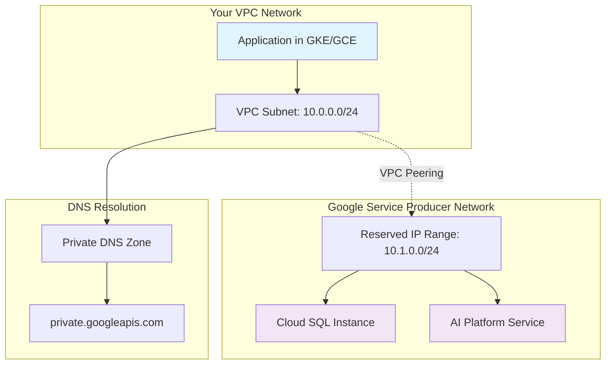
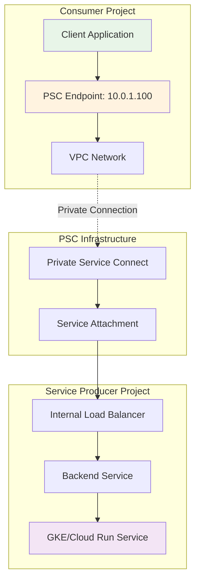
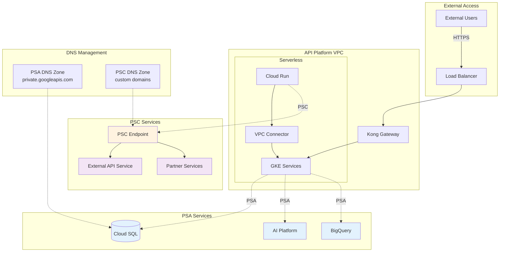

# GCP 私有网络连接：PSA 与 PSC 完整指南

在 Google Cloud Platform 中，**Private Service Access (PSA)** 和 **Private Service Connect (PSC)** 是两种不同的私有网络连接机制。本文档将详细解释两者的区别、使用场景，并提供完整的架构设计指南。

## 📋 目录

1. [核心概念对比](#核心概念对比)
2. [PSA 详细解析](#psa-详细解析)
3. [PSC 详细解析](#psc-详细解析)
4. [架构设计模式](#架构设计模式)
5. [实施配置指南](#实施配置指南)
6. [最佳实践建议](#最佳实践建议)

---

## 核心概念对比

### 基本定义

**Private Service Access (PSA)**
- 用于连接 Google 托管服务（如 Cloud SQL、AI Platform、Memorystore）
- 基于 VPC Peering 技术实现
- 提供对 Google 内部服务的私有网络访问

**Private Service Connect (PSC)**
- 用于连接自定义服务或第三方服务
- 基于 Private Endpoint 技术实现
- 支持跨项目、跨组织的私有服务访问

### 详细对比表

| 特性 | PSA | PSC |
|------|-----|-----|
| **主要用途** | 访问 Google 托管服务 | 访问自建/第三方服务 |
| **底层技术** | VPC Peering + DNS Peering | Private Endpoint + Internal Load Balancer |
| **网络模型** | 共享路由空间 | 独立路由，完全隔离 |
| **支持服务** | Cloud SQL, AI Platform, BigQuery, Memorystore | GKE, Cloud Run, API Gateway, 自定义服务 |
| **跨项目支持** | 有限支持 | 完全支持 |
| **安全隔离** | 中等（共享路由） | 高（完全隔离） |
| **DNS 管理** | private.googleapis.com | 自定义域名或自动生成 |
| **计费模式** | 免费（仅 VPC Peering 成本） | 按带宽和连接数计费 |
| **配置复杂度** | 简单 | 中等 |

---

## PSA 详细解析

### PSA 工作原理



### PSA 连接流程

1. **IP 地址分配**
   - 在 VPC 中预留 IP 地址范围（如 10.1.0.0/24）
   - Google 在此范围内分配服务实例 IP

2. **VPC Peering 建立**
   - 创建 VPC 与 Google 服务网络的对等连接
   - 启用路由交换和 DNS 解析

3. **DNS 配置**
   - 启用 private.googleapis.com DNS 区域
   - 将 Google 服务域名解析到私有 IP

4. **服务访问**
   - 应用通过私有 IP 直接访问 Google 服务
   - 流量完全在内网传输

### PSA 使用场景

- **Cloud SQL 私有连接**：数据库实例仅通过内网访问
- **AI Platform 服务**：机器学习模型推理和训练
- **Memorystore**：Redis/Memcached 缓存服务
- **BigQuery**：大数据分析服务的私有访问

---

## PSC 详细解析

### PSC 工作原理



### PSC 连接类型

#### 1. PSC for Google APIs
- 访问 Google Cloud APIs（如 Storage、Compute）
- 通过私有端点访问公共 Google 服务
- 无需公网连接

#### 2. PSC for Published Services
- 访问第三方发布的服务
- 跨组织的私有服务连接
- 服务市场中的合作伙伴服务

#### 3. PSC for Service Producers
- 发布自己的服务供他人访问
- 创建服务附件（Service Attachment）
- 控制访问权限和连接审批

### PSC 实施步骤

1. **服务端配置**
   ```bash
   # 创建内部负载均衡器
   gcloud compute forwarding-rules create my-ilb \
     --load-balancing-scheme=INTERNAL \
     --backend-service=my-backend-service
   
   # 创建服务附件
   gcloud compute service-attachments create my-service-attachment \
     --producer-forwarding-rule=my-ilb \
     --connection-preference=ACCEPT_AUTOMATIC
   ```

2. **客户端配置**
   ```bash
   # 创建 PSC 端点
   gcloud compute forwarding-rules create my-psc-endpoint \
     --load-balancing-scheme="" \
     --target-service-attachment=projects/SERVICE_PROJECT/regions/REGION/serviceAttachments/my-service-attachment
   ```

---

## 架构设计模式

### 混合架构模式

在实际项目中，PSA 和 PSC 通常会同时使用，形成混合架构：



### 网络流量路径

#### PSA 流量路径
```
Application → VPC Subnet → VPC Peering → Google Service Network → Cloud SQL
```

#### PSC 流量路径
```
Application → VPC Subnet → PSC Endpoint → Private Connection → Service Producer → Target Service
```

---

## 实施配置指南

### PSA 配置示例

#### Terraform 配置
```hcl
# 预留 IP 地址范围
resource "google_compute_global_address" "private_service_access" {
  name          = "private-service-access"
  purpose       = "VPC_PEERING"
  address_type  = "INTERNAL"
  prefix_length = 24
  network       = google_compute_network.vpc.id
}

# 创建私有服务连接
resource "google_service_networking_connection" "private_vpc_connection" {
  network                 = google_compute_network.vpc.id
  service                 = "servicenetworking.googleapis.com"
  reserved_peering_ranges = [google_compute_global_address.private_service_access.name]
}

# Cloud SQL 实例配置
resource "google_sql_database_instance" "main" {
  name             = "main-instance"
  database_version = "POSTGRES_13"
  region           = "asia-east2"

  settings {
    tier = "db-f1-micro"
    
    ip_configuration {
      ipv4_enabled    = false
      private_network = google_compute_network.vpc.id
    }
  }

  depends_on = [google_service_networking_connection.private_vpc_connection]
}
```

### PSC 配置示例

#### 服务提供方配置
```hcl
# 内部负载均衡器
resource "google_compute_forwarding_rule" "internal_lb" {
  name                  = "internal-lb"
  load_balancing_scheme = "INTERNAL"
  backend_service       = google_compute_region_backend_service.backend.id
  all_ports             = true
  network               = google_compute_network.vpc.id
  subnetwork           = google_compute_subnetwork.subnet.id
}

# 服务附件
resource "google_compute_service_attachment" "psc_service" {
  name        = "psc-service-attachment"
  description = "PSC service attachment for API platform"
  
  target_service          = google_compute_forwarding_rule.internal_lb.id
  connection_preference   = "ACCEPT_AUTOMATIC"
  nat_subnets            = [google_compute_subnetwork.psc_nat.id]
  
  consumer_reject_lists = ["PROJECT_ID_TO_REJECT"]
  consumer_accept_lists {
    project_id_or_num = "ALLOWED_PROJECT_ID"
    connection_limit  = 10
  }
}
```

#### 服务消费方配置
```hcl
# PSC 端点
resource "google_compute_forwarding_rule" "psc_endpoint" {
  name   = "psc-endpoint"
  region = "asia-east2"
  
  load_balancing_scheme = ""
  target                = "projects/SERVICE_PROJECT/regions/asia-east2/serviceAttachments/psc-service-attachment"
  network               = google_compute_network.consumer_vpc.id
  subnetwork           = google_compute_subnetwork.consumer_subnet.id
}

# DNS 记录
resource "google_dns_record_set" "psc_dns" {
  name = "api.internal.example.com."
  type = "A"
  ttl  = 300

  managed_zone = google_dns_managed_zone.private_zone.name
  rrdatas      = [google_compute_forwarding_rule.psc_endpoint.ip_address]
}
```

---

## 最佳实践建议

### PSA 最佳实践

1. **IP 地址规划**
   - 预留足够大的 IP 地址范围（建议 /24 或更大）
   - 避免与现有子网 CIDR 冲突
   - 考虑未来扩展需求

2. **DNS 配置**
   - 启用 `psa_dns_peering` 确保域名解析
   - 使用 `private.googleapis.com` 域名访问服务
   - 配置适当的 DNS 转发规则

3. **安全控制**
   - 使用 VPC Service Controls 限制数据访问
   - 配置适当的防火墙规则
   - 启用审计日志记录

### PSC 最佳实践

1. **服务设计**
   - 使用内部负载均衡器提高可用性
   - 实施健康检查确保服务质量
   - 配置适当的后端服务池

2. **访问控制**
   - 使用白名单控制消费者访问
   - 设置连接数限制防止滥用
   - 实施审批流程管理连接请求

3. **监控和运维**
   - 配置 Cloud Monitoring 监控连接状态
   - 设置告警通知异常情况
   - 定期审查访问权限和使用情况

### 混合架构建议

1. **服务分类**
   - Google 托管服务使用 PSA
   - 自定义服务使用 PSC
   - 第三方服务优先考虑 PSC

2. **网络设计**
   - 合理规划 IP 地址空间
   - 避免路由冲突
   - 实施分层 DNS 管理

3. **成本优化**
   - PSA 免费，优先使用
   - PSC 按使用量计费，合理规划
   - 定期评估和优化连接配置

---

## 故障排除指南

### 常见问题

1. **PSA 连接失败**
   - 检查 IP 地址范围是否冲突
   - 验证 VPC Peering 状态
   - 确认 DNS 配置正确

2. **PSC 连接超时**
   - 检查服务附件状态
   - 验证防火墙规则
   - 确认后端服务健康状态

3. **DNS 解析问题**
   - 检查 DNS 区域配置
   - 验证记录类型和值
   - 测试 DNS 查询响应

### 调试命令

```bash
# 检查 PSA 连接状态
gcloud services vpc-peerings list --network=VPC_NAME

# 查看 PSC 端点信息
gcloud compute forwarding-rules describe PSC_ENDPOINT_NAME --region=REGION

# 测试 DNS 解析
nslookup SERVICE_DOMAIN_NAME
dig SERVICE_DOMAIN_NAME

# 检查网络连通性
gcloud compute ssh INSTANCE_NAME --command="curl -v http://SERVICE_IP:PORT"
```

---

## 总结

PSA 和 PSC 是 GCP 中两种重要的私有网络连接机制，各有其适用场景：

- **PSA** 适合访问 Google 托管服务，配置简单，成本较低
- **PSC** 适合自定义服务和跨项目访问，安全性更高，功能更灵活

在实际项目中，通常需要结合使用两种机制，构建完整的私有网络架构。通过合理的规划和配置，可以实现安全、高效、可扩展的云网络解决方案。