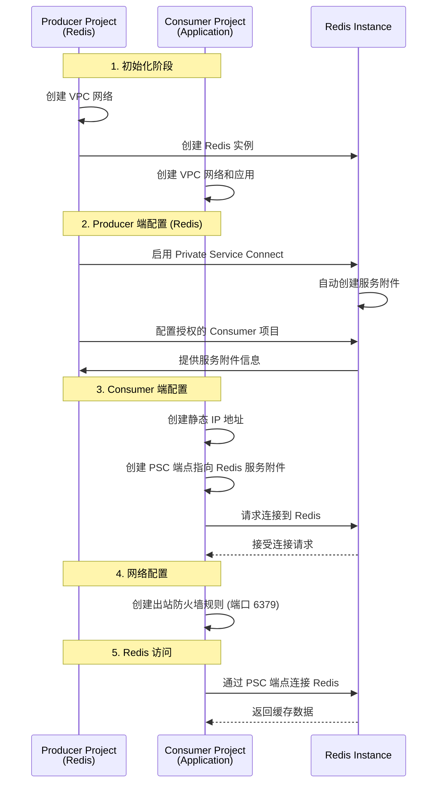

# Google Cloud Private Service Connect (PSC) 实施指南 - Redis 场景

## 概述

Private Service Connect (PSC) 是 Google Cloud 的一项网络功能，允许消费者在其 VPC 网络内部私密地访问托管服务。在您的场景中，Producer 项目托管 Redis 实例，Consumer 项目通过 PSC 私密访问这个缓存服务，流量完全保留在 Google Cloud 内部。

## 典型使用场景

**Producer 项目（Redis 提供者）：**

- 托管 Cloud Memorystore for Redis 实例
- 通过 PSC 向其他项目提供 Redis 访问
- 控制哪些项目可以连接到 Redis

**Consumer 项目（应用项目）：**

- 运行需要访问 Redis 缓存的应用程序
- 通过 PSC 端点连接到 Producer 项目的 Redis
- 使用内部 IP 地址访问 Redis，无需公网连接

## 核心概念

### Producer (Redis 提供者)

- 托管 Cloud Memorystore for Redis 实例的项目
- 为 Redis 配置 Private Service Connect
- 控制哪些 Consumer 项目可以访问 Redis
- Redis 自动提供 PSC 服务附件

### Consumer (应用项目)

- 运行应用程序的项目
- 创建 PSC 端点连接到 Redis
- 通过内部 IP 地址连接 Redis
- 配置防火墙规则允许 Redis 连接

## 架构流程图



## 快速开始 - Redis PSC 连接

### 简化步骤概览

1. **Producer 项目**：创建 Redis 实例并启用 PSC
2. **Consumer 项目**：创建 PSC 端点连接到 Redis
3. **应用程序**：使用 PSC 端点 IP 连接 Redis

### 核心命令速览

```bash
# Producer: 创建 Redis 并启用 PSC
gcloud redis instances create my-redis-instance \
    --size=1 \
    --region=asia-east2 \
    --network=producer-vpc \
    --redis-version=redis_6_x

gcloud redis instances update my-redis-instance \
    --region=asia-east2 \
    --enable-private-service-connect \
    --psc-allowed-consumer-projects=consumer-project-id

# Consumer: 创建 PSC 端点
gcloud compute addresses create redis-psc-ip \
    --region=asia-east2 \
    --subnet=consumer-subnet

gcloud compute forwarding-rules create redis-psc-endpoint \
    --region=asia-east2 \
    --network=consumer-vpc \
    --address=redis-psc-ip \
    --target-service-attachment=<REDIS_SERVICE_ATTACHMENT_LINK>

# 应用程序使用 PSC 端点 IP 连接 Redis
redis-cli -h <PSC_ENDPOINT_IP> -p 6379
```

## 详细实施步骤

### 前置条件

1. 启用必要的 API

```bash
# Producer 项目
gcloud services enable compute.googleapis.com --project=${PRODUCER_PROJECT_ID}
gcloud services enable redis.googleapis.com --project=${PRODUCER_PROJECT_ID}

# Consumer 项目
gcloud services enable compute.googleapis.com --project=${CONSUMER_PROJECT_ID}
gcloud services enable privateconnect.googleapis.com --project=${CONSUMER_PROJECT_ID}
```

2. 设置环境变量

```bash
# 通用变量
export REGION=asia-east2
export ZONE=asia-east2-a

# Producer 项目变量（Redis）
export PRODUCER_PROJECT_ID=your-producer-project
export PRODUCER_VPC=producer-vpc
export REDIS_INSTANCE_NAME=my-redis-instance
export REDIS_VERSION=redis_6_x
export REDIS_SIZE=1
export REDIS_AUTH_ENABLED=true

# Consumer 项目变量
export CONSUMER_PROJECT_ID=your-consumer-project
export CONSUMER_VPC=consumer-vpc
export CONSUMER_SUBNET=consumer-subnet
export PSC_ENDPOINT_NAME=redis-psc-endpoint
export STATIC_IP_NAME=redis-psc-ip
export REDIS_PORT=6379
```

### 第一阶段：Producer 项目配置（Redis）

#### 1. 创建 VPC 网络

```bash
# 创建 Producer VPC（如果还没有）
gcloud compute networks create ${PRODUCER_VPC} \
    --project=${PRODUCER_PROJECT_ID} \
    --subnet-mode=custom

# 创建 Redis 子网
gcloud compute networks subnets create redis-subnet \
    --project=${PRODUCER_PROJECT_ID} \
    --network=${PRODUCER_VPC} \
    --range=10.0.1.0/24 \
    --region=${REGION}

# 为 Redis 创建私有 IP 范围
gcloud compute addresses create google-managed-services-${PRODUCER_VPC} \
    --project=${PRODUCER_PROJECT_ID} \
    --global \
    --purpose=VPC_PEERING \
    --prefix-length=16 \
    --network=${PRODUCER_VPC}

# 创建私有连接
gcloud services vpc-peerings connect \
    --project=${PRODUCER_PROJECT_ID} \
    --service=servicenetworking.googleapis.com \
    --ranges=google-managed-services-${PRODUCER_VPC} \
    --network=${PRODUCER_VPC}
```

#### 2. 创建 Redis 实例

```bash
# 创建 Redis 实例
gcloud redis instances create ${REDIS_INSTANCE_NAME} \
    --project=${PRODUCER_PROJECT_ID} \
    --size=${REDIS_SIZE} \
    --region=${REGION} \
    --network=${PRODUCER_VPC} \
    --redis-version=${REDIS_VERSION} \
    --auth-enabled

# 等待实例创建完成
gcloud redis instances describe ${REDIS_INSTANCE_NAME} \
    --project=${PRODUCER_PROJECT_ID} \
    --region=${REGION}
```

#### 3. 启用 Redis 的 Private Service Connect

```bash
# 为 Redis 实例启用 PSC
gcloud redis instances update ${REDIS_INSTANCE_NAME} \
    --project=${PRODUCER_PROJECT_ID} \
    --region=${REGION} \
    --enable-private-service-connect \
    --psc-allowed-consumer-projects=${CONSUMER_PROJECT_ID}

# 获取 Redis 的服务附件信息
gcloud redis instances describe ${REDIS_INSTANCE_NAME} \
    --project=${PRODUCER_PROJECT_ID} \
    --region=${REGION} \
    --format="value(pscServiceAttachmentLink)"

# 将服务附件链接保存到变量中
export REDIS_SERVICE_ATTACHMENT=$(gcloud redis instances describe ${REDIS_INSTANCE_NAME} \
    --project=${PRODUCER_PROJECT_ID} \
    --region=${REGION} \
    --format="value(pscServiceAttachmentLink)")

echo "Redis Service Attachment: ${REDIS_SERVICE_ATTACHMENT}"
```

#### 4. 验证 Redis PSC 配置

```bash
# 检查 Redis 实例的 PSC 状态
gcloud redis instances describe ${REDIS_INSTANCE_NAME} \
    --project=${PRODUCER_PROJECT_ID} \
    --region=${REGION} \
    --format="table(
        name,
        state,
        host:label=REDIS_HOST,
        port:label=REDIS_PORT,
        pscServiceAttachmentLink:label=PSC_SERVICE_ATTACHMENT
    )"

# 验证授权的项目列表
gcloud redis instances describe ${REDIS_INSTANCE_NAME} \
    --project=${PRODUCER_PROJECT_ID} \
    --region=${REGION} \
    --format="value(pscConfig.allowedConsumerProjects[])"
```

### 第二阶段：Consumer 项目配置

#### 1. 创建 VPC 网络和子网

```bash
# 创建 Consumer VPC
gcloud compute networks create ${CONSUMER_VPC} \
    --project=${CONSUMER_PROJECT_ID} \
    --subnet-mode=custom

# 创建应用子网
gcloud compute networks subnets create ${CONSUMER_SUBNET} \
    --project=${CONSUMER_PROJECT_ID} \
    --network=${CONSUMER_VPC} \
    --range=10.1.1.0/24 \
    --region=${REGION}
```

#### 2. 创建静态 IP 地址

```bash
# 创建静态内部 IP 地址
gcloud compute addresses create ${STATIC_IP_NAME} \
    --project=${CONSUMER_PROJECT_ID} \
    --region=${REGION} \
    --subnet=${CONSUMER_SUBNET}

# 获取分配的 IP 地址
export PSC_ENDPOINT_IP=$(gcloud compute addresses describe ${STATIC_IP_NAME} \
    --project=${CONSUMER_PROJECT_ID} \
    --region=${REGION} \
    --format="value(address)")

echo "PSC Endpoint IP: ${PSC_ENDPOINT_IP}"
```

#### 3. 创建 PSC 端点连接到 Redis

```bash
# 使用从 Producer 项目获取的服务附件链接
export TARGET_SERVICE_ATTACHMENT=${REDIS_SERVICE_ATTACHMENT}

# 创建 PSC 端点连接到 Redis
gcloud compute forwarding-rules create ${PSC_ENDPOINT_NAME} \
    --project=${CONSUMER_PROJECT_ID} \
    --region=${REGION} \
    --network=${CONSUMER_VPC} \
    --address=${STATIC_IP_NAME} \
    --target-service-attachment=${TARGET_SERVICE_ATTACHMENT} \
    --allow-psc-global-access

# 验证端点创建
gcloud compute forwarding-rules describe ${PSC_ENDPOINT_NAME} \
    --project=${CONSUMER_PROJECT_ID} \
    --region=${REGION}

# 获取 PSC 端点的 IP 地址（用于 Redis 连接）
export REDIS_PSC_IP=$(gcloud compute forwarding-rules describe ${PSC_ENDPOINT_NAME} \
    --project=${CONSUMER_PROJECT_ID} \
    --region=${REGION} \
    --format="value(IPAddress)")

echo "Redis PSC Endpoint IP: ${REDIS_PSC_IP}"
```

#### 4. 创建 Redis 访问防火墙规则

```bash
# 创建允许访问 Redis 的出站规则（端口 6379）
gcloud compute firewall-rules create allow-redis-psc-egress \
    --project=${CONSUMER_PROJECT_ID} \
    --network=${CONSUMER_VPC} \
    --direction=EGRESS \
    --destination-ranges=${REDIS_PSC_IP}/32 \
    --action=ALLOW \
    --rules=tcp:${REDIS_PORT}

# 创建允许内部通信的规则
gcloud compute firewall-rules create allow-internal \
    --project=${CONSUMER_PROJECT_ID} \
    --network=${CONSUMER_VPC} \
    --direction=INGRESS \
    --source-ranges=10.1.1.0/24 \
    --action=ALLOW \
    --rules=tcp,udp,icmp
```

## 验证和测试

### 1. 创建测试虚拟机

```bash
# 在 Consumer 项目中创建测试 VM
gcloud compute instances create test-vm \
    --project=${CONSUMER_PROJECT_ID} \
    --zone=${ZONE} \
    --machine-type=e2-micro \
    --subnet=${CONSUMER_SUBNET} \
    --no-address \
    --image-family=ubuntu-2004-lts \
    --image-project=ubuntu-os-cloud
```

### 2. Redis 连接测试

```bash
# SSH 到测试 VM
gcloud compute ssh test-vm \
    --project=${CONSUMER_PROJECT_ID} \
    --zone=${ZONE}

# 在 VM 内执行测试
# 测试网络连通性
ping -c 4 ${REDIS_PSC_IP}

# 测试 Redis 端口连接
nc -zv ${REDIS_PSC_IP} ${REDIS_PORT}

# 安装 Redis 客户端
sudo apt-get update && sudo apt-get install -y redis-tools

# 获取 Redis AUTH 密码（如果启用了认证）
export REDIS_AUTH_STRING=$(gcloud redis instances describe ${REDIS_INSTANCE_NAME} \
    --project=${PRODUCER_PROJECT_ID} \
    --region=${REGION} \
    --format="value(authString)")

# 测试 Redis 连接
redis-cli -h ${REDIS_PSC_IP} -p ${REDIS_PORT} -a ${REDIS_AUTH_STRING} ping

# 测试基本 Redis 操作
redis-cli -h ${REDIS_PSC_IP} -p ${REDIS_PORT} -a ${REDIS_AUTH_STRING} <<EOF
SET test_key "PSC Redis Test"
GET test_key
KEYS *
INFO server
EOF
```

### 3. 应用程序连接示例

#### Python 应用连接示例

```python
import redis
import os

def connect_to_redis():
    try:
        # 使用 PSC 端点 IP 连接 Redis
        r = redis.Redis(
            host='${REDIS_PSC_IP}',  # PSC 端点 IP
            port=6379,
            password='${REDIS_AUTH_STRING}',  # Redis 认证密码
            decode_responses=True
        )

        # 测试连接
        if r.ping():
            print("Connected to Redis via PSC!")

            # 执行基本操作
            r.set('psc_test', 'Hello from PSC!')
            value = r.get('psc_test')
            print(f"Retrieved value: {value}")

            # 设置带过期时间的键
            r.setex('temp_key', 60, 'This will expire in 60 seconds')
            
            # 获取 Redis 信息
            info = r.info('server')
            print(f"Redis version: {info['redis_version']}")

    except redis.ConnectionError as e:
        print(f"Error connecting to Redis: {e}")
    except Exception as e:
        print(f"Unexpected error: {e}")

if __name__ == "__main__":
    connect_to_redis()
```

#### Java 应用连接示例

```java
import redis.clients.jedis.Jedis;
import redis.clients.jedis.JedisPool;
import redis.clients.jedis.JedisPoolConfig;

public class RedisConnection {
    private static final String REDIS_HOST = "${REDIS_PSC_IP}";
    private static final int REDIS_PORT = 6379;
    private static final String REDIS_PASSWORD = "${REDIS_AUTH_STRING}";

    public static void main(String[] args) {
        JedisPoolConfig poolConfig = new JedisPoolConfig();
        poolConfig.setMaxTotal(10);
        poolConfig.setMaxIdle(5);
        poolConfig.setMinIdle(1);

        try (JedisPool jedisPool = new JedisPool(poolConfig, REDIS_HOST, REDIS_PORT, 2000, REDIS_PASSWORD)) {
            try (Jedis jedis = jedisPool.getResource()) {
                System.out.println("Connected to Redis via PSC!");

                // 测试基本操作
                jedis.set("psc_test", "Hello from Java PSC!");
                String value = jedis.get("psc_test");
                System.out.println("Retrieved value: " + value);

                // 设置带过期时间的键
                jedis.setex("temp_key", 60, "This will expire in 60 seconds");

                // 获取 Redis 信息
                String info = jedis.info("server");
                System.out.println("Redis server info: " + info);
            }
        } catch (Exception e) {
            e.printStackTrace();
        }
    }
}
```

#### Node.js 应用连接示例

```javascript
const redis = require("redis");

async function connectToRedis() {
  const client = redis.createClient({
    host: "${REDIS_PSC_IP}", // PSC 端点 IP
    port: 6379,
    password: "${REDIS_AUTH_STRING}", // Redis 认证密码
  });

  client.on("error", (err) => {
    console.error("Redis Client Error:", err);
  });

  client.on("connect", () => {
    console.log("Connected to Redis via PSC!");
  });

  try {
    await client.connect();

    // 测试基本操作
    await client.set("psc_test", "Hello from Node.js PSC!");
    const value = await client.get("psc_test");
    console.log("Retrieved value:", value);

    // 设置带过期时间的键
    await client.setEx("temp_key", 60, "This will expire in 60 seconds");

    // 获取 Redis 信息
    const info = await client.info("server");
    console.log("Redis server info:", info);

  } catch (error) {
    console.error("Error:", error);
  } finally {
    await client.quit();
  }
}

connectToRedis();
```

### 3. 验证检查列表

#### Producer 端验证

- [ ] Redis 实例创建成功
- [ ] PSC 服务附件创建成功
- [ ] Consumer 项目已添加到接受列表
- [ ] Redis 认证配置正确
- [ ] VPC 网络配置正确
- [ ] 私有服务连接建立成功

#### Consumer 端验证

- [ ] 静态 IP 地址创建成功
- [ ] PSC 端点创建成功
- [ ] 出站防火墙规则创建成功
- [ ] 能够解析 PSC 端点的 IP 地址
- [ ] 网络路由配置正确

#### 连接测试

- [ ] 从 Consumer VM ping PSC 端点 IP
- [ ] 使用 telnet/nc 测试端口 6379 连接
- [ ] Redis 客户端连接测试通过
- [ ] 基本 Redis 操作正常

## 监控和故障排除

### 1. 查看连接状态

```bash
# 查看 Redis 实例状态
gcloud redis instances describe ${REDIS_INSTANCE_NAME} \
    --project=${PRODUCER_PROJECT_ID} \
    --region=${REGION}

# 查看 PSC 端点状态
gcloud compute forwarding-rules describe ${PSC_ENDPOINT_NAME} \
    --project=${CONSUMER_PROJECT_ID} \
    --region=${REGION}
```

### 2. 查看日志

```bash
# 查看 VPC 流日志 (需要预先启用)
gcloud logging read "resource.type=gce_subnetwork" \
    --project=${CONSUMER_PROJECT_ID} \
    --limit=50

# 查看 Redis 操作日志
gcloud logging read "resource.type=redis_instance" \
    --project=${PRODUCER_PROJECT_ID} \
    --limit=50
```

### 3. 常见问题排查

#### 连接被拒绝

- 检查 Consumer 项目是否在 Producer 的接受列表中
- 验证 Redis 实例的 PSC 配置
- 确认防火墙规则配置正确
- 检查 Redis 认证密码是否正确

#### 无法解析 IP

- 检查静态 IP 地址是否正确分配
- 验证 PSC 端点配置
- 确认子网配置正确

#### Redis 服务不可达

- 检查 Redis 实例状态
- 验证网络连接配置
- 确认端口 6379 是否开放

#### 认证失败

- 验证 Redis AUTH 字符串是否正确
- 检查 Redis 实例是否启用了认证
- 确认客户端使用了正确的认证方式

## 最佳实践

### 1. 安全性

- 启用 Redis AUTH 认证
- 使用最小权限原则配置 IAM 角色
- 定期审查消费者接受列表
- 实施网络分段和防火墙规则
- 启用 VPC 流日志进行监控
- 定期轮换 Redis 认证密码

### 2. 可靠性

- 配置 Redis 高可用性模式
- 实施健康检查和监控
- 设置适当的超时和重试机制
- 定期备份 Redis 数据
- 监控 Redis 内存使用情况

### 3. 性能

- 选择合适的 Redis 实例大小
- 优化 Redis 配置参数
- 监控网络延迟和吞吐量
- 使用连接池管理连接
- 实施适当的缓存策略

### 4. 成本优化

- 选择合适的 Redis 实例大小
- 监控内存使用情况
- 实施数据过期策略
- 定期审查资源使用情况

## 清理资源

当不再需要 PSC 连接时，按以下顺序清理资源：

### Consumer 端清理

```bash
# 删除测试 VM
gcloud compute instances delete test-vm \
    --project=${CONSUMER_PROJECT_ID} \
    --zone=${ZONE} \
    --quiet

# 删除防火墙规则
gcloud compute firewall-rules delete allow-redis-psc-egress allow-internal \
    --project=${CONSUMER_PROJECT_ID} \
    --quiet

# 删除 PSC 端点
gcloud compute forwarding-rules delete ${PSC_ENDPOINT_NAME} \
    --project=${CONSUMER_PROJECT_ID} \
    --region=${REGION} \
    --quiet

# 删除静态 IP
gcloud compute addresses delete ${STATIC_IP_NAME} \
    --project=${CONSUMER_PROJECT_ID} \
    --region=${REGION} \
    --quiet

# 删除子网和 VPC
gcloud compute networks subnets delete ${CONSUMER_SUBNET} \
    --project=${CONSUMER_PROJECT_ID} \
    --region=${REGION} \
    --quiet

gcloud compute networks delete ${CONSUMER_VPC} \
    --project=${CONSUMER_PROJECT_ID} \
    --quiet
```

### Producer 端清理

```bash
# 删除 Redis 实例
gcloud redis instances delete ${REDIS_INSTANCE_NAME} \
    --project=${PRODUCER_PROJECT_ID} \
    --region=${REGION} \
    --quiet

# 删除 VPC 对等连接
gcloud services vpc-peerings delete \
    --project=${PRODUCER_PROJECT_ID} \
    --service=servicenetworking.googleapis.com \
    --network=${PRODUCER_VPC}

# 删除保留的 IP 范围
gcloud compute addresses delete google-managed-services-${PRODUCER_VPC} \
    --project=${PRODUCER_PROJECT_ID} \
    --global \
    --quiet

# 删除子网和 VPC
gcloud compute networks subnets delete redis-subnet \
    --project=${PRODUCER_PROJECT_ID} \
    --region=${REGION} \
    --quiet

gcloud compute networks delete ${PRODUCER_VPC} \
    --project=${PRODUCER_PROJECT_ID} \
    --quiet
```

## 总结

Private Service Connect 为 Redis 连接提供了一种安全、高效的跨项目访问方式。通过遵循本指南中的步骤和最佳实践，您可以成功实施 Redis PSC 连接，实现跨项目的私有缓存服务访问。

关键要点：

- Producer 控制 Redis 访问权限
- Consumer 通过内部 IP 访问 Redis
- 流量完全保留在 Google Cloud 内部
- 需要正确配置防火墙和网络规则
- 启用 Redis 认证提高安全性
- 定期监控和维护连接状态
- 合理配置 Redis 实例大小和参数