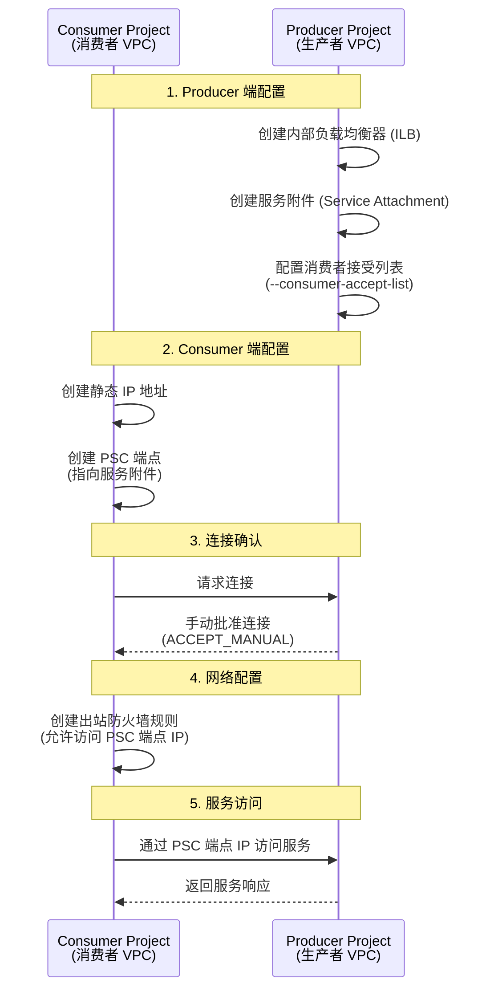
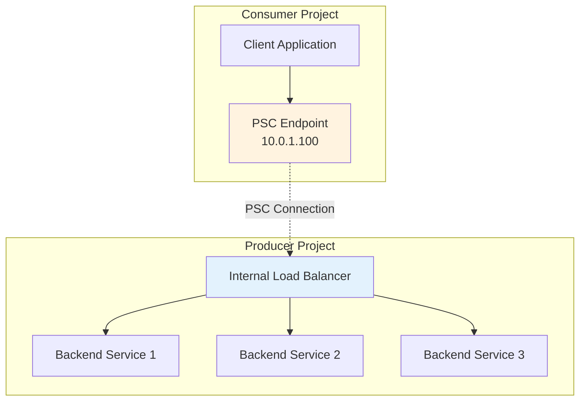

# Private Service Connect (PSC) 概念指南

## 核心概念

### 什么是 PSC？

**Private Service Connect (PSC)** 是 Google Cloud 的一项网络功能，允许消费者在其 VPC 网络内部私密地访问托管服务。PSC 的核心特点是：

1. **私有连接**：消费者使用自己的内部 IP 地址访问服务，无需离开其 VPC 网络或使用外部 IP 地址
2. **流量隔离**：流量完全保留在 Google Cloud 内部，不经过公网
3. **服务暴露**：服务提供者可以控制哪些消费者项目可以访问其服务
4. **跨项目支持**：完全支持跨项目、跨组织的服务访问

### PSC 的核心组件

| 组件 | 说明 |
|------|------|
| **Producer (生产者)** | 托管服务的项目，创建服务附件 (Service Attachment) 来发布服务 |
| **Consumer (消费者)** | 访问服务的项目，创建 PSC 端点 (Endpoint) 来连接服务 |
| **Service Attachment (服务附件)** | Producer 端创建的接入点，允许被授权的消费者访问其服务 |
| **PSC Endpoint (PSC 端点)** | Consumer 端创建的端点，在消费者 VPC 中有一个内部 IP 地址 |
| **Internal Load Balancer (内部负载均衡器)** | Producer 端用于暴露服务的负载均衡器 |

---

## Cross-Project（跨项目）PSC 网络要求

### 1. VPC 网络要求

| 要求 | 说明 |
|------|------|
| **VPC 可以重叠** | ✅ 两个项目的 VPC IP 地址范围**可以重叠**，因为 PSC 不使用 VPC Peering，路由不共享 |
| **独立路由空间** | ✅ 每个 VPC 保持独立的路由表，不需要配置路由打通 |
| **无需 Peering** | ✅ PSC 基于 Private Endpoint 技术，不需要 VPC Peering |

### 2. 网络连接流程



### 3. 具体命令示例

#### Producer 端（服务提供者）

```bash
# 创建服务附件
export PRODUCER_PROJECT_ID="<生产者项目 ID>"
export REGION="<区域>"
export SERVICE_ATTACHMENT_NAME="<服务附件名称>"
export FWD_RULE="<内部负载均衡器转发规则名称>"
export NAT_SUBNETS="<PSC NAT 子网>"
export ACCEPT_LIST="<消费者项目 ID>=10"  # 格式：project-id=连接数限制

gcloud compute service-attachments create ${SERVICE_ATTACHMENT_NAME} \
    --project=${PRODUCER_PROJECT_ID} \
    --region=${REGION} \
    --nat-subnets=${NAT_SUBNETS} \
    --producer-forwarding-rule=${FWD_RULE} \
    --consumer-accept-list=${ACCEPT_LIST} \
    --connection-preference=ACCEPT_MANUAL
```

**关键参数说明：**
- `--consumer-accept-list`：定义哪些项目 ID 被允许连接，以及每个项目的连接数限制
- `--connection-preference=ACCEPT_MANUAL`：强制要求手动批准每一个连接请求，增强安全性
- `--nat-subnets`：指定专用于 PSC NAT 的子网

#### Consumer 端（服务消费者）

```bash
# 1. 创建静态 IP 地址
export CONSUMER_PROJECT_ID="<消费者项目 ID>"
export REGION="<区域>"
export ADDR_NAME="<端点 IP 地址名称>"
export SUBNET="<消费者 VPC 中的子网>"

gcloud compute addresses create ${ADDR_NAME} \
    --project=${CONSUMER_PROJECT_ID} \
    --region=${REGION} \
    --subnet=${SUBNET}

# 2. 创建 PSC 端点
export FWD_RULE_NAME="<端点转发规则名称>"
export TARGET_SERVICE_ATTACHMENT="projects/${PRODUCER_PROJECT_ID}/regions/${REGION}/serviceAttachments/${SERVICE_ATTACHMENT_NAME}"

gcloud compute forwarding-rules create ${FWD_RULE_NAME} \
    --project=${CONSUMER_PROJECT_ID} \
    --region=${REGION} \
    --network=<消费者 VPC 网络名称> \
    --address=${ADDR_NAME} \
    --target-service-attachment=${TARGET_SERVICE_ATTACHMENT} \
    --allow-psc-global-access

# 3. 创建出站防火墙规则
export FIREWALL_RULE_NAME="<防火墙规则名称>"
export PSC_ENDPOINT_IP=$(gcloud compute addresses describe ${ADDR_NAME} \
    --project=${CONSUMER_PROJECT_ID} \
    --region=${REGION} \
    --format="value(address)")
export SERVICE_PORT="<服务端口，如 443, 3306, 5432, 6379>"

gcloud compute firewall-rules create ${FIREWALL_RULE_NAME} \
    --project=${CONSUMER_PROJECT_ID} \
    --network=<消费者 VPC 网络名称> \
    --direction=EGRESS \
    --destination-ranges=${PSC_ENDPOINT_IP}/32 \
    --action=ALLOW \
    --rules=tcp:${SERVICE_PORT}
```

---

## IP Range 定义

### IP 地址冲突问题

**关键结论：IP 地址可以重叠，不需要担心冲突。**

| 场景 | IP 重叠要求 | 原因 |
|------|-----------|------|
| **PSC 连接** | ✅ **可以重叠** | PSC 不使用 VPC Peering，两个 VPC 的路由空间完全独立 |
| **VPC Peering** | ❌ **不能重叠** | VPC Peering 共享路由空间，CIDR 必须不重叠 |

### 为什么 PSC 允许 IP 重叠？

1. **独立路由空间**：PSC 基于 Private Endpoint 技术，Consumer 和 Producer 的 VPC 路由表完全独立
2. **点对点连接**：PSC 创建的是一个专用的隧道，不共享 VPC 路由
3. **端点 IP 隔离**：Consumer 端的 PSC 端点 IP 只在 Consumer VPC 内有效，Producer 无法访问

### IP 规划建议

尽管 PSC 允许 IP 重叠，但仍建议：

1. **使用不同的 IP 范围**：便于网络管理和故障排除
2. **记录 PSC 端点 IP**：Consumer 端的 PSC 端点 IP 是访问服务的入口，需要妥善记录
3. **防火墙规则配置**：Consumer 端需要创建出站规则允许访问 PSC 端点 IP

---

## PSC 与 Load Balancing 的关系

### 核心结论

**你的理解是正确的：PSC 本身不是 Load Balancing，它只是一种网络连接方式。**

### 详细解释

| 概念 | 说明 |
|------|------|
| **PSC** | 是一种**网络连接机制**，用于在 VPC 之间建立私有连接通道 |
| **Load Balancing** | 是一种**服务暴露方式**，用于将流量分发到多个后端实例 |

### 架构关系



**说明：**

1. **PSC 的作用**：将 Consumer 的流量通过私有通道传输到 Producer 的 Internal Load Balancer
2. **Load Balancing 的作用**：在 Producer 端，Internal Load Balancer 将流量分发到多个后端实例
3. **两者关系**：PSC 是"通道"，Load Balancing 是"服务暴露方式"，两者可以配合使用

### 典型架构模式

#### 模式 1：PSC + Internal Load Balancer

```
Consumer → PSC Endpoint → Internal LB → Backend Services
```

- 适用于：Producer 有多个后端实例，需要负载均衡

#### 模式 2：PSC + 单一服务

```
Consumer → PSC Endpoint → Single Service
```

- 适用于：简单场景，如 Cloud SQL、Redis 等托管服务

---

## PSC 使用场景

### 1. 跨项目数据库访问

- **Producer**：托管 Cloud SQL 或 Memorystore (Redis)
- **Consumer**：运行应用程序，需要访问数据库

### 2. 跨项目 API 服务暴露

- **Producer**：托管 GKE、Cloud Run 或 GCE 应用
- **Consumer**：调用 API 的客户端应用

### 3. 第三方服务访问

- **Producer**：第三方服务提供者
- **Consumer**：访问第三方服务的企业应用

### 4. 多租户架构

- **Producer**：共享服务（如认证、日志、监控）
- **Consumer**：各个租户项目

---

## PSC vs PSA 对比

| 特性 | PSA (Private Service Access) | PSC (Private Service Connect) |
|------|-----------------------------|------------------------------|
| **主要用途** | 访问 Google 托管服务（Cloud SQL、AI、BigQuery） | 访问自建/第三方服务 |
| **底层技术** | VPC Peering + DNS Peering | Private Endpoint + Internal Load Balancer |
| **网络模型** | 共享路由空间 | 独立路由，完全隔离 |
| **IP 重叠** | ❌ 不允许 | ✅ 允许 |
| **跨项目支持** | 有限支持 | 完全支持 |
| **安全隔离** | 中等（共享路由） | 高（完全隔离） |
| **DNS 管理** | private.googleapis.com | 自定义域名或自动生成 |
| **计费模式** | 免费（仅 VPC Peering 成本） | 按带宽和连接数计费 |
| **配置复杂度** | 简单 | 中等 |

---

## 验证检查列表

### Producer 端验证

- [ ] 服务附件创建成功
- [ ] Consumer 项目已添加到接受列表
- [ ] 连接偏好设置为手动接受 (ACCEPT_MANUAL)
- [ ] 内部负载均衡器正常运行
- [ ] PSC 子网配置正确
- [ ] 防火墙规则允许 PSC 流量

### Consumer 端验证

- [ ] 静态 IP 地址创建成功
- [ ] PSC 端点创建成功
- [ ] 出站防火墙规则创建成功
- [ ] 能够解析 PSC 端点的 IP 地址
- [ ] 网络路由配置正确

### 连接测试

- [ ] 从 Consumer VM ping PSC 端点 IP
- [ ] 使用 telnet/nc 测试端口连接
- [ ] 应用层连接测试通过
- [ ] Producer 端看到连接日志

---

## 总结

### 核心要点

1. **PSC 是什么**：一种私有网络连接机制，允许 Consumer 通过内部 IP 访问 Producer 的服务
2. **跨项目网络要求**：
   - VPC IP 可以重叠（因为路由独立）
   - 不需要配置路由打通
   - 不需要 VPC Peering
3. **IP Range 定义**：
   - IP 地址可以重叠，不会冲突
   - Consumer 端需要记录 PSC 端点 IP 用于访问服务
   - 需要配置防火墙规则允许访问 PSC 端点
4. **Load Balancing**：
   - PSC 本身不是 Load Balancing
   - PSC 是"通道"，Load Balancing 是"服务暴露方式"
   - 两者可以配合使用（PSC + Internal LB）

### 最佳实践

1. **安全性**：使用 `ACCEPT_MANUAL` 模式，手动批准每个连接请求
2. **IP 规划**：尽管可以重叠，仍建议使用不同的 IP 范围便于管理
3. **监控**：启用 VPC 流日志，监控 PSC 连接状态
4. **文档**：记录所有 PSC 端点 IP 和服务附件信息
