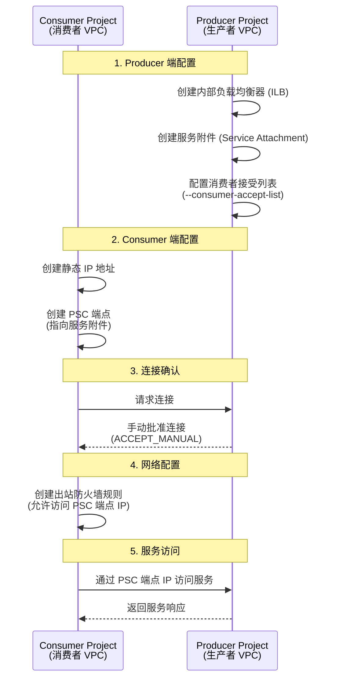
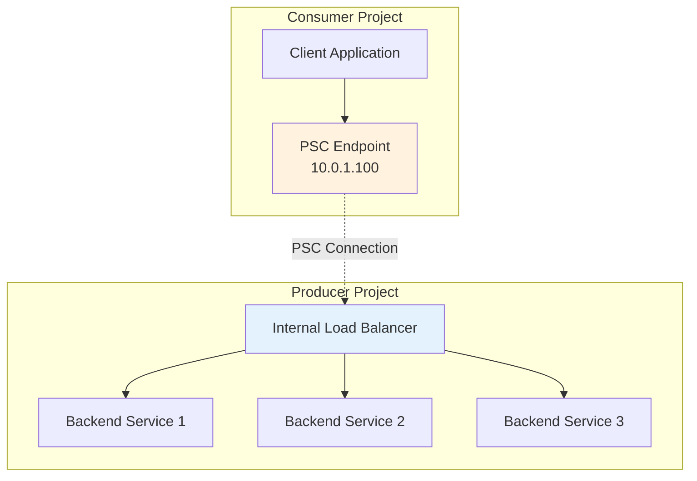

# Private Service Connect (PSC) 概念指南

## 1. 核心概念

### 1.1 什么是 PSC？

**Private Service Connect (PSC)** 是 Google Cloud 的一项网络功能，允许消费者在其 VPC 网络内部私密地访问托管服务。

**PSC 的核心特点：**

1. **私有连接**：消费者使用自己的内部 IP 地址访问服务，无需离开其 VPC 网络或使用外部 IP 地址
2. **流量隔离**：流量完全保留在 Google Cloud 内部，不经过公网
3. **服务暴露**：服务提供者可以控制哪些消费者项目可以访问其服务
4. **跨项目支持**：完全支持跨项目、跨组织的服务访问

---

### 1.2 PSC 的核心组件

| 组件 | 说明 |
|------|------|
| **Producer (生产者)** | 托管服务的项目，创建服务附件 (Service Attachment) 来发布服务 |
| **Consumer (消费者)** | 访问服务的项目，创建 PSC 端点 (Endpoint) 来连接服务 |
| **Service Attachment (服务附件)** | Producer 端创建的接入点，允许被授权的消费者访问其服务 |
| **PSC Endpoint (PSC 端点)** | Consumer 端创建的端点，在消费者 VPC 中有一个内部 IP 地址 |
| **Internal Load Balancer (内部负载均衡器)** | Producer 端用于暴露服务的负载均衡器 |

---

## 2. Cross-Project（跨项目）PSC 网络要求

### 2.1 VPC 网络要求

你的总结整体是正确的，而且已经抓住了 PSC + Service Attachment 的几个关键限制。我帮你逐条做一个 **架构级确认 + 小补充**，这样以后你在设计 PSC 拓扑时会更清晰。

---

#### 规则 1：NAT Subnet 与 Forwarding Rule 必须在同一个 VPC

✅ **你的结论：正确**

**规则：**

```
Service Attachment
 ├─ target-service = Internal Load Balancer forwarding rule
 └─ nat-subnets    = PSC NAT subnet
```

**限制：**

- `nat-subnets`
- `forwarding-rule`

必须属于 **同一个 VPC network**，否则创建 `service-attachment` 会直接失败。

**示例：**

```bash
gcloud compute service-attachments create sa-test \
  --region=asia-northeast1 \
  --producer-forwarding-rule=my-ilb-fr \
  --nat-subnets=psc-nat-subnet
```

**要求：**

| 资源 | 必须 |
|------|------|
| `forwarding rule` | VPC-A |
| `nat-subnet` | VPC-A |

**不能：**

| 资源 | 错误 |
|------|------|
| `forwarding rule` | VPC-A |
| `nat-subnet` | VPC-B |

---

#### 规则 2：`purpose=PRIVATE_SERVICE_CONNECT` 子网不能用于 IP Reservation

✅ **你的结论：正确**

PSC NAT subnet 只能用于 Service Attachment NAT。

**不能用于：**

| 操作 | 是否允许 |
|------|----------|
| `gcloud compute addresses create` | ❌ |
| Endpoint IP | ❌ |
| VM IP | ❌ |
| PSC NAT | ✅ |

**原因：**

```
Consumer -> PSC Endpoint
              |
              v
Producer Service Attachment
              |
              v
        NAT Subnet (purpose PSC)
```

这个 subnet 只用于 Producer 侧 NAT 地址池。

---

#### 规则 3：Consumer Forwarding Rule 的 Network 必须能访问 Producer VPC

⚠️ **基本正确，但要稍微精确一点**

PSC 实际上 **不要求直接路由互通**，因为：

```
Consumer VPC
     |
     v
PSC Endpoint
     |
Google backbone
     |
Producer Service Attachment
     |
ILB
```

**但是需要满足：**

Producer 必须允许 Consumer project / network

Service Attachment 中必须允许：

```bash
--consumer-accept-list
```

**例如：**

- `project=consumer-project`
- 或 `network=consumer-vpc`

如果是 **自动接受模式**：

```bash
connection-preference=ACCEPT_AUTOMATIC
```

否则 connection 会停在 `PENDING`。

**所以更准确说：**

| 条件 | 必须 |
|------|------|
| Consumer network 可达 Producer VPC | ❌ 不需要 |
| Consumer project/network 被允许 | ✅ 必须 |

---

#### 规则 4：Forwarding Rule 所在 Network 决定流量在哪个 VPC

✅ **你的理解是正确的**

Forwarding Rule 本质就是 VPC 内的入口点。

**例如：**

```
VPC-A
  |
  | forwarding rule
  v
ILB
```

**那么：**

- 只有 VPC-A 内部可以访问
- 或 PSC endpoint 指向这个 forwarding rule

它不会自动跨 VPC。

---

#### 规则 5：一个 PSC NAT Subnet 只能被一个 Service Attachment 使用

✅ **完全正确**

**Google Cloud 限制：**

```
PSC NAT subnet
   └── 只能绑定一个 Service Attachment
```

否则创建时会报类似错误：

```
subnet already in use by another service attachment
```

**原因是：**

PSC NAT subnet 本质上是：

```
Consumer connection
        |
        v
Producer NAT IP (来自该 subnet)
```

一个 Service Attachment 需要 **独占 NAT 地址池**。

---

### 2.2 PSC Producer 规则总结表

| 规则 | 是否必须 |
|------|----------|
| NAT subnet 与 forwarding rule 同一 VPC | ✅ |
| NAT subnet purpose 必须 PRIVATE_SERVICE_CONNECT | ✅ |
| PSC NAT subnet 不能分配 endpoint IP | ✅ |
| PSC NAT subnet 只能被一个 Service Attachment 使用 | ✅ |
| Consumer 不需要与 Producer VPC 路由互通 | ✅ |
| Consumer 必须被 Service Attachment allow | ✅ |

---

### 2.3 推荐的 PSC 架构模型

**Producer 侧：**

```
Producer VPC
   |
   | Internal Load Balancer
   v
Forwarding Rule
   |
   v
Service Attachment
   |
   v
PSC NAT Subnet
```

**Consumer 侧：**

```
Consumer VPC
   |
PSC Endpoint (Forwarding Rule)
   |
   v
Producer Service Attachment
```

---

💡 **如果你愿意，我可以帮你画一张 GCP Private Service Connect 完整架构图（Producer / Consumer / NAT / ILB）**

很多 GCP 架构师都是靠这张图理解 PSC 的，一次看懂所有限制。

---

### 2.4 VPC 网络要求总结

| 要求 | 说明 |
|------|------|
| **VPC 可以重叠** | ✅ 两个项目的 VPC IP 地址范围**可以重叠**，因为 PSC 不使用 VPC Peering，路由不共享 |
| **独立路由空间** | ✅ 每个 VPC 保持独立的路由表，不需要配置路由打通 |
| **无需 Peering** | ✅ PSC 基于 Private Endpoint 技术，不需要 VPC Peering |

---

### 2.5 网络连接流程


```mermaid
sequenceDiagram
    participant Consumer as Consumer Project<br/>(消费者 VPC)
    participant Producer as Producer Project<br/>(生产者 VPC)

    Note over Consumer,Producer: 1. Producer 端配置
    Producer->>Producer: 创建内部负载均衡器 (ILB)
    Producer->>Producer: 创建服务附件 (Service Attachment)
    Producer->>Producer: 配置消费者接受列表<br/>(--consumer-accept-list)

    Note over Consumer,Producer: 2. Consumer 端配置
    Consumer->>Consumer: 创建静态 IP 地址
    Consumer->>Consumer: 创建 PSC 端点<br/>(指向服务附件)

    Note over Consumer,Producer: 3. 连接确认
    Consumer->>Producer: 请求连接
    Producer-->>Consumer: 手动批准连接<br/>(ACCEPT_MANUAL)

    Note over Consumer,Producer: 4. 网络配置
    Consumer->>Consumer: 创建出站防火墙规则<br/>(允许访问 PSC 端点 IP)

    Note over Consumer,Producer: 5. 服务访问
    Consumer->>Producer: 通过 PSC 端点 IP 访问服务
    Producer-->>Consumer: 返回服务响应
```

---

### 2.6 具体命令示例

#### Producer 端（服务提供者）

```bash
# 创建服务附件
export PRODUCER_PROJECT_ID="<生产者项目 ID>"
export REGION="<区域>"
export SERVICE_ATTACHMENT_NAME="<服务附件名称>"
export FWD_RULE="<内部负载均衡器转发规则名称>"
export NAT_SUBNETS="<PSC NAT 子网>"
export ACCEPT_LIST="<消费者项目 ID>=10"  # 格式：project-id=连接数限制

gcloud compute service-attachments create ${SERVICE_ATTACHMENT_NAME} \
    --project=${PRODUCER_PROJECT_ID} \
    --region=${REGION} \
    --nat-subnets=${NAT_SUBNETS} \
    --producer-forwarding-rule=${FWD_RULE} \
    --consumer-accept-list=${ACCEPT_LIST} \
    --connection-preference=ACCEPT_MANUAL
```

**关键参数说明：**

| 参数 | 说明 |
|------|------|
| `--consumer-accept-list` | 定义哪些项目 ID 被允许连接，以及每个项目的连接数限制 |
| `--connection-preference=ACCEPT_MANUAL` | 强制要求手动批准每一个连接请求，增强安全性 |
| `--nat-subnets` | 指定专用于 PSC NAT 的子网 |

---

#### Consumer 端（服务消费者）

```bash
# 1. 创建静态 IP 地址
export CONSUMER_PROJECT_ID="<消费者项目 ID>"
export REGION="<区域>"
export ADDR_NAME="<端点 IP 地址名称>"
export SUBNET="<消费者 VPC 中的子网>"

gcloud compute addresses create ${ADDR_NAME} \
    --project=${CONSUMER_PROJECT_ID} \
    --region=${REGION} \
    --subnet=${SUBNET}

# 2. 创建 PSC 端点
export FWD_RULE_NAME="<端点转发规则名称>"
export TARGET_SERVICE_ATTACHMENT="projects/${PRODUCER_PROJECT_ID}/regions/${REGION}/serviceAttachments/${SERVICE_ATTACHMENT_NAME}"

gcloud compute forwarding-rules create ${FWD_RULE_NAME} \
    --project=${CONSUMER_PROJECT_ID} \
    --region=${REGION} \
    --network=<消费者 VPC 网络名称> \
    --address=${ADDR_NAME} \
    --target-service-attachment=${TARGET_SERVICE_ATTACHMENT} \
    --allow-psc-global-access

# 3. 创建出站防火墙规则
export FIREWALL_RULE_NAME="<防火墙规则名称>"
export PSC_ENDPOINT_IP=$(gcloud compute addresses describe ${ADDR_NAME} \
    --project=${CONSUMER_PROJECT_ID} \
    --region=${REGION} \
    --format="value(address)")
export SERVICE_PORT="<服务端口，如 443, 3306, 5432, 6379>"

gcloud compute firewall-rules create ${FIREWALL_RULE_NAME} \
    --project=${CONSUMER_PROJECT_ID} \
    --network=<消费者 VPC 网络名称> \
    --direction=EGRESS \
    --destination-ranges=${PSC_ENDPOINT_IP}/32 \
    --action=ALLOW \
    --rules=tcp:${SERVICE_PORT}
```

---

## 3. IP Range 定义

### 3.1 IP 地址冲突问题

**关键结论：IP 地址可以重叠，不需要担心冲突。**

| 场景 | IP 重叠要求 | 原因 |
|------|-----------|------|
| **PSC 连接** | ✅ **可以重叠** | PSC 不使用 VPC Peering，两个 VPC 的路由空间完全独立 |
| **VPC Peering** | ❌ **不能重叠** | VPC Peering 共享路由空间，CIDR 必须不重叠 |

---

### 3.2 为什么 PSC 允许 IP 重叠？

1. **独立路由空间**：PSC 基于 Private Endpoint 技术，Consumer 和 Producer 的 VPC 路由表完全独立
2. **点对点连接**：PSC 创建的是一个专用的隧道，不共享 VPC 路由
3. **端点 IP 隔离**：Consumer 端的 PSC 端点 IP 只在 Consumer VPC 内有效，Producer 无法访问

---

### 3.3 IP 规划建议

尽管 PSC 允许 IP 重叠，但仍建议：

1. **使用不同的 IP 范围**：便于网络管理和故障排除
2. **记录 PSC 端点 IP**：Consumer 端的 PSC 端点 IP 是访问服务的入口，需要妥善记录
3. **防火墙规则配置**：Consumer 端需要创建出站规则允许访问 PSC 端点 IP

---

## 4. PSC 与 Load Balancing 的关系

### 4.1 核心结论

**你的理解是正确的：PSC 本身不是 Load Balancing，它只是一种网络连接方式。**

---

### 4.2 详细解释

| 概念 | 说明 |
|------|------|
| **PSC** | 是一种**网络连接机制**，用于在 VPC 之间建立私有连接通道 |
| **Load Balancing** | 是一种**服务暴露方式**，用于将流量分发到多个后端实例 |

---

### 4.3 架构关系


```mermaid
graph TB
    subgraph "Consumer Project"
        A[Client Application]
        B[PSC Endpoint<br/>10.0.1.100]
    end

    subgraph "Producer Project"
        C[Internal Load Balancer]
        D[Backend Service 1]
        E[Backend Service 2]
        F[Backend Service 3]
    end

    A --> B
    B -.->|PSC Connection| C
    C --> D
    C --> E
    C --> F

    style B fill:#fff3e0
    style C fill:#e3f2fd
```

**说明：**

1. **PSC 的作用**：将 Consumer 的流量通过私有通道传输到 Producer 的 Internal Load Balancer
2. **Load Balancing 的作用**：在 Producer 端，Internal Load Balancer 将流量分发到多个后端实例
3. **两者关系**：PSC 是"通道"，Load Balancing 是"服务暴露方式"，两者可以配合使用

---

### 4.4 典型架构模式

#### 模式 1：PSC + Internal Load Balancer

```
Consumer → PSC Endpoint → Internal LB → Backend Services
```

- **适用于**：Producer 有多个后端实例，需要负载均衡

#### 模式 2：PSC + 单一服务

```
Consumer → PSC Endpoint → Single Service
```

- **适用于**：简单场景，如 Cloud SQL、Redis 等托管服务

---

## 5. PSC 使用场景

### 5.1 跨项目数据库访问

- **Producer**：托管 Cloud SQL 或 Memorystore (Redis)
- **Consumer**：运行应用程序，需要访问数据库

### 5.2 跨项目 API 服务暴露

- **Producer**：托管 GKE、Cloud Run 或 GCE 应用
- **Consumer**：调用 API 的客户端应用

### 5.3 第三方服务访问

- **Producer**：第三方服务提供者
- **Consumer**：访问第三方服务的企业应用

### 5.4 多租户架构

- **Producer**：共享服务（如认证、日志、监控）
- **Consumer**：各个租户项目

---

## 6. PSC vs PSA 对比

| 特性 | PSA (Private Service Access) | PSC (Private Service Connect) |
|------|-----------------------------|------------------------------|
| **主要用途** | 访问 Google 托管服务（Cloud SQL、AI、BigQuery） | 访问自建/第三方服务 |
| **底层技术** | VPC Peering + DNS Peering | Private Endpoint + Internal Load Balancer |
| **网络模型** | 共享路由空间 | 独立路由，完全隔离 |
| **IP 重叠** | ❌ 不允许 | ✅ 允许 |
| **跨项目支持** | 有限支持 | 完全支持 |
| **安全隔离** | 中等（共享路由） | 高（完全隔离） |
| **DNS 管理** | `private.googleapis.com` | 自定义域名或自动生成 |
| **计费模式** | 免费（仅 VPC Peering 成本） | 按带宽和连接数计费 |
| **配置复杂度** | 简单 | 中等 |

---

## 7. 验证检查列表

### 7.1 Producer 端验证

- [ ] 服务附件创建成功
- [ ] Consumer 项目已添加到接受列表
- [ ] 连接偏好设置为手动接受 (ACCEPT_MANUAL)
- [ ] 内部负载均衡器正常运行
- [ ] PSC 子网配置正确
- [ ] 防火墙规则允许 PSC 流量

### 7.2 Consumer 端验证

- [ ] 静态 IP 地址创建成功
- [ ] PSC 端点创建成功
- [ ] 出站防火墙规则创建成功
- [ ] 能够解析 PSC 端点的 IP 地址
- [ ] 网络路由配置正确

### 7.3 连接测试

- [ ] 从 Consumer VM ping PSC 端点 IP
- [ ] 使用 telnet/nc 测试端口连接
- [ ] 应用层连接测试通过
- [ ] Producer 端看到连接日志

---

## 8. 总结

### 8.1 核心要点

1. **PSC 是什么**：一种私有网络连接机制，允许 Consumer 通过内部 IP 访问 Producer 的服务
2. **跨项目网络要求**：
   - VPC IP 可以重叠（因为路由独立）
   - 不需要配置路由打通
   - 不需要 VPC Peering
3. **IP Range 定义**：
   - IP 地址可以重叠，不会冲突
   - Consumer 端需要记录 PSC 端点 IP 用于访问服务
   - 需要配置防火墙规则允许访问 PSC 端点
4. **Load Balancing**：
   - PSC 本身不是 Load Balancing
   - PSC 是"通道"，Load Balancing 是"服务暴露方式"
   - 两者可以配合使用（PSC + Internal LB）

### 8.2 最佳实践

1. **安全性**：使用 `ACCEPT_MANUAL` 模式，手动批准每个连接请求
2. **IP 规划**：尽管可以重叠，仍建议使用不同的 IP 范围便于管理
3. **监控**：启用 VPC 流日志，监控 PSC 连接状态
4. **文档**：记录所有 PSC 端点 IP 和服务附件信息
