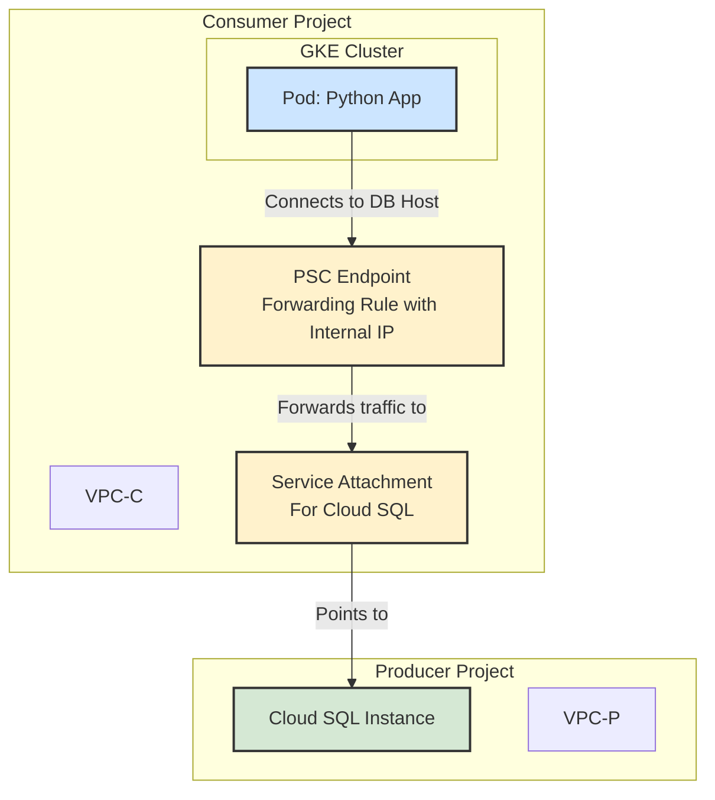

# GKE 通过 PSC 连接 Cloud SQL 示例

本文档提供了一个完整的示例，演示了如何配置一个在 Google Kubernetes Engine (GKE) 中运行的应用程序，使其能够通过 Private Service Connect (PSC) 安全地连接到位于另一个 Google Cloud 项目中的 Cloud SQL 实例。

## 架构

此解决方案的核心是解耦，应用（Consumer）无需知道数据库（Producer）的任何网络细节，只需连接到一个在它自己 VPC 内的内部 IP 地址（PSC 端点）。



## 文件说明

- **`app.py`**: 一个简单的 Python 应用，使用 `mysql-connector-python` 库。它从环境变量 `DB_HOST`, `DB_USER`, `DB_PASSWORD` 中获取连接信息并尝试连接数据库。
- **`Dockerfile`**: 用于将 `app.py` 打包成一个容器镜像。
- **`k8s-secret.yaml`**: Kubernetes Secret 配置文件。用于安全地存储数据库的用户名和密码。**你需要将密码进行 Base64 编码后再填入。**
- **`k8s-deployment.yaml`**: Kubernetes Deployment 配置文件。这是部署的核心，它会：
    - 创建一个 Deployment 来运行你的应用容器。
    - 通过 `env` 和 `valueFrom` 将 `k8s-secret.yaml` 中定义的用户名和密码注入到容器的环境变量中。
    - 通过 `env` 将 PSC 端点的 IP 地址作为 `DB_HOST` 环境变量注入容器。**你需要手动将 `YOUR_PSC_ENDPOINT_IP` 替换为真实的 PSC 端点 IP。**

## 部署步骤

### 前提条件

1.  你已经根据 `Kiro-psc.md` 文档成功创建了从 Producer (Cloud SQL) 到 Consumer (GKE) 的 PSC 连接。
2.  你拥有一个 PSC 端点的内部 IP 地址。
3.  你的 GKE 集群位于 Consumer 项目的 VPC 中。
4.  你已经安装并配置好 `gcloud` 和 `kubectl` 命令行工具。

### 步骤 1: 准备数据库凭证

首先，你需要将你的数据库密码进行 Base64 编码。

```bash
# 将 'your-strong-password' 替换为你的真实密码
echo -n 'your-strong-password' | base64
```

将输出的 Base64 字符串填入 `k8s-secret.yaml` 文件中的 `password` 字段。

### 步骤 2: 创建 Kubernetes Secret

将数据库凭证应用到你的 GKE 集群中。

```bash
kubectl apply -f k8s-secret.yaml
```

### 步骤 3: 更新并应用 Deployment

1.  打开 `k8s-deployment.yaml` 文件。
2.  找到 `value: "YOUR_PSC_ENDPOINT_IP"` 这一行。
3.  将其中的 `YOUR_PSC_ENDPOINT_IP` 替换为你创建的 PSC 端点的**内部 IP 地址**。

然后，应用 Deployment 配置。

```bash
kubectl apply -f k8s-deployment.yaml
```

### 步骤 4: 验证连接

应用部署后，Pod 会尝试启动并连接数据库。你可以通过查看 Pod 的日志来验证连接是否成功。

```bash
# 获取 Pod 名称
kubectl get pods

# 查看 Pod 日志 (将 'your-pod-name' 替换为上一步获取的 Pod 名称)
kubectl logs your-pod-name
```

如果连接成功，你应该会在日志中看到 "Successfully connected to the database!" 的消息。如果失败，日志会打印出相应的错误信息，帮助你进行排查。

## 关于服务账号 (Service Account)

在这个特定的场景中，GKE Pod 连接 Cloud SQL 的认证是基于数据库自身的用户名和密码的，流量通过 PSC 的私有 IP 路由。因此，**你不需要为 GKE 的 Pod 或其节点配置特殊的 IAM 角色来授权数据库访问**。

Google Cloud 的 IAM 角色（如 `roles/cloudsql.client`）主要用于通过 [Cloud SQL Auth Proxy](https://cloud.google.com/sql/docs/mysql/connect-auth-proxy) 进行连接的场景。Auth Proxy 使用 IAM 凭证进行认证和加密。而我们这里使用的是传统的、基于网络 IP 和数据库凭证的直连方式，只是网络路径由 PSC 保证其私密和安全。
