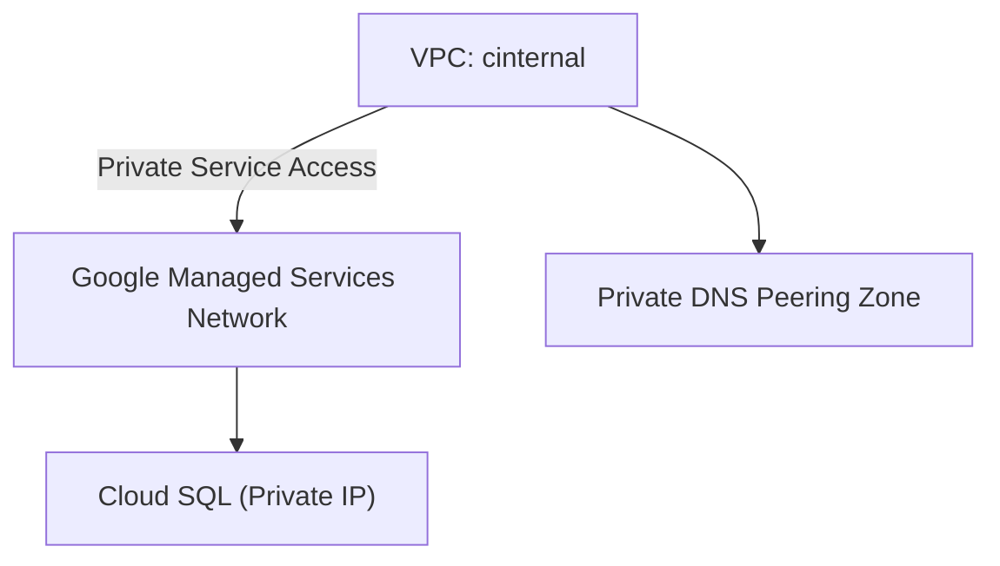
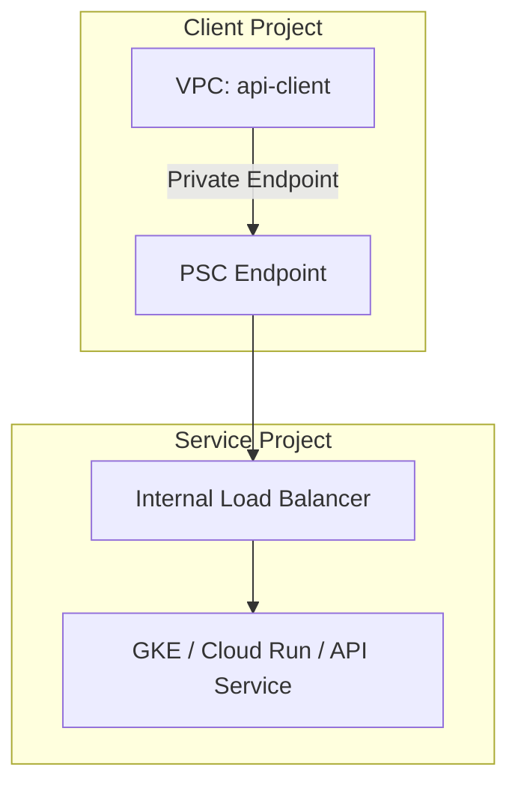
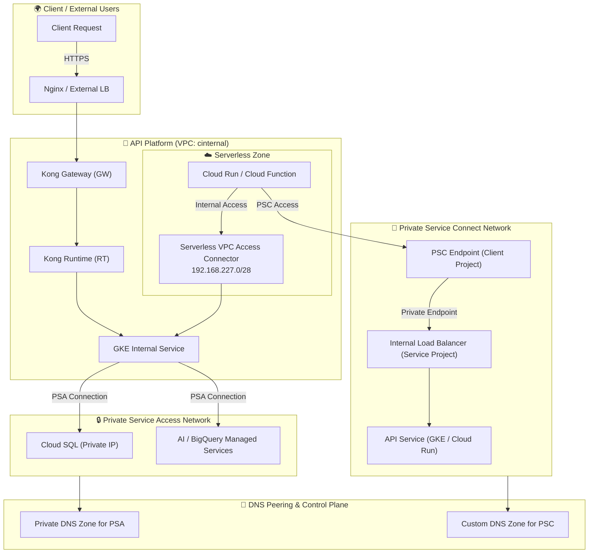

在 GCP 网络中，**PSA（Private Service Access）** 和 **PSC（Private Service Connect）** 都用于“通过内网访问 Google 托管服务”，但它们的**架构逻辑与使用场景完全不同**。

下面我会系统性地帮你梳理区别，并结合你的 Terraform 配置给出对应场景建议。

---

## **🧭 一、PSA 与 PSC 的核心定位对比**

|**对比项**|**Private Service Access (PSA)**|**Private Service Connect (PSC)**|
|---|---|---|
|**用途**|连接 GCP **Google 托管服务**（如 Cloud SQL、AI、BigQuery）|连接 **私有服务端点**（可以是 Google 服务、也可以是你自己或第三方的服务）|
|**底层机制**|VPC Peering + 内部 DNS Peering|内部 IP + 负载均衡 Private Endpoint|
|**典型使用场景**|在 VPC 中访问 Cloud SQL（Private IP 模式）|通过内网暴露/访问 API Gateway、GKE 服务或第三方服务|
|**连接方向**|一般是 **你的 VPC → Google 服务项目**|可以是双向：• Client → Server（访问第三方或共享服务）• Server 暴露服务供别人接入|
|**网络模型**|基于 VPC Peering（共享路由空间）|基于 Private Endpoint（独立路由，不共享 VPC 路由）|
|**DNS 管理**|通常依赖 private.googleapis.com 域名和 psa_dns_peering|通过自动生成的私有 DNS 名称或自定义 DNS 解析|
|**安全边界**|较松散（VPC Peering 路由共享，CIDR 必须可重叠管理）|较强（PSC 连接隔离，不共享路由）|
|**典型产品支持**|Cloud SQL, AI Platform, Memorystore, etc.|Cloud Run, API Gateway, Cloud Functions, GKE Service, etc.|
|**收费模式**|免费（VPC Peering 成本）|付费（PSC Endpoint 按带宽计费）|

---

## **🧩 二、类比理解（直观比喻）**

|**类比场景**|**说明**|
|---|---|
|**PSA** 像是你和 Google 在同一个公司网络里办公|你们通过内网（VPC Peering）互相访问，但共享某些内部路由和命名规则|
|**PSC** 像是你在公司内部搭了一个“专线 VPN”去访问合作伙伴的私有 API|你只开放一个专用的入口 IP，通信独立、安全、可控，不暴露其他路由|

---

## **🕸️ 三、两者在架构中的位置（示意）**

  

### **✅** 

### **PSA 架构（Cloud SQL 私有连接）**



- PSA 建立的是一种 **网络对等关系 (Peering)**
    
- 适用于访问 **Google 内部托管的服务**（如 Cloud SQL）
    
- 网络与路由共享（但不可重叠 CIDR）
    

---

### **✅** 

### **PSC 架构（访问或暴露 API 服务）**



- PSC 通过 **Private Endpoint + ILB** 方式建立点对点内网访问
    
- 可以用来访问第三方提供的服务（例如：API 平台、Partner 服务）
    
- 不需要共享路由，隔离更强
    

---

## **⚙️ 四、结合你当前配置分析**

  

你的 Terraform 配置中：

```
"cloudsql_private_service_access": "true",
"psa_dns_peering": true,
"psa_export_custom_routes": true
```

➡️ 说明你当前启用的是 **PSA 模式**

用途是让 VPC 内部（比如 GKE 或 Cloud Run via Connector）能通过内网访问 **Cloud SQL** 或 **Google 托管服务**。

你**尚未启用 PSC**，因为 PSC 通常会用于访问 **自定义服务或私有 API 网关**。

---

## **💡 五、使用建议**

|**场景**|**推荐机制**|**说明**|
|---|---|---|
|访问 Cloud SQL / AI / BigQuery（Google 托管服务）|✅ PSA|最稳定且自动管理|
|Cloud Run / Cloud Function 调用 GKE 或 Kong Runtime API（同公司内）|✅ PSC|内网访问，无需公网|
|跨项目访问第三方 API（例如 Partner 或其他租户）|✅ PSC|网络隔离好、安全性强|
|多 VPC 共享同一 API 平台|✅ PSC + Shared VPC|更易扩展与控制|

---

## **🧠 六、总结对比表（最终记忆版）**

|**项目**|**PSA**|**PSC**|
|---|---|---|
|全称|Private Service Access|Private Service Connect|
|主要用途|访问 Google 托管服务|访问自建或第三方服务|
|网络结构|VPC Peering|Private Endpoint|
|安全隔离|弱（共享路由）|强（独立通道）|
|是否支持跨项目|否|✅ 支持|
|适合服务类型|Cloud SQL, AI, BigQuery|GKE, Cloud Run, API Gateway, Third-party|
|DNS 模式|private.googleapis.com 域名|自定义或 PSC 自动生成域名|

---

是否希望我继续帮你画一张 **“PSA + PSC 混合架构”** 的完整拓扑图？

那张图可以直观展示：

- GKE、Cloud Run、Cloud SQL、PSC 入口之间的连通方式
    
- 各服务的访问路径（Public / Private / PSC / PSA）
    


下面是为你的 **API Platform 架构** 绘制的完整拓扑图，整合了 **PSA（Private Service Access）** 与 **PSC（Private Service Connect）** 的双通道网络访问结构，基于你当前的 GCP 架构逻辑（包含 GKE、Kong、Cloud SQL、Cloud Run、VPC Connector 等）。

---

## **🕸️ GCP 网络架构：PSA + PSC 混合拓扑图**



---

## **📖 架构说明**

|**区域**|**描述**|
|---|---|
|**CLIENT 层**|外部请求通过 HTTPS 到达入口 Nginx / External LB（可为 GLB 或 Cloud Armor + LB）|
|**PLATFORM 层**|内部核心 VPC（cinternal）中运行 API 平台，包括 Kong GW、Kong RT、GKE 应用等|
|**Serverless Zone**|通过 Serverless VPC Connector 连接到 cinternal 网络，使 Cloud Run / Function 能访问内部服务|
|**PSA 区域**|通过 Private Service Access 与 Google 托管服务（如 Cloud SQL）建立内网连接|
|**PSC 区域**|用于 Private Endpoint 通道连接内部或跨项目的服务端点|
|**DNS 区域**|psa_dns_peering 用于解析 Cloud SQL 私网域名；psc DNS 区域用于解析内部私有 Endpoint|

---

## **🔍 流量路径示例**

|**流程**|**描述**|
|---|---|
|① Client → Kong GW|外部请求进入平台入口（HTTPS）|
|② Kong RT → GKE Service|内部流量分发到后端服务|
|③ GKE / Kong → Cloud SQL|通过 **PSA** 通道访问 Cloud SQL 私有 IP|
|④ Cloud Run → GKE / API|通过 **Serverless VPC Connector** 进入 VPC|
|⑤ Cloud Run → Private API (跨项目)|通过 **PSC Endpoint** 内网访问另一项目的 API 服务|
|⑥ DNS|PSA 与 PSC 分别使用独立 DNS 解析通道，互不干扰|

---

## **⚙️ 设计要点与最佳实践**

|**分类**|**建议与说明**|
|---|---|
|**PSA 连接**|确保子网无重叠；启用 psa_dns_peering 确保域名可解析为内网地址|
|**PSC 接入**|适合暴露 API 平台接口供其他项目访问；每个 PSC Endpoint 独立安全隔离|
|**Serverless Connector**|需与 Cloud Run 在同一区域（asia-east2），CIDR 不得与其他子网冲突|
|**DNS 管理**|推荐分层 DNS：private.googleapis.com（PSA）与自定义私有域（PSC）|
|**性能优化**|Serverless Connector 使用 e2-micro 类型更稳定，自动伸缩范围可设为 2–5|
|**安全控制**|使用 IAM + VPC SC (Service Controls) 限制服务访问范围|

---

## **🧠 关键区别总结**

|**功能**|**PSA**|**PSC**|
|---|---|---|
|面向对象|Google 托管服务（Cloud SQL等）|自建/第三方服务（如 GKE, Cloud Run）|
|实现方式|VPC Peering + DNS Peering|Private Endpoint + ILB|
|网络共享|是（CIDR 需兼容）|否（完全隔离）|
|典型用途|Cloud SQL 私网访问|Private API 暴露 / 内部服务消费|
|DNS 域名|private.googleapis.com|自定义域名或 PSC 自动生成域|

---

是否希望我进一步为你补充一份 **PSA 与 PSC 网络配置的 Terraform 模板示例**（包括 google_service_networking_connection 与 google_compute_forwarding_rule for PSC）？

那样可以直接复用到你的 AIBANG 平台基础设施代码中。