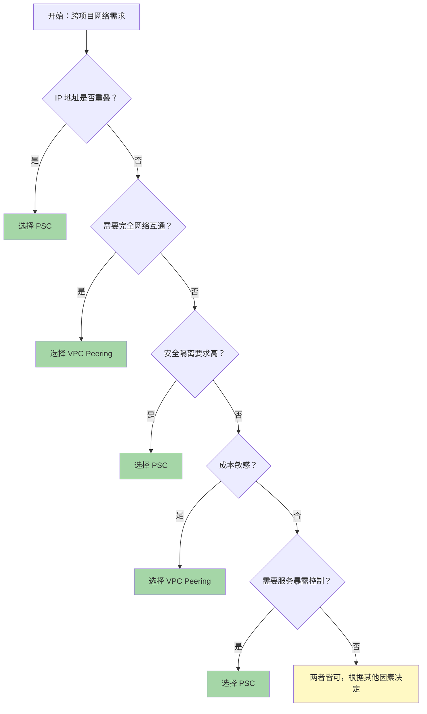

# PSC vs VPC Peering - Quota 与 Cost 对比指南

## 概述

本文档详细对比了 **Private Service Connect (PSC)** 和 **VPC Network Peering** 的配额限制 (Quota) 和成本 (Cost)，帮助您在 Google Cloud 跨项目网络架构设计中做出正确的技术选型和成本预估。

---

## 一、Quota 对比

### 1.1 PSC Quota 限制

#### Producer 端（服务提供者）

| 配额项 | 限制 | 范围 | 配额名称 | 是否可申请增加 |
|--------|------|------|----------|---------------|
| **Service Attachments** | 依区域而定 | 每区域/每项目 | `SERVICE-ATTACHMENTS-per-project-region` | ✅ 可以 |
| **Service Connection Maps** | 依区域而定 | 每区域/每项目 | `RegionalPerProjectServiceConnectionMaps` | ✅ 可以 |
| **PSC ILB Consumer Forwarding Rules** | 依网络而定 | 每 Producer VPC 网络（所有区域） | `PSC_ILB_CONSUMER_FORWARDING_RULES_PER_PRODUCER_NETWORK` | ⚠️ 需支持工单 |

#### Consumer 端（服务消费者）

| 配额项 | 限制 | 范围 | 配额名称 | 是否可申请增加 |
|--------|------|------|----------|---------------|
| **PSC Internal LB Forwarding Rules** | 依区域而定 | 每区域/每项目 | `PSC-INTERNAL-LB-FORWARDING-RULES-per-project-region` | ✅ 可以 |
| **Regional Endpoints** | 依区域而定 | 每区域/每项目 | `RegionalPerProjectRegionalEndpoints` | ✅ 可以 |
| **PSC Google APIs Forwarding Rules** | 固定限制 | 每 VPC 网络（所有区域） | `PSC_GOOGLE_APIS_FORWARDING_RULES_PER_NETWORK` | ❌ 不可增加 |
| **Network Attachments** | 依区域而定 | 每区域/每项目 | `NETWORK-ATTACHMENTS-per-project-region` | ✅ 可以 |

#### 连接数限制

| 配额项 | 限制 | 范围 | 配额名称 |
|--------|------|------|----------|
| **PSC Propagated Connections** | 依网络而定 | 每 VPC 网络 | `PSC_PROPAGATED_CONNECTIONS_PER_VPC_NETWORK` |
| **Connections per Service Attachment** | 在创建时指定 | 每个 Service Attachment | 在 `--consumer-accept-list` 中定义 |

---

### 1.2 VPC Peering Quota 限制

| 配额项 | 限制 | 范围 | 配额名称 | 是否可申请增加 |
|--------|------|------|----------|---------------|
| **Peerings per VPC Network** | 依项目而定 | 每 VPC 网络 | `PEERINGS_PER_NETWORK` | ✅ 可以 |
| **Subnet Ranges per Peering Group** | 依项目而定 | 每个 Peering 组 | `SUBNET_RANGES_PEERING_GROUP` | ⚠️ 需支持工单 |
| **Static Routes per Peering Group** | 依项目而定 | 每个 Peering 组 | `STATIC_ROUTES_PER_PEERING_GROUP` | ⚠️ 需支持工单 |
| **Dynamic Routes per Region per Peering Group** | 依项目而定 | 每区域/每个 Peering 组 | `DYNAMIC_ROUTES_PER_REGION_PER_PEERING_GROUP` | ⚠️ 需支持工单 |

**重要说明：**
- **Peering Group（对等组）**：指本地 VPC 网络加上所有直接连接的 Peer 网络
- **有效限制**：每个 Peering Group 配额的有效限制是根据所有对等网络的限制计算的
- **非传递性**：VPC Peering 不是传递的，A↔B 和 B↔C 不意味着 A↔C

---

### 1.3 Quota 对比总结

| 特性 | PSC | VPC Peering |
|------|-----|-------------|
| **主要限制维度** | 每区域/每项目 | 每网络/每 Peering 组 |
| **连接数限制** | 每个 Service Attachment 可指定 | 每个 VPC 网络的 Peering 数量有限制 |
| **路由限制** | 无（独立路由） | 有（共享路由表） |
| **子网限制** | 无 | Peering Group 内子网数量有限制 |
| **扩展性** | 高（可创建多个 Service Attachment） | 中（受 Peering 数量限制） |
| **配额管理复杂度** | 中 | 高（需考虑 Peering Group 整体） |

---

## 二、Cost 对比

### 2.1 PSC 成本结构

#### Consumer 端费用

| 费用项 | 价格 (USD) | 计费单位 | 备注 |
|--------|-----------|----------|------|
| **PSC Endpoint 小时费** | $0.01 | 每小时/每个端点 | 访问 Google APIs 或 Published Service |
| **Consumer 数据处理费** | $0.01/GiB | 每 GiB（0-1 PiB） | 入站 + 出站 |
| | $0.006/GiB | 每 GiB（1-5 PiB） | 阶梯定价 |
| | $0.004/GiB | 每 GiB（5 PiB 以上） | 阶梯定价 |
| **跨区域数据传输费** | 依区域而定 | 每 GiB | 仅当使用 Global Access 且跨区域访问时 |
| **跨区域 Zone 传输费** | $0 | - | PSC Endpoint 流量免收 Zone 间传输费 |

**数据处理费阶梯：**
```
0 GiB - 1 PiB:    $0.01/GiB
1 PiB - 5 PiB:    $0.006/GiB
5 PiB 以上：$0.004/GiB
```

#### Producer 端费用

| 费用项 | 价格 (USD) | 计费单位 | 备注 |
|--------|-----------|----------|------|
| **Service Attachment** | $0 | - | 无 PSC 小时费或数据传输费 |
| **Load Balancer 费用** | 依类型而定 | - | 发布服务时使用的负载均衡器费用 |
| **跨区域数据传输费** | $0 | - | Producer 端不收取跨区域传输费 |

**Producer 注意事项：**
- 发布 Managed Service（如 Cloud SQL）通过 Service Attachment：**无 PSC 费用**
- 使用 Service Connection Maps 部署服务：**无 Producer 费用**
- Producer 仅需支付 Load Balancer 相关费用

---

### 2.2 VPC Peering 成本结构

| 费用项 | 价格 (USD) | 计费单位 | 备注 |
|--------|-----------|----------|------|
| **VPC Peering 建立** | $0 | - | 免费 |
| **同区域流量** | $0 | - | 免费 |
| **跨区域流量** | 依区域而定 | 每 GiB | Inter-region Data Transfer |
| **跨 Zone 流量** | $0 | - | 同区域内跨 Zone 免费 |
| **Internet Egress** | 依目的地而定 | 每 GiB | 访问公网的费用 |

**跨区域数据传输费率示例（Asia 区域内）：**
```
asia-east2 ↔ asia-east1: $0.01/GiB
asia-east2 ↔ us-central1: $0.12/GiB
asia-east2 ↔ europe-west1: $0.12/GiB
```

---

### 2.3 Cost 对比总结

| 费用项 | PSC | VPC Peering |
|--------|-----|-------------|
| **连接建立费** | $0 | $0 |
| **小时费** | $0.01/小时/端点 | $0 |
| **数据处理费** | $0.01/GiB (阶梯定价) | $0 (同区域) |
| **跨区域传输费** | Consumer 支付 | 双方各自支付 |
| **跨 Zone 传输费** | $0 | $0 (同区域) |
| **Load Balancer 费** | Producer 支付 | 如使用则支付 |
| **总体成本** | 中高 | 低 |

---

## 三、成本计算示例

### 3.1 场景 1：跨项目数据库访问

**需求：**
- Consumer 项目需要访问 Producer 项目的 Cloud SQL
- 月流量：500 GB
- 同区域（asia-east2）
- 7x24 小时运行

#### PSC 方案成本

```
Consumer 端：
- Endpoint 小时费：$0.01 × 24 × 30 = $7.20/月
- 数据处理费：500 GB × $0.01/GB = $5.00/月
- 总计：$12.20/月

Producer 端：
- Service Attachment：$0
- Cloud SQL 费用：正常计费（与 PSC 无关）
- 总计：$0/月（仅 PSC 相关）
```

#### VPC Peering 方案成本

```
Consumer 端：
- Peering 建立：$0
- 同区域流量：$0
- 总计：$0/月

Producer 端：
- Peering 建立：$0
- 总计：$0/月
```

**结论：** 此场景 VPC Peering 更经济（节省 $12.20/月）

---

### 3.2 场景 2：跨项目 API 服务暴露

**需求：**
- Producer 项目有 GKE 应用需要暴露给 5 个 Consumer 项目
- 每个 Consumer 月流量：100 GB
- 同区域（asia-east2）
- 7x24 小时运行
- 需要 Internal Load Balancer

#### PSC 方案成本

```
Consumer 端（单个项目）：
- Endpoint 小时费：$0.01 × 24 × 30 = $7.20/月
- 数据处理费：100 GB × $0.01/GB = $1.00/月
- 单个 Consumer 总计：$8.20/月
- 5 个 Consumer 总计：$41.00/月

Producer 端：
- Service Attachment：$0
- Internal Load Balancer：
  - LB 规则费：$0.025/小时 × 24 × 30 = $18.00/月
  - 数据处理费：500 GB × $0.008/GB = $4.00/月
- Producer 总计：$22.00/月

整体总计：$63.00/月
```

#### VPC Peering 方案成本

```
Consumer 端（单个项目）：
- Peering 建立：$0
- 同区域流量：$0
- 单个 Consumer 总计：$0/月
- 5 个 Consumer 总计：$0/月

Producer 端：
- Peering 建立（5 个）：$0
- Internal Load Balancer（如使用）：
  - LB 规则费：$18.00/月
  - 数据处理费：$4.00/月
- Producer 总计：$22.00/月

整体总计：$22.00/月
```

**结论：** 此场景 VPC Peering 更经济（节省 $41.00/月），但需考虑：
- IP 地址规划复杂度
- 安全隔离要求
- 网络管理复杂度

---

### 3.3 场景 3：跨区域服务访问

**需求：**
- Consumer 在 asia-east2，Producer 在 us-central1
- 月流量：1 TB
- 使用 PSC Global Access 或 VPC Peering

#### PSC 方案成本

```
Consumer 端：
- Endpoint 小时费：$0.01 × 24 × 30 = $7.20/月
- 数据处理费：1000 GB × $0.01/GB = $10.00/月
- 跨区域传输费（asia↔us）：1000 GB × $0.12/GB = $120.00/月
- Consumer 总计：$137.20/月

Producer 端：
- Service Attachment：$0
- 跨区域传输费：$0（Producer 不承担）
- Producer 总计：$0/月

整体总计：$137.20/月
```

#### VPC Peering 方案成本

```
Consumer 端：
- Peering 建立：$0
- 跨区域传输费（asia↔us）：1000 GB × $0.12/GB = $120.00/月
- Consumer 总计：$120.00/月

Producer 端：
- Peering 建立：$0
- 跨区域传输费（返回流量）：依实际返回流量而定
- Producer 总计：依返回流量而定

整体总计：~$240.00/月（双向流量）
```

**结论：** 此场景 PSC 更经济（节省 ~$100/月），因为 Producer 不承担跨区域传输费

---

## 四、Quota 管理最佳实践

### 4.1 PSC Quota 管理

#### 监控配额使用

```bash
# 查看 Service Attachment 使用情况
gcloud compute service-attachments list --project=PROJECT_ID

# 查看 PSC Endpoint 使用情况
gcloud compute forwarding-rules list --project=PROJECT_ID \
    --filter="loadBalancingScheme=INTERNAL_MANAGED"

# 查看配额使用情况
gcloud compute project-info describe --project=PROJECT_ID \
    | grep -A 5 "SERVICE-ATTACHMENTS"
```

#### 配额优化建议

| 建议 | 说明 |
|------|------|
| **合并 Service Attachments** | 同一服务的多个端点可共享一个 Service Attachment |
| **合理设置连接数限制** | 在 `--consumer-accept-list` 中设置适当的连接数 |
| **使用 Regional 而非 Global** | Regional Endpoint 配额更灵活 |
| **定期清理未使用端点** | 删除不再使用的 PSC Endpoint 释放配额 |

---

### 4.2 VPC Peering Quota 管理

#### 监控配额使用

```bash
# 查看 VPC Peering 状态
gcloud compute networks peerings list --project=PROJECT_ID \
    --network=VPC_NAME

# 查看路由表使用情况
gcloud compute routes list --project=PROJECT_ID \
    --filter="network:VPC_NAME"

# 查看子网数量
gcloud compute networks subnets list --project=PROJECT_ID \
    --format="table(name,region,ipCidrRange)"
```

#### 配额优化建议

| 建议 | 说明 |
|------|------|
| **使用 Hub-Spoke 架构** | 减少 Peering 数量，集中管理 |
| **聚合子网 CIDR** | 使用更大的 CIDR 块，减少子网数量 |
| **优化路由表** | 合并相似路由，减少路由条目 |
| **定期审计 Peering** | 移除不再使用的 Peering 连接 |

---

## 五、成本管理最佳实践

### 5.1 PSC 成本优化

#### 降低小时费

```bash
# 合并多个服务到一个 Endpoint（如适用）
# 减少不必要的 Endpoint 数量
```

| 策略 | 节省效果 |
|------|----------|
| 合并 Endpoint | 每个合并节省 $7.20/月 |
| 使用自动关闭 | 非生产环境节省 50-70% |
| 选择正确区域 | 避免跨区域传输费 |

#### 降低数据处理费

| 策略 | 说明 |
|------|------|
| **数据压缩** | 减少传输数据量 |
| **缓存策略** | 减少重复数据传输 |
| **批量处理** | 合并小请求为大请求 |
| **选择正确区域** | 同区域部署 Consumer 和 Producer |

#### 成本监控

```bash
# 查看 PSC 相关账单
gcloud billing accounts list

# 使用 Cloud Monitoring 创建预算告警
gcloud billing budgets create \
    --billing-account=ACCOUNT_ID \
    --display-name="PSC Budget" \
    --budget-amount=100USD \
    --threshold-rule=percent=0.5,spend_basis=FORECASTED_SPEND
```

---

### 5.2 VPC Peering 成本优化

#### 降低跨区域传输费

| 策略 | 说明 |
|------|------|
| **同区域部署** | Consumer 和 Producer 部署在同一区域 |
| **数据本地化** | 在数据产生地处理，减少传输 |
| **压缩传输** | 使用压缩减少数据量 |
| **批量传输** | 合并小文件为大文件 |

#### 成本监控

```bash
# 查看网络传输费用
gcloud billing accounts list

# 创建网络传输预算告警
gcloud billing budgets create \
    --billing-account=ACCOUNT_ID \
    --display-name="Network Transfer Budget" \
    --budget-amount=500USD \
    --threshold-rule=percent=0.8,spend_basis=FORECASTED_SPEND
```

---

## 六、决策矩阵

### 6.1 技术选型决策树



### 6.2 综合对比表

| 维度 | PSC | VPC Peering | 胜出者 |
|------|-----|-------------|--------|
| **Quota 灵活性** | 高（每区域独立） | 中（受 Peering Group 限制） | PSC |
| **同区域成本** | 中（$0.01/GB + 小时费） | 低（免费） | VPC Peering |
| **跨区域成本** | 中（Consumer 单方支付） | 高（双向支付） | PSC |
| **IP 重叠支持** | ✅ 支持 | ❌ 不支持 | PSC |
| **安全隔离** | 高（独立路由） | 中（共享路由） | PSC |
| **配置复杂度** | 中 | 低 | VPC Peering |
| **管理复杂度** | 低 | 中 | PSC |
| **扩展性** | 高 | 中 | PSC |
| **适用场景** | 服务暴露、高安全要求 | 完全互通、成本敏感 | - |

---

## 七、实际案例参考

### 7.1 案例 1：多租户 SaaS 平台

**背景：**
- 1 个 Producer 项目（共享服务）
- 50 个 Consumer 项目（租户）
- 同区域部署
- 月流量：每租户 50 GB

**方案选择：PSC**

**原因：**
1. 需要服务暴露控制（每个租户独立访问）
2. 高安全隔离要求（租户间隔离）
3. IP 地址可能重叠（租户自有 VPC）

**成本估算：**
```
Consumer 端（单租户）：
- Endpoint 小时费：$7.20/月
- 数据处理费：50 GB × $0.01 = $0.50/月
- 单租户总计：$7.70/月
- 50 租户总计：$385.00/月

Producer 端：
- Service Attachment：$0
- Load Balancer：$22.00/月
- Producer 总计：$22.00/月

整体总计：$407.00/月
```

---

### 7.2 案例 2：企业内部多项目架构

**背景：**
- 4 个项目（生产、测试、开发、共享服务）
- 需要完全网络互通
- 同区域部署
- 月流量：项目间 2 TB

**方案选择：VPC Peering (Hub-Spoke)**

**原因：**
1. 需要完全网络互通
2. 成本敏感（内部系统）
3. IP 地址可统一规划（不重叠）

**成本估算：**
```
Peering 建立：
- Hub-Spoke 架构：3 个 Peering
- 建立费用：$0

同区域流量：
- 项目间传输：$0（同区域免费）

整体总计：$0/月（仅 Peering 相关）
```

---

### 7.3 案例 3：跨区域灾难恢复

**背景：**
- Primary 区域：asia-east2
- DR 区域：us-central1
- 月复制流量：5 TB
- 需要双向数据同步

**方案选择：PSC**

**原因：**
1. 跨区域成本优化（Producer 不承担传输费）
2. 安全隔离要求（生产与 DR 隔离）
3. 简化管理（独立路由）

**成本估算：**
```
Consumer 端（DR 站点）：
- Endpoint 小时费：$7.20/月
- 数据处理费：5000 GB × $0.006 = $30.00/月（1-5 PiB 阶梯）
- 跨区域传输费：5000 GB × $0.12 = $600.00/月
- Consumer 总计：$637.20/月

Producer 端（Primary 站点）：
- Service Attachment：$0
- 跨区域传输费：$0
- Producer 总计：$0/月

整体总计：$637.20/月

如使用 VPC Peering：
- 双向传输费：$1200.00/月
- 节省：$562.80/月
```

---

## 八、监控和告警

### 8.1 PSC 监控指标

```bash
# 创建 PSC 使用量监控
gcloud monitoring metrics-descriptors create psc-usage.yaml <<EOF
name: projects/PROJECT_ID/metricDescriptors/custom/psc/usage
type: custom.googleapis.com/psc/endpoint_count
valueType: INT64
metricKind: GAUGE
description: PSC Endpoint 数量监控
EOF

# 创建 PSC 成本告警
gcloud alpha monitoring policies create psc-budget-alert.yaml <<EOF
combiner: OR
conditions:
- displayName: PSC 成本超预算
  conditionThreshold:
    filter: metric.type="billing.googleapis.com/cost"
    comparison: COMPARISON_GT
    thresholdValue: 100
notificationChannels:
- projects/PROJECT_ID/notificationChannels/CHANNEL_ID
EOF
```

### 8.2 VPC Peering 监控指标

```bash
# 创建 Peering 状态监控
gcloud monitoring metrics-descriptors create peering-status.yaml <<EOF
name: projects/PROJECT_ID/metricDescriptors/custom/peering/status
type: custom.googleapis.com/vpc/peering/status
valueType: INT64
metricKind: GAUGE
description: VPC Peering 状态监控 (1=Active, 0=Inactive)
EOF

# 创建 Peering 断开告警
gcloud alpha monitoring policies create peering-down-alert.yaml <<EOF
combiner: OR
conditions:
- displayName: VPC Peering 连接断开
  conditionThreshold:
    filter: metric.type="custom.googleapis.com/vpc/peering/status"
    comparison: COMPARISON_LT
    thresholdValue: 1
notificationChannels:
- projects/PROJECT_ID/notificationChannels/CHANNEL_ID
EOF
```

---

## 九、总结

### 9.1 Quota 关键要点

| 要点 | PSC | VPC Peering |
|------|-----|-------------|
| **主要限制** | 每区域 Service Attachment 数量 | 每网络 Peering 数量 |
| **扩展性** | 高（可创建多个端点） | 中（受 Peering Group 限制） |
| **管理复杂度** | 低（独立配额） | 中（需考虑整体） |

### 9.2 Cost 关键要点

| 要点 | PSC | VPC Peering |
|------|-----|-------------|
| **同区域成本** | $0.01/GB + $0.01/小时 | 免费 |
| **跨区域成本** | Consumer 单方支付 | 双向支付 |
| **小时费** | $0.01/小时/端点 | 免费 |
| **最佳场景** | 跨区域、服务暴露 | 同区域、完全互通 |

### 9.3 选型建议

**选择 PSC 如果：**
- ✅ IP 地址重叠
- ✅ 需要高安全隔离
- ✅ 跨区域服务访问
- ✅ 需要服务暴露控制
- ✅ 多租户架构

**选择 VPC Peering 如果：**
- ✅ IP 地址不重叠
- ✅ 需要完全网络互通
- ✅ 同区域部署
- ✅ 成本敏感
- ✅ 简单架构

### 9.4 混合架构

在实际企业中，**PSC 和 VPC Peering 通常会同时使用**：

```
Hub VPC (共享服务)
├── VPC Peering ↔ Production VPC
├── VPC Peering ↔ Development VPC
├── VPC Peering ↔ Testing VPC
└── PSC Endpoint ↔ External Partner Services
```

这种混合架构可以：
- 利用 VPC Peering 的低成本实现内部互通
- 利用 PSC 的高安全性访问外部服务
- 优化整体成本和安全性
