# VPC Peering 概念指南

## 核心概念

### 什么是 VPC Peering？

**VPC Peering** 是 Google Cloud 中连接两个 VPC 网络的机制，允许两个 VPC 中的资源通过内部 IP 地址直接通信。VPC Peering 的核心特点是：

1. **路由共享**：两个 VPC 的路由表会交换路由信息
2. **私有连接**：流量通过 Google 内部网络传输，不经过公网
3. **低延迟**：与公网相比，延迟更低，性能更稳定
4. **双向通信**：默认情况下，Peering 是双向的（除非配置了自定义路由）

### VPC Peering vs PSC

| 特性 | VPC Peering | PSC (Private Service Connect) |
|------|-------------|------------------------------|
| **主要用途** | 连接两个 VPC，实现资源互访 | 访问特定服务（自建/第三方） |
| **底层技术** | VPC 对等连接 | Private Endpoint + Internal Load Balancer |
| **网络模型** | 共享路由空间 | 独立路由，完全隔离 |
| **IP 重叠** | ❌ **不允许** | ✅ **允许** |
| **路由传播** | 自动交换路由 | 不需要路由配置 |
| **安全隔离** | 中等（路由共享） | 高（完全隔离） |
| **跨项目支持** | ✅ 支持 | ✅ 支持 |
| **配置复杂度** | 简单 | 中等 |

---

## Cross-Project VPC Peering 网络要求

### 1. IP 地址要求

| 要求 | 说明 |
|------|------|
| **IP 不能重叠** | ❌ 两个 VPC 的 CIDR 范围**绝对不能重叠**，否则路由无法正确传播 |
| **子网规划** | 需要提前规划好每个 VPC 的 IP 范围，避免未来扩展时冲突 |
| **预留空间** | 建议预留足够的 IP 空间用于未来扩展 |

### 2. VPC Peering 限制

| 限制 | 说明 |
|------|------|
| **非传递性** | VPC Peering 不是传递的。如果 VPC A ↔ VPC B，VPC B ↔ VPC C，VPC A 无法直接访问 VPC C |
| **重叠 CIDR** | 任何重叠的 CIDR 范围都会导致 Peering 失败 |
| **区域限制** | 支持同区域和跨区域 Peering |

### 3. 网络拓扑示例

```mermaid
graph TB
    subgraph "Project A"
        A1[VPC-A<br/>10.0.0.0/16]
        A2[Subnet-A1<br/>10.0.1.0/24]
        A3[Subnet-A2<br/>10.0.2.0/24]
    end

    subgraph "Project B"
        B1[VPC-B<br/>10.1.0.0/16]
        B2[Subnet-B1<br/>10.1.1.0/24]
        B3[Subnet-B2<br/>10.1.2.0/24]
    end

    subgraph "Project C"
        C1[VPC-C<br/>10.2.0.0/16]
        C2[Subnet-C1<br/>10.2.1.0/24]
    end

    W[⚠️ VPC Peering 不是传递的<br/>A 无法直接访问 C]

    A1 -.->|VPC Peering| B1
    B1 -.->|VPC Peering| C1

    A2 --> A1
    A3 --> A1
    B2 --> B1
    B3 --> B1
    C2 --> C1

    style A1 fill:#e3f2fd
    style B1 fill:#fff3e0
    style C1 fill:#f3e5f5
    style W fill:#ffebee,stroke:#c62828,stroke-width:2px
```



**重要说明：**
- VPC-A 可以与 VPC-B 通信
- VPC-B 可以与 VPC-C 通信
- 但 **VPC-A 无法直接与 VPC-C 通信**（Peering 不是传递的）

---

## VPC Peering 配置步骤

### 前置条件

1. **确认 IP 范围不重叠**

```bash
# 查看 Project A 的 VPC 网络
gcloud compute networks describe vpc-a --project=project-a

# 查看 Project B 的 VPC 网络
gcloud compute networks describe vpc-b --project=project-b
```

2. **规划 IP 地址**

| 项目 | VPC 名称 | CIDR 范围 |
|------|---------|----------|
| Project A | vpc-a | 10.0.0.0/16 |
| Project B | vpc-b | 10.1.0.0/16 |
| Project C | vpc-c | 10.2.0.0/16 |

### 配置步骤

#### 步骤 1：在 Project A 中创建 Peering

```bash
gcloud compute networks peerings create vpc-a-to-vpc-b \
    --project=project-a \
    --network=vpc-a \
    --peer-network=vpc-b \
    --peer-project=project-b \
    --auto-create-routes
```

**参数说明：**
- `--auto-create-routes`：自动创建路由，将 Peer VPC 的 CIDR 添加到本地路由表

#### 步骤 2：在 Project B 中创建 Peering

```bash
gcloud compute networks peerings create vpc-b-to-vpc-a \
    --project=project-b \
    --network=vpc-b \
    --peer-network=vpc-a \
    --peer-project=project-a \
    --auto-create-routes
```

**注意：** VPC Peering 需要在两端都创建，即使使用了 `--auto-create-routes`

#### 步骤 3：验证 Peering 状态

```bash
# 查看 Project A 的 Peering 状态
gcloud compute networks peerings list --project=project-a --network=vpc-a

# 查看 Project B 的 Peering 状态
gcloud compute networks peerings list --project=project-b --network=vpc-b
```

**预期输出：**
```
NAME: vpc-a-to-vpc-b
NETWORK: vpc-a
PEER_NETWORK: projects/project-b/global/networks/vpc-b
STATE: ACTIVE
STATE_DETAILS: NONE
```

---

## 防火墙规则配置

### 为什么需要防火墙规则？

VPC Peering 建立后，两个 VPC 的路由已经打通，但**防火墙规则仍然需要单独配置**。

### 配置示例

#### Project A - 允许来自 Project B 的流量

```bash
# 允许来自 VPC-B 的所有流量
gcloud compute firewall-rules create allow-from-vpc-b \
    --project=project-a \
    --network=vpc-a \
    --source-ranges=10.1.0.0/16 \
    --action=ALLOW \
    --rules=tcp,udp,icmp

# 或者只允许特定端口
gcloud compute firewall-rules create allow-http-from-vpc-b \
    --project=project-a \
    --network=vpc-a \
    --source-ranges=10.1.0.0/16 \
    --action=ALLOW \
    --rules=tcp:80,tcp:443
```

#### Project B - 允许来自 Project A 的流量

```bash
# 允许来自 VPC-A 的所有流量
gcloud compute firewall-rules create allow-from-vpc-a \
    --project=project-b \
    --network=vpc-b \
    --source-ranges=10.0.0.0/16 \
    --action=ALLOW \
    --rules=tcp,udp,icmp
```

---

## 路由配置

### 自动路由 vs 自定义路由

#### 自动路由（推荐）

使用 `--auto-create-routes` 参数时，Google Cloud 会自动创建路由：

```bash
gcloud compute networks peerings create vpc-a-to-vpc-b \
    --project=project-a \
    --network=vpc-a \
    --peer-network=vpc-b \
    --peer-project=project-b \
    --auto-create-routes
```

**自动创建的路由：**
- 目标：`10.1.0.0/16`（VPC-B 的 CIDR）
- 下一跳：`vpc-a-to-vpc-b`（Peering 连接）

#### 自定义路由

如果需要更精细的路由控制，可以不使用 `--auto-create-routes`，而是手动创建路由：

```bash
# 不自动创建路由
gcloud compute networks peerings create vpc-a-to-vpc-b \
    --project=project-a \
    --network=vpc-a \
    --peer-network=vpc-b \
    --peer-project=project-b

# 手动创建特定子网的路由
gcloud compute routes create route-to-vpc-b-subnet1 \
    --project=project-a \
    --network=vpc-a \
    --destination-range=10.1.1.0/24 \
    --next-hop-peer=vpc-a-to-vpc-b
```

---

## 验证和测试

### 1. 检查 Peering 状态

```bash
# 查看 Peering 详细信息
gcloud compute networks peerings describe vpc-a-to-vpc-b \
    --project=project-a \
    --network=vpc-a
```

### 2. 检查路由表

```bash
# 查看 Project A 的路由表
gcloud compute routes list --project=project-a \
    --filter="network:vpc-a"
```

**预期输出应包含：**
```
NAME: route-to-vpc-b
NETWORK: vpc-a
DEST_RANGE: 10.1.0.0/16
NEXT_HOP: vpc-a-to-vpc-b
```

### 3. 网络连通性测试

```bash
# 在 Project A 的 VM 上测试
gcloud compute ssh vm-a --project=project-a --zone=asia-east2-a -- \
    "ping -c 4 10.1.1.10"  # 10.1.1.10 是 Project B 中 VM 的内部 IP

# 使用 telnet 测试特定端口
gcloud compute ssh vm-a --project=project-a --zone=asia-east2-a -- \
    "nc -zv 10.1.1.10 80"
```

### 4. 使用 VPC Flow Logs 调试

```bash
# 启用 VPC Flow Logs（需要在子网级别配置）
gcloud compute networks subnets update subnet-a \
    --project=project-a \
    --region=asia-east2 \
    --enable-flow-logs

# 查看 Flow Logs
gcloud logging read "resource.type=gce_subnetwork AND \
    jsonPayload.connection.src_ip=10.0.1.10 AND \
    jsonPayload.connection.dest_ip=10.1.1.10" \
    --project=project-a \
    --limit=50
```

---

## 常见问题排查

### 问题 1：Peering 状态为 INACTIVE

**可能原因：**
- 另一端未创建 Peering
- IP 范围重叠
- 项目权限不足

**解决方法：**
```bash
# 检查两端 Peering 状态
gcloud compute networks peerings list --project=project-a
gcloud compute networks peerings list --project=project-b

# 检查 IP 范围是否重叠
gcloud compute networks describe vpc-a --project=project-a \
    --format="value(subnets[].ipCidrRange)"
gcloud compute networks describe vpc-b --project=project-b \
    --format="value(subnets[].ipCidrRange)"
```

### 问题 2：无法 Ping 通对端 VM

**排查步骤：**

1. **检查路由表**
```bash
gcloud compute routes list --project=project-a \
    --filter="destination_range:10.1.0.0/16"
```

2. **检查防火墙规则**
```bash
# 查看 Project B 的入站规则
gcloud compute firewall-rules list --project=project-b \
    --filter="direction:INGRESS"
```

3. **检查 VM 防火墙**
```bash
# 在 VM 内部检查防火墙状态
gcloud compute ssh vm-b --project=project-b --zone=asia-east2-a -- \
    "sudo iptables -L -n"
```

### 问题 3：DNS 解析问题

**解决方案：**

1. **启用 DNS Peering**（如果需要跨 VPC 解析内部域名）

```bash
# 创建 DNS Peering
gcloud dns managed-zones create dns-peering-zone \
    --project=project-a \
    --dns-name=internal.example.com. \
    --visibility=private \
    --peering-target-name=peer-dns-zone \
    --peering-target-network=vpc-b \
    --peering-target-project=project-b
```

2. **配置 VM 使用内部 DNS**

```bash
# 在 VM 中配置 DNS
echo "nameserver 169.254.169.254" | sudo tee /etc/resolv.conf
```

---

## VPC Peering 最佳实践

### 1. IP 地址规划

| 建议 | 说明 |
|------|------|
| **使用不同的 CIDR 范围** | 每个 VPC 使用不同的 /16 或 /8 范围 |
| **预留扩展空间** | 为每个 VPC 预留足够的 IP 空间 |
| **文档化** | 记录所有 VPC 的 CIDR 范围和用途 |

**示例规划：**
```
Project A (生产环境): 10.0.0.0/16
Project B (测试环境): 10.1.0.0/16
Project C (开发环境): 10.2.0.0/16
Project D (共享服务): 10.3.0.0/16
```

### 2. 网络拓扑设计

```mermaid
graph TB
    subgraph "Hub-Spoke 架构"
        H[Hub VPC<br/>共享服务<br/>10.3.0.0/16]
        S1[Spoke 1<br/>生产环境<br/>10.0.0.0/16]
        S2[Spoke 2<br/>测试环境<br/>10.1.0.0/16]
        S3[Spoke 3<br/>开发环境<br/>10.2.0.0/16]
        N[💡 Hub-Spoke 架构<br/>所有 Spoke 通过 Hub 通信]
    end

    H --> S1
    H --> S2
    H --> S3

    style H fill:#e3f2fd
    style S1 fill:#fff3e0
    style S2 fill:#f3e5f5
    style S3 fill:#e8f5e8
    style N fill:#e8f5e9,stroke:#4caf50,stroke-width:2px
```



**Hub-Spoke 架构优势：**
- 集中管理共享服务（DNS、防火墙、监控）
- 简化网络拓扑
- 便于实施安全策略

### 3. 安全控制

| 措施 | 说明 |
|------|------|
| **最小权限原则** | 只开放必要的端口和协议 |
| **网络标签** | 使用网络标签精细化控制防火墙规则 |
| **VPC Service Controls** | 实施数据边界，防止数据泄露 |
| **Flow Logs** | 启用流日志进行审计和故障排除 |

### 4. 监控和告警

```bash
# 创建监控指标
gcloud monitoring metrics-descriptors create peering-status.yaml <<EOF
name: projects/PROJECT_ID/metricDescriptors/custom/peering/status
type: custom.googleapis.com/vpc/peering/status
valueType: INT64
metricKind: GAUGE
valueType: STRING
description: VPC Peering 状态监控
EOF

# 创建告警策略
gcloud alpha monitoring policies create peering-alert.yaml <<EOF
combiner: OR
conditions:
- displayName: VPC Peering 断开
  conditionThreshold:
    filter: metric.type="custom.googleapis.com/vpc/peering/status"
    comparison: COMPARISON_LT
    thresholdValue: 1
notificationChannels:
- projects/PROJECT_ID/notificationChannels/CHANNEL_ID
EOF
```

---

## VPC Peering vs PSC 选择指南

### 使用 VPC Peering 的场景

| 场景 | 说明 |
|------|------|
| **需要完全网络互通** | 两个 VPC 中的资源需要互相访问 |
| **简单架构** | 不需要复杂的服务暴露控制 |
| **IP 范围不重叠** | 可以确保两个 VPC 的 CIDR 不重叠 |
| **成本敏感** | VPC Peering 免费（仅标准网络费用） |

### 使用 PSC 的场景

| 场景 | 说明 |
|------|------|
| **服务暴露** | 只需要暴露特定服务，不需要完全网络互通 |
| **IP 范围重叠** | 两个 VPC 的 CIDR 可能重叠 |
| **高安全要求** | 需要完全隔离，不共享路由 |
| **跨组织访问** | 需要访问第三方或合作伙伴服务 |

---

## 总结

### 核心要点

1. **VPC Peering 是什么**：连接两个 VPC 网络的机制，允许资源通过内部 IP 直接通信
2. **跨项目网络要求**：
   - VPC IP **绝对不能重叠**（路由共享）
   - 需要在两端都创建 Peering 连接
   - 需要配置防火墙规则允许流量
3. **IP Range 定义**：
   - IP 地址不能重叠，否则 Peering 会失败
   - 需要提前规划好每个 VPC 的 CIDR 范围
   - 建议使用 Hub-Spoke 架构简化网络拓扑
4. **与 PSC 的区别**：
   - VPC Peering 是"完全互通"
   - PSC 是"点对点服务访问"
   - 根据场景选择合适的连接方式

### 最佳实践

1. **IP 规划**：提前规划好所有 VPC 的 CIDR 范围，避免重叠
2. **文档化**：记录所有 VPC Peering 连接和用途
3. **安全控制**：使用最小权限原则配置防火墙规则
4. **监控**：启用 VPC Flow Logs 和 Peering 状态监控
5. **Hub-Spoke 架构**：对于多 VPC 场景，考虑使用 Hub-Spoke 架构简化拓扑
