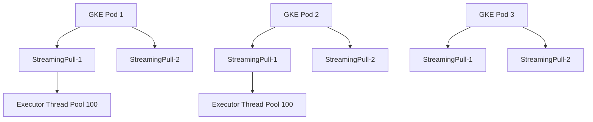
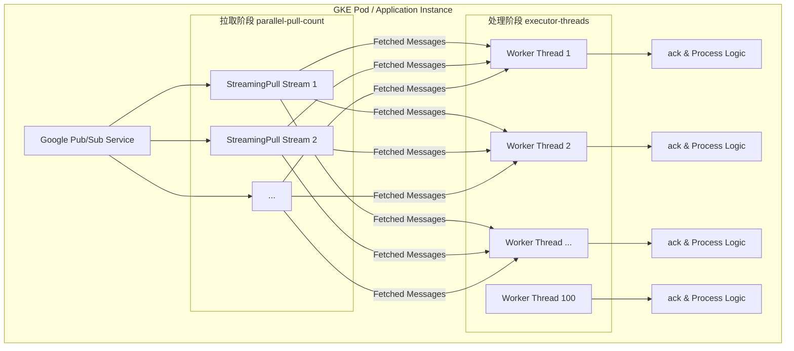

# A

多 Pod 拉取并发能力 每个 Pod 都有独立 StreamingPull 连接并独立 ack. 我目前配置了 100 个线程来处理消息.也就是

设置 spring.cloud.gcp.pubsub.subscriber.executor-threads 为 100.因为我是 IO 密集型任务,所以线程占用内存不大. 这样会确保我有足够的线程来接收消息.

我们系统采用的是一种“**收到即确认**”（Acknowledge on Receipt）的模式。这意味着 `ScheduleService` 在从 Pub/Sub 拉取到消息后，会**立即调用 `consumer.ack()`**，然后再去执行后续的业务逻辑（如调用 Backend API）。

那么如果这样还是发现有 unacked-message-by-region 那么如何优化?

如何合理设置 StreamingPull ? Spring 里面有这个 spring.cloud.gcp.pubsub.subscriber.parallel-pull-count 参数?

如何设置合理值?

# Chatgtp

你目前的系统使用 **“收到即确认（Acknowledge on Receipt）”** 的策略，在 IO 密集场景下配合高线程数（如 executor-threads=100）是合理的。但如果你仍然看到 unacked_messages_by_region 指标**持续不为 0 或持续增长**，说明可能还有 **StreamingPull 的调优空间**

# **✅ 问题定位与优化建议**

## 📌 一、你目前的配置回顾

| 参数               | 当前配置                                       | 说明                                                          |
| ------------------ | ---------------------------------------------- | ------------------------------------------------------------- |
| `executor-threads` | 100                                            | 用于处理消息回调（`messageReceiver`）的线程池，适合 IO 密集型 |
| ack 策略           | 收到即确认                                     | 在 `messageReceiver` 中调用 `consumer.ack()`，再处理业务逻辑  |
| 业务场景           | GKE Java 应用，IO 密集型（例如 HTTP API 调用） | 内存占用低，但处理过程可能存在短暂阻塞或失败                  |

---

## 📊 二、`unacked_messages_by_region` 原因分析

此指标代表消息被拉取但尚未 ack，常见原因包括：

1. **线程不足 / 阻塞**
    - 线程忙于处理业务逻辑，下一批消息迟迟未 ack。
2. **并发拉取连接（StreamingPull）不足**
    - 每个 StreamingPull 会话的处理能力受限，单个连接可能成为瓶颈。
3. **异常未捕获，未 ack**
    - 某些 messageReceiver 中抛异常导致没有 `ack()`。
4. **订阅配置 ackDeadline 太短**
    - `ack` 延迟时超时被重新投递。

---

## 🛠 三、关键参数优化建议

### ✅ `spring.cloud.gcp.pubsub.subscriber.parallel-pull-count`

- **含义**：并发 StreamingPull 的连接数量，**每个都可以独立拉消息并交由 `executor-threads` 线程池处理**。
- **建议配置：1~N，推荐 = CPU 核心数或略高于 GKE 实例数**。
- **默认值**：1

#### 🔧 配置建议：

```yaml
spring:
  cloud:
    gcp:
      pubsub:
        subscriber:
          executor-threads: 100   # IO密集下尽量放大
          parallel-pull-count: 4  # 建议值：GKE实例数 或 CPU核数
```

> 如果你有 3 个 Pod，每个 Pod 配置 parallel-pull-count=4，意味着全系统最多 12 个 StreamingPull 会话。

---

### **✅** 

### **ack-deadline**

### **（通过 GCP 设置）**

- 默认是 10 秒，可最大延长到 600 秒。
- 如果你的“业务处理逻辑”偶尔超过 10 秒但你**收到即 ack**，那么不会有影响。
- 否则建议设置延长（如 60s）。

```
gcloud pubsub subscriptions update [SUB_NAME] --ack-deadline=60
```

---

## **📈 四、优化后的 Streaming Pull 架构图**



---

## **✅ 五、监控指标建议（Cloud Monitoring）**

| **指标名**                 | **含义**                                                                 |
| -------------------------- | ------------------------------------------------------------------------ |
| open_streaming_pulls       | 当前打开的 Streaming Pull 连接数，应与 parallel-pull-count \* Pod 数一致 |
| num_undelivered_messages   | 堆���消息数                                                               |
| oldest_unacked_message_age | 最久未 ack 消息的年龄，健康应维持在几十秒以内                            |
| expired_ack_deadlines      | 被重新投递的消息数量，若频繁说明 ack 不及时                              |

---

## **✅ 六、附带防御性 ack 策略建议（推荐）**

```
subscriber = Subscriber.newBuilder(subscriptionName, (message, consumer) -> {
    try {
        // 快速 ack（收到即确认）
        consumer.ack();

        // 再处理业务
        process(message);
    } catch (Exception e) {
        // 注意即使 ack 了，仍要记录处理失败
        log.error("Biz failed after ack: ", e);
    }
}).build();
```

## **🎯 总结优化建议**

| **调整项**          | **建议值**                                       |
| ------------------- | ------------------------------------------------ |
| executor-threads    | ≥ 100（适合 IO 密集）                            |
| parallel-pull-count | 2~4（可与 CPU 核数等同）                         |
| ack 策略            | **���到即 ack** 可继续使用，但需防异常丢 ack      |
| ack-deadline        | 建议设置为 30~60s                                |
| 指标监控            | open_streaming_pulls、oldest_unacked_message_age |

---
# Gemini 的分析与优化建议

您好！根据您提供的信息，您已经正确地识别出 `unacked-message-by-region` 是关键问题，并且您的“收到即确认”模式和高线程数配置是合理的。然而，瓶颈往往隐藏在系统的其他环节。以下是我的分析和优化建议。

## 核心问题：拉取（Pull）与处理（Process）的分离

我们可以将 Pub/Sub 的消费过程看作两个独立的阶段：

1.  **拉取阶段**：应用通过 `StreamingPull` 连接从 Google Pub/Sub 服务获取消息。
2.  **处理阶段**：应用内的线程（`executor-threads`）从拉取到的消息队列中取出消息，执行业务逻辑（包括 `ack()`）。

您设置的 `executor-threads: 100` 优化了**处理阶段**，确保有足够的“工人”来处理任务。但如果**拉取阶段**只有一个“入口”（即一个 `StreamingPull` 连接），消息进入应用的速度就会���限，导致大量消息停留在 Pub/Sub 服务端，从而使 `unacked-message-by-region` 指标居高不下。

## `parallel-pull-count`：打开更多消息入口

`spring.cloud.gcp.pubsub.subscriber.parallel-pull-count` 参数正是解决**拉取阶段**瓶颈的关键。

*   **作用**：它定义了**每个 Pod（或应用实例）** 创建多少个并行的 `StreamingPull` 长连接来从 Pub/Sub 拉取消息。
*   **效果**：将其从默认值 `1` 调高，相当于为您的应用打开了多个并行的消息“入口”。这使得您的应用可以更积极、更快速地从订阅中抽取消息，然后分发给庞大的 `executor-threads` 线程池进行处理。

### 如何设置合理的 `parallel-pull-count` 值？

没有一个万能的答案，但可以遵循以下原则：

1.  **从 CPU 核心数开始**：一个好的起始值是您为 Pod 分配的 CPU 核心数。例如，如果您的 Pod 有 `2` 个 vCPU，可以设置 `parallel-pull-count: 2`。这是因为每个 `StreamingPull` 连接本身会消耗一定的 CPU 资源来管理 gRPC 流。
2.  **根据业务类型调整**：
    *   对于像您这样的 **IO 密集型** 业务，线程大部分时间在等待外部资源（如 API 响应），CPU 消耗不高。因此，您可以尝试设置得比 CPU 核心数**略高**，例如 `3` 或 `4`，并观察性能。
    *   对于 **CPU 密集型** 业务，建议将此值保持为 CPU 核心数，避免过多的上下文切换开销。
3.  **监控和迭代**：最佳值需要通过实验找到。调整后，请密切关注以下指标：
    *   **`subscription/oldest_unacked_message_age`**：这是最重要的指标。优化后，它的值应该显著下降并保持在一个较低的稳定水平。
    *   **`subscription/open_streaming_pulls`**：该指标的总数应等于 `(parallel-pull-count) * (Pod 数量)`。
    *   **Pod 的 CPU 和内存利用率**：确保新的配置没有给您的应用带来过度的资源压力。

### 推荐配置示例

```yaml
spring:
  cloud:
    gcp:
      pubsub:
        subscriber:
          # 处理消息的线程池，对于 IO 密集型任务可以设置得比较大
          executor-threads: 100
          # 每个 Pod 并行拉取消息的连接数，建议从 CPU 核心数开始调整
          parallel-pull-count: 4 # ��设您的 Pod 有 2-4 个 vCPU
          # 流量控制，确保不会因为拉取太快而耗尽内存
          flow-control:
            max-outstanding-element-count: 1000 # 根据您的内存和业务情况调整
            max-outstanding-request-bytes: 104857600 # 100 MB
```

## 优化后的架构示意图

下图清晰地展示了 `parallel-pull-count` 和 `executor-threads` 如何协同工作。多个 `StreamingPull` 连接（入口）并行地将消息送入应用，然后由一个共享的、更大的线程池（工人）来处理。



## 总结

1.  **问题根源**：`unacked-message-by-region` 居高不下，是因为消息拉取速度（`StreamingPull` 连接数）跟不上处理能力（`executor-threads`）。
2.  **核心解决方案**：将 `spring.cloud.gcp.pubsub.subscriber.parallel-pull-count` 的值从 `1` 提高到一个合理的数值（例如，与 Pod 的 CPU 核心数相等或略高）。
3.  **验证方法**：通过监控 `oldest_unacked_message_age` 和 `open_streaming_pulls` 等关键指标来验证优化的效果。

通过这样的调整，您可以更充分地利用您配置的 100 个处理线程，从而有效降低消息积压，提升整个系统的吞吐能力。