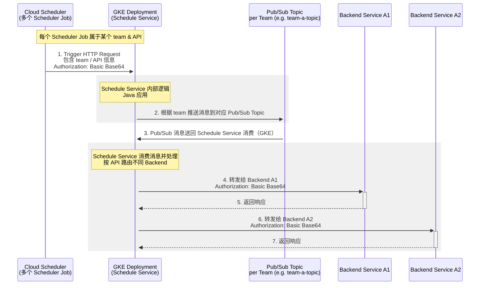
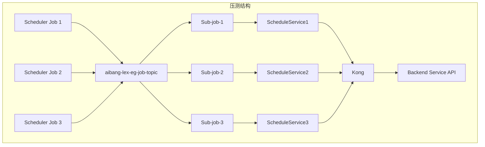

 ```mermaid
sequenceDiagram
    participant S as Cloud Scheduler
    participant P as Pub/Sub Topic
    participant G as GKE Deployment<br/>(Schedule Service)
    participant B as Backend Service

    Note over S,B: Authentication: Basic Base64(user:password)

    S->>+P: 1. Trigger Message<br/>(gcloud schedule jobs)
    P->>+G: 2. Push Message

    rect rgb(240, 240, 240)
        Note over G: Schedule Service Processing
        G->>+B: 3. HTTP Request<br/>Authorization: Basic Base64
        B-->>-G: 4. Response
    end
```


你描述的业务流程是：

- 多个 Cloud Scheduler Job（代表不同 API）发送请求
    
- Schedule Service 接收请求后根据 team → 发送到指定 team 的 Pub/Sub Topic
    
- 每个 Topic 对应一组 Backend Service（每个 API 对应一个）
    

  

下面是基于你描述的 **完整 mermaid flow**，已加上 team/topic/API 逻辑、Pub/Sub dispatch、多个 Backend Service，并保留 Basic Auth 信息：

---



---

## **✅ 说明要点**

|**步骤**|**说明**|
|---|---|
|Step 1|Scheduler Job 发起请求到 GKE 的 Schedule Service，附带 team + API 信息，使用 Basic Auth|
|Step 2|Schedule Service 根据 team 推送消息到指定 Pub/Sub Topic（如 team-a-topic）|
|Step 3|自己消费 Topic（同一个 Pod 订阅自己发送的消息）|
|Step 4~7|按 API 决定转发给哪个 Backend Service（API1 ➜ B1，API2 ➜ B2）|

---

## **🛠️ 建议优化**

- 若一个 Team 有多个 API，可考虑按 API 拆分不同 Subscription 或 Topic，以避免串行消费影响其他任务；
    
- 每条消息建议包含：
    
    - team
        
    - api
        
    - request_url
        
    - retry_id（用于幂等）
        
    - auth 或内部 token
        
    
- Backend 若部署在 GKE，可通过内部 DNS 如 http://api1.default.svc.jiqun.local 来访问
    

---

是否还需要我帮你加：

- Retry 行为（如 3 次 Retry 间隔）
    
- Pub/Sub 消息失败 DLQ（Dead Letter Queue）流程？
    
- Timeout 处理流程？
    


现在访问的 flow 大概如下 
部署一个服务在 GKE 里面 比如我们称之为 schedule service GKE Deployment (Schedule Service)他是一个 Java 开发的应用程序
他会接受不同的 team 一个 team 可能有不同的 cloud Schedule job 发送过来的任务请求 schedule service 会将对应 team 的请求发送到这个 team 对应的 pub sub 我们针对每个 team 创建了自己对应的 pub sub 然后这个消息队列会将对应的请求发送到用户最终运行的 backend service 当然同一个Team的不同的任务请求对应后面不同的Backend Service

我们现在的业务处理逻辑有一个问题 比如 team A 下面 不同的 API [也可以说是不同的cloud schedule job ]发送过来的请求都要让同一个 pub 来处理 比如说这个题目 team A API1 和 team A API 2

如果 API1 的请求没有返回 那么他就会一直等待 而不会处理 team A API 2 对应的请求

我们现在从下面这个方面来关注这个服务   我们现在遇到的问题是 消息队列阻塞 会影响用户的后续正常处理
我现在需要
Monitor ==> Sre 针对这样的场景 如何做好监控
场景描述： 1. 用户调度任务：
用户通过 GCP Cloud Scheduler 创建和管理调度任务，使用命令如
gcloud scheduler jobs list 查看所有任务。存在一个情况就是 Teams 公用一个 Pub/Sub Topic 的情况
gcloud pubsub topics list . 2. 触发 Pub/Sub 队列：
每个调度任务的触发会将消息推送到一个指定的 Pub/Sub Topic 队列。 3. GKE 部署的 Schedule 服务：
GKE 中部署一个专门用于处理调度的服务（称为 Schedule Service）。该服务订阅 Pub/Sub 消息并处理其中的内容。现在这个业务处理逻辑有一些缺陷.比如对于同一个 Teams 不同的 schedule Job 过来到我的 Schedule Service 的时候 其实是针对同一个 PUB/SUB 的处理. 如果后面的 Backend Service 处理消息不及时就会有积压或者这个 backendservice 服务不可用.而且这个服务是默认经过 Kong 处理的,比如 Kong 设置了对应的超时,比如默认 6 分钟.我重试三次,可能就需要 18 分钟,目前我的 scheudle Service 里面的 RetryTemplate 机制是三次重试.间隔 0s,10s,20s
这样,同一个 Pub/sub 的任务就会 Delay 那么会影响时间的处理.
. Schedule Service 服务处理逻辑：
• 从 Pub/Sub 消息队列中接收消息。
• 解析消息内容，构建一个 HTTP 请求（包含 Basic Auth 认证头）。
• 使用 curl 或其他 HTTP 客户端库向指定的后端服务 URL 发起请求。 4. backend Service 当然也是部署在 GKE 里面的一个 Deployment.这个 Deployment 支持 HPA 的

我现在想要对这个 GKE Schedule Service 服务进行一个压力测试
我如何进行这个压力测试 ,我需要准备些什么东西.比如我需要配置对应的 gcloud scheduler jobs list.比如创建多个 来并非请求.而后面使用一个 pubsub 然后我需要观察我的 backendService 的服务状态.
我们一般的压测工具是 Jmeter 但是对于类似任务我们如何来实现呢?

1. 压测目标：更关注

• Schedule Service 的处理能力（消费速率、重试处理）

• backendService 的响应能力（是否会撑爆 HPA）

• 整体链路延迟（从 Cloud Scheduler 到 backendService）

2. 现有资源：我需要创建对应的 Cloud Scheduler job 是否能自动化创建上百个用于压测？这个可以

3. 是否允许使用代码生成 Pub/Sub 消息：比如用脚本或 Pub/Sub Publisher API 快速模拟触发而不是单靠 Scheduler。==》 这个不需要

4. Schedule Service 的水平扩展机制：是否是单实例 Pod，还是支持 HPA 扩容？压测是否也需要评估它的扩展性？

5. 你期望压测持续时间：比如 5 分钟、30 分钟、持续 1 小时？是否有最大 QPS 或 TPS 的目标？==》 30 分钟压测
   JMeter 的压测方案。

(1) 制定压测准备与基准测试计划： (a) 使用 JMeter 直接对后端的 Backend Service 进行独立的压力测试，以确定其性能基准，包括最大 QPS、响应时间以及触发 HPA 的具体负载阈值。 (b) 评估并准备压测环境，确保 GCP 配额（如 Cloud Scheduler、Pub/Sub）充足，并为压测数据建立独立的命名空间或项目以隔离影响。 (2) 设计并配置负载生成机制： (a) 编写自动化脚本，用于批量创建数百个 Cloud Scheduler 任务。 (b) 将所有这些任务配置为在短时间内（例如，测试开始后的第一分钟内）触发，并将消息发送到同一个目标 Pub/Sub Topic，以模拟高并发和消息积压的场景。 (3) 构建全链路的监控与度量体系： (a) 在 GCP Monitoring (Cloud Monitoring) 中创建仪表盘，集中监控关键指标。 (b) 监控 Pub/Sub 的积压消息数（`num_undelivered_messages`），这是判断 Schedule Service 处理能力瓶颈的核心指标。 (c) 监控 GKE 中 Schedule Service 和 Backend Service 的资源使用率（CPU、内存）、Pod 数量（观察 HPA 扩缩容行为）以及重启次数。 (d) 监控 Schedule Service 的应用程序日志，重点关注消息处理耗时、重试次数和错误信息。 (e) 为了测量端到端延迟，研究在消息载荷中注入唯一相关 ID 和初始时间戳，并在 Backend Service 处理完成时记录日志，以便后续分析延迟。 (4) 设计 JMeter 测试方案以协调和控制压测： (a) 配置 JMeter 的线程组（Thread Group），将测试持续时间设置为 30 分钟。 (b) 考虑到负载由 Cloud Scheduler 生成，JMeter 的主要作用不是直接产生请求，而是作为测试控制器和辅助监控工具。可以设置一个 HTTP 请求采样器，在测试期间以低频率轮询 Backend Service 的健康检查接口，以从外部视角记录其可用性和响应时间。 (c) 在 JMeter 中配置后端监听器（Backend Listener），将 JMeter 收集到的数据（如健康检查响应时间）实时发送到 Prometheus 或 InfluxDB，以便与 GCP 监控数据进行关联分析。 (5) 执行压测并进行实时分析： (a) 在预定时间启动 JMeter 测试计划，并同时触发自动化脚本来创建和运行 Cloud Scheduler 任务。 (a) 在 30 分钟的测试期间，密切观察监控仪表盘，特别是 Pub/Sub 消息积压数量的变化趋势、Schedule Service 的资源消耗以及 Backend Service 的 HPA 扩容情况。 (6) 深入分析测试结果并定位性能瓶颈： (a) 测试结束后，详细分析 Pub/Sub 积压曲线。如果积压持续增长，则证明 Schedule Service 的处理能力已达上限。 (b) 分析 Schedule Service 的日志，统计重试逻辑的触发频率和总耗时，评估其对整体处理流程的影响。 (c) 评估 Backend Service 的 HPA 策略是否有效，扩容是否及时，以及在高负载下的响应时间和错误率。 (7) 综合评估现有架构并提出优化方案： (a) 基于测试数据，批判性地分析单一 Pub/Sub Topic 对多 API 造成的“队头阻塞”问题。 (b) 提出架构优化建议，例如：为每个 API 或任务类型使用独立的 Pub/Sub Topic 和 Subscription 来彻底解决阻塞问题；为 Schedule Service 启用 HPA 并优化其内部线程模型以提高并发处理能力；为 Pub/Sub 订阅配置死信队列（Dead-Letter Queue），将处理失败的消息转移，避免影响后续任务。 (8) 规划回归测试： (a) 在实施任何优化措施后，使用相同的压测方案进行回归测试，以量化比较改进前后的性能差异，并验证优化措施的有效性。

# Chatgtp

# **JMeter 压测方案**

## **场景概述**

当前架构为：**Cloud Scheduler** 定时任务触发消息发布到公用的 **Pub/Sub Topic** ；**Schedule Service**（部署在 GKE）订阅该主题，接收消息后构造带 Basic Auth 的 HTTP 请求，调用后台 **Backend Service**。后台服务同样部署在 GKE，支持基于 CPU 或自定义指标（如 Pub/Sub 积压）进行 HPA 扩缩容 。由于多个调度任务共享同一主题，且网关（Kong）存在默认 6 分钟超时、3 次重试等设置，如果后端处理不及时，可能导致消息堆积和延迟。为此，我们需要对整个链路进行 30 分钟的压力测试，评估各组件在高负载下的表现和扩展性。

## **压测目标**

- **Schedule Service 处理能力**：测量消息消费速率、并发处理能力及重试机制对性能的影响。监控订阅未确认消息数量，检查是否出现积压。
- **Backend 服务响应能力**：观察后端请求的平均延迟、错误率，以及 HPA 扩展情况（Pod 数量随负载变化）。验证后端在高并发下是否会达到资源瓶颈。
- **端到端延迟**：统计从 Cloud Scheduler 触发到消息经 Schedule Service 处理并送达 Backend 的总体时延（可通过在消息中加入时间戳、自定义日志埋点等方式测量）。
- **整体稳定性**：检查网关超时、错误响应、服务日志错误等，确保高负载时系统稳定性。

## **负载生成策略**

- **创建大量 Scheduler 任务**：利用 gcloud 命令或脚本批量创建数十甚至上百个 Cloud Scheduler 任务。例如使用 gcloud scheduler jobs create pubsub ... --topic=TOPIC --message-body="..." 方式，一次性生成多个触发同一主题的任务 。可以将这些任务频率设为每分钟或更短，以持续触发大量消息。
- **直接发布 Pub/Sub 消息**：除了 Scheduler，也可以跳过 Scheduler 直接通过脚本或工具调用 Pub/Sub 发布 API。JMeter 可以模拟这一操作（见下文 JMeter 方案）。需要一个拥有 Publisher 权限的 Service Account，并配置好 Pub/Sub 主题。
- **使用 JMeter 生成负载**：通过 JMeter 模拟并发任务发布消息。安装 Google Pub/Sub 插件后，可在每个线程组中使用 “**PubSub-PublisherConfiguration**” 配置发布凭证和主题信息，然后添加 “**Publisher Request**” 采样器，填入要发布的消息内容 。每个线程组就模拟一个并发客户端，不断发布消息到 Pub/Sub（文档建议可通过增大线程组数和请求延迟来控制负载强度 ）。

## **JMeter 测试方案**

- **环境准备**：安装 JMeter，并使用 Plugins Manager 安装 **GCP Pub/Sub Plugin**。根据官方提示，将 Google Cloud Pub/Sub 客户端依赖（如 google-cloud-pubsub、gson）下载放入 JMeter 的 lib 目录 。
- **配置线程组**：在测试计划中添加一个或多个线程组（Thread Group），配置好线程数（并发用户数）、Ramp-up 和循环次数。可依据预期吞吐量调整线程数和延迟，以模拟逐步增加的负载 。例如，逐步从 10 个线程增至 100 个线程，观察系统表现。
- **Pub/Sub 发布采样器**：在线程组下配置 “PubSub-PublisherConfiguration”，指定 GCP 项目、主题、Service Account 凭证等信息 。随后添加 “Publisher Request” 采样器，将要发送的消息数据填入 Body（可包含 JSON 等调度任务的实际格式）。执行测试时，每个线程会不断向 Pub/Sub 发布消息。
- **可选脚本实现**：若不使用插件，也可在 JMeter 中添加 **JSR223 Sampler** 并引入 Google Pub/Sub Java 客户端库，通过 Groovy 脚本调用 Publisher.publish() 接口发布消息（参考 Google 官方示例 ）。但使用插件方式更直观。
- **控制与增量测试**：测试建议分阶段进行，先验证小规模负载是否正常，然后逐步增加并发和消息速率。在相同测试期间保持 30 分钟左右的持续负载，以稳定观察扩展表现。

## **监控与指标**

- **Pub/Sub 订阅监控**：在 Cloud Monitoring 中观察订阅相关指标。关注 **subscription/num_unacked_messages_by_region**（未确认消息数）和 **subscription/oldest_unacked_message_age_by_region**（最老未确认消息时长）等指标 ，判断是否出现消息堆积或处理滞后。订阅的 ack/message 速率也可表征 Schedule Service 的消费速率。
- **Schedule Service 监控**：通过容器监控（CPU、内存）和应用日志，查看其处理吞吐量、错误（例如发布失败、超时重试）等。记录服务端日志中处理每条消息的时间。利用指标工具（如 Prometheus + Grafana 或 Stackdriver Monitoring）统计每秒处理消息数、重试次数等。
- **Backend 服务监控**：查看后端 Deployment 的**Pod 数量**和**CPU/内存利用率**，评估 HPA 扩容情况。监控请求响应时间（平均/99%时延）、错误率（HTTP 5xx）等。HPA 如果基于 CPU 或 Pub/Sub 积压进行扩容，应当能在负载升高时触发更多副本 。可使用 kubectl get hpa 或监控仪表盘查看实时状态。
- **端到端延迟**：在 Schedule Service 发布到 Backend 的 HTTP 请求中，可以传递下游返回信息或者在日志打印时间戳；或者在原始消息上打标记以计算从发布到确认的总时延。统计并分析这部分延迟随负载增加的变化趋势。
- **网关/Kong 监控**：由于请求通过 Kong 转发，需关注 Kong 的超时和重试日志。记录是否有请求因超时（6 分钟）被取消而导致重试，或积压在 Schedule Service 中。
- **日志分析**：将各组件日志（Schedule Service、Backend）导出到 Cloud Logging 或 BigQuery，进行详细分析。Google 建议在大规模测试时进行二级日志分析，因为监控指标可能不够精细 。

## **扩展性评估**

- **Schedule Service 扩容**：如果 Schedule Service 配置了 HPA（如基于 CPU 或自定义指标），观察在高并发时是否自动增容。测试中可尝试修改 HPA 最小实例数、不同指标策略，评估其线性扩展能力。
- **Backend HPA**：Backend 已启用 HPA，应能根据负载自动扩容。利用测试观察 HPA 扩容速度和副本稳定性。可以考虑使用 Pub/Sub 积压指标来驱动 HPA，使其在消息堆积初期就触发扩容 。
- **Kong 和超时策略**：如果发现网关超时成为瓶颈，可尝试调整 Kong 的超时和重试参数，或增加 Kong 实例数。测试应验证修改配置后的影响，例如是否有效避免了过多的失败重试累积。
- **水平扩展能力**：在测试过程中，检查是否在负载降低后 Pod 能正常缩容（HPA 回缩机制）。可多次进行不同规模的压测，确认服务的扩展与收敛是否稳定并线性。

## **压测步骤示例**

1. **准备环境**：在 GCP 项目中创建一个 Pub/Sub 主题和对应订阅。编写脚本或手动使用 gcloud 批量创建 Cloud Scheduler 任务，例如：gcloud scheduler jobs create pubsub job1 --schedule="_/1 _ \* \* \*" --topic=TEST_TOPIC --message-body="test" ，依此类推创建多个作业。
2. **配置 JMeter**：启动 JMeter，安装并配置 GCP Pub/Sub 插件。设置好线程组参数（线程数、Ramp-up、循环次数）和 PubSub-PublisherConfiguration（填写项目 ID、主题名、服务账号凭证路径）。
3. **运行压测**：启动 JMeter，开始向 Pub/Sub 发布大量消息，持续约 30 分钟。在测试过程中逐步增加并发量，观察 JMeter 的吞吐率和错误数。
4. **监控观察**：同时在 GCP 控制台监控 Pub/Sub 订阅状态（未确认消息数、延迟）、Schedule Service 的 Pod 指标、Backend 服务的 CPU/Pod 数和响应延迟等。记录关键数据点，如最大吞吐量、平均延迟、错误率。
5. **数据分析**：测试结束后，对照监控数据和日志分析各项指标。例如，如果未确认消息数持续增长，说明消费速率不足；如果 HPA 达到上限但仍饱和，说明资源可能不够；若网关出现大量超时或 5xx 错误，则需优化重试策略或扩容网关等。

## **后续优化建议**

- 优化 **Schedule Service** 逻辑：调整内部重试次数和间隔（当前为 0s、10s、20s），避免因长时间阻塞导致消息积压过多。
- 考虑对不同业务团队分配独立的 Pub/Sub 主题或订阅，以隔离流量，防止“公用主题”导致的互相影响。
- 根据压测结果调整 HPA 策略和网关配置，如增加 Kong 实例、延长超时时间或启用分布式追踪等。

**参考资料：** Cloud Scheduler 可通过 gcloud 命令创建 Pub/Sub 类型任务 ；JMeter GCP Pub/Sub 插件使用说明 ；Google Cloud Run 文档建议使用 JMeter 线程组来控制负载 ；GKE HPA 可基于 Pub/Sub 积压自动扩容 ；Pub/Sub 监控指标包括未确认消息数和最老未确认时间 。

是的，你的目标 **完全可以实现**，架构上也合理：

**一个 Topic + 多个 Subscription（每个 Job 绑定一个 Sub）+ 同一个 Backend API。**

---

## **✅ 架构目标总结**



---

## **✅ 关键技术点说明**

### **1.** 

### **Pub/Sub 支持一对多消费**

- 一个 Topic 可以绑定多个 Subscription；
- 每个 Subscription 收到的消息是彼此**独立的副本**；
- 所以你可以让每个 Cloud Scheduler Job 对应一个 Sub，通过 Pub/Sub -> Schedule Service -> Backend。

### **2.** 

### **如何实现多 Sub 消费同一个 Topic？**

#### **Step A: 创建多个 Subscription（独立名字）**

```
for i in $(seq -w 1 100); do
  gcloud pubsub subscriptions create sub-job-${i} \
    --topic=aibang-lex-eg-job-topic \
    --ack-deadline=60 \
    --message-retention-duration=600s \
    --project=your-project-id
done
```

#### **Step B: 每个 Schedule Service 实例监听一个 Subscription（或配置消费多个）**

- 你可以部署多个实例，或 Schedule Service 内部用并发线程分别订阅；
- 或者同一个服务接收多个 Subscription 的消息（需要异步处理）；
- **建议方式**：每个 Sub 对应一个 Kubernetes Job 或 Deployment 处理逻辑。

---

## **✅ JMeter 压测建议**

你不需要 JMeter 直接调用 Backend API，而是间接通过 Cloud Scheduler 发送 Pub/Sub 消息来压测：

| **工具**                            | **目标**                                                               |
| ----------------------------------- | ---------------------------------------------------------------------- |
| gcloud scheduler jobs create pubsub | 模拟用户任务调度，批量触发消息                                         |
| GCP Pub/Sub                         | 同一个 Topic + 多个 Subscription 实现 fan-out 并发处理                 |
| Schedule Service (GKE)              | 实际消费并调用 Backend API（评估处理与重试能力）                       |
| Backend API                         | 被压测目标，通过 GKE HPA 自动扩容                                      |
| JMeter（可选）                      | 模拟外部高频 Job 创建或监控 Backend 响应性能（如你还想模拟 HTTP 请求） |

---

## **✅ 建议监控指标**

| **层级**         | **指标**                       | **说明**                   |
| ---------------- | ------------------------------ | -------------------------- |
| Pub/Sub          | num_undelivered_messages       | 检查是否存在消息 backlog   |
| Pub/Sub          | ack_latency                    | 消息消费延迟               |
| Scheduler        | job execution count            | 是否定时稳定触发           |
| Schedule Service | CPU / memory / request latency | 是否存在处理瓶颈           |
| Backend API      | 响应时间 / HPA Pod 数          | 是否扩容及时，是否请求撑爆 |
| Kong             | 超时 / 5xx                     | 转发失败或响应过慢         |

---

## **✅ 后续可扩展策略**

- 若要彻底隔离不同团队影响，可以考虑：
    - 每个团队一个 Topic；
    - 或者同一个 Topic + Filtered Subscription（Pub/Sub 支持过滤器）；
- 可在消息中加上 apiName/teamName/traceId 字段，方便日志追踪；
- 可通过 Cloud Logging + BigQuery 分析每条链路的处理耗时。

---

是否需要我帮你生成：

- 多 Subscription 自动创建脚本
- Schedule Service 消费多个 Sub 的代码模板（Java）
- 监控指标 YAML 或 Grafana 图表模板？

你选哪一个我就直接给。

我明确了需求,现在不用 Jmeter 工具,直接用 schedule job 的方式来 Trigger 这个测试,比如我搞 100 个 Job 然后发给同一个 PUB/SUB 让其来处理.我现在比如如何创建这么多 Job 里面的任务的 message body 如何写?这个是不是依赖于我的 backend service 比如我的 backend service 其实就是一个 health 的页面 我就是最简单的模拟测试

明白了，你现在的压测目标是：

- ✅ 用 **Cloud Scheduler 创建 100 个 Job**
- ✅ 所有 Job 发送到同一个 **Pub/Sub Topic**
- ✅ 不用 JMeter，而是通过 Cloud Scheduler 的频繁触发来模拟高并发
- ✅ 每条消息被 Schedule Service 处理后，转发请求到一个简单的 Backend（比如 /health）

---

## **✅ Message Body 要怎么写？**

**完全取决于你的 Schedule Service 如何解析 Pub/Sub 的 message。**

如果你的 Schedule Service 是 Java 写的，通常会对 PubsubMessage.getData() 进行 Base64 解码，再反序列化成某种结构（比如 JSON 对象）——那么你就应该构造这个格式的消息。

### **🔧 假设 Schedule Service 只需要一个 URL 参数（访问 Backend 的** 

### **/health**

### **）**

你可以这样构造 message body（JSON 格式）：

```
{
  "url": "http://backend-service.default.svc.jiqun.local/health",
  "method": "GET",
  "team": "team-a",
  "api": "health-check"
}
```

---

## **✅ Shell 脚本：批量创建 100 个 Job**

```
#!/bin/bash

PROJECT_ID="your-gcp-project-id"
REGION="asia-east1"
TOPIC="aibang-lex-eg-job-topic"
URL="http://backend-service.default.svc.jiqun.local/health"

for i in $(seq -w 1 100); do
  JOB_NAME="job-health-check-${i}"
  MESSAGE_BODY=$(jq -c -n \
    --arg url "$URL" \
    --arg team "team-a" \
    --arg api "health-check-$i" \
    '{url: $url, method: "GET", team: $team, api: $api}')

  gcloud scheduler jobs create pubsub "$JOB_NAME" \
    --schedule="*/1 * * * *" \
    --time-zone="Asia/Shanghai" \
    --topic="$TOPIC" \
    --message-body="$MESSAGE_BODY" \
    --description="Health check job $i" \
    --project="$PROJECT_ID" \
    --location="$REGION"
done
```

> 如果你本地没有安装 jq，你也可以用简单的 bash 字符串拼接：

```
MESSAGE_BODY="{\"url\":\"$URL\",\"method\":\"GET\",\"team\":\"team-a\",\"api\":\"health-check-$i\"}"
```

---

## **✅ Schedule Service 如何处理？**

假设你的 Schedule Service 逻辑是这样（简化）：

```
String raw = new String(pubsubMessage.getData().toByteArray(), StandardCharsets.UTF_8);
JsonObject json = new Gson().fromJson(raw, JsonObject.class);
String url = json.get("url").getAsString();
String method = json.get("method").getAsString();
```

然后构造请求发给你 GKE 内的 Backend Deployment。

---

## **✅ 模拟一个最简单的 Backend** 

## **/health**

##  **API**

如果你只是为了让 Schedule Service 发请求，可以先部署一个最简单的 /health 服务，比如：

```
kubectl create deployment health-api --image=nginx
kubectl expose deployment health-api --port=80 --target-port=80 --name=health-api
```

然后 Schedule Service 的 URL 就是：

```
http://health-api.default.svc.jiqun.local/
```

或者你在容器里跑个返回 200 OK 的简单 Spring Boot 或 Flask /health 接口。

---

## **✅ 推荐你监控这些内容 during test：**

| **组件**         | **关注点**            | **指标建议**                                         |
| ---------------- | --------------------- | ---------------------------------------------------- |
| Pub/Sub          | 堆积是否增加          | num_undelivered_messages, oldest_unacked_message_age |
| Schedule Service | 是否有消费堵塞 / 重试 | Pod CPU、日志、是否有 timeout、ack 速率              |
| Backend Service  | 响应是否撑爆 HPA      | 请求 QPS、响应时间、错误率、Pod 数量变化             |
| 总链路           | 是否稳定              | Stackdriver Trace + Logging（可选）                  |

---

需要我：

- 帮你写一个 Schedule Service 消费者 Java 示例？
- 帮你生成 Stackdriver 监控 Dashboard 模板？

你告诉我目标，我马上配好。

# Gemini

# 针对 GKE 与 Pub/Sub 异步架构的压力测试与可靠性验证综合方案

本报告旨在为基于 Google Cloud Scheduler、GKE 托管服务及 Cloud Pub/Sub 的复杂异步处理链路，提供一个全面、深入且可执行的压力测试与可靠性验证方案。我们将超越传统的“压垮”式测试，采用网站可靠性工程（SRE）的最佳实践，将本次测试构建为一次科学的、以数据驱动的可靠性验证过程。

本方案的核心目标不仅是找出系统的性能瓶 G 颈，更是为了量化其在负载下的行为，验证其弹性伸缩与容错机制的有效性，并最终为服务的可靠性目标（SLO）提供坚实的数据支撑。我们将遵循从理论框架、环境准备、负载编排、全链路监控，到结果分析与弹性优化的完整流程，确保测试的科学性、可重复性与价值最大化。

## 第 1 部分：以可靠性为驱动的测试框架

在启动任何实际操作之前，我们必须建立一个坚实的理论框架。这次压力测试的目的不应仅仅是发现系统能承载多大的 QPS，而应是验证系统在预设的负载下，是否能够满足其对用户的可靠性承诺。我们将此承诺量化为服务等级目标（Service Level Objectives, SLOs）。

### 1.1. 测试哲学：从压力测试到可靠性验证

传统的压力测试往往以“找到极限”为终点，但一个成熟的工程组织更关心的是“在承诺的范围内，系统是否稳定运行”。SRE 的核心理念在于，100%的可靠性既不现实也非用户的真实需求，它成本高昂且可能阻碍创新 1。因此，我们追求的是一个经过深思熟虑、能够平衡用户满意度与工程成本的可靠性目标。

本次测试将围绕 SLO 进行，它将成为衡量测试成功与否的唯一标准。测试过程中的每一次性能下降或错误，都将被视为对“错误预算（Error Budget）”的消耗。错误预算是`100% - SLO`所允许的“不完美”空间，它为我们进行有风险的发布、维护和此类压力测试提供了量化的许可 3。如果测试过程耗尽了预设的错误预算，这便是一个强烈的信号，表明系统在当前负载下的可靠性不足，需要优先投入工程资源进行加固，而非继续开发新功能 3。

### 1.2. 定义您的服务等级指标（SLIs）

服务等级指标（Service Level Indicator, SLI）是对服务某方面性能的量化度量。对于您描述的异步处理系统，我们必须选择能够真实反映用户体验的 SLI。根据 Google SRE 的最佳实践，针对不同类型的系统，我们应关注不同的指标维度 6。

- **可用性 SLI (Availability):**
    - **指标定义：** 由`backendService`成功处理并确认（ACK）的消息，占其尝试处理的所有有效消息的比例。这是衡量消费者处理能力的核心指标。
    - **实现方式：** 此 SLI 可以通过 Cloud Monitoring 中的 Pub/Sub 指标计算得出。公式为：`成功处理的消息数 / (成功处理的消息数 + 进入死信队列的消息数)`。具体指标为`pubsub.googleapis.com/subscription/ack_message_count`和`pubsub.googleapis.com/subscription/dead_letter_message_count` 7。一个配置了死信队列（Dead-Letter Queue, DLQ）的系统，其最终失败的标志就是消息被送入 DLQ。
- **延迟 SLI (Latency):**
    - **指标定义：** 从 Cloud Scheduler 作业触发，到消息被`backendService`最终成功处理的端到端（End-to-End）时间的分布。对于异步系统，这是一个复杂但至关重要的指标 6。
    - **实现方式：** 测量端到端延迟的唯一可靠方法是使用分布式追踪（Distributed Tracing）。我们将在服务中植入 OpenTelemetry，将分散在各个服务中的操作（span）关联到同一个追踪（trace）上。我们将重点关注延迟的 P95（95th percentile）和 P99 分位值，因为它们比平均值更能代表绝大多数用户的真实体验 10。
- **新鲜度 SLI (Freshness):**
    - **指标定义：** Pub/Sub 订阅中，最旧的未确认（unacked）消息的年龄。该指标直接反映了数据处理管道的健康状况和积压程度，是异步系统监控的关键 11。
    - **实现方式：** 直接使用 Cloud Monitoring 中的`pubsub.googleapis.com/subscription/oldest_unacked_message_age`指标进行测量 12。

### 1.3. 设定可行动的服务等级目标（SLOs）

基于上述 SLI，我们需要设定明确、可量化的 SLO。这些目标应与业务需求紧密相连，它们是本次压力测试的“考试大纲”。以下为建议的初始 SLO，您应根据实际业务场景进行调整。

- **可用性 SLO：** 在 30 分钟的测试窗口内，`backendService`的**消息处理成功率 > 99.9%**。
- **延迟 SLO：** 在测试期间，**95%的端到端处理延迟 < 800 毫秒**。
- **新鲜度 SLO：** 在测试期间，**P99 的最旧未确认消息年龄 < 60 秒**。

设定这些数字的过程，本身就是一次重要的技术与业务对齐。一个批处理分析任务可能容忍几分钟的延迟，但一个实时交易系统则不能。这些 SLO 将测试从一个模糊的探索性活动，转变为一次有明确成功或失败标准的科学实验 3。

### 1.4. 错误预算：创新的通行证

错误预算是 SLO 的必然产物，它量化了我们可以承担的“风险”。例如，99.9%的可用性 SLO 意味着我们有 0.1%的错误预算 4。本次压力测试可以被看作是一次在受控环境中主动“花费”错误预算的活动，其目的是为了购买“信心”。

如果在测试中，我们消耗的预算超出了限额（例如，超过 0.1%的消息进入了 DLQ），那么测试就发出了一个明确的、不容忽视的信号：当前系统无法在目标负载下满足其可靠性承诺。此时，工程团队的最高优先级应该是修复可靠性问题，而不是继续推进新功能的开发 4。

**表 1：服务等级目标与错误预算定义**

| 用户旅程 (User Journey) | SLI              | SLI 实现 (Cloud Monitoring 指标/查询)                                   | SLO 目标  | 30 天错误预算 (示例)    |
| ----------------------- | ---------------- | ----------------------------------------------------------------------- | --------- | ----------------------- |
| 异步任务处理            | 可用性           | `(ack_message_count) / (ack_message_count + dead_letter_message_count)` | `> 99.9%` | `~43.2 分钟` 的不可用   |
| 异步任务处理            | 端到端延迟 (P95) | Cloud Trace 分布式追踪数据                                              | `< 800ms` | `~36 小时` 的超标时间   |
| 异步任务处理            | 新鲜度 (P99)     | `pubsub.googleapis.com/subscription/oldest_unacked_message_age`         | `< 60s`   | `~21.6 分钟` 的积压超标 |

## 第 2 部分：飞行前检查：环境加固与准备

在施加任何负载之前，我们必须确保测试环境本身是稳固的，并且不受外部因素（如平台配额）的人为限制。一次成功的压力测试，其失败原因应当是系统内在的瓶颈，而非准备工作的疏忽。

### 2.1. GCP 配额与限制分析

在测试期间意外触及 GCP 的配额限制，会使测试结果失效，因为它引入了一个与应用本身无关的人为瓶颈 17。因此，进行一次彻底的配额预检至关重要。您可以通过 GCP 控制台的

`IAM & Admin > Quotas`页面或使用`gcloud`命令行工具来检查和申请提升配额 18。

以下是本次测试需要重点关注的配额项：

- **Cloud Scheduler:**
    - 每个项目的作业数量（Jobs per project）
    - 每个项目的 API 调用频率（API requests per minute）
- **Cloud Pub/Sub:**
    - 每个区域的发布者吞吐量（Publisher throughput per region）
    - 每个区域的订阅者吞吐量（Subscriber throughput per region）
    - 请注意，吞吐量配额因区域大小而异。例如，`us-central1`是一个“大型”区域，拥有更高的默认配额 20。
- **Google Kubernetes Engine (GKE) / Compute Engine:**
    - 每个区域的 CPU 核心数（CPUs per region）
    - 每个区域的持久化磁盘总大小（Persistent Disk total GB per region）
    - 这些配额对于确保 HPA（Horizontal Pod Autoscaler）和集群自动伸缩器（Cluster Autoscaler）能够成功添加节点至关重要 21。
- **Cloud Monitoring:**
    - API 写入配额（API Ingestion limits），我们详尽的监控设置可能会产生大量指标数据。

为了确保准备工作的严谨性，我们提供以下清单供您在测试前逐项核对。

**表 2：GCP 配额飞行前检查清单**

| 服务 (Service)   | 配额名称 (Quota Name)                         | 默认限制 (Default Limit) | 项目当前用量 | 测试所需预估                 | 是否已申请提升？ (Y/N) |
| ---------------- | --------------------------------------------- | ------------------------ | ------------ | ---------------------------- | ---------------------- |
| Cloud Scheduler  | Jobs per project                              | 5,000                    |              | ~500                         |                        |
| Cloud Pub/Sub    | Publisher throughput per large region         | 4 GB/s 20                |              | (根据负载模型估算)           |                        |
| Cloud Pub/Sub    | Push subscriber throughput per large region   | 440 MB/s 20              |              | (根据负载模型估算)           |                        |
| Compute Engine   | CPUs per region (e.g., us-central1)           | (因项目而异)             |              | (根据 HPA `maxReplicas`估算) |                        |
| Cloud Monitoring | Time series ingestion API requests per minute | 60,000                   |              | (根据监控点估算)             |                        |

### 2.2. 安全的服务身份：实施 Workload Identity

为了让 GKE 中运行的服务能够安全地调用 GCP API（如 Pub/Sub），我们必须为其配置身份。强烈建议**避免使用导出的服务账号密钥（JSON key files）**，因为它们是静态凭证，一旦泄露将构成严重的安全风险 22。

Google 推荐的最佳实践是使用**GKE Workload Identity**。它允许您将 Kubernetes 服务账号（KSA）与 Google 服务账号（GSA）进行绑定，使得 Pod 能够以 GSA 的身份安全地调用 GCP API，无需管理任何密钥 23。这种方式不仅极大地提升了安全性，也使得权限管理和审计更为精细，完全符合生产环境的最佳实践 25。

以下是配置 Workload Identity 的详细步骤：

1. **在 GKE 集群上启用 Workload Identity：**

    Bash

    ```
    gcloud container jiquns update CLUSTER_NAME \
        --workload-pool=PROJECT_ID.svc.id.goog
    ```

2. **为每个服务创建专用的 Google 服务账号（GSA）：** 遵循最小权限原则，为您的“Schedule Service”和`backendService`分别创建 GSA 26。

    Bash

    ```
    # GSA for the publisher service
    gcloud iam service-accounts create schedule-service-gsa --display-name="GSA for Schedule Service"
    # GSA for the consumer service
    gcloud iam service-accounts create backend-service-gsa --display-name="GSA for Backend Service"
    ```

3. **授予必要的 IAM 角色：**

    Bash

    ```
    # Grant publisher role to the schedule-service-gsa
    gcloud projects add-iam-policy-binding PROJECT_ID \
        --member="serviceAccount:schedule-service-gsa@PROJECT_ID.iam.gserviceaccount.com" \
        --role="roles/pubsub.publisher"

    # Grant subscriber role to the backend-service-gsa
    gcloud projects add-iam-policy-binding PROJECT_ID \
        --member="serviceAccount:backend-service-gsa@PROJECT_ID.iam.gserviceaccount.com" \
        --role="roles/pubsub.subscriber"
    ```

4. **在 GKE 中创建对应的 Kubernetes 服务账号（KSA）：**

    YAML

    ```
    # ksa.yaml
    apiVersion: v1
    kind: ServiceAccount
    metadata:
      name: schedule-service-ksa
      namespace: YOUR_NAMESPACE
    ---
    apiVersion: v1
    kind: ServiceAccount
    metadata:
      name: backend-service-ksa
      namespace: YOUR_NAMESPACE
    ```

    Bash

    ```
    kubectl apply -f ksa.yaml
    ```

5. **将 GSA 与 KSA 进行绑定：** 这一步是 Workload Identity 的核心，它授予 KSA 模拟 GSA 的权限 24。

    Bash

    ```
    # Bind for publisher
    gcloud iam service-accounts add-iam-policy-binding schedule-service-gsa@PROJECT_ID.iam.gserviceaccount.com \
        --role roles/iam.workloadIdentityUser \
        --member "serviceAccount:PROJECT_ID.svc.id.goog"

    # Bind for consumer
    gcloud iam service-accounts add-iam-policy-binding backend-service-gsa@PROJECT_ID.iam.gserviceaccount.com \
        --role roles/iam.workloadIdentityUser \
        --member "serviceAccount:PROJECT_ID.svc.id.goog"
    ```

6. **为 KSA 添加注解并更新 Deployment：**

    Bash

    ```
    # Annotate KSA for publisher
    kubectl annotate serviceaccount schedule-service-ksa \
        --namespace YOUR_NAMESPACE \
        iam.gke.io/gcp-service-account=schedule-service-gsa@PROJECT_ID.iam.gserviceaccount.com

    # Annotate KSA for consumer
    kubectl annotate serviceaccount backend-service-ksa \
        --namespace YOUR_NAMESPACE \
        iam.gke.io/gcp-service-account=backend-service-gsa@PROJECT_ID.iam.gserviceaccount.com
    ```

    最后，更新您的 GKE Deployment YAML 文件，在`spec.template.spec`下指定`serviceAccountName`为您创建的 KSA 名称。

### 2.3. 为失败而设计：Pub/Sub 弹性配置

压力测试的目的之一就是验证系统的容错能力。我们需要在测试前，对 Pub/Sub 订阅进行合理的弹性配置，以确保它在消费者（`backendService`）出现故障或过载时，能够优雅地处理消息，而不是造成数据丢失或“重试风暴”。

- 死信主题（DLQ）配置：
    DLQ 是处理“毒丸消息”（无法被消费者成功处理的消息）或在消费者长时间宕机后，消息达到重试上限时的最后保障。它是我们可用性 SLI 的关键组成部分。
    1. **创建 DLQ 主题：**

        Bash

        ```
        gcloud pubsub topics create your-dlq-topic
        ```

    2. **为 DLQ 主题创建订阅：** 这一步至关重要，它确保了进入 DLQ 的消息能被保留下来以供后续分析，否则消息会丢失 28。

        Bash

        ```
        gcloud pubsub subscriptions create your-dlq-subscription \
            --topic=your-dlq-topic \
            --message-retention-duration=7d
        ```

    3. **更新主订阅，关联 DLQ：** 设置`--dead-letter-topic`和`--max-delivery-attempts`。`max-delivery-attempts`（5 到 100 之间）定义了在消息被发送到 DLQ 之前，Pub/Sub 将尝试投递的最大次数 28。

        Bash

        ```
        gcloud pubsub subscriptions update your-main-subscription \
            --dead-letter-topic=your-dlq-topic \
            --max-delivery-attempts=5
        ```

    4. **为 Pub/Sub 服务账号授权：** 这是最容易被忽略但却至关重要的一步。将消息从主订阅转发到 DLQ 主题的操作，是由一个 Google 管理的特殊服务账号执行的。我们必须授予这个账号在 DLQ 主题上的发布权限 29。

        Bash

        ```
        # First, get your project number
        PROJECT_NUMBER=$(gcloud projects describe PROJECT_ID --format='value(projectNumber)')

        # Grant the publisher role to the Pub/Sub service account
        gcloud pubsub topics add-iam-policy-binding your-dlq-topic \
            --member="serviceAccount:service-${PROJECT_NUMBER}@gcp-sa-pubsub.iam.gserviceaccount.com" \
            --role="roles/pubsub.publisher"
        ```
- 重试策略配置：
    在高吞吐量场景下，如果 backendService 暂时过载并开始拒绝（NACK）消息，默认的“立即重试”策略会立刻将消息重新投递，这可能加剧消费者的负载，形成“重试风暴”。更稳健的策略是采用指数退避（Exponential Backoff） 28。这会在每次重试之间引入逐渐增长的延迟，给下游服务喘息和恢复的时间。
    Bash
    ```
    gcloud pubsub subscriptions update your-main-subscription \
        --min-retry-delay=10s \
        --max-retry-delay=600s
    ```
    这个配置将使得首次重试延迟至少 10 秒，后续的延迟会以指数级增长，直到最大 600 秒的上限。压力测试将验证这一机制与 HPA 的动态交互效果。

### 2.4. GKE 工作负载配置审查

最后，我们需要审查 GKE 上两个服务的 Deployment 配置，确保它们为压力测试做好了准备。

- **资源请求（Requests）与限制（Limits）：**
    - 确保`backendService`的 Deployment YAML 中为容器设置了合理的 CPU 和内存`requests`与`limits`。`requests`是 Kubernetes 调度器分配资源的依据，而`limits`则防止单个 Pod 耗尽节点资源。
    - 在压力测试中，为了找到服务的真实性能上限，可以将`limits`设置得相对宽松，允许 Pod 充分利用节点的资源。但`requests`必须设置，以保证 Pod 能够被调度到有足够资源的节点上。
- **水平 Pod 自动伸缩器（HPA）配置：**
    - 记录下`backendService`当前 HPA 的配置：`minReplicas`、`maxReplicas`以及目标指标（例如，`targetCPUUtilizationPercentage: 80`）。这个基线是后续分析和优化的基础 32。在第 6 部分，我们将探讨如何基于更合适的指标来优化这个 HPA。

## 第 3 部分：编排负载：JMeter 与 gcloud 的协同应用

本节将详细阐述如何使用用户指定的 JMeter 工具，结合`gcloud`命令行，来精确地生成和控制测试负载。我们将采用一种巧妙的设计，以适应系统的异步特性。

### 3.1. 自动化测试装置生成：批量创建 Scheduler 作业

手动创建数百个 Cloud Scheduler 作业是不可行的。我们必须通过脚本自动化此过程。以下`bash`脚本利用`gcloud`命令行工具，不仅能批量创建作业，还能通过精巧的调度设计，生成平滑且持续的负载。

Bash

```
#!/bin/bash

# Configuration
PROJECT_ID="your-gcp-project-id"
LOCATION="your-gcp-region" # e.g., us-central1
TARGET_PUBSUB_TOPIC="your-schedule-service-topic"
NUM_JOBS=200 # Number of scheduler jobs to create
JOBS_PER_MINUTE=600 # Desired total triggers per minute

# Calculate the interval for staggering jobs
# We use modulo arithmetic to spread jobs across 60 seconds.
# For example, with 200 jobs, we can have multiple jobs firing each second.
# Let's aim for a high frequency, e.g., 10 triggers per second.

echo "--- Preparing to create ${NUM_JOBS} Cloud Scheduler jobs ---"
echo "Target Topic: ${TARGET_PUBSUB_TOPIC}"
echo "Location: ${LOCATION}"

# Create a file to store job names for JMeter
JOB_NAMES_FILE="scheduler_job_names.csv"
echo "job_name" > ${JOB_NAMES_FILE}

for i in $(seq 1 ${NUM_JOBS}); do
  JOB_NAME="stress-test-job-$(printf "%03d" ${i})"

  # Stagger the schedule across each minute to create a smooth load
  # This cron expression will run the job at a specific second within every minute.
  # e.g., for i=1, second=1; for i=61, second=1 again.
  SECOND=$(( (i-1) % 60 ))
  SCHEDULE="${SECOND} * * * *"

  # Unique message body for tracing
  MESSAGE_BODY="{\"job_name\":\"${JOB_NAME}\", \"timestamp\":\"\$(date -u +%Y-%m-%dT%H:%M:%SZ)\"}"

  echo "Creating job: ${JOB_NAME} with schedule: '${SCHEDULE}'"

  gcloud scheduler jobs create pubsub ${JOB_NAME} \
    --project=${PROJECT_ID} \
    --location=${LOCATION} \
    --schedule="${SCHEDULE}" \
    --topic=${TARGET_PUBSUB_TOPIC} \
    --message-body="${MESSAGE_BODY}" \
    --time-zone="Etc/UTC"

  # Check for command success
  if [ $? -eq 0 ]; then
    echo "${JOB_NAME}" >> ${JOB_NAMES_FILE}
    echo "Successfully created ${JOB_NAME}"
  else
    echo "!!! Failed to create ${JOB_NAME}. Exiting."
    exit 1
  fi

  # Sleep briefly to avoid hitting API rate limits for job creation
  sleep 0.5
done

echo "--- Finished creating ${NUM_JOBS} jobs. ---"
echo "Job names saved to ${JOB_NAMES_FILE} for use with JMeter."

# Script to delete all created jobs after the test
echo "To delete these jobs later, run the following command:"
echo "for job in \$(cat ${JOB_NAMES_FILE} | tail -n +2); do gcloud scheduler jobs delete \$job --location=${LOCATION} --quiet; done"
```

这个脚本的核心思想在于调度 (`--schedule`) 的设计。一个幼稚的实现可能会为所有作业设置`* * * * *`，这将导致每分钟开始时产生一个巨大的负载尖峰，随后是 59 秒的空闲，这并不能有效地测试系统的持续处理能力 34。我们的脚本通过

`SECOND=$(( (i-1) % 60 ))`将作业均匀地分布在每一分钟的 60 秒内，从而产生一个更加平滑、持续的高频请求流，这是一种更高级、更真实的负载模式。

### 3.2. JMeter 测试计划：驱动负载引擎

现在，我们来解决核心问题：如何使用 JMeter 这个为同步请求-响应模型设计的工具，来驱动一个异步工作流。

**解决方案：** JMeter 不直接调用`backendService`，因为那将无法获得有意义的响应时间。相反，JMeter 将扮演一个**指挥官**的角色，通过调用`gcloud`命令来**按需触发**已经创建好的 Cloud Scheduler 作业。这样，我们就能利用 JMeter 强大的并发控制和负载剖面管理能力，同时完全尊重目标系统的事件驱动架构。

以下是 JMeter 测试计划的关键组件：

1. **线程组 (Thread Group):** 我们将使用 **jp@gc - Stepping Thread Group** 插件。与标准的线程组相比，它能让我们更精细地控制负载的爬升、持续和下降过程，非常适合进行严谨的压力测试 35。
2. **CSV 数据文件设置 (CSV Data Set Config):** 此组件将读取我们在 3.1 节中生成的`scheduler_job_names.csv`文件。在每次迭代中，它会为每个虚拟用户（线程）分配一个唯一的 Cloud Scheduler 作业名称。
3. **OS 进程取样器 (OS Process Sampler):** 这是连接 JMeter 与 GCP 的桥梁。在线程组的循环中，每个虚拟用户将执行一个 OS 进程取样器。该取样器配置为运行以下命令：`gcloud scheduler jobs run ${job_name}` 38。其中

    `${job_name}`变量由 CSV 数据文件设置组件提供。

4. **HTTP 认证管理器 (HTTP Authorization Manager):** 如果您的`backendService`需要某种形式的认证（例如，Basic Auth），您需要添加此管理器。它会自动为请求添加`Authorization`头 39。例如，对于 Basic Auth，您只需提供用户名和密码，JMeter 3.2+版本会自动处理 Base64 编码 40。

这种设计的巧妙之处在于，它将 JMeter 的测量目标从无法测量的“异步任务完成时间”转移到了可测量的“触发命令成功率”。JMeter 记录的响应时间和成功/失败状态，实际上反映了 Cloud Scheduler API 的健康状况和响应能力。如果`gcloud`命令开始大量失败或超时，这本身就是一个重要的观测点。

### 3.3. 配置 Stepping Thread Group 进行 30 分钟测试

根据用户 30 分钟的测试时长要求，我们为 Stepping Thread Group 提供一个具体的配置方案。这个方案包含了一个平缓的加压期、一个长时间的稳定负载期和一个可控的减压期。

图 1：Stepping Thread Group 负载剖面图

(此处应插入一个 Stepping Thread Group 配置界面的截图或其生成的负载图表，直观展示负载变化)

具体配置参数 36:

- **This group will start:** `100` threads. (初始并发数)
- **First, wait for:** `0` seconds. (立即开始)
- **Then, start:** `10` threads. (第一批启动 10 个线程)
- **Next, add:** `10` threads every `30` seconds, using ramp-up of `5` seconds. (每 30 秒增加 10 个线程，用 5 秒完成这 10 个线程的启动)
- **Then, hold load for:** `1800` seconds. (达到最大线程数后，维持负载 30 分钟)
- **Finally, stop:** `10` threads every `10` seconds. (测试结束后，每 10 秒停止 10 个线程)

这个配置将生成一个阶梯式上升的负载，让我们可以观察系统在不同压力水平下的行为，然后在最大负载下持续运行 30 分钟，以测试其耐力和稳定性。

## 第 4 部分：观测台：多层次监控策略

没有全面的监控，测试就是盲目的。本节将详细介绍如何从 GCP 的各个层面收集必要的数据，以进行深入的性能分析和问题诊断。

### 4.1. 实时测试编排指标：JMeter, Prometheus 与 Grafana

为了实时了解我们**正在施加**的负载情况，我们需要将 JMeter 的度量数据流式传输到一个外部监控系统。

- **后端监听器 (Backend Listener):** 我们将在 JMeter 测试计划中添加一个`Backend Listener` 42。
- **Prometheus 作为后端:** 尽管 InfluxDB 是传统选择 42，但我们更推荐使用
    **Prometheus Listener** (`jmeter-prometheus-plugin`) 46。Prometheus 是云原生生态的事实标准，与 GKE 自身的监控体系能更好地融合 47。
- **配置流程:**
    1. 在 JMeter 的`lib/ext`目录下安装`jmeter-prometheus-plugin.jar` 46。
    2. 在测试计划的根节点或线程组下，添加`Listener -> Prometheus Listener`。
    3. 配置 Prometheus 服务器的`prometheus.yml`文件，添加一个新的抓取目标（scrape target），指向 JMeter 所在的机器和端口（默认为`localhost:9270`）47。

        YAML

        ```
        scrape_configs:
          - job_name: 'jmeter'
            static_configs:
              - targets: ['<jmeter_load_generator_ip>:9270']
        ```

    4. 在 Grafana 中，添加 Prometheus 作为数据源，并创建一个仪表盘来可视化关键的 JMeter 指标，例如：

        - **活动线程数 (Active Threads):** `jmeter_threads{state="active"}`
        - **事务速率 (Transaction Rate / RPS):** `rate(jmeter_sampler_total[1m])`
        - **错误率 (Error Rate):** `rate(jmeter_sampler_total{code!="200"}[1m]) / rate(jmeter_sampler_total[1m])`

这种设置提供了一个实时的“指挥中心”视图。如果在测试过程中，Grafana 显示的事务速率下降，而 Stepping Thread Group 的配置表明它应该在上升，这就意味着问题可能出在 JMeter 负载机本身或 Cloud Scheduler API 上，使我们能够迅速将问题与被测系统分离开来。

### 4.2. 监控消息总线：Pub/Sub 健康状况

Pub/Sub 是连接两个 GKE 服务的关键异步链路，其健康状况直接决定了整个系统的表现。我们将重点监控以下指标，它们是系统积压和处理失败的直接信号。

- 关键指标 7:
    - **`subscription/num_undelivered_messages` (未投递消息数):** 这是最重要的指标，即积压（Backlog）的大小。一个持续增长的积压明确表示消费者（`backendService`）的处理速度跟不上生产者（"Schedule Service"）的发布速度。
    - **`subscription/oldest_unacked_message_age` (最旧未确认消息年龄):** 这是我们的新鲜度 SLI。如果这个值持续走高，说明有些消息可能被“卡住”了，处理延迟非常严重。
    - **`subscription/dead_letter_message_count` (死信消息数):** 直接度量了处理失败的消息总数，是计算我们可用性 SLI 的核心数据。
    - **`topic/send_request_count` (主题发送请求数) & `subscription/pull_request_count` (订阅拉取请求数):** 用于衡量消息总线两端的吞吐量。
- **监控查询语言 (MQL) 查询:** 我们将提供可直接用于 Cloud Monitoring 仪表盘的 MQL 查询语句 7。
    - **示例：监控积压大小**
        代码段
        ```
        fetch pubsub_subscription
        ```

| metric 'pubsub.googleapis.com/subscription/num_undelivered_messages'

| filter (resource.subscription_id == 'your-main-subscription')

| group_by 1m, [value_num_undelivered_messages_mean: mean(value.num_undelivered_messages)]

| every 1m

- **示例：监控死信消息增量**mql

fetch pubsub_subscription

| metric 'pubsub.googleapis.com/subscription/dead_letter_message_count'

| filter (resource.subscription_id == 'your-main-subscription')

| align rate(1m)

| every 1m

````

### 4.3. GKE工作负载性能监控

我们需要深入到GKE内部，观察“Schedule Service”和`backendService`在负载下的具体表现。Cloud Monitoring提供了丰富的GKE原生指标 50。

- 关键指标 51:

    - **Pod级别资源利用率:**

        - `kubernetes.io/container/cpu/core_usage_time`: 容器CPU使用时间。

        - `kubernetes.io/container/memory/used_bytes`: 容器已用内存。

        - 我们将展示如何通过`group_by` Deployment名称来聚合这些指标，以获得服务的整体资源消耗视图。

    - **HPA状态指标:**

        - `kubernetes.io/hpa/spec/target_utilization` vs `kubernetes.io/hpa/current_utilization`: 比较目标利用率和当前利用率，观察HPA的跟踪精度。

        - `kubernetes.io/hpa/current_replicas`: 实时跟踪HPA执行的伸缩动作，这是验证其行为的关键。

    - **Pod状态:**

        - 我们将使用MQL来统计处于不同阶段（`Pending`, `Running`, `Failed`, `CrashLoopBackOff`）的Pod数量，以快速发现调度问题或应用崩溃 53。

        - **示例：监控CrashLooping的Pod**

            代码段

            ```
            fetch k8s_container
            ```


| metric 'kubernetes.io/container/restart_count'

| filter (resource.jiqun_name == 'your-jiqun' && resource.namespace_name == 'your-namespace' && resource.pod_name =~ 'backend-service-.*')

| align delta(10m)

| group_by [resource.pod_name], [value_restart_count_delta: sum(value.restart_count)]

| condition val() > 0

````

通过将这些 GKE 指标与 Pub/Sub 积压指标关联分析，我们可以精确诊断瓶颈。例如：积压增长，同时`current_replicas`达到`maxReplicas`且 CPU 使用率 100%，这是典型的消费者算力饱和。如果积压增长，但 CPU 很低且 Pod 处于`CrashLoopBackOff`状态，那问题就是应用 Bug，而非性能瓶颈。

### 4.4. 黄金标准：使用 OpenTelemetry 测量端到端延迟

这是本监控策略中技术要求最高，但价值也最大的部分。我们必须明确指出，**没有分布式追踪，就无法准确测量端到端延迟 SLO**。

- 服务植入 (Instrumentation):
    我们将指导如何使用 OpenTelemetry Java Agent 为您的两个 Java 服务（假设为 Java）进行自动植入。对于大多数基于流行框架（如 Spring Boot）和库（如 gRPC, HTTP 客户端）的交互，Java Agent 可以实现“零代码”的自动追踪 55。
    1. 下载最新的`opentelemetry-javaagent.jar`。
    2. 在启动您的 Java 应用的 JVM 参数中加入`-javaagent:path/to/opentelemetry-javaagent.jar`。
    3. 通过环境变量配置 Agent，例如指定服务名和导出端点（指向 Cloud Trace）。

        Bash

        ```
        export OTEL_SERVICE_NAME=backend-service
        export OTEL_TRACES_EXPORTER=gcp
        export OTEL_METRICS_EXPORTER=none
        export OTEL_LOGS_EXPORTER=none
        ```
- 上下文传播 (Context Propagation):
    这是连接异步服务追踪链的关键。默认情况下，一个服务的追踪信息不会自动传递给通过消息队列解耦的另一个服务。我们需要确保追踪上下文（trace context）能够跨越 Pub/Sub。
    1. **发布端 ("Schedule Service"):** 当服务收到触发信号并准备发布消息时，OpenTelemetry Agent 会自动创建一个 span。当使用启用了 OpenTelemetry 的 Pub/Sub 客户端库时，它会自动将当前的 trace context（包含`trace_id`和`span_id`）注入到将要发布的 Pub/Sub 消息的**属性（attributes）**中 58。这个上下文通常遵循 W3C 的

        `traceparent`标准 60。

    2. **订阅端 (`backendService`):** 当服务从 Pub/Sub 拉取到消息时，OTel Agent 或您的手动植入代码需要从消息的属性中**提取**出`traceparent`。
    3. 然后，它会创建一个新的 span 来代表消息处理这个操作，但会将这个新 span 与从消息中提取的上下文**链接（link）**起来，或者将其作为父 span。这样，两个看似独立的操作就在逻辑上被关联到了同一个追踪下。
    4. 两个服务都将各自的 span 数据导出到 Cloud Trace。
- 在 Cloud Trace 中分析:
    Cloud Trace 会自动根据 span 中的 trace_id、span_id 和父子关系，将来自不同服务的 span“缝合”成一个完整的、端到端的追踪视图。您将能看到一个清晰的瀑布图，显示从 Scheduler 触发到 backendService 处理完成的完整耗时，以及每一环节的耗时 60。Cloud Trace 会基于这些数据自动生成延迟分布图，我们可以从中直接读取 P95、P99 延迟，用于 SLO 的判定。

## 第 5 部分：分析与解读：从数据到洞见

原始数据本身没有意义，本节将指导如何将我们在第 4 部分收集到的海量数据，转化为可行动的结论。

### 5.1. 统一可观测性仪表盘

我们强烈建议在 Cloud Monitoring 或 Grafana 中创建一个统一的仪表盘，将所有关键指标在共享的时间轴上进行关联展示。一个典型的布局如下：

- **第一行 (负载生成):**
    - JMeter 活动线程数 (来自 Prometheus)
    - JMeter 事务速率 (RPS) (来自 Prometheus)
- **第二行 (被测系统状态):**
    - Pub/Sub 积压消息数 (`num_undelivered_messages`)
    - `backendService` HPA 当前副本数 (`current_replicas`)
    - `backendService` CPU 利用率 (聚合)
- **第三行 (系统产出与质量):**
    - 端到端 P95 延迟 (来自 Cloud Trace)
    - Pub/Sub 最旧消息年龄 (`oldest_unacked_message_age`)
    - DLQ 消息总数 (`dead_letter_message_count`)

一个统一的仪表盘是进行问题分析和故事讲述的强大工具。它能让任何观察者一目了然地看到因果关系：“看，当 JMeter 线程数在这里开始爬升时，Pub/Sub 的积压也开始抬头，随后 HPA 副本数迅速增加，直到达到上限，紧接着端到端延迟开始飙升，突破了我们的 SLO 阈值。” 这种可视化的关联分析，远比孤立地查看各个指标要强大得多。

### 5.2. 识别瓶颈与饱和点

通过解读统一仪表盘，我们可以系统地定位系统的性能瓶颈。

- **消费者受限 (Consumer-Bound) 场景:**
    - **现象:** Pub/Sub 积压 (`num_undelivered_messages`) 随负载增加而线性增长。同时，`backendService`的 CPU 利用率持续处于高位（如 95%-100%），并且其 Pod 副本数已经达到了 HPA 配置的`maxReplicas`。
    - **结论:** 这是最典型的“消费者处理不过来”的瓶颈。系统的最大可持续吞吐量，就是积压开始出现稳定线性增长前的那个负载水平。
- **发布者受限 (Publisher-Bound) 场景:**
    - **现象:** 尽管 JMeter 的负载仍在增加，但 Pub/Sub 的`topic/send_request_count`指标却趋于平缓，不再增长。同时，“Schedule Service”的 CPU 利用率达到饱和。
    - **结论:** 发布端成为了瓶颈。这种情况相对少见，但可能发生在“Schedule Service”本身有复杂逻辑或资源限制的情况下。
- **平台受限 (Platform-Bound) 场景:**
    - **现象:** 系统吞吐量突然断崖式下跌，JMeter 日志中出现大量关于 API 调用的错误（如`PERMISSION_DENIED`, `RESOURCE_EXHAUSTED`）。
    - **结论:** 此时应立即关联查看第 2.1 节中准备的 GCP 配额仪表盘。很可能是我们触碰了 Cloud Scheduler、Pub/Sub 或 Cloud Monitoring 的 API 速率或吞吐量配额。

### 5.3. 验证弹性机制

压力测试也是验证系统弹性设计是否按预期工作的最佳时机。

- **HPA 行为验证:**
    - 观察`hpa/current_replicas`图表。当负载增加时，HPA 是否能迅速、平滑地增加副本数？在测试结束的减压阶段，它是否能相应地缩容以节约成本？是否存在“抖动”（thrashing）现象，即副本数在短时间内频繁地上下波动？32
- **重试与 DLQ 机制验证:**
    - 如果在测试中，我们有意地引入了一些“毒丸消息”，或临时将`backendService`的副本数缩容到 0，我们应重点观察`dead_letter_message_count`指标。消息是否在达到`max_delivery_attempts`（例如 5 次）后被正确地转发到了 DLQ？配置的指数退避策略是否有效防止了密集的无效重试？这直接验证了我们在 2.3 节中的弹性配置。

### 5.4. SLO 符合性报告

这是对整个压力测试的最终裁决。我们将生成一份简洁的“成绩单”，将测试期间的实际表现与我们在第 1.3 节中设定的 SLO 进行对比。

| SLI              | SLO 目标  | 测试期间表现                     | 是否达标？ | 错误预算消耗                |
| ---------------- | --------- | -------------------------------- | ---------- | --------------------------- |
| 可用性           | `> 99.9%` | `(总处理数 - DLQ数) / 总处理数`  | ✅ / ❌    | `(DLQ数 / 总处理数) * 100%` |
| 端到端延迟 (P95) | `< 800ms` | Cloud Trace P95 延迟值           | ✅ / ❌    | 超标时间窗口占比            |
| 新鲜度 (P99)     | `< 60s`   | `oldest_unacked_message_age`峰值 | ✅ / ❌    | 超标时间窗口占比            |

这份报告为测试结果提供了清晰、客观的结论。它不再是模糊的“测试完成了”，而是明确的“根据我们共同制定的标准，系统在目标负载下是/否足够可靠” 3。

## 第 6 部分：工程化弹性：高级策略与后续步骤

测试已经完成，数据在手。本节将着眼于未来，提供一系列将测试洞见转化为长期工程价值的、可落地的建议，旨在将系统的可靠性提升到一个新的成熟度。

### 6.1. 高级自动伸缩：基于正确的信号进行扩展

- 基于 CPU/内存伸缩的问题:
    对于一个从消息队列消费任务的 backendService 来说，CPU 利用率是负载的滞后指标。当 CPU 升高时，积压往往已经形成。最直接、最领先的负载信号，是队列本身的长度，也就是 Pub/Sub 的积压消息数 33。
- 解决方案 1：基于外部指标的 HPA:
    我们可以配置 HPA，使其直接根据 Pub/Sub 的积压消息数（num_undelivered_messages）进行伸缩。这需要 GKE 集群中安装并配置好 Cloud Monitoring 的自定义指标适配器（Custom Metrics Adapter）。
    以下是一个完整的 HPA YAML 清单，它将`backendService`的伸缩决策与 Pub/Sub 订阅的积压深度直接挂钩 63：
    YAML
    ```
    apiVersion: autoscaling/v2
    kind: HorizontalPodAutoscaler
    metadata:
      name: backend-service-pubsub-hpa
      namespace: your-namespace
    spec:
      scaleTargetRef:
        apiVersion: apps/v1
        kind: Deployment
        name: backendService
      minReplicas: 3
      maxReplicas: 100
      metrics:
      - type: External
        external:
          metric:
            # Metric format: pubsub.googleapis.com|subscription|metric_name
            name: pubsub.googleapis.com|subscription|num_undelivered_messages
            # Selector to target the specific subscription
            selector:
              matchLabels:
                resource.labels.subscription_id: "your-main-subscription"
          target:
            # Target an average of 100 messages per pod replica
            type: AverageValue
            averageValue: "100"
    ```
    这个配置的含义是：“保持`backendService`的副本数，使得平均每个 Pod 处理 100 个积压消息”。当积压达到 300 时，HPA 会尝试扩展到 3 个 Pod；当积压达到 10000 时，它会扩展到 100 个 Pod。这种伸缩方式比基于 CPU 的反应更迅速、更直接。
- 解决方案 2：使用 KEDA 进行事件驱动伸缩:
    对于更高级的场景，我们推荐使用 KEDA (Kubernetes Event-driven Autoscaler) 65。KEDA 是一个 CNCF 的孵化项目，它极大地增强了 Kubernetes 的事件驱动伸缩能力。
    - **核心优势:** KEDA 可以直接与多种事件源（包括 Pub/Sub）集成，并且能够在队列为空时，将副本数**缩容至零**，从而在没有工作时实现极致的成本节约，这是标准 HPA 无法做到的。
    - **实现方式:** 您需要在集群中安装 KEDA，然后创建一个`ScaledObject`自定义资源来定义伸缩规则 67。
        YAML
        ```
        apiVersion: keda.sh/v1alpha1
        kind: ScaledObject
        metadata:
          name: pubsub-scaler
          namespace: your-namespace
        spec:
          scaleTargetRef:
            name: backendService # Name of the deployment to scale
          pollingInterval: 15  # How often to check the queue (in seconds)
          cooldownPeriod:  300 # Period to wait before scaling down to 0
          minReplicaCount: 0   # Scale down to zero when idle
          maxReplicaCount: 100 # Maximum number of replicas
          triggers:
          - type: gcp-pubsub
            metadata:
              subscriptionName: "your-main-subscription"
              queueLength: "100" # Target 100 messages per replica (similar to HPA's AverageValue)
              # Authentication using Workload Identity
              credentialsFromEnv: "GOOGLE_APPLICATION_CREDENTIALS"
        ```

采用基于积压的伸缩策略，是本次压力测试可能产出的最具价值的架构改进建议之一。它直接解决了用户对于 HPA 可能“撑爆”的担忧，将伸缩逻辑从被动反应转变为主动预测。

### 6.2. 超越负载：从压力测试到混沌工程

压力测试验证了系统在理想负载下的性能，而**混沌工程（Chaos Engineering）**则验证系统在**真实故障**下的弹性 68。我们鼓励您的团队将可靠性实践推向新的高度。

- 混沌工程工具介绍:
    我们推荐从开源的、CNCF 托管的工具开始，如 LitmusChaos 70 或
    **Chaos Mesh** 71。它们与 GKE 原生集成，提供了丰富的“故障注入”能力。
- 策划您的第一个“故障演练日 (Game Day)”:
    Game Day 是一次有计划、有范围、有目标的混沌实验演练 72。我们建议从一个简单的实验开始：
    1. **建立假说 (Hypothesis):** “如果`backendService`的一个 Pod 被意外杀死，HPA 应该能在 2 分钟内将其替换，期间系统的端到端延迟 SLO 不应被持续违反。”
    2. **执行实验 (Experiment):** 在一个低负载的测试环境中，使用`kubectl delete pod`或混沌工具，随机终止`backendService`的一个 Pod。
    3. **观察与验证 (Verify):** 紧密监控统一仪表盘。HPA 是否如预期般创建了新的 Pod？Pub/Sub 积压是否有瞬时的小幅增长然后迅速回落？延迟指标是否在可接受的范围内波动？
    4. **进阶实验：注入延迟:** 使用 Chaos Mesh 等工具，对`backendService`的出站网络流量（例如，访问数据库的流量）注入 200ms 的延迟。观察这是否会触发消息处理超时、NACK，并最终在多次重试后将消息送入 DLQ。

这种主动寻找系统弱点的实验性方法，是构建超高可靠性系统的必经之路，它能帮助您在真正的生产故障发生前，发现并修复潜在的问题 75。

### 6.3. 拥抱可靠性文化：无指责的故障后分析

本报告的最终建议，是关于文化的。无论是压力测试未达标，还是真实的生产环境发生故障，核心目标都应是**学习**，而非**指责**。

我们强烈推荐引入 Google SRE 文化的核心实践之一：**无指责的故障后分析（Blameless Postmortem）** 76。

- **核心原则:**
    - **坚信善意:** 默认所有参与事件的人员，在当时都基于他们所掌握的信息，做出了自己认为最正确的决定。
    - **关注系统:** 调查的焦点应是系统性、流程性、工具性的成因，而不是“某某某犯了错误”。人是不可修复的，但系统和流程可以。
    - **产出可行动的改进项:** Postmortem 的最终产物是一系列有明确负责人、有优先级的、旨在防止问题复发的具体行动项。

我们建议，在本次压力测试结束后，无论结果是成功还是失败，都组织一次正式的 Postmortem。这不仅能固化本次测试的宝贵经验，更能作为一个契机，在团队中播下持续改进、拥抱失败、从失败中学习的可靠性文化的种子。这确保了本次测试的价值，将远远超出其 30 分钟的执行窗口，成为团队工程能力成长的重要里程碑。
