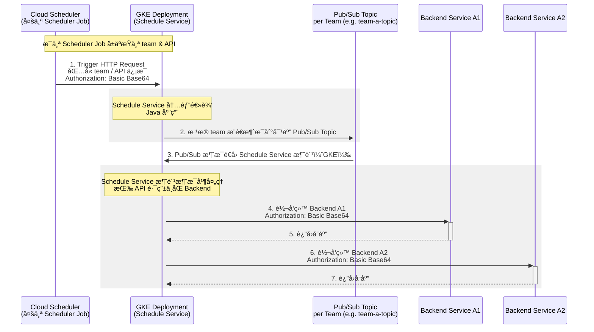

 ```mermaid
sequenceDiagram
    participant S as Cloud Scheduler
    participant P as Pub/Sub Topic
    participant G as GKE Deployment<br/>(Schedule Service)
    participant B as Backend Service

    Note over S,B: Authentication: Basic Base64(user:password)

    S->>+P: 1. Trigger Message<br/>(gcloud schedule jobs)
    P->>+G: 2. Push Message

    rect rgb(240, 240, 240)
        Note over G: Schedule Service Processing
        G->>+B: 3. HTTP Request<br/>Authorization: Basic Base64
        B-->>-G: 4. Response
    end
```


ä½ æ述的业务æµç¨‹æ˜¯ï¼š

- 多个 Cloud Scheduler Job（代表ä¸åŒ API）å‘é€è¯·æ±‚
    
- Schedule Service æ¥æ”¶è¯·æ±‚åæ ¹æ® team → å‘é€åˆ°æŒ‡å®š team çš„ Pub/Sub Topic
    
- æ¯ä¸ª Topic 对应一组 Backend Service（æ¯ä¸ª API 对应一个）
    

  

下é¢æ˜¯åŸºäºä½ æè¿°çš„ **完整 mermaid flow**，已加上 team/topic/API 逻辑ã€Pub/Sub dispatchã€å¤šä¸ª Backend Service，并ä¿ç•™ Basic Auth ä¿¡æ¯ï¼š

---



---

## **✅ 说æ˜è¦ç‚¹**

|**步骤**|**说æ˜**|
|---|---|
|Step 1|Scheduler Job å‘起请求到 GKE çš„ Schedule Service，附带 team + API ä¿¡æ¯ï¼Œä½¿ç”¨ Basic Auth|
|Step 2|Schedule Service æ ¹æ® team æ¨é€æ¶ˆæ¯åˆ°æŒ‡å®š Pub/Sub Topic（如 team-a-topic）|
|Step 3|自己消费 Topic（åŒä¸€ä¸ª Pod 订阅自己å‘é€çš„消æ¯ï¼‰|
|Step 4~7|按 API 决定转å‘给哪个 Backend Service（API1 ✠B1，API2 ✠B2）|

---

## **ğŸ› ï¸ å»ºè®®ä¼˜åŒ–**

- 若一个 Team 有多个 API，å¯è€ƒè™‘按 API 拆分ä¸åŒ Subscription 或 Topic，以é¿å…串行消费影å“其他任务；
    
- æ¯æ¡æ¶ˆæ¯å»ºè®®åŒ…å«ï¼š
    
    - team
        
    - api
        
    - request_url
        
    - retry_id（用äºå¹‚等）
        
    - auth 或内部 token
        
    
- Backend 若部署在 GKE，å¯é€šè¿‡å†…部 DNS 如 http://api1.default.svc.jiqun.local æ¥è®¿é—®
    

---

是å¦è¿˜éœ€è¦æˆ‘帮你加：

- Retry 行为（如 3 次 Retry 间隔）
    
- Pub/Sub 消æ¯å¤±è´¥ DLQ（Dead Letter Queue）æµç¨‹ï¼Ÿ
    
- Timeout 处ç†æµç¨‹ï¼Ÿ
    


ç°åœ¨è®¿é—®çš„ flow 大概如下 
部署一个æœåŠ¡åœ¨ GKE é‡Œé¢ æ¯”å¦‚æˆ‘ä»¬ç§°ä¹‹ä¸º schedule service GKE Deployment (Schedule Service)他是一个 Java å¼€å‘的应用程åº
他会æ¥å—ä¸åŒçš„ team 一个 team å¯èƒ½æœ‰ä¸åŒçš„ cloud Schedule job å‘é€è¿‡æ¥çš„任务请求 schedule service 会将对应 team 的请求å‘é€åˆ°è¿™ä¸ª team 对应的 pub sub 我们针对æ¯ä¸ª team 创建了自己对应的 pub sub 然å这个消æ¯é˜Ÿåˆ—会将对应的请求å‘é€åˆ°ç”¨æˆ·æœ€ç»ˆè¿è¡Œçš„ backend service 当然åŒä¸€ä¸ªTeamçš„ä¸åŒçš„任务请求对应åé¢ä¸åŒçš„Backend Service

我们ç°åœ¨çš„业务处ç†é€»è¾‘有一个问题 比如 team A ä¸‹é¢ ä¸åŒçš„ API [也å¯ä»¥è¯´æ˜¯ä¸åŒçš„cloud schedule job ]å‘é€è¿‡æ¥çš„请求都è¦è®©åŒä¸€ä¸ª pub æ¥å¤„ç† æ¯”å¦‚è¯´è¿™ä¸ªé¢˜ç›® team A API1 å’Œ team A API 2

å¦‚æœ API1 çš„è¯·æ±‚æ²¡æœ‰è¿”å› é‚£ä¹ˆä»–å°±ä¼šä¸€ç›´ç­‰å¾… 而ä¸ä¼šå¤„ç† team A API 2 对应的请求

我们ç°åœ¨ä»ä¸‹é¢è¿™ä¸ªæ–¹é¢æ¥å…³æ³¨è¿™ä¸ªæœåŠ¡   我们ç°åœ¨é‡åˆ°çš„问题是 消æ¯é˜Ÿåˆ—é˜»å¡ ä¼šå½±å“用户的å续正常处ç†
我ç°åœ¨éœ€è¦
Monitor ==> Sre 针对这样的场景 如何åšå¥½ç›‘æ§
场景æ述： 1. 用户调度任务：
用户通过 GCP Cloud Scheduler 创建和管ç†è°ƒåº¦ä»»åŠ¡ï¼Œä½¿ç”¨å‘½ä»¤å¦‚
gcloud scheduler jobs list 查看所有任务。存在一个情况就是 Teams 公用一个 Pub/Sub Topic 的情况
gcloud pubsub topics list . 2. è§¦å‘ Pub/Sub 队列：
æ¯ä¸ªè°ƒåº¦ä»»åŠ¡çš„触å‘会将消æ¯æ¨é€åˆ°ä¸€ä¸ªæŒ‡å®šçš„ Pub/Sub Topic 队列。 3. GKE 部署的 Schedule æœåŠ¡ï¼š
GKE 中部署一个专门用äºå¤„ç†è°ƒåº¦çš„æœåŠ¡ï¼ˆç§°ä¸º Schedule Service）。该æœåŠ¡è®¢é˜… Pub/Sub 消æ¯å¹¶å¤„ç†å…¶ä¸­çš„内容。ç°åœ¨è¿™ä¸ªä¸šåŠ¡å¤„ç†é€»è¾‘有一些缺陷.比如对äºåŒä¸€ä¸ª Teams ä¸åŒçš„ schedule Job 过æ¥åˆ°æˆ‘çš„ Schedule Service 的时候 å…¶å®æ˜¯é’ˆå¯¹åŒä¸€ä¸ª PUB/SUB 的处ç†. 如æœåé¢çš„ Backend Service 处ç†æ¶ˆæ¯ä¸åŠæ—¶å°±ä¼šæœ‰ç§¯å‹æˆ–者这个 backendservice æœåŠ¡ä¸å¯ç”¨.而且这个æœåŠ¡æ˜¯é»˜è®¤ç»è¿‡ Kong 处ç†çš„,比如 Kong 设置了对应的超时,比如默认 6 分钟.我é‡è¯•ä¸‰æ¬¡,å¯èƒ½å°±éœ€è¦ 18 分钟,ç›®å‰æˆ‘çš„ scheudle Service 里é¢çš„ RetryTemplate 机制是三次é‡è¯•.é—´éš” 0s,10s,20s
这样,åŒä¸€ä¸ª Pub/sub 的任务就会 Delay 那么会影å“时间的处ç†.
. Schedule Service æœåŠ¡å¤„ç†é€»è¾‘：
• ä» Pub/Sub 消æ¯é˜Ÿåˆ—中æ¥æ”¶æ¶ˆæ¯ã€‚
• 解æ消æ¯å†…容，æ„建一个 HTTP è¯·æ±‚ï¼ˆåŒ…å« Basic Auth 认è¯å¤´ï¼‰ã€‚
• 使用 curl 或其他 HTTP 客户端库å‘指定的å端æœåŠ¡ URL å‘起请求。 4. backend Service 当然也是部署在 GKE 里é¢çš„一个 Deployment.这个 Deployment æ”¯æŒ HPA çš„

我ç°åœ¨æƒ³è¦å¯¹è¿™ä¸ª GKE Schedule Service æœåŠ¡è¿›è¡Œä¸€ä¸ªå‹åŠ›æµ‹è¯•
我如何进行这个å‹åŠ›æµ‹è¯• ,我需è¦å‡†å¤‡äº›ä»€ä¹ˆä¸œè¥¿.比如我需è¦é…置对应的 gcloud scheduler jobs list.比如创建多个 æ¥å¹¶é请求.而åé¢ä½¿ç”¨ä¸€ä¸ª pubsub 然å我需è¦è§‚察我的 backendService çš„æœåŠ¡çŠ¶æ€.
我们一般的å‹æµ‹å·¥å…·æ˜¯ Jmeter 但是对äºç±»ä¼¼ä»»åŠ¡æˆ‘们如何æ¥å®ç°å‘¢?

1. å‹æµ‹ç›®æ ‡ï¼šæ›´å…³æ³¨

• Schedule Service 的处ç†èƒ½åŠ›ï¼ˆæ¶ˆè´¹é€Ÿç‡ã€é‡è¯•å¤„ç†ï¼‰

• backendService çš„å“应能力（是å¦ä¼šæ’‘爆 HPA）

• æ•´ä½“é“¾è·¯å»¶è¿Ÿï¼ˆä» Cloud Scheduler 到 backendService）

2. ç°æœ‰èµ„æºï¼šæˆ‘需è¦åˆ›å»ºå¯¹åº”çš„ Cloud Scheduler job 是å¦èƒ½è‡ªåŠ¨åŒ–创建上百个用äºå‹æµ‹ï¼Ÿè¿™ä¸ªå¯ä»¥

3. 是å¦å…许使用代ç ç”Ÿæˆ Pub/Sub 消æ¯ï¼šæ¯”如用脚本或 Pub/Sub Publisher API 快速模拟触å‘而ä¸æ˜¯å•é  Scheduler。==》 这个ä¸éœ€è¦

4. Schedule Service 的水平扩展机制：是å¦æ˜¯å•å®ä¾‹ Podï¼Œè¿˜æ˜¯æ”¯æŒ HPA 扩容？å‹æµ‹æ˜¯å¦ä¹Ÿéœ€è¦è¯„估它的扩展性？

5. 你期望å‹æµ‹æŒç»­æ—¶é—´ï¼šæ¯”如 5 分钟ã€30 分钟ã€æŒç»­ 1 å°æ—¶ï¼Ÿæ˜¯å¦æœ‰æœ€å¤§ QPS 或 TPS 的目标？==》 30 分钟å‹æµ‹
   JMeter çš„å‹æµ‹æ–¹æ¡ˆã€‚

(1) 制定å‹æµ‹å‡†å¤‡ä¸åŸºå‡†æµ‹è¯•è®¡åˆ’： (a) 使用 JMeter ç›´æ¥å¯¹å端的 Backend Service 进行独立的å‹åŠ›æµ‹è¯•ï¼Œä»¥ç¡®å®šå…¶æ€§èƒ½åŸºå‡†ï¼ŒåŒ…括最大 QPSã€å“应时间以åŠè§¦å‘ HPA 的具体负载阈值。 (b) 评估并准备å‹æµ‹ç¯å¢ƒï¼Œç¡®ä¿ GCP é…é¢ï¼ˆå¦‚ Cloud Schedulerã€Pub/Sub）充足，并为å‹æµ‹æ•°æ®å»ºç«‹ç‹¬ç«‹çš„命å空间或项目以隔离影å“。 (2) 设计并é…置负载生æˆæœºåˆ¶ï¼š (a) 编写自动化脚本，用äºæ‰¹é‡åˆ›å»ºæ•°ç™¾ä¸ª Cloud Scheduler 任务。 (b) 将所有这些任务é…置为在短时间内（例如，测试开始å的第一分钟内）触å‘，并将消æ¯å‘é€åˆ°åŒä¸€ä¸ªç›®æ ‡ Pub/Sub Topic，以模拟高并å‘和消æ¯ç§¯å‹çš„场景。 (3) æ„建全链路的监æ§ä¸åº¦é‡ä½“系： (a) 在 GCP Monitoring (Cloud Monitoring) 中创建仪表盘，集中监æ§å…³é”®æŒ‡æ ‡ã€‚ (b) ç›‘æ§ Pub/Sub 的积å‹æ¶ˆæ¯æ•°ï¼ˆ`num_undelivered_messages`），这是判断 Schedule Service 处ç†èƒ½åŠ›ç“¶é¢ˆçš„核心指标。 (c) ç›‘æ§ GKE 中 Schedule Service å’Œ Backend Service 的资æºä½¿ç”¨ç‡ï¼ˆCPUã€å†…存）ã€Pod æ•°é‡ï¼ˆè§‚察 HPA 扩缩容行为）以åŠé‡å¯æ¬¡æ•°ã€‚ (d) ç›‘æ§ Schedule Service 的应用程åºæ—¥å¿—，é‡ç‚¹å…³æ³¨æ¶ˆæ¯å¤„ç†è€—æ—¶ã€é‡è¯•æ¬¡æ•°å’Œé”™è¯¯ä¿¡æ¯ã€‚ (e) 为了测é‡ç«¯åˆ°ç«¯å»¶è¿Ÿï¼Œç ”究在消æ¯è½½è·ä¸­æ³¨å…¥å”¯ä¸€ç›¸å…³ ID å’Œåˆå§‹æ—¶é—´æˆ³ï¼Œå¹¶åœ¨ Backend Service 处ç†å®Œæˆæ—¶è®°å½•æ—¥å¿—，以便å续分æ延迟。 (4) 设计 JMeter 测试方案以å调和æ§åˆ¶å‹æµ‹ï¼š (a) é…ç½® JMeter 的线程组（Thread Group），将测试æŒç»­æ—¶é—´è®¾ç½®ä¸º 30 分钟。 (b) 考虑到负载由 Cloud Scheduler 生æˆï¼ŒJMeter 的主è¦ä½œç”¨ä¸æ˜¯ç›´æ¥äº§ç”Ÿè¯·æ±‚，而是作为测试æ§åˆ¶å™¨å’Œè¾…助监æ§å·¥å…·ã€‚å¯ä»¥è®¾ç½®ä¸€ä¸ª HTTP 请求采样器，在测试期间以ä½é¢‘ç‡è½®è¯¢ Backend Service çš„å¥åº·æ£€æŸ¥æ¥å£ï¼Œä»¥ä»å¤–部视角记录其å¯ç”¨æ€§å’Œå“应时间。 (c) 在 JMeter 中é…ç½®å端监å¬å™¨ï¼ˆBackend Listener），将 JMeter 收集到的数æ®ï¼ˆå¦‚å¥åº·æ£€æŸ¥å“应时间）å®æ—¶å‘é€åˆ° Prometheus 或 InfluxDBï¼Œä»¥ä¾¿ä¸ GCP 监æ§æ•°æ®è¿›è¡Œå…³è”分æ。 (5) 执行å‹æµ‹å¹¶è¿›è¡Œå®æ—¶åˆ†æ： (a) 在预定时间å¯åŠ¨ JMeter 测试计划，并åŒæ—¶è§¦å‘自动化脚本æ¥åˆ›å»ºå’Œè¿è¡Œ Cloud Scheduler 任务。 (a) 在 30 分钟的测试期间，密切观察监æ§ä»ªè¡¨ç›˜ï¼Œç‰¹åˆ«æ˜¯ Pub/Sub 消æ¯ç§¯å‹æ•°é‡çš„å˜åŒ–趋势ã€Schedule Service 的资æºæ¶ˆè€—ä»¥åŠ Backend Service çš„ HPA 扩容情况。 (6) 深入分æ测试结æœå¹¶å®šä½æ€§èƒ½ç“¶é¢ˆï¼š (a) 测试结æŸå，详细分æ Pub/Sub 积å‹æ›²çº¿ã€‚如æœç§¯å‹æŒç»­å¢é•¿ï¼Œåˆ™è¯æ˜ Schedule Service 的处ç†èƒ½åŠ›å·²è¾¾ä¸Šé™ã€‚ (b) 分æ Schedule Service 的日志，统计é‡è¯•é€»è¾‘的触å‘频ç‡å’Œæ€»è€—时，评估其对整体处ç†æµç¨‹çš„å½±å“。 (c) 评估 Backend Service çš„ HPA 策略是å¦æœ‰æ•ˆï¼Œæ‰©å®¹æ˜¯å¦åŠæ—¶ï¼Œä»¥åŠåœ¨é«˜è´Ÿè½½ä¸‹çš„å“应时间和错误ç‡ã€‚ (7) 综åˆè¯„ä¼°ç°æœ‰æ¶æ„并æ出优化方案： (a) 基äºæµ‹è¯•æ•°æ®ï¼Œæ‰¹åˆ¤æ€§åœ°åˆ†æå•ä¸€ Pub/Sub Topic 对多 API 造æˆçš„“队头阻å¡â€é—®é¢˜ã€‚ (b) æ出æ¶æ„优化建议，例如：为æ¯ä¸ª API 或任务类å‹ä½¿ç”¨ç‹¬ç«‹çš„ Pub/Sub Topic å’Œ Subscription æ¥å½»åº•è§£å†³é˜»å¡é—®é¢˜ï¼›ä¸º Schedule Service å¯ç”¨ HPA 并优化其内部线程模å‹ä»¥æ高并å‘处ç†èƒ½åŠ›ï¼›ä¸º Pub/Sub 订阅é…置死信队列（Dead-Letter Queue），将处ç†å¤±è´¥çš„消æ¯è½¬ç§»ï¼Œé¿å…å½±å“å续任务。 (8) 规划å›å½’测试： (a) 在å®æ–½ä»»ä½•ä¼˜åŒ–æªæ–½å，使用相åŒçš„å‹æµ‹æ–¹æ¡ˆè¿›è¡Œå›å½’测试，以é‡åŒ–比较改进å‰å的性能差异，并验è¯ä¼˜åŒ–æªæ–½çš„有效性。

# Chatgtp

# **JMeter å‹æµ‹æ–¹æ¡ˆ**

## **场景概述**

当å‰æ¶æ„为：**Cloud Scheduler** 定时任务触å‘消æ¯å‘布到公用的 **Pub/Sub Topic** ï¼›**Schedule Service**（部署在 GKE）订阅该主题，æ¥æ”¶æ¶ˆæ¯åæ„造带 Basic Auth çš„ HTTP 请求，调用åå° **Backend Service**。åå°æœåŠ¡åŒæ ·éƒ¨ç½²åœ¨ GKE，支æŒåŸºäº CPU 或自定义指标（如 Pub/Sub 积å‹ï¼‰è¿›è¡Œ HPA 扩缩容 。由äºå¤šä¸ªè°ƒåº¦ä»»åŠ¡å…±äº«åŒä¸€ä¸»é¢˜ï¼Œä¸”网关（Kong）存在默认 6 分钟超时ã€3 次é‡è¯•ç­‰è®¾ç½®ï¼Œå¦‚æœå端处ç†ä¸åŠæ—¶ï¼Œå¯èƒ½å¯¼è‡´æ¶ˆæ¯å †ç§¯å’Œå»¶è¿Ÿã€‚为此，我们需è¦å¯¹æ•´ä¸ªé“¾è·¯è¿›è¡Œ 30 分钟的å‹åŠ›æµ‹è¯•ï¼Œè¯„ä¼°å„组件在高负载下的表ç°å’Œæ‰©å±•æ€§ã€‚

## **å‹æµ‹ç›®æ ‡**

- **Schedule Service 处ç†èƒ½åŠ›**：测é‡æ¶ˆæ¯æ¶ˆè´¹é€Ÿç‡ã€å¹¶å‘处ç†èƒ½åŠ›åŠé‡è¯•æœºåˆ¶å¯¹æ€§èƒ½çš„å½±å“。监æ§è®¢é˜…未确认消æ¯æ•°é‡ï¼Œæ£€æŸ¥æ˜¯å¦å‡ºç°ç§¯å‹ã€‚
- **Backend æœåŠ¡å“应能力**：观察å端请求的平å‡å»¶è¿Ÿã€é”™è¯¯ç‡ï¼Œä»¥åŠ HPA 扩展情况（Pod æ•°é‡éšè´Ÿè½½å˜åŒ–）。验è¯å端在高并å‘下是å¦ä¼šè¾¾åˆ°èµ„æºç“¶é¢ˆã€‚
- **端到端延迟**ï¼šç»Ÿè®¡ä» Cloud Scheduler 触å‘到消æ¯ç» Schedule Service 处ç†å¹¶é€è¾¾ Backend 的总体时延（å¯é€šè¿‡åœ¨æ¶ˆæ¯ä¸­åŠ å…¥æ—¶é—´æˆ³ã€è‡ªå®šä¹‰æ—¥å¿—埋点等方å¼æµ‹é‡ï¼‰ã€‚
- **整体稳定性**：检查网关超时ã€é”™è¯¯å“应ã€æœåŠ¡æ—¥å¿—错误等，确ä¿é«˜è´Ÿè½½æ—¶ç³»ç»Ÿç¨³å®šæ€§ã€‚

## **负载生æˆç­–ç•¥**

- **åˆ›å»ºå¤§é‡ Scheduler 任务**：利用 gcloud 命令或脚本批é‡åˆ›å»ºæ•°å甚至上百个 Cloud Scheduler 任务。例如使用 gcloud scheduler jobs create pubsub ... --topic=TOPIC --message-body="..." æ–¹å¼ï¼Œä¸€æ¬¡æ€§ç”Ÿæˆå¤šä¸ªè§¦å‘åŒä¸€ä¸»é¢˜çš„任务 。å¯ä»¥å°†è¿™äº›ä»»åŠ¡é¢‘ç‡è®¾ä¸ºæ¯åˆ†é’Ÿæˆ–更短，以æŒç»­è§¦å‘大é‡æ¶ˆæ¯ã€‚
- **ç›´æ¥å‘布 Pub/Sub 消æ¯**：除了 Scheduler，也å¯ä»¥è·³è¿‡ Scheduler ç›´æ¥é€šè¿‡è„šæœ¬æˆ–工具调用 Pub/Sub å‘布 API。JMeter å¯ä»¥æ¨¡æ‹Ÿè¿™ä¸€æ“作（è§ä¸‹æ–‡ JMeter 方案）。需è¦ä¸€ä¸ªæ‹¥æœ‰ Publisher æƒé™çš„ Service Account，并é…置好 Pub/Sub 主题。
- **使用 JMeter 生æˆè´Ÿè½½**：通过 JMeter 模拟并å‘任务å‘布消æ¯ã€‚安装 Google Pub/Sub æ’件å，å¯åœ¨æ¯ä¸ªçº¿ç¨‹ç»„中使用 “**PubSub-PublisherConfiguration**†é…ç½®å‘布凭è¯å’Œä¸»é¢˜ä¿¡æ¯ï¼Œç„¶å添加 “**Publisher Request**†采样器，填入è¦å‘布的消æ¯å†…容 。æ¯ä¸ªçº¿ç¨‹ç»„就模拟一个并å‘客户端，ä¸æ–­å‘布消æ¯åˆ° Pub/Sub（文档建议å¯é€šè¿‡å¢å¤§çº¿ç¨‹ç»„数和请求延迟æ¥æ§åˆ¶è´Ÿè½½å¼ºåº¦ ）。

## **JMeter 测试方案**

- **ç¯å¢ƒå‡†å¤‡**：安装 JMeter，并使用 Plugins Manager 安装 **GCP Pub/Sub Plugin**。根æ®å®˜æ–¹æ示，将 Google Cloud Pub/Sub 客户端ä¾èµ–（如 google-cloud-pubsubã€gson）下载放入 JMeter çš„ lib 目录 。
- **é…置线程组**：在测试计划中添加一个或多个线程组（Thread Group），é…置好线程数（并å‘用户数）ã€Ramp-up 和循ç¯æ¬¡æ•°ã€‚å¯ä¾æ®é¢„期ååé‡è°ƒæ•´çº¿ç¨‹æ•°å’Œå»¶è¿Ÿï¼Œä»¥æ¨¡æ‹Ÿé€æ­¥å¢åŠ çš„è´Ÿè½½ 。例如，é€æ­¥ä» 10 个线程å¢è‡³ 100 个线程，观察系统表ç°ã€‚
- **Pub/Sub å‘布采样器**：在线程组下é…ç½® “PubSub-PublisherConfigurationâ€ï¼ŒæŒ‡å®š GCP 项目ã€ä¸»é¢˜ã€Service Account 凭è¯ç­‰ä¿¡æ¯ 。éšå添加 “Publisher Request†采样器，将è¦å‘é€çš„消æ¯æ•°æ®å¡«å…¥ Body（å¯åŒ…å« JSON 等调度任务的å®é™…æ ¼å¼ï¼‰ã€‚执行测试时，æ¯ä¸ªçº¿ç¨‹ä¼šä¸æ–­å‘ Pub/Sub å‘布消æ¯ã€‚
- **å¯é€‰è„šæœ¬å®ç°**：若ä¸ä½¿ç”¨æ’件，也å¯åœ¨ JMeter 中添加 **JSR223 Sampler** 并引入 Google Pub/Sub Java 客户端库，通过 Groovy 脚本调用 Publisher.publish() æ¥å£å‘布消æ¯ï¼ˆå‚考 Google 官方示例 ）。但使用æ’件方å¼æ›´ç›´è§‚。
- **æ§åˆ¶ä¸å¢é‡æµ‹è¯•**：测试建议分阶段进行，先验è¯å°è§„模负载是å¦æ­£å¸¸ï¼Œç„¶åé€æ­¥å¢åŠ å¹¶å‘和消æ¯é€Ÿç‡ã€‚在相åŒæµ‹è¯•æœŸé—´ä¿æŒ 30 分钟左å³çš„æŒç»­è´Ÿè½½ï¼Œä»¥ç¨³å®šè§‚察扩展表ç°ã€‚

## **监æ§ä¸æŒ‡æ ‡**

- **Pub/Sub 订阅监æ§**：在 Cloud Monitoring 中观察订阅相关指标。关注 **subscription/num_unacked_messages_by_region**（未确认消æ¯æ•°ï¼‰å’Œ **subscription/oldest_unacked_message_age_by_region**（最è€æœªç¡®è®¤æ¶ˆæ¯æ—¶é•¿ï¼‰ç­‰æŒ‡æ ‡ ，判断是å¦å‡ºç°æ¶ˆæ¯å †ç§¯æˆ–处ç†æ»å。订阅的 ack/message 速ç‡ä¹Ÿå¯è¡¨å¾ Schedule Service 的消费速ç‡ã€‚
- **Schedule Service 监æ§**：通过容器监æ§ï¼ˆCPUã€å†…存）和应用日志，查看其处ç†ååé‡ã€é”™è¯¯ï¼ˆä¾‹å¦‚å‘布失败ã€è¶…æ—¶é‡è¯•ï¼‰ç­‰ã€‚记录æœåŠ¡ç«¯æ—¥å¿—中处ç†æ¯æ¡æ¶ˆæ¯çš„时间。利用指标工具（如 Prometheus + Grafana 或 Stackdriver Monitoring）统计æ¯ç§’处ç†æ¶ˆæ¯æ•°ã€é‡è¯•æ¬¡æ•°ç­‰ã€‚
- **Backend æœåŠ¡ç›‘æ§**：查看å端 Deployment çš„**Pod æ•°é‡**å’Œ**CPU/内存利用ç‡**，评估 HPA 扩容情况。监æ§è¯·æ±‚å“应时间（平å‡/99%时延）ã€é”™è¯¯ç‡ï¼ˆHTTP 5xx）等。HPA 如æœåŸºäº CPU 或 Pub/Sub 积å‹è¿›è¡Œæ‰©å®¹ï¼Œåº”当能在负载å‡é«˜æ—¶è§¦å‘更多副本 。å¯ä½¿ç”¨ kubectl get hpa 或监æ§ä»ªè¡¨ç›˜æŸ¥çœ‹å®æ—¶çŠ¶æ€ã€‚
- **端到端延迟**：在 Schedule Service å‘布到 Backend çš„ HTTP 请求中，å¯ä»¥ä¼ é€’下游返å›ä¿¡æ¯æˆ–者在日志打å°æ—¶é—´æˆ³ï¼›æˆ–者在åŸå§‹æ¶ˆæ¯ä¸Šæ‰“标记以计算ä»å‘布到确认的总时延。统计并分æ这部分延迟éšè´Ÿè½½å¢åŠ çš„å˜åŒ–趋势。
- **网关/Kong 监æ§**：由äºè¯·æ±‚通过 Kong 转å‘，需关注 Kong 的超时和é‡è¯•æ—¥å¿—。记录是å¦æœ‰è¯·æ±‚因超时（6 分钟）被å–消而导致é‡è¯•ï¼Œæˆ–积å‹åœ¨ Schedule Service 中。
- **日志分æ**：将å„组件日志（Schedule Serviceã€Backend）导出到 Cloud Logging 或 BigQuery，进行详细分æ。Google 建议在大规模测试时进行二级日志分æ，因为监æ§æŒ‡æ ‡å¯èƒ½ä¸å¤Ÿç²¾ç»† 。

## **扩展性评估**

- **Schedule Service 扩容**ï¼šå¦‚æœ Schedule Service é…置了 HPAï¼ˆå¦‚åŸºäº CPU 或自定义指标），观察在高并å‘时是å¦è‡ªåŠ¨å¢å®¹ã€‚测试中å¯å°è¯•ä¿®æ”¹ HPA 最å°å®ä¾‹æ•°ã€ä¸åŒæŒ‡æ ‡ç­–略，评估其线性扩展能力。
- **Backend HPA**：Backend å·²å¯ç”¨ HPA，应能根æ®è´Ÿè½½è‡ªåŠ¨æ‰©å®¹ã€‚利用测试观察 HPA 扩容速度和副本稳定性。å¯ä»¥è€ƒè™‘使用 Pub/Sub 积å‹æŒ‡æ ‡æ¥é©±åŠ¨ HPA，使其在消æ¯å †ç§¯åˆæœŸå°±è§¦å‘扩容 。
- **Kong 和超时策略**：如æœå‘ç°ç½‘关超时æˆä¸ºç“¶é¢ˆï¼Œå¯å°è¯•è°ƒæ•´ Kong 的超时和é‡è¯•å‚数，或å¢åŠ  Kong å®ä¾‹æ•°ã€‚测试应验è¯ä¿®æ”¹é…ç½®åçš„å½±å“，例如是å¦æœ‰æ•ˆé¿å…了过多的失败é‡è¯•ç´¯ç§¯ã€‚
- **水平扩展能力**：在测试过程中，检查是å¦åœ¨è´Ÿè½½é™ä½å Pod 能正常缩容（HPA å›ç¼©æœºåˆ¶ï¼‰ã€‚å¯å¤šæ¬¡è¿›è¡Œä¸åŒè§„模的å‹æµ‹ï¼Œç¡®è®¤æœåŠ¡çš„扩展ä¸æ”¶æ•›æ˜¯å¦ç¨³å®šå¹¶çº¿æ€§ã€‚

## **å‹æµ‹æ­¥éª¤ç¤ºä¾‹**

1. **准备ç¯å¢ƒ**：在 GCP 项目中创建一个 Pub/Sub 主题和对应订阅。编写脚本或手动使用 gcloud 批é‡åˆ›å»º Cloud Scheduler 任务，例如：gcloud scheduler jobs create pubsub job1 --schedule="_/1 _ \* \* \*" --topic=TEST_TOPIC --message-body="test" ，ä¾æ­¤ç±»æ¨åˆ›å»ºå¤šä¸ªä½œä¸šã€‚
2. **é…ç½® JMeter**：å¯åŠ¨ JMeter，安装并é…ç½® GCP Pub/Sub æ’件。设置好线程组å‚数（线程数ã€Ramp-upã€å¾ªç¯æ¬¡æ•°ï¼‰å’Œ PubSub-PublisherConfiguration（填写项目 IDã€ä¸»é¢˜åã€æœåŠ¡è´¦å·å‡­è¯è·¯å¾„）。
3. **è¿è¡Œå‹æµ‹**：å¯åŠ¨ JMeterï¼Œå¼€å§‹å‘ Pub/Sub å‘布大é‡æ¶ˆæ¯ï¼ŒæŒç»­çº¦ 30 分钟。在测试过程中é€æ­¥å¢åŠ å¹¶å‘é‡ï¼Œè§‚察 JMeter çš„ååç‡å’Œé”™è¯¯æ•°ã€‚
4. **监æ§è§‚察**：åŒæ—¶åœ¨ GCP æ§åˆ¶å°ç›‘æ§ Pub/Sub 订阅状æ€ï¼ˆæœªç¡®è®¤æ¶ˆæ¯æ•°ã€å»¶è¿Ÿï¼‰ã€Schedule Service çš„ Pod 指标ã€Backend æœåŠ¡çš„ CPU/Pod æ•°å’Œå“应延迟等。记录关键数æ®ç‚¹ï¼Œå¦‚最大ååé‡ã€å¹³å‡å»¶è¿Ÿã€é”™è¯¯ç‡ã€‚
5. **æ•°æ®åˆ†æ**：测试结æŸå，对照监æ§æ•°æ®å’Œæ—¥å¿—分æå„项指标。例如，如æœæœªç¡®è®¤æ¶ˆæ¯æ•°æŒç»­å¢é•¿ï¼Œè¯´æ˜æ¶ˆè´¹é€Ÿç‡ä¸è¶³ï¼›å¦‚æœ HPA 达到上é™ä½†ä»é¥±å’Œï¼Œè¯´æ˜èµ„æºå¯èƒ½ä¸å¤Ÿï¼›è‹¥ç½‘关出ç°å¤§é‡è¶…时或 5xx 错误，则需优化é‡è¯•ç­–略或扩容网关等。

## **å续优化建议**

- 优化 **Schedule Service** 逻辑：调整内部é‡è¯•æ¬¡æ•°å’Œé—´éš”（当å‰ä¸º 0sã€10sã€20s），é¿å…因长时间阻å¡å¯¼è‡´æ¶ˆæ¯ç§¯å‹è¿‡å¤šã€‚
- 考虑对ä¸åŒä¸šåŠ¡å›¢é˜Ÿåˆ†é…独立的 Pub/Sub 主题或订阅，以隔离æµé‡ï¼Œé˜²æ­¢â€œå…¬ç”¨ä¸»é¢˜â€å¯¼è‡´çš„互相影å“。
- æ ¹æ®å‹æµ‹ç»“æœè°ƒæ•´ HPA 策略和网关é…置，如å¢åŠ  Kong å®ä¾‹ã€å»¶é•¿è¶…时时间或å¯ç”¨åˆ†å¸ƒå¼è¿½è¸ªç­‰ã€‚

**å‚考资料：** Cloud Scheduler å¯é€šè¿‡ gcloud 命令创建 Pub/Sub ç±»å‹ä»»åŠ¡ ï¼›JMeter GCP Pub/Sub æ’ä»¶ä½¿ç”¨è¯´æ˜ ï¼›Google Cloud Run 文档建议使用 JMeter 线程组æ¥æ§åˆ¶è´Ÿè½½ ï¼›GKE HPA å¯åŸºäº Pub/Sub 积å‹è‡ªåŠ¨æ‰©å®¹ ï¼›Pub/Sub 监æ§æŒ‡æ ‡åŒ…括未确认消æ¯æ•°å’Œæœ€è€æœªç¡®è®¤æ—¶é—´ 。

是的，你的目标 **完全å¯ä»¥å®ç°**，æ¶æ„上也åˆç†ï¼š

**一个 Topic + 多个 Subscription（æ¯ä¸ª Job 绑定一个 Sub）+ åŒä¸€ä¸ª Backend API。**

---

## **✅ æ¶æ„目标总结**


---

## **✅ 关键技术点说æ˜**

### **1.** 

### **Pub/Sub 支æŒä¸€å¯¹å¤šæ¶ˆè´¹**

- 一个 Topic å¯ä»¥ç»‘定多个 Subscriptionï¼›
- æ¯ä¸ª Subscription 收到的消æ¯æ˜¯å½¼æ­¤**独立的副本**ï¼›
- 所以你å¯ä»¥è®©æ¯ä¸ª Cloud Scheduler Job 对应一个 Sub，通过 Pub/Sub -> Schedule Service -> Backend。

### **2.** 

### **如何å®ç°å¤š Sub 消费åŒä¸€ä¸ª Topic？**

#### **Step A: 创建多个 Subscription（独立å字）**

```
for i in $(seq -w 1 100); do
  gcloud pubsub subscriptions create sub-job-${i} \
    --topic=aibang-lex-eg-job-topic \
    --ack-deadline=60 \
    --message-retention-duration=600s \
    --project=your-project-id
done
```

#### **Step B: æ¯ä¸ª Schedule Service å®ä¾‹ç›‘å¬ä¸€ä¸ª Subscription（或é…置消费多个）**

- ä½ å¯ä»¥éƒ¨ç½²å¤šä¸ªå®ä¾‹ï¼Œæˆ– Schedule Service 内部用并å‘线程分别订阅；
- 或者åŒä¸€ä¸ªæœåŠ¡æ¥æ”¶å¤šä¸ª Subscription 的消æ¯ï¼ˆéœ€è¦å¼‚步处ç†ï¼‰ï¼›
- **建议方å¼**：æ¯ä¸ª Sub 对应一个 Kubernetes Job 或 Deployment 处ç†é€»è¾‘。

---

## **✅ JMeter å‹æµ‹å»ºè®®**

ä½ ä¸éœ€è¦ JMeter ç›´æ¥è°ƒç”¨ Backend API，而是间æ¥é€šè¿‡ Cloud Scheduler å‘é€ Pub/Sub 消æ¯æ¥å‹æµ‹ï¼š

| **工具**                            | **目标**                                                               |
| ----------------------------------- | ---------------------------------------------------------------------- |
| gcloud scheduler jobs create pubsub | 模拟用户任务调度，批é‡è§¦å‘æ¶ˆæ¯                                         |
| GCP Pub/Sub                         | åŒä¸€ä¸ª Topic + 多个 Subscription å®ç° fan-out 并å‘å¤„ç†                 |
| Schedule Service (GKE)              | å®é™…消费并调用 Backend API（评估处ç†ä¸é‡è¯•èƒ½åŠ›ï¼‰                       |
| Backend API                         | 被å‹æµ‹ç›®æ ‡ï¼Œé€šè¿‡ GKE HPA 自动扩容                                      |
| JMeter（å¯é€‰ï¼‰                      | 模拟外部高频 Job åˆ›å»ºæˆ–ç›‘æ§ Backend å“应性能（如你还想模拟 HTTP 请求） |

---

## **✅ 建议监æ§æŒ‡æ ‡**

| **层级**         | **指标**                       | **说æ˜**                   |
| ---------------- | ------------------------------ | -------------------------- |
| Pub/Sub          | num_undelivered_messages       | 检查是å¦å­˜åœ¨æ¶ˆæ¯ backlog   |
| Pub/Sub          | ack_latency                    | 消æ¯æ¶ˆè´¹å»¶è¿Ÿ               |
| Scheduler        | job execution count            | 是å¦å®šæ—¶ç¨³å®šè§¦å‘           |
| Schedule Service | CPU / memory / request latency | 是å¦å­˜åœ¨å¤„ç†ç“¶é¢ˆ           |
| Backend API      | å“应时间 / HPA Pod æ•°          | 是å¦æ‰©å®¹åŠæ—¶ï¼Œæ˜¯å¦è¯·æ±‚撑爆 |
| Kong             | 超时 / 5xx                     | 转å‘失败或å“应过慢         |

---

## **✅ åç»­å¯æ‰©å±•ç­–ç•¥**

- è‹¥è¦å½»åº•éš”离ä¸åŒå›¢é˜Ÿå½±å“，å¯ä»¥è€ƒè™‘：
    - æ¯ä¸ªå›¢é˜Ÿä¸€ä¸ª Topicï¼›
    - 或者åŒä¸€ä¸ª Topic + Filtered Subscription（Pub/Sub 支æŒè¿‡æ»¤å™¨ï¼‰ï¼›
- å¯åœ¨æ¶ˆæ¯ä¸­åŠ ä¸Š apiName/teamName/traceId 字段，方便日志追踪；
- å¯é€šè¿‡ Cloud Logging + BigQuery 分ææ¯æ¡é“¾è·¯çš„处ç†è€—时。

---

是å¦éœ€è¦æˆ‘帮你生æˆï¼š

- 多 Subscription 自动创建脚本
- Schedule Service 消费多个 Sub 的代ç æ¨¡æ¿ï¼ˆJava）
- 监æ§æŒ‡æ ‡ YAML 或 Grafana 图表模æ¿ï¼Ÿ

你选哪一个我就直æ¥ç»™ã€‚

我æ˜ç¡®äº†éœ€æ±‚,ç°åœ¨ä¸ç”¨ Jmeter 工具,ç›´æ¥ç”¨ schedule job çš„æ–¹å¼æ¥ Trigger 这个测试,比如我æ 100 个 Job 然åå‘ç»™åŒä¸€ä¸ª PUB/SUB 让其æ¥å¤„ç†.我ç°åœ¨æ¯”如如何创建这么多 Job 里é¢çš„任务的 message body 如何写?这个是ä¸æ˜¯ä¾èµ–äºæˆ‘çš„ backend service 比如我的 backend service å…¶å®å°±æ˜¯ä¸€ä¸ª health çš„é¡µé¢ æˆ‘å°±æ˜¯æœ€ç®€å•çš„模拟测试

æ˜ç™½äº†ï¼Œä½ ç°åœ¨çš„å‹æµ‹ç›®æ ‡æ˜¯ï¼š

- ✅ 用 **Cloud Scheduler 创建 100 个 Job**
- ✅ 所有 Job å‘é€åˆ°åŒä¸€ä¸ª **Pub/Sub Topic**
- ✅ ä¸ç”¨ JMeter，而是通过 Cloud Scheduler 的频ç¹è§¦å‘æ¥æ¨¡æ‹Ÿé«˜å¹¶å‘
- ✅ æ¯æ¡æ¶ˆæ¯è¢« Schedule Service 处ç†å，转å‘请求到一个简å•çš„ Backend（比如 /health）

---

## **✅ Message Body è¦æ€ä¹ˆå†™ï¼Ÿ**

**完全å–决äºä½ çš„ Schedule Service 如何解æ Pub/Sub çš„ message。**

如æœä½ çš„ Schedule Service 是 Java 写的，通常会对 PubsubMessage.getData() 进行 Base64 解ç ï¼Œå†ååºåˆ—化æˆæŸç§ç»“æ„（比如 JSON 对象）——那么你就应该æ„造这个格å¼çš„消æ¯ã€‚

### **🔧 å‡è®¾ Schedule Service åªéœ€è¦ä¸€ä¸ª URL å‚数（访问 Backend çš„** 

### **/health**

### **）**

ä½ å¯ä»¥è¿™æ ·æ„造 message body（JSON æ ¼å¼ï¼‰ï¼š

```
{
  "url": "http://backend-service.default.svc.jiqun.local/health",
  "method": "GET",
  "team": "team-a",
  "api": "health-check"
}
```

---

## **✅ Shell 脚本：批é‡åˆ›å»º 100 个 Job**

```
#!/bin/bash

PROJECT_ID="your-gcp-project-id"
REGION="asia-east1"
TOPIC="aibang-lex-eg-job-topic"
URL="http://backend-service.default.svc.jiqun.local/health"

for i in $(seq -w 1 100); do
  JOB_NAME="job-health-check-${i}"
  MESSAGE_BODY=$(jq -c -n \
    --arg url "$URL" \
    --arg team "team-a" \
    --arg api "health-check-$i" \
    '{url: $url, method: "GET", team: $team, api: $api}')

  gcloud scheduler jobs create pubsub "$JOB_NAME" \
    --schedule="*/1 * * * *" \
    --time-zone="Asia/Shanghai" \
    --topic="$TOPIC" \
    --message-body="$MESSAGE_BODY" \
    --description="Health check job $i" \
    --project="$PROJECT_ID" \
    --location="$REGION"
done
```

> 如æœä½ æœ¬åœ°æ²¡æœ‰å®‰è£… jq，你也å¯ä»¥ç”¨ç®€å•çš„ bash 字符串拼æ¥ï¼š

```
MESSAGE_BODY="{\"url\":\"$URL\",\"method\":\"GET\",\"team\":\"team-a\",\"api\":\"health-check-$i\"}"
```

---

## **✅ Schedule Service 如何处ç†ï¼Ÿ**

å‡è®¾ä½ çš„ Schedule Service 逻辑是这样（简化）：

```
String raw = new String(pubsubMessage.getData().toByteArray(), StandardCharsets.UTF_8);
JsonObject json = new Gson().fromJson(raw, JsonObject.class);
String url = json.get("url").getAsString();
String method = json.get("method").getAsString();
```

然åæ„造请求å‘给你 GKE 内的 Backend Deployment。

---

## **✅ 模拟一个最简å•çš„ Backend** 

## **/health**

##  **API**

如æœä½ åªæ˜¯ä¸ºäº†è®© Schedule Service å‘请求，å¯ä»¥å…ˆéƒ¨ç½²ä¸€ä¸ªæœ€ç®€å•çš„ /health æœåŠ¡ï¼Œæ¯”如：

```
kubectl create deployment health-api --image=nginx
kubectl expose deployment health-api --port=80 --target-port=80 --name=health-api
```

然å Schedule Service çš„ URL 就是：

```
http://health-api.default.svc.jiqun.local/
```

æˆ–è€…ä½ åœ¨å®¹å™¨é‡Œè·‘ä¸ªè¿”å› 200 OK çš„ç®€å• Spring Boot 或 Flask /health æ¥å£ã€‚

---

## **✅ æ¨è你监æ§è¿™äº›å†…容 during test：**

| **组件**         | **关注点**            | **指标建议**                                         |
| ---------------- | --------------------- | ---------------------------------------------------- |
| Pub/Sub          | 堆积是å¦å¢åŠ           | num_undelivered_messages, oldest_unacked_message_age |
| Schedule Service | 是å¦æœ‰æ¶ˆè´¹å µå¡ / é‡è¯• | Pod CPUã€æ—¥å¿—ã€æ˜¯å¦æœ‰ timeoutã€ack é€Ÿç‡              |
| Backend Service  | å“应是å¦æ’‘爆 HPA      | 请求 QPSã€å“应时间ã€é”™è¯¯ç‡ã€Pod æ•°é‡å˜åŒ–             |
| 总链路           | 是å¦ç¨³å®š              | Stackdriver Trace + Logging（å¯é€‰ï¼‰                  |

---

需è¦æˆ‘：

- 帮你写一个 Schedule Service 消费者 Java 示例？
- å¸®ä½ ç”Ÿæˆ Stackdriver ç›‘æ§ Dashboard 模æ¿ï¼Ÿ

你告诉我目标，我马上é…好。

# Gemini

# 针对 GKE ä¸ Pub/Sub 异步æ¶æ„çš„å‹åŠ›æµ‹è¯•ä¸å¯é æ€§éªŒè¯ç»¼åˆæ–¹æ¡ˆ

æœ¬æŠ¥å‘Šæ—¨åœ¨ä¸ºåŸºäº Google Cloud Schedulerã€GKE 托管æœåŠ¡åŠ Cloud Pub/Sub çš„å¤æ‚异步处ç†é“¾è·¯ï¼Œæ供一个全é¢ã€æ·±å…¥ä¸”å¯æ‰§è¡Œçš„å‹åŠ›æµ‹è¯•ä¸å¯é æ€§éªŒè¯æ–¹æ¡ˆã€‚我们将超越传统的“å‹å®â€å¼æµ‹è¯•ï¼Œé‡‡ç”¨ç½‘ç«™å¯é æ€§å·¥ç¨‹ï¼ˆSRE）的最佳å®è·µï¼Œå°†æœ¬æ¬¡æµ‹è¯•æ„建为一次科学的ã€ä»¥æ•°æ®é©±åŠ¨çš„å¯é æ€§éªŒè¯è¿‡ç¨‹ã€‚

本方案的核心目标ä¸ä»…是找出系统的性能瓶 G 颈，更是为了é‡åŒ–其在负载下的行为，验è¯å…¶å¼¹æ€§ä¼¸ç¼©ä¸å®¹é”™æœºåˆ¶çš„有效性，并最终为æœåŠ¡çš„å¯é æ€§ç›®æ ‡ï¼ˆSLO）æä¾›åšå®çš„æ•°æ®æ”¯æ’‘。我们将éµå¾ªä»ç†è®ºæ¡†æ¶ã€ç¯å¢ƒå‡†å¤‡ã€è´Ÿè½½ç¼–æ’ã€å…¨é“¾è·¯ç›‘æ§ï¼Œåˆ°ç»“æœåˆ†æä¸å¼¹æ€§ä¼˜åŒ–的完整æµç¨‹ï¼Œç¡®ä¿æµ‹è¯•çš„科学性ã€å¯é‡å¤æ€§ä¸ä»·å€¼æœ€å¤§åŒ–。

## 第 1 部分：以å¯é æ€§ä¸ºé©±åŠ¨çš„测试框æ¶

在å¯åŠ¨ä»»ä½•å®é™…æ“作之å‰ï¼Œæˆ‘们必须建立一个åšå®çš„ç†è®ºæ¡†æ¶ã€‚这次å‹åŠ›æµ‹è¯•çš„目的ä¸åº”仅仅是å‘ç°ç³»ç»Ÿèƒ½æ‰¿è½½å¤šå¤§çš„ QPS，而应是验è¯ç³»ç»Ÿåœ¨é¢„设的负载下，是å¦èƒ½å¤Ÿæ»¡è¶³å…¶å¯¹ç”¨æˆ·çš„å¯é æ€§æ‰¿è¯ºã€‚我们将此承诺é‡åŒ–为æœåŠ¡ç­‰çº§ç›®æ ‡ï¼ˆService Level Objectives, SLOs）。

### 1.1. 测试哲学：ä»å‹åŠ›æµ‹è¯•åˆ°å¯é æ€§éªŒè¯

传统的å‹åŠ›æµ‹è¯•å¾€å¾€ä»¥â€œæ‰¾åˆ°æé™â€ä¸ºç»ˆç‚¹ï¼Œä½†ä¸€ä¸ªæˆç†Ÿçš„工程组织更关心的是“在承诺的范围内，系统是å¦ç¨³å®šè¿è¡Œâ€ã€‚SRE 的核心ç†å¿µåœ¨äºï¼Œ100%çš„å¯é æ€§æ—¢ä¸ç°å®ä¹Ÿé用户的真å®éœ€æ±‚，它æˆæœ¬é«˜æ˜‚且å¯èƒ½é˜»ç¢åˆ›æ–° 1。因此，我们追求的是一个ç»è¿‡æ·±æ€ç†Ÿè™‘ã€èƒ½å¤Ÿå¹³è¡¡ç”¨æˆ·æ»¡æ„度ä¸å·¥ç¨‹æˆæœ¬çš„å¯é æ€§ç›®æ ‡ã€‚

本次测试将围绕 SLO 进行，它将æˆä¸ºè¡¡é‡æµ‹è¯•æˆåŠŸä¸å¦çš„唯一标准。测试过程中的æ¯ä¸€æ¬¡æ€§èƒ½ä¸‹é™æˆ–错误，都将被视为对“错误预算（Error Budget）â€çš„消耗。错误预算是`100% - SLO`所å…许的“ä¸å®Œç¾â€ç©ºé—´ï¼Œå®ƒä¸ºæˆ‘们进行有é£é™©çš„å‘布ã€ç»´æŠ¤å’Œæ­¤ç±»å‹åŠ›æµ‹è¯•æ供了é‡åŒ–çš„è®¸å¯ 3。如æœæµ‹è¯•è¿‡ç¨‹è€—尽了预设的错误预算，这便是一个强烈的信å·ï¼Œè¡¨æ˜ç³»ç»Ÿåœ¨å½“å‰è´Ÿè½½ä¸‹çš„å¯é æ€§ä¸è¶³ï¼Œéœ€è¦ä¼˜å…ˆæŠ•å…¥å·¥ç¨‹èµ„æºè¿›è¡ŒåŠ å›ºï¼Œè€Œé继续开å‘新功能 3。

### 1.2. 定义您的æœåŠ¡ç­‰çº§æŒ‡æ ‡ï¼ˆSLIs）

æœåŠ¡ç­‰çº§æŒ‡æ ‡ï¼ˆService Level Indicator, SLI）是对æœåŠ¡æŸæ–¹é¢æ€§èƒ½çš„é‡åŒ–度é‡ã€‚对äºæ‚¨æ述的异步处ç†ç³»ç»Ÿï¼Œæˆ‘们必须选择能够真å®å映用户体验的 SLIã€‚æ ¹æ® Google SRE 的最佳å®è·µï¼Œé’ˆå¯¹ä¸åŒç±»å‹çš„系统，我们应关注ä¸åŒçš„指标维度 6。

- **å¯ç”¨æ€§ SLI (Availability):**
    - **指标定义：** ç”±`backendService`æˆåŠŸå¤„ç†å¹¶ç¡®è®¤ï¼ˆACK）的消æ¯ï¼Œå å…¶å°è¯•å¤„ç†çš„所有有效消æ¯çš„比例。这是衡é‡æ¶ˆè´¹è€…处ç†èƒ½åŠ›çš„核心指标。
    - **å®ç°æ–¹å¼ï¼š** æ­¤ SLI å¯ä»¥é€šè¿‡ Cloud Monitoring 中的 Pub/Sub 指标计算得出。公å¼ä¸ºï¼š`æˆåŠŸå¤„ç†çš„消æ¯æ•° / (æˆåŠŸå¤„ç†çš„消æ¯æ•° + 进入死信队列的消æ¯æ•°)`。具体指标为`pubsub.googleapis.com/subscription/ack_message_count`å’Œ`pubsub.googleapis.com/subscription/dead_letter_message_count` 7。一个é…置了死信队列（Dead-Letter Queue, DLQ）的系统，其最终失败的标志就是消æ¯è¢«é€å…¥ DLQ。
- **延迟 SLI (Latency):**
    - **指标定义：** ä» Cloud Scheduler 作业触å‘，到消æ¯è¢«`backendService`最终æˆåŠŸå¤„ç†çš„端到端（End-to-End）时间的分布。对äºå¼‚步系统，这是一个å¤æ‚但至关é‡è¦çš„指标 6。
    - **å®ç°æ–¹å¼ï¼š** 测é‡ç«¯åˆ°ç«¯å»¶è¿Ÿçš„唯一å¯é æ–¹æ³•æ˜¯ä½¿ç”¨åˆ†å¸ƒå¼è¿½è¸ªï¼ˆDistributed Tracing）。我们将在æœåŠ¡ä¸­æ¤å…¥ OpenTelemetry，将分散在å„个æœåŠ¡ä¸­çš„æ“作（span）关è”到åŒä¸€ä¸ªè¿½è¸ªï¼ˆtrace）上。我们将é‡ç‚¹å…³æ³¨å»¶è¿Ÿçš„ P95（95th percentile）和 P99 分ä½å€¼ï¼Œå› ä¸ºå®ƒä»¬æ¯”å¹³å‡å€¼æ›´èƒ½ä»£è¡¨ç»å¤§å¤šæ•°ç”¨æˆ·çš„真å®ä½“验 10。
- **新鲜度 SLI (Freshness):**
    - **指标定义：** Pub/Sub 订阅中，最旧的未确认（unacked）消æ¯çš„年龄。该指标直æ¥å映了数æ®å¤„ç†ç®¡é“çš„å¥åº·çŠ¶å†µå’Œç§¯å‹ç¨‹åº¦ï¼Œæ˜¯å¼‚步系统监æ§çš„关键 11。
    - **å®ç°æ–¹å¼ï¼š** ç›´æ¥ä½¿ç”¨ Cloud Monitoring 中的`pubsub.googleapis.com/subscription/oldest_unacked_message_age`æŒ‡æ ‡è¿›è¡Œæµ‹é‡ 12。

### 1.3. 设定å¯è¡ŒåŠ¨çš„æœåŠ¡ç­‰çº§ç›®æ ‡ï¼ˆSLOs）

基äºä¸Šè¿° SLI，我们需è¦è®¾å®šæ˜ç¡®ã€å¯é‡åŒ–çš„ SLO。这些目标应ä¸ä¸šåŠ¡éœ€æ±‚紧密相è¿ï¼Œå®ƒä»¬æ˜¯æœ¬æ¬¡å‹åŠ›æµ‹è¯•çš„“考试大纲â€ã€‚以下为建议的åˆå§‹ SLO，您应根æ®å®é™…业务场景进行调整。

- **å¯ç”¨æ€§ SLO：** 在 30 分钟的测试窗å£å†…，`backendService`çš„**消æ¯å¤„ç†æˆåŠŸç‡ > 99.9%**。
- **延迟 SLO：** 在测试期间，**95%的端到端处ç†å»¶è¿Ÿ < 800 毫秒**。
- **新鲜度 SLO：** 在测试期间，**P99 的最旧未确认消æ¯å¹´é¾„ < 60 秒**。

设定这些数字的过程，本身就是一次é‡è¦çš„技术ä¸ä¸šåŠ¡å¯¹é½ã€‚一个批处ç†åˆ†æ任务å¯èƒ½å®¹å¿å‡ åˆ†é’Ÿçš„延迟，但一个å®æ—¶äº¤æ˜“系统则ä¸èƒ½ã€‚这些 SLO 将测试ä»ä¸€ä¸ªæ¨¡ç³Šçš„æ¢ç´¢æ€§æ´»åŠ¨ï¼Œè½¬å˜ä¸ºä¸€æ¬¡æœ‰æ˜ç¡®æˆåŠŸæˆ–失败标准的科学å®éªŒ 3。

### 1.4. 错误预算：创新的通行è¯

错误预算是 SLO 的必然产物，它é‡åŒ–了我们å¯ä»¥æ‰¿æ‹…的“é£é™©â€ã€‚例如，99.9%çš„å¯ç”¨æ€§ SLO æ„味ç€æˆ‘们有 0.1%的错误预算 4。本次å‹åŠ›æµ‹è¯•å¯ä»¥è¢«çœ‹ä½œæ˜¯ä¸€æ¬¡åœ¨å—æ§ç¯å¢ƒä¸­ä¸»åŠ¨â€œèŠ±è´¹â€é”™è¯¯é¢„算的活动，其目的是为了购买“信心â€ã€‚

如æœåœ¨æµ‹è¯•ä¸­ï¼Œæˆ‘们消耗的预算超出了é™é¢ï¼ˆä¾‹å¦‚，超过 0.1%的消æ¯è¿›å…¥äº† DLQ），那么测试就å‘出了一个æ˜ç¡®çš„ã€ä¸å®¹å¿½è§†çš„ä¿¡å·ï¼šå½“å‰ç³»ç»Ÿæ— æ³•åœ¨ç›®æ ‡è´Ÿè½½ä¸‹æ»¡è¶³å…¶å¯é æ€§æ‰¿è¯ºã€‚此时，工程团队的最高优先级应该是修å¤å¯é æ€§é—®é¢˜ï¼Œè€Œä¸æ˜¯ç»§ç»­æ¨è¿›æ–°åŠŸèƒ½çš„å¼€å‘ 4。

**表 1：æœåŠ¡ç­‰çº§ç›®æ ‡ä¸é”™è¯¯é¢„算定义**

| 用户旅程 (User Journey) | SLI              | SLI å®ç° (Cloud Monitoring 指标/查询)                                   | SLO 目标  | 30 天错误预算 (示例)    |
| ----------------------- | ---------------- | ----------------------------------------------------------------------- | --------- | ----------------------- |
| å¼‚æ­¥ä»»åŠ¡å¤„ç†            | å¯ç”¨æ€§           | `(ack_message_count) / (ack_message_count + dead_letter_message_count)` | `> 99.9%` | `~43.2 分钟` çš„ä¸å¯ç”¨   |
| å¼‚æ­¥ä»»åŠ¡å¤„ç†            | 端到端延迟 (P95) | Cloud Trace 分布å¼è¿½è¸ªæ•°æ®                                              | `< 800ms` | `~36 å°æ—¶` 的超标时间   |
| å¼‚æ­¥ä»»åŠ¡å¤„ç†            | 新鲜度 (P99)     | `pubsub.googleapis.com/subscription/oldest_unacked_message_age`         | `< 60s`   | `~21.6 分钟` 的积å‹è¶…æ ‡ |

## 第 2 部分：é£è¡Œå‰æ£€æŸ¥ï¼šç¯å¢ƒåŠ å›ºä¸å‡†å¤‡

在施加任何负载之å‰ï¼Œæˆ‘们必须确ä¿æµ‹è¯•ç¯å¢ƒæœ¬èº«æ˜¯ç¨³å›ºçš„，并且ä¸å—外部因素（如平å°é…é¢ï¼‰çš„人为é™åˆ¶ã€‚一次æˆåŠŸçš„å‹åŠ›æµ‹è¯•ï¼Œå…¶å¤±è´¥åŸå› åº”当是系统内在的瓶颈，而é准备工作的ç–忽。

### 2.1. GCP é…é¢ä¸é™åˆ¶åˆ†æ

在测试期间æ„å¤–è§¦åŠ GCP çš„é…é¢é™åˆ¶ï¼Œä¼šä½¿æµ‹è¯•ç»“æœå¤±æ•ˆï¼Œå› ä¸ºå®ƒå¼•å…¥äº†ä¸€ä¸ªä¸åº”用本身无关的人为瓶颈 17。因此，进行一次彻底的é…é¢é¢„检至关é‡è¦ã€‚您å¯ä»¥é€šè¿‡ GCP æ§åˆ¶å°çš„

`IAM & Admin > Quotas`页é¢æˆ–使用`gcloud`命令行工具æ¥æ£€æŸ¥å’Œç”³è¯·æå‡é…é¢ 18。

以下是本次测试需è¦é‡ç‚¹å…³æ³¨çš„é…é¢é¡¹ï¼š

- **Cloud Scheduler:**
    - æ¯ä¸ªé¡¹ç›®çš„作业数é‡ï¼ˆJobs per project）
    - æ¯ä¸ªé¡¹ç›®çš„ API 调用频ç‡ï¼ˆAPI requests per minute）
- **Cloud Pub/Sub:**
    - æ¯ä¸ªåŒºåŸŸçš„å‘布者ååé‡ï¼ˆPublisher throughput per region）
    - æ¯ä¸ªåŒºåŸŸçš„订阅者ååé‡ï¼ˆSubscriber throughput per region）
    - 请注æ„，ååé‡é…é¢å› åŒºåŸŸå¤§å°è€Œå¼‚。例如，`us-central1`是一个“大å‹â€åŒºåŸŸï¼Œæ‹¥æœ‰æ›´é«˜çš„默认é…é¢ 20。
- **Google Kubernetes Engine (GKE) / Compute Engine:**
    - æ¯ä¸ªåŒºåŸŸçš„ CPU 核心数（CPUs per region）
    - æ¯ä¸ªåŒºåŸŸçš„æŒä¹…化ç£ç›˜æ€»å¤§å°ï¼ˆPersistent Disk total GB per region）
    - 这些é…é¢å¯¹äºç¡®ä¿ HPA（Horizontal Pod Autoscaler）和集群自动伸缩器（Cluster Autoscaler）能够æˆåŠŸæ·»åŠ èŠ‚点至关é‡è¦ 21。
- **Cloud Monitoring:**
    - API 写入é…é¢ï¼ˆAPI Ingestion limits），我们详尽的监æ§è®¾ç½®å¯èƒ½ä¼šäº§ç”Ÿå¤§é‡æŒ‡æ ‡æ•°æ®ã€‚

为了确ä¿å‡†å¤‡å·¥ä½œçš„严谨性，我们æ供以下清å•ä¾›æ‚¨åœ¨æµ‹è¯•å‰é€é¡¹æ ¸å¯¹ã€‚

**表 2：GCP é…é¢é£è¡Œå‰æ£€æŸ¥æ¸…å•**

| æœåŠ¡ (Service)   | é…é¢å称 (Quota Name)                         | 默认é™åˆ¶ (Default Limit) | 项目当å‰ç”¨é‡ | 测试所需预估                 | 是å¦å·²ç”³è¯·æå‡ï¼Ÿ (Y/N) |
| ---------------- | --------------------------------------------- | ------------------------ | ------------ | ---------------------------- | ---------------------- |
| Cloud Scheduler  | Jobs per project                              | 5,000                    |              | ~500                         |                        |
| Cloud Pub/Sub    | Publisher throughput per large region         | 4 GB/s 20                |              | (æ ¹æ®è´Ÿè½½æ¨¡å‹ä¼°ç®—)           |                        |
| Cloud Pub/Sub    | Push subscriber throughput per large region   | 440 MB/s 20              |              | (æ ¹æ®è´Ÿè½½æ¨¡å‹ä¼°ç®—)           |                        |
| Compute Engine   | CPUs per region (e.g., us-central1)           | (因项目而异)             |              | (æ ¹æ® HPA `maxReplicas`ä¼°ç®—) |                        |
| Cloud Monitoring | Time series ingestion API requests per minute | 60,000                   |              | (æ ¹æ®ç›‘æ§ç‚¹ä¼°ç®—)             |                        |

### 2.2. 安全的æœåŠ¡èº«ä»½ï¼šå®æ–½ Workload Identity

为了让 GKE 中è¿è¡Œçš„æœåŠ¡èƒ½å¤Ÿå®‰å…¨åœ°è°ƒç”¨ GCP API（如 Pub/Sub），我们必须为其é…置身份。强烈建议**é¿å…使用导出的æœåŠ¡è´¦å·å¯†é’¥ï¼ˆJSON key files）**，因为它们是é™æ€å‡­è¯ï¼Œä¸€æ—¦æ³„露将æ„æˆä¸¥é‡çš„安全é£é™© 22。

Google æ¨è的最佳å®è·µæ˜¯ä½¿ç”¨**GKE Workload Identity**。它å…许您将 Kubernetes æœåŠ¡è´¦å·ï¼ˆKSAï¼‰ä¸ Google æœåŠ¡è´¦å·ï¼ˆGSA）进行绑定，使得 Pod 能够以 GSA 的身份安全地调用 GCP API，无需管ç†ä»»ä½•å¯†é’¥ 23。这ç§æ–¹å¼ä¸ä»…æ大地æå‡äº†å®‰å…¨æ€§ï¼Œä¹Ÿä½¿å¾—æƒé™ç®¡ç†å’Œå®¡è®¡æ›´ä¸ºç²¾ç»†ï¼Œå®Œå…¨ç¬¦åˆç”Ÿäº§ç¯å¢ƒçš„最佳å®è·µ 25。

以下是é…ç½® Workload Identity 的详细步骤：

1. **在 GKE 集群上å¯ç”¨ Workload Identity：**

    Bash

    ```
    gcloud container jiquns update CLUSTER_NAME \
        --workload-pool=PROJECT_ID.svc.id.goog
    ```

2. **为æ¯ä¸ªæœåŠ¡åˆ›å»ºä¸“用的 Google æœåŠ¡è´¦å·ï¼ˆGSA）：** éµå¾ªæœ€å°æƒé™åŸåˆ™ï¼Œä¸ºæ‚¨çš„“Schedule Serviceâ€å’Œ`backendService`分别创建 GSA 26。

    Bash

    ```
    # GSA for the publisher service
    gcloud iam service-accounts create schedule-service-gsa --display-name="GSA for Schedule Service"
    # GSA for the consumer service
    gcloud iam service-accounts create backend-service-gsa --display-name="GSA for Backend Service"
    ```

3. **æˆäºˆå¿…è¦çš„ IAM 角色：**

    Bash

    ```
    # Grant publisher role to the schedule-service-gsa
    gcloud projects add-iam-policy-binding PROJECT_ID \
        --member="serviceAccount:schedule-service-gsa@PROJECT_ID.iam.gserviceaccount.com" \
        --role="roles/pubsub.publisher"

    # Grant subscriber role to the backend-service-gsa
    gcloud projects add-iam-policy-binding PROJECT_ID \
        --member="serviceAccount:backend-service-gsa@PROJECT_ID.iam.gserviceaccount.com" \
        --role="roles/pubsub.subscriber"
    ```

4. **在 GKE 中创建对应的 Kubernetes æœåŠ¡è´¦å·ï¼ˆKSA）：**

    YAML

    ```
    # ksa.yaml
    apiVersion: v1
    kind: ServiceAccount
    metadata:
      name: schedule-service-ksa
      namespace: YOUR_NAMESPACE
    ---
    apiVersion: v1
    kind: ServiceAccount
    metadata:
      name: backend-service-ksa
      namespace: YOUR_NAMESPACE
    ```

    Bash

    ```
    kubectl apply -f ksa.yaml
    ```

5. **å°† GSA ä¸ KSA 进行绑定：** 这一步是 Workload Identity 的核心，它æˆäºˆ KSA 模拟 GSA çš„æƒé™ 24。

    Bash

    ```
    # Bind for publisher
    gcloud iam service-accounts add-iam-policy-binding schedule-service-gsa@PROJECT_ID.iam.gserviceaccount.com \
        --role roles/iam.workloadIdentityUser \
        --member "serviceAccount:PROJECT_ID.svc.id.goog"

    # Bind for consumer
    gcloud iam service-accounts add-iam-policy-binding backend-service-gsa@PROJECT_ID.iam.gserviceaccount.com \
        --role roles/iam.workloadIdentityUser \
        --member "serviceAccount:PROJECT_ID.svc.id.goog"
    ```

6. **为 KSA 添加注解并更新 Deployment：**

    Bash

    ```
    # Annotate KSA for publisher
    kubectl annotate serviceaccount schedule-service-ksa \
        --namespace YOUR_NAMESPACE \
        iam.gke.io/gcp-service-account=schedule-service-gsa@PROJECT_ID.iam.gserviceaccount.com

    # Annotate KSA for consumer
    kubectl annotate serviceaccount backend-service-ksa \
        --namespace YOUR_NAMESPACE \
        iam.gke.io/gcp-service-account=backend-service-gsa@PROJECT_ID.iam.gserviceaccount.com
    ```

    最å，更新您的 GKE Deployment YAML 文件，在`spec.template.spec`下指定`serviceAccountName`为您创建的 KSA å称。

### 2.3. 为失败而设计：Pub/Sub 弹性é…ç½®

å‹åŠ›æµ‹è¯•çš„目的之一就是验è¯ç³»ç»Ÿçš„容错能力。我们需è¦åœ¨æµ‹è¯•å‰ï¼Œå¯¹ Pub/Sub 订阅进行åˆç†çš„弹性é…置，以确ä¿å®ƒåœ¨æ¶ˆè´¹è€…（`backendService`）出ç°æ•…障或过载时，能够优雅地处ç†æ¶ˆæ¯ï¼Œè€Œä¸æ˜¯é€ æˆæ•°æ®ä¸¢å¤±æˆ–“é‡è¯•é£æš´â€ã€‚

- 死信主题（DLQ）é…置：
    DLQ 是处ç†â€œæ¯’丸消æ¯â€ï¼ˆæ— æ³•è¢«æ¶ˆè´¹è€…æˆåŠŸå¤„ç†çš„消æ¯ï¼‰æˆ–在消费者长时间宕机å，消æ¯è¾¾åˆ°é‡è¯•ä¸Šé™æ—¶çš„最åä¿éšœã€‚它是我们å¯ç”¨æ€§ SLI 的关键组æˆéƒ¨åˆ†ã€‚
    1. **创建 DLQ 主题：**

        Bash

        ```
        gcloud pubsub topics create your-dlq-topic
        ```

    2. **为 DLQ 主题创建订阅：** 这一步至关é‡è¦ï¼Œå®ƒç¡®ä¿äº†è¿›å…¥ DLQ 的消æ¯èƒ½è¢«ä¿ç•™ä¸‹æ¥ä»¥ä¾›å续分æ，å¦åˆ™æ¶ˆæ¯ä¼šä¸¢å¤± 28。

        Bash

        ```
        gcloud pubsub subscriptions create your-dlq-subscription \
            --topic=your-dlq-topic \
            --message-retention-duration=7d
        ```

    3. **æ›´æ–°ä¸»è®¢é˜…ï¼Œå…³è” DLQ：** 设置`--dead-letter-topic`å’Œ`--max-delivery-attempts`。`max-delivery-attempts`（5 到 100 之间）定义了在消æ¯è¢«å‘é€åˆ° DLQ 之å‰ï¼ŒPub/Sub å°†å°è¯•æŠ•é€’的最大次数 28。

        Bash

        ```
        gcloud pubsub subscriptions update your-main-subscription \
            --dead-letter-topic=your-dlq-topic \
            --max-delivery-attempts=5
        ```

    4. **为 Pub/Sub æœåŠ¡è´¦å·æˆæƒï¼š** 这是最容易被忽略但å´è‡³å…³é‡è¦çš„一步。将消æ¯ä»ä¸»è®¢é˜…转å‘到 DLQ 主题的æ“作，是由一个 Google 管ç†çš„特殊æœåŠ¡è´¦å·æ‰§è¡Œçš„。我们必须æˆäºˆè¿™ä¸ªè´¦å·åœ¨ DLQ 主题上的å‘布æƒé™ 29。

        Bash

        ```
        # First, get your project number
        PROJECT_NUMBER=$(gcloud projects describe PROJECT_ID --format='value(projectNumber)')

        # Grant the publisher role to the Pub/Sub service account
        gcloud pubsub topics add-iam-policy-binding your-dlq-topic \
            --member="serviceAccount:service-${PROJECT_NUMBER}@gcp-sa-pubsub.iam.gserviceaccount.com" \
            --role="roles/pubsub.publisher"
        ```
- é‡è¯•ç­–ç•¥é…置：
    在高ååé‡åœºæ™¯ä¸‹ï¼Œå¦‚æœ backendService 暂时过载并开始拒ç»ï¼ˆNACK）消æ¯ï¼Œé»˜è®¤çš„“立å³é‡è¯•â€ç­–略会立刻将消æ¯é‡æ–°æŠ•é€’，这å¯èƒ½åŠ å‰§æ¶ˆè´¹è€…的负载，形æˆâ€œé‡è¯•é£æš´â€ã€‚更稳å¥çš„策略是采用指数退é¿ï¼ˆExponential Backoff） 28。这会在æ¯æ¬¡é‡è¯•ä¹‹é—´å¼•å…¥é€æ¸å¢é•¿çš„延迟，给下游æœåŠ¡å–˜æ¯å’Œæ¢å¤çš„时间。
    Bash
    ```
    gcloud pubsub subscriptions update your-main-subscription \
        --min-retry-delay=10s \
        --max-retry-delay=600s
    ```
    这个é…置将使得首次é‡è¯•å»¶è¿Ÿè‡³å°‘ 10 秒，å续的延迟会以指数级å¢é•¿ï¼Œç›´åˆ°æœ€å¤§ 600 秒的上é™ã€‚å‹åŠ›æµ‹è¯•å°†éªŒè¯è¿™ä¸€æœºåˆ¶ä¸ HPA 的动æ€äº¤äº’效æœã€‚

### 2.4. GKE 工作负载é…置审查

最å，我们需è¦å®¡æŸ¥ GKE 上两个æœåŠ¡çš„ Deployment é…置，确ä¿å®ƒä»¬ä¸ºå‹åŠ›æµ‹è¯•åšå¥½äº†å‡†å¤‡ã€‚

- **资æºè¯·æ±‚（Requests）ä¸é™åˆ¶ï¼ˆLimits）：**
    - ç¡®ä¿`backendService`çš„ Deployment YAML 中为容器设置了åˆç†çš„ CPU 和内存`requests`ä¸`limits`。`requests`是 Kubernetes 调度器分é…资æºçš„ä¾æ®ï¼Œè€Œ`limits`则防止å•ä¸ª Pod 耗尽节点资æºã€‚
    - 在å‹åŠ›æµ‹è¯•ä¸­ï¼Œä¸ºäº†æ‰¾åˆ°æœåŠ¡çš„真å®æ€§èƒ½ä¸Šé™ï¼Œå¯ä»¥å°†`limits`设置得相对宽æ¾ï¼Œå…许 Pod 充分利用节点的资æºã€‚但`requests`必须设置，以ä¿è¯ Pod 能够被调度到有足够资æºçš„节点上。
- **æ°´å¹³ Pod 自动伸缩器（HPA）é…置：**
    - 记录下`backendService`å½“å‰ HPA çš„é…置：`minReplicas`ã€`maxReplicas`以åŠç›®æ ‡æŒ‡æ ‡ï¼ˆä¾‹å¦‚，`targetCPUUtilizationPercentage: 80`）。这个基线是å续分æ和优化的基础 32。在第 6 部分，我们将æ¢è®¨å¦‚何基äºæ›´åˆé€‚的指标æ¥ä¼˜åŒ–这个 HPA。

## 第 3 部分：编æ’负载：JMeter ä¸ gcloud çš„ååŒåº”用

本节将详细é˜è¿°å¦‚何使用用户指定的 JMeter 工具，结åˆ`gcloud`命令行，æ¥ç²¾ç¡®åœ°ç”Ÿæˆå’Œæ§åˆ¶æµ‹è¯•è´Ÿè½½ã€‚我们将采用一ç§å·§å¦™çš„设计，以适应系统的异步特性。

### 3.1. 自动化测试装置生æˆï¼šæ‰¹é‡åˆ›å»º Scheduler 作业

手动创建数百个 Cloud Scheduler 作业是ä¸å¯è¡Œçš„。我们必须通过脚本自动化此过程。以下`bash`脚本利用`gcloud`命令行工具，ä¸ä»…能批é‡åˆ›å»ºä½œä¸šï¼Œè¿˜èƒ½é€šè¿‡ç²¾å·§çš„调度设计，生æˆå¹³æ»‘且æŒç»­çš„负载。

Bash

```
#!/bin/bash

# Configuration
PROJECT_ID="your-gcp-project-id"
LOCATION="your-gcp-region" # e.g., us-central1
TARGET_PUBSUB_TOPIC="your-schedule-service-topic"
NUM_JOBS=200 # Number of scheduler jobs to create
JOBS_PER_MINUTE=600 # Desired total triggers per minute

# Calculate the interval for staggering jobs
# We use modulo arithmetic to spread jobs across 60 seconds.
# For example, with 200 jobs, we can have multiple jobs firing each second.
# Let's aim for a high frequency, e.g., 10 triggers per second.

echo "--- Preparing to create ${NUM_JOBS} Cloud Scheduler jobs ---"
echo "Target Topic: ${TARGET_PUBSUB_TOPIC}"
echo "Location: ${LOCATION}"

# Create a file to store job names for JMeter
JOB_NAMES_FILE="scheduler_job_names.csv"
echo "job_name" > ${JOB_NAMES_FILE}

for i in $(seq 1 ${NUM_JOBS}); do
  JOB_NAME="stress-test-job-$(printf "%03d" ${i})"

  # Stagger the schedule across each minute to create a smooth load
  # This cron expression will run the job at a specific second within every minute.
  # e.g., for i=1, second=1; for i=61, second=1 again.
  SECOND=$(( (i-1) % 60 ))
  SCHEDULE="${SECOND} * * * *"

  # Unique message body for tracing
  MESSAGE_BODY="{\"job_name\":\"${JOB_NAME}\", \"timestamp\":\"\$(date -u +%Y-%m-%dT%H:%M:%SZ)\"}"

  echo "Creating job: ${JOB_NAME} with schedule: '${SCHEDULE}'"

  gcloud scheduler jobs create pubsub ${JOB_NAME} \
    --project=${PROJECT_ID} \
    --location=${LOCATION} \
    --schedule="${SCHEDULE}" \
    --topic=${TARGET_PUBSUB_TOPIC} \
    --message-body="${MESSAGE_BODY}" \
    --time-zone="Etc/UTC"

  # Check for command success
  if [ $? -eq 0 ]; then
    echo "${JOB_NAME}" >> ${JOB_NAMES_FILE}
    echo "Successfully created ${JOB_NAME}"
  else
    echo "!!! Failed to create ${JOB_NAME}. Exiting."
    exit 1
  fi

  # Sleep briefly to avoid hitting API rate limits for job creation
  sleep 0.5
done

echo "--- Finished creating ${NUM_JOBS} jobs. ---"
echo "Job names saved to ${JOB_NAMES_FILE} for use with JMeter."

# Script to delete all created jobs after the test
echo "To delete these jobs later, run the following command:"
echo "for job in \$(cat ${JOB_NAMES_FILE} | tail -n +2); do gcloud scheduler jobs delete \$job --location=${LOCATION} --quiet; done"
```

这个脚本的核心æ€æƒ³åœ¨äºè°ƒåº¦ (`--schedule`) 的设计。一个幼稚的å®ç°å¯èƒ½ä¼šä¸ºæ‰€æœ‰ä½œä¸šè®¾ç½®`* * * * *`，这将导致æ¯åˆ†é’Ÿå¼€å§‹æ—¶äº§ç”Ÿä¸€ä¸ªå·¨å¤§çš„负载尖峰，éšå是 59 秒的空闲，这并ä¸èƒ½æœ‰æ•ˆåœ°æµ‹è¯•ç³»ç»Ÿçš„æŒç»­å¤„ç†èƒ½åŠ› 34。我们的脚本通过

`SECOND=$(( (i-1) % 60 ))`将作业å‡åŒ€åœ°åˆ†å¸ƒåœ¨æ¯ä¸€åˆ†é’Ÿçš„ 60 秒内，ä»è€Œäº§ç”Ÿä¸€ä¸ªæ›´åŠ å¹³æ»‘ã€æŒç»­çš„高频请求æµï¼Œè¿™æ˜¯ä¸€ç§æ›´é«˜çº§ã€æ›´çœŸå®çš„负载模å¼ã€‚

### 3.2. JMeter 测试计划：驱动负载引æ“

ç°åœ¨ï¼Œæˆ‘们æ¥è§£å†³æ ¸å¿ƒé—®é¢˜ï¼šå¦‚何使用 JMeter 这个为åŒæ­¥è¯·æ±‚-å“应模å‹è®¾è®¡çš„工具，æ¥é©±åŠ¨ä¸€ä¸ªå¼‚步工作æµã€‚

**解决方案：** JMeter ä¸ç›´æ¥è°ƒç”¨`backendService`，因为那将无法è·å¾—有æ„义的å“应时间。相å，JMeter 将扮演一个**指挥官**的角色，通过调用`gcloud`命令æ¥**按需触å‘**å·²ç»åˆ›å»ºå¥½çš„ Cloud Scheduler 作业。这样，我们就能利用 JMeter 强大的并å‘æ§åˆ¶å’Œè´Ÿè½½å‰–é¢ç®¡ç†èƒ½åŠ›ï¼ŒåŒæ—¶å®Œå…¨å°Šé‡ç›®æ ‡ç³»ç»Ÿçš„事件驱动æ¶æ„。

以下是 JMeter 测试计划的关键组件：

1. **线程组 (Thread Group):** 我们将使用 **jp@gc - Stepping Thread Group** æ’件。ä¸æ ‡å‡†çš„线程组相比，它能让我们更精细地æ§åˆ¶è´Ÿè½½çš„爬å‡ã€æŒç»­å’Œä¸‹é™è¿‡ç¨‹ï¼Œé常适åˆè¿›è¡Œä¸¥è°¨çš„å‹åŠ›æµ‹è¯• 35。
2. **CSV æ•°æ®æ–‡ä»¶è®¾ç½® (CSV Data Set Config):** 此组件将读å–我们在 3.1 节中生æˆçš„`scheduler_job_names.csv`文件。在æ¯æ¬¡è¿­ä»£ä¸­ï¼Œå®ƒä¼šä¸ºæ¯ä¸ªè™šæ‹Ÿç”¨æˆ·ï¼ˆçº¿ç¨‹ï¼‰åˆ†é…一个唯一的 Cloud Scheduler 作业å称。
3. **OS 进程å–样器 (OS Process Sampler):** 这是è¿æ¥ JMeter ä¸ GCP çš„æ¡¥æ¢ã€‚在线程组的循ç¯ä¸­ï¼Œæ¯ä¸ªè™šæ‹Ÿç”¨æˆ·å°†æ‰§è¡Œä¸€ä¸ª OS 进程å–样器。该å–样器é…置为è¿è¡Œä»¥ä¸‹å‘½ä»¤ï¼š`gcloud scheduler jobs run ${job_name}` 38。其中

    `${job_name}`å˜é‡ç”± CSV æ•°æ®æ–‡ä»¶è®¾ç½®ç»„件æ供。

4. **HTTP 认è¯ç®¡ç†å™¨ (HTTP Authorization Manager):** 如æœæ‚¨çš„`backendService`需è¦æŸç§å½¢å¼çš„认è¯ï¼ˆä¾‹å¦‚，Basic Auth），您需è¦æ·»åŠ æ­¤ç®¡ç†å™¨ã€‚它会自动为请求添加`Authorization`头 39ã€‚ä¾‹å¦‚ï¼Œå¯¹äº Basic Auth，您åªéœ€æ供用户å和密ç ï¼ŒJMeter 3.2+ç‰ˆæœ¬ä¼šè‡ªåŠ¨å¤„ç† Base64 ç¼–ç  40。

è¿™ç§è®¾è®¡çš„巧妙之处在äºï¼Œå®ƒå°† JMeter 的测é‡ç›®æ ‡ä»æ— æ³•æµ‹é‡çš„“异步任务完æˆæ—¶é—´â€è½¬ç§»åˆ°äº†å¯æµ‹é‡çš„“触å‘命令æˆåŠŸç‡â€ã€‚JMeter 记录的å“应时间和æˆåŠŸ/失败状æ€ï¼Œå®é™…上å映了 Cloud Scheduler API çš„å¥åº·çŠ¶å†µå’Œå“应能力。如æœ`gcloud`命令开始大é‡å¤±è´¥æˆ–超时，这本身就是一个é‡è¦çš„观测点。

### 3.3. é…ç½® Stepping Thread Group 进行 30 分钟测试

æ ¹æ®ç”¨æˆ· 30 分钟的测试时长è¦æ±‚，我们为 Stepping Thread Group æ供一个具体的é…置方案。这个方案包å«äº†ä¸€ä¸ªå¹³ç¼“的加å‹æœŸã€ä¸€ä¸ªé•¿æ—¶é—´çš„稳定负载期和一个å¯æ§çš„å‡å‹æœŸã€‚

图 1：Stepping Thread Group 负载剖é¢å›¾

(此处应æ’入一个 Stepping Thread Group é…置界é¢çš„截图或其生æˆçš„负载图表，直观展示负载å˜åŒ–)

具体é…ç½®å‚æ•° 36:

- **This group will start:** `100` threads. (åˆå§‹å¹¶å‘æ•°)
- **First, wait for:** `0` seconds. (ç«‹å³å¼€å§‹)
- **Then, start:** `10` threads. (第一批å¯åŠ¨ 10 个线程)
- **Next, add:** `10` threads every `30` seconds, using ramp-up of `5` seconds. (æ¯ 30 秒å¢åŠ  10 个线程，用 5 秒完æˆè¿™ 10 个线程的å¯åŠ¨)
- **Then, hold load for:** `1800` seconds. (达到最大线程数å，维æŒè´Ÿè½½ 30 分钟)
- **Finally, stop:** `10` threads every `10` seconds. (测试结æŸåï¼Œæ¯ 10 秒åœæ­¢ 10 个线程)

这个é…置将生æˆä¸€ä¸ªé˜¶æ¢¯å¼ä¸Šå‡çš„负载，让我们å¯ä»¥è§‚察系统在ä¸åŒå‹åŠ›æ°´å¹³ä¸‹çš„行为，然å在最大负载下æŒç»­è¿è¡Œ 30 分钟，以测试其è€åŠ›å’Œç¨³å®šæ€§ã€‚

## 第 4 部分：观测å°ï¼šå¤šå±‚次监æ§ç­–ç•¥

没有全é¢çš„监æ§ï¼Œæµ‹è¯•å°±æ˜¯ç›²ç›®çš„。本节将详细介ç»å¦‚ä½•ä» GCP çš„å„个层é¢æ”¶é›†å¿…è¦çš„æ•°æ®ï¼Œä»¥è¿›è¡Œæ·±å…¥çš„性能分æ和问题诊断。

### 4.1. å®æ—¶æµ‹è¯•ç¼–æ’指标：JMeter, Prometheus ä¸ Grafana

为了å®æ—¶äº†è§£æˆ‘们**正在施加**的负载情况，我们需è¦å°† JMeter 的度é‡æ•°æ®æµå¼ä¼ è¾“到一个外部监æ§ç³»ç»Ÿã€‚

- **å端监å¬å™¨ (Backend Listener):** 我们将在 JMeter 测试计划中添加一个`Backend Listener` 42。
- **Prometheus 作为å端:** 尽管 InfluxDB 是传统选择 42，但我们更æ¨è使用
    **Prometheus Listener** (`jmeter-prometheus-plugin`) 46。Prometheus 是云åŸç”Ÿç”Ÿæ€çš„事å®æ ‡å‡†ï¼Œä¸ GKE 自身的监æ§ä½“系能更好地èåˆ 47。
- **é…ç½®æµç¨‹:**
    1. 在 JMeter 的`lib/ext`目录下安装`jmeter-prometheus-plugin.jar` 46。
    2. 在测试计划的根节点或线程组下，添加`Listener -> Prometheus Listener`。
    3. é…ç½® Prometheus æœåŠ¡å™¨çš„`prometheus.yml`文件，添加一个新的抓å–目标（scrape targetï¼‰ï¼ŒæŒ‡å‘ JMeter 所在的机器和端å£ï¼ˆé»˜è®¤ä¸º`localhost:9270`）47。

        YAML

        ```
        scrape_configs:
          - job_name: 'jmeter'
            static_configs:
              - targets: ['<jmeter_load_generator_ip>:9270']
        ```

    4. 在 Grafana 中，添加 Prometheus 作为数æ®æºï¼Œå¹¶åˆ›å»ºä¸€ä¸ªä»ªè¡¨ç›˜æ¥å¯è§†åŒ–关键的 JMeter 指标，例如：

        - **活动线程数 (Active Threads):** `jmeter_threads{state="active"}`
        - **äº‹åŠ¡é€Ÿç‡ (Transaction Rate / RPS):** `rate(jmeter_sampler_total[1m])`
        - **é”™è¯¯ç‡ (Error Rate):** `rate(jmeter_sampler_total{code!="200"}[1m]) / rate(jmeter_sampler_total[1m])`

è¿™ç§è®¾ç½®æ供了一个å®æ—¶çš„“指挥中心â€è§†å›¾ã€‚如æœåœ¨æµ‹è¯•è¿‡ç¨‹ä¸­ï¼ŒGrafana 显示的事务速ç‡ä¸‹é™ï¼Œè€Œ Stepping Thread Group çš„é…置表æ˜å®ƒåº”该在上å‡ï¼Œè¿™å°±æ„味ç€é—®é¢˜å¯èƒ½å‡ºåœ¨ JMeter 负载机本身或 Cloud Scheduler API 上，使我们能够迅速将问题ä¸è¢«æµ‹ç³»ç»Ÿåˆ†ç¦»å¼€æ¥ã€‚

### 4.2. 监æ§æ¶ˆæ¯æ€»çº¿ï¼šPub/Sub å¥åº·çŠ¶å†µ

Pub/Sub 是è¿æ¥ä¸¤ä¸ª GKE æœåŠ¡çš„关键异步链路，其å¥åº·çŠ¶å†µç›´æ¥å†³å®šäº†æ•´ä¸ªç³»ç»Ÿçš„表ç°ã€‚我们将é‡ç‚¹ç›‘æ§ä»¥ä¸‹æŒ‡æ ‡ï¼Œå®ƒä»¬æ˜¯ç³»ç»Ÿç§¯å‹å’Œå¤„ç†å¤±è´¥çš„ç›´æ¥ä¿¡å·ã€‚

- 关键指标 7:
    - **`subscription/num_undelivered_messages` (未投递消æ¯æ•°):** 这是最é‡è¦çš„指标，å³ç§¯å‹ï¼ˆBacklog）的大å°ã€‚一个æŒç»­å¢é•¿çš„积å‹æ˜ç¡®è¡¨ç¤ºæ¶ˆè´¹è€…（`backendService`）的处ç†é€Ÿåº¦è·Ÿä¸ä¸Šç”Ÿäº§è€…（"Schedule Service"）的å‘布速度。
    - **`subscription/oldest_unacked_message_age` (最旧未确认消æ¯å¹´é¾„):** 这是我们的新鲜度 SLI。如æœè¿™ä¸ªå€¼æŒç»­èµ°é«˜ï¼Œè¯´æ˜æœ‰äº›æ¶ˆæ¯å¯èƒ½è¢«â€œå¡ä½â€äº†ï¼Œå¤„ç†å»¶è¿Ÿé常严é‡ã€‚
    - **`subscription/dead_letter_message_count` (死信消æ¯æ•°):** ç›´æ¥åº¦é‡äº†å¤„ç†å¤±è´¥çš„消æ¯æ€»æ•°ï¼Œæ˜¯è®¡ç®—我们å¯ç”¨æ€§ SLI 的核心数æ®ã€‚
    - **`topic/send_request_count` (主题å‘é€è¯·æ±‚æ•°) & `subscription/pull_request_count` (订阅拉å–请求数):** 用äºè¡¡é‡æ¶ˆæ¯æ€»çº¿ä¸¤ç«¯çš„ååé‡ã€‚
- **监æ§æŸ¥è¯¢è¯­è¨€ (MQL) 查询:** 我们将æä¾›å¯ç›´æ¥ç”¨äº Cloud Monitoring 仪表盘的 MQL æŸ¥è¯¢è¯­å¥ 7。
    - **示例：监æ§ç§¯å‹å¤§å°**
        代ç æ®µ
        ```
        fetch pubsub_subscription
        ```

| metric 'pubsub.googleapis.com/subscription/num_undelivered_messages'

| filter (resource.subscription_id == 'your-main-subscription')

| group_by 1m, [value_num_undelivered_messages_mean: mean(value.num_undelivered_messages)]

| every 1m

- **示例：监æ§æ­»ä¿¡æ¶ˆæ¯å¢é‡**mql

fetch pubsub_subscription

| metric 'pubsub.googleapis.com/subscription/dead_letter_message_count'

| filter (resource.subscription_id == 'your-main-subscription')

| align rate(1m)

| every 1m

````

### 4.3. GKE工作负载性能监æ§

我们需è¦æ·±å…¥åˆ°GKE内部，观察“Schedule Serviceâ€å’Œ`backendService`在负载下的具体表ç°ã€‚Cloud Monitoringæ供了丰富的GKEåŸç”ŸæŒ‡æ ‡ 50。

- 关键指标 51:

    - **Pod级别资æºåˆ©ç”¨ç‡:**

        - `kubernetes.io/container/cpu/core_usage_time`: 容器CPU使用时间。

        - `kubernetes.io/container/memory/used_bytes`: 容器已用内存。

        - 我们将展示如何通过`group_by` Deploymentå称æ¥èšåˆè¿™äº›æŒ‡æ ‡ï¼Œä»¥è·å¾—æœåŠ¡çš„整体资æºæ¶ˆè€—视图。

    - **HPA状æ€æŒ‡æ ‡:**

        - `kubernetes.io/hpa/spec/target_utilization` vs `kubernetes.io/hpa/current_utilization`: 比较目标利用ç‡å’Œå½“å‰åˆ©ç”¨ç‡ï¼Œè§‚察HPA的跟踪精度。

        - `kubernetes.io/hpa/current_replicas`: å®æ—¶è·Ÿè¸ªHPA执行的伸缩动作，这是验è¯å…¶è¡Œä¸ºçš„关键。

    - **Pod状æ€:**

        - 我们将使用MQLæ¥ç»Ÿè®¡å¤„äºä¸åŒé˜¶æ®µï¼ˆ`Pending`, `Running`, `Failed`, `CrashLoopBackOff`）的Podæ•°é‡ï¼Œä»¥å¿«é€Ÿå‘ç°è°ƒåº¦é—®é¢˜æˆ–应用崩溃 53。

        - **示例：监æ§CrashLoopingçš„Pod**

            代ç æ®µ

            ```
            fetch k8s_container
            ```


| metric 'kubernetes.io/container/restart_count'

| filter (resource.jiqun_name == 'your-jiqun' && resource.namespace_name == 'your-namespace' && resource.pod_name =~ 'backend-service-.*')

| align delta(10m)

| group_by [resource.pod_name], [value_restart_count_delta: sum(value.restart_count)]

| condition val() > 0

````

通过将这些 GKE æŒ‡æ ‡ä¸ Pub/Sub 积å‹æŒ‡æ ‡å…³è”分æ，我们å¯ä»¥ç²¾ç¡®è¯Šæ–­ç“¶é¢ˆã€‚例如：积å‹å¢é•¿ï¼ŒåŒæ—¶`current_replicas`达到`maxReplicas`且 CPU ä½¿ç”¨ç‡ 100%，这是典å‹çš„消费者算力饱和。如æœç§¯å‹å¢é•¿ï¼Œä½† CPU 很ä½ä¸” Pod 处äº`CrashLoopBackOff`状æ€ï¼Œé‚£é—®é¢˜å°±æ˜¯åº”用 Bug，而é性能瓶颈。

### 4.4. 黄金标准：使用 OpenTelemetry 测é‡ç«¯åˆ°ç«¯å»¶è¿Ÿ

这是本监æ§ç­–略中技术è¦æ±‚最高，但价值也最大的部分。我们必须æ˜ç¡®æŒ‡å‡ºï¼Œ**没有分布å¼è¿½è¸ªï¼Œå°±æ— æ³•å‡†ç¡®æµ‹é‡ç«¯åˆ°ç«¯å»¶è¿Ÿ SLO**。

- æœåŠ¡æ¤å…¥ (Instrumentation):
    我们将指导如何使用 OpenTelemetry Java Agent 为您的两个 Java æœåŠ¡ï¼ˆå‡è®¾ä¸º Java）进行自动æ¤å…¥ã€‚对äºå¤§å¤šæ•°åŸºäºæµè¡Œæ¡†æ¶ï¼ˆå¦‚ Spring Boot）和库（如 gRPC, HTTP 客户端）的交互，Java Agent å¯ä»¥å®ç°â€œé›¶ä»£ç â€çš„自动追踪 55。
    1. 下载最新的`opentelemetry-javaagent.jar`。
    2. 在å¯åŠ¨æ‚¨çš„ Java 应用的 JVM å‚数中加入`-javaagent:path/to/opentelemetry-javaagent.jar`。
    3. 通过ç¯å¢ƒå˜é‡é…ç½® Agent，例如指定æœåŠ¡åå’Œå¯¼å‡ºç«¯ç‚¹ï¼ˆæŒ‡å‘ Cloud Trace）。

        Bash

        ```
        export OTEL_SERVICE_NAME=backend-service
        export OTEL_TRACES_EXPORTER=gcp
        export OTEL_METRICS_EXPORTER=none
        export OTEL_LOGS_EXPORTER=none
        ```
- 上下文传播 (Context Propagation):
    这是è¿æ¥å¼‚æ­¥æœåŠ¡è¿½è¸ªé“¾çš„关键。默认情况下，一个æœåŠ¡çš„追踪信æ¯ä¸ä¼šè‡ªåŠ¨ä¼ é€’给通过消æ¯é˜Ÿåˆ—解耦的å¦ä¸€ä¸ªæœåŠ¡ã€‚我们需è¦ç¡®ä¿è¿½è¸ªä¸Šä¸‹æ–‡ï¼ˆtrace context）能够跨越 Pub/Sub。
    1. **å‘布端 ("Schedule Service"):** 当æœåŠ¡æ”¶åˆ°è§¦å‘ä¿¡å·å¹¶å‡†å¤‡å‘布消æ¯æ—¶ï¼ŒOpenTelemetry Agent 会自动创建一个 span。当使用å¯ç”¨äº† OpenTelemetry çš„ Pub/Sub 客户端库时，它会自动将当å‰çš„ trace context（包å«`trace_id`å’Œ`span_id`）注入到将è¦å‘布的 Pub/Sub 消æ¯çš„**å±æ€§ï¼ˆattributes）**中 58。这个上下文通常éµå¾ª W3C çš„

        `traceparent`标准 60。

    2. **订阅端 (`backendService`):** 当æœåŠ¡ä» Pub/Sub 拉å–到消æ¯æ—¶ï¼ŒOTel Agent 或您的手动æ¤å…¥ä»£ç éœ€è¦ä»æ¶ˆæ¯çš„å±æ€§ä¸­**æå–**出`traceparent`。
    3. 然å，它会创建一个新的 span æ¥ä»£è¡¨æ¶ˆæ¯å¤„ç†è¿™ä¸ªæ“作，但会将这个新 span ä¸ä»æ¶ˆæ¯ä¸­æå–的上下文**链æ¥ï¼ˆlink）**èµ·æ¥ï¼Œæˆ–者将其作为父 span。这样，两个看似独立的æ“作就在逻辑上被关è”到了åŒä¸€ä¸ªè¿½è¸ªä¸‹ã€‚
    4. 两个æœåŠ¡éƒ½å°†å„自的 span æ•°æ®å¯¼å‡ºåˆ° Cloud Trace。
- 在 Cloud Trace 中分æ:
    Cloud Trace ä¼šè‡ªåŠ¨æ ¹æ® span 中的 trace_idã€span_id 和父å­å…³ç³»ï¼Œå°†æ¥è‡ªä¸åŒæœåŠ¡çš„ span“ç¼åˆâ€æˆä¸€ä¸ªå®Œæ•´çš„ã€ç«¯åˆ°ç«¯çš„è¿½è¸ªè§†å›¾ã€‚æ‚¨å°†èƒ½çœ‹åˆ°ä¸€ä¸ªæ¸…æ™°çš„ç€‘å¸ƒå›¾ï¼Œæ˜¾ç¤ºä» Scheduler 触å‘到 backendService 处ç†å®Œæˆçš„完整耗时，以åŠæ¯ä¸€ç¯èŠ‚的耗时 60。Cloud Trace 会基äºè¿™äº›æ•°æ®è‡ªåŠ¨ç”Ÿæˆå»¶è¿Ÿåˆ†å¸ƒå›¾ï¼Œæˆ‘们å¯ä»¥ä»ä¸­ç›´æ¥è¯»å– P95ã€P99 å»¶è¿Ÿï¼Œç”¨äº SLO 的判定。

## 第 5 部分：分æä¸è§£è¯»ï¼šä»æ•°æ®åˆ°æ´è§

åŸå§‹æ•°æ®æœ¬èº«æ²¡æœ‰æ„义，本节将指导如何将我们在第 4 部分收集到的海é‡æ•°æ®ï¼Œè½¬åŒ–为å¯è¡ŒåŠ¨çš„结论。

### 5.1. 统一å¯è§‚测性仪表盘

我们强烈建议在 Cloud Monitoring 或 Grafana 中创建一个统一的仪表盘，将所有关键指标在共享的时间轴上进行关è”展示。一个典å‹çš„布局如下：

- **第一行 (负载生æˆ):**
    - JMeter 活动线程数 (æ¥è‡ª Prometheus)
    - JMeter äº‹åŠ¡é€Ÿç‡ (RPS) (æ¥è‡ª Prometheus)
- **第二行 (被测系统状æ€):**
    - Pub/Sub 积å‹æ¶ˆæ¯æ•° (`num_undelivered_messages`)
    - `backendService` HPA 当å‰å‰¯æœ¬æ•° (`current_replicas`)
    - `backendService` CPU åˆ©ç”¨ç‡ (èšåˆ)
- **第三行 (系统产出ä¸è´¨é‡):**
    - 端到端 P95 延迟 (æ¥è‡ª Cloud Trace)
    - Pub/Sub 最旧消æ¯å¹´é¾„ (`oldest_unacked_message_age`)
    - DLQ 消æ¯æ€»æ•° (`dead_letter_message_count`)

一个统一的仪表盘是进行问题分æ和故事讲述的强大工具。它能让任何观察者一目了然地看到因æœå…³ç³»ï¼šâ€œçœ‹ï¼Œå½“ JMeter 线程数在这里开始爬å‡æ—¶ï¼ŒPub/Sub 的积å‹ä¹Ÿå¼€å§‹æŠ¬å¤´ï¼Œéšå HPA 副本数迅速å¢åŠ ï¼Œç›´åˆ°è¾¾åˆ°ä¸Šé™ï¼Œç´§æ¥ç€ç«¯åˆ°ç«¯å»¶è¿Ÿå¼€å§‹é£™å‡ï¼Œçªç ´äº†æˆ‘们的 SLO 阈值。†这ç§å¯è§†åŒ–çš„å…³è”分æ，远比孤立地查看å„个指标è¦å¼ºå¤§å¾—多。

### 5.2. 识别瓶颈ä¸é¥±å’Œç‚¹

通过解读统一仪表盘，我们å¯ä»¥ç³»ç»Ÿåœ°å®šä½ç³»ç»Ÿçš„性能瓶颈。

- **消费者å—é™ (Consumer-Bound) 场景:**
    - **ç°è±¡:** Pub/Sub ç§¯å‹ (`num_undelivered_messages`) éšè´Ÿè½½å¢åŠ è€Œçº¿æ€§å¢é•¿ã€‚åŒæ—¶ï¼Œ`backendService`çš„ CPU 利用ç‡æŒç»­å¤„äºé«˜ä½ï¼ˆå¦‚ 95%-100%），并且其 Pod 副本数已ç»è¾¾åˆ°äº† HPA é…置的`maxReplicas`。
    - **结论:** 这是最典å‹çš„“消费者处ç†ä¸è¿‡æ¥â€çš„瓶颈。系统的最大å¯æŒç»­ååé‡ï¼Œå°±æ˜¯ç§¯å‹å¼€å§‹å‡ºç°ç¨³å®šçº¿æ€§å¢é•¿å‰çš„那个负载水平。
- **å‘布者å—é™ (Publisher-Bound) 场景:**
    - **ç°è±¡:** 尽管 JMeter çš„è´Ÿè½½ä»åœ¨å¢åŠ ï¼Œä½† Pub/Sub çš„`topic/send_request_count`指标å´è¶‹äºå¹³ç¼“，ä¸å†å¢é•¿ã€‚åŒæ—¶ï¼Œâ€œSchedule Serviceâ€çš„ CPU 利用ç‡è¾¾åˆ°é¥±å’Œã€‚
    - **结论:** å‘布端æˆä¸ºäº†ç“¶é¢ˆã€‚è¿™ç§æƒ…况相对少è§ï¼Œä½†å¯èƒ½å‘生在“Schedule Serviceâ€æœ¬èº«æœ‰å¤æ‚逻辑或资æºé™åˆ¶çš„情况下。
- **å¹³å°å—é™ (Platform-Bound) 场景:**
    - **ç°è±¡:** 系统ååé‡çªç„¶æ–­å´–å¼ä¸‹è·Œï¼ŒJMeter 日志中出ç°å¤§é‡å…³äº API 调用的错误（如`PERMISSION_DENIED`, `RESOURCE_EXHAUSTED`）。
    - **结论:** 此时应立å³å…³è”查看第 2.1 节中准备的 GCP é…é¢ä»ªè¡¨ç›˜ã€‚很å¯èƒ½æ˜¯æˆ‘们触碰了 Cloud Schedulerã€Pub/Sub 或 Cloud Monitoring çš„ API 速ç‡æˆ–ååé‡é…é¢ã€‚

### 5.3. 验è¯å¼¹æ€§æœºåˆ¶

å‹åŠ›æµ‹è¯•ä¹Ÿæ˜¯éªŒè¯ç³»ç»Ÿå¼¹æ€§è®¾è®¡æ˜¯å¦æŒ‰é¢„期工作的最佳时机。

- **HPA 行为验è¯:**
    - 观察`hpa/current_replicas`图表。当负载å¢åŠ æ—¶ï¼ŒHPA 是å¦èƒ½è¿…速ã€å¹³æ»‘地å¢åŠ å‰¯æœ¬æ•°ï¼Ÿåœ¨æµ‹è¯•ç»“æŸçš„å‡å‹é˜¶æ®µï¼Œå®ƒæ˜¯å¦èƒ½ç›¸åº”地缩容以节约æˆæœ¬ï¼Ÿæ˜¯å¦å­˜åœ¨â€œæŠ–动â€ï¼ˆthrashing）ç°è±¡ï¼Œå³å‰¯æœ¬æ•°åœ¨çŸ­æ—¶é—´å†…频ç¹åœ°ä¸Šä¸‹æ³¢åŠ¨ï¼Ÿ32
- **é‡è¯•ä¸ DLQ 机制验è¯:**
    - 如æœåœ¨æµ‹è¯•ä¸­ï¼Œæˆ‘们有æ„地引入了一些“毒丸消æ¯â€ï¼Œæˆ–临时将`backendService`的副本数缩容到 0，我们应é‡ç‚¹è§‚察`dead_letter_message_count`指标。消æ¯æ˜¯å¦åœ¨è¾¾åˆ°`max_delivery_attempts`（例如 5 次）å被正确地转å‘到了 DLQ？é…置的指数退é¿ç­–略是å¦æœ‰æ•ˆé˜²æ­¢äº†å¯†é›†çš„无效é‡è¯•ï¼Ÿè¿™ç›´æ¥éªŒè¯äº†æˆ‘们在 2.3 节中的弹性é…置。

### 5.4. SLO 符åˆæ€§æŠ¥å‘Š

这是对整个å‹åŠ›æµ‹è¯•çš„最终è£å†³ã€‚我们将生æˆä¸€ä»½ç®€æ´çš„“æˆç»©å•â€ï¼Œå°†æµ‹è¯•æœŸé—´çš„å®é™…表ç°ä¸æˆ‘们在第 1.3 节中设定的 SLO 进行对比。

| SLI              | SLO 目标  | æµ‹è¯•æœŸé—´è¡¨ç°                     | 是å¦è¾¾æ ‡ï¼Ÿ | 错误预算消耗                |
| ---------------- | --------- | -------------------------------- | ---------- | --------------------------- |
| å¯ç”¨æ€§           | `> 99.9%` | `(总处ç†æ•° - DLQæ•°) / 总处ç†æ•°`  | ✅ / ⌠   | `(DLQæ•° / 总处ç†æ•°) * 100%` |
| 端到端延迟 (P95) | `< 800ms` | Cloud Trace P95 延迟值           | ✅ / ⌠   | 超标时间窗å£å æ¯”            |
| 新鲜度 (P99)     | `< 60s`   | `oldest_unacked_message_age`峰值 | ✅ / ⌠   | 超标时间窗å£å æ¯”            |

这份报告为测试结æœæ供了清晰ã€å®¢è§‚的结论。它ä¸å†æ˜¯æ¨¡ç³Šçš„“测试完æˆäº†â€ï¼Œè€Œæ˜¯æ˜ç¡®çš„“根æ®æˆ‘们共åŒåˆ¶å®šçš„标准，系统在目标负载下是/å¦è¶³å¤Ÿå¯é â€ 3。

## 第 6 部分：工程化弹性：高级策略ä¸å续步骤

测试已ç»å®Œæˆï¼Œæ•°æ®åœ¨æ‰‹ã€‚本节将ç€çœ¼äºæœªæ¥ï¼Œæ供一系列将测试æ´è§è½¬åŒ–为长期工程价值的ã€å¯è½åœ°çš„建议，旨在将系统的å¯é æ€§æå‡åˆ°ä¸€ä¸ªæ–°çš„æˆç†Ÿåº¦ã€‚

### 6.1. 高级自动伸缩：基äºæ­£ç¡®çš„ä¿¡å·è¿›è¡Œæ‰©å±•

- åŸºäº CPU/内存伸缩的问题:
    对äºä¸€ä¸ªä»æ¶ˆæ¯é˜Ÿåˆ—消费任务的 backendService æ¥è¯´ï¼ŒCPU 利用ç‡æ˜¯è´Ÿè½½çš„æ»å指标。当 CPU å‡é«˜æ—¶ï¼Œç§¯å‹å¾€å¾€å·²ç»å½¢æˆã€‚最直æ¥ã€æœ€é¢†å…ˆçš„负载信å·ï¼Œæ˜¯é˜Ÿåˆ—本身的长度，也就是 Pub/Sub 的积å‹æ¶ˆæ¯æ•° 33。
- 解决方案 1：基äºå¤–部指标的 HPA:
    我们å¯ä»¥é…ç½® HPA，使其直æ¥æ ¹æ® Pub/Sub 的积å‹æ¶ˆæ¯æ•°ï¼ˆnum_undelivered_messagesï¼‰è¿›è¡Œä¼¸ç¼©ã€‚è¿™éœ€è¦ GKE 集群中安装并é…置好 Cloud Monitoring 的自定义指标适é…器（Custom Metrics Adapter）。
    以下是一个完整的 HPA YAML 清å•ï¼Œå®ƒå°†`backendService`çš„ä¼¸ç¼©å†³ç­–ä¸ Pub/Sub 订阅的积å‹æ·±åº¦ç›´æ¥æŒ‚é’© 63：
    YAML
    ```
    apiVersion: autoscaling/v2
    kind: HorizontalPodAutoscaler
    metadata:
      name: backend-service-pubsub-hpa
      namespace: your-namespace
    spec:
      scaleTargetRef:
        apiVersion: apps/v1
        kind: Deployment
        name: backendService
      minReplicas: 3
      maxReplicas: 100
      metrics:
      - type: External
        external:
          metric:
            # Metric format: pubsub.googleapis.com|subscription|metric_name
            name: pubsub.googleapis.com|subscription|num_undelivered_messages
            # Selector to target the specific subscription
            selector:
              matchLabels:
                resource.labels.subscription_id: "your-main-subscription"
          target:
            # Target an average of 100 messages per pod replica
            type: AverageValue
            averageValue: "100"
    ```
    这个é…置的å«ä¹‰æ˜¯ï¼šâ€œä¿æŒ`backendService`的副本数，使得平å‡æ¯ä¸ª Pod å¤„ç† 100 个积å‹æ¶ˆæ¯â€ã€‚当积å‹è¾¾åˆ° 300 时，HPA 会å°è¯•æ‰©å±•åˆ° 3 个 Pod；当积å‹è¾¾åˆ° 10000 时，它会扩展到 100 个 Pod。这ç§ä¼¸ç¼©æ–¹å¼æ¯”åŸºäº CPU çš„å应更迅速ã€æ›´ç›´æ¥ã€‚
- 解决方案 2：使用 KEDA 进行事件驱动伸缩:
    对äºæ›´é«˜çº§çš„场景，我们æ¨è使用 KEDA (Kubernetes Event-driven Autoscaler) 65。KEDA 是一个 CNCF 的孵化项目，它æ大地å¢å¼ºäº† Kubernetes 的事件驱动伸缩能力。
    - **核心优势:** KEDA å¯ä»¥ç›´æ¥ä¸å¤šç§äº‹ä»¶æºï¼ˆåŒ…括 Pub/Sub）集æˆï¼Œå¹¶ä¸”能够在队列为空时，将副本数**缩容至零**，ä»è€Œåœ¨æ²¡æœ‰å·¥ä½œæ—¶å®ç°æ致的æˆæœ¬èŠ‚约，这是标准 HPA 无法åšåˆ°çš„。
    - **å®ç°æ–¹å¼:** 您需è¦åœ¨é›†ç¾¤ä¸­å®‰è£… KEDA，然å创建一个`ScaledObject`自定义资æºæ¥å®šä¹‰ä¼¸ç¼©è§„则 67。
        YAML
        ```
        apiVersion: keda.sh/v1alpha1
        kind: ScaledObject
        metadata:
          name: pubsub-scaler
          namespace: your-namespace
        spec:
          scaleTargetRef:
            name: backendService # Name of the deployment to scale
          pollingInterval: 15  # How often to check the queue (in seconds)
          cooldownPeriod:  300 # Period to wait before scaling down to 0
          minReplicaCount: 0   # Scale down to zero when idle
          maxReplicaCount: 100 # Maximum number of replicas
          triggers:
          - type: gcp-pubsub
            metadata:
              subscriptionName: "your-main-subscription"
              queueLength: "100" # Target 100 messages per replica (similar to HPA's AverageValue)
              # Authentication using Workload Identity
              credentialsFromEnv: "GOOGLE_APPLICATION_CREDENTIALS"
        ```

采用基äºç§¯å‹çš„伸缩策略，是本次å‹åŠ›æµ‹è¯•å¯èƒ½äº§å‡ºçš„最具价值的æ¶æ„改进建议之一。它直æ¥è§£å†³äº†ç”¨æˆ·å¯¹äº HPA å¯èƒ½â€œæ’‘爆â€çš„担忧，将伸缩逻辑ä»è¢«åŠ¨å应转å˜ä¸ºä¸»åŠ¨é¢„测。

### 6.2. 超越负载：ä»å‹åŠ›æµ‹è¯•åˆ°æ··æ²Œå·¥ç¨‹

å‹åŠ›æµ‹è¯•éªŒè¯äº†ç³»ç»Ÿåœ¨ç†æƒ³è´Ÿè½½ä¸‹çš„性能，而**混沌工程（Chaos Engineering）**则验è¯ç³»ç»Ÿåœ¨**真å®æ•…éšœ**下的弹性 68。我们鼓励您的团队将å¯é æ€§å®è·µæ¨å‘新的高度。

- 混沌工程工具介ç»:
    我们æ¨èä»å¼€æºçš„ã€CNCF 托管的工具开始，如 LitmusChaos 70 或
    **Chaos Mesh** 71ã€‚å®ƒä»¬ä¸ GKE åŸç”Ÿé›†æˆï¼Œæ供了丰富的“故障注入â€èƒ½åŠ›ã€‚
- 策划您的第一个“故障演练日 (Game Day)â€:
    Game Day 是一次有计划ã€æœ‰èŒƒå›´ã€æœ‰ç›®æ ‡çš„混沌å®éªŒæ¼”练 72。我们建议ä»ä¸€ä¸ªç®€å•çš„å®éªŒå¼€å§‹ï¼š
    1. **建立å‡è¯´ (Hypothesis):** “如æœ`backendService`的一个 Pod 被æ„外æ€æ­»ï¼ŒHPA 应该能在 2 分钟内将其替æ¢ï¼ŒæœŸé—´ç³»ç»Ÿçš„端到端延迟 SLO ä¸åº”被æŒç»­è¿å。â€
    2. **执行å®éªŒ (Experiment):** 在一个ä½è´Ÿè½½çš„测试ç¯å¢ƒä¸­ï¼Œä½¿ç”¨`kubectl delete pod`或混沌工具，éšæœºç»ˆæ­¢`backendService`的一个 Pod。
    3. **观察ä¸éªŒè¯ (Verify):** 紧密监æ§ç»Ÿä¸€ä»ªè¡¨ç›˜ã€‚HPA 是å¦å¦‚预期般创建了新的 Pod？Pub/Sub 积å‹æ˜¯å¦æœ‰ç¬æ—¶çš„å°å¹…å¢é•¿ç„¶å迅速å›è½ï¼Ÿå»¶è¿ŸæŒ‡æ ‡æ˜¯å¦åœ¨å¯æ¥å—的范围内波动？
    4. **进阶å®éªŒï¼šæ³¨å…¥å»¶è¿Ÿ:** 使用 Chaos Mesh 等工具，对`backendService`的出站网络æµé‡ï¼ˆä¾‹å¦‚，访问数æ®åº“çš„æµé‡ï¼‰æ³¨å…¥ 200ms 的延迟。观察这是å¦ä¼šè§¦å‘消æ¯å¤„ç†è¶…æ—¶ã€NACK，并最终在多次é‡è¯•å将消æ¯é€å…¥ DLQ。

è¿™ç§ä¸»åŠ¨å¯»æ‰¾ç³»ç»Ÿå¼±ç‚¹çš„å®éªŒæ€§æ–¹æ³•ï¼Œæ˜¯æ„建超高å¯é æ€§ç³»ç»Ÿçš„å¿…ç»ä¹‹è·¯ï¼Œå®ƒèƒ½å¸®åŠ©æ‚¨åœ¨çœŸæ­£çš„生产故障å‘生å‰ï¼Œå‘ç°å¹¶ä¿®å¤æ½œåœ¨çš„问题 75。

### 6.3. 拥抱å¯é æ€§æ–‡åŒ–：无指责的故障å分æ

本报告的最终建议，是关äºæ–‡åŒ–的。无论是å‹åŠ›æµ‹è¯•æœªè¾¾æ ‡ï¼Œè¿˜æ˜¯çœŸå®çš„生产ç¯å¢ƒå‘生故障，核心目标都应是**学习**，而é**指责**。

我们强烈æ¨è引入 Google SRE 文化的核心å®è·µä¹‹ä¸€ï¼š**无指责的故障å分æ（Blameless Postmortem）** 76。

- **核心åŸåˆ™:**
    - **åšä¿¡å–„æ„:** 默认所有å‚ä¸äº‹ä»¶çš„人员，在当时都基äºä»–们所æŒæ¡çš„ä¿¡æ¯ï¼Œåšå‡ºäº†è‡ªå·±è®¤ä¸ºæœ€æ­£ç¡®çš„决定。
    - **关注系统:** 调查的焦点应是系统性ã€æµç¨‹æ€§ã€å·¥å…·æ€§çš„æˆå› ï¼Œè€Œä¸æ˜¯â€œæŸæŸæŸçŠ¯äº†é”™è¯¯â€ã€‚人是ä¸å¯ä¿®å¤çš„，但系统和æµç¨‹å¯ä»¥ã€‚
    - **产出å¯è¡ŒåŠ¨çš„改进项:** Postmortem 的最终产物是一系列有æ˜ç¡®è´Ÿè´£äººã€æœ‰ä¼˜å…ˆçº§çš„ã€æ—¨åœ¨é˜²æ­¢é—®é¢˜å¤å‘的具体行动项。

我们建议，在本次å‹åŠ›æµ‹è¯•ç»“æŸå，无论结æœæ˜¯æˆåŠŸè¿˜æ˜¯å¤±è´¥ï¼Œéƒ½ç»„织一次正å¼çš„ Postmortem。这ä¸ä»…能固化本次测试的å®è´µç»éªŒï¼Œæ›´èƒ½ä½œä¸ºä¸€ä¸ªå¥‘机，在团队中播下æŒç»­æ”¹è¿›ã€æ‹¥æŠ±å¤±è´¥ã€ä»å¤±è´¥ä¸­å­¦ä¹ çš„å¯é æ€§æ–‡åŒ–çš„ç§å­ã€‚这确ä¿äº†æœ¬æ¬¡æµ‹è¯•çš„价值，将远远超出其 30 分钟的执行窗å£ï¼Œæˆä¸ºå›¢é˜Ÿå·¥ç¨‹èƒ½åŠ›æˆé•¿çš„é‡è¦é‡Œç¨‹ç¢‘。
