# Result
## Quota 
* Quota Limit (配额限制):
    * GCP对每个Project的Topic数量有限制，默认为 10,000个。10000 个主题
    * 结论： 这个数量对于绝大多数应用场景来说是完全足够的。除非您的Team数量 x 平均API数量会接近一万，否则配额不是问题。为每个API创建一个专属Topic是完全可行的。
   https://cloud.google.com/pubsub/quotas?hl=zh-cn#quotas
   https://cloud.google.com/pubsub/quotas?hl=zh-cn#resource_limits

场景描述：
1.	用户调度任务：
用户通过 GCP Cloud Scheduler 创建和管理调度任务，使用命令如 `gcloud scheduler jobs list` 查看所有任务。存在一个情况就是Teams公用一个Pub/Sub Topic的情况
`gcloud pubsub topics list` .
2.	触发 Pub/Sub 队列：
每个调度任务的触发会将消息推送到一个指定的 Pub/Sub Topic 队列。
3.	GKE 部署的 Schedule 服务：
GKE 中部署一个专门用于处理调度的服务（称为 Schedule Service）。该服务订阅 Pub/Sub 消息并处理其中的内容。现在这个业务处理逻辑有一些缺陷.比如对于同一个Teams不同的schedule Job过来到我的Schedule Service的时候 其实是针对同一个PUB/SUB的处理. 如果后面的Backend Service 处理消息不及时就会有积压或者这个backendservice 服务不可用.而且这个服务是默认经过Kong处理的,比如Kong设置了对应的超时,比如默认6分钟.我重试三次,可能就需要18分钟,目前我的scheudle Service里面的RetryTemplate机制是三次重试.间隔0s,10s,20s 
这样,同一个Pub/sub的任务就会Delay那么会影响时间的处理.
	.	Schedule Service 服务处理逻辑：
	•	从 Pub/Sub 消息队列中接收消息。
	•	解析消息内容，构建一个 HTTP 请求（包含 Basic Auth 认证头）。
	•	使用 curl 或其他 HTTP 客户端库向指定的后端服务 URL 发起请求。
  4. backend Service当然也是部署在GKE里面的一个Deployment.这个Deployment支持HPA的

我现在想要对这个GKE  Schedule Service 服务进行一个压力测试
我如何进行这个压力测试 ,我需要准备些什么东西.比如我需要配置对应的gcloud scheduler jobs list.比如创建多个 来并非请求.而后面使用一个pubsub 然后我需要观察我的backendService的服务状态.
我们一般的压测工具是Jmeter但是对于类似任务我们如何来实现呢?

# Q 
现在访问的flow 大概如下 部署一个服务在GKE 里面 比如我们称之为schedule service 他是一个Java 开发的应用程序 他会接受不同的team 一个team 可能有不tong的API发送过来的用户请求 schedule service 会将对应team的请求发送到这个team对应的pub sub 我们针对每个team 创建了自己对应的pub sub 
然后这个消息队列会将对应的请求发送到用户最终运行的backend service 

我们现在的业务处理逻辑有一个问题 比如team A 下面 不同的API发送过来的请求都要让同一个pub 来处理 比如说这个题目 team A API1 和 team A API 2 

如果API1的请求没有返回 那么他就会一直等待 而不会处理 team A API 2 对应的请求

我们现在从下面这个方面来关注这个服务  我们现在遇到的问题是 消息队列阻塞 会影响用户的后续正常处理

frequent ==> Every one mini  简单来说 对于pub sub  频率的支持需要了解

topic message ==> expiration time ==> 也就是pub sub的超时时间

Backend service ==> Processing time 用户的业务逻辑 对应的响应时间也会收到对应的影响

Pub/sub ==> quota limt 如果我们针对每一个用户设置一个对应的pub 那么容量是否需要考虑？ 

API Level Topic ==> Onboarding edit ==> 如果是API级别的 那么onboarding 流程就需要修改

topic message ==> expiration time ==> auto deleted对于pub消息队列 是否有过期的时间设置？

Monitor ==> Sre 针对这样的场景 如何做好监控

我们现在会有Job公用 pubsub的情况 

`gcloud scheduler jobs list`

`gcloud pubsub topics list`
我想写一个shell统计下 比如每个topics都有多少个jobs在用 关心这些Jobs的名称和数量

# A 
基于你的架构与场景描述，我总结你的主要问题如下：

- 当前 **一个 Pub/Sub Topic per Team** 的设计在 **队列阻塞** 场景下存在瓶颈（即 Team A 的 API1 阻塞会影响 API2）。
    
- 你关心 Pub/Sub 的 **消息超时处理**、**配额限制（Quota）**、**监控机制**、以及是否需要转向 **API-Level Topic 的粒度调整**。
    

以下是我对你问题的分析和建议，附带一张完整的流程图来辅助理解。

---

## **✅ 问题核心**

|**问题点**|**描述**|
|---|---|
|**队列阻塞**|同一个 Topic + 同一个 Subscription 只能串行消费（尤其是按 ack 顺序消费时），导致一个 API 的问题影响整个 Team|
|**处理延迟**|Backend service 的处理时间长会导致消息堆积|
|**消息过期机制**|Pub/Sub 的消息可配置 messageRetentionDuration 和 ackDeadline，但默认并不会自动删除未 ack 的消息直到过期|
|**Quota 限制**|每个 Project 的 Topic、Subscription 数量是有限的，参考 GCP [Pub/Sub Quota](https://cloud.google.com/pubsub/quotas)|
|**监控难度**|当前缺少 SRE 可见性，比如 Message backlog、ack 延迟、失败率等指标|

---

## **✅ 推荐改进方案**

### **1.** 

### **按 API 拆分 Topic 或 Subscription（推荐）**

- 当前：Team A 所有 API 共用一个 Topic。
    
- 问题：某 API 的处理失败会阻塞整个队列。
    
- 改进建议：
    
    - **方式一（推荐）**：一个 Team 一个 Topic，每个 API 一个 **独立 Subscription**（同 Topic 多 Sub）。
        
    - **方式二（更彻底）**：每个 API 一个独立 Topic。
        
> 🚨 注意：Pub/Sub 是按 Subscription 消费顺序影响，而非 Topic 本身。你只要拆分 Subscription，就能解耦消费顺序。

### **2.** 

### **配置消息过期**

- 设置 Topic 的 messageRetentionDuration（默认 7 天，可配置 10 分钟到 7 天）：
    
```bash
gcloud pubsub topics update projects/your-project/topics/your-topic \
  --message-retention-duration=600s  # 10分钟
```

- 设置 Subscription 的 ackDeadline（默认 10 秒，可设定 10-600 秒）：
    
```bash
gcloud pubsub subscriptions update your-subscription \
  --ack-deadline=60  # 设置为 60 秒
```

- 配合 Java SDK 实现超时未 ack 的消息 **dead-letter 或重新排队**。
    

---

### **3.** 

### **控建议（SRE）**

|**监控指标**|**描述**|
|---|---|
|**num_undelivered_messages**|队列 backlog 的消息数|
|**oldest_unacked_message_age**|未 ack 消息的最旧时间|
|**ack_message_count / nack_message_count**|成功与失败的 ack 指标|
|**subscription/ack_latency**|Ack 消息的处理延迟|
|**Custom Logs**|增加 traceId + apiName 字段，方便跟踪单条消息|

> 🔧 可结合 Cloud Monitoring (Stackdriver) + Alerting Policy，设置队列 backlog 告警。

---

### **4.** 

### **Quota 考量（是否 API 创建独立 Topic 可行）**

|**资源类型**|**默认限制**|
|---|---|
|Topics 数量|每个项目 10,000 个（可以提额）|
|Subscriptions 数量|每个项目 20,000 个|
|每秒消息量|每个 Project 默认上限（需视用量调整）|

你需要评估：每个 team * API 数量 是否会逼近配额限制。如果 API 数量可控，按 API 拆分 Topic 是可行的。

---

### **5.** 

### **API Onboarding 流程修改**

如果你按 **API Level 创建 Topic 或 Subscription**，onboarding 流程中需要：

- 指定 API 对应的 Topic/Subscription 名称
    
- 自动化创建并注入 IAM 权限（发布/订阅）
    
- 添加监控规则（backlog、处理超时等）
    

---

## **✅ Flow 图（改进前后对比）**

```mermaid
flowchart TD
  subgraph "当前设计（队列阻塞）"
    A1[Team A API1 Request] --> T1[Team A Topic]
    A2[Team A API2 Request] --> T1
    T1 --> S1[Shared Subscription]
    S1 --> B1[Backend Service Handler]
  end

  subgraph "建议方案（按 API 拆分订阅）"
    A3[Team A API1 Request] --> T2[Team A Topic]
    A4[Team A API2 Request] --> T2
    T2 --> S2[Subscription-API1] --> B2[Handler1]
    T2 --> S3[Subscription-API2] --> B3[Handler2]
  end
```



---

## **✅ 总结建议表**

|**方向**|**建议**|
|---|---|
|Topic/Sub 架构|每个 API 使用独立 Subscription（或 Topic）解耦|
|Message 生命周期|设置合理的 messageRetentionDuration 与 ackDeadline|
|监控|配置 backlog、ack latency 等监控指标|
|Quota 管理|评估 Topic/Subscription 数量是否满足 API 数规模|
|Onboarding 流程|自动创建 Topic/Sub + 权限配置 + 监控绑定|

---

如你需要，我可以帮你生成：

- Pub/Sub 自动创建脚本（基于 API/Team）
    
- Pub/Sub Quota 审核清单模板
    
- GCP Monitoring 监控模板（可以用 Terraform 定义）
    


你可以使用以下 Shell 脚本完成你的需求：

**统计每个 Pub/Sub Topic 被哪些 Cloud Scheduler Jobs 使用，并输出 Topic、使用该 Topic 的 Job 名称及数量**

---

### **✅ 脚本功能**

- 调用 gcloud scheduler jobs list --format=json 获取所有 Job
    
- 提取每个 Job 的 Pub/Sub Topic（pubsubTarget.topicName 字段）
    
- 汇总每个 Topic 被哪些 Job 使用
    
- 输出为 Markdown 表格格式，便于你直接复制进文档中
    

---

### **✅ Shell 脚本（支持 Bash）**

```bash
#!/bin/bash

# 获取所有 jobs 并解析 pubsub target
jobs_json=$(gcloud scheduler jobs list --format=json)

# 用 jq 处理 JSON 并输出 topic 和 job 映射
echo "$jobs_json" | jq -r '.[] | select(.pubsubTarget != null) | [.pubsubTarget.topicName, .name] | @tsv' |
awk '{
    topic=$1
    job=$2
    count[topic]++
    jobs[topic]=jobs[topic] job "\n"
}
END {
    printf "| %-50s | %-5s | %-s\n", "topic", "count", "job_names"
    printf "|%s|%s|%s\n", str_repeat("-",50), str_repeat("-",5), str_repeat("-",30)
    for (t in count) {
        printf "| %-50s | %-5d | %s", t, count[t], jobs[t]
    }
}

function str_repeat(s, n) {
    out = ""
    for (i = 0; i < n; i++) out = out s
    return out
}'
```

---

### **✅ 示例输出（Markdown 表格格式）**

```
| topic                                             | count | job_names                          |
|--------------------------------------------------|-------|-------------------------------------|
| projects/my-project/topics/team-a-topic          | 2     | projects/my-project/locations/asia-northeast1/jobs/team-a-job1  
projects/my-project/locations/asia-northeast1/jobs/team-a-job2  
| projects/my-project/topics/team-b-topic          | 1     | projects/my-project/locations/asia-northeast1/jobs/team-b-job1  
```

---

### **🔧 说明**

- gcloud scheduler jobs list --format=json 获取所有 Job
    
- jq 提取 topicName 和 job name，按 Topic 进行归类
    
- 输出结果对齐为 Markdown 表格格式，便于审阅
    

---

如你有更复杂的需求（比如跨 project，或格式化 Job 名字只保留最后一段名），我也可以进一步优化。

是否需要加上 Project 名称/Location 等字段？或者你想直接导出为 CSV？
  
是否需要这些？或者你更倾向于哪一种架构落地方案？