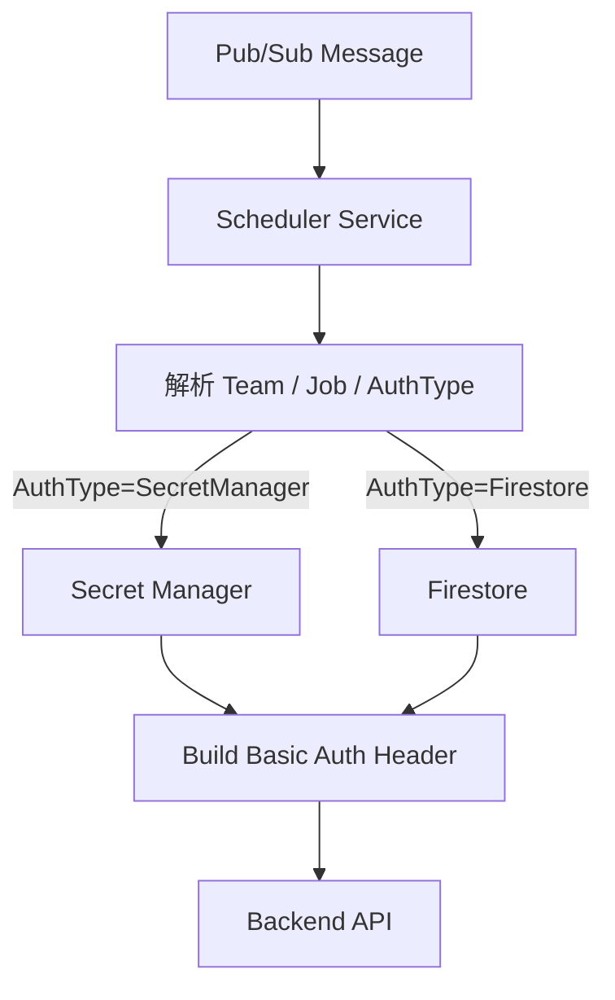
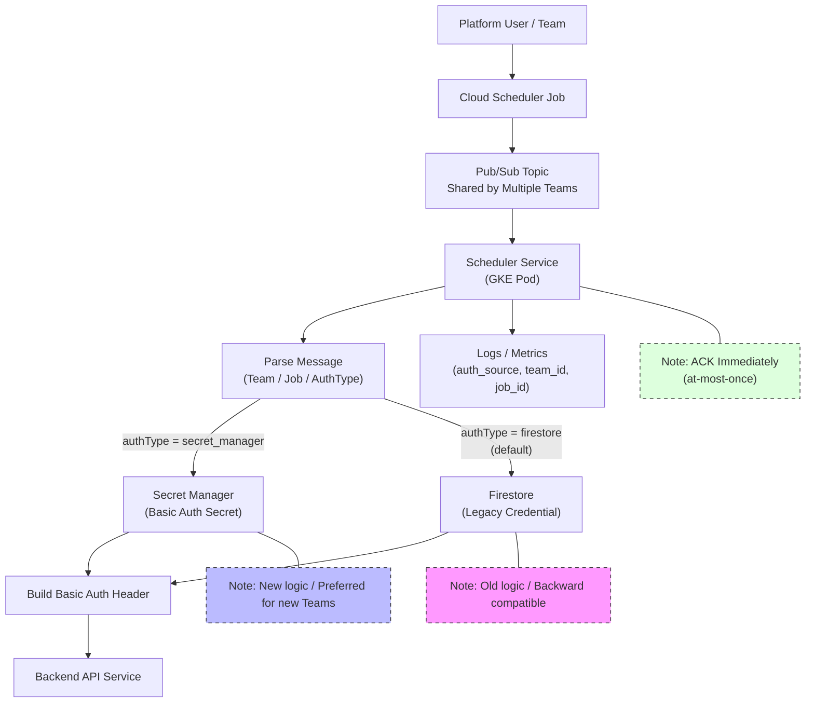
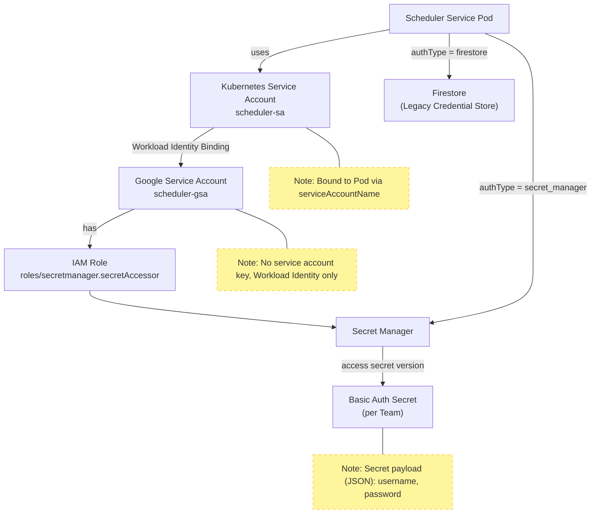
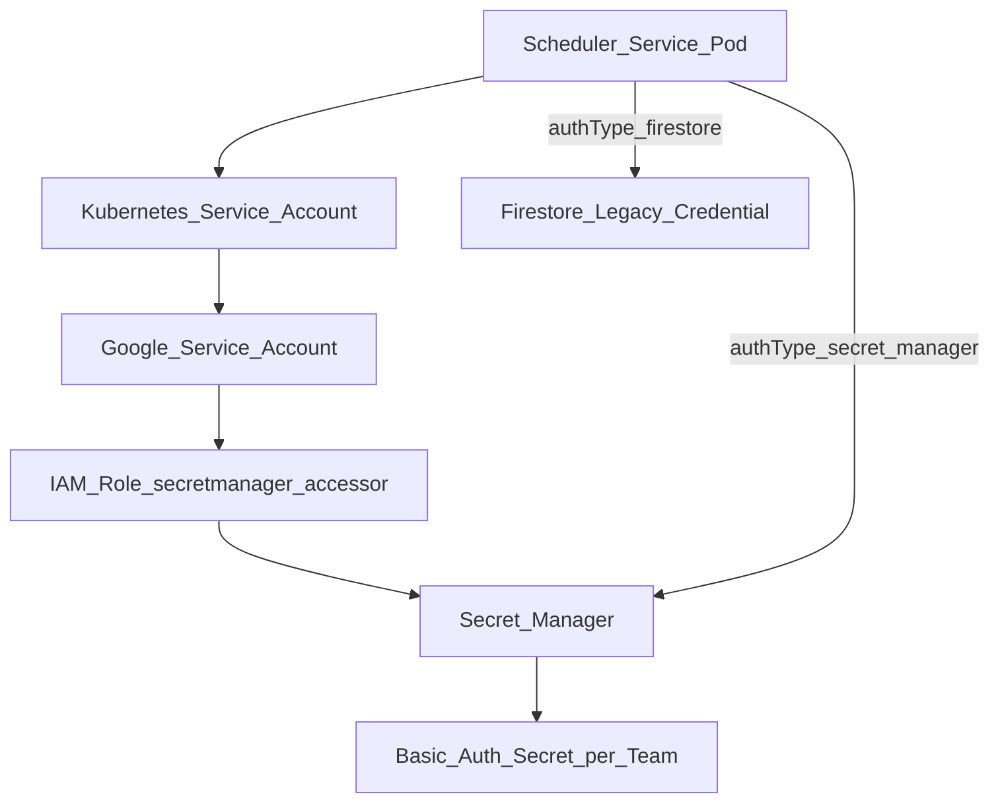

下面我按**平台级改造**的思路，帮你把这次 **Scheduler Service 核心改动**拆解成「**可控、可回滚、兼容老逻辑**」的一套实施规划，重点围绕 **认证凭据从 Firestore → Secret Manager** 的迁移，同时不破坏现有 Teams / PubSub / Backend 行为。

---

## **一、问题分析（你现在真正要解决的是什么）**

你当前的 Scheduler Service 有几个**关键特征 & 隐含风险**：

### **1️⃣ 当前架构事实**

- **多 Teams 共用 Pub/Sub Topic**
- **同一个 Scheduler Service Pod** 消费所有消息
- 消息内容 → 解析 → 构造 HTTP 请求
- **Basic Auth 密码来自 Firestore**
- **ACK 在业务执行前完成**（at-most-once）

### **2️⃣ 你要做的核心变化**

- **新增 Secret Manager 作为认证凭据来源**
- **不影响老用户（Firestore 逻辑必须继续可用）**
- 服务需要 **同时支持两种凭据来源**
- 尽量不影响现有 Scheduler / PubSub 拓扑

> 本质上：

> 👉 **这是一次「认证配置来源的演进 + 向后兼容」问题，而不是调度系统重构**

---

## **二、总体设计原则（非常重要）**

在这种平台级服务里，我强烈建议你遵循这 5 条原则：

| **原则**   | **说明**                     |
| ---------- | ---------------------------- |
| 向后兼容   | 老用户 **0 改动**            |
| 显式优先级 | Secret > Firestore           |
| 可观测     | 能知道一次请求用的是哪种凭据 |
| 可回滚     | 出问题能立刻退回 Firestore   |
| 最小影响面 | 不改 Pub/Sub / Scheduler     |

---

## **三、推荐的目标架构（逻辑视角）**



---

## **四、你需要做的核心改动清单（按优先级）**

---

### **✅ 1. 定义「认证来源策略」（最关键的一步）**

你**必须**让 Scheduler Service 在运行时判断：

> **这个消息，用哪种凭据来源？**

#### **推荐方式（不破坏老逻辑）：**

### **🎯 方案 A（推荐）：**

### **消息或配置驱动**

**在 Firestore 中增加字段（兼容老数据）**

```
{
  "teamId": "team-a",
  "authType": "firestore | secret_manager",
  "secretName": "projects/xxx/secrets/team-a-basic-auth",
  "username": "api-user",
  "password": "legacy-password"
}
```

- **老数据**：没有 authType → 默认 firestore
- **新用户**：显式设置 authType=secret_manager

✅ 不需要改 Pub/Sub 消息格式

✅ 不需要改 Scheduler Job

---

### **⚠️ 不推荐**

- 用 message attributes 判断（Scheduler 不好管）
- 用 Topic 区分（Teams 共用 Topic 已经是事实）

---

## **五、Scheduler Service 内部改造设计**

### **1️⃣ 抽象一个 Credential Provider（非常重要）**

> **这是保证代码干净 & 可扩展的关键**

#### **接口定义（示意）**

```
public interface CredentialProvider {
    BasicAuthCredential getCredential(String teamId, JobContext ctx);
}
```

#### **两个实现**

```
- FirestoreCredentialProvider
- SecretManagerCredentialProvider
```

#### **调度逻辑**

```
if (authType == SECRET_MANAGER) {
    provider = secretManagerProvider;
} else {
    provider = firestoreProvider;
}
```

---

### **2️⃣ Secret Manager 使用策略（建议）**

#### **Secret 设计规范（强烈建议）**

- **一个 Team 一个 Secret**
- Secret 内容为 JSON（方便扩展）

```
{
  "username": "api-user",
  "password": "xxxx"
}
```

#### **Secret 命名规范**

```
projects/{project-id}/secrets/scheduler-team-{teamId}-basic-auth
```

---

### **3️⃣ IAM 权限（必须规划清楚）**

Scheduler Service 对 Secret Manager 只需要：

```
roles/secretmanager.secretAccessor
```

⚠️ **建议最小权限**

- 只允许访问指定前缀的 Secret
- 使用 **Workload Identity**

---

## **六、兼容老逻辑的关键点（避免踩坑）**

### **✅ 1. 优先级规则（强制）**

```
如果 authType=secret_manager：
    → 只读 Secret Manager
如果 authType=firestore：
    → 只读 Firestore
```

❌ **不要** fallback（避免隐式错误）

---

### **✅ 2. 启动期 & 缓存策略**

Secret Manager 是 **有延迟 & 成本的**：

- 建议：
    - **本地 LRU Cache**
    - TTL：5 ~ 10 分钟
- 避免每条 Pub/Sub 消息都拉 Secret

---

### **✅ 3. 可观测性（你未来一定会用到）**

**必须打日志 & Metrics**

```
auth_source=secret_manager | firestore
team_id=xxx
job_id=yyy
```

建议指标：

- scheduler_auth_source_count{source=secret_manager}
- scheduler_secret_fetch_error_total

---

## **七、与 Pub/Sub ACK 模型的关系（你现在的模型风险）**

你现在是：

```
收到消息 → ACK → 执行业务
```

### **这次改造你可以** 

### **不改 ACK 模型**

但你要意识到：

| **情况**         | **结果** |
| ---------------- | -------- |
| Secret 取失败    | 消息已丢 |
| Backend API 失败 | 不重试   |

### **建议（非强制，但很值得）**

- **Secret 读取失败 → 直接拒绝处理（快速失败 + 告警）**
- 不要悄悄 fallback 到 Firestore

---

## **八、迁移步骤（可执行的实施计划）**

### **Phase 1：代码准备（不影响生产）**

- 抽象 CredentialProvider
- 接入 Secret Manager SDK
- Firestore 逻辑保持不动

### **Phase 2：灰度启用**

- 给 **1~2 个 Team** 设置 authType=secret_manager
- 验证：
    - Secret 访问权限
    - Backend 成功率
    - Latency

### **Phase 3：平台推广**

- 新 Team 默认 Secret Manager
- 老 Team 保持 Firestore

### **Phase 4（可选）：长期优化**

- 提供迁移工具
- Firestore 凭据逐步只读 / 禁用

---

## **九、你现在可以立刻做的 5 件事（行动清单）**

1. **定义 authType + secretName 字段**
2. 抽象 CredentialProvider
3. 为 Scheduler SA 配置 Secret Manager IAM
4. 加 auth_source 维度日志 & metrics
5. 制定 Secret 命名 & 内容规范

---

如果你愿意，**下一步我可以直接帮你**：

- 设计 **Firestore / Secret 数据结构最终版**
- 给你一份 **Scheduler Service 内部伪代码**
- 或者直接帮你画一张 **「平台认证演进架构图」**

你想从哪一步继续？



> 这张图体现的是 **「平台级认证能力演进」**，而不是一次性切换：

- **控制面不变**：Cloud Scheduler / Pub/Sub 拓扑完全不动
- **数据面演进**：Scheduler Service 内部根据 authType 决定认证来源
- **能力叠加而非替换**：Secret Manager 与 Firestore 并存
- **平台可治理**：通过日志与指标清晰区分认证来源

如果你愿意，下一步我可以：

- 把这张图拆成 **「当前态 vs 目标态」对比图**
- 或补一张 **Secret Manager IAM / Workload Identity 访问关系图**
- 或直接生成一版 **平台设计文档中的“认证演进章节”**（可直接放 PRD / ADR）

你更想继续哪一个？

下面是**补充的「Secret Manager IAM / Workload Identity 访问关系图」**，并且我已**严格处理 Mermaid 中包含括号 () 的节点与边标签，全部使用双引号包裹**，避免解析错误。

---


---



## **这张图重点表达的** 

## **平台级安全边界**

### **1️⃣** 

### **无 Service Account Key（这是核心）**

- Scheduler Pod **不持有任何 GCP Key**
- 通过 **Workload Identity**：

```
Pod → KSA → GSA → IAM → Secret Manager
```

---

### **2️⃣** 

### **权限最小化（Least Privilege）**

Scheduler Service 只需要：

```
roles/secretmanager.secretAccessor
```

而且**理想状态**是：

- 只允许访问：

```
scheduler-team-*-basic-auth
```

-
- 而不是整个项目的 Secret

---

### **3️⃣** 

### **认证来源路径是“显式分叉”的**

```
authType = secret_manager → Secret Manager
authType = firestore      → Firestore（老逻辑）
```

❗ **没有 fallback**

- 避免 Secret 误删时悄悄读老密码
- 避免安全策略被绕过

---

## **和你现有 Scheduler 语义的契合点**

| **维度**           | **说明**              |
| ------------------ | --------------------- |
| Pub/Sub            | 完全不变              |
| ACK 模型           | 不受影响              |
| 多 Team 共用 Topic | 通过 authType 隔离    |
| 安全升级           | 仅影响 Scheduler 内部 |

---

## **如果你愿意，下一步我可以继续补：**

- 🔐 **Secret 命名 & IAM 条件（Condition）示意图**
- 📐 **当前态 vs 目标态认证路径对比图**
- 📄 **一页 ADR：为什么从 Firestore → Secret Manager**

你想往**架构治理**、**安全合规**，还是**实施细节**方向继续？
