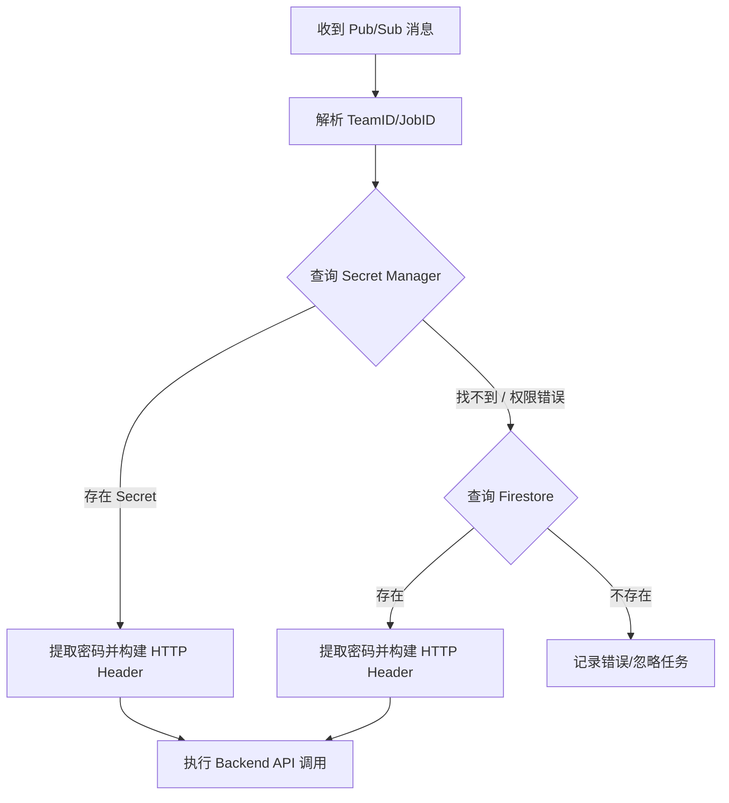

# Cloud Scheduler 服务优化方案：基于 Secret Manager 的认证增强

## 1. 现状与挑战分析

### 1.1 当前流程 (Firestore 模式)
目前 `Schedule Service` 在接收到 Pub/Sub 消息后，从 **Firestore** 获取用户的认证密码 (Basic Auth)，并以此构建请求访问后端接口。

### 1.2 挑战与目标
- **安全性**：Firestore 虽然可以存储数据，但在处理敏感密钥（如密码、API Key）时，**Secret Manager** 提供了更好的版本控制、审计记录和自动轮转功能。
- **兼容性**：必须支持“灰度平滑迁移”，即：
    - 如果 Secret Manager 中存在该 Team/User 的密码，则优先使用。
    - 如果 Secret Manager 不存在，则回退 (Fallback) 到原有的 Firestore 逻辑。
      - firstore change ==> 中增加字段（兼容老数据) ==> Onboarding Process add new field
      - only an example 
        - 老数据：没有 authType → 默认 firestore
        - 新用户：显式设置 authType=secret_manager
        - 或者我们逻辑判断而不需要用户来付出类似的数据?
    - 确保老的调度任务无需修改即可继续运行。
    - 这个Java的Schedule Service 需要 KSA可以访问Secret Manager。Need to add IAM policy for KSA. [infra change for environment]
    - 新增 Secret Manager 作为认证凭据来源
      - 需要确认或者优化Cloud Scheduler Service的读取Secret Manager的逻辑 确保高频率取值的性能.因为用户每次调度都会读取Secret Manager?
        - 探索下Secret Manager的Cache策略?
        - 探索下Secret Manager的速率或者频率限制?
        - 探索下Secret Manager的API请求费用
    - 不影响老用户（Firestore 逻辑必须继续可用）
    - 服务需要 同时支持两种凭据来源
    - 尽量不影响现有 Scheduler / PubSub 拓扑

---

## 2. 方案设计

### 2.1 认证逻辑增强方案
核心思路是实施 **"优先 Secret Manager，回退 Firestore"** 的检索策略。


#### **✅ 1. 优先级规则（强制）**

```
如果 authType=secret_manager：
    → 只读 Secret Manager
如果 authType=firestore：
    → 只读 Firestore
```

❌ **不要** fallback（避免隐式错误）

---

#### **✅ 2. 启动期 & 缓存策略**

Secret Manager 是 **有延迟 & 成本的**：

- 建议：
    - **本地 LRU Cache**
    - TTL：5 ~ 10 分钟
- 避免每条 Pub/Sub 消息都拉 Secret

---

#### **✅ 3. 可观测性**

**必须打日志 & Metrics**

```
auth_source=secret_manager | firestore
team_id=xxx
job_id=yyy
```

### 2.2 Secret 命名规范
建议在 Secret Manager 中使用统一的命名约定，方便程序自动检索：
- 格式：`teams-[team_id]-backend-secret` 或 `job-[job_id]-auth`
- 优点：通过简单的字符串拼接即可定位密钥，无需在每个 Job 中显式传递路径。
- 维护: 需要考虑后期用户cert的Renew,

---

## 3. 核心改动工作项

### 3.1 基础设施层
- **Secret Manager 配置**：
    - 创建对应的 Secret 资源。
    - 将现有密码导入为 Secret 版本。
- **权限管理 (Workload Identity)**：
    - 为 GKE 中运行的 `Schedule Service` 所关联的 Kubernetes Service Account (KSA) 绑定一个具有 `secretmanager.secretAccessor` 权限的 Google Service Account (GSA)。

### 3.2 服务代码层 (核心逻辑优化)
`Schedule Service` 需要引入 Secret Manager SDK。伪代码逻辑如下：

```python
def get_auth_password(team_id):
    # 1. 尝试从 Secret Manager 获取
    secret_name = f"projects/{PROJECT_ID}/secrets/teams-{team_id}-pass/versions/latest"
    try:
        response = secret_client.access_secret_version(request={"name": secret_name})
        return response.payload.data.decode("UTF-8")
    except Exception as e:
        # 2. 只有在 SecretManager 报错(如 NotFound)时才回退到 Firestore
        print(f"Secret not found for {team_id}, falling back to Firestore...")
        return get_password_from_firestore(team_id)
```

---

## 4. 实施步骤规划

| 阶段 | 动作 | 描述 | By |
| :--- | :--- | :--- | :--- |
| **P1: 权限就绪** | Workload Identity 授权 | 赋予服务访问 Secret Manager 的最小权限。 | infra | 
| **P2: 代码升级** | 部署支持双源认证的服务 | 发布新版本 Schedule Service，默认采用 fallback 逻辑。 | java |
| **P3: 密钥迁移** | 录入 Secret Manager | 开始将新 Teams 或核心 Teams 的密码录入 Secret Manager。 | onboarding |
| **P4: 资源清理** | (可选) 停用 Firestore 存储 | 在所有密钥验证迁移完成后，可选择归档原 Firestore 数据。 | infra && sre |

### **Phase 1：代码准备（不影响生产）**

- 抽象 CredentialProvider
- 接入 Secret Manager SDK
- Firestore 逻辑保持不动

### **Phase 2：灰度启用在 new Project or new Team*

- 给 **1~2 个 Team** 设置 authType=secret_manager
- 验证：
    - Secret 访问权限
    - Backend 成功率
    - Latency

### **Phase 3：平台推广**

- 新 Team 默认 Secret Manager
- 老 Team 保持 Firestore

### **Phase 4（可选）：长期优化**

- 提供迁移工具 ==> prepare the User document . reference secret_manager onboarding process
- Firestore 凭据逐步只读 / 禁用 ==> This is a long-term plan


---

## 5. 注意事项与最佳实践

- **缓存机制**：
    - 频繁调用 Secret Manager API 可能会产生延迟和成本。建议在 `Schedule Service` 内部实现一个简短的 **LRU Cache**（如 5-10 分钟），缓存已解密的密码。
- **错误排查**：
    - 如果 Secret Manager 权限配置不正确，服务应能准确区分 `PermissionDeny` 和 `NotFound`，避免因权限问题误导回退到已失效的 Firestore 数据。
- **可观测性**：
    - 建议在日志里打点，标记当前请求是从 `SOURCE: SECRET_MANAGER` 还是 `SOURCE: FIRESTORE` 获取的，便于监控迁移进度。
