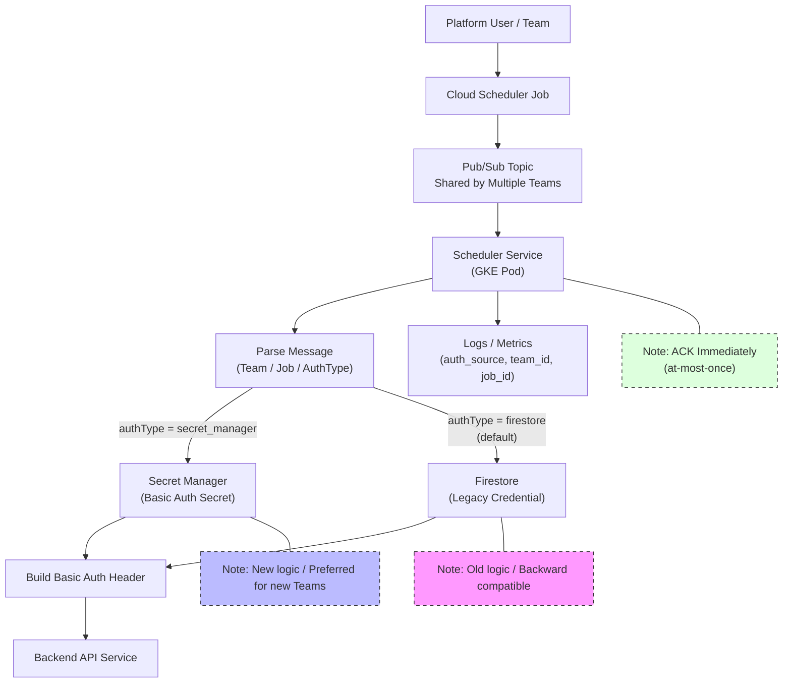
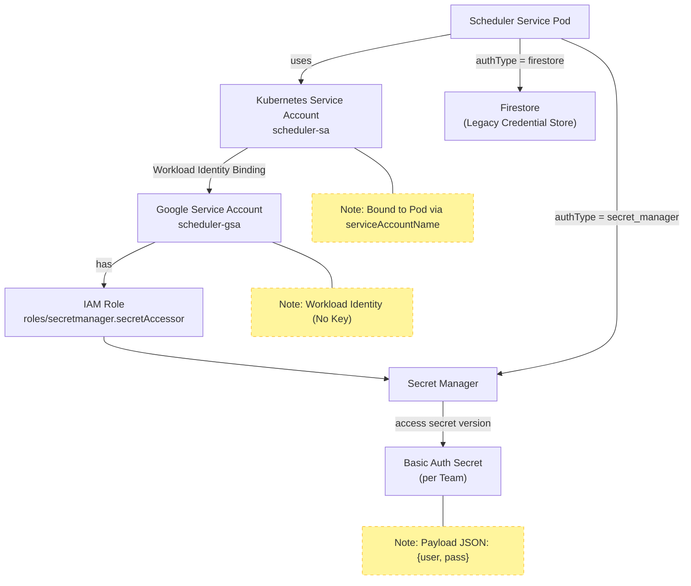

# Cloud Scheduler 服务认证增强方案摘要 (Summary)

## 1. 背景与目标 (Context & Objectives)

本方案旨在优化 Cloud Scheduler Service 的认证机制，从仅支持 **Firestore** 扩展为支持 **Secret Manager (SM)**，以提升安全性、合规性及密钥管理能力。

### 1.1 核心挑战 (Key Challenges)
汇总自用户关注点：
1.  **高并发读取性能**：Cloud Scheduler 每次调度都会触发鉴权，若每条消息都调用 SM API，可能导致高延迟。
2.  **成本控制**：SM API 调用按次计费，高频无缓存调用会产生显著费用。
3.  **平滑迁移 (Zero Downtime)**：必须完美兼容现有 Firestore 数据，且老用户无需做任何改动。
4.  **安全合规**：利用 Workload Identity 消除 Pod 内置 Key，并通过 IAM 最小权限原则管控访问。

---

## 2. 核心解决方案 (Proposed Solution)

### 2.1 架构设计 (Architecture)

核心逻辑是**显式分流**：根据 Firestore 中的 `authType` 字段决定凭据来源，**拒绝隐式 Fallback** 以确保安全边界。

### 2.2 安全与权限模型 (Security & IAM)

通过 K8s Service Account (KSA) 与 Google Service Account (GSA) 的绑定，实现无 Key 访问。

---

## 3. 关键疑点深度探索 (Deep Dive Analysis)

针对用户提出的性能、缓存、费用问题进行专项分析：

### 3.1 缓存策略 (Cache Strategy)
**结论：必须在 Scheduler Service 内部实现应用级缓存 (Application-Level Cache)。**

*   **设计建议**：使用内存缓存（如 Java Guava Cache 或 caffeine）。
*   **TTL (过期时间)**：建议 **5 ~ 10 分钟**。Secret 轮转通常不频繁，分钟级延迟是可接受的。
*   **Key 设计**：`CacheKey = "secret_manager:" + team_id`
*   **失效机制**：被动过期（Passive Expiration）。

### 3.2 速率限制与配额 (Rate Limits & Quotas)
*   **Access Secret Version Quota**：默认为 **30,000 CPM** (Requests Per Minute) per project。
    *   *计算*：如果 QPS 为 100，则 100 * 60 = 6,000 CPM，远低于默认配额。
    *   *风险*：如果 QPS > 500，且无缓存，可能会触发限流。
*   **应对**：启用缓存后，对 SM 的实际调用将降低 99% 以上，完全规避配额风险。

### 3.3 成本分析 (Cost Consideration)
*   **Secret Manager 定价 (Google Cloud)**：
    *   **存储费用**：$0.06 / secret / month (忽略不计)。
    *   **访问费用 (API Loop)**：**$0.03 per 10,000 operations**。
*   **场景推演 (无缓存 vs 有缓存)**：
    *   假设 QPS = 50 (每天约 430万次请求)。
    *   **Scenario A: 无缓存 (Direct Access)**
        *   Daily Ops: 4,320,000
        *   Daily Cost: (4,320,000 / 10,000) * $0.03 ≈ **$13 USD / day**
        *   Monthly Cost: ≈ **$390 USD / month**
    *   **Scenario B: 有缓存 (TTL 5min, Hit Rate 99%)**
        *   每个 Team 每 5 分钟只调一次。假设 100 个 Team。
        *   Daily Ops: 100 * (60/5) * 24 = 28,800 ops
        *   Daily Cost: (28,800 / 10,000) * $0.03 ≈ **$0.09 USD / day**
        *   Monthly Cost: ≈ **$2.7 USD / month**
*   **结论**：**应用端缓存是节省费用的关键。**

---

## 4. 实施路线图 (Implementation Roadmap)

| 阶段 | 重点任务 | 验证点 |
| :--- | :--- | :--- |
| **P1: Infra Ready** | 1. 建立 Workload Identity (KSA -> GSA)。 2. 赋予 GSA `secretmanager.secretAccessor`。 | `gcloud auth print-access-token` 在 Pod 内可用且能访问 Secret。 |
| **P2: Code Dev** | 1. 引入 SM Client SDK。 2. 实现 `CredentialProvider` 接口。 3. **实现 LRU Cache (Critical)**。 4. 增加 Metrics `auth_source={sm|fs}`。 | 单元测试 & 本地集成测试覆盖 Cache 逻辑。 |
| **P3: Piloting** | 1. 选择 1-2 个测试 Team。 2. 使用脚本写入 Secret。 3. 更新 Firestore `authType=secret_manager`。 | 观察 Metrics：延迟是否增加？Cache Hit Rate 是否正常？ |
| **P4: Migration** | 1. 批量脚本迁移 Secret。 2. 逐步切换 `authType`。 | 只要 Metrics 无异常，持续推进。 |

---

## 5. 总结 (Conclusion)
通过引入 Secret Manager 并配合**本地缓存**，我们可以在**几乎不增加延迟**且**成本可控**的前提下，显著提升系统的安全性。显式的 `authType` 策略确保了对老用户的完美兼容，实现了真正的平滑演进。
