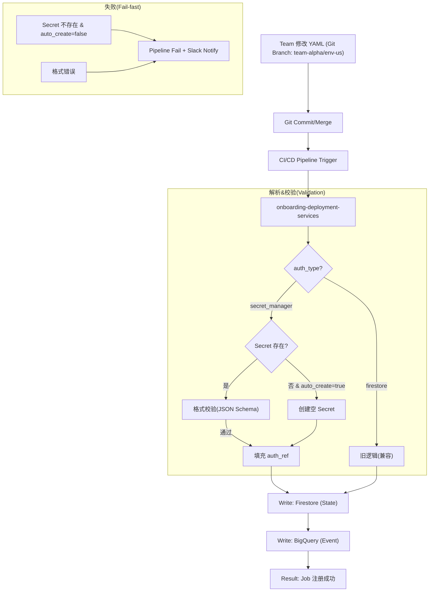
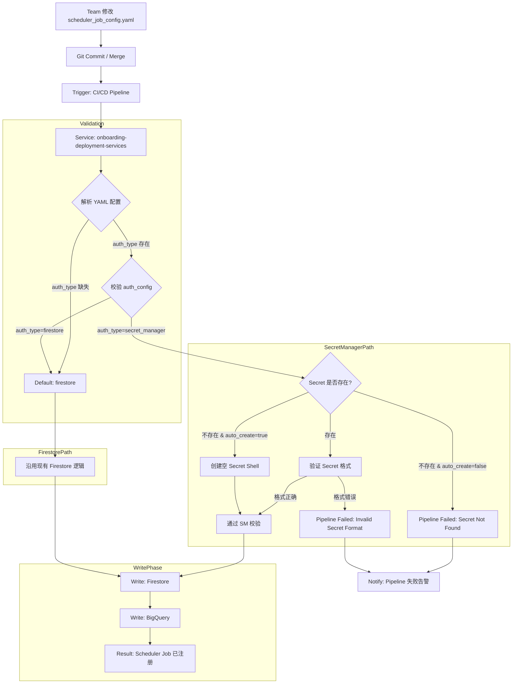
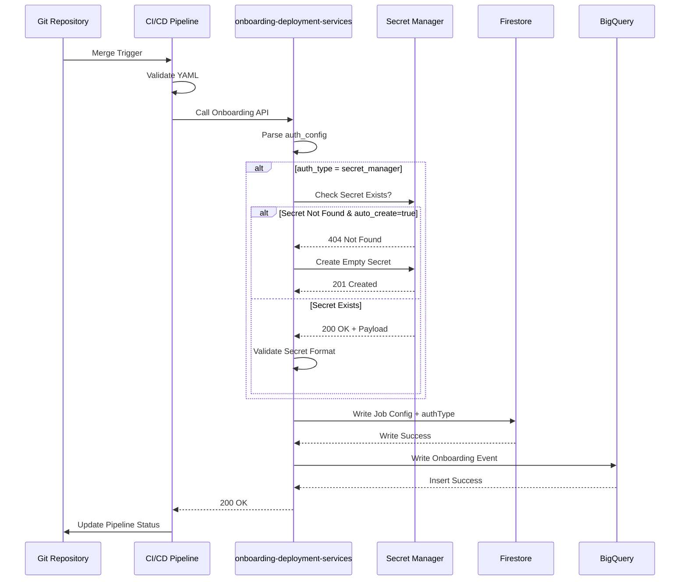

# Scheduler Job Onboarding 与 Secret Manager 集成探索

> **文档目的**: 基于 `ob` skill (GCP API Platform Onboarding Architect) 的专业视角，探索如何将 Scheduler Job 的 Onboarding 流程与 Secret Manager 认证增强方案整合。

---

## 1. 问题分析 (Analysis)

### 1.1 当前 Onboarding 配置结构

根据 `scheduler_job_config.yaml` 的声明式配置：

```yaml
# team-name/env/region/scheduler_job_config.yaml
scheduler_job_config:
   enabled: true
scheduler_job:
   - job_name: jobXdsRateQueryBu
     api_endpoint: https://endpoint-url/
     http_method: POST
     frequency: "0 */1 * * *"
     http_body: "{}"
```

**现状问题**:
1. **缺失认证配置**: 当前 YAML 没有定义 `authType` 字段
2. **缺失 Secret 引用**: 无法声明式指定 Secret Manager 路径
3. **Onboarding Pipeline 不感知**: Pipeline 无法自动初始化 Secret

### 1.2 目标需求 (来自 droid-css-enhance.md)

| 需求项 | 描述 |
|--------|------|
| 双认证源 | 支持 `secret_manager` (新) + `firestore` (旧) |
| 显式路由 | 通过 `authType` 字段决定凭据来源，拒绝隐式 Fallback |
| 零停机迁移 | 老用户无需改动，新用户使用 Secret Manager |
| GitOps 驱动 | 配置变更通过 Git 声明 + Pipeline 自动化执行 |

---

## 2. Onboarding 流程增强方案 (Solution)

### 2.1 增强后的 YAML Schema

```yaml
# team-name/env/region/scheduler_job_config.yaml
scheduler_job_config:
  enabled: true
  # [NEW] 认证配置块
  auth_config:
    # 认证类型: secret_manager | firestore (default)
    auth_type: secret_manager
    # Secret Manager 相关配置 (当 auth_type=secret_manager 时必填)
    secret_manager:
      # Secret 命名规则: scheduler-team-{team_id}-basic-auth
      secret_name_pattern: "scheduler-team-${TEAM_ID}-basic-auth"
      # 是否由 Pipeline 自动创建 Secret (仅首次)
      auto_create: true

scheduler_job:
  - job_name: jobXdsRateQueryBu
    api_endpoint: https://endpoint-url/
    http_method: POST
    frequency: "0 */1 * * *"
    http_body: "{}"
```

### 2.2 增强后的 Onboarding 流程

---


---

## 3. Onboarding Service 核心逻辑增强 (Code)

### 3.1 配置解析伪代码

```java
public class SchedulerJobOnboardingHandler {
    
    public OnboardingResult process(SchedulerJobConfig config) {
        // Step 1: 解析 auth_config
        AuthConfig authConfig = config.getAuthConfig();
        String authType = authConfig != null 
            ? authConfig.getAuthType() 
            : "firestore"; // 默认值，兼容老配置
        
        // Step 2: 根据 authType 执行不同校验
        switch (authType) {
            case "secret_manager":
                return handleSecretManagerAuth(config, authConfig);
            case "firestore":
            default:
                return handleFirestoreAuth(config);
        }
    }
    
    private OnboardingResult handleSecretManagerAuth(
            SchedulerJobConfig config, AuthConfig authConfig) {
        String secretName = resolveSecretName(authConfig, config.getTeamId());
        
        // 检查 Secret 是否存在
        if (!secretManagerClient.secretExists(secretName)) {
            if (authConfig.isAutoCreate()) {
                // 创建空 Secret (需用户后续填充)
                secretManagerClient.createEmptySecret(secretName);
                log.info("Created empty secret shell: {}", secretName);
            } else {
                throw new OnboardingException(
                    "SECRET_NOT_FOUND", 
                    "Secret " + secretName + " does not exist and auto_create=false"
                );
            }
        }
        
        // 验证 Secret 格式 (如果已有内容)
        validateSecretFormat(secretName);
        
        // 写入 Firestore (含 authType 字段)
        writeToFirestore(config, "secret_manager", secretName);
        
        return OnboardingResult.success();
    }
}
```

### 3.2 Secret 命名规范

```bash
# 命名模式
projects/{PROJECT_ID}/secrets/scheduler-team-{TEAM_ID}-basic-auth

# 示例
projects/my-gcp-project/secrets/scheduler-team-team-alpha-basic-auth
```

### 3.3 Secret Payload 格式校验

```json
{
  "$schema": "http://json-schema.org/draft-07/schema#",
  "type": "object",
  "required": ["username", "password"],
  "properties": {
    "username": {
      "type": "string",
      "minLength": 1
    },
    "password": {
      "type": "string",
      "minLength": 8
    }
  }
}
```

---

## 4. 数据流对比 (Firestore vs BigQuery)

### 4.1 Firestore 写入内容 (运行时状态)

| 字段 | 类型 | 描述 | 示例 |
|------|------|------|------|
| `teamId` | string | 团队标识 | `team-alpha` |
| `jobName` | string | 调度任务名 | `jobXdsRateQueryBu` |
| `authType` | string | 认证类型 | `secret_manager` |
| `secretName` | string | SM Secret 路径 | `projects/.../secrets/...` |
| `apiEndpoint` | string | 目标 API | `https://endpoint-url/` |
| `frequency` | string | Cron 表达式 | `0 */1 * * *` |
| `status` | string | 生命周期状态 | `active` |
| `createdAt` | timestamp | 创建时间 | `2025-12-28T10:00:00Z` |
| `updatedAt` | timestamp | 更新时间 | `2025-12-28T10:00:00Z` |

### 4.2 BigQuery 写入内容 (分析统计)

```sql
-- 表结构: scheduler_job_onboarding_events
CREATE TABLE scheduler_job_onboarding_events (
    event_id STRING,
    team_id STRING,
    job_name STRING,
    auth_type STRING,
    event_type STRING,  -- 'created', 'updated', 'deleted'
    pipeline_run_id STRING,
    git_commit_sha STRING,
    success BOOL,
    error_message STRING,
    event_timestamp TIMESTAMP
);
```

### 4.3 数据一致性校验 SQL

```sql
-- 检查 Firestore (导出) 与 BigQuery 的 authType 分布是否一致
SELECT 
    auth_type,
    COUNT(*) as job_count,
    COUNTIF(status = 'active') as active_count
FROM `project.dataset.firestore_scheduler_jobs_export`
GROUP BY auth_type

UNION ALL

SELECT 
    auth_type,
    COUNT(DISTINCT job_name) as job_count,
    NULL as active_count
FROM `project.dataset.scheduler_job_onboarding_events`
WHERE event_type = 'created' AND success = true
GROUP BY auth_type;
```

---

## 5. Pipeline 增强设计

### 5.1 Pipeline 阶段定义

```yaml
# .gitlab-ci.yml 或 cloudbuild.yaml 示例逻辑
stages:
  - validate
  - provision
  - deploy
  - notify

validate_config:
  stage: validate
  script:
    - echo "Validating scheduler_job_config.yaml"
    - yamllint scheduler_job_config.yaml
    - python validate_auth_config.py  # 自定义校验脚本

provision_secret:
  stage: provision
  rules:
    - if: $AUTH_TYPE == "secret_manager" && $AUTO_CREATE == "true"
  script:
    - echo "Checking/Creating Secret in Secret Manager"
    - gcloud secrets describe $SECRET_NAME || gcloud secrets create $SECRET_NAME

deploy_to_firestore:
  stage: deploy
  script:
    - echo "Writing job config to Firestore"
    - python deploy_scheduler_job.py

notify_success:
  stage: notify
  script:
    - echo "Onboarding completed for team $TEAM_ID"
```

### 5.2 Pipeline 与 Service 的交互序列



---

## 6. 迁移策略 (Migration Path)

### 6.1 三阶段迁移方案

| 阶段 | 目标 | 操作 | 验证 |
|------|------|------|------|
| **Phase 1** | 基础设施就绪 | 部署支持 `auth_config` 的 ODS 版本 | 老配置 (无 auth_config) 仍正常工作 |
| **Phase 2** | 灰度试点 | 选择 2-3 个测试 Team，修改其 YAML 添加 `auth_type: secret_manager` | 监控 Pipeline 成功率、Firestore 数据正确性 |
| **Phase 3** | 全量推广 | 批量更新所有 Team 的 YAML，设置 `auth_type: secret_manager` | BigQuery 统计 authType 分布达到 100% SM |

### 6.2 回滚方案

```yaml
# 回滚操作: 将 auth_type 改回 firestore
auth_config:
  auth_type: firestore
```

**⚠️ 高危操作警告**:
- 回滚前确保 Firestore 中仍保留原始凭据
- 回滚后需重新触发 Pipeline 以更新 Firestore `authType` 字段

---

## 7. 验证清单 (Verification Checklist)

### 7.1 Onboarding Pipeline 验证

- [ ] YAML Schema 校验通过
- [ ] `auth_type=secret_manager` 时，Secret 存在性检查通过
- [ ] `auto_create=true` 时，空 Secret 成功创建
- [ ] Firestore 写入包含正确的 `authType` 字段
- [ ] BigQuery 事件记录完整

### 7.2 运行时验证

- [ ] Scheduler Service 能根据 `authType` 正确路由
- [ ] Cache Hit Rate > 95%
- [ ] 无 Secret Manager 配额告警
- [ ] 日志中 `auth_source` 标签正确

### 7.3 数据一致性验证

```bash
# 检查 Firestore 中 authType 分布
gcloud firestore export gs://backup-bucket/firestore-export
bq load --source_format=NEWLINE_DELIMITED_JSON \
    dataset.firestore_export \
    gs://backup-bucket/firestore-export/*.json

# 执行一致性 SQL
bq query --use_legacy_sql=false < consistency_check.sql
```

---

## 8. 总结 (Conclusion)

通过将 **Scheduler Job Onboarding** 与 **Secret Manager 认证增强** 整合：

1. **GitOps 一致性**: 认证方式通过 YAML 声明，Pipeline 自动执行，确保可审计、可回滚
2. **平滑迁移**: `authType` 字段默认值为 `firestore`，老用户零改动
3. **自动化 Secret 管理**: `auto_create: true` 允许 Pipeline 自动创建 Secret Shell
4. **数据闭环**: Firestore (运行时状态) + BigQuery (统计分析) 双写，支持一致性校验

**下一步行动**:
1. 更新 `onboarding-deployment-services` 代码支持 `auth_config` 解析
2. 在 Staging 环境部署并验证
3. 选择 Pilot Team 进行灰度测试

---

## 参考文档

- [droid-css-enhance.md](./droid-css-enhance.md) - 认证增强技术方案
- [scheduler_job_config.yaml](./scheduler_job_config.yaml) - 原始 Onboarding 配置
- [GCP Secret Manager Docs](https://cloud.google.com/secret-manager/docs)
- [Firestore Best Practices](https://cloud.google.com/firestore/docs/best-practices)
