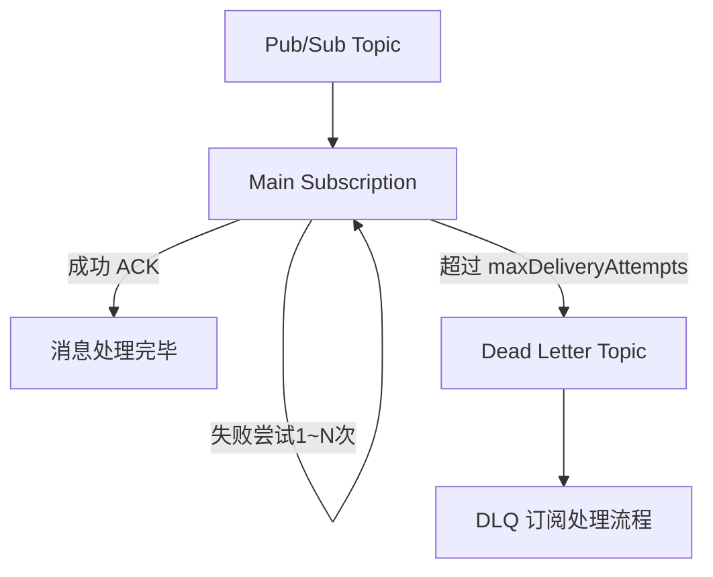
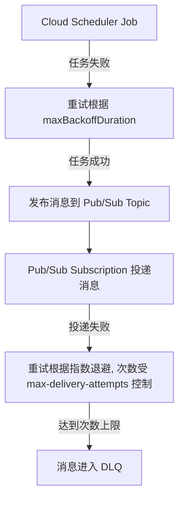
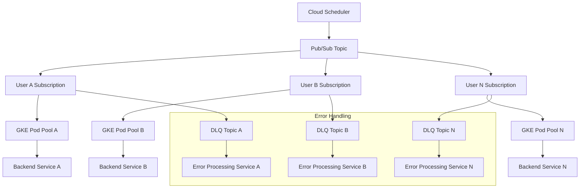
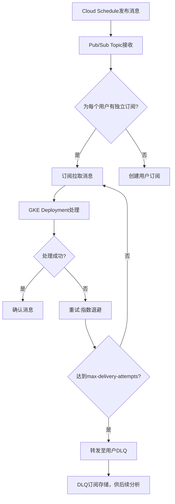

# no DLP

在 Pub/Sub 中，消息的可见性及保留时间受 **消息保留期限（message retention duration）** 和 **订阅积压（backlog）** 机制的影响。以下是未配置 DLQ 时投递失败消息的生命周期：

消息保留期限

- Pub/Sub 主题（Topic）有一个可配置的 `messageRetentionDuration` 参数，定义了消息在主题中的最长保留时间，默认值为 **7 天**。我们的配置是 604800s

- 即使消息投递失败且未被确认（ACK），只要未达到保留期限，消息仍会保留在主题中，并可能继续存在于订阅的积压中。

- 查看主题的保留期限：

```bash
gcloud pubsub topics describe my-topic
```

输出中会包含类似 `messageRetentionDuration: 604800s` 的字段（表示 7 天）。

- 如果需要延长保留期限，可以更新主题配置：

```bash
gcloud pubsub topics update my-topic \
--message-retention-duration=14d
```
在 GCP Pub/Sub 中配置 Dead Letter Queue（DLQ） 是处理消息消费失败的重要机制。以下是针对你问题的详细解答及最佳实践建议。

---

✅ DLQ 配置最佳实践

🎯 1. 基本概念
	•	DLQ（Dead Letter Topic） 是一个特殊的 Pub/Sub Topic，用于存放那些多次重试失败后仍未成功 ack 的消息。
	•	DLQ 的配置是在 Subscription 层级完成的。

---

📌 2. 配置关键参数

| 参数 | 说明 |
| --- | --- |
| deadLetterPolicy.deadLetterTopic | 指定的 DLQ topic 名称（必须是同一项目下） |
| deadLetterPolicy.maxDeliveryAttempts | 消息最多尝试交付的次数，超过则转发到 DLQ（推荐值：5 ~ 10） |

```bash
gcloud pubsub subscriptions update my-sub \
  --dead-letter-topic=projects/my-project/topics/my-dlq \
  --max-delivery-attempts=5
```

---

✅ 3. 推荐最佳实践

| 实践 | 建议说明 |
|------|----------|
| ✅ 设置合理的重试次数 | 通常设置为 5~10 次重试，避免瞬时故障或偶发错误立即触发 DLQ |
| ✅ 对 DLQ 单独处理 | 为 DLQ 绑定一个新的 Subscription，由独立系统（人工/自动）消费并处理异常消息 |
| ✅ 在监控中标记 DLQ 流量 | 使用 Logging/Monitoring 检测流入 DLQ 的消息增长趋势 |
| ✅ 避免将 DLQ 再直接投回原订阅 | 否则可能形成 无限循环，应在确认修复问题后手动或控制性地重投 |


---

❓ 加入 DLQ 后，消息是否永久不再投递？

是的，一旦消息进入 DLQ，对原 Subscription 来说就是“终结”状态，不会��尝试投递。

	•	进入 DLQ 的消息不会再次尝试被原 Subscription 消费。
	•	你可以对 DLQ 设置新的订阅并由其他处理流程（如人工分析、错误恢复程序）进行处理或手动 ack。

---

✅ 流程图（原始订阅 + DLQ）


---

✅ 示例配置 JSON（可用于 IaC）
```json
{
  "deadLetterPolicy": {
    "deadLetterTopic": "projects/my-project/topics/my-dlq",
    "maxDeliveryAttempts": 5
  },
  "ackDeadlineSeconds": 30,
  "retainAckedMessages": false
}
```

---

如果你希望我帮你生成一份 Terraform 或 YAML 的 DLQ 配置（用于 CI/CD 管理），也可以直接说明，我可提供完整模板。是否要？

# How to update subscriptions enable DLQ

# 更新 Pub/Sub 订阅以使用 DLQ 及相关参数详细解释

感谢您的问题！在 Google Cloud Pub/Sub 中，如果您已经有一个现有的订阅（Subscription），并且希望为它配置或更新一个死信队列（Dead Letter Queue, DLQ），可以使用 `gcloud pubsub subscriptions update` 命令来实现���本文将详细说明如何更新订阅以使用 DLQ，以及对配置 DLQ 的相关参数进行解释。

---

## 更新现有订阅以使用 DLQ

如果您已经创建了一个订阅（例如 `schedule-service-user-a`），并希望为其添加或修改 DLQ 配置，可以使用以下步骤和命令。

### 步骤 1：确认现有订阅配置

首先，检查当前订阅的配置，确认是否已有 DLQ 或其他相关设置：

```bash
gcloud pubsub subscriptions describe schedule-service-user-a
```

输出中会显示订阅的详细信息，包括是否已配置 `deadLetterPolicy`。

### 步骤 2：更新订阅以使用 DLQ

使用 `gcloud pubsub subscriptions update` 命令为现有订阅配置或更新 DLQ。假设您要为 `schedule-service-user-a` 配置 DLQ 主题为 `schedule-dlq-user-a`，命令如下：

```bash
gcloud pubsub subscriptions update schedule-service-user-a \
  --dead-letter-topic=schedule-dlq-user-a \
  --max-delivery-attempts=3
```

- `--dead-letter-topic`：指定 DLQ 主题的名称（例如 `schedule-dlq-user-a`）。该主题必须已经存在。
- `--max-delivery-attempts`：指定消息投递失败的最大尝试次数（例如 `3`）。达到此次数后，消息将被转发到 DLQ。

### 步骤 3：验证更新后的配置

更新完成后，再次查看订阅配置，确保 DLQ 已正确设置：

```bash
gcloud pubsub subscriptions describe schedule-service-user-a
```

在输出中，您应该能看到类似于以下内容的 `deadLetterPolicy` 部分：

```yaml
deadLetterPolicy:
  deadLetterTopic: projects/your-project/topics/schedule-dlq-user-a
  maxDeliveryAttempts: 3
```

### 步骤 4（可选）：移除 DLQ 配置

如果您希望移除 DLQ 配置，可以使用以下命令清除 `deadLetterPolicy`：

```bash
gcloud pubsub subscriptions update schedule-service-user-a \
  --clear-dead-letter-policy
```

这会删除订阅的 DLQ 设置，消息将不再被转发到任何死信队列。

---

## 配置 DLQ 的参数详细解释

在配置 Pub/Sub 订阅的 DLQ 时，主要涉及以下参数。以下是对这些参数的详细解释，帮助您理解其作用和使用场景。

### 1. `--dead-letter-topic`

- **作用**：指定死信队列主题（DLQ Topic）的名称。DLQ 是一个独立的 Pub/Sub 主题，用于存储订阅者无法成功处理的消息（即投递失败次数达到上限的消息）。
- **格式**：可以是主题的短名称（例如 `schedule-dlq-user-a`），也可以是完整路径（例如 `projects/your-project/topics/schedule-dlq-user-a`）。如果只提供短名称，`gcloud` 会自动使用当前项目的路径。
- **要求**：
    - DLQ 主题必须在订阅所在的同一项目中。
    - DLQ 主题必须已经存在（可以通过 `gcloud pubsub topics create` 创建）。
- **注意**：DLQ 主题本身也需要一个订阅来处理死信消息，否则消息会累积在 DLQ 主题中。您可以为 DLQ 主题创建一个单独的订阅来处理这些失败消息。
- **示例**：
    ```bash
    --dead-letter-topic=schedule-dlq-user-a
    ```

### 2. `--max-delivery-attempts`

- **作用**：指定消息投递失败的最大尝试次数。当订阅者未能成功确认（ACK）消息且重试次数达到此值时，消息将被转发到指定的 DLQ 主题。
- **取值范围**：必须是大于或等于 `1` 的整数。通常建议设置为 `5` 或更高，以避免因临时问题导致消息过早进入 DLQ。
- **默认值**：如果未设置 DLQ，此参数无关。如果设置了 DLQ，必须显式指定此值。
- **注意**：每次投递尝试失败后，Pub/Sub 会根据指数退避（exponential backoff）策略延迟重试时间，直到达到最大尝试次数。
- **示例**：
    ```bash
    --max-delivery-attempts=3
    ```

### 3. `--clear-dead-letter-policy`（用于移除 DLQ 配置）

- **作用**：清除订阅的 DLQ 配置，即移除 `deadLetterPolicy` 设置。执行此操作后，即使消息投递失败，也不会转发到任何 DLQ 主题。
- **使用场景**：当您不再需要 DLQ 或希望重新配置 DLQ 策略时，可以先清除现有设置。
- **示例**：
    ```bash
    gcloud pubsub subscriptions update schedule-service-user-a \
  --clear-dead-letter-policy
    ```

---

## 其他相关参数（创建或更新订阅时的常用参数）

虽然您的问题主要聚焦于 DLQ 配置，但以下是创建或更新订阅时可能与 DLQ 配置相关的其他常用参数，供参考：

### 1. `--ack-deadline`

- **作用**：指定订阅者的确认截止时间（单位：秒）。如果订阅者在该时间内未确认（ACK）消息，Pub/Sub 会认为投递失败并重试。
- **默认值**：10 秒。
- **取值范围**：通常建议设置为 `10s` 到 `600s` 之间，根据订阅者的处理能力和延迟需求调整。
- **与 DLQ 的关系**：如果投递在 `ack-deadline` 内未被确认，会计入一次失败尝试，最终可能导致消息进入 DLQ。
- **示例**：
    ```bash
    --ack-deadline=60s
    ```

### 2. `--message-filter`

- **作用**：为订阅设置过滤条件，只有符合条件的发布消息才会被投递到该订阅。
- **格式**：支持基于消息属性的过滤表达式，例如 `attributes.user_id="user-a"`。
- **与 DLQ 的关系**：过滤条件不会直接影响 DLQ，但可以确保订阅只处理特定用户的消息（如您示例中针对 `user-a` 的过滤），从而便于为不同用户配置不同的 DLQ。
- **示例**：
    ```bash
    --message-filter='attributes.user_id="user-a"'
    ```

---

## 注意事项与最佳实践

- **DLQ 主题的订阅**：为 DLQ 主题创建独立的订阅，以便处理死信消息。例如：

    ```bash
    gcloud pubsub subscriptions create schedule-dlq-user-a-sub \
      --topic=schedule-dlq-user-a
    ```

    这样可以监控或处理失败消息，避免死信累积。

- **权限要求**：确保当前用户或服务账号具有对 DLQ 主题的发布权限。Pub/Sub 会自动为订阅配置一个服务账号（`service-<project-number>@gcp-sa-pubsub.iam.gserviceaccount.com`）来将消息转发到 DLQ，您需要为该服务账号授予 `roles/pubsub.publisher` 角色：

    ```bash
    gcloud pubsub topics add-iam-policy-binding schedule-dlq-user-a \
      --member=serviceAccount:service-<project-number>@gcp-sa-pubsub.iam.gserviceaccount.com \
      --role=roles/pubsub.publisher
    ```

- **监控与告警**：建议为 DLQ 主题配置监控告警，以便及时发现消息投递失败的情况。您可以在 Google Cloud Monitoring 中设置告警策略，当 DLQ 主题收到消息时触发通知。

- **测试 DLQ 配置**：在生产��境之前，建议模拟消息投递失败（例如不确认消息），验证消息是否正确进入 DLQ 主题。

---

## 总结

- **更新现有订阅以使用 DLQ**：使用 `gcloud pubsub subscriptions update <subscription-name> --dead-letter-topic=<dlq-topic> --max-delivery-attempts=<attempts>` 命令即可为现有订阅配置 DLQ。
- **DLQ 相关参数**：
    - `--dead-letter-topic`：指定死信队列主题。
    - `--max-delivery-attempts`：指定最大投递尝试次数，决定消息何时进入 DLQ。
    - `--clear-dead-letter-policy`：移除 DLQ 配置。
- **其他相关参数**：如 `--ack-deadline` 和 `--message-filter`，可用于调整订阅行为和过滤消息。
- **最佳实践**：为 DLQ 主题创建订阅、配置权限、设置监控，确保系统健壮性。

如果您在更新订阅或配置 DLQ 时遇到问题，请随时分享具体错误或场景，我会进一步协助您！

# `max-delivery-attempts` 与 `maxBackoffDuration` 的关系与区别

感谢您的提问！您提到 Google Cloud Pub/Sub 中的 `max-delivery-attempts` 参数（用于控制消息进入死信队列 DLQ 的时机）以及 Google Cloud Scheduler 中的 `maxBackoffDuration` 参数（用于控制调度任务的重试间隔）。这两个参数虽然都与重试机制相关，但它们属于��同的服务，适用于不同的场景，之间没有直接的关联关系。

在本回答中，我将详细解释这两个参数的作用、适用场景以及它们之间是否存在联系，帮助您更清晰地理解它们的区别与应用。

---

## 1. `max-delivery-attempts`（Pub/Sub）

### 定义与作用

- **位置**：`max-delivery-attempts` 是 `gcloud pubsub subscriptions` 命令中的一个参数，用于配置 Pub/Sub 订阅的死信队列（DLQ）策略。
- **功能**：指定消息投递失败的最大尝试次数。当订阅者未能在指定次数内成功确认（ACK）消息时，消息将被转发到指定的 DLQ 主题。
- **时间相关性**：虽然参数本身是“次数”而非“时间”，但每次投递尝试之间会有一个基于指数退避（exponential backoff）的延迟间隔，延迟时间逐渐增加（从几秒到几分钟不等），直到达到最大尝试次数。
- **典型值**：通常设置为 `5` 或更高，避免因临时问题导致消息过早进入 DLQ。
- **命令示例**：
    ```bash
gcloud pubsub subscriptions update my-subscription \
  --dead-letter-topic=my-dlq-topic \
  --max-delivery-attempts=5
    ```

### 工作机制

1. 订阅者未能在 `ackDeadlineSeconds` 时间内确认消息，投递被视为失败。
2. Pub/Sub 根据指数退避策略等待一段时间后重试投递。
3. 如果重试次数达到 `max-delivery-attempts` 指定的值，消息将被转发到 DLQ。

### 与时间的间接关系

`max-delivery-attempts` 本身不直接控制时间，而是控制尝试次数。但由于每次重试之间的间隔时间是动态的（基于指数退避），总的重试时间可能从几秒到几小时不等。例如，如果设置为 `5` 次尝试，总耗时可能在几分钟到十几分钟之间，具体取决于 `ackDeadlineSeconds` 和指数退避的延迟。

---

## 2. `maxBackoffDuration`（Cloud Scheduler）

### 定义与作用

- **位置**：`maxBackoffDuration` 是 Cloud Scheduler 中任务（job）配置的一个参数，通常在 `gcloud scheduler jobs describe` 输出中可见，或通过 `gcloud scheduler jobs create/update` 设置。
- **功能**：指定任务失败重试时，指数退避策略的最大间隔时间（即重试等待时间的上限）。当任务执行失败时，Scheduler 会根据指数退避策略逐渐增加重试间隔，直到达到 `maxBackoffDuration` 设置的值为止。
- **时间相关性**：这是一个明确的时间参数，单位为秒（例如 `3600s` 表示 1 小时）。
- **典型值**：默认值通常为 `3600s`（1 小时），可以根据任务需求调整。
- **命令示例**（设置任务时）：
    ```bash
gcloud scheduler jobs create http my-job \
  --schedule="every 5 minutes" \
  --uri="https://example.com/endpoint" \
  --max-backoff-duration=1800s
    ```

### 工作机制

1. Cloud Scheduler 任务执行失败时（例如目标 HTTP 端点返回非 2xx 状态码），任务会进入重试状态。
2. 重试间隔从一个较小的值开始（例如几秒），根据指数退避策略逐渐增加。
3. 间隔时间增长到 `maxBackoffDuration` 指定的值后，将不再增加，而是保持在这个最大间隔进行重试（直到达到总重试次数上限 `maxRetryCount`，如果设置了的话）。
4. 如果任务持续失败且达到重试上限（由 `maxRetryCount` 控制，默认无上限），任务将被标记为失败。

### 与时间的直接关系

`maxBackoffDuration` 是一个明确的时间参数，直接控制每次重试之间的最大等待时间。它影响任务失败后的重试节奏，但不决定重试总次数或总时长（总时长还取决于 `maxRetryCount` 或任务的调度频率）。

---

## 3. 两者的关系与区别

### 区别

- **所属服务**：
    - `max-delivery-attempts` 属于 Google Cloud Pub/Sub，用��消息订阅的投递重试机制。
    - `maxBackoffDuration` 属于 Google Cloud Scheduler，用于调度任务的失败重试机制。
- **参数类型**：
    - `max-delivery-attempts` 是次数（count），决定重试次数上限。
    - `maxBackoffDuration` 是时间（duration），决定重试间隔时间的上限。
- **适用场景**：
    - `max-delivery-attempts` 适用于消息队列中订阅者处理消息失败的场景，控制消息是否进入 DLQ。
    - `maxBackoffDuration` 适用于定时任务失败的场景，控制任务重试的节奏。
- **时间控制方式**：
    - `max-delivery-attempts` 间接影响总重试时间（通过指数退避的隐式延迟）。
    - `maxBackoffDuration` 直接定义每次重试之间的最大时间间隔。

### 关系

- **无直接关联**：这两个参数之间没有直接的关联，它们服务于不同的 Google Cloud 产品和场景。即使您的 Cloud Scheduler 任务的目标是发布消息到 Pub/Sub 主题（例如通过 HTTP 请求触发 Pub/Sub 发布），两者的重试机制也是独立运作的。
- **可能的间接联系**：
    - **场景结合**：如果您使用 Cloud Scheduler 定时触发一个任务，而该任务的目标是发布消息到 Pub/Sub 主题或处理 Pub/Sub 消息，那么 Scheduler 的任务失败重试（受 `maxBackoffDuration` 控制）和 Pub/Sub 的消息投递重试（受 `max-delivery-attempts` 控制）可能在业务流程上形成上下游关系。
        - 例如，Scheduler 任务失败时会根据 `maxBackoffDuration` 重试任务，而任务成功后触发的 Pub/Sub 消息投递失败时会根据 `max-delivery-attempts` 决定是否进入 DLQ。
    - **指数退避策略相似**：两者都采用指数退避策略来管理重试节奏（即失败后逐渐增加重试间隔），但实现细节和参数控制方式不同。

### 图示说明

以下是一个简单的流程图，使用 Mermaid 格式展示两者在结合场景中的独立性和潜在上下游关系：



- Cloud Scheduler 的 `maxBackoffDuration` 控制任务重试间隔（A 到 B）。
- Pub/Sub 的 `max-delivery-attempts` 控制消息投递重试次数（D 到 E 到 F）。
- 两者在流程上可能有上下游关系（任务触发消息发布），但参数本身无直接关联。

---

## 4. 总结��建议

- **无直接关联**：`max-delivery-attempts` 和 `maxBackoffDuration` 属于不同服务（Pub/Sub 和 Scheduler），参数之间没有直接联系，前者控制次数，后者控制时间。
- **独立运作**：即使在业务流程中两者可能串联（例如 Scheduler 任务触发 Pub/Sub 消息发布），它们的重试机制也是独立运作的。
- **配置建议**：
    - 对于 Pub/Sub 的 `max-delivery-attempts`，建议根据消息处理的复杂性和订阅者的可靠性设置一个合理的次数（例如 `5` 到 `10`），避免消息因临时故障过早进入 DLQ。
    - 对于 Scheduler 的 `maxBackoffDuration`，建议根据任务的重要性和失败恢复时间需求设置一个合适的最大间隔（例如 `1800s` 或 `3600s`），避免重试过于频繁或间隔过长。
- **监控与调试**：建议为 Pub/Sub 的 DLQ 和 Scheduler 的任务失败设置监控告警，以便及时发现问题。

如果您有具体的业务场景（例如 Scheduler 任务与 Pub/Sub 消息处理的结合），或者希望进一步探讨如何优化重试策略，请分享更多细节，我会提供更具针对性的建议！

# claude

您遇到的是典型的消息队列阻塞问题。让我为您分析并提供最佳的优化方案。

## 问题分析

当前架构中存在的主要问题：

1. **单线程处理导致的阻塞**：用户 A 的任务失败会阻塞用户 B
2. **重试机制影响整体性能**：长时间的重试会进一步延长队列处理时间
3. **缺乏隔离机制**：不同用户的任务相互影响

## 架构优化方案



## 最佳优化策略

### 1. 按用户分离订阅和处理

```yaml
# 用户A的Subscription配置
apiVersion: v1
kind: ConfigMap
metadata:
  name: pubsub-config-user-a
data:
  subscription-name: "schedule-service-user-a"
  topic-name: "schedule-topic"
  dlq-topic: "schedule-dlq-user-a"
  max-delivery-attempts: "3"
  ack-deadline: "60s"
```

### 2. GKE Deployment 优化配置

```yaml
apiVersion: apps/v1
kind: Deployment
metadata:
  name: schedule-service-user-a
spec:
  replicas: 3
  selector:
    matchLabels:
      app: schedule-service
      user: user-a
  template:
    metadata:
      labels:
        app: schedule-service
        user: user-a
    spec:
      containers:
      - name: schedule-service
        image: your-schedule-service:latest
        env:
        - name: PUBSUB_SUBSCRIPTION
          value: "schedule-service-user-a"
        - name: USER_ID
          value: "user-a"
        - name: CONCURRENT_CONSUMERS
          value: "5"
        resources:
          requests:
            cpu: 200m
            memory: 512Mi
          limits:
            cpu: 500m
            memory: 1Gi
```

### 3. 重试策略优化

| 配置项             | 当前值 | 优化建议值 | 说明               |
| ------------------ | ------ | ---------- | ------------------ |
| maxBackoffDuration | 3600s  | 300s       | 减少最大退避时间   |
| maxDoublings       | 16     | 5          | 降低退避倍数       |
| minBackoffDuration | 5s     | 2s         | 快速重试           |
| retryCount         | 3      | 3          | 保持不变           |
| ackDeadline        | 默认   | 60s        | 设置合理的确认超时 |

### 4. 死信队列(DLQ)配置

```bash
# 为每个用户��建专用的DLQ Topic
gcloud pubsub topics create schedule-dlq-user-a
gcloud pubsub topics create schedule-dlq-user-b

# 创建带DLQ的订阅
gcloud pubsub subscriptions create schedule-service-user-a \
  --topic=schedule-topic \
  --dead-letter-topic=schedule-dlq-user-a \
  --max-delivery-attempts=3 \
  --ack-deadline=60s \
  --message-filter='attributes.user_id="user-a"'
```

### 5. Java 代码优化示例

```java
@Component
public class ScheduleMessageProcessor {

    private final ExecutorService executorService;
    private final String userId;

    public ScheduleMessageProcessor(@Value("${user.id}") String userId) {
        this.userId = userId;
        this.executorService = Executors.newFixedThreadPool(5);
    }

    @EventListener
    public void processMessage(PubsubMessage message) {
        executorService.submit(() -> {
            try {
                processUserTask(message);
            } catch (Exception e) {
                log.error("Processing failed for user: {}, message: {}",
                    userId, message.getMessageId(), e);
                // 让Pub/Sub自动重试，最终进入DLQ
                throw new RuntimeException("Processing failed", e);
            }
        });
    }

    private void processUserTask(PubsubMessage message) {
        // 用户特定��业务逻辑处理
        // 设置合理的超时时间
        try (var timeout = Timeout.of(Duration.ofSeconds(30))) {
            callBackendService(message);
        }
    }
}
```

### 6. DLQ 隔离策略

**推荐方案：为每个用户配置独立的 DLQ**

优势：

- **完全隔离**：用户间错误不相互影响
- **安全性**：每个用户只能访问自己的 DLQ
- **监控精确**：可以按用户维度监控错误率
- **处理灵活**：可以为不同用户设置不同的错误处理策略

```bash
# 批量创建用户DLQ的脚本
#!/bin/bash
USERS=("user-a" "user-b" "user-c")

for user in "${USERS[@]}"; do
    # 创建DLQ Topic
    gcloud pubsub topics create "schedule-dlq-${user}"

    # 创建DLQ订阅用于错误处理
    gcloud pubsub subscriptions create "dlq-processor-${user}" \
        --topic="schedule-dlq-${user}" \
        --ack-deadline=300s

    # 更新主订阅添加DLQ配置
    gcloud pubsub subscriptions update "schedule-service-${user}" \
        --dead-letter-topic="schedule-dlq-${user}" \
        --max-delivery-attempts=3
done
```

### 7. 监控和告警配置

```yaml
# Cloud Monitoring Alerting Policy
apiVersion: monitoring.coreos.com/v1
kind: PrometheusRule
metadata:
  name: pubsub-dlq-alerts
spec:
  groups:
  - name: pubsub.rules
    rules:
    - alert: DLQMessageAccumulation
      expr: pubsub_subscription_num_undelivered_messages{subscription_name=~"schedule-dlq-.*"} > 10
      for: 5m
      annotations:
        summary: "DLQ accumulating messages for user {{ $labels.subscription_name }}"
```

## 实施建议

1. **分阶段迁移**：先为高优先级用户实施隔离
2. **监控验证**：密切监控新架构的性能指标
3. **自动化管理**：使用 Terraform 管理 Pub/Sub 资源
4. **成本控制**：定期清理 DLQ 中的过期消息

这种方案能够有效解决用户间任务阻塞问题，提供完全的隔离性，并且便于扩展和维护。​​​​​​​​​​​​​​​​

# ChatGPT

是的，你的理解完全正确，为每个用户的 Pub/Sub 订阅单独配置一个 Dead Letter Topic（DLQ） 是最合理、最推荐的方案，特别是在你已经按照用户划分订阅的架构下。

---

✅ 为什么每个用户的订阅单独配置 DLQ 是最佳实践？

| 优势 | 说明 |
| --- | --- |
| 隔离性好 | 每个用户的失败消息只进自己对应的 DLQ，不影响其他用户。 |
| 安全性高 | 可以针对每个 DLQ 单独配置 IAM 权限，确保消息只被对应服务访问，符合最小权限原则。 |
| 问题易追踪 | 用户 A 的失败任务只在 A 的 DLQ 中，便于日志审计、失败排查。 |
| 支持差异化策略 | 可对不同用户配置不同的 maxDeliveryAttempts 或处理逻辑，灵活性强。 |

---

📌 实施策略

1. 为每个用户创建独立的 DLQ topic

命名建议保持结构化，便于后期管理：

```bash
gcloud pubsub topics create dlq-user-A
gcloud pubsub topics create dlq-user-B
```

2. 配置订阅使用 DLQ

```bash
gcloud pubsub subscriptions update user-A-subscription \
 --dead-letter-topic=projects/your-project/topics/dlq-user-A \
 --max-delivery-attempts=5
```

3. 设置 IAM 权限，仅允许特定服务账户访问对应 DLQ

```bash
gcloud pubsub topics add-iam-policy-binding dlq-user-A \
 --member=serviceAccount:user-a-dlq-handler@your-project.iam.gserviceaccount.com \
 --role=roles/pubsub.subscriber
```

---

🧩 可选扩展建议
• Cloud Function / GKE Job 自动消费 DLQ
• 可以定期扫描、记录到 BigQuery、发告警、或尝试重入主 topic。
• DLQ 监控
• 可配合 Cloud Monitoring 设置 DLQ 消息堆积告警。
• 脚本化批量配置 DLQ
• 如果用户量大，可用 bash + gcloud 脚本批量创建 topic 并绑定。

---

✅ 小结：最佳实践是否成立？

| 条件 | 结论 |
| --- | --- |
| 是否每个用户有独立订阅？ | ✅ 是 |
| 是否有跨用户的安全隔离需求？ | ✅ 有 |
| 是否需要故障消息分类、审计、独立补偿？ | ✅ 是 |
| 是否希望避免共享 DLQ 导致的权限复杂度？ | ✅ 是 |

✅ 因此：为每个订阅配置独立的 DLQ，是当前你架构下的最佳方案。

---

如需我帮助你写一个批量为所有现有订阅自动配置 DLQ 的脚本（例如遍历 gcloud pubsub subscriptions list 输出的订阅名，创建对应 DLQ topic 并绑定），我可以立即为你生成。是否需要？

# grok

关键要点
• 建议为每个用户配置独立的死信主题（DLQ），以隔离失败消息并确保安全性。
• 优化重试策略，使用指数退避（exponential backoff），设置最小重试延迟为 5 秒，最大为 600 秒（GCP 限制）。
• 将最大交付尝试次数（max-delivery-attempts）设置为 3-5，以防止失败任务阻塞后续任务。
• 确保 GKE 部署支持并行处理，增加副本数以提升并发能力。
优化方案
重试和阻塞问题：
• 当前问题在于用户 A 的任务失败或超时会阻塞用户 B 的任务，这可能是由于 GKE 部署的顺序处理或共享资源导致。
• 建议调整 Pub/Sub 订阅的重试策略，使用指数退避减少对后端负载，设置 min-retry-delay=5s 和 max-retry-delay=600s（注意��GCP 最大为 600 秒，您的 3600 秒配置不可用）。
• 配置死信主题（DLQ），将失败消息移出主订阅，防止无限重试阻塞。例如，设置 max-delivery-attempts=3，失败 3 次后移至 DLQ。
死信主题（DLQ）配置：
• 由于您为不同用户创建了不同的订阅，建议为每个用户的订阅配置独立的 DLQ（如 user-a-dlq、user-b-dlq）。
• 这样可以隔离每个用户的失败消息，增强安全性，并便于监控和处理。
• 使用以下命令配置：`gcloud pubsub subscriptions update user-a-subscription --dead-letter-topic=user-a-dlq --max-delivery-attempts=3`
•
• 确保 Pub/Sub 服务账户有权限（`service-project-number@gcp-sa-pubsub.iam.gserviceaccount.com`）发布到 DLQ 并订阅原订阅。
GKE 和后端优化：
• 确保 GKE 部署有多个副本，支持并行处理任务，避免顺序依赖。
• 在 Java 应用中实现异步处理（如使用线程池），提升并发能力。
• 监控 DLQ 使用 Cloud Monitoring，跟踪 `subscription/dead_letter_message_count` 指标。
最佳时间方案
• 重试延迟建议使用指数退避，min-retry-delay=5s，max-retry-delay=600s，结合 DLQ 的 max-delivery-attempts=3 或 5，确保失败任务不无限阻塞。

详细报告
以下是针对您问题的详细分析和解决方案，涵盖优化流程、技术细节和最佳实践，适合深入理解和实施。
背景分析
您的当前架构为：
• Cloud Schedule -> Pub/Sub Topic -> GKE Deployment (Schedule Service) -> Backend Service。
• Java 代码部署在 GKE，处理多用户任务（如用户 A 和 B）。
• 问题：用户 A 的任务失败或超时会阻塞用户 B 的任务，尤其在重试配置下（如 maxBackoffDuration=3600s、maxDoublings=16、minBackoffDuration=5s、retryCount=3），可能导致 B 任务等待时间过长。
• 您提到当前 Pub/Sub 订阅未配置 DLQ，并考虑为不同用户配置独立的 DLQ 以隔离和保障安全。
通过官方文档和最佳实践分析，以下是详细解决方案。
问题分析：阻塞和重试
1 阻塞原因：
◦ Pub/Sub 消息理论上是独立处理的，但如果 GKE 部署顺序处理（单副本或共享资源），A 的任务失败会导致 B 的任务延迟。
◦ 可能原因包括：
▪ GKE 单副本，顺序拉取和处理消息。
▪ 后端服务有依赖（如数据库锁），导致失败任务阻塞队列。
◦ 当前无 DLQ 配置，失败消息可能无限重试，占用订阅资源。
2 重试配置分析：
◦ ���提到的 `maxBackoffDuration=3600s` 超出了 GCP Pub/Sub 的 `max-retry-delay` 限制（最大 600 秒）。这可能表明配置错误或误解。
◦ Pub/Sub 重试策略支持指数退避（exponential backoff），参数包括：
▪ `min-retry-delay`：最小重试延迟，默认 10 秒，可设为 5 秒。
▪ `max-retry-delay`：最大重试延迟，最大 600 秒。
◦ `retryCount=3` 可能指 DLQ 的 `max-delivery-attempts`，而非重试次数。Pub/Sub 无直接 `retryCount`，重试会持续到消息被确认或保留期结束（默认 7 天）。
优化建议
以下是分步骤的优化方案：

1. 配置死信主题（DLQ）
   • 为何需要 DLQ：
   ◦ DLQ 将失败消息（超过最大交付尝试次数）转发到单独主题，防止无限重试阻塞主订阅。
   ◦ 您提到为不同用户创建不同订阅，建议为每个订阅配置独立 DLQ，确保隔离和安全性。
   • 实施步骤：
   ◦ 为每个用户创建 DLQ 主题，例如：
   ▪ 用户 A：`user-a-dlq`
   ▪ 用户 B：`user-b-dlq`
   ◦ 为每个订阅配置死信策略：
   ▪ 设置 `max-delivery-attempts=3`（初始交付+2 次重试），或根据需求调整（如 5 次）。
   ▪ 示例命令：`gcloud pubsub subscriptions update user-a-subscription --dead-letter-topic=user-a-dlq --max-delivery-attempts=3`
   ▪
   ◦ 确保权限：
   ▪ Pub/Sub 服务账户（`service-project-number@gcp-sa-pubsub.iam.gserviceaccount.com`）需有 DLQ 主题的发布者角色和原订阅的订阅者角色。
   ◦ 为 DLQ 主题创建订阅（如 `user-a-dlq-subscription`），避免消息丢失，便于后续分析。
   • 好处：
   ◦ 隔离用户失败消息，增强安全性。
   ◦ 失败消息移出主订阅后，不再阻塞新任务。
   ◦ 可通过 Cloud Monitoring 监控 DLQ，使用 `subscription/dead_letter_message_count` 指标。
2. 优化重试策略
   • 指数退避配置：
   ◦ 设置 `min-retry-delay=5s`（符合您的 `minBackoffDuration`）。
   ◦ 设置 `max-retry-delay=600s`（GCP 最大限制，您的 3600 秒不可用）。
   ◦ 示例命令：`gcloud pubsub subscriptions create user-a-subscription --topic=topic-id --min-retry-delay=5s --max-retry-delay=600s`
   ◦
   ◦ 指数退避减少后端负载，适合处理瞬时失败。
   • 注意事项：
   ◦ `maxDoublings=16` 非 Pub/Sub 参数，可能为自定义逻辑，建议统一到 Pub/Sub 配置。
   ◦ 无 DLQ 时，消息可能无限重试，建议结合 DLQ 限制尝试次数。
3. GKE 和后端优化
   • 并行处理：
   ◦ 确保 GKE Deployment 有多个副本（通过 `replicas` 设置），例如：

```yaml
apiVersion: apps/v1
kind: Deployment
metadata:
  name: schedule-service
spec:
  replicas: 3
  selector:
    matchLabels:
      app: schedule-service
  template:
    metadata:
      labels:
        app: schedule-service
    spec:
      containers:
      - name: schedule-service
        image: your-image
```

---

    ◦	多个副本可并行拉取和处理Pub/Sub消息。
    •	Java应用优化：
    ◦	使用线程池或异步框架（如Spring WebFlux）处理消息，避免顺序依赖。
    ◦	示例代码：`ExecutorService executor = Executors.newFixedThreadPool(10);`
    ◦	`executor.submit(() -> processMessage(message));`
    ◦
    •	确认截止时间（Acknowledgment Deadline）：
    ◦	如果任务处理时间长，增加订阅的确认截止时间，例如300秒：`gcloud pubsub subscriptions update user-a-subscription --ack-deadline=300`
    ◦
    ◦	防止因超时导致重复交付。

4. 监控和维护
   • 使用 Cloud Monitoring 监控：
   ◦ `subscription/dead_letter_message_count`：跟踪 DLQ 消息数量。
   ◦ `subscription/num_undelivered_messages`：监控主订阅未交付消息。
   • 设置警报，及时处理 DLQ 中的失败消息，例如通过 Cloud Functions 或批处理脚本重新处理。
   最佳时间方案
   • 重试延迟：使用指数退避，`min-retry-delay=5s`，`max-retry-delay=600s`，结合 DLQ 的 `max-delivery-attempts=3` 或 5。
   • 为何选择：
   ◦ 指数退避减少瞬时失败的负载，600 秒最大延迟符合 GCP 限制。
   ◦ DLQ 限制尝试次数，确保失败任务不无限阻塞。

流程图（Mermaid）
以下是优化流程的 Mermaid 流程图，便于理解：



总结表
以下是关键配置参数的总结：

| 参数 | 建议值 | 说明 |
| --- | --- | --- |
| min-retry-delay | 5s | 最小重试延迟，符合您的配置 |
| max-retry-delay | 600s | 最大重试延迟，GCP 限制 |
| max-delivery-attempts | 3 或 5 | DLQ 触发阈值，控制失败消息转发 |
| ack-deadline | 300s（可选） | 增加处理时间，减少超时重试 |

关键引文
• Google Cloud Pub/Sub 处理失败消��文档
• Google Cloud Pub/Sub 死信主题文档

```