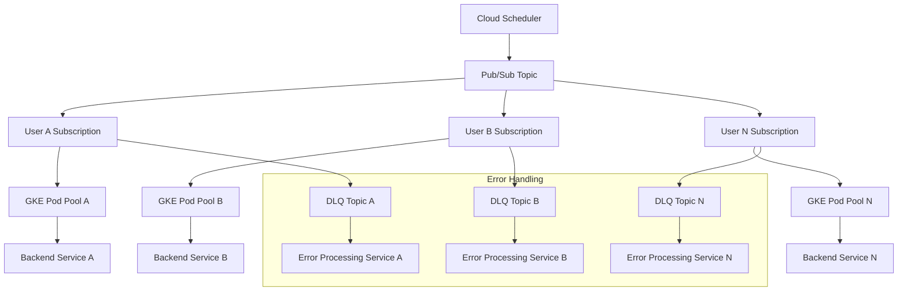
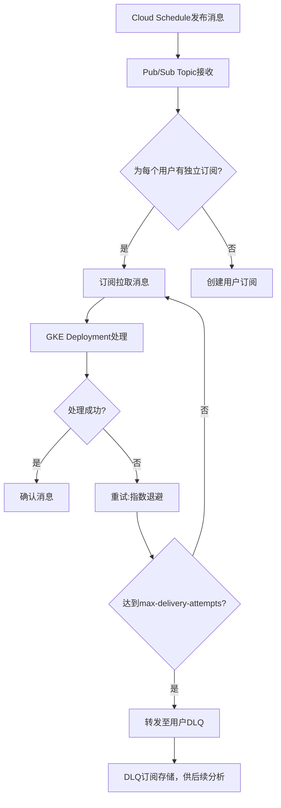

# claude
您遇到的是典型的消息队列阻塞问题。让我为您分析并提供最佳的优化方案。

## 问题分析

当前架构中存在的主要问题：

1. **单线程处理导致的阻塞**：用户A的任务失败会阻塞用户B
1. **重试机制影响整体性能**：长时间的重试会进一步延长队列处理时间
1. **缺乏隔离机制**：不同用户的任务相互影响

## 架构优化方案



## 最佳优化策略

### 1. 按用户分离订阅和处理

```yaml
# 用户A的Subscription配置
apiVersion: v1
kind: ConfigMap
metadata:
  name: pubsub-config-user-a
data:
  subscription-name: "schedule-service-user-a"
  topic-name: "schedule-topic"
  dlq-topic: "schedule-dlq-user-a"
  max-delivery-attempts: "3"
  ack-deadline: "60s"
```

### 2. GKE Deployment优化配置

```yaml
apiVersion: apps/v1
kind: Deployment
metadata:
  name: schedule-service-user-a
spec:
  replicas: 3
  selector:
    matchLabels:
      app: schedule-service
      user: user-a
  template:
    metadata:
      labels:
        app: schedule-service
        user: user-a
    spec:
      containers:
      - name: schedule-service
        image: your-schedule-service:latest
        env:
        - name: PUBSUB_SUBSCRIPTION
          value: "schedule-service-user-a"
        - name: USER_ID
          value: "user-a"
        - name: CONCURRENT_CONSUMERS
          value: "5"
        resources:
          requests:
            cpu: 200m
            memory: 512Mi
          limits:
            cpu: 500m
            memory: 1Gi
```

### 3. 重试策略优化

|配置项               |当前值  |优化建议值|说明       |
|------------------|-----|-----|---------|
|maxBackoffDuration|3600s|300s |减少最大退避时间 |
|maxDoublings      |16   |5    |降低退避倍数   |
|minBackoffDuration|5s   |2s   |快速重试     |
|retryCount        |3    |3    |保持不变     |
|ackDeadline       |默认   |60s  |设置合理的确认超时|

### 4. 死信队列(DLQ)配置

```bash
# 为每个用户创建专用的DLQ Topic
gcloud pubsub topics create schedule-dlq-user-a
gcloud pubsub topics create schedule-dlq-user-b

# 创建带DLQ的订阅
gcloud pubsub subscriptions create schedule-service-user-a \
  --topic=schedule-topic \
  --dead-letter-topic=schedule-dlq-user-a \
  --max-delivery-attempts=3 \
  --ack-deadline=60s \
  --message-filter='attributes.user_id="user-a"'
```

### 5. Java代码优化示例

```java
@Component
public class ScheduleMessageProcessor {
    
    private final ExecutorService executorService;
    private final String userId;
    
    public ScheduleMessageProcessor(@Value("${user.id}") String userId) {
        this.userId = userId;
        this.executorService = Executors.newFixedThreadPool(5);
    }
    
    @EventListener
    public void processMessage(PubsubMessage message) {
        executorService.submit(() -> {
            try {
                processUserTask(message);
            } catch (Exception e) {
                log.error("Processing failed for user: {}, message: {}", 
                    userId, message.getMessageId(), e);
                // 让Pub/Sub自动重试，最终进入DLQ
                throw new RuntimeException("Processing failed", e);
            }
        });
    }
    
    private void processUserTask(PubsubMessage message) {
        // 用户特定的业务逻辑处理
        // 设置合理的超时时间
        try (var timeout = Timeout.of(Duration.ofSeconds(30))) {
            callBackendService(message);
        }
    }
}
```

### 6. DLQ隔离策略

**推荐方案：为每个用户配置独立的DLQ**

优势：

- **完全隔离**：用户间错误不相互影响
- **安全性**：每个用户只能访问自己的DLQ
- **监控精确**：可以按用户维度监控错误率
- **处理灵活**：可以为不同用户设置不同的错误处理策略

```bash
# 批量创建用户DLQ的脚本
#!/bin/bash
USERS=("user-a" "user-b" "user-c")

for user in "${USERS[@]}"; do
    # 创建DLQ Topic
    gcloud pubsub topics create "schedule-dlq-${user}"
    
    # 创建DLQ订阅用于错误处理
    gcloud pubsub subscriptions create "dlq-processor-${user}" \
        --topic="schedule-dlq-${user}" \
        --ack-deadline=300s
        
    # 更新主订阅添加DLQ配置
    gcloud pubsub subscriptions update "schedule-service-${user}" \
        --dead-letter-topic="schedule-dlq-${user}" \
        --max-delivery-attempts=3
done
```

### 7. 监控和告警配置

```yaml
# Cloud Monitoring Alerting Policy
apiVersion: monitoring.coreos.com/v1
kind: PrometheusRule
metadata:
  name: pubsub-dlq-alerts
spec:
  groups:
  - name: pubsub.rules
    rules:
    - alert: DLQMessageAccumulation
      expr: pubsub_subscription_num_undelivered_messages{subscription_name=~"schedule-dlq-.*"} > 10
      for: 5m
      annotations:
        summary: "DLQ accumulating messages for user {{ $labels.subscription_name }}"
```

## 实施建议

1. **分阶段迁移**：先为高优先级用户实施隔离
1. **监控验证**：密切监控新架构的性能指标
1. **自动化管理**：使用Terraform管理Pub/Sub资源
1. **成本控制**：定期清理DLQ中的过期消息

这种方案能够有效解决用户间任务阻塞问题，提供完全的隔离性，并且便于扩展和维护。​​​​​​​​​​​​​​​​


# ChatGPT 

是的，你的理解完全正确，为每个用户的 Pub/Sub 订阅单独配置一个 Dead Letter Topic（DLQ） 是最合理、最推荐的方案，特别是在你已经按照用户划分订阅的架构下。

⸻

✅ 为什么每个用户的订阅单独配置 DLQ 是最佳实践？

优势	说明
隔离性好	每个用户的失败消息只进自己对应的 DLQ，不影响其他用户。
安全性高	可以针对每个 DLQ 单独配置 IAM 权限，确保消息只被对应服务访问，符合最小权限原则。
问题易追踪	用户 A 的失败任务只在 A 的 DLQ 中，便于日志审计、失败排查。
支持差异化策略	可对不同用户配置不同的 maxDeliveryAttempts 或处理逻辑，灵活性强。


⸻

📌 实施策略

1. 为每个用户创建独立的 DLQ topic

命名建议保持结构化，便于后期管理：

gcloud pubsub topics create dlq-user-A
gcloud pubsub topics create dlq-user-B

2. 配置订阅使用 DLQ

gcloud pubsub subscriptions update user-A-subscription \
  --dead-letter-topic=projects/your-project/topics/dlq-user-A \
  --max-delivery-attempts=5

3. 设置 IAM 权限，仅允许特定服务账户访问对应 DLQ

gcloud pubsub topics add-iam-policy-binding dlq-user-A \
  --member=serviceAccount:user-a-dlq-handler@your-project.iam.gserviceaccount.com \
  --role=roles/pubsub.subscriber


⸻

🧩 可选扩展建议
	•	Cloud Function / GKE Job 自动消费 DLQ
	•	可以定期扫描、记录到 BigQuery、发告警、或尝试重入主 topic。
	•	DLQ 监控
	•	可配合 Cloud Monitoring 设置 DLQ 消息堆积告警。
	•	脚本化批量配置 DLQ
	•	如果用户量大，可用 bash + gcloud 脚本批量创建 topic 并绑定。

⸻

✅ 小结：最佳实践是否成立？

条件	结论
是否每个用户有独立订阅？	✅ 是
是否有跨用户的安全隔离需求？	✅ 有
是否需要故障消息分类、审计、独立补偿？	✅ 是
是否希望避免共享 DLQ 导致的权限复杂度？	✅ 是

✅ 因此：为每个订阅配置独立的 DLQ，是当前你架构下的最佳方案。

⸻

如需我帮助你写一个批量为所有现有订阅自动配置 DLQ 的脚本（例如遍历 gcloud pubsub subscriptions list 输出的订阅名，创建对应 DLQ topic 并绑定），我可以立即为你生成。是否需要？

# grok 
关键要点
	•	建议为每个用户配置独立的死信主题（DLQ），以隔离失败消息并确保安全性。
	•	优化重试策略，使用指数退避（exponential backoff），设置最小重试延迟为5秒，最大为600秒（GCP限制）。
	•	将最大交付尝试次数（max-delivery-attempts）设置为3-5，以防止失败任务阻塞后续任务。
	•	确保GKE部署支持并行处理，增加副本数以提升并发能力。
优化方案
重试和阻塞问题：
	•	当前问题在于用户A的任务失败或超时会阻塞用户B的任务，这可能是由于GKE部署的顺序处理或共享资源导致。
	•	建议调整Pub/Sub订阅的重试策略，使用指数退避减少对后端负载，设置min-retry-delay=5s和max-retry-delay=600s（注意，GCP最大为600秒，您的3600秒配置不可用）。
	•	配置死信主题（DLQ），将失败消息移出主订阅，防止无限重试阻塞。例如，设置max-delivery-attempts=3，失败3次后移至DLQ。
死信主题（DLQ）配置：
	•	由于您为不同用户创建了不同的订阅，建议为每个用户的订阅配置独立的DLQ（如user-a-dlq、user-b-dlq）。
	•	这样可以隔离每个用户的失败消息，增强安全性，并便于监控和处理。
	•	使用以下命令配置：
gcloud pubsub subscriptions update user-a-subscription --dead-letter-topic=user-a-dlq --max-delivery-attempts=3
	•	
	•	确保Pub/Sub服务账户有权限（service-project-number@gcp-sa-pubsub.iam.gserviceaccount.com）发布到DLQ并订阅原订阅。
GKE和后端优化：
	•	确保GKE部署有多个副本，支持并行处理任务，避免顺序依赖。
	•	在Java应用中实现异步处理（如使用线程池），提升并发能力。
	•	监控DLQ使用Cloud Monitoring，跟踪subscription/dead_letter_message_count指标。
最佳时间方案
	•	重试延迟建议使用指数退避，min-retry-delay=5s，max-retry-delay=600s，结合DLQ的max-delivery-attempts=3或5，确保失败任务不无限阻塞。

详细报告
以下是针对您问题的详细分析和解决方案，涵盖优化流程、技术细节和最佳实践，适合深入理解和实施。
背景分析
您的当前架构为：
	•	Cloud Schedule -> Pub/Sub Topic -> GKE Deployment (Schedule Service) -> Backend Service。
	•	Java代码部署在GKE，处理多用户任务（如用户A和B）。
	•	问题：用户A的任务失败或超时会阻塞用户B的任务，尤其在重试配置下（如maxBackoffDuration=3600s、maxDoublings=16、minBackoffDuration=5s、retryCount=3），可能导致B任务等待时间过长。
	•	您提到当前Pub/Sub订阅未配置DLQ，并考虑为不同用户配置独立的DLQ以隔离和保障安全。
通过官方文档和最佳实践分析，以下是详细解决方案。
问题分析：阻塞和重试
	1	阻塞原因：
	◦	Pub/Sub消息理论上是独立处理的，但如果GKE部署顺序处理（单副本或共享资源），A的任务失败会导致B的任务延迟。
	◦	可能原因包括：
	▪	GKE单副本，顺序拉取和处理消息。
	▪	后端服务有依赖（如数据库锁），导致失败任务阻塞队列。
	◦	当前无DLQ配置，失败消息可能无限重试，占用订阅资源。
	2	重试配置分析：
	◦	您提到的maxBackoffDuration=3600s超出了GCP Pub/Sub的max-retry-delay限制（最大600秒）。这可能表明配置错误或误解。
	◦	Pub/Sub重试策略支持指数退避（exponential backoff），参数包括：
	▪	min-retry-delay：最小重试延迟，默认10秒，可设为5秒。
	▪	max-retry-delay：最大重试延迟，最大600秒。
	◦	retryCount=3可能指DLQ的max-delivery-attempts，而非重试次数。Pub/Sub无直接retryCount，重试会持续到消息被确认或保留期结束（默认7天）。
优化建议
以下是分步骤的优化方案：
1. 配置死信主题（DLQ）
	•	为何需要DLQ：
	◦	DLQ将失败消息（超过最大交付尝试次数）转发到单独主题，防止无限重试阻塞主订阅。
	◦	您提到为不同用户创建不同订阅，建议为每个订阅配置独立DLQ，确保隔离和安全性。
	•	实施步骤：
	◦	为每个用户创建DLQ主题，例如：
	▪	用户A：user-a-dlq
	▪	用户B：user-b-dlq
	◦	为每个订阅配置死信策略：
	▪	设置max-delivery-attempts=3（初始交付+2次重试），或根据需求调整（如5次）。
	▪	示例命令：
gcloud pubsub subscriptions update user-a-subscription --dead-letter-topic=user-a-dlq --max-delivery-attempts=3
	▪	
	◦	确保权限：
	▪	Pub/Sub服务账户（service-project-number@gcp-sa-pubsub.iam.gserviceaccount.com）需有DLQ主题的发布者角色和原订阅的订阅者角色。
	◦	为DLQ主题创建订阅（如user-a-dlq-subscription），避免消息丢失，便于后续分析。
	•	好处：
	◦	隔离用户失败消息，增强安全性。
	◦	失败消息移出主订阅后，不再阻塞新任务。
	◦	可通过Cloud Monitoring监控DLQ，使用subscription/dead_letter_message_count指标。
2. 优化重试策略
	•	指数退避配置：
	◦	设置min-retry-delay=5s（符合您的minBackoffDuration）。
	◦	设置max-retry-delay=600s（GCP最大限制，您的3600秒不可用）。
	◦	示例命令：
`gcloud pubsub subscriptions create user-a-subscription --topic=topic-id --min-retry-delay=5s --max-retry-delay=600s`
	◦	
	◦	指数退避减少后端负载，适合处理瞬时失败。
	•	注意事项：
	◦	maxDoublings=16非Pub/Sub参数，可能为自定义逻辑，建议统一到Pub/Sub配置。
	◦	无DLQ时，消息可能无限重试，建议结合DLQ限制尝试次数。
3. GKE和后端优化
	•	并行处理：
	◦	确保GKE Deployment有多个副本（通过replicas设置），例如：
```yaml
apiVersion: apps/v1
		kind: Deployment
		metadata:
		  name: schedule-service
		spec:
		  replicas: 3
		  selector:
		    matchLabels:
		      app: schedule-service
		  template:
		    metadata:
		      labels:
		        app: schedule-service
		    spec:
		      containers:
		      - name: schedule-service
		        image: your-image
```
---


	◦	多个副本可并行拉取和处理Pub/Sub消息。
	•	Java应用优化：
	◦	使用线程池或异步框架（如Spring WebFlux）处理消息，避免顺序依赖。
	◦	示例代码：
ExecutorService executor = Executors.newFixedThreadPool(10);
	◦	executor.submit(() -> processMessage(message));
	◦	
	•	确认截止时间（Acknowledgment Deadline）：
	◦	如果任务处理时间长，增加订阅的确认截止时间，例如300秒：
gcloud pubsub subscriptions update user-a-subscription --ack-deadline=300
	◦	
	◦	防止因超时导致重复交付。
4. 监控和维护
	•	使用Cloud Monitoring监控：
	◦	subscription/dead_letter_message_count：跟踪DLQ消息数量。
	◦	subscription/num_undelivered_messages：监控主订阅未交付消息。
	•	设置警报，及时处理DLQ中的失败消息，例如通过Cloud Functions或批处理脚本重新处理。
最佳时间方案
	•	重试延迟：使用指数退避，min-retry-delay=5s，max-retry-delay=600s，结合DLQ的max-delivery-attempts=3或5。
	•	为何选择：
	◦	指数退避减少瞬时失败的负载，600秒最大延迟符合GCP限制。
	◦	DLQ限制尝试次数，确保失败任务不无限阻塞。

流程图（Mermaid）
以下是优化流程的Mermaid流程图，便于理解：




总结表
以下是关键配置参数的总结：
参数
建议值
说明
min-retry-delay
5s
最小重试延迟，符合您的配置
max-retry-delay
600s
最大重试延迟，GCP限制
max-delivery-attempts
3或5
DLQ触发阈值，控制失败消息转发
ack-deadline
300s（可选）
增加处理时间，减少超时重试

关键引文
	•	Google Cloud Pub/Sub处理失败消息文档
	•	Google Cloud Pub/Sub死信主题文档
