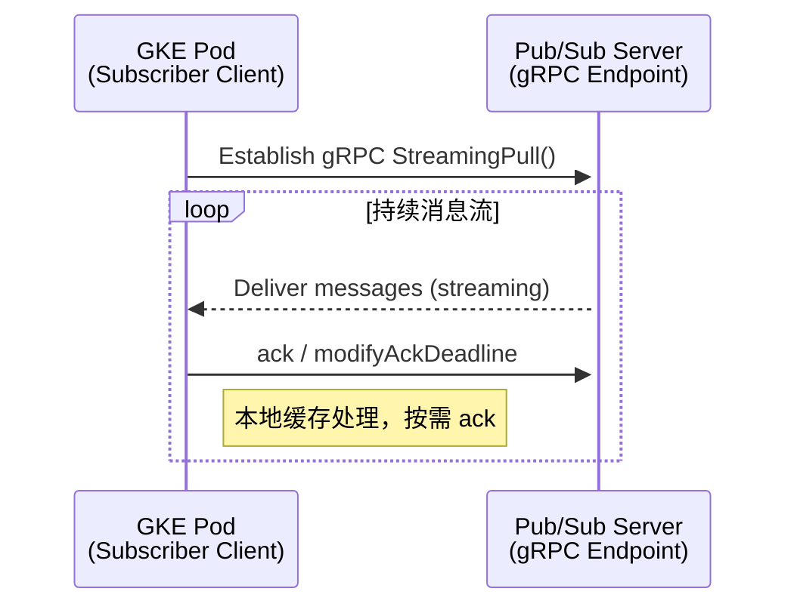
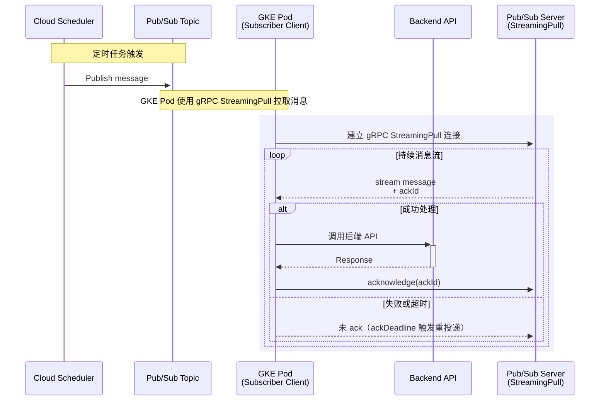
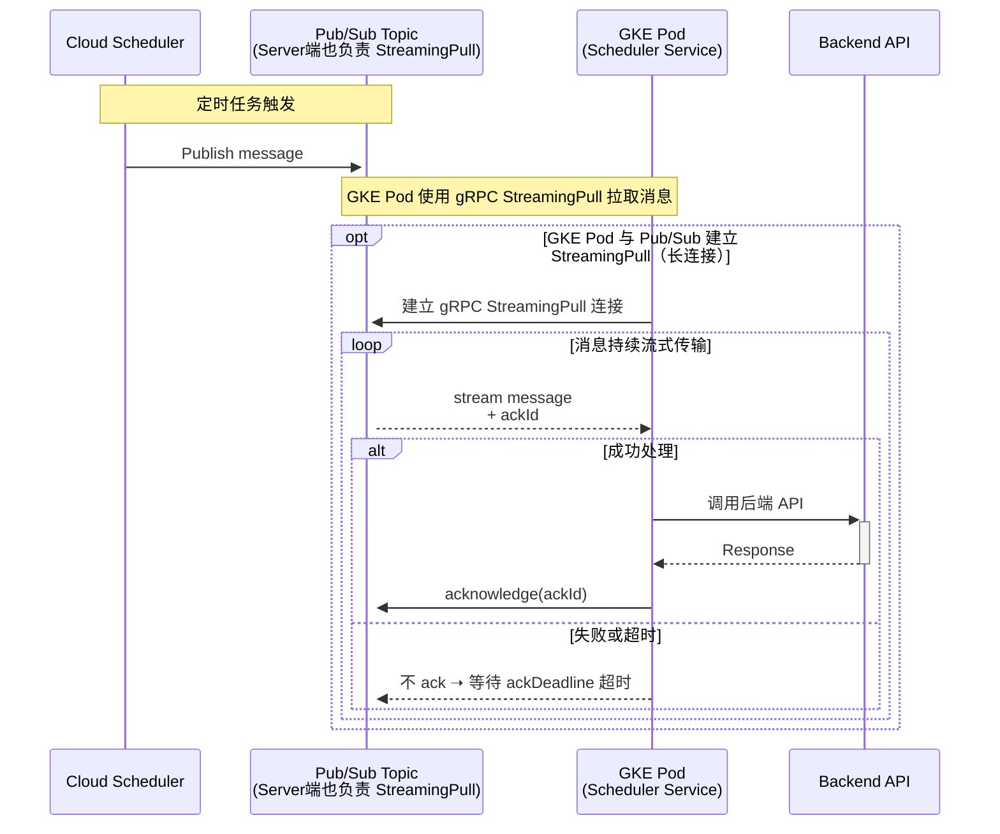
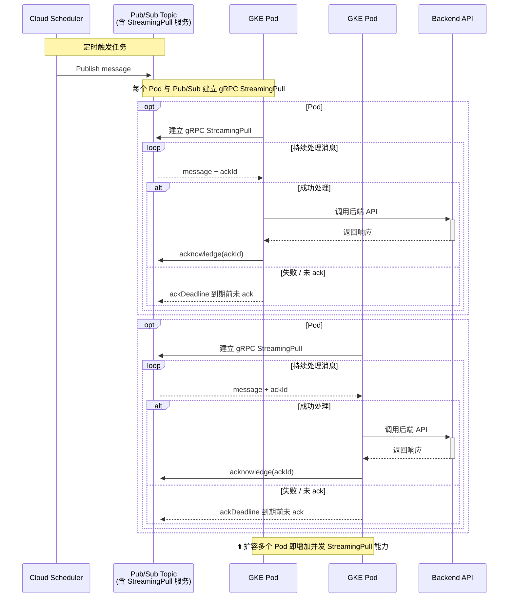
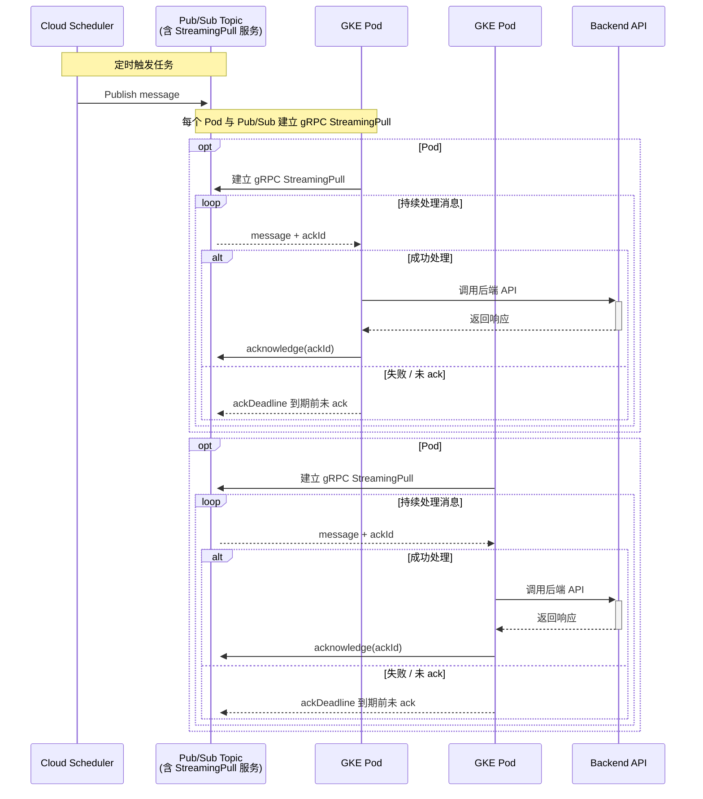
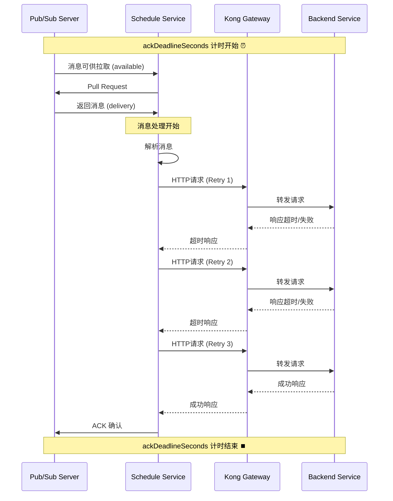

   1. 任务触发：Cloud Scheduler 按预定计划，向指定的 Pub/Sub Topic 发布一条消息。
   2. 消息路由：Pub/Sub Topic 接收到消息后，立即将其路由到所有关联的 Subscription。
   3. 消息消费 (StreamingPull)：
       * GKE 中的每个 Pod 都作为一个独立的订阅者客户端，与 Subscription 建立一个持久的 gRPC StreamingPull 连接。
       * Pub/Sub 通过这些长连接实时地将消息流式传输给可用的 Pod。
   4. 任务处理：
       * Pod 收到消息后，调用后端的 Backend API 来执行实际的业务逻辑。
   5. 结果反馈 (ACK/NACK)：
       * 成功路径：如果 Backend API 在预设时间内成功返回，Pod 会向 Pub/Sub 发送一个 ACK（确认）信号，该消息被视为处理完毕，将从订阅中永久删除。
       * 失败路径：如果 Backend API 返回错误或处理超时，Pod 不会发送 ACK。
   6. 自动重试：
       * 对于未被 ACK 的消息，一旦其 ackDeadlineSeconds 到期，Pub/Sub 会认为该消息处理失败，并将其重新投递给一个可用的消费者（可能是同一个 Pod 或其他
         Pod）。
   7. 死信队列 (DLQ)：
       * 如果在多次重试（由 maxDeliveryAttempts 参数定义）后，某条消息仍然无法被成功处理，Pub/Sub 会停止重试，并将其发送到预先配置好的 Dead Letter Queue 
         (DLQ) 中。这可以防止“毒消息”无限循环，阻塞整个系统。
   8. 并发扩展：
       * 当消息量增大时，只需增加 GKE 中 Pod 的副本数。每个新的 Pod 都会建立自己的 StreamingPull 连接，从而线性地提升整个系统的消息处理能力。
- the streaming pull



- for show streaming pull



- merged
    - core concept
    - 开启并发 [StreamingPull](./pub-sub-monitor-parameter.md#streamingpull)其实单独扩展 Pod 的数量也就是扩展了并发能力
    - [streaming_pull_response_count](./pub-sub-monitor-parameter.md#streaming_pull_response_count)





- About 扩容多个 Pod 即增加并发 StreamingPull 能力

| 特性                                             | 状态 | 说明                                     |
| ------------------------------------------------ | ---- | ---------------------------------------- |
| 每个 Pod 是独立的 Subscriber 客户端              | ✅   | 建立独立 StreamingPull 会话              |
| 每条消息有自己的 ackDeadline，Pod 负责自己的消息 | ✅   | ack 是 per-message 的，逻辑上由 Pod 管理 |
| Pub/Sub 会在 ackDeadline 到期后将消息重新分发给其他 Pod | ✅   | 重新分发消息, 确保公平性和高吞吐         |
| Pod 崩溃不影响其他 Pod                           | ✅   | 影响范围只限其未 ack 消息                |
| 多 Pod 并发能防止阻塞和堆积                      | ✅   | 是扩展 StreamingPull 并发的推荐做法      |


---



Note over Pod1,Pod2:
    - 每个 Pod 是独立的 Subscriber Client
    - 每个 Pod 维护自己的 StreamingPull 会话与 ack 逻辑
    - 每条消息都有独立的 ackDeadline（由拉取方管理
    - 某个 Pod 崩溃或处理失败不会影响其他 Pod 的消费
    - Pub/Sub 会在 ackDeadline 到期后将消息重新分发给其他 Pod
    - 扩容 Pod 数量 == 横向扩展 StreamingPull 并发能力，提升吞吐并降低堆积

- Pub/Sub Topics、Subscriptions、Cloud Scheduler Jobs 三者的关系：

    - Cloud Scheduler 定时触发 Pub/Sub Topic 发布消息
    - Pub/Sub Topic 负责消息路由，将消息推送给所有订阅了该 Topic 的 Subscriptions
    - GKE Pod 与 Pub/Sub 建立 StreamingPull 长连接，持续接收消息
    - reference
        - [3 components](./pub-sub-command.md)
        - Schedule Job
            - [scheduler-jobs-describe](./scheduler-jobs-describe.md)
            - maxBackoffDuration
                - 当消息处理失败时，Pub/Sub 会根据指数退避算法（指数退避算法）重新路由消息，直到达到最大重试次数（maxDeliveryAttempts）
            - [maxBackoffDuration](./pub-sub-max-delivery-attempts.md#2-maxbackoffdurationcloud-scheduler)
                - []
        - [Subscriptions](./pub-sub-subscriptions.md)
	        - ackDeadlineSeconds
  	        - 个人理解因为ackDeadlineSeconds等于是一个总开关一样,后面的时间处理都不应该超过这个时间
  	        - 确保在 PULL 模式下，所有处理都在 ackDeadlineSeconds 限制内完成，以避免消息堆积
    	        - [方案1: 客户端控制超时 (推荐)](./pub-sub-subscriptions.md#方案1-客户端控制超时-推荐)
    	        - [方案2: 快速失败 + 智能重试](./pub-sub-subscriptions.md#方案2-快速失败--智能重试)
    	        - [方案3. 快速失败的 HTTP 配置](./pub-sub-subscriptions.md#方案3-快速失败的-http-配置)
	        ```bash
            ackDeadlineSeconds: 600s (10分钟)
            Kong 超时: 6分钟 × 3次重试 = 18分钟
            重试间隔: 0s + 10s + 20s = 30s  
            总处理时间: ≈ 18分30秒 >> 600s ❌
            ```
	        - the ackDeadlineSeconds flow
	        - the flow next


- DLQ
        - [DLQ](./dlq.md)
            - 当消息处理失败时，Pub/Sub 会将消息重新路由到 DLQ
            - 如果原来的 subscription 没有配置 DLQ，那么需要 update subscription，添加 DLQ
            - pub-sub ==> maxDeliveryAttempts
                - 用于控制消息进入死信队列 DLQ 的时机
                - [pub-sub-max-delivery-attempts](./pub-sub-max-delivery-attempts.md)


- monitor

    - [pub-sub-monitor-parameter](./pub-sub-monitor-parameter.md)
    - core parameter
        - [streaming_pull_response_count](./pub-sub-monitor-parameter.md#streaming_pull_response_count)
        - [send_message_count](./pub-sub-monitor-parameter.md#send_message_count)
        - [unacked_messages_by_region](./pub-sub-monitor-parameter.md#unacked_messages)
        - [unacked_messages_by_region](./unacked-message-by-region.md)


```mermaid

```


