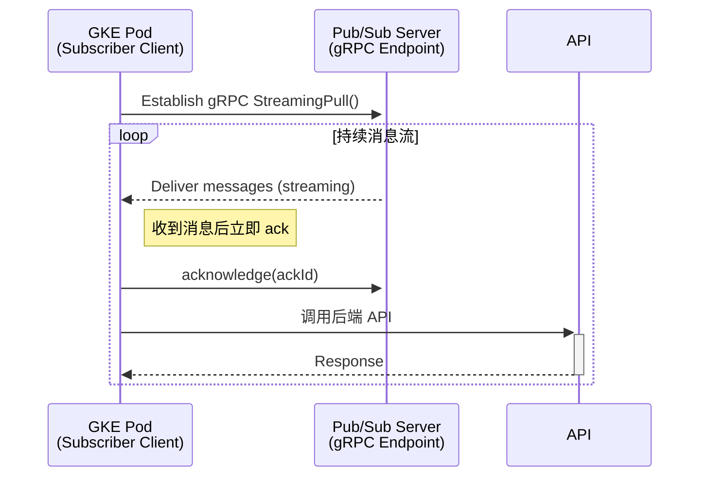
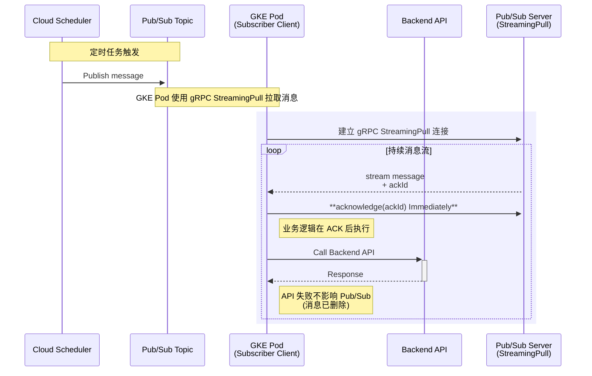
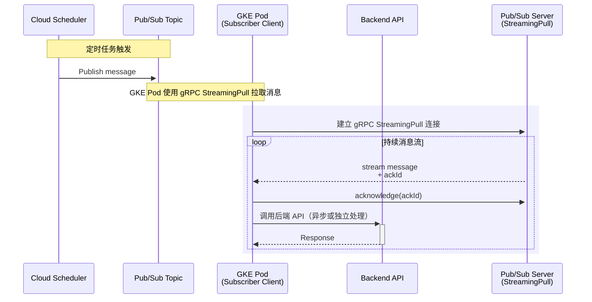
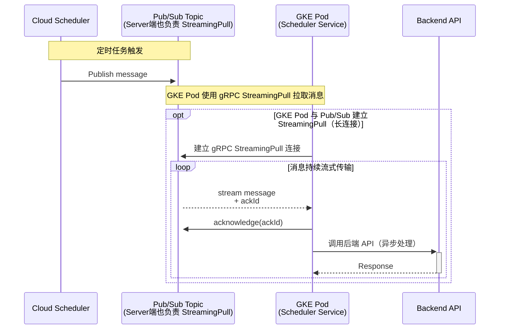
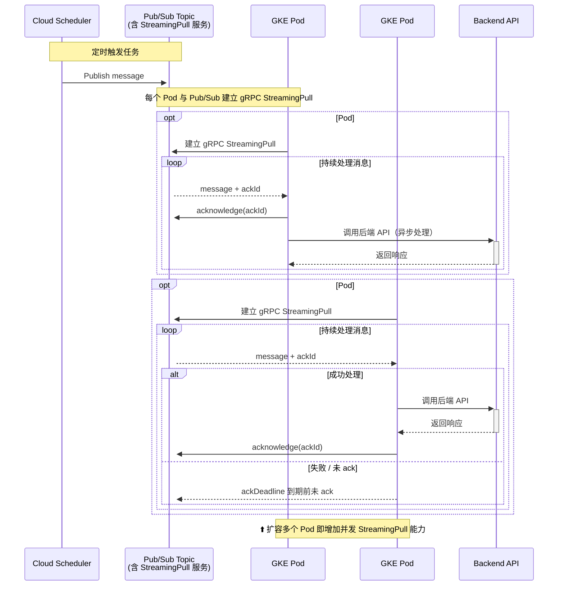
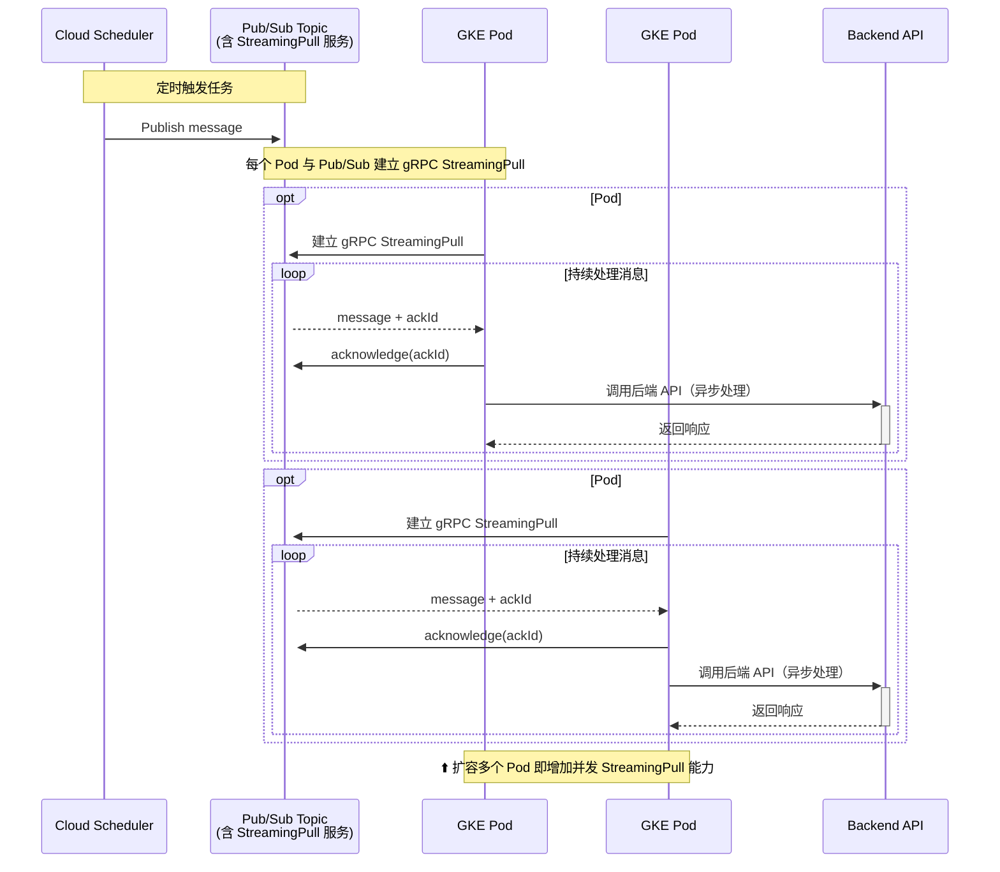
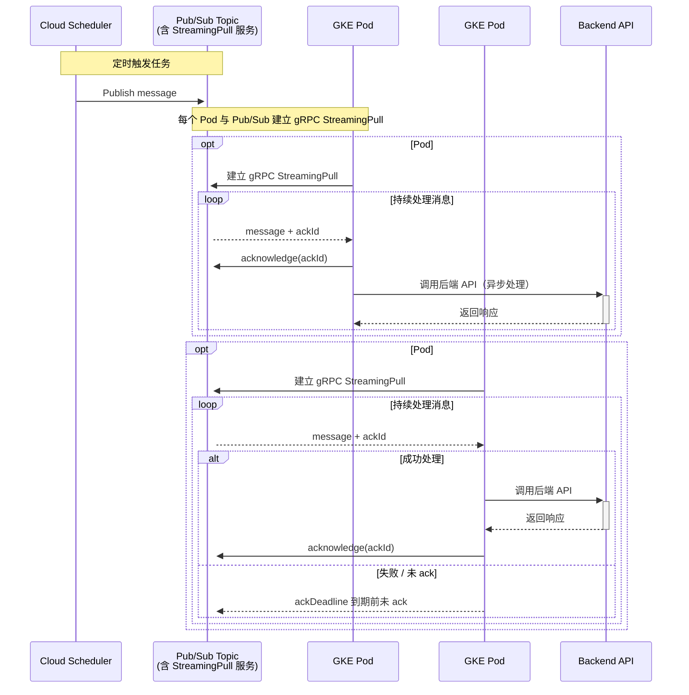
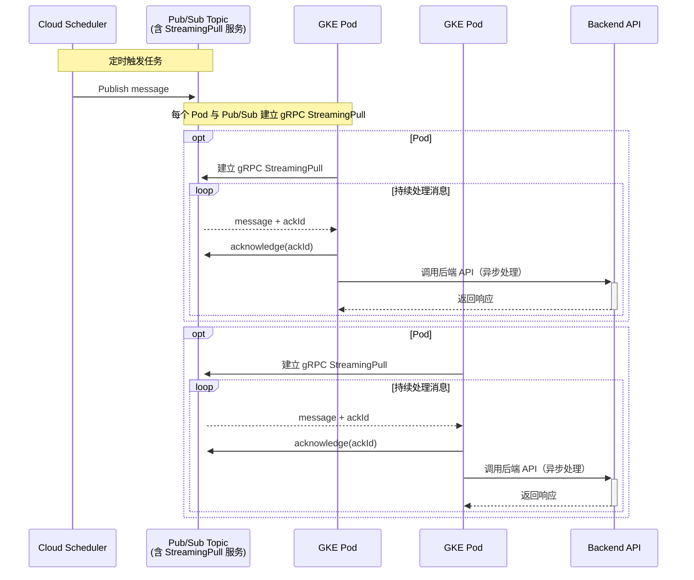
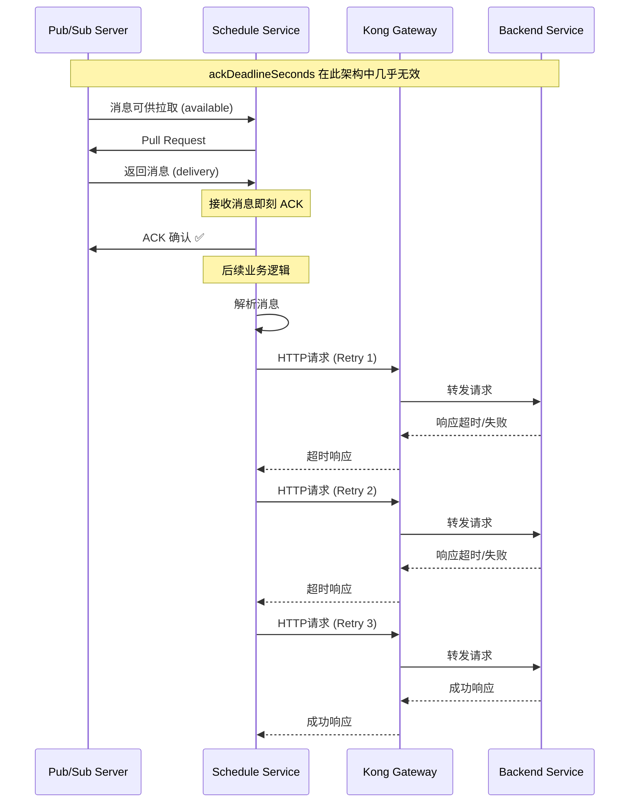
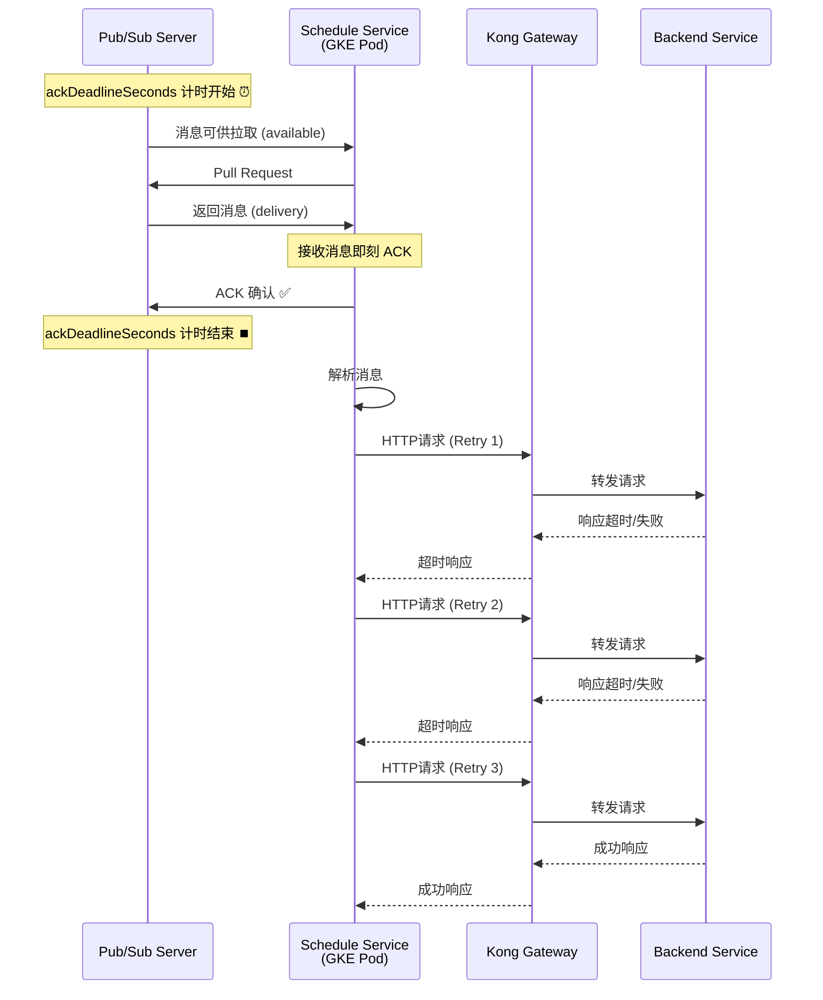

1. 任务触发：Cloud Scheduler 按预定计划，向指定的 Pub/Sub Topic 发布一条消息。
2. 消息路由：Pub/Sub Topic 接收到消息后，立即将其路由到所有关联的 Subscription。
3. 消息消费 (StreamingPull)：
    * GKE 中的每个 Pod 都作为一个独立的订阅者客户端，与 Subscription 建立一个持久的 gRPC StreamingPull 连接。
    * Pub/Sub 通过这些长连接实时地将消息流式传输给可用的 Pod。
4. 消息消费与确认 (StreamingPull & Acknowledge on Receipt)：
    * GKE 中的每个 Pod 作为一个独立的订阅者客户端，与 Subscription 建立一个持久的 gRPC StreamingPull 连接。
    * Pub/Sub 通过这些长连接实时地将消息流式传输给可用的 Pod。
    * Pod 收到消息后，**立即向 Pub/Sub 发送 ACK (确认) 信号**。Pub/Sub 随即删除该消息，**不会再进行重试**。
5. 任务处理 (At-Most-Once)：
    * 在消息确认后，Pod 调用后端的 Backend API 来执行实际的业务逻辑。
    * **此模式为“最多一次”投递**。如果 Backend API 调用失败或 Pod 崩溃，**消息将会丢失**，因为 Pub/Sub 已将其删除。所���后续处理的可靠性需由应用层自行保证。
6. 自动重试与死信队列 (DLQ) 的变化：
    * 由于消息被立即 ACK，Pub/Sub 的**自动重试机制（基于 ackDeadline）和死信队列（基于 maxDeliveryAttempts）将不会被触发**。因为从 Pub/Sub 的角度看，所有消息都是“成功”处理的。
    * 任何需要重试的逻辑都必须在 `ScheduleService` 内部实现。
7. 并发扩展：
    * 当消息量增大时，只需增加 GKE 中 Pod 的副本数。每个新的 Pod 都会建立自己的 StreamingPull 连接，从而线性地提升整个系统的消息**接收和确认**能力。
- the streaming pull



- for show streaming pull



- fix this one 




- merged
    - core concept
    - 开启并发 [StreamingPull](./pub-sub-monitor-parameter.md#streamingpull)其实单独扩展 Pod 的数量也就是扩展了并发能力
    - [streaming_pull_response_count](./pub-sub-monitor-parameter.md#streaming_pull_response_count)


fix this one 



- fix this one 


以下是你提供的时序图的修复版本，已将 ack 与后端 API 调用解耦，符合你目前的实际逻辑 —— GKE 中的多个 Pod 一旦拉取到消息就立即 ack，不等待后端处理完成
✅ 修复关键点：

| 修复内容 | 说明 |
| --- | --- |
| ack 提前 | ack 操作在收到消息后立即执行 |
| 后端调用独立 | 调用后端 API 不再决定是否 ack，逻辑上解耦 |
| 多 Pod 拉取并发能力 | 每个 Pod 都有独立 StreamingPull 连接并独立 ack |


---


- fix this one 


Note over Pod1,Pod2:
    - 每个 Pod 是独立的 Subscriber Client
    - 每个 Pod 维护自己的 StreamingPull 会话与 ack 逻辑
    - 每条消息都有独立的 ackDeadline（由拉取方管理
    - 某个 Pod 崩溃或处理失败不会影响其他 Pod 的消费
    - Pub/Sub 会在 ackDeadline 到期后将消息重新分发给其他 Pod
    - 扩容 Pod 数量 == 横向扩展 StreamingPull 并发能力，提升吞吐并降低堆积

- Pub/Sub Topics、Subscriptions、Cloud Scheduler Jobs 三者的关系：

    - Cloud Scheduler 定时触发 Pub/Sub Topic 发布消息
    - Pub/Sub Topic 负责消息路由，将消息推送给所有订阅了该 Topic 的 Subscriptions
    - GKE Pod 与 Pub/Sub 建立 StreamingPull 长连接，持续接收消息
    - reference
        - [3 components](./pub-sub-command.md)
        - Schedule Job
            - [scheduler-jobs-describe](./scheduler-jobs-describe.md)
            - maxBackoffDuration
                - 当消息处理失败时，Pub/Sub 会根据指数退避算法（指数退避算法）重新路由消息，直到达到最大重试次数（maxDeliveryAttempts）
            - [maxBackoffDuration](./pub-sub-max-delivery-attempts.md#2-maxbackoffdurationcloud-scheduler)
                - []
        - [Subscriptions](./pub-sub-subscriptions.md)
	        - ackDeadlineSeconds
  	        - 个人理解因为ackDeadlineSeconds等于是一个总开关一样,后面的时间处理都不应该超过这个时间
  	        - 确保在 PULL 模式下，所有处理都在 ackDeadlineSeconds 限制内完成，以避免消息堆积
    	        - [方案1: 客户端控制超时 (推荐)](./pub-sub-subscriptions.md#方案1-客户端控制超时-推荐)
    	        - [方案2: 快速失败 + 智能重试](./pub-sub-subscriptions.md#方案2-快速失败--智能重试)
    	        - [方案3. 快速失败的 HTTP 配置](./pub-sub-subscriptions.md#方案3-快速失败的-http-配置)
```bash
ackDeadlineSeconds: 600s (10分钟)
Kong 超时: 6分钟 × 3次重试 = 18分钟
重试间隔: 0s + 10s + 20s = 30s  
总处理时间: ≈ 18分30秒 >> 600s ❌
```
	        - the ackDeadlineSeconds flow
	        - the flow next

- fix 

- DLQ
    - [DLQ](./dlq.md)
        - 当消息处理失败时，Pub/Sub 会将消息重新路由到 DLQ
        - 如果原来的 subscription 没有配置 DLQ，那么需要 update subscription，添加 DLQ
        - pub-sub ==> maxDeliveryAttempts
            - 用于控制消息进入死信队列 DLQ 的时机
            - [pub-sub-max-delivery-attempts](./pub-sub-max-delivery-attempts.md)


- monitor

    - [pub-sub-monitor-parameter](./pub-sub-monitor-parameter.md)
    - core parameter
        - [streaming_pull_response_count](./pub-sub-monitor-parameter.md#streaming_pull_response_count)
        - [send_message_count](./pub-sub-monitor-parameter.md#send_message_count)
        - [unacked_messages_by_region](./pub-sub-monitor-parameter.md#unacked_messages)
        - [unacked_messages_by_region](./unacked-message-by-region.md)