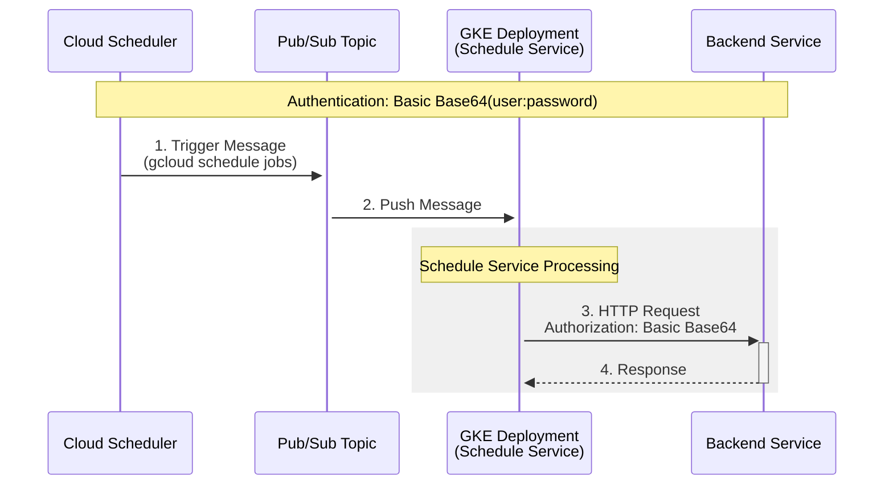
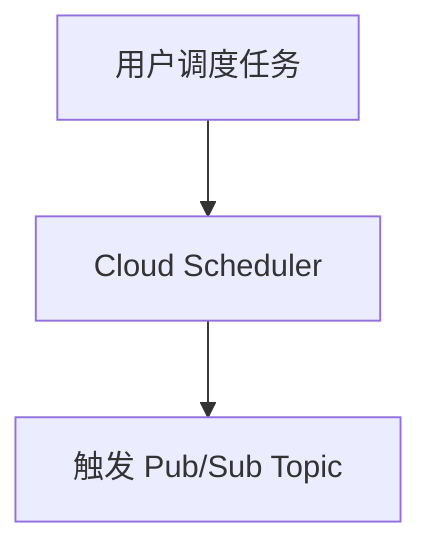
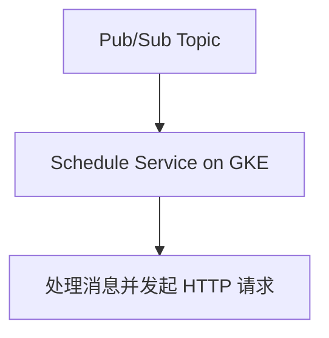
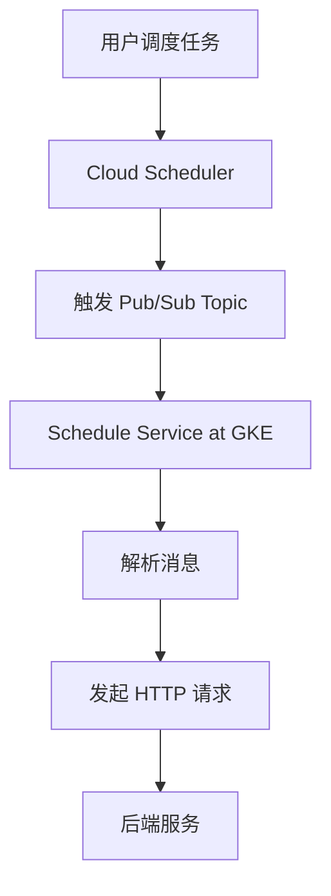
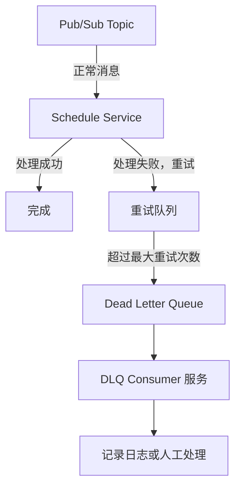

以下是对您描述的 GCP Pub/Sub 场景的细化，包括每个组件及其交互流程：


场景描述：
	1.	用户调度任务：
用户通过 GCP Cloud Scheduler 创建和管理调度任务，使用命令如 gcloud scheduler jobs list 查看所有任务。
	2.	触发 Pub/Sub 队列：
每个调度任务的触发会将消息推送到一个指定的 Pub/Sub Topic 队列。
	3.	GKE 部署的 Schedule 服务：
GKE 中部署一个专门用于处理调度的服务（称为 Schedule Service）。该服务订阅 Pub/Sub 消息并处理其中的内容。
	4.	Schedule 服务处理逻辑：
	•	从 Pub/Sub 消息队列中接收消息。
	•	解析消息内容，构建一个 HTTP 请求（包含 Basic Auth 认证头）。
	•	使用 curl 或其他 HTTP 客户端库向指定的后端服务 URL 发起请求。

细化流程

以下是更具体的流程图和操作细节：

1. 用户调度任务 -> Pub/Sub 队列

	•	Cloud Scheduler 配置：
```yaml
name: "daily-job"
schedule: "0 12 * * *" # 每天中午12点
timeZone: "UTC"
pubsubTarget:
  topicName: "projects/{PROJECT_ID}/topics/{TOPIC_NAME}"
  data: "Your payload here" # 消息内容
```

	•	查看调度任务：

`gcloud scheduler jobs list`

2. Pub/Sub 队列 -> GKE Schedule 服务

	•	Pub/Sub Subscriber 配置：
GKE 中的 Schedule Service 使用 Pub/Sub 的 Push 或 Pull 模式订阅消息：
	•	Push 模式：将消息推送到 GKE 服务的一个 HTTP 端点。
	•	Pull 模式：Schedule Service 通过 Pub/Sub SDK 拉取消息。
	•	示例代码（Pull 模式）：
```python
from google.cloud import pubsub_v1
import requests
import base64

# 配置 Pub/Sub
project_id = "your-project-id"
subscription_id = "your-subscription-id"

subscriber = pubsub_v1.SubscriberClient()
subscription_path = subscriber.subscription_path(project_id, subscription_id)

def callback(message):
    print(f"Received message: {message.data}")
    message.ack()  # 确认接收

    # 解析消息并构建 HTTP 请求
    url = "https://backend-service.example.com/endpoint"
    auth = "user:password"
    headers = {
        "Authorization": f"Basic {base64.b64encode(auth.encode()).decode()}",
        "Content-Type": "application/json",
    }
    response = requests.post(url, data=message.data, headers=headers)
    print(f"Response: {response.status_code}")

subscriber.subscribe(subscription_path, callback=callback)

print("Listening for messages...")
```
流程图

完整流程如下：

后续优化建议
	1.	安全性：
	•	使用 GCP Secret Manager 存储 Basic Auth 的用户名和密码，避免硬编码敏感信息。
	•	使用 HTTPS 和 OAuth2 代替 Basic Auth。
	2.	日志和监控：
	•	使用 Cloud Logging 记录调度任务的执行日志和 HTTP 请求的响应。
	•	配置 Cloud Monitoring，跟踪 Pub/Sub 消息的处理状态。
	3.	错误处理：
	•	实现消息重试逻辑（Pub/Sub 支持自动重试）。
	•	在 HTTP 请求失败时，记录错误日志或推送到 Dead Letter Queue（DLQ）。


什么是 Dead Letter Queue (DLQ)？

Dead Letter Queue (DLQ) 是一种机制，用于存储未能成功处理的消息。
在 GCP Pub/Sub 中，当某条消息经过多次重试后仍无法成功处理（例如，消费失败或消费者服务不可用），可以将该消息推送到一个专门的 Dead Letter Queue，以便后续进行分析或重新处理。

细化实现流程

以下是如何配置和使用 Dead Letter Queue 的步骤：

1. 配置 Dead Letter Queue

在 Pub/Sub Topic 中，为订阅者指定一个 Dead Letter Queue（另一个 Pub/Sub Topic）。
当某条消息处理失败并超过最大重试次数时，它会被推送到指定的 DLQ。
	•	配置订阅时指定 DLQ：
```bash
gcloud pubsub subscriptions create SUBSCRIPTION_NAME \
    --topic=TOPIC_NAME \
    --dead-letter-topic=DLQ_TOPIC_NAME \
    --max-delivery-attempts=5
```
参数说明：
	•	--dead-letter-topic：指定 DLQ 的 Topic 名称。
	•	--max-delivery-attempts：指定消息的最大投递次数（默认值为 5）。超过此次数，消息会推送到 DLQ。

	•	更新已有订阅的 DLQ 配置：
如果订阅已存在，可以通过以下命令更新：
```bash
gcloud pubsub subscriptions update SUBSCRIPTION_NAME \
    --dead-letter-topic=DLQ_TOPIC_NAME \
    --max-delivery-attempts=5
```
2. 处理 Dead Letter Queue 的消息

配置完成后，DLQ 的消息需要被单独消费，以便进行分析或手动处理。
	•	DLQ 消费者服务：
创建一个新的服务，订阅 DLQ 的 Topic，并分析或处理其中的消息。
示例代码：
```Python
from google.cloud import pubsub_v1

# 配置 DLQ 订阅
project_id = "your-project-id"
dlq_subscription_id = "your-dlq-subscription-id"

subscriber = pubsub_v1.SubscriberClient()
subscription_path = subscriber.subscription_path(project_id, dlq_subscription_id)

def callback(message):
    print(f"Dead Letter Message: {message.data.decode('utf-8')}")
    # 在此处进行日志记录或手动重新处理逻辑
    try:
        # 记录到日志或存储
        with open("dlq_messages.log", "a") as f:
            f.write(f"{message.data.decode('utf-8')}\n")
        
        # 如果需要重新处理，可以调用原服务或另写逻辑
        print("Message logged for further analysis.")
        message.ack()  # 确认消息已消费
    except Exception as e:
        print(f"Failed to process message: {e}")
        message.nack()  # 如果无法处理，则保留消息

subscriber.subscribe(subscription_path, callback=callback)
print("Listening for DLQ messages...")
```
3. 流程示意图

以下是引入 DLQ 的完整流程：

4. DLQ 使用场景
	•	错误分析：
如果消息处理失败，可以通过 DLQ 查看问题消息的具体内容，例如消息格式错误或缺少必要字段。
	•	手动重试：
消费 DLQ 中的消息，进行手动处理或重新发布到原始 Topic 以重新触发处理。
	•	报警监控：
配置 Cloud Monitoring 和 Cloud Logging，当 DLQ 中消息积压过多时触发报警，提醒相关团队。

配置最佳实践
	1.	合理设置最大重试次数：
根据消费者服务的可用性和错误类型（例如间歇性错误 vs 永久性错误）设置 max-delivery-attempts。
	2.	监控 DLQ 状态：
	•	使用 Cloud Monitoring 设置 DLQ Topic 的消息积压报警。
	•	确保 DLQ Consumer 服务运行稳定。
	3.	日志记录：
将处理失败的消息记录到日志或持久化存储，便于排查问题。
	4.	重新发布机制：
如果消息处理逻辑修复后，可以将 DLQ 中的消息重新发布到原始 Topic。例如：
```bash
publisher = pubsub_v1.PublisherClient()
topic_path = publisher.topic_path(project_id, "original-topic")

for message in dlq_messages:
    publisher.publish(topic_path, message)
```


如果您有更具体的场景或需要进一步的代码示例，请随时告知！

