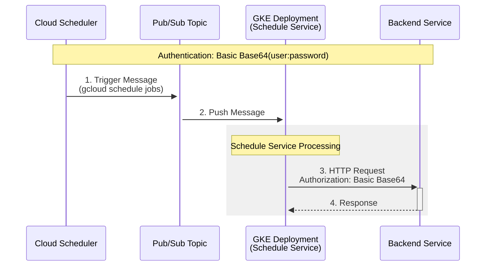
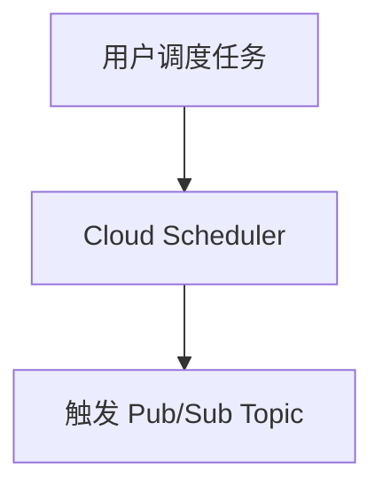
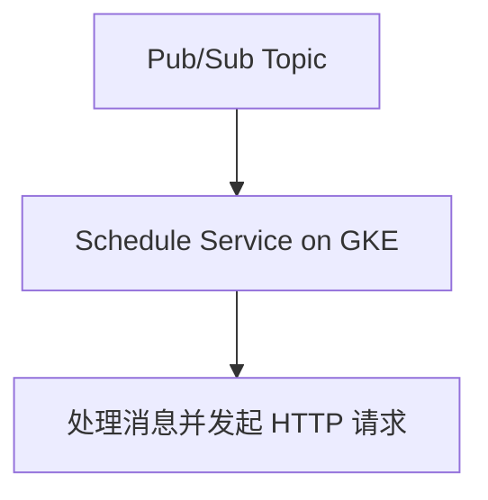
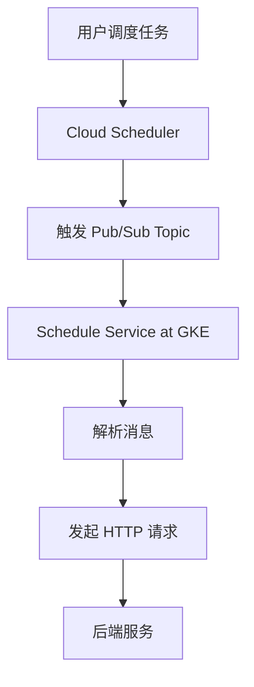
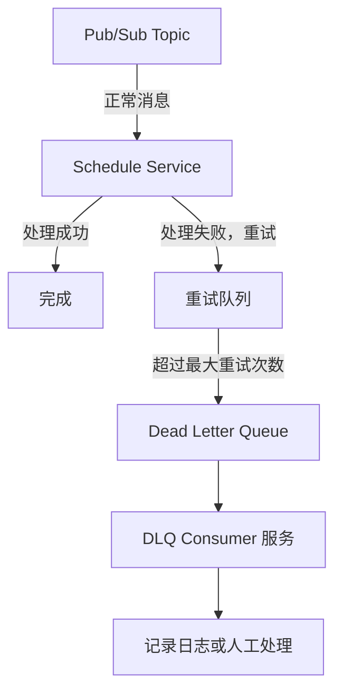

以下是对您描述的 GCP Pub/Sub 场景的细化，包括每个组件及其交互流程：


场景描述：
	1.	用户调度任务：
用户通过 GCP Cloud Scheduler 创建和管理调度任务，使用命令如 gcloud scheduler jobs list 查看所有任务。
	2.	触发 Pub/Sub 队列：
每个调度任务的触发会将消息推送到一个指定的 Pub/Sub Topic 队列。
	3.	GKE 部署的 Schedule 服务：
GKE 中部署一个专门用于处理调度的服务（称为 Schedule Service）。该服务订阅 Pub/Sub 消息并处理其中的内容。
	4.	Schedule 服务处理逻辑：
	•	从 Pub/Sub 消息队列中接收消息。
	•	解析消息内容，构建一个 HTTP 请求（包含 Basic Auth 认证头）。
	•	使用 curl 或其他 HTTP 客户端库向指定的后端服务 URL 发起请求。

我来帮你从弹性架构(Resilience)的角度分析这个流程，并通过图表展示优化建议。​​​​​​​​​​​​​​​​

```mermaid
flowchart TB
    subgraph Monitoring["监控层"]
        direction TB
        M1[Cloud Monitoring]
        M2[Cloud Logging]
        M3[Error Reporting]
        M4[Cloud Trace]
        A1[Alert Policies]
    end

    subgraph Security["安全层"]
        direction TB
        S1[IAM Roles]
        S2[VPC Security]
        S3[Secret Manager]
        S4[Cloud KMS]
    end

    subgraph Flow["核心流程"]
        direction LR
        CS[Cloud Scheduler]
        PS[Pub/Sub Topic]
        subgraph GKE
            SS[Schedule Service]
            HC[Health Check]
        end
        BS[Backend Service]
    end

    subgraph Config["配置管理"]
        direction TB
        C1[Retry Policy]
        C2[Dead Letter Queue]
        C3[Resource Quotas]
        C4[Auto Scaling]
    end

    CS --> PS
    PS --> SS
    SS --> BS
```


让我们从以下几个维度详细分析优化建议：

1. 可靠性配置（Reliability）
```yaml
# Pub/Sub 配置建议
pubsub:
  retryPolicy:
    minimumBackoff: 10s
    maximumBackoff: 600s
  deadLetterPolicy:
    deadLetterTopic: projects/${PROJECT_ID}/topics/dlq
    maxDeliveryAttempts: 5
  
# GKE 配置建议
gke:
  replicas: 2-5
  resources:
    requests:
      memory: "512Mi"
      cpu: "250m"
    limits:
      memory: "1Gi"
      cpu: "500m"
```

2. 监控告警（Monitoring & Alerting）
- 关键指标监控：
  - Pub/Sub 消息积压量
  - 消息处理延迟
  - 失败重试次数
  - GKE Pod 健康状态
  - 后端服务响应时间
- 告警策略设置：
  - 消息处理延迟 > 30s
  - 失败率 > 1%
  - Pod 不可用数量 > 1
  - 内存使用率 > 80%

3. 安全加固（Security）
```yaml
# 安全配置建议
security:
  network:
    enablePrivateGKE: true
    masterAuthorizedNetworks: true
  authentication:
    serviceAccount:
      - name: pubsub-subscriber
        roles: 
          - roles/pubsub.subscriber
      - name: secret-accessor
        roles:
          - roles/secretmanager.secretAccessor
  secrets:
    backend-credentials:
      type: secretmanager
      rotation: 90d
```

4. 错误处理（Error Handling）
- 实现优雅降级策略
- 设置后端服务调用超时
- 定义重试策略
- 死信队列处理

具体代码示例：

```python
from google.cloud import pubsub_v1
from google.cloud import monitoring_v3
import datetime

class ResilientScheduleService:
    def __init__(self):
        self.subscriber = pubsub_v1.SubscriberClient()
        self.monitoring_client = monitoring_v3.MetricServiceClient()
        
    async def process_message(self, message):
        try:
            # 1. 记录处理开始时间
            start_time = datetime.datetime.now()
            
            # 2. 实现断路器模式
            if not self.circuit_breaker.is_available():
                message.nack()
                return
                
            # 3. 调用后端服务
            response = await self.call_backend_with_timeout(
                timeout=30,
                retries=3
            )
            
            # 4. 记录指标
            self.record_metrics(
                processing_time=(datetime.datetime.now() - start_time).seconds,
                success=True
            )
            
            message.ack()
            
        except Exception as e:
            # 5. 错误处理
            self.record_error(e)
            if self.should_retry(e):
                message.nack()
            else:
                # 发送到死信队列
                await self.move_to_dlq(message)
                message.ack()

    def record_metrics(self, processing_time, success):
        # 实现指标记录
        pass

```

5. 运维建议（Operations）
- 部署策略：
  - 使用 Rolling Updates
  - 配置 Pod Disruption Budgets
  - 实现健康检查和就绪探针
- 资源管理：
  - 设置 HPA (Horizontal Pod Autoscaling)
  - 配置资源配额和限制
- 日志管理：
  - 集中式日志收集
  - 结构化日志格式
  - 关键操作审计日志

关键配置示例：

```yaml
# Kubernetes HPA 配置
apiVersion: autoscaling/v2
kind: HorizontalPodAutoscaler
metadata:
  name: schedule-service-hpa
spec:
  scaleTargetRef:
    apiVersion: apps/v1
    kind: Deployment
    name: schedule-service
  minReplicas: 2
  maxReplicas: 5
  metrics:
  - type: Resource
    resource:
      name: cpu
      target:
        type: Utilization
        averageUtilization: 70
```

这些优化建议能够提升系统的：
- 可用性（Availability）
- 可靠性（Reliability）
- 可观测性（Observability）
- 安全性（Security）
- 可维护性（Maintainability）

您觉得这些优化建议中，哪些是最需要优先实施的？或者您还有其他特定的关注点需要我详细展开？​​​​​​​​​​​​​​​​


细化流程

以下是更具体的流程图和操作细节：

1. 用户调度任务 -> Pub/Sub 队列

	•	Cloud Scheduler 配置：
```yaml
name: "daily-job"
schedule: "0 12 * * *" # 每天中午12点
timeZone: "UTC"
pubsubTarget:
  topicName: "projects/{PROJECT_ID}/topics/{TOPIC_NAME}"
  data: "Your payload here" # 消息内容
```

	•	查看调度任务：

`gcloud scheduler jobs list`

2. Pub/Sub 队列 -> GKE Schedule 服务

	•	Pub/Sub Subscriber 配置：
GKE 中的 Schedule Service 使用 Pub/Sub 的 Push 或 Pull 模式订阅消息：
	•	Push 模式：将消息推送到 GKE 服务的一个 HTTP 端点。
	•	Pull 模式：Schedule Service 通过 Pub/Sub SDK 拉取消息。
	•	示例代码（Pull 模式）：
```python
from google.cloud import pubsub_v1
import requests
import base64

# 配置 Pub/Sub
project_id = "your-project-id"
subscription_id = "your-subscription-id"

subscriber = pubsub_v1.SubscriberClient()
subscription_path = subscriber.subscription_path(project_id, subscription_id)

def callback(message):
    print(f"Received message: {message.data}")
    message.ack()  # 确认接收

    # 解析消息并构建 HTTP 请求
    url = "https://backend-service.example.com/endpoint"
    auth = "user:password"
    headers = {
        "Authorization": f"Basic {base64.b64encode(auth.encode()).decode()}",
        "Content-Type": "application/json",
    }
    response = requests.post(url, data=message.data, headers=headers)
    print(f"Response: {response.status_code}")

subscriber.subscribe(subscription_path, callback=callback)

print("Listening for messages...")
```
流程图

完整流程如下：

后续优化建议
	1.	安全性：
	•	使用 GCP Secret Manager 存储 Basic Auth 的用户名和密码，避免硬编码敏感信息。
	•	使用 HTTPS 和 OAuth2 代替 Basic Auth。
	2.	日志和监控：
	•	使用 Cloud Logging 记录调度任务的执行日志和 HTTP 请求的响应。
	•	配置 Cloud Monitoring，跟踪 Pub/Sub 消息的处理状态。
	3.	错误处理：
	•	实现消息重试逻辑（Pub/Sub 支持自动重试）。
	•	在 HTTP 请求失败时，记录错误日志或推送到 Dead Letter Queue（DLQ）。


什么是 Dead Letter Queue (DLQ)？

Dead Letter Queue (DLQ) 是一种机制，用于存储未能成功处理的消息。
在 GCP Pub/Sub 中，当某条消息经过多次重试后仍无法成功处理（例如，消费失败或消费者服务不可用），可以将该消息推送到一个专门的 Dead Letter Queue，以便后续进行分析或重新处理。

细化实现流程

以下是如何配置和使用 Dead Letter Queue 的步骤：

1. 配置 Dead Letter Queue

在 Pub/Sub Topic 中，为订阅者指定一个 Dead Letter Queue（另一个 Pub/Sub Topic）。
当某条消息处理失败并超过最大重试次数时，它会被推送到指定的 DLQ。
	•	配置订阅时指定 DLQ：
```bash
gcloud pubsub subscriptions create SUBSCRIPTION_NAME \
    --topic=TOPIC_NAME \
    --dead-letter-topic=DLQ_TOPIC_NAME \
    --max-delivery-attempts=5
```
参数说明：
	•	--dead-letter-topic：指定 DLQ 的 Topic 名称。
	•	--max-delivery-attempts：指定消息的最大投递次数（默认值为 5）。超过此次数，消息会推送到 DLQ。

	•	更新已有订阅的 DLQ 配置：
如果订阅已存在，可以通过以下命令更新：
```bash
gcloud pubsub subscriptions update SUBSCRIPTION_NAME \
    --dead-letter-topic=DLQ_TOPIC_NAME \
    --max-delivery-attempts=5
```
2. 处理 Dead Letter Queue 的消息

配置完成后，DLQ 的消息需要被单独消费，以便进行分析或手动处理。
	•	DLQ 消费者服务：
创建一个新的服务，订阅 DLQ 的 Topic，并分析或处理其中的消息。
示例代码：
```Python
from google.cloud import pubsub_v1

# 配置 DLQ 订阅
project_id = "your-project-id"
dlq_subscription_id = "your-dlq-subscription-id"

subscriber = pubsub_v1.SubscriberClient()
subscription_path = subscriber.subscription_path(project_id, dlq_subscription_id)

def callback(message):
    print(f"Dead Letter Message: {message.data.decode('utf-8')}")
    # 在此处进行日志记录或手动重新处理逻辑
    try:
        # 记录到日志或存储
        with open("dlq_messages.log", "a") as f:
            f.write(f"{message.data.decode('utf-8')}\n")
        
        # 如果需要重新处理，可以调用原服务或另写逻辑
        print("Message logged for further analysis.")
        message.ack()  # 确认消息已消费
    except Exception as e:
        print(f"Failed to process message: {e}")
        message.nack()  # 如果无法处理，则保留消息

subscriber.subscribe(subscription_path, callback=callback)
print("Listening for DLQ messages...")
```
3. 流程示意图

以下是引入 DLQ 的完整流程：

4. DLQ 使用场景
	•	错误分析：
如果消息处理失败，可以通过 DLQ 查看问题消息的具体内容，例如消息格式错误或缺少必要字段。
	•	手动重试：
消费 DLQ 中的消息，进行手动处理或重新发布到原始 Topic 以重新触发处理。
	•	报警监控：
配置 Cloud Monitoring 和 Cloud Logging，当 DLQ 中消息积压过多时触发报警，提醒相关团队。

配置最佳实践
	1.	合理设置最大重试次数：
根据消费者服务的可用性和错误类型（例如间歇性错误 vs 永久性错误）设置 max-delivery-attempts。
	2.	监控 DLQ 状态：
	•	使用 Cloud Monitoring 设置 DLQ Topic 的消息积压报警。
	•	确保 DLQ Consumer 服务运行稳定。
	3.	日志记录：
将处理失败的消息记录到日志或持久化存储，便于排查问题。
	4.	重新发布机制：
如果消息处理逻辑修复后，可以将 DLQ 中的消息重新发布到原始 Topic。例如：
```bash
publisher = pubsub_v1.PublisherClient()
topic_path = publisher.topic_path(project_id, "original-topic")

for message in dlq_messages:
    publisher.publish(topic_path, message)
```


如果您有更具体的场景或需要进一步的代码示例，请随时告知！

