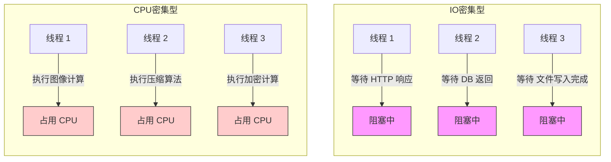

很好，下面我为你清晰解释什么是 IO 密集型场景（IO-bound workload），并结合你现在的 GKE + Pub/Sub + Backend API 的模型来说明它的实际意义。

✅ 什么是 IO 密集型（IO-bound）场景？

一个任务的主要耗时 不是在 CPU 计算上，而是在等待网络、磁盘、数据库、HTTP、外部系统响应等 IO 操作完成。

🧠 对比：CPU 密集型 vs IO 密集型

| 类型 | 说明 | 典型耗时点 | 示例 |
| --- | --- | --- | --- |
| CPU 密集型 | 消耗大量 CPU 进行计算 | 算法/加密/压缩等 | 图像处理、大量循环计算 |
| IO 密集型 | 等待外部系统的响应时间为主 | 网络/Disk/DB/HTTP | 等待 HTTP 返回、调用数据库 |

✅ 为什么你现在的场景属于 IO 密集型？

你当前的 GKE Pod 是：

1. 从 Pub/Sub 拉取消息
2. 把消息封装为 HTTP 请求发给下游 Backend API
3. 然后等待响应（有时要 10~60 秒）

这就属于典型的 线程在等待 HTTP 响应 的情形——CPU 没有做太多事，只是线程处于 阻塞状态（waiting for socket response）。

✅ 可视化线程状态：你现在的线程像这样：

线程 1：HTTP 请求已发出，等待 backend 响应中...（等待中���

线程 2：HTTP 请求已发出，等待 backend 响应中...（等待中）

线程 3：HTTP 请求已发出，等待 backend 响应中...（等待中）

...

这些线程不是在计算，而是在等回包，这就是 IO-bound（IO 密集型）。

✅ IO 密集型的线程模型策略

| 策略 | 原因 |
| --- | --- |
| 可使用比 CPU 多几倍的线程数 | 因为线程大部分时间是 idle/waiting |
| 推荐设置线程超时 | 防止线程永久阻塞 |
| 可使用 async/non-blocking 技术（如 WebClient） | 提高线程复用率，减少线程开销 |
| 搭配 HPA 自动扩容 | 避免线程池打满时服务阻塞 |

✅ 你现在的状态（正确）

你当前是：

- ✅ IO 密集型（大量线程等待 backend 响应）
- ✅ 多线程（executor-threads）+ HPA 协同扩容 ➝ 理想搭配
- ✅ 没有 CPU 计算瓶颈 ➝ 可以设置稍多线程，比如 12~16（见前面建议）

📌 小结一句话

IO 密集型场景：大部分时间在「等」，而不是「算」，这时候可以通过增加线程数或异步化来提高吞吐能力。

是否需要我帮你画一张 IO 密集 vs CPU 密集的线程状态比较图？可以用来内部解释。

 
✅ 各类线程模型场景对比表

| 场景类型 | 描述特点 | 常见操作 | 线程状态表现 | 并发策略建议 |
| --- | --- | --- | --- | --- |
| IO 密集型 | 线程大部分时间在等待 IO 完成（网络、磁盘、API） | 调用 HTTP、访问数据库、文件上传 | 多线程挂起等待 | ✅ 增加线程数 / 异步处理 |
| CPU 密集型 | 线程大部分时间在做计算（压缩、加密、算法） | 图片处理、视频转码、大量数学计算 | 持续占用 CPU | ✅ 减少线程数、提升单线程性能 |
| 内存密集型 | 内存分配/回收频繁，GC 频繁 | 大对象构造、Map/Cache操作 | 快速膨胀，频繁 GC | ⚠️ 限制对象生命周期，优化 GC |
| 混合型 | 同时包含计算与 IO，比如分析数据后写入文件 | 数据管道、日志处理、流量分析等 | 有计算也有等待 | 📌 异步 + 合理线程池划分 |

✅ Mermaid：IO 密集 vs CPU 密集的线程状态比较图

✅ 总结：如何选择线程策略？

| 应对策略 | IO 密集型 | CPU 密集型 |
| --- | --- | --- |
| 线程数 | ✅ 可适当放宽，如 2~10 × CPU | ⚠️ 建议 = CPU 核数或略少 |
| 异步编程 | ✅ 推荐（如 WebClient） | ❌ 意义不大 |
| HPA 扩容 | ✅ 内存/线程多时触发 | ✅ CPU 高时触发 |
| 调优关键点 | HTTP timeout、线程池大小 | 算法优化、CPU 亲和性等 |