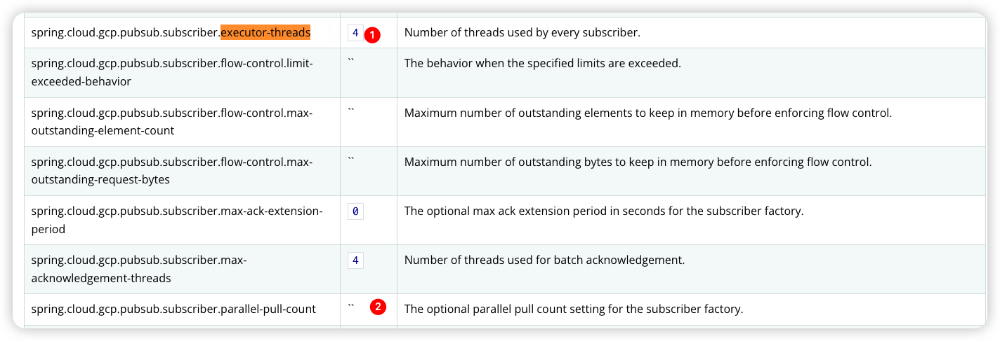

https://docs.spring.io/spring-cloud/docs/Hoxton.SR11/reference/html/configprops.html

- 

我想了解 GCP 平台里面 open_streaming_pulls 这个是干什么的?这个数字以来于什么? 这个是客户端如 GKE  Pod 与 Pub/sub 建立 gRPC 的长连接,那么这个值是在哪里定义的?我们的 GKE  Pod 是 Java 的 Sprint
非常好问题。我们来深入分析一下 **GCP Pub/Sub 中的 open_streaming_pulls** 指标：

---

## **✅** 

## **open_streaming_pulls**

##  **是什么？**

**open_streaming_pulls 是一个监控指标**，表示：

> 当前活跃的、客户端（subscriber）与 Pub/Sub 服务之间建立的 **gRPC StreamingPull 长连接数**。

它主要反映：

- 有多少个 **活跃的 StreamingPull 请求（gRPC）** 被客户端持续打开
- 每个连接代表一个「订阅者线程」或「订阅者实例」正在持续从 Pub/Sub 中拉消息

---

## **✅ 它依赖什么？**

这个数值依赖于以下几个因素：

| **因素**                                 | **说明**                                                                |
| ---------------------------------------- | ----------------------------------------------------------------------- |
| **Pod 实例数**                           | 每个 GKE Pod 中的 subscriber 都可能建立一个 StreamingPull 长连接        |
| **线程数 / executor 配置**               | 同一个 Pod 中，如果你有多个线程或 subscriber client，每个也建立一个连接 |
| **客户端使用的 SDK 版本**                | 比如 Java Pub/Sub client 是否使用 StreamingPull 模式（默认是）          |
| **是否启用 Subscriber concurrency 设置** | 比如通过配置线程池或 executor 提升并发，也会增加连接数                  |

---

## **✅ Java Spring GKE Pod 中，这个值是怎么决定的？**

你提到你们的 GKE Pod 使用 Java（Spring），这说明你们使用的是 **spring-cloud-gcp** 或 Google 原生的 com.google.cloud.pubsub.v1.Subscriber。

### **默认行为**

- 每个 **Subscriber 实例** 会建立一个 **StreamingPull 的 gRPC 长连接**
- 所以你有几个 Subscriber，就有几个 open_streaming_pulls

### **举例分析**

假设你配置如下：

```
spring.cloud.gcp.pubsub.subscriber.executor-threads=4
```

在 Java 配置中实际可能是：

```
Subscriber subscriber =
    Subscriber.newBuilder(subscriptionName, messageReceiver)
              .setExecutorProvider(
                  InstantiatingExecutorProvider.newBuilder().setExecutorThreadCount(4).build())
              .build();
```

#### **那么 open_streaming_pulls 大概是多少？**

| **情况**                              | **open_streaming_pulls 大概是多少**              |
| ------------------------------------- | ------------------------------------------------ |
| 1 个 Pod，单个线程                    | ≈ 1                                              |
| 1 个 Pod，配置 4 线程                 | ≈ 1（仅一个 StreamingPull 连接，线程不等于连接） |
| 4 个 Pod，每个 1 连接                 | ≈ 4                                              |
| 4 个 Pod，每个手动创建多个 Subscriber | ≈ 4 ~ N                                          |

> ⚠️ 注意：**线程数 ≠ 连接数**。Pub/Sub Java client 默认是通过 **单个 StreamingPull 连接 + 多线程处理消息**。

---

## **✅ 怎么确认连接数和优化？**

你可以：

1. **在 Cloud Monitoring 中查看 open_streaming_pulls 指标按 Pod 或 instance 标签聚合**
2. **查看 Pod 内日志，或设置 client metrics 观察 StreamingPull 数**
3. **优化连接数建议**：

| **优化目标**           | **建议操作**                                  |
| ---------------------- | --------------------------------------------- |
| 提高并发但不增加连接数 | 增加 executor-threads，每个连接可并发处理消息 |
| 增加连接数             | 增加 Pod 数量，或使用多个 Subscriber 实例     |
| 限制连接数             | 通过配置连接池或控制 Subscriber 实例创建      |

---

## **✅ 总结表格**

| **指标名称**         | **描述**                                                                   |
| -------------------- | -------------------------------------------------------------------------- |
| open_streaming_pulls | 当前活跃的 gRPC StreamingPull 连接数                                       |
| 决定因素             | Pod 数量、是否使用多个 Subscriber、是否使用 StreamingPull 模式等           |
| 在 Java 中表现       | 每个 Subscriber 实例对应一个连接，线程数用于并发处理不增加连接数           |
| 配置建议             | 使用线程池提升并发；增加 Pod 数量增加连接；避免一个 Pod 打多个连接除非必要 |

---

需要我帮你分析你们当前 open_streaming_pulls 和 GKE Pod 的实际关系，也可以贴出你们使用的 Subscriber 初始化配置或 Spring 的 application.yml 相关段落，我可以进一步判断实际连接数来源。

### 关键要点

- “open_streaming_pulls”似乎是 GCP Pub/Sub 中一个指标，显示当前活动的流式拉取连接数量，研究表明它与订阅者的 gRPC 长连接有关。
- 这个值可能不是直接由用户定义，而是由 Pub/Sub 客户端库根据流控设置和负载动态管理的。
- 在 Java Spring 应用中，流控设置（如最大未处理消息数量）可以通过 Spring Cloud GCP 的配置属性间接影响连接数量。

---

### 什么是“open_streaming_pulls”及其来源

“open_streaming_pulls”是一个 GCP Pub/Sub 服务的监控指标，表示当前为某个订阅开启的流式拉取（StreamingPull）连接数量。这些连接是订阅者（如 GKE Pod 中的 Java Spring 应用）与 Pub/Sub 服务之间建立的 gRPC 长连接，用于实时接收消息。  
研究表明，这个值不是用户直接设置的，而是由 Pub/Sub 服务根据订阅者的行为和配置动态计算的。它反映了订阅者当前正在使用的连接数量，以确保能够及时处理传入的消息。

### 在 Java Spring 应用中如何定义

在 GKE Pod 运行的 Java Spring 应用中，“open_streaming_pulls”的值不是直接配置的，而是通过 Pub/Sub 客户端库的流控设置间接影响的。Spring Cloud GCP 提供了 Pub/Sub 的集成支持，用户可以通过 Spring Boot 的配置文件（如`application.properties`或`application.yml`）设置流控参数，例如：

- `spring.cloud.gcp.pubsub.subscription.[subscription-name].flow-control.max-outstanding-element-count`：设置最大未处理消息数量。
- `spring.cloud.gcp.pubsub.subscription.[subscription-name].flow-control.max-outstanding-request-bytes`：设置最大未处理请求的字节数。
- `spring.cloud.gcp.pubsub.subscription.[subscription-name].flow-control.limit-exceeded-behavior`：设置当流控限制被超过时的行为（默认是“Block”，即阻塞）。

这些设置会影响 Pub/Sub 客户端库在后台管理流式拉取连接的数量。例如，如果设置了较高的最大未处理消息数量，客户端库可能会打开更多的流式拉取连接来处理更多的消息。

---

---

### 详细报告

#### 引言

本文旨在详细解答 GCP 平台中“open_streaming_pulls”的功能、来源以及在 GKE Pod 运行的 Java Spring 应用中如何定义的问题。我们将从 Pub/Sub 服务的流式拉取机制入手，探讨其与客户端库的交互，并结合 Spring Cloud GCP 的配置方式，提供全面的分析。

#### “open_streaming_pulls”的定义与功能

“open_streaming_pulls”是一个 GCP Pub/Sub 服务的监控指标，专门用于显示当前为某个订阅开启的流式拉取（StreamingPull）连接数量。流式拉取是一种通过 gRPC 长连接实现的机制，允许订阅者（如 GKE Pod 中的应用）实时接收 Pub/Sub 主题的消息。与传统的拉取（Pull）模式不同，流式拉取保持持久连接，消息一有可用即可发送，从而提供较低的延迟和高吞吐量。

根据官方文档，Pub/Sub 建议使用流式拉取模式来实现高吞吐量和低延迟，尤其是在需要实时处理消息的场景中。例如，在 2025 年 6 月 17 日的 Pub/Sub 文档中提到：“对于使用 StreamingPull 的客户端，为了实现一致的低延迟，建议维持多个开放的 StreamingPull 连接。”这表明“open_streaming_pulls”指标的目的是确保有足够的连接来处理传入消息，避免单点故障和延迟。

#### 这个数字的来源

“open_streaming_pulls”的值不是由用户直接定义的，而是由 Pub/Sub 服务根据订阅者的配置和当前负载动态管理的。具体来说：

- 它反映了订阅者当前正在使用的流式拉取连接数量，这些连接由 Pub/Sub 客户端库在后台维护。
- 连接数量受流控设置（Flow Control Settings）的影响，例如最大未处理消息数量（max outstanding element count）和最大未处理请求字节数（max outstanding request bytes）。这些设置决定了客户端库在拉取消息时的行为。
- 此外，Pub/Sub 服务的配额和限制也会影响连接数量。例如，2025 年 6 月 12 日的文档提到，Pub/Sub 对流式拉取连接有配额限制，用户可以通过监控仪表板查看当前使用情况。

#### 在 Java Spring 应用中的定义

对于在 GKE Pod 中运行的 Java Spring 应用，Pub/Sub 的集成通常通过 Spring Cloud GCP 模块实现。用户可以通过配置文件设置流控参数，从而间接影响“open_streaming_pulls”的值。以下是相关配置的详细说明：

##### 流控设置的配置方式

Spring Cloud GCP 提供了 Pub/Sub 的抽象层，允许用户通过属性文件配置流控设置。以下是常见的配置属性：

| 配置属性                                                                                              | 描述                                            | 是否必需 | 默认值 |
| ----------------------------------------------------------------------------------------------------- | ----------------------------------------------- | -------- | ------ |
| `spring.cloud.gcp.pubsub.subscription.[subscription-name].flow-control.max-outstanding-element-count` | 最大未处理消息数量，超过此值将触发流控          | 否       | 无限制 |
| `spring.cloud.gcp.pubsub.subscription.[subscription-name].flow-control.max-outstanding-request-bytes` | 最大未处理请求的字节数，超过此值将触发流控      | 否       | 无限制 |
| `spring.cloud.gcp.pubsub.subscription.[subscription-name].flow-control.limit-exceeded-behavior`       | 当流控限制被超过时的行为（例如“Block”表示阻塞） | 否       | Block  |

这些配置通常在`application.properties`或`application.yml`中设置，例如：

```
spring.cloud.gcp.pubsub.subscription.my-subscription.flow-control.max-outstanding-element-count=1000
spring.cloud.gcp.pubsub.subscription.my-subscription.flow-control.max-outstanding-request-bytes=10485760
spring.cloud.gcp.pubsub.subscription.my-subscription.flow-control.limit-exceeded-behavior=Block
```

##### 如何影响“open_streaming_pulls”

这些流控设置会影响 Pub/Sub 客户端库的拉取行为。例如，如果`max-outstanding-element-count`设置为 1000，客户端库会确保最多有 1000 条未处理的未确认消息。这可能会导致客户端库打开更多的流式拉取连接，以确保能够及时拉取和处理消息。然而，连接数量的具体管理是由客户端库内部逻辑决定的，用户无法直接设置“open_streaming_pulls”的值。

根据 2023 年 9 月 20 日的博客文章，流式拉取连接的数量还受到消息吞吐量的影响：“每个流式拉取连接可以处理 10 MB/s，因此在调整流控设置时需要考虑消息吞吐量。”这意味着，较高的吞吐量需求可能会导致更多的连接被打开，从而增加“open_streaming_pulls”的值。

#### 与 GKE Pod 的集成

在 GKE Pod 中运行的 Java Spring 应用通常通过容器化部署，Pub/Sub 的配置需要在应用的配置文件中完成。Spring Cloud GCP 会自动与 GKE 环境集成，确保 Pod 可以与 Pub/Sub 服务建立 gRPC 长连接。需要注意的是，GKE 的网络配置（如 VPC 和防火墙规则）需要支持 gRPC 通信，以确保流式拉取连接的正常工作。

#### 总结与建议

- “open_streaming_pulls”是一个监控指标，反映当前活动的流式拉取连接数量，来源是 Pub/Sub 服务的动态管理。
- 在 Java Spring 应用中，通过 Spring Cloud GCP 的流控设置（如`max-outstanding-element-count`）可以间接影响连接数量，但无法直接配置“open_streaming_pulls”的值。
- 建议根据应用的吞吐量需求调整流控设置，并通过 GCP 监控仪表板观察“open_streaming_pulls”指标，确保连接数量满足性能需求。

#### 参考资料

- [Pub/Sub 文档 - 拉取订阅](https://cloud.google.com/pubsub/docs/pull)
- [Pub/Sub 文档 - 流控](https://cloud.google.com/pubsub/docs/flow-control-messages)
- [Spring Cloud GCP 文档 - Pub/Sub](https://googlecloudplatform.github.io/spring-cloud-gcp/reference/html/pubsub.html)
-
