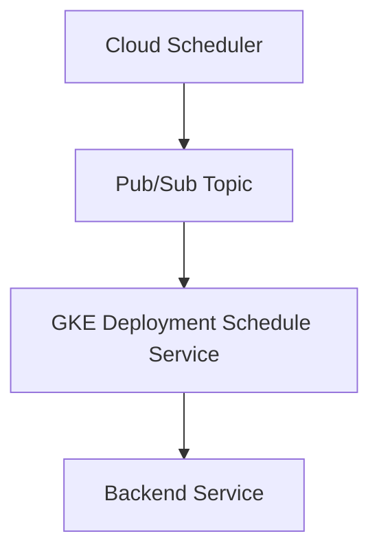
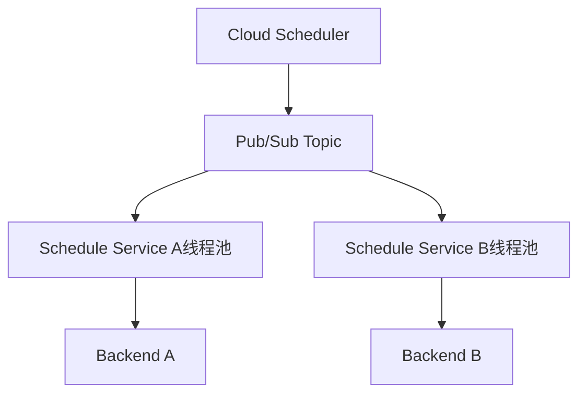

你当前的服务结构如下所示：

当前问题可以归纳为：
	•	Java 服务在 GKE 中串行处理 Pub/Sub 推送的任务。
	•	多个用户提交任务时，任务在处理队列中串行排队。
	•	某个用户任务（如 A 用户）发生失败或超时，触发重试机制后，阻塞了其他用户任务（如 B 用户）。
	•	RetryConfig 设置较为激进（最长 backoff 可达 3600s），加剧了队列堵塞。

---

一、问题本质

你遇到的问题归根结底是：

队列内任务处理串行化 + 错误重试引起堵塞，导致用户任务间互相干扰，影响服务质量。

---

二、优化目标
	•	用户任务隔离：避免 A 用户任务阻塞 B 用户。
	•	合理的重试策略：限制单个任务的影响范围。
	•	提高并发处理能力：支持更多任务并发处理。

---

三、优化方案

✅ 方案 1：用户级别隔离队列

方式：
	•	将不同用户的任务分发到不同的 Pub/Sub topic 或使用统一 topic + 用户字段进行路由分发。
	•	GKE 中的服务通过用户 ID 或任务 ID 拆分为独立的消费队列或并发线程池。

优点：
	•	避免 A 用户任务影响 B 用户任务。
	•	可结合 Kubernetes 的并发控制和 Java 的异步处理进行扩展。

示意：


---

✅ 方案 2：并发处理 + Task Queue 隔离

方式：
	•	Java 服务中增加任务队列调度器，将任务按用户或任务类型分配到不同线程或线程池处理。
	•	可借助 ExecutorService 或 Spring TaskExecutor 实现。

```java
ExecutorService executor = Executors.newFixedThreadPool(10);
executor.submit(() -> processTask(taskA));
executor.submit(() -> processTask(taskB));
```

优点：
	•	不需要修改 Pub/Sub 架构，适合快速改造。
	•	多个任务可以并行处理，不互相阻塞。

---

✅ 方案 3：优化 Retry 策略

你的当前 Retry 策略配置是：

| 参数 | 当前配置 | 问题描述 |
| --- | --- | --- |
| minBackoff | 5s | 起步 OK |
| maxBackoff | 3600s (1h) | 时间过长���任务重试拉长阻塞时间 |
| maxDoublings | 16 | 超过合理指数范围，影响任务响应 |
| retryCount | 3 | 如果配合长 backoff，效率很差 |

建议配置：

| 参数 | 建议值 | 理由 |
| --- | --- | --- |
| minBackoff | 5s | 保持 |
| maxBackoff | 60s | 限制最大重试时间，避免拖慢队列 |
| maxDoublings | 5 | 控制增长速率 |
| retryCount | 2 或 3 | 保持一致或减少 |


---

✅ 方案 4：Backend Failure 快速失败

在 GKE Service 或 Java 应用层增加以下控制：
	•	Backend 超时检测：限制 backend 响应时间，如 10 秒。
	•	快速失败机制：Backend 无响应或异常则立刻失败，不进入长重试。

```java
HttpClient client = HttpClient.newBuilder()
    .connectTimeout(Duration.ofSeconds(3))
    .build();

HttpRequest request = HttpRequest.newBuilder()
    .timeout(Duration.ofSeconds(10))
    .build();
```

---

✅ 方案 5：Dead Letter Queue (DLQ)

将失败的任务直接投递到 DLQ，记录日志而非阻塞重试。

```yaml
deadLetterPolicy:
  deadLetterTopic: projects/your-project/topics/dead-letter-topic
  maxDeliveryAttempts: 3
```

可异步分析后续处理，避免影响主流程。

---

四、推荐组合方案（实用建议）

推荐实践组合：
	1.	并发消费：任务异步处理，��户间互不影响。
	2.	精简 Retry 策略：限制 backoff 上限，避免任务占用队列。
	3.	快速失败机制 + Backend Timeout 控制。
	4.	建立 DLQ，保障失败任务后续可分析。
	5.	若资源允许，长期目标建议按用户分队列/线程池隔离。

---

五、总结

| 问题 | 优化建议 |
| --- | --- |
| 任务串行阻塞 | 用户任务隔离 + 并发处理 |
| Retry 重试过久 | 缩短 maxBackoff，限制 doublings |
| Backend 异常 | 快速失败 + 设置超时时间 |
| 消息丢失 | 设置 DLQ |


# gemini 

优化GCP中的异步任务处理：Pub/Sub到GKE工作流的韧性与并发增强策略
I. 执行摘要
本报告旨在解决用户在GCP工作流中遇到的关键阻塞问题，该工作流由Cloud Scheduler触发，消息流经Pub/Sub Topic，由部署在GKE Deployment Service中的Java应用程序处理，并最终调用Backend Service。当前，当GKE部署的Java应用程序处理任务时，如果一个任务（例如来自用户A的任务）遇到后端错误或超时，它会阻塞后续任务（例如来自用户B的任务）的处理。现有的Pub/Sub订阅重试配置（maxBackoffDuration 3600s, maxdoublings: 16, minBackoffduration: 5s, Retrycount 3）进一步加剧了这些延迟。
为应对此挑战，本报告提出了一项多层次的优化策略，其核心在于增强解耦、提升并发性、实现健壮的错误处理以及动态扩展。关键建议包括：实施Pub/Sub死信主题（DLQ），优化订阅重试策略，引入Cloud Tasks以实现高级任务管理，改进Java应用程序的并发性和韧性模式（例如熔断器），以及利用基于Pub/Sub积压指标的GKE水平Pod自动扩缩（HPA）。
最终目标是将当前的同步式阻塞行为转变为一个高度韧性、可扩展且非阻塞的异步处理系统，从而确保一致的性能并最大限度地减少对用户的影响。
II. 理解当前架构及问题陈述
2.1 当前工作流分析
现有的架构遵循一个顺序流：Cloud Scheduler启动任务，这些任务将消息发布到Pub/Sub Topic。随后，这些消息由部署在GKE Deployment Service中的Java应用程序消费，该应用程序处理消息并与Backend Service进行交互。
Pub/Sub在其中充当核心消息骨干网，其设计旨在实现消息交付的可扩展性、可用性和低延迟 。它能够处理各种负载维度，包括消息速率和积压大小 。当消息发布后，Pub/Sub会立即将其写入存储并向发布者发送确认，保证消息将被传递到所有附加的订阅。同时，消息也会被传递给订阅者，订阅者在处理完消息后会向Pub/Sub发送确认 。
GKE部署作为Java应用程序的��算层，负责消费来自Pub/Sub的消息。Eventarc可以用于将Pub/Sub主题连接到GKE服务，充当事件转发器，它从Pub/Sub拉取事件并将其转发到目标GKE服务 。Backend Service代表最终的处理步骤，Java应用程序会调用它来完成任务。
2.2 根本原因识别
问题的核心在于部署在GKE中的Java应用程序（即“Schedule service”）。用户明确指出：“如果有多用户递交任务 比如A和B用于。A用户的数据一定要等到A的返回 但是如果A的Backend 有错误或超时，那么A的这个任务就会Block后面的B的任务。”（如果多个用户，如A和B，提交任务，用户A的数据必须等待A的返回。但如果A的后端出现错误或超时，A的任务将阻塞用户B的后续任务。）
这种行为强烈表明阻塞发生在GKE部署的Java应用程序的消息处理逻辑内部。虽然Pub/Sub本质上是异步的，旨在解耦生产者和消费者 ，但Java应用程序似乎以同步或并发不足的方式处理消息。Pub/Sub设计用于高吞吐量和低延迟的消息传递，支持多个订阅者并发拉取消息，并且Java客户端库也提供了并发控制功能 。如果Pub/Sub能够并发传递消息，并且GKE能够运行多个应用程序实例，那么任务阻塞的唯一逻辑点就是Java应用程序的内部处理逻辑。这意味着，即使消息由不同的线程或Pod并发接收，但消息的内部处理（特别是对Backend Service的调用）正在阻塞线程或进程，从而阻止其接收新消息或释放资源供其他任务使用。这是一个典型的同步I/O操作或应用程序内部线程池受限的症状。
因此，对当前架构的分析表明，阻塞现象很可能源于GKE部署的Java应用程序内部的同步处理或并发不足，而非Pub/Sub本身。单个长时间运行、错误或超时的后端服务调用会有效垄断资源，阻止其他消息被处理。Pub/Sub将消息视为“未决”状态，直到其确认截止时间到期或消息被确认 。如果GKE服务由于后端错误或超时未能及时确认消息，Pub/Sub将重新投递该消息 。
2.3 Pub/Sub订阅重试策略的影响
用户当前的Pub/Sub订阅重试配置为：maxBackoffDuration 3600s、maxdoublings: 16、minBackoffduration: 5s、Retrycount 3。
Pub/Sub的订阅重试策略决定了如果消息未在acknowledgment deadline内确认或发送了否定确认，消息将如何被重新投递 。默认情况下，Pub/Sub的重试策略设置为“立即重试”，但也可以设置为“指数退避延迟后重试” 。用户提供的配置表明正在使用指数退避策略。
对Pub/Sub文档的分析显示，Pub/Sub订阅重试策略的maxBackoffDuration（最大退避持续时间）最大允许值为600秒（10分钟） 。用户指定的3600s（1小时）远超此限制。这表明可能存在配置错误，即该值可能被截断或忽略，或者用户指的是在不同层（例如，Java应用程序内部或由另一个编排器）实现的重试机制。无论如何，如果Java应用程序正在阻塞，一个较长的maxBackoffDuration（即使是有效的600秒）与Retrycount 3（这可能指的是死信主题的最大投递尝试次数）相结合，意味着一个有问题的信息可以在“未决”状态下经历长时间的重试尝试，从而可能占用订阅者实例或租约，并导致后续任务的感知阻塞。用户提到的“这样B任务可能等待的时间更久”直接反映了这种影响。
这种差异表明，用户指定的maxBackoffDuration 3600s很可能配置不当，或者指的是应用程序级别的重试，因为Pub/Sub的最大值为600秒。这种不一致性不仅指向潜在的配置错误，还强化了Java应用程序内部重试逻辑（或其缺乏，导致其持有消息）是导致阻塞问题的重要因素的假设。未被及时确认的消息会触发Pub/Sub的重试机制，每次重试都会导致消息再次被投递给订阅者。如果Java应用程序在处理这些重试消息时仍然阻塞，就会形成一个负面反馈循环，导致任务A的持续失败和重试长时间占用资源，从而延迟任务B的执行。
III. 韧性异步系统的基本原则
3.1 解耦与故障隔离
事件驱动架构是解耦微服务的核心模式，其中服务对状态变化（事件）作出反应，而无需了解彼此的内部实现 。这种松散耦合至关重要，因为它意味着如果一个服务失败，其他服务不会受到影响，从而增强了系统的韧性 。
在当前架构中，后端调用失败与Pub/Sub消息确认/重试机制之间的紧密耦合是阻塞的根源。分析发现，尽管使用了Pub/Sub，但当前架构在GKE处理层表现出紧密耦合的特性，这抵消了Pub/Sub固有的解耦优势。用户描述的问题“用户A的数据必须等待A的返回，但如果A的后端出现错误或超时，A的任务将阻塞用户B的后续任务”直接违背了这种解耦的基本原则。如果用户A的任务阻塞了用户B的任务，则意味着存在一种依赖关系或共享瓶颈，这在正确解耦的系统中不应存在。由于Pub/Sub本身旨在实现解耦，并且GKE可以托管多个独立的Pod，因此耦合必然发生在Java应用程序处理消息并与后端服务交互的点。这意味着Java应用程序的内部设计或其与后端服务的交互模型正在创建同步瓶颈，即使消息是异步到达的。因此��解决方案必须重新引入真正的异步处理和故障隔离，将每个任务视为一个独立的工作单元。
熔断器模式是防止分布式系统中级联故障的关键架构模式。它充当代理，暂时阻止对故障服务的访问，防止应用程序重复尝试可能失败的操作 。这使得应用程序可以在不等待故障修复的情况下继续运行，并快速拒绝可能失败的操作请求，从而保持系统响应时间 。
3.2 并发与可扩展性
Pub/Sub旨在处理大量消息（每秒数百万条）和高吞吐量，使其适用于可扩展的事件驱动架构 。Google Kubernetes Engine (GKE) 支持水平Pod自动扩缩（HPA），可以根据各种指标动态扩缩工作负载，包括Pub/Sub积压指标 。这确保了处理能力随着传入消息量的增加而扩展。
在Java应用程序内部，Pub/Sub客户端库提供了并发控制功能，例如setParallelPullCount()，用于配置拉取消息的线程或流的数量，从而实现更多的并发处理 。异步编程和非阻塞I/O对于Java应用程序的可扩展性和响应性至关重要，特别是对于I/O密集型操作（如对后端服务的网络请求） 。这种方法允许应用程序处理大量并发连接而不会阻塞线程，从而提高资源利用率和整体性能。
对Pub/Sub积压进行扩缩是降低延迟的主��措施。如果积压增长，则表明当前处理能力不足，从而允许系统在用户体验到显著延迟之前进行扩缩。这优于基于CPU利用率的被动扩缩，后者可能仅在性能下降后才触发 。
3.3 幂等性与消息处理保证
Pub/Sub提供“精确一次交付”功能，在云区域内基于Pub/Sub定义的唯一消息ID 。这保证了消息至少被交付一次，并在成功确认后防止重复。然而，如果消息被否定确认或在处理完成前确认截止时间到期，仍可能发生重新投递 。这在用户的问题场景中很常见，因为错误或超时会阻止及时确认。
最佳实践要求订阅者在确认消息之前处理消息 。如果处理在确认之前失败，Pub/Sub将重新投递消息。虽然Pub/Sub提供了“精确一次交付”的保证，但这指的是消息交付到订阅者。应用程序本身仍必须以幂等方式处理可能重新投递的消息。Pub/Sub提供的唯一消息ID  是在后端服务中实现幂等性的关键工具。这意味着，即使Java应用程序由于重试而多次接收同一消息，其对后端服务执行的操作也应确保最终系统状态保持一致，避免重复创建或更新资源。
IV. 全面优化策略与最佳实践
A. 增强Pub/Sub订阅配置以处理故障
4.1 实施死信主题（DLQ）
机制： 死信主题���DLQ）充当一个暂存队列，用于存放那些在经过配置的最大投递尝试次数后仍无法成功投递或被订阅者确认的消息 。这可以防止“毒丸消息”在主订阅上无休止地重试，从而避免阻塞其他消息并耗尽资源 。一旦消息被移动到DLQ，它就会从主订阅中删除，从而释放主订阅的处理能力以处理其他任务。
配置步骤：
 * 创建专用死信主题： 此主题应与源主题分开 。
 * 为DLQ创建订阅： 为防止DLQ中的消息丢失，必须至少有一个订阅附加到它 。此辅助订阅可用于手动检查、调试或自动化重新处理失败的消息。
 * 配置主订阅： 在现有Pub/Sub订阅上启用死信功能，指定新创建的死信主题和maximum number of delivery attempts（最大投递尝试次数，默认5次，最小5次，最大100次） 。此值决定了Pub/Sub在将消息移动到DLQ之前尝试重新投递消息的次数。
 * 授予IAM角色： 确保Pub/Sub服务账号在死信主题上具有pubsub.publisher角色，并在主订阅上具有pubsub.subscriber角色，以启用消息转发 。
价值： 通过隔离有问题的信息，DLQ确保用户A持续失败的任务��会无限期地占用主订阅，从而允许用户B的任务在没有长时间延迟的情况下得到处理。它为调试和从无法处理的消息中恢复提供了一个关键机制 。
用户查询中提到的Retrycount 3很可能指的是死信主题的max_delivery_attempts。如果未正确配置DLQ，这些消息将根据指数退避策略无限期地重试，从而导致阻塞问题。DLQ的存在将“阻塞式重试”转变为“快速失败并隔离”的机制。它是一个必要的被动机制，用于清理无法处理的消息，但它不能从根本上改变导致初始阻塞的GKE应用程序内部的同步处理模型。
表：Pub/Sub死信主题配置参数
| 参数名称 | 描述 | 推荐值（针对此场景） | 默认值 | 最小/最大值 |
|---|---|---|---|---|
| dead-letter-topic | 用于接收无法投递消息的死信主题名称。 | 专用主题（例如：your-topic-name-dlq） | 无 | N/A |
| max-delivery-attempts | 在将消息转发到死信主题之前，Pub/Sub尝试投递消息的最大次数。 | 5-10 | 5 | 5-100 |
| dead-letter-topic-project | 死信主题所属的项目ID（如果与主订阅不同）。 | 主订阅所在项目ID | 无 | N/A |
4.2 优化Pub/Sub订阅重试策略
建议：
 * 在DLQ到位的情况下，订阅重试策略的目的从“最终成功”转变为“快速识别和隔离��障”。
 * 用户当前配置的maxBackoffDuration 3600s（1小时）过长。尽管maxdoublings: 16可能导致长时间延迟，但Pub/Sub实际允许的最大maxBackoffDuration为600秒（10分钟） 。将此值设置超过600秒，Pub/Sub仍会将其上限设为600秒。
 * 考虑将maxBackoffDuration调整为更激进的值（例如60-300秒），并结合较低的maxdoublings（例如5-10）和DLQ的max_delivery_attempts（例如5-10）。这确保了如果GKE服务在几次快速尝试后仍无法处理消息，消息会迅速移动到DLQ。
 * minBackoffduration: 5s对于初始重试是合理的。
价值： 重试策略应与DLQ相辅相成。它应允许对瞬时问题进行几次快速重试，但如果问题持续存在，消息应被移动到DLQ，而不是通过长时间的指数退避来阻塞主队列。用户当前的maxBackoffDuration 3600s很可能是一个配置错误或误解，因为Pub/Sub会将其上限设为600秒 。这凸显了需要仔细审查所有配置参数与文档限制的一致性。目标不是等待一小时让消息重试，而是快速识别和隔离有问题的信息。重试策略与DLQ结合使用，成为故障隔离的工具，而不是仅仅重新尝试投递。在没有适当应用程序并发或DLQ的情况下，激进的重试策略可能会加剧阻塞问题，但与DLQ结合的良好调整的策略对于快速识别和隔离持续失败的消息至关重要，从而最大限度地减少它们对其他任务的影响。
4.3 消息排序考量
分析： 用户查询暗示不同用户（A和B）的任务是独立的。如果不同用户的任务之间不需要严格的相对排序，并且单个用户的任务之间也不需要严格排序，则可以禁用消息排序。
影响： 如果消息排序已启用（例如，使用排序键），Pub/Sub会保证具有相同键的消息的有序投递 。然而，“后续消息的确认不会被处理，直到同一排序键的先前消息的确认被处理” 。这意味着如果用户A的第一条消息失败且未被确认，则用户A的后续消息（具有相同排序键）将不会被投递，直到第一条消息被确认或移动到DLQ 。如果处理不当，这可能会重新引入特定用户任务的阻塞。
策略：
 * 如果不需要排序： 禁用订阅上的消息排序。这允许Pub/Sub并行投递消息，而无需等待具有相同键的先前消息的确认，从而最大限度地提高并发性。
 * 如果需要排序（例如，按用户）：
   * 确保Java应用程序在单个处理单元内按顺序处理具有相同排序键的消息，但允许并行处理具有不同排序键的消息。
   * 至关重要的是，对具有排序键的失败消息实施健壮的错误处理和快速否定确认（nack）或DLQ转发。这对于防止单个失败消息阻塞该特定排序键的所有后续消息至关重要 。
   * 对于推送订阅，Pub/Sub一次只支持每个排序键一条未决消息，因此拉取/流式拉取订阅通常更适合高吞吐量的有序消息 。
用户描述的问题（“用户A的数据必须等待A的返回，但如果A的后端出现错误或超时，A的任务将阻塞用户B的后续任务”）表明可能存在隐式排序要求或对并发如何影响任务流的误解。如果用户确实在使用排序键（即使未明确说明），则用户A的单个失败消息（带有排序键）将确实阻塞该同一排序键的所有后续消息，直到失败消息被确认或死信处理。虽然这不会直接阻塞用户B的不同排序键，但如果许多此类有序流被停滞，则可能导致资源争用和整体系统积压。
B. 改进GKE部署服务的韧性与并发性（Java应用程序）
4.4 Java应用程序并发控制
利用Pub/Sub Java客户端库设置： Pub/Sub的Java客户端库提供了并发控制功能，用于管理拉取消息的线程或流的数量 。
 * setParallelPullCount()：配置用于拉取消息的并行流的数量。如果应用程序不是CPU密集型，增加此值可以提高吞吐量 。
 * setExecutorProvider()：自定义用于消息处理的执行器，允许在多个订阅者客户端之间使用共享的、有限的线程池来控制整体线程创建 。
 * MaxOutstandingMessages：限制订阅者客户端将并发处理的未确认消息的数量 。
   建议使用高级客户端库和异步拉取模式（StreamingPull API）以实现最大吞吐量和最低延迟 。异步拉取模式将消息接收与处理解耦，从而提高响应速度 。
实现异步编程模式： Java应用程序与后端服务的交互很可能是主要的阻塞点。为了防止这种情况，应用程序必须采用非阻塞I/O和异步编程模式。
 * 非阻塞I/O： Java支持异步非阻塞I/O操作，这允许线程启动操作（例如，调用后端服务）然后继续执行其他任务，而无需等待操作完成 。这提高了资源利用率和性能，特别是对于I/O密集型操作 。
 * CompletableFuture： Java中用于异步编程的强大构造，能够创建非阻塞API 。它允许链接依赖的异步操作并处理其结果或异常。
 * Project Reactor / Spring WebFlux： 对于响应式编程模型，这些框架提供了处理带有背压的异步数据流的健壮方法 。Spring WebFlux专为REST API中的异步非阻塞I/O操作而设计 。响应式发布者（Mono/Flux）发出项目，订阅者消费它们，并具有背压机制来控制消息流 。
价���： 当前的阻塞行为强烈表明Java应用程序内部对后端服务的同步调用。通过采用异步模式，GKE Pod可以并发处理多个Pub/Sub消息，而不会因单个缓慢的后端调用而阻塞整个线程或Pod。简单地增加Pub/Sub客户端库中的setParallelPullCount()或MaxOutstandingMessages  而不在Java应用程序本身采用非阻塞I/O，只会增加单个GKE Pod中被阻塞的线程数。核心问题在于对后端服务的调用本质上是阻塞的。实现CompletableFuture或Spring WebFlux/Project Reactor等响应式框架  至关重要。这使得应用程序能够并发处理多个后端请求而不会占用线程，从而真正将Pub/Sub消息的处理与后端服务的延迟解耦。这是应用程序内部架构实现韧性所需的基本转变。
表：Java Pub/Sub客户端库关键并发设置
| 设置名称 | 描述 | 对并发的影响 | 推荐范围/注意事项 |
|---|---|---|---|
| setParallelPullCount() | 用于拉取消息的并行流/连接数。 | 增加并发消息获取能力。 | 根据应用程序处理能力和GKE Pod资源进行调整；过高可能导致资源耗尽。 |
| setExecutorProvider() | 自定义用于消息处理的线程执行器。 | 允许对处理线程池进行细粒度管理。 | 根据CPU/I/O密集型任务进行调整；可使用共享执行器限制线程数。 |
| MaxOutstandingMessages | 订阅者将并发处理的未确认消息的最大数量。 | 防止客户端过载。 | 调整此值以平衡吞吐量和系统容量。 |
| Pull Mode | 消息检索方法。 | 实现更高吞吐量和更低延迟。 | 推荐使用StreamingPull/异步模式。 |
4.5 实施应用程序级韧性模式
除了内部并发性之外，Java应用程序还必须实现韧性模式，以优雅地处理与后端服务交互时的故障和减速。
 * 熔断器模式（例如，Resilience4j）：
   * 机制： 熔断器充当对后端服务调用的代理。它监控故障（例如，超时、错误）。如果故障率超过定义的阈值，熔断器将“打开”，立即使后续对后端服务的调用失败，而不是等待超时 。在可配置的waitDurationInOpenState之后，它会转换为“半开”状态，允许有限数量的测试请求来确定后端服务是否已恢复。如果成功，它会关闭；否则，它会重新打开 。
   * 实现： Resilience4j等库为Java提供了健壮的实现，支持同步和异步调用（例如，CompletableFuture、Project Reactor的Mono/Flux） 。
   * 价值： 这种模式可以防止Java应用程序重复攻击不健康的后端服务，否则会导致线程长时间阻塞和Pub/Sub消息超时。通过快速失败，它释放资源以处理其他消息或任务。熔断器和舱壁模式充当主动防御，防止GKE服务因后端故障而过载。应用程序级重试处理即时的瞬时错误。这使得韧性负担从Pub/Sub的广泛重试转移到应用程序的细粒度控制，从而加快恢复速度并减少阻塞。
 * 舱壁模式：
   * 机制： 舱壁模式通过限制对特定下游服务（例如，后端服务）的并发调用数量来隔离故障。它防止单个失败或缓慢的依赖项耗尽调用应用程序中的所有可用资源（如线程池） 。
   * 实现： Resilience4j也支持舱壁模式，可配置为基于信号量或线程池的隔离 。
   * 价值： 即使后端服务只是“慢速”（未完全宕机），舱壁也能确保Java应用程序只有一部分线程被占用，从而使其他线程能够处理其他消息（例如，来自用户B的消息）或与服务进行交互。这可以防止资源耗尽并提高应用程序的整体响应能力。
 * 应用程序级重试：
   * 机制： 对于非常短的瞬时错误（例如，网络故障、临时后端故障），Java应用程序可以在考虑调用为硬故障之前，实现自己的快速、短持续时间重试（例如，1-3次尝试，最小退避）。
   * 区别： 这些与Pub/Sub的订阅重试不同。Pub/Sub重试是关于消息投递；应用程序级重试是关于应用程序内特定业务操作的成功。
   * 价值： 这减少了Pub/Sub本身需要重新投递消息的次数，因为轻微的瞬时问题可以在应用程序的处理生命周期内快速解决。
C. 架构优化：引入Cloud Tasks以实现健壮的任务管理
4.6 Cloud Tasks的理由
Cloud Tasks是一个完全托管的异步任务管理服务，旨在实现大量分布式任务的可靠执行、分派和交付 。它擅长将复杂、长时间运行或需要大量重试的逻辑从主应用程序流中卸载 。
Cloud Tasks提供对任务执行的精细控制，包括高度可配置的重试策略、队列级别的速率限制和并发控制 。它与包括Pub/Sub在内的其他GCP服务无缝集成 ，并且可以针对任何HTTP端点，包括GKE服务 。
价值： 这种架构转变是解决用户问题的“最佳时机方案”。GKE服务不再直接处理可能长时间运行和需要重试的后端服务调用，而是可以简单地将任务“入队”到Cloud Tasks。这使得GKE服务能够立即确认Pub/Sub消息，从而释放Pub/Sub订阅及其处理能力以处理其他消息（用户B的任务）。然后，Cloud Tasks接管可靠执行和重试后端服务调用的责任。
引入Cloud Tasks引入了额外的异步处理和重试管理层。这是一个重要的架构决策，它将复杂的重试逻辑从GKE应用程序中移出，并��Pub/Sub订阅中分离。这完全解放了Pub/Sub订阅，使其不再因后端故障而阻塞，因为GKE服务在将消息移交给Cloud Tasks后会迅速确认消息。它还集中了重试管理，使其更具可观察性和可配置性。
4.7 建议的增强流程
Cloud Scheduler -> Pub/Sub Topic -> GKE Deployment (初始处理/验证) -> Cloud Tasks (用于后端服务交互和重试) -> Backend Service。
在此模型中：
 * Cloud Scheduler向Pub/Sub Topic发布消息。
 * GKE Deployment Service（Java应用程序）从Pub/Sub Topic消费消息。
 * Java应用程序执行初始验证和轻量级处理。
 * Java应用程序不是直接调用Backend Service并处理重试，而是创建并将新任务入队到Cloud Tasks Queue。此任务包含Backend Service所需的有效负载。
 * Java应用程序立即确认Pub/Sub消息。这至关重要，因为它向Pub/Sub发出信号，表明消息已成功“处理”（即，已移交给Cloud Tasks），从而防止Pub/Sub重新投递它。
 * Cloud Tasks随后将任务分派到Backend Service（该服务仍可托管在GKE或任何其他HTTP端点上） 。
 * Cloud Tasks独立管理对Backend Service调用的所有重试、退避和速率限制。
将复杂、长时间运行的重试逻辑从Pub/Sub订阅或GKE应用程序转移到Cloud Tasks，从根本上将系统���“交付时重试”模型转变为“执行时重试”模型，从而提供卓越的隔离和控制。一旦任务进入Cloud Tasks，Cloud Tasks就负责其对后端服务的执行和重试。如果后端服务失败，Cloud Tasks会重试任务，而不是原始的Pub/Sub消息。
4.8 Cloud Tasks配置与优势
重试配置 ： Cloud Tasks为每个队列提供了高度可配置的重试参数：
 * maxAttempts：任务的最大尝试次数。可设置为-1表示无限重试。
 * maxRetryDuration：从首次尝试开始，重试失败任务的总时间限制。
 * minBackoff和maxBackoff：定义重试尝试之间的最小和最大延迟。
 * maxDoublings：控制重试间隔加倍的次数。
队列级控制 ：
 * maxBurstSize：使用令牌桶算法控制任务分派速率。
 * maxConcurrentTasks：限制Cloud Tasks将从队列中并发分派的最大任务数。这对于保护后端服务免受过载并确保受控并发至关重要。
定位GKE服务： Cloud Tasks可以将任务分派到任何HTTP端点，包括部署在GKE上的服务 。这些HTTP目标的身份验证可以使用服务账号进行配置 。
优势总结：
 * 解耦： 完全将初始Pub/Sub消息处理与后端交互及其重试逻辑分离。
 * 可靠性： 即使后端暂时不可用，也能通过可配置的重试保证任务执行。
 * 可扩展性： 异步管理大量任务，并可独立扩展。
 * 流量控制： 通过队列级速率限制和并发控制防止后端过载。
 * 可见性： 提供仪表板以实时跟踪任务状态和工作流进度 。
表：Pub/Sub订阅重试与Cloud Tasks重试对比
| 特性 | Pub/Sub订阅重试 | Cloud Tasks重试 |
|---|---|---|
| 重试范围 | 消息投递给订阅者 / 确认截止时间到期 | 任务对HTTP目标（例如，后端服务）的执行 |
| 主要目的 | 保证消息投递；处理瞬时订阅者问题 | 保证任务执行；管理后端操作的复杂重试逻辑 |
| 重试机制 | 原始Pub/Sub消息的重新投递 | 特定任务（HTTP请求）的重新执行 |
| 并发控制 | 依赖订阅者客户端流控制和GKE HPA | 显式队列级maxConcurrentTasks和maxBurstSize |
| 阻塞影响 | 未确认消息可能阻塞订阅者资源/租约，导致同一订阅上其他消息的延迟 | 任务失败/重试仅限于特定任务；不阻塞队列中或上游服务的其他任务 |
| 最大退避持续时间 | 600秒  | 可配置（可远超，例如数小时/数天）  |
| 最大尝试次数 | 100（在移至DLQ之前）  | 可配置（-1表示无限）  |
| 理想用例 | ��件流、简单扇出、基本解耦 | 可靠的后台作业执行、长时间运行任务、复杂重试逻辑、速率限制、微服务集成  |
D. 使用水平Pod自动扩缩（HPA）进行动态扩缩
4.9 使用Pub/Sub积压指标配置HPA
机制： GKE的水平Pod自动扩缩（HPA）可以根据观察到的CPU利用率、内存使用情况或自定义/外部指标自动扩缩部署中的Pod数量 。对于Pub/Sub消费者，HPA可以配置为基于Pub/Sub积压指标进行扩缩，这些指标由Cloud Monitoring自动收集 。这允许根据实际等待处理的消息负载进行主动扩缩。
HPA的关键指标：
 * subscription/num_unacked_messages_by_region：此指标表示Pub/Sub订阅中未确认消息的数量。根据此指标进行扩缩可确保有足够的Pod来消费积压 。
 * subscription/oldest_unacked_message_age_by_region：此指标指示最旧的未确认消息的年龄。该值的上升表明消息被卡住或处理过慢，从而触发扩缩 。
HPA与Pub/Sub的最佳实践：
 * 使用区域指标： 始终使用Pub/Sub指标的_by_region后缀，以确保对单区域中断的韧性以及准确的积压计算 。
 * 结合信号： 不要仅依赖Pub/Sub指标。将其与CPU利用率和内存使用情况等其他信号结合使用，以提供更全面、更可靠的自动扩缩策略 。
 * 设置最小Pod数量： 保持GKE部署的最小任务计数大于零（minReplicas > 0），以确保始终有Pod准备好处理传入消息，即使在低负载期间或指标暂时不可用时 。
价值： 基于Pub/Sub积压的主动扩缩直接解决了任务（如B）因处理能力不足而等待其他任务（如A）的问题。它确保GKE服务能够动态调整以适应不断变化的消息量，从而保持低延迟并防止队列积压。HPA在Pub/Sub积压上进行扩缩对于扩缩容量至关重要，但它不能从根本上解决由同步应用程序逻辑或Pod内的单线程瓶颈引起的阻塞；它只能确保有更多的Pod可用，但这些Pod本身可能仍然被卡住。HPA对于水平可扩展性至关重要，但它补充而非取代了应用程序内部优化的需求，以确保单个消息被高效处理且不会在单个处理单元内造成阻塞。
表：Pub/Sub消费者的推荐HPA指标
| 指标名称 | 描述 | 类型 | 自动扩缩的益处 | 考量因素 |
|---|---|---|---|---|
| kubernetes.io/container/cpu/utilization | Pod的CPU利用率。 | 资源 | 成本效益，最大化CPU资源利用率。 | 滞后指标，扩缩过程中可能出现延迟。 |
| pubsub.googleapis.com/subscription/num_unacked_messages_by_region | Pub/Sub订阅中未确认消息的数量（按区域）。 | 外部 | 主动扩缩，减少延迟，确��积压得到处理。 | 需结合其他指标，避免单一信号故障。 |
| pubsub.googleapis.com/subscription/oldest_unacked_message_age_by_region | Pub/Sub订阅中最旧未确认消息的年龄（按区域）。 | 外部 | 关键的延迟指标，指示消息是否被卡住。 | 需结合其他指标，避免单一信号故障。 |
| kubernetes.io/container/memory/usage | Pod的内存使用量。 | 资源 | 防止内存耗尽，提高稳定性。 | 需结合其他指标，避免过度扩缩。 |
V. 最佳时机方案与实施路线图
解决当前阻塞问题的“最佳时机方案”并非单一修复，而是一个分层的方法。立即的配置更改提供了快速的缓解，而更深层次的架构更改则构建了长期的韧性与可扩展性。
优先推荐：
即时缓解（第一阶段 - 基础设施与配置）：
 * 配置Pub/Sub死信主题（DLQ）： 这是最关键的即时步骤，可防止有问题的信息阻塞主订阅。将max_delivery_attempts设置为合理的较低值（例如，5-10），并确保DLQ附加了单独的订阅以进行监控 。
 * 调整Pub/Sub订阅重试策略： 将maxBackoffDuration修正为Pub/Sub实际限制的600秒以内 。调整maxdoublings和minBackoffduration，以允许在死信处理前进行几次快速重试。
 * 实施基于Pub/Sub积压指标的GKE水平Pod自动扩缩（HPA��： 使用subscription/num_unacked_messages_by_region和subscription/oldest_unacked_message_age_by_region以及CPU利用率来配置HPA。设置最小副本数大于0 。
中期架构改进（第二阶段 - 应用程序与集成）：
 * 重构Java应用程序以实现异步处理： 使用CompletableFuture或Spring WebFlux/Project Reactor等响应式框架，为后端服务调用实现非阻塞I/O模式。这对于内部并发性至关重要 。
 * 集成应用程序级韧性模式： 为后端服务调用实施熔断器（例如，Resilience4j）以防止级联故障。考虑使用舱壁进行资源隔离，并为瞬时后端错误实施应用程序级重试 。
 * 优化Pub/Sub Java客户端库并发： 调整Java Pub/Sub客户端中的setParallelPullCount()、setExecutorProvider()和MaxOutstandingMessages，以匹配应用程序的处理能力和GKE Pod资源 。
长期战略增强（第三阶段 - 高级任务管理）：
 * 引入Cloud Tasks进行后端交互： 重新设计GKE服务，将对后端服务的调用任务入队到Cloud Tasks，而不是直接调用。这可以卸载复杂的重试逻辑、速率限制，并提供健壮的异步执行 。
 * 将KEDA与Cloud Tasks集成（可选但推荐）： 如果引入了Cloud Tasks，考虑使用KEDA根据Cloud Tasks队列深度来扩缩GKE服务（现在充当Cloud Tasks工作器） 。
分阶段实施方法：
 * 第一阶段（即时影响）： 专注于基础设施和配置更改，这些更改所需的代码更改最少。这将通过隔离有问题的信息和启用响应式扩缩来快速缓解阻塞问题。
 * 第二阶段（应用程序优化）： 解决Java应用程序的内部并发性和韧性。这需要代码更改和彻底测试，但能显著提高系统的健壮性和性能。
 * 第三阶段（架构演进）： 实施Cloud Tasks以实现更复杂和集中的任务管理和重试机制。这是一个更大的架构转变，但为长时间运行或易失败的后端交互提供了最健壮和可扩展的解决方案。
优先考虑DLQ和HPA可以确保系统能够优雅地处理故障并有效扩缩，即使在进行大量代码重构之前也是如此。
VI. 监控与可观测性
为了有效管理和排查优化后的架构，全面的监控和可观测性至关重要。
需要跟踪的关键指标：
 * Pub/Sub：
   * subscription/num_unacked_messages_by_region：未确认消息积压（对于HPA和识别处理瓶颈至关重要） 。
   * subscription/oldest_unacked_message_age_by_region：最旧未确认消息的年龄（对于延迟至关重要） 。
   * subscription/acked_message_count：成功确认消息的速率。
   * subscription/sent_message_count：发送给订阅者的消息速率。
   * subscription/pull_request_count / subscription/push_request_count：订阅者活动。
   * topic/message_sizes：消息大小分布。
   * topic/send_request_count：发布到主题的消息速率。
   * dead_letter_topic/message_count：DLQ中的消息数量（表示持续性故障）。
 * GKE部署（Schedule Service）：
   * 资源利用率： CPU利用率、内存利用率（用于HPA和识别资源瓶颈） 。
   * 应用程序特定指标： 吞吐量（每秒处理的消息数）、错误率（对后端服务的调用、内部处理错误）、延迟（每条消息的端到端处理时间、后端调用延迟）。
   * Resilience4j指标： resilience4j.circuitbreaker.calls（成功、失败、不允许）、resilience4j.circuitbreaker.state（CLOSED、OPEN、HALF_OPEN）、resilience4j.circuitbreaker.failure.rate 。这些指标提供了对后端健康状况和熔断器行为的深入了解。
 * Cloud Tasks（如果实施）：
   * queue/task_count：队列中的任务数量（用于KEDA和识别Cloud Tasks瓶颈）。
   * queue/dispatch_count：任务分派速率。
   * queue/retry_count：Cloud Tasks执行的重试次数。
   * queue/failed_task_count：所有重试后最终失败的任务数量。
 * Backend Service：
   * 吞吐量（每秒请求数）。
   * 错误率（HTTP 5xx、应用程序错误）。
   * 延迟（响应时间）。
   * 资源利用率（CPU、内存、网络）。
利用Cloud Monitoring和Cloud Logging：
 * Cloud Monitoring： 创建自定义仪表板以可视化这些关键指标。为阈值设置警报策略（例如，未确认消息计数过高、最旧消息年龄过高、熔断器打开状态、后端错误率过高） 。
 * Cloud Logging： 确保Java应用程序内部的全面日志记录，包括请求ID、用户ID和详细错误消息。使用结构化日志以便于查询和分析。与Cloud Trace集成以进行分布式跟踪，从而了解端到端消息流并识别跨服务的瓶颈 。
任何优化的有效性都依赖于持续监控。如果没有适当的可观测性，诊断未来问题或验证已实施更改的成功将变得困难。指标和详细日志的结合提供了系统健康状况和性能所需的可见性。
VII. 结论
当前GCP工作流中的阻塞问题源于Java应用程序的故障/超时，并因Pub/Sub重试策略而加剧，可以通过多层次的优化方法有效解决。
通过实施Pub/Sub死信主题、优化订阅重试策略、通过异步编程和韧性模式（熔断器、舱壁）增强Java应用程序的并发性，以及利用基于Pub/Sub积压指标的GKE HPA，系统将实现显著改进的故障隔离、响应能力和可扩展性。
战略性地引入Cloud Tasks进一步将重试管理与GKE服务解耦，为可靠的后端任务执行提供了健壮且集中的机制。
这些优化，加上全面的监控和可观测性，将把当前架构转变为一个高度韧性、可扩展且非阻塞的异步任务处理系统，从而确保多用户任务提交的卓越用户体验和操作效率。