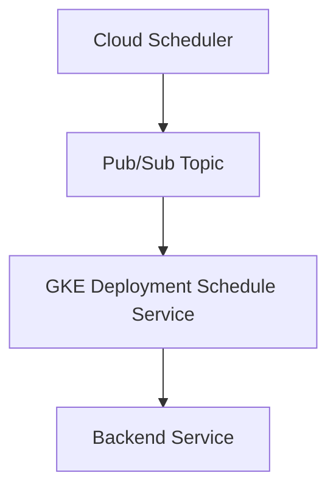
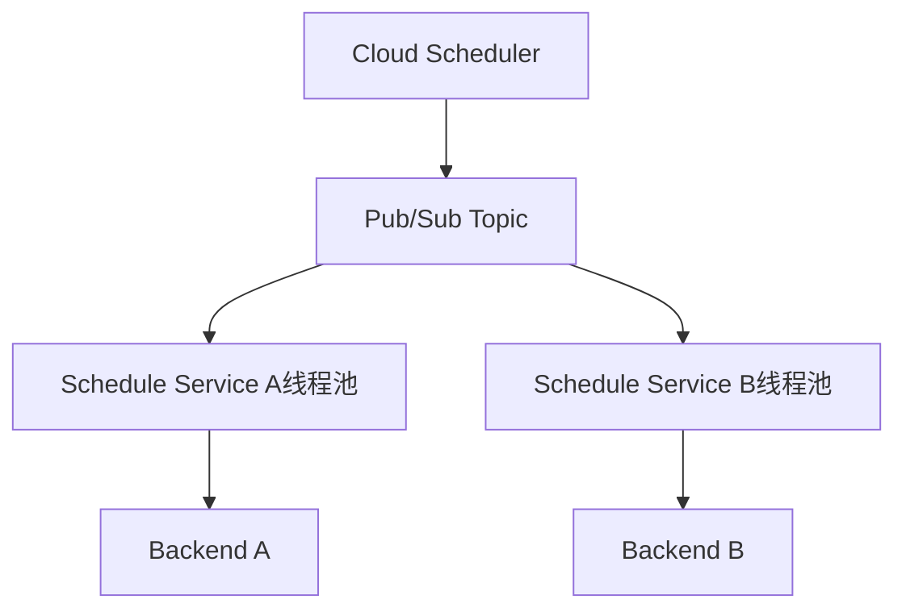

你当前的服务结构如下所示：

当前问题可以归纳为：
	•	Java 服务在 GKE 中串行处理 Pub/Sub 推送的任务。
	•	多个用户提交任务时，任务在处理队列中串行排队。
	•	某个用户任务（如 A 用户）发生失败或超时，触发重试机制后，阻塞了其他用户任务（如 B 用户）。
	•	RetryConfig 设置较为激进（最长 backoff 可达 3600s），加剧了队列堵塞。

⸻

一、问题本质

你遇到的问题归根结底是：

队列内任务处理串行化 + 错误重试引起堵塞，导致用户任务间互相干扰，影响服务质量。

⸻

二、优化目标
	•	用户任务隔离：避免 A 用户任务阻塞 B 用户。
	•	合理的重试策略：限制单个任务的影响范围。
	•	提高并发处理能力：支持更多任务并发处理。

⸻

三、优化方案

✅ 方案 1：用户级别隔离队列

方式：
	•	将不同用户的任务分发到不同的 Pub/Sub topic 或使用统一 topic + 用户字段进行路由分发。
	•	GKE 中的服务通过用户 ID 或任务 ID 拆分为独立的消费队列或并发线程池。

优点：
	•	避免 A 用户任务影响 B 用户任务。
	•	可结合 Kubernetes 的并发控制和 Java 的异步处理进行扩展。

示意：

⸻

✅ 方案 2：并发处理 + Task Queue 隔离

方式：
	•	Java 服务中增加任务队列调度器，将任务按用户或任务类型分配到不同线程或线程池处理。
	•	可借助 ExecutorService 或 Spring TaskExecutor 实现。

ExecutorService executor = Executors.newFixedThreadPool(10);
executor.submit(() -> processTask(taskA));
executor.submit(() -> processTask(taskB));

优点：
	•	不需要修改 Pub/Sub 架构，适合快速改造。
	•	多个任务可以并行处理，不互相阻塞。

⸻

✅ 方案 3：优化 Retry 策略

你的当前 Retry 策略配置是：

参数	当前配置	问题描述
minBackoff	5s	起步 OK
maxBackoff	3600s (1h)	时间过长，任务重试拉长阻塞时间
maxDoublings	16	超过合理指数范围，影响任务响应
retryCount	3	如果配合长 backoff，效率很差

建议配置：

参数	建议值	理由
minBackoff	5s	保持
maxBackoff	60s	限制最大重试时间，避免拖慢队列
maxDoublings	5	控制增长速率
retryCount	2 或 3	保持一致或减少

⸻

✅ 方案 4：Backend Failure 快速失败

在 GKE Service 或 Java 应用层增加以下控制：
	•	Backend 超时检测：限制 backend 响应时间，如 10 秒。
	•	快速失败机制：Backend 无响应或异常则立刻失败，不进入长重试。

HttpClient client = HttpClient.newBuilder()
    .connectTimeout(Duration.ofSeconds(3))
    .build();

HttpRequest request = HttpRequest.newBuilder()
    .timeout(Duration.ofSeconds(10))
    .build();

⸻

✅ 方案 5：Dead Letter Queue (DLQ)

将失败的任务直接投递到 DLQ，记录日志而非阻塞重试。

deadLetterPolicy:
  deadLetterTopic: projects/your-project/topics/dead-letter-topic
  maxDeliveryAttempts: 3

可异步分析后续处理，避免影响主流程。

⸻

四、推荐组合方案（实用建议）

推荐实践组合：
	1.	并发消费：任务异步处理，用户间互不影响。
	2.	精简 Retry 策略：限制 backoff 上限，避免任务占用队列。
	3.	快速失败机制 + Backend Timeout 控制。
	4.	建立 DLQ，保障失败任务后续可分析。
	5.	若资源允许，长期目标建议按用户分队列/线程池隔离。

⸻

五、总结

问题	优化建议
任务串行阻塞	用户任务隔离 + 并发处理
Retry 重试过久	缩短 maxBackoff，限制 doublings
Backend 异常	快速失败 + 设置超时时间
消息丢失	设置 DLQ

