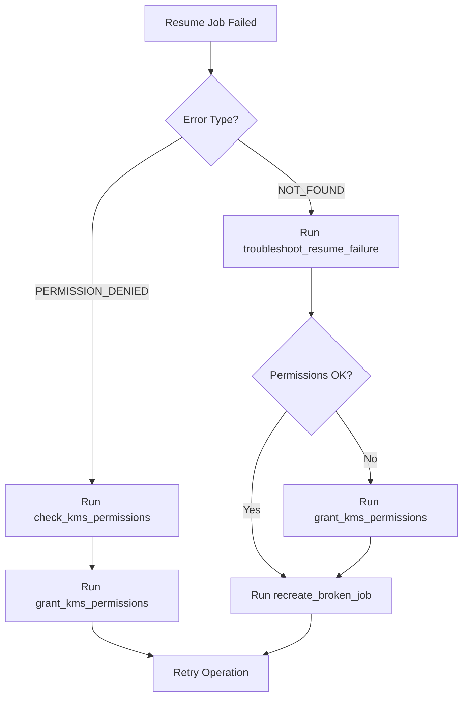

# GCP Pub/Sub CMEK Manager - Usage Guide

## 概述 (Overview)

`pubsub-cmek-manager.sh` 是一个全面的 Shell 脚本，用于管理带有 CMEK 加密的 GCP Pub/Sub 主题和 Cloud Scheduler 任务。

This is a comprehensive shell script for managing GCP Pub/Sub topics with CMEK encryption and Cloud Scheduler jobs.

## 快速开始 (Quick Start)

### 1. 配置环境变量 (Configure Environment Variables)

在运行脚本之前，设置以下环境变量：

```bash
export PROJECT_ID="your-project-id"
export LOCATION="europe-west2"
export KEY_RING="your-key-ring"
export KEY_NAME="your-key-name"
export TOPIC_NAME="your-topic-name"
export JOB_NAME="your-job-name"
```

### 2. 运行方式 (Usage Methods)

#### 交互式菜单 (Interactive Menu)
```bash
./pubsub-cmek-manager.sh
```

#### 直接调用函数 (Direct Function Call)
```bash
# 创建 CMEK 主题
./pubsub-cmek-manager.sh create_topic_with_cmek

# 检查权限
./pubsub-cmek-manager.sh check_kms_permissions

# 完整工作流
./pubsub-cmek-manager.sh full_setup_workflow
```

## 核心功能 (Core Functions)

### 主题管理 (Topic Management)

#### `create_topic_with_cmek [topic_name]`
创建带有 CMEK 加密的 Pub/Sub 主题。

**示例 (Example)**:
```bash
./pubsub-cmek-manager.sh create_topic_with_cmek "my-encrypted-topic"
```

#### `describe_topic [topic_name]`
显示主题详细信息，包括加密密钥。

#### `delete_topic [topic_name]`
删除 Pub/Sub 主题。

### Scheduler 任务管理 (Scheduler Job Management)

#### `create_scheduler_job [job_name] [topic_name] [schedule]`
创建 Cloud Scheduler 任务。

**示例 (Example)**:
```bash
./pubsub-cmek-manager.sh create_scheduler_job "my-job" "my-topic" "*/5 * * * *"
```

#### `describe_scheduler_job [job_name]`
显示 Scheduler 任务详情。

#### `resume_scheduler_job [job_name]`
恢复暂停的任务。

**重要 (Important)**: 如果遇到 `NOT_FOUND` 错误，说明内部 stream 已损坏，需要使用 `recreate_broken_job`。

#### `pause_scheduler_job [job_name]`
暂停运行中的任务。

#### `delete_scheduler_job [job_name]`
删除 Scheduler 任务。

### 权限管理 (Permission Management)

#### `get_service_agents`
获取并显示 Pub/Sub 和 Scheduler 的服务代理邮箱。

**输出示例 (Output Example)**:
```
PUBSUB_SA=service-123456@gcp-sa-pubsub.iam.gserviceaccount.com
SCHEDULER_SA=service-123456@gcp-sa-cloudscheduler.iam.gserviceaccount.com
```

#### `check_kms_permissions`
检查服务代理是否拥有 KMS 密钥的加密/解密权限。

**检查项 (Checks)**:
- ✓ Scheduler SA 是否有 `cryptoKeyEncrypterDecrypter` 角色
- ✓ Pub/Sub SA 是否有 `cryptoKeyEncrypterDecrypter` 角色

#### `grant_kms_permissions [grant_scheduler] [grant_pubsub]`
授予服务代理 KMS 权限。

**示例 (Example)**:
```bash
# 授予两个服务代理权限
./pubsub-cmek-manager.sh grant_kms_permissions true true

# 只授予 Scheduler SA
./pubsub-cmek-manager.sh grant_kms_permissions true false
```

#### `verify_all_permissions`
完整的权限验证，返回汇总报告。

### 故障排查 (Troubleshooting)

#### `troubleshoot_resume_failure [job_name]`
诊断 `resume` 失败的原因。

**诊断检查 (Diagnostic Checks)**:
1. 任务是否存在
2. 目标主题配置（是否 CMEK 加密）
3. KMS 权限是否正确

#### `recreate_broken_job [job_name]`
删除并重建损坏的 Scheduler 任务。

**使用场景 (Use Case)**: 当 `resume` 操作返回 `NOT_FOUND` 错误时。

**工作流程 (Workflow)**:
1. 读取当前任务配置
2. 删除旧任务
3. 使用相同配置重建任务

### 测试功能 (Testing Functions)

#### `simulate_job_status [status] [job_name]`
模拟不同的任务状态。

**支持的状态 (Supported States)**:
- `ENABLED` - 创建启用状态的任务
- `PAUSED` - 创建并暂停任务
- `FAILED` - 显示如何模拟失败状态

#### `test_resume_scenarios`
测试 resume 操作的各种场景。

### 工作流函数 (Workflow Functions)

#### `full_setup_workflow`
完整的设置工作流，包括：

1. ✓ 验证前置条件
2. ✓ 获取服务代理
3. ✓ 创建 CMEK 主题
4. ✓ 授予 KMS 权限
5. ✓ 创建 Scheduler 任务
6. ✓ 验证所有配置

**示例 (Example)**:
```bash
./pubsub-cmek-manager.sh full_setup_workflow
```

#### `cleanup_resources`
清理所有测试资源。

**删除内容 (Deletes)**:
- Scheduler 任务
- Pub/Sub 主题

**注意 (Note)**: KMS 权限不会被删除，需要手动清理。

### 工具函数 (Utility Functions)

#### `validate_prerequisites`
验证必要的工具和权限。

**检查项 (Checks)**:
- `gcloud` CLI 是否安装
- `jq` 是否安装
- 项目 ID 是否有效
- 是否能获取项目编号

## 常见使用场景 (Common Use Cases)

### 场景 1: 首次设置 (Initial Setup)

```bash
# 1. 设置环境变量
export PROJECT_ID="my-project"
export LOCATION="europe-west2"
export KEY_RING="my-keyring"
export KEY_NAME="my-key"
export TOPIC_NAME="my-cmek-topic"
export JOB_NAME="my-scheduler-job"

# 2. 运行完整工作流
./pubsub-cmek-manager.sh full_setup_workflow
```

### 场景 2: 修复 NOT_FOUND 错误 (Fix NOT_FOUND Error)

```bash
# 1. 诊断问题
./pubsub-cmek-manager.sh troubleshoot_resume_failure "my-job"

# 2. 检查权限
./pubsub-cmek-manager.sh check_kms_permissions

# 3. 如果权限缺失，授予权限
./pubsub-cmek-manager.sh grant_kms_permissions

# 4. 重建损坏的任务
./pubsub-cmek-manager.sh recreate_broken_job "my-job"
```

### 场景 3: 仅检查权限 (Permission Check Only)

```bash
# 获取服务代理
./pubsub-cmek-manager.sh get_service_agents

# 检查 KMS 权限
./pubsub-cmek-manager.sh check_kms_permissions

# 验证所有权限
./pubsub-cmek-manager.sh verify_all_permissions
```

### 场景 4: 批量操作 (Batch Operations)

```bash
# 创建多个主题
for topic in topic1 topic2 topic3; do
    ./pubsub-cmek-manager.sh create_topic_with_cmek "$topic"
done

# 为每个主题创建 Scheduler 任务
for i in {1..3}; do
    ./pubsub-cmek-manager.sh create_scheduler_job "job-$i" "topic$i"
done
```

## 错误处理 (Error Handling)

### NOT_FOUND Error

**症状 (Symptom)**:
```
ERROR: (gcloud.scheduler.jobs.resume) NOT_FOUND: Resource 'parent resource not found for .../retryPolicies/...'
```

**原因 (Cause)**:
内部 stream 资源未成功创建，通常是因为：
1. Scheduler SA 缺少 KMS 权限
2. Pub/Sub SA 缺少 KMS 权限
3. 主题未使用 CMEK 加密

**解决方案 (Solution)**:
```bash
# 使用故障排查函数
./pubsub-cmek-manager.sh troubleshoot_resume_failure

# 然后重建任务
./pubsub-cmek-manager.sh recreate_broken_job
```

### Permission Denied

**症状 (Symptom)**:
创建任务或主题时权限被拒绝。

**解决方案 (Solution)**:
```bash
# 授予必要的权限
./pubsub-cmek-manager.sh grant_kms_permissions
```

## 最佳实践 (Best Practices)

### 1. 权限管理 (Permission Management)

**始终授予两个服务代理权限 (Always grant permissions to both service agents)**:
- Cloud Scheduler SA: 用于创建/管理内部 stream
- Pub/Sub SA: 用于消息加密/解密

```bash
./pubsub-cmek-manager.sh grant_kms_permissions true true
```

### 2. 任务重建 (Job Recreation)

**不要尝试修复损坏的任务 (Don't try to fix broken jobs)**:
- `resume` 无法修复损坏的内部 stream
- 始终删除并重建

```bash
./pubsub-cmek-manager.sh recreate_broken_job
```

### 3. 验证流程 (Verification Workflow)

**在创建资源后验证 (Verify after creating resources)**:
```bash
# 创建主题后
./pubsub-cmek-manager.sh describe_topic

# 创建任务后
./pubsub-cmek-manager.sh describe_scheduler_job

# 完整验证
./pubsub-cmek-manager.sh verify_all_permissions
```

### 4. 测试环境 (Testing Environment)

**使用测试资源名称 (Use test resource names)**:
```bash
export TOPIC_NAME="test-cmek-topic"
export JOB_NAME="test-scheduler-job"

# 测试完成后清理
./pubsub-cmek-manager.sh cleanup_resources
```

## 输出示例 (Output Examples)

### 成功创建主题 (Successful Topic Creation)

```
═══════════════════════════════════════════════════════
 Creating Pub/Sub Topic with CMEK
═══════════════════════════════════════════════════════

[INFO] Topic Name: my-cmek-topic
[INFO] Encryption Key: projects/.../cryptoKeys/my-key
[INFO] Creating topic...
[✓ SUCCESS] Topic 'my-cmek-topic' created successfully with CMEK

═══════════════════════════════════════════════════════
 Topic Details: my-cmek-topic
═══════════════════════════════════════════════════════

Topic Information:
  Name:           my-cmek-topic
  Project:        my-project
  Encryption Key: projects/.../cryptoKeys/my-key

[✓ SUCCESS] Topic is properly encrypted with CMEK
```

### 权限检查 (Permission Check)

```
═══════════════════════════════════════════════════════
 Checking KMS Permissions
═══════════════════════════════════════════════════════

[INFO] Checking permissions on key: my-key

Checking Scheduler Service Agent:
[✓ SUCCESS] Scheduler SA has cryptoKeyEncrypterDecrypter role

Checking Pub/Sub Service Agent:
[✓ SUCCESS] Pub/Sub SA has cryptoKeyEncrypterDecrypter role
```

## 故障排查流程图 (Troubleshooting Flowchart)



## 参考文档 (References)

- [schedule-job-resume.md](./schedule-job-resume.md) - Resume 失败详细分析
- [schedule-job-cmek.md](./schedule-job-cmek.md) - CMEK 完整指南
- [pub-sub-cmek-kms-summary.md](./pub-sub-cmek-kms-summary.md) - 权限模型总结

## 技术支持 (Support)

如有问题，请参考：
1. 运行 `validate_prerequisites` 检查环境
2. 运行 `troubleshoot_resume_failure` 诊断问题
3. 查看相关文档了解详细信息
