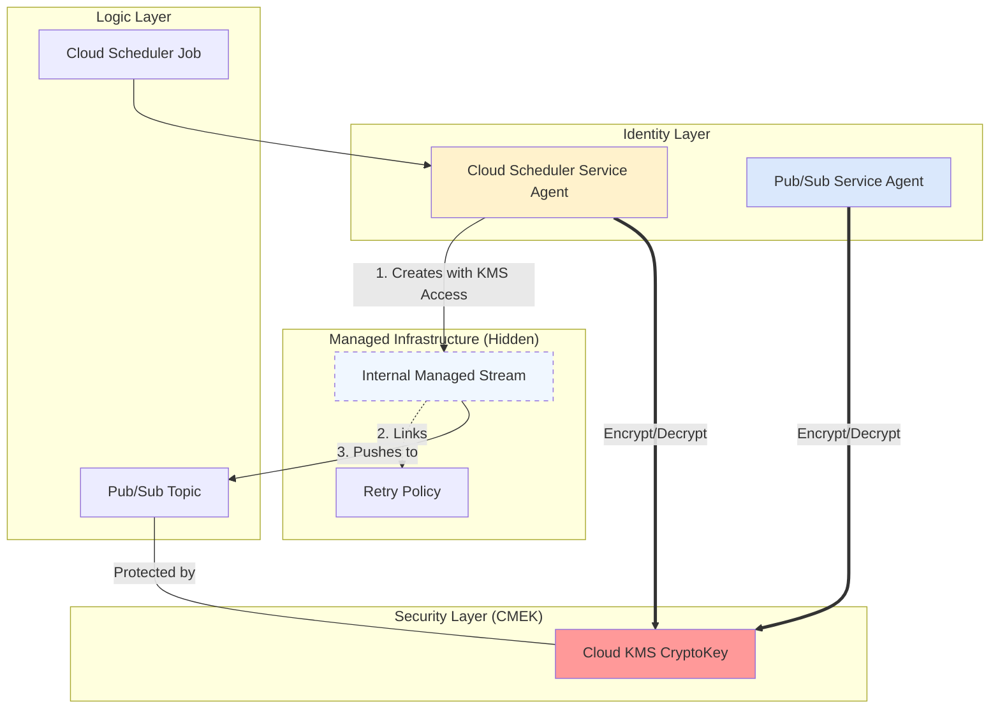

- [Cloud Scheduler \& Pub/Sub CMEK 集成全解析 / The Ultimate Guide to Pub/Sub CMEK with Cloud Scheduler](#cloud-scheduler--pubsub-cmek-集成全解析--the-ultimate-guide-to-pubsub-cmek-with-cloud-scheduler)
  - [1. 核心架构：隐藏的“内部桥梁” (The Hidden Bridge)](#1-核心架构隐藏的内部桥梁-the-hidden-bridge)
    - [关键点](#关键点)
  - [2. 误导性的错误：NOT\_FOUND 之谜](#2-误导性的错误not_found-之谜)
    - [故障传播路径 (Failure Propagation)](#故障传播路径-failure-propagation)
  - [3. 系统拓扑图 / System Topology](#3-系统拓扑图--system-topology)
  - [4. 权限矩阵 (IAM Matrix)](#4-权限矩阵-iam-matrix)
  - [5. 最佳实践操作清单 (Implementation Checklist)](#5-最佳实践操作清单-implementation-checklist)
    - [Step 1: 身份确认](#step-1-身份确认)
    - [Step 2: 集中授权 (原子操作)](#step-2-集中授权-原子操作)
    - [Step 3: 资源位置一致性 (Location Consistency)](#step-3-资源位置一致性-location-consistency)
    - [Step 4: 恢复逻辑 (Delete \& Recreate)](#step-4-恢复逻辑-delete--recreate)
  - [6. 风险评估与建议 (Risk Assessment)](#6-风险评估与建议-risk-assessment)

# Cloud Scheduler & Pub/Sub CMEK 集成全解析 / The Ultimate Guide to Pub/Sub CMEK with Cloud Scheduler

在 Google Cloud 平台中，当组织策略（Organization Policy）强制要求使用客户管理的加密密钥（CMEK）时，跨服务的集成会变得复杂。本指南基于对 Cloud Scheduler 与 Pub/Sub 在 CMEK 环境下集成失败案例的深度分析，旨在提供一个清晰的架构理解和操作范式。

---

## 1. 核心架构：隐藏的“内部桥梁” (The Hidden Bridge)

当 Cloud Scheduler 指向一个 Pub/Sub Topic 时，它并不是简单地发送一个 API 请求。系统会在底层创建一个**托管流（Managed Stream）**。

```infographic
infographic list-row-simple-horizontal-arrow
data
  title Cloud Scheduler to Pub/Sub Interaction
  items
    - label 1. Trigger
      desc Cloud Scheduler Job activates
    - label 2. Create Stream
      desc Scheduler SA creates an Internal Stream
    - label 3. KMS Auth
      desc Stream verifies CMEK access via Scheduler SA
    - label 4. Deliver
      desc Message delivered to Pub/Sub Topic
```

```infographic
infographic list-row-simple-horizontal-arrow
data
  items
    - label Step 1
      desc Initialize
    - label Step 2
      desc Process
    - label Step 3
      desc Complete
```

### 关键点

- **托管流（Managed Stream）**：这是一个由 Cloud Scheduler 服务代为管理的资源，作为 Job 与 Topic 之间的物理连接。
- **权限主体**：创建这个 Stream 的主体是 **Cloud Scheduler Service Agent**，而不是 Pub/Sub 的服务账号。

---

## 2. 误导性的错误：NOT_FOUND 之谜

在 CMEK 环境下，最常见的报错是 `NOT_FOUND`，这往往让开发者误以为资源缺失，但其根因通常是**静默的权限拒绝**。

### 故障传播路径 (Failure Propagation)

1. **权限缺失**：Cloud Scheduler SA 缺少 KMS 密钥的 `cryptoKeyEncrypterDecrypter` 权限。
2. **创建失败**：在创建 Job 或 Resume 时，内部 Stream 因无法访问加密密钥而创建失败。
3. **资源孤立**：相关的重试策略（Retry Policy）无法挂载到不存在的 Stream 上。
4. **报错触发**：由于父级资源（Stream）缺失，系统最终抛出 `NOT_FOUND` 而不是 `PERMISSION_DENIED`。

---

## 3. 系统拓扑图 / System Topology



---

## 4. 权限矩阵 (IAM Matrix)

在 CMEK 强制执行的环境中，必须同时满足以下两个服务代理的权限：

| 服务代理 (Service Agent) | 角色需求 | 触发场景 | 影响 |
| :--- | :--- | :--- | :--- |
| **Cloud Scheduler SA** | `roles/cloudkms.cryptoKeyEncrypterDecrypter` | Job 创建/恢复 (Resume) | 无法创建内部 Stream 导致 `NOT_FOUND` |
| **Pub/Sub SA** | `roles/cloudkms.cryptoKeyEncrypterDecrypter` | 消息发布/投递 | 导致 Topic 消息持久化或解密失败 |

---

## 5. 最佳实践操作清单 (Implementation Checklist)

### Step 1: 身份确认

获取项目编号并识别两个服务代理：

```bash
PROJECT_NUMBER=$(gcloud projects describe ${PROJECT_ID} --format="value(projectNumber)")
SCHEDULER_SA="service-${PROJECT_NUMBER}@gcp-sa-cloudscheduler.iam.gserviceaccount.com"
PUBSUB_SA="service-${PROJECT_NUMBER}@gcp-sa-pubsub.iam.gserviceaccount.com"
```

### Step 2: 集中授权 (原子操作)

**重要提示**：如果 KMS 密钥在不同项目，请确保在 **KMS 所在项目** 执行绑定。

```bash
for SA in ${SCHEDULER_SA} ${PUBSUB_SA}; do
  gcloud kms keys add-iam-policy-binding ${KEY_NAME} \
    --location ${LOCATION} \
    --keyring ${KEY_RING} \
    --project ${KMS_PROJECT_ID} \
    --member "serviceAccount:${SA}" \
    --role "roles/cloudkms.cryptoKeyEncrypterDecrypter"
done
```

### Step 3: 资源位置一致性 (Location Consistency)

确保以下资源的 Location 完全一致（例如都是 `europe-west2`）：

1. Cloud Scheduler Job
2. Pub/Sub Topic
3. Cloud KMS Key (或使用 `global`)

### Step 4: 恢复逻辑 (Delete & Recreate)

由于 `NOT_FOUND` 状态通常意味着内部资源处于损坏状态，**简单的 Resume 无法修复**。

1. **删除**：`gcloud scheduler jobs delete ...`
2. **重新创建**：在权限生效后执行 `gcloud scheduler jobs create ...`

---

## 6. 风险评估与建议 (Risk Assessment)

- **风险 1：权限生效延迟**。IAM 变更可能需要几分钟。建议在创建 Job 前进行验证。
- **风险 2：误导性监控**。由于是内部 Stream 失败，Scheduler Job 的执行日志可能不全。建议检查 Cloud Logging 中来源为 `cloudkms.googleapis.com` 的拒绝记录。
- **风险 3：组织策略冲突**。如果 `constraints/gcp.restrictNonCmekServices` 开启，任何未绑定 CMEK 的资源都将直接失败。

**Alma 的建议**：
在平台级 CI/CD 流水线中，应将“Service Agent 权限检查”作为前置步骤。对于生产环境，建议使用 Terraform 模块，将 KMS 密钥与所有依赖它的 Service Agents 绑定解耦，确保基础设施的鲁棒性。

---

**文档信息 / Metadata**

- **创建者**: Alma
- **关联场景**: GCP Cloud Scheduler, Pub/Sub, CMEK, KMS Troubleshooting
- **最后更新**: 2026-01-25
